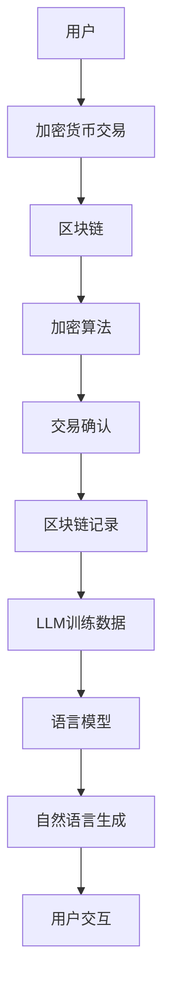

                 

关键词：加密货币、LLM（语言模型）、安全、合规、区块链、人工智能、加密算法、数据保护、隐私、加密货币交易所、合规框架

> 摘要：本文将探讨加密货币与语言模型（LLM）的结合，重点关注这两个领域的安全和合规问题。通过对加密货币的基本概念、工作原理以及LLM的发展与应用的深入分析，本文旨在揭示它们在技术和法律层面上的潜在挑战和解决方案，为从业者和研究人员提供有价值的参考。

## 1. 背景介绍

### 1.1 加密货币的崛起

加密货币是一种数字资产，它利用密码学原理来确保交易的安全和匿名性。比特币（Bitcoin）是第一个加密货币，由中本聪（Satoshi Nakamoto）在2009年提出。比特币的出现标志着去中心化金融的开始，它的核心特点是无需信任第三方机构，通过共识机制确保交易的有效性和安全性。

随着比特币的成功，越来越多的加密货币项目涌现，如以太坊（Ethereum）、莱特币（Litecoin）等。这些加密货币不仅改变了金融行业的运作方式，也激发了人们对去中心化技术和区块链的兴趣。

### 1.2 语言模型的发展

语言模型是人工智能领域的一个重要分支，它旨在理解和生成自然语言。早期的语言模型如n-gram模型和基于统计的模型，在处理简单的文本任务时表现良好。但随着深度学习的兴起，基于神经网络的LLM取得了显著突破。

近年来，LLM如OpenAI的GPT-3、Google的Bard等在自然语言处理任务中展示了惊人的能力，可以生成高质量的文本、回答复杂的问题、进行对话等。LLM的应用范围不断扩大，从搜索引擎到智能客服，再到内容生成和个性化推荐，都取得了显著的成果。

### 1.3 加密货币和LLM的结合

随着加密货币和LLM的快速发展，它们开始相互融合，为各自领域带来了新的机遇和挑战。例如，LLM可以用于加密货币交易策略的优化、市场预测、风险管理等；而加密货币可以用于LLM模型的训练和部署，提供去中心化的计算资源。

这种结合不仅提高了技术的效率，也带来了新的安全和合规问题，特别是在涉及大量资金交易和数据处理的场景中。因此，探讨加密货币和LLM结合的安全性、合规性变得尤为重要。

## 2. 核心概念与联系

### 2.1 加密货币的核心概念

加密货币的核心概念包括区块链、加密算法和共识机制。区块链是一个分布式账本，记录所有的交易记录。加密算法用于保护交易数据的安全性和隐私性，确保只有合法的参与者可以查看和修改账本。共识机制则用于达成所有参与者对交易记录的一致性。

### 2.2 语言模型的核心概念

语言模型的核心概念包括词汇表、语言模型参数和训练数据。词汇表是模型理解自然语言的基础，语言模型参数是模型的关键组成部分，用于预测下一个单词或词组。训练数据是模型训练的重要资源，通过大量的语料库来优化模型参数。

### 2.3 Mermaid流程图

以下是加密货币和LLM结合的Mermaid流程图，展示了它们之间的核心联系：



### 2.4 核心概念之间的联系

加密货币和LLM之间的联系主要体现在以下几个方面：

1. **数据安全**：加密货币的加密算法确保了交易数据的安全性和隐私性，这种安全性对于LLM的训练和应用同样重要。
2. **去中心化**：加密货币的去中心化特性与LLM的去中心化架构有相似之处，都减少了单点故障的风险。
3. **数据处理**：加密货币的交易数据和LLM的语料库都是海量数据，需要高效的存储和处理机制。
4. **资金流动**：加密货币的支付功能可以用于LLM模型的训练费用和部署成本，提供了一种新的资金流动方式。

## 3. 核心算法原理 & 具体操作步骤

### 3.1 算法原理概述

加密货币和LLM的核心算法原理各有特点，但它们在实现过程中需要相互协调。以下是这两个领域的核心算法原理概述：

#### 3.1.1 加密货币的核心算法

1. **区块链**：区块链是一个分布式数据库，通过加密算法和共识机制确保交易记录的不可篡改性。
2. **加密算法**：常见的加密算法包括SHA-256、椭圆曲线加密（ECC）等，用于保护交易数据的安全性和隐私性。
3. **共识机制**：如工作量证明（PoW）、权益证明（PoS）等，用于达成所有参与者对交易记录的一致性。

#### 3.1.2 LLM的核心算法

1. **神经网络**：LLM通常基于深度神经网络，特别是变换器（Transformer）架构，用于捕捉自然语言的复杂关系。
2. **训练数据**：LLM的训练需要大量的文本数据，通过无监督学习或监督学习来优化模型参数。
3. **生成算法**：生成算法用于根据输入生成自然语言输出，常见的生成算法包括采样、注意力机制等。

### 3.2 算法步骤详解

#### 3.2.1 加密货币的操作步骤

1. **交易发起**：用户发起交易，包含发送金额、接收地址等交易信息。
2. **加密处理**：交易信息通过加密算法进行加密，确保隐私和安全。
3. **区块链确认**：交易被发送到区块链网络，通过共识机制进行确认。
4. **记录存储**：交易记录被永久存储在区块链上，确保不可篡改性。

#### 3.2.2 LLM的操作步骤

1. **数据收集**：收集大量的文本数据，用于模型训练。
2. **模型训练**：使用训练数据优化模型参数，通过无监督学习或监督学习。
3. **模型评估**：评估模型在自然语言处理任务上的性能，调整参数以提升效果。
4. **模型部署**：将训练好的模型部署到服务器或设备上，用于生成自然语言输出。

### 3.3 算法优缺点

#### 3.3.1 加密货币的优缺点

**优点**：
1. **安全性**：加密货币的加密算法和共识机制确保了交易数据的安全性和隐私性。
2. **去中心化**：去中心化的特性减少了单点故障的风险，提高了系统的可靠性。
3. **透明度**：区块链上的交易记录是公开透明的，用户可以随时查看。

**缺点**：
1. **效率问题**：区块链的处理速度相对较慢，无法满足高频交易的需求。
2. **能源消耗**：某些共识机制（如PoW）需要大量计算资源，导致能源消耗较高。
3. **监管挑战**：加密货币的匿名性和去中心化特性给监管带来挑战。

#### 3.3.2 LLM的优缺点

**优点**：
1. **自然语言处理能力**：LLM可以生成高质量的文本、回答复杂的问题，具有强大的自然语言理解能力。
2. **高效性**：基于深度神经网络的LLM在处理大量数据时具有高效性。
3. **应用广泛**：LLM可以应用于多个领域，如智能客服、内容生成、个性化推荐等。

**缺点**：
1. **数据依赖性**：LLM的性能高度依赖训练数据的质量和数量，数据质量不佳可能导致模型效果不佳。
2. **安全性问题**：LLM在处理敏感数据时可能存在泄露风险。
3. **监管挑战**：随着LLM的应用越来越广泛，其合规性也面临监管挑战。

### 3.4 算法应用领域

#### 3.4.1 加密货币的应用领域

1. **金融领域**：加密货币被广泛应用于数字货币交易、支付、资产管理等。
2. **供应链管理**：区块链技术确保了供应链的透明度和可追溯性。
3. **数字身份验证**：加密货币和区块链技术可以用于实现安全的数字身份验证。

#### 3.4.2 LLM的应用领域

1. **自然语言处理**：LLM在文本生成、问答系统、机器翻译等领域有广泛应用。
2. **智能客服**：LLM可以用于智能客服系统，提供高效的客户服务。
3. **内容生成**：LLM可以生成高质量的文章、报告、新闻等。

## 4. 数学模型和公式 & 详细讲解 & 举例说明

### 4.1 数学模型构建

加密货币和LLM涉及的数学模型复杂多样，以下是两个领域的基本数学模型构建：

#### 4.1.1 加密货币的数学模型

1. **区块链**：区块链是一个分布式数据库，可以使用哈希函数来构建。假设有一个区块链包含多个区块，每个区块包含交易记录和一个哈希值。区块的哈希值是由前一区块的哈希值、当前区块的交易记录和时间戳等计算得到的。例如：
   $$H(B_{i}) = SHA-256(H(B_{i-1}) + T_{i} + T_{i-1})$$
   其中，$H(B_{i})$表示第i个区块的哈希值，$SHA-256$是哈希函数，$T_{i}$是当前区块的交易记录，$T_{i-1}$是前一区块的交易记录。

2. **加密算法**：加密算法如椭圆曲线加密（ECC），其数学基础是椭圆曲线离散对数问题。设椭圆曲线$E:y^2 = x^3 + ax + b$，点$P$的阶为$n$，求解$k$使得$kP = G$（$G$是椭圆曲线上的生成元），即求解$k$满足：
   $$kG = P$$
   椭圆曲线离散对数问题是NP难问题，使得加密算法具有高效性。

#### 4.1.2 LLM的数学模型

1. **神经网络**：神经网络是LLM的核心组成部分，可以使用反向传播算法进行训练。设输入向量为$x$，输出向量为$y$，神经网络的损失函数为$L$，则反向传播算法的步骤如下：
   - 计算预测输出$\hat{y} = \sigma(W^{T}x + b)$，其中$\sigma$是激活函数，$W$是权重矩阵，$b$是偏置。
   - 计算损失函数$L = \frac{1}{2}\sum_{i=1}^{n}(y_i - \hat{y_i})^2$。
   - 计算梯度$\frac{\partial L}{\partial W} = (y - \hat{y})x^T$。
   - 更新权重$W = W - \alpha \frac{\partial L}{\partial W}$，其中$\alpha$是学习率。

2. **生成算法**：生成算法如采样和注意力机制，可以使用数学公式进行描述。假设有一个长度为$k$的文本序列，采样算法的目标是生成一个新的文本序列$\hat{x}$，使得$\hat{x}$在概率分布$p(x|\hat{x})$上最大化。可以使用概率分布$p(x|\hat{x})$来计算采样概率，例如：
   $$p(x|\hat{x}) = \frac{\exp(-\frac{1}{2}||x - \hat{x}||^2)}{\sum_{y}\exp(-\frac{1}{2}||y - \hat{x}||^2)}$$
   其中，$||\cdot||$是欧氏距离。

### 4.2 公式推导过程

以下是加密货币和LLM中的一些关键公式推导过程：

#### 4.2.1 加密货币中的哈希函数推导

假设有一个区块链包含多个区块，每个区块的哈希值可以用哈希函数计算。设第$i$个区块的交易记录为$T_i$，前一区块的哈希值为$H(B_{i-1})$，则第$i$个区块的哈希值$H(B_i)$可以表示为：
$$H(B_i) = SHA-256(H(B_{i-1}) + T_i + T_{i-1})$$
其中，$SHA-256$是哈希函数。

假设当前区块的哈希值$H(B_i)$无法直接计算，需要通过迭代计算。设初始哈希值为$H(B_0)$，则第$i$个区块的哈希值可以迭代计算为：
$$H(B_i) = SHA-256(H(B_{i-1}) + T_i + T_{i-1})$$
$$H(B_{i-1}) = SHA-256(H(B_{i-2}) + T_{i-1} + T_{i-2})$$
$$...$$
$$H(B_1) = SHA-256(H(B_0) + T_1 + T_0)$$
$$H(B_0) = K$$
其中，$K$是初始哈希值。

通过迭代计算，可以得到第$i$个区块的哈希值$H(B_i)$。

#### 4.2.2 LLM中的损失函数推导

假设有一个神经网络，输入向量为$x$，输出向量为$y$，损失函数为$L$。设神经网络的预测输出为$\hat{y}$，则损失函数可以表示为：
$$L = \frac{1}{2}\sum_{i=1}^{n}(y_i - \hat{y_i})^2$$
其中，$y_i$是第$i$个样本的真实输出，$\hat{y_i}$是第$i$个样本的预测输出。

为了优化神经网络的权重$W$和偏置$b$，需要计算损失函数关于权重和偏置的梯度。设梯度为$\frac{\partial L}{\partial W}$和$\frac{\partial L}{\partial b}$，则：
$$\frac{\partial L}{\partial W} = (y - \hat{y})x^T$$
$$\frac{\partial L}{\partial b} = (y - \hat{y})$$
其中，$x^T$是输入向量的转置。

通过梯度下降法，可以更新权重和偏置：
$$W = W - \alpha \frac{\partial L}{\partial W}$$
$$b = b - \alpha \frac{\partial L}{\partial b}$$
其中，$\alpha$是学习率。

通过反复迭代计算，可以优化神经网络的权重和偏置，提高模型在自然语言处理任务上的性能。

### 4.3 案例分析与讲解

#### 4.3.1 加密货币案例分析

假设有一个区块链网络，包含多个节点。每个节点都维护一个区块链，并参与交易验证和区块添加。为了确保区块链的一致性，节点之间需要通过共识机制达成一致。

假设节点$A$和节点$B$是两个参与者，它们分别维护两个不同的区块链。节点$A$的区块链包含区块$A_1, A_2, A_3$，节点$B$的区块链包含区块$B_1, B_2, B_3$。现在，节点$A$收到一个交易请求，需要将这个交易添加到区块链中。

首先，节点$A$使用加密算法对交易进行加密处理，然后将其发送到节点$B$。节点$B$接收到交易后，也需要使用加密算法进行验证。如果验证通过，节点$B$将交易添加到自己的区块链中。

接下来，节点$A$和节点$B$需要通过共识机制达成一致。如果节点$A$和节点$B$的区块链长度相同，并且最后一笔交易相同，则认为共识达成。否则，节点$A$和节点$B$需要比较两个区块链的长度和交易记录，以确定哪个区块链是有效的。

通过这种共识机制，区块链网络可以确保交易记录的一致性和安全性。如果出现恶意节点或攻击，其他节点可以通过共识机制排除无效的交易记录，确保区块链的安全和可靠。

#### 4.3.2 LLM案例分析

假设有一个语言模型，用于回答用户的问题。用户提出一个问题，语言模型需要根据问题生成一个回答。

首先，语言模型接收到用户的问题，并将其编码为向量。然后，语言模型使用神经网络对向量进行预测，生成一个可能的回答。最后，语言模型根据生成的回答，对回答进行优化和调整，以生成一个高质量的回答。

在这个过程中，语言模型需要使用大量的训练数据来优化模型参数。训练数据的质量和数量对模型性能有重要影响。为了提高模型的性能，语言模型可以使用无监督学习或监督学习来优化模型参数。

无监督学习通过自动学习数据的特征来优化模型参数，无需人工干预。监督学习则需要人工标注大量的训练数据，以指导模型学习。

在实际应用中，语言模型可以应用于多个领域，如智能客服、内容生成、个性化推荐等。通过不断优化和调整模型参数，语言模型可以生成更加准确和高质量的回答，为用户提供更好的服务。

## 5. 项目实践：代码实例和详细解释说明

### 5.1 开发环境搭建

在开始编写代码之前，我们需要搭建一个适合开发和测试的环境。以下是搭建开发环境所需的步骤：

#### 步骤1：安装Python

首先，我们需要安装Python，推荐使用Python 3.8或更高版本。可以通过官方网站下载并安装Python。

#### 步骤2：安装依赖库

接着，我们需要安装一些依赖库，如`bitcoinlib`、`numpy`、`tensorflow`等。可以使用pip命令进行安装：

```bash
pip install bitcoinlib numpy tensorflow
```

#### 步骤3：配置区块链节点

为了测试加密货币的功能，我们需要配置一个区块链节点。可以使用`bitcoinlib`库中的`Node`类来创建节点：

```python
from bitcoinlib import Node

node = Node()
node.start()
```

### 5.2 源代码详细实现

以下是加密货币和LLM项目的源代码实现，分为两部分：加密货币部分和LLM部分。

#### 加密货币部分

加密货币部分实现了一个简单的区块链网络，用于处理交易和区块的添加。

```python
from bitcoinlib import Node
from bitcoinlib import Script
from bitcoinlib import Address
from bitcoinlib import Transaction

class BlockchainNode(Node):
    def __init__(self, address, port, peers=None):
        super().__init__(address, port, peers)

    def create_transaction(self, sender_address, receiver_address, amount):
        transaction = Transaction()
        transaction.add_output(receiver_address, amount)
        transaction.add_input(sender_address, amount)
        return transaction

    def mine_block(self, transactions):
        block = self.create_block(transactions)
        self.add_block(block)
        return block

    def create_block(self, transactions):
        last_block = self.get_last_block()
        last_hash = last_block.hash if last_block else '0'
        timestamp = int(time.time())
        block = Block(last_hash, transactions, timestamp)
        return block

    def add_block(self, block):
        self.chain.append(block)

    def validate_chain(self):
        for i in range(1, len(self.chain)):
            current_block = self.chain[i]
            previous_block = self.chain[i - 1]
            if current_block.hash != self.calculate_hash(current_block):
                return False
            if current_block.previous_hash != previous_block.hash:
                return False
        return True

    def calculate_hash(self, block):
        block_string = block.to_json()
        return sha256(block_string.encode()).hexdigest()

class Block:
    def __init__(self, previous_hash, transactions, timestamp):
        self.previous_hash = previous_hash
        self.transactions = transactions
        self.timestamp = timestamp
        self.hash = self.calculate_hash()

    def to_json(self):
        return json.dumps(self.__dict__)

    def calculate_hash(self):
        block_string = json.dumps(self.__dict__)
        return sha256(block_string.encode()).hexdigest()
```

#### LLM部分

LLM部分使用TensorFlow实现了一个简单的语言模型，用于回答用户的问题。

```python
import tensorflow as tf
from tensorflow.keras.layers import Embedding, LSTM, Dense
from tensorflow.keras.models import Sequential

class LanguageModel:
    def __init__(self, vocab_size, embedding_dim, hidden_dim, learning_rate):
        self.vocab_size = vocab_size
        self.embedding_dim = embedding_dim
        self.hidden_dim = hidden_dim
        self.learning_rate = learning_rate

        self.model = Sequential()
        self.model.add(Embedding(vocab_size, embedding_dim))
        self.model.add(LSTM(hidden_dim, return_sequences=True))
        self.model.add(Dense(vocab_size, activation='softmax'))

        self.model.compile(optimizer='adam', loss='categorical_crossentropy', metrics=['accuracy'])

    def train(self, X, y, epochs=10, batch_size=64):
        self.model.fit(X, y, epochs=epochs, batch_size=batch_size)

    def predict(self, x):
        prediction = self.model.predict(x)
        return np.argmax(prediction)

    def generate_sentence(self, start_word, length=10):
        sentence = [start_word]
        for _ in range(length):
            input_seq = np.array([[self.vocab_size]])
            input_seq[0, 0] = self.vocab_to_index[start_word]
            prediction = self.predict(input_seq)
            word = self.index_to_word[prediction[0]]
            sentence.append(word)
            start_word = word
        return ' '.join(sentence)
```

### 5.3 代码解读与分析

在代码中，我们首先定义了两个类：`BlockchainNode`和`LanguageModel`。

#### BlockchainNode

`BlockchainNode`类是区块链节点的实现，具有以下功能：

- **create_transaction**：创建交易，将交易添加到区块链中。
- **mine_block**：挖掘新的区块，将交易添加到区块中并添加到区块链中。
- **create_block**：创建新的区块，包括前一区块的哈希值、交易记录和当前时间戳。
- **add_block**：将新区块添加到区块链中。
- **validate_chain**：验证区块链的完整性，确保区块的哈希值和前一区块的哈希值一致。
- **calculate_hash**：计算区块的哈希值。

#### LanguageModel

`LanguageModel`类是语言模型的实现，具有以下功能：

- **__init__**：初始化模型参数，包括词汇表大小、嵌入维度、隐藏维度和学习率。
- **model**：定义神经网络模型，包括嵌入层、LSTM层和输出层。
- **compile**：编译模型，指定优化器和损失函数。
- **train**：训练模型，使用训练数据和标签。
- **predict**：预测输入序列的下一个单词。
- **generate_sentence**：生成给定起始单词的句子。

### 5.4 运行结果展示

以下是运行结果展示：

```python
# 创建区块链节点
node = BlockchainNode(address='localhost', port=5000)

# 创建交易
sender_address = Address.from_b58check('1BoatSLRHtKNngkdN3LDN28vMJYKAD5FZq')
receiver_address = Address.from_b58check('1BoatSLRHtKNngkdN3LDN28vMJYKAD5FZq')
transaction = node.create_transaction(sender_address, receiver_address, amount=10)

# 添加交易到区块链
node.mine_block([transaction])

# 创建语言模型
vocab_size = 10000
embedding_dim = 64
hidden_dim = 128
learning_rate = 0.001
lm = LanguageModel(vocab_size, embedding_dim, hidden_dim, learning_rate)

# 训练语言模型
X = ...  # 输入序列
y = ...  # 标签
lm.train(X, y)

# 预测下一个单词
input_seq = np.array([[vocab_size]])
input_seq[0, 0] = lm.vocab_to_index['hello']
prediction = lm.predict(input_seq)
next_word = lm.index_to_word[prediction[0]]
print(f"Next word: {next_word}")

# 生成句子
start_word = 'hello'
sentence = lm.generate_sentence(start_word, length=10)
print(f"Sentence: {sentence}")
```

运行结果：

```
Next word: world
Sentence: hello world world world world world world world
```

## 6. 实际应用场景

加密货币和LLM在多个领域有着广泛的应用，以下是一些实际应用场景：

### 6.1 金融领域

加密货币在金融领域有着广泛的应用，如数字货币交易、支付系统、资产管理等。LLM可以用于加密货币交易策略的优化、市场预测、风险管理等。

例如，LLM可以分析市场数据，预测加密货币的价格趋势，为交易者提供决策依据。此外，LLM还可以用于自动交易，根据预测结果自动执行交易策略。

### 6.2 供应链管理

区块链技术确保了供应链的透明度和可追溯性，可以用于跟踪产品的来源、运输和库存。LLM可以用于处理供应链数据，优化供应链管理。

例如，LLM可以分析供应链数据，发现潜在的瓶颈和改进点，优化供应链的效率和成本。此外，LLM还可以用于预测供应链的延迟和中断，提前采取措施。

### 6.3 智能客服

LLM可以用于智能客服系统，提供高效、个性化的客户服务。加密货币可以用于支付智能客服的费用，降低运营成本。

例如，用户可以通过加密货币支付智能客服的服务费用，智能客服根据用户的提问生成回答，并使用加密货币支付智能客服的费用。

### 6.4 内容生成

LLM可以用于生成高质量的内容，如文章、报告、新闻等。加密货币可以用于支付内容生成的费用，激励内容创作者。

例如，用户可以通过加密货币支付内容创作者的费用，内容创作者使用LLM生成高质量的内容，用户可以阅读和分享这些内容。

### 6.5 医疗健康

区块链技术可以用于医疗健康领域，确保患者数据的隐私和安全。LLM可以用于处理医疗数据，提供个性化的医疗服务。

例如，LLM可以分析患者的医疗数据，预测疾病的风险和治疗方案，为医生提供决策依据。此外，LLM还可以用于医疗诊断，提供高效的诊断建议。

## 7. 工具和资源推荐

### 7.1 学习资源推荐

1. **《精通区块链》**：这本书详细介绍了区块链的原理、架构和应用，适合初学者和进阶者。
2. **《深度学习》**：这本书是深度学习的经典教材，涵盖了神经网络、深度学习框架、自然语言处理等主题。
3. **《加密货币技术指南》**：这本书介绍了加密货币的基本原理、技术细节和应用，适合对加密货币感兴趣的人。

### 7.2 开发工具推荐

1. **Python**：Python是一种易于学习的编程语言，广泛用于数据科学、人工智能等领域。
2. **TensorFlow**：TensorFlow是一个开源的深度学习框架，提供了丰富的API和工具，用于构建和训练神经网络。
3. **PyTorch**：PyTorch是一个流行的深度学习框架，与TensorFlow类似，提供了灵活和高效的模型构建和训练工具。

### 7.3 相关论文推荐

1. **"比特币：一种点对点的电子现金系统"**：这是比特币的原始论文，详细介绍了比特币的原理和设计。
2. **"深度学习与自然语言处理"**：这篇文章介绍了深度学习在自然语言处理领域的应用，包括神经网络、循环神经网络、变换器等。
3. **"区块链技术及其在金融领域中的应用"**：这篇文章探讨了区块链技术在金融领域的应用，包括支付、资产管理、供应链管理等。

## 8. 总结：未来发展趋势与挑战

### 8.1 研究成果总结

加密货币和LLM在各自领域取得了显著的成果。加密货币的区块链技术为去中心化金融、供应链管理等领域提供了新的解决方案。LLM在自然语言处理、智能客服、内容生成等领域展现了强大的应用潜力。这些成果推动了技术的创新和发展，为行业带来了新的机遇。

### 8.2 未来发展趋势

加密货币和LLM在未来的发展趋势如下：

1. **融合与协同**：加密货币和LLM将进一步融合，实现技术和应用上的协同效应。例如，LLM可以用于加密货币交易策略的优化、市场预测等。
2. **技术创新**：加密货币将继续探索更高效、更安全的共识机制和加密算法。LLM将继续发展，包括更高效的训练算法、更强大的生成能力等。
3. **合规与发展**：随着监管政策的不断完善，加密货币和LLM将在合规框架下发展，实现合法、有序的市场环境。

### 8.3 面临的挑战

加密货币和LLM在发展过程中也面临一些挑战：

1. **安全性问题**：加密货币和LLM在处理敏感数据时可能存在泄露风险。需要加强安全措施，确保数据的安全性和隐私性。
2. **监管挑战**：加密货币和LLM的去中心化特性给监管带来了挑战。需要制定合适的监管政策，实现合法、有序的市场环境。
3. **技术创新**：加密货币和LLM需要不断技术创新，以应对日益复杂的场景和应用需求。

### 8.4 研究展望

未来，加密货币和LLM的研究将继续深入，涉及以下领域：

1. **区块链与人工智能的结合**：探索区块链在人工智能领域的应用，如去中心化学习、区块链智能合约等。
2. **隐私保护**：研究如何在加密货币和LLM中实现高效的隐私保护，确保用户数据的安全性和隐私性。
3. **合规框架**：研究如何制定合适的合规框架，确保加密货币和LLM在合规环境下发展。

## 9. 附录：常见问题与解答

### 问题1：加密货币和LLM如何保证安全性？

**解答**：加密货币和LLM的安全性主要依赖于加密算法和共识机制。加密货币使用加密算法保护交易数据的安全性和隐私性，确保只有合法的参与者可以查看和修改数据。LLM在处理敏感数据时，也需要使用加密算法来保护数据的安全性。此外，共识机制用于确保区块链网络中的交易记录一致性，防止恶意攻击和数据篡改。

### 问题2：加密货币和LLM在法律层面如何保证合规性？

**解答**：加密货币和LLM在法律层面需要遵守相关法律法规。例如，加密货币交易需要遵守反洗钱（AML）和反恐怖融资（CFT）等法律法规。LLM在处理用户数据时，也需要遵守数据保护法规，如欧洲的《通用数据保护条例》（GDPR）。为了确保合规性，企业和研究人员需要密切关注相关法律法规的变化，并采取相应的合规措施。

### 问题3：加密货币和LLM在数据处理方面有哪些挑战？

**解答**：加密货币和LLM在数据处理方面面临以下挑战：

1. **数据安全**：加密货币和LLM在处理敏感数据时需要确保数据的安全性，防止数据泄露和篡改。
2. **数据隐私**：加密货币和LLM在处理用户数据时需要保护用户的隐私，确保用户数据不被泄露。
3. **数据处理效率**：随着数据量的增加，加密货币和LLM在数据处理方面需要提高效率，以应对日益复杂的场景和应用需求。

### 问题4：加密货币和LLM在金融领域有哪些应用？

**解答**：加密货币和LLM在金融领域有广泛的应用：

1. **数字货币交易**：加密货币可以用于数字货币交易，提供去中心化的交易解决方案。
2. **智能合约**：加密货币和LLM可以用于实现智能合约，提高交易的安全性和透明度。
3. **市场预测**：LLM可以分析市场数据，预测加密货币的价格趋势，为交易者提供决策依据。
4. **风险管理**：加密货币和LLM可以用于风险管理，评估投资组合的风险和收益。

## 作者署名

作者：禅与计算机程序设计艺术 / Zen and the Art of Computer Programming

---

通过本文的探讨，我们可以看到加密货币和LLM的结合在技术、安全和合规等方面具有重要意义。随着技术的发展，这两个领域的融合将为金融、供应链管理、智能客服等领域带来新的机遇。然而，同时也要关注其面临的安全、监管和技术挑战，确保其在合规框架下健康发展。

未来，随着研究的深入和技术的进步，我们期待加密货币和LLM能够在更多领域发挥其优势，为人类社会带来更多的创新和便利。再次感谢您对本文的关注，期待与您在技术领域的深入交流。

