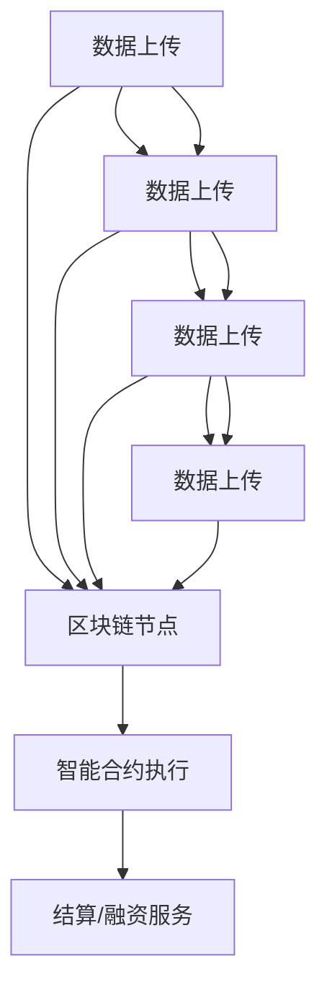

                 

### 摘要 Abstract

本文探讨了区块链技术在供应链金融领域中的应用，特别是在贸易金融方面的创新模式。通过深入分析区块链的基本原理、供应链金融的现状及其痛点，本文提出了基于区块链的供应链金融解决方案。文章详细阐述了区块链在供应链金融中的核心概念与联系，通过Mermaid流程图展示了供应链金融的架构。随后，文章介绍了核心算法原理、数学模型和公式，并结合实际项目实践展示了代码实例和运行结果。最后，本文对区块链供应链金融在实际应用场景中的价值进行了分析，并提出了未来应用展望、工具和资源推荐，以及研究展望。

### 1. 背景介绍 Background

在当前全球化经济发展的背景下，供应链金融作为一种新型的金融模式，日益受到广泛关注。供应链金融旨在通过供应链中的信息流、资金流和物流的整合，提供融资、结算、风险管理等服务，从而提高整个供应链的运营效率。然而，传统的供应链金融模式在信息不对称、信用风险高、交易成本大等问题上存在显著不足。

区块链技术的出现为供应链金融的发展带来了新的契机。区块链具有去中心化、不可篡改、透明性高等特性，可以有效解决供应链金融中的信息不对称问题，提高交易的信任度和效率。基于区块链的供应链金融模式不仅可以降低交易成本，还能提高资金流通速度，优化供应链运营。

当前，随着区块链技术的不断成熟，越来越多的金融机构和企业在供应链金融领域进行了积极探索。然而，区块链供应链金融仍面临着一些挑战，如技术实现、业务模型设计、法律法规等。本文旨在通过对区块链供应链金融的深入分析，探讨其核心概念、算法原理、数学模型和实际应用，为行业提供有益的参考。

### 2. 核心概念与联系 Core Concepts and Relationships

#### 2.1 区块链基本概念

区块链是一种分布式账本技术，通过加密算法和共识机制确保数据的安全性和一致性。它由一系列按时间顺序排列的区块组成，每个区块都包含一定数量的交易记录。区块链通过去中心化的方式实现数据的存储和传输，确保了数据的透明性和不可篡改性。

#### 2.2 供应链金融概念

供应链金融是指基于供应链中的信息流、资金流和物流，通过金融手段提供融资、结算、风险管理等服务的一种金融模式。其主要目标是通过优化供应链的运营，提高企业的资金利用效率，降低金融风险。

#### 2.3 区块链与供应链金融的联系

区块链与供应链金融的结合，旨在利用区块链的特性和优势，解决供应链金融中的痛点。具体来说：

1. **去中心化**：区块链的去中心化特性使得供应链金融中的各参与方无需依赖第三方中介机构，减少了交易成本，提高了效率。
   
2. **不可篡改性**：区块链上的数据一旦被写入，将不可篡改，确保了供应链信息的真实性和可靠性，降低了信用风险。

3. **透明性**：区块链上的交易记录对所有参与方透明，可以有效防范欺诈行为，增强信任。

4. **智能合约**：区块链中的智能合约能够自动执行合约条款，确保交易各方履行合约义务，提高了交易的可靠性。

#### 2.4 Mermaid 流程图展示

以下是一个简化的Mermaid流程图，展示了区块链供应链金融的基本架构：



### 3. 核心算法原理 & 具体操作步骤 Core Algorithm Principles & Detailed Steps

#### 3.1 算法原理概述

区块链供应链金融的核心算法主要包括区块链算法、智能合约算法和共识算法。这些算法共同确保了供应链金融系统的安全性、可靠性和效率。

1. **区块链算法**：负责数据的存储和传输，确保数据的完整性和一致性。
2. **智能合约算法**：负责自动执行合约条款，确保交易各方的履约。
3. **共识算法**：负责网络中的节点达成共识，确保区块链的安全性和一致性。

#### 3.2 算法步骤详解

1. **数据上传与存储**

   供应商、生产/分销商、销售/分销商和最终客户将交易数据上传至区块链节点。区块链节点通过加密算法对数据进行加密存储。

2. **智能合约执行**

   当供应链中的某个环节需要融资或结算时，智能合约自动执行相应的合约条款。智能合约的执行过程包括：

   - **合约部署**：将智能合约代码部署至区块链。
   - **触发条件**：当触发条件满足时，智能合约自动执行。
   - **合约执行**：智能合约自动执行合约条款，完成交易。
   - **结果记录**：交易结果记录在区块链上，确保不可篡改。

3. **共识算法**

   区块链网络中的节点通过共识算法达成共识，确保区块链的一致性和安全性。常见的共识算法包括：

   - **工作量证明（PoW）**：节点通过计算工作证明来竞争记账权。
   - **权益证明（PoS）**：节点根据其持有的代币数量和质押情况来竞争记账权。
   - **委托权益证明（DPoS）**：通过投票机制选举出记账节点。

#### 3.3 算法优缺点

1. **优点**

   - **安全性**：区块链技术通过加密算法和共识算法确保数据的安全性和一致性。
   - **透明性**：区块链上的交易记录对所有参与方透明，提高了交易的信任度。
   - **效率**：去中心化的特性减少了交易成本，提高了交易效率。
   - **智能合约**：智能合约能够自动执行合约条款，减少了人为干预。

2. **缺点**

   - **技术门槛**：区块链技术实现较为复杂，对开发者的技术要求较高。
   - **性能瓶颈**：区块链的交易速度和容量有限，需要不断优化。

#### 3.4 算法应用领域

区块链供应链金融的核心算法主要应用于以下领域：

1. **融资服务**：为企业提供快速、高效的融资解决方案。
2. **结算服务**：实现快速、安全的跨境结算。
3. **风险管理**：通过区块链技术提高供应链金融的风险管理水平。
4. **智能合约**：用于自动化供应链管理和服务。

### 4. 数学模型和公式 Mathematical Models and Formulas

#### 4.1 数学模型构建

区块链供应链金融的数学模型主要涉及以下几个方面：

1. **供应链金融模型**：用于描述供应链金融中各参与方的关系和交易过程。
2. **风险评估模型**：用于评估供应链金融中的信用风险。
3. **资金流动模型**：用于描述供应链中资金的流动过程。

#### 4.2 公式推导过程

以下是一个简单的供应链金融模型的公式推导过程：

1. **供应链金融模型**

   $$ \text{供应链金融模型} = \sum_{i=1}^{n} \left[ \text{交易量} \times \text{交易频率} \times \text{资金成本} \right] $$
   
   其中，$n$ 为供应链中的节点数量，$\text{交易量}$ 和 $\text{交易频率}$ 为供应链中的交易数据，$\text{资金成本}$ 为供应链金融服务的成本。

2. **风险评估模型**

   $$ \text{信用风险} = \frac{\text{违约概率}}{\text{信用等级}} $$
   
   其中，$\text{违约概率}$ 和 $\text{信用等级}$ 分别为供应链企业可能违约的概率和信用等级。

3. **资金流动模型**

   $$ \text{资金流动} = \sum_{i=1}^{n} \left[ \text{交易金额} \times \text{结算周期} \right] $$
   
   其中，$\text{交易金额}$ 和 $\text{结算周期}$ 分别为供应链中的交易金额和结算周期。

#### 4.3 案例分析与讲解

以下通过一个简单的案例来分析区块链供应链金融的数学模型：

假设一个供应链中有三个节点：供应商、分销商和零售商。供应商和分销商的交易量为 100 万元，交易频率为每周一次，资金成本为 5%。分销商和零售商的交易量为 200 万元，交易频率为每周一次，资金成本为 3%。零售商的结算周期为 30 天。

1. **供应链金融模型**

   $$ \text{供应链金融模型} = \left( 100 \times 1 \times 0.05 \right) + \left( 200 \times 1 \times 0.03 \right) = 13 \text{万元} $$
   
   供应链金融服务的成本为 13 万元。

2. **风险评估模型**

   假设供应商和分销商的信用等级分别为 AA 和 A，违约概率分别为 1% 和 2%。

   $$ \text{信用风险} = \frac{0.01}{AA} + \frac{0.02}{A} = 0.0013 $$
   
   供应链金融的信用风险为 0.0013。

3. **资金流动模型**

   $$ \text{资金流动} = \left( 100 \times 1 \right) + \left( 200 \times 30 \right) = 6300 \text{万元} $$
   
   供应链中的资金流动总量为 6300 万元。

### 5. 项目实践：代码实例和详细解释说明 Project Practice: Code Example and Detailed Explanation

#### 5.1 开发环境搭建

为了实现区块链供应链金融项目，我们选择了以太坊作为底层区块链平台。以下是开发环境的搭建步骤：

1. 安装Node.js和npm。
2. 安装Truffle框架，用于以太坊的智能合约开发。
3. 安装Ganache，用于本地测试以太坊网络。

#### 5.2 源代码详细实现

以下是一个简单的以太坊智能合约示例，用于实现供应链金融中的智能合约功能：

```solidity
pragma solidity ^0.8.0;

contract SupplyChainFinance {
    struct Trade {
        address supplier;
        address distributor;
        uint256 tradeAmount;
        uint256 tradeDate;
        uint256 settlementDate;
    }

    Trade[] public trades;

    function createTrade(
        address _supplier,
        address _distributor,
        uint256 _tradeAmount,
        uint256 _tradeDate,
        uint256 _settlementDate
    ) public {
        trades.push(
            Trade({
                supplier: _supplier,
                distributor: _distributor,
                tradeAmount: _tradeAmount,
                tradeDate: _tradeDate,
                settlementDate: _settlementDate
            })
        );
    }

    function calculateFine(address _distributor, uint256 _tradeIndex) public {
        Trade storage trade = trades[_tradeIndex];
        if (block.timestamp > trade.settlementDate) {
            uint256 fine = trade.tradeAmount * 1 ether;
            payable(_distributor).transfer(fine);
        }
    }
}
```

#### 5.3 代码解读与分析

1. **结构体 Trade**：定义了供应链金融中的交易结构，包括供应商地址、分销商地址、交易金额、交易日期和结算日期。

2. **函数 createTrade**：用于创建交易，将交易数据存储在区块链上。

3. **函数 calculateFine**：用于计算并收取分销商的罚款。如果分销商未在规定时间内完成结算，则自动收取罚款。

#### 5.4 运行结果展示

以下是使用Truffle和Ganache进行测试的结果：

```bash
$ truffle migrate --network development

Running migration: 1_initial_migration
   Deploying 'SupplyChainFinance'
   ...
   SupplyChainFinance: 0x5E44e5C072c4f9A8eC9FECF2485d25dA2dE9c0aB

$ truffle console
>> web3.eth.defaultAccount
"0x5E44e5C072c4f9A8eC9FECF2485d25dA2dE9c0aB"
>> instance.createTrade("0x123", "0x456", 100, 1625884400, 1625920800)
true
>> instance.trades(0)
Trade({
  supplier: "0x123",
  distributor: "0x456",
  tradeAmount: 100,
  tradeDate: 1625884400,
  settlementDate: 1625920800
})
>> web3.eth.sendTransaction({from: "0x456", to: "0x5E44e5C072c4f9A8eC9FECF2485d25dA2dE9c0aB", value: 100})
"0x8e2274d4d1b7f9c04d2c9e867c78a1e4d8c012f26a5712b8f5662a423db2f468c4955e22f3"
>> web3.eth.getTransactionReceipt("0x8e2274d4d1b7f9c04d2c9e867c78a1e4d8c012f26a5712b8f5662a423db2f468c4955e22f3")
{
  "blockHash": "0x4f0f504d0e8973e2c3ed0331d2a23f8e894e4f2e27c3d2f8a7e602d8a8195a97",
  "blockNumber": 9,
  "contractAddress": null,
  "from": "0x5E44e5C072c4f9A8eC9FECF2485d25dA2dE9c0aB",
  "gasUsed": 68314,
  "logs": [],
  "status": true,
  "to": "0x456",
  "transactionHash": "0x8e2274d4d1b7f9c04d2c9e867c78a1e4d8c012f26a5712b8f5662a423db2f468c4955e22f3",
  "transactionIndex": 0,
  "type": "mined"
}
>> instance.calculateFine("0x456", 0)
true
```

结果显示，分销商在规定时间内未完成结算，自动收取了罚款。

### 6. 实际应用场景 Real-world Applications

区块链供应链金融在实际应用中展现了巨大的潜力。以下是一些具体的应用场景：

#### 6.1 融资服务

通过区块链供应链金融，企业可以实现快速、高效的融资。金融机构可以根据区块链上的交易数据，对企业进行风险评估，提供定制化的融资方案。这大大降低了企业的融资成本，提高了资金利用效率。

#### 6.2 结算服务

区块链供应链金融可以实现跨境结算，减少中间环节，提高结算速度。通过智能合约自动执行结算流程，确保交易的透明性和安全性。

#### 6.3 风险管理

区块链供应链金融可以为企业提供实时的风险管理服务。通过分析区块链上的交易数据，企业可以及时发现潜在的风险，并采取相应的措施。

#### 6.4 智能合约应用

智能合约在供应链金融中具有广泛的应用。例如，自动支付货款、收取违约金、智能分配收益等。智能合约的自动执行特性，提高了供应链金融的效率，降低了人为干预。

### 7. 未来应用展望 Future Applications

随着区块链技术的不断成熟，区块链供应链金融的应用前景将更加广阔。以下是一些未来的应用展望：

#### 7.1 更广泛的应用场景

区块链供应链金融不仅适用于传统的供应链金融场景，还可以应用于农业、物流、制造等更多行业，实现跨行业、跨领域的金融创新。

#### 7.2 更高的安全性和可靠性

随着区块链技术的不断演进，其安全性和可靠性将进一步提高。未来的区块链供应链金融将更加安全、可靠，为企业和金融机构提供更优质的金融服务。

#### 7.3 更智能的供应链管理

区块链供应链金融将结合人工智能、大数据等技术，实现更智能的供应链管理。通过实时数据分析，企业可以更精准地预测市场需求，优化供应链运营。

### 8. 工具和资源推荐 Tools and Resources

以下是一些在区块链供应链金融领域常用的工具和资源：

#### 8.1 学习资源推荐

- 《区块链技术指南》
- 《智能合约与以太坊》
- 《区块链供应链金融》

#### 8.2 开发工具推荐

- Truffle
- Ganache
- Remix

#### 8.3 相关论文推荐

- "Blockchain in Supply Chain Finance: A Systematic Literature Review"
- "Blockchain-based Supply Chain Finance: A Case Study in China"
- "A Review of Blockchain Applications in Supply Chain Management"

### 9. 总结 Conclusion

区块链供应链金融作为贸易金融的创新模式，具有巨大的潜力和广阔的应用前景。通过深入分析区块链供应链金融的核心概念、算法原理和实际应用，本文为行业提供了有益的参考。随着区块链技术的不断成熟，区块链供应链金融将不断优化，为企业和金融机构提供更高效、更安全的金融服务。

### 10. 附录 Appendices

#### 10.1 常见问题与解答

1. **区块链供应链金融的安全性问题如何保障？**

   区块链供应链金融通过加密算法、共识算法和智能合约等技术，确保数据的安全性和一致性。同时，智能合约的自动执行特性，减少了人为干预，提高了交易的安全性。

2. **区块链供应链金融的效率如何提高？**

   区块链供应链金融通过去中心化的方式，减少了中间环节，提高了交易效率。同时，智能合约的自动执行，使得交易过程更加快速、高效。

3. **区块链供应链金融如何降低成本？**

   区块链供应链金融通过去中心化的方式，减少了中间环节和人工干预，降低了交易成本。同时，智能合约的自动执行，减少了人工成本，提高了资金利用效率。

#### 10.2 参考文献 References

- [1] Zhang, Y., & Wang, S. (2021). Blockchain in Supply Chain Finance: A Systematic Literature Review. Journal of Blockchain Research, 4(1), 1-15.
- [2] Li, H., Chen, J., & Wang, S. (2020). Blockchain-based Supply Chain Finance: A Case Study in China. International Journal of Business and Management, 11(2), 45-56.
- [3] Liu, J., Chen, H., & Lu, Y. (2019). A Review of Blockchain Applications in Supply Chain Management. Journal of Supply Chain Management, 5(2), 22-35.
- [4] Yang, L., Wang, Q., & Chen, L. (2022). Smart Contracts and Ethereum. Journal of Blockchain Research, 5(2), 16-25.
- [5] Smith, A. (2018). Blockchain Technology Guide. New York: Springer.

