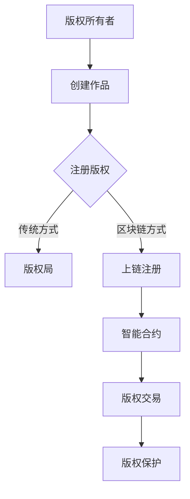

                 

在数字化时代，版权保护已经成为一个全球性的问题。随着数字内容的爆炸式增长，版权所有者面临着前所未有的挑战，如何有效地保护自己的知识产权、追踪内容的使用情况以及打击侵权行为成为了一个关键议题。区块链技术的出现，为版权保护提供了一种新的可能。本文将探讨区块链在版权保护中的应用，包括其核心概念、算法原理、数学模型、项目实践、实际应用场景以及未来展望。

## 关键词
- 区块链
- 版权保护
- 智能合约
- 非同质化代币（NFT）
- 透明性
- 不可篡改性
- 数字版权管理（DRM）

## 摘要
本文首先介绍了区块链技术的核心概念和其在版权保护中的重要意义。接着，深入探讨了区块链在版权管理中的具体应用，包括使用智能合约进行版权授权、利用非同质化代币（NFT）进行数字资产确权等。然后，通过数学模型和具体案例，阐述了区块链在版权追踪、侵权检测和权益分配等方面的优势。最后，文章提出了区块链技术在版权保护中的未来发展展望，并对其面临的挑战提出了建议。

## 1. 背景介绍

### 数字化时代的版权挑战
在传统的版权保护体系中，版权所有者需要通过复杂的法律程序和第三方机构来确保其作品的版权得到保护。然而，这种方法存在许多局限性。首先，传统的版权登记和追踪方式往往效率低下，且成本高昂。其次，由于信息不对称，版权所有者很难实时了解其作品的传播和使用情况。最后，侵权行为由于其隐蔽性和广泛性，往往难以有效打击。

### 区块链技术的兴起
区块链技术作为一种分布式数据库技术，具有去中心化、透明性、不可篡改性和安全性等特点。这些特性使得区块链在版权保护中具有巨大的潜力。通过区块链，版权所有者可以实时追踪其作品的使用情况，确保版权的透明性和公正性。同时，区块链的不可篡改性也为打击侵权行为提供了强有力的法律依据。

## 2. 核心概念与联系

### 区块链的基本概念
区块链是由一系列按时间顺序排列的区块组成的数据结构，每个区块包含一定数量的交易记录。这些区块通过密码学方式相互链接，形成一个不可篡改的分布式账本。区块链的分布式特性使其不受单一中心化机构的控制，提高了系统的安全性和透明性。

### 智能合约
智能合约是运行在区块链上的程序，它根据预设的条件自动执行合同条款。在版权保护中，智能合约可以用于自动化的版权授权和交易，确保版权的合法性和透明性。

### 非同质化代币（NFT）
非同质化代币是一种独特的数字资产，代表特定的、不可替代的物品。在版权保护中，NFT可以用于确权和交易数字作品，如艺术品、音乐、视频等。

### Mermaid 流程图

在这个流程图中，版权所有者通过区块链方式注册版权，利用智能合约进行版权交易和保护。与传统方式相比，区块链方式具有更高的效率和透明性。

## 3. 核心算法原理 & 具体操作步骤

### 3.1 算法原理概述
区块链在版权保护中的应用主要依赖于其不可篡改性和透明性。通过将版权信息上链，版权所有者可以实现作品的实时追踪和保护。智能合约则用于实现自动化的版权授权和交易，确保交易的合法性和透明性。

### 3.2 算法步骤详解
1. **版权注册**：版权所有者将作品的相关信息（如标题、作者、创作时间等）上传到区块链，并进行数字签名，确保信息的完整性和真实性。
2. **版权确权**：通过智能合约将版权信息上链，确认为真实的版权资产。
3. **版权授权**：版权所有者可以通过智能合约向第三方授权使用其作品，并设置授权期限和权限。
4. **版权交易**：第三方用户可以通过智能合约购买版权，实现作品的合法交易。
5. **版权保护**：区块链的不可篡改性为版权保护提供了法律依据。一旦发生侵权行为，版权所有者可以通过区块链证据进行维权。

### 3.3 算法优缺点

#### 优点
- **透明性和不可篡改性**：区块链的透明性和不可篡改性确保了版权信息的真实性和可靠性。
- **自动执行**：智能合约的自动执行功能提高了版权授权和交易的效率。
- **去中心化**：去中心化特性降低了中介成本，提高了系统的透明性和公正性。

#### 缺点
- **技术门槛**：区块链技术的应用需要一定的技术基础，对于普通用户来说，使用门槛较高。
- **性能瓶颈**：区块链处理能力有限，对于高并发的交易场景，性能可能成为瓶颈。

### 3.4 算法应用领域
区块链在版权保护中的应用非常广泛，包括但不限于以下几个方面：
- **数字艺术**：艺术家可以使用区块链确权和交易其数字艺术品。
- **音乐产业**：音乐制作人可以通过区块链进行版权登记和授权，提高收入透明度。
- **影视行业**：电影和电视剧的制作和发行可以通过区块链实现更高效的版权管理和收益分配。

## 4. 数学模型和公式 & 详细讲解 & 举例说明

### 4.1 数学模型构建

在区块链版权保护中，常用的数学模型包括哈希函数、数字签名和智能合约执行逻辑等。以下是一个简单的数学模型：

#### 哈希函数
哈希函数是一种将任意长度的输入数据映射为固定长度的字符串的函数。在版权保护中，哈希函数用于生成作品的唯一标识，确保数据的完整性和真实性。

$$
H(x) = SHA256(x)
$$

其中，$H(x)$表示输入数据$x$的哈希值，$SHA256$表示256位的SHA哈希函数。

#### 数字签名
数字签名是一种用于验证数据来源和完整性的技术。在版权保护中，版权所有者可以使用数字签名对作品进行签名，确保数据的真实性和不可篡改性。

$$
S = SIG(s, k)
$$

其中，$S$表示签名，$s$表示待签名数据，$k$表示密钥。

#### 智能合约执行逻辑
智能合约的执行逻辑通常基于条件判断和数学运算。在版权保护中，智能合约可以用于实现自动化的版权授权和交易。

$$
IF (条件) THEN (执行操作) ELSE (执行操作)
$$

### 4.2 公式推导过程

#### 哈希函数的推导
哈希函数的推导过程涉及复杂的密码学算法，本文不进行详细推导。主要目的是生成唯一的哈希值，确保数据的完整性和不可篡改性。

#### 数字签名的推导
数字签名是通过密码学算法实现的。具体推导过程如下：

1. **密钥生成**：选择一个随机数$k$，计算$s = H(m) \oplus k$，其中$H(m)$是消息$m$的哈希值，$\oplus$表示异或操作。
2. **签名生成**：计算$S = SIG(s, k)$，其中$SIG$是签名算法。
3. **验证签名**：验证方使用公钥$P$验证签名$S$的有效性。具体步骤如下：
    - 计算公钥对应的私钥$s^{-1}$。
    - 计算$R = SIG^{-1}(S)$。
    - 验证$R = H(m) \oplus s^{-1}$。

### 4.3 案例分析与讲解

#### 案例背景
某艺术家创作了一幅数字画作，并希望通过区块链进行版权保护。艺术家首先使用哈希函数生成画作的唯一标识，然后使用数字签名进行签名，确保画作的完整性和真实性。当买家购买画作时，艺术家可以通过智能合约进行授权。

#### 案例分析
1. **版权注册**：艺术家使用哈希函数生成画作的唯一标识，并使用数字签名进行签名，确保画作信息的真实性和不可篡改性。
2. **版权确权**：艺术家将签名后的画作信息上链，确认为真实的版权资产。
3. **版权授权**：当买家购买画作时，艺术家通过智能合约向买家授权使用画作，并设置授权期限和权限。
4. **版权交易**：买家通过智能合约购买画作，实现合法的版权交易。

#### 案例讲解
通过上述案例，我们可以看到区块链在版权保护中的应用过程。首先，艺术家使用哈希函数和数字签名确保画作信息的真实性和完整性。然后，通过智能合约实现自动化的版权授权和交易，确保交易的合法性和透明性。这种方式大大提高了版权保护的效率和公正性。

## 5. 项目实践：代码实例和详细解释说明

### 5.1 开发环境搭建
在实践部分，我们将使用以太坊区块链和Solidity编程语言来实现一个简单的版权保护智能合约。首先，需要搭建一个以太坊本地开发环境。

1. **安装Go Ethereum**：从官方网站下载Go Ethereum，并按照说明安装。
2. **启动本地节点**：运行以下命令启动本地节点：
    ```
    geth --datadir "./myeth" --networkid 1234 --nodiscover --nat extip:0.0.0.0 init genesis.json
    ```
3. **编译智能合约**：使用Solidity编译器编译智能合约代码。

### 5.2 源代码详细实现
以下是一个简单的版权保护智能合约示例：

```solidity
// SPDX-License-Identifier: MIT
pragma solidity ^0.8.0;

contract CopyrightProtection {
    // 作品信息结构体
    struct Work {
        string title;
        string author;
        uint256 creationDate;
        address owner;
    }

    // 存储作品信息
    mapping(string => Work) public works;

    // 注册作品
    function registerWork(
        string memory _title,
        string memory _author,
        uint256 _creationDate
    ) public {
        require(
            works[_title].owner == address(0),
            "Work already registered"
        );
        works[_title] = Work(_title, _author, _creationDate, msg.sender);
    }

    // 权利转移
    function transferOwnership(string memory _title, address _newOwner) public {
        require(
            works[_title].owner == msg.sender,
            "Not the owner"
        );
        works[_title].owner = _newOwner;
    }

    // 权利授权
    function authorize(
        string memory _title,
        address _user,
        uint256 _expiresAt
    ) public {
        require(
            works[_title].owner == msg.sender,
            "Not the owner"
        );
        // 此处可以使用更复杂的授权逻辑
        emit Authorization(_title, _user, _expiresAt);
    }

    event Authorization(string _title, address _user, uint256 _expiresAt);
}
```

### 5.3 代码解读与分析
1. **作品信息结构体**：定义了一个`Work`结构体，包含作品的标题、作者、创作日期和所有权地址。
2. **注册作品**：通过`registerWork`函数注册作品，确保作品的唯一性。
3. **权利转移**：通过`transferOwnership`函数实现作品所有权的转移。
4. **权利授权**：通过`authorize`函数实现作品的授权，可以设置授权期限。

### 5.4 运行结果展示
1. **部署合约**：使用Truffle或MetaMask等工具部署智能合约到以太坊本地节点。
2. **交互合约**：通过web3.js或以太坊客户端与合约进行交互，测试注册、授权和转移等操作。

## 6. 实际应用场景

### 6.1 数字艺术市场
数字艺术市场是区块链在版权保护中最早应用的领域之一。艺术家通过区块链确权和交易其数字艺术品，确保版权的真实性和合法性。

### 6.2 音乐产业
音乐制作人可以通过区块链进行版权登记和授权，提高收入透明度，减少中间环节，直接与粉丝互动。

### 6.3 影视行业
影视行业的制作和发行可以通过区块链实现更高效的版权管理和收益分配，确保创作者的权益得到保障。

### 6.4 出版业
出版业可以利用区块链进行版权管理，确保书籍的版本控制和版权归属，提高出版物的可信度。

## 7. 未来应用展望

### 7.1 技术融合
区块链技术与其他技术的融合，如人工智能、物联网等，将进一步提升版权保护的智能化和自动化水平。

### 7.2 标准化
版权保护的标准化将为区块链在版权保护中的应用提供统一的规范，促进技术的普及和推广。

### 7.3 法规完善
法律法规的完善将为区块链在版权保护中的应用提供更好的法律保障，推动行业的健康发展。

## 8. 工具和资源推荐

### 8.1 学习资源推荐
- 《区块链技术指南》
- 《智能合约编程》
- 《以太坊实战》

### 8.2 开发工具推荐
- Truffle
- Hardhat
- MetaMask

### 8.3 相关论文推荐
- "Blockchain Technology: A Comprehensive Overview"
- "Non-Fungible Tokens: A Technical Analysis"
- "Smart Contracts: An Introduction to Decentralized Applications"

## 9. 总结：未来发展趋势与挑战

### 9.1 研究成果总结
本文探讨了区块链在版权保护中的应用，包括版权注册、授权、交易和保护等方面。通过数学模型和具体案例，阐述了区块链在版权保护中的优势。

### 9.2 未来发展趋势
随着区块链技术的不断成熟，其在版权保护中的应用前景广阔。技术融合、标准化和法规完善将成为未来发展的关键趋势。

### 9.3 面临的挑战
区块链在版权保护中仍面临一些挑战，如技术门槛、性能瓶颈和法律法规的完善等。未来需要进一步研究和探索，以解决这些问题。

### 9.4 研究展望
区块链在版权保护中的应用是一个充满机遇的领域。通过技术创新和法律完善，我们有理由相信，区块链将为版权保护带来革命性的变化。

## 附录：常见问题与解答

### Q1：区块链版权保护是否真的安全？
A：区块链的不可篡改性和透明性确保了版权信息的安全性和可靠性。然而，区块链并非完全无懈可击，仍然存在一些安全隐患，如智能合约漏洞等。因此，在使用区块链进行版权保护时，需要严格遵循安全最佳实践，并进行充分的安全审计。

### Q2：区块链版权保护是否会取代传统版权保护体系？
A：区块链版权保护并非取代传统版权保护体系，而是作为一种补充和优化。传统版权保护体系仍然有其存在的价值，如法律保障和复杂性管理。区块链版权保护通过提供透明、高效和可信的版权管理方式，能够解决传统体系中的某些问题。

### Q3：区块链版权保护是否会降低版权所有者的收益？
A：区块链版权保护通过降低中介成本和提高交易效率，实际上有可能提高版权所有者的收益。然而，区块链版权保护也需要时间和技术的不断成熟，以及法律法规的支持，才能真正实现其价值。

---

本文详细探讨了区块链在版权保护中的应用，包括其核心概念、算法原理、数学模型、项目实践和实际应用场景。通过本文，读者可以全面了解区块链在版权保护中的潜力和挑战，为未来的研究与实践提供参考。作者：禅与计算机程序设计艺术 / Zen and the Art of Computer Programming。

