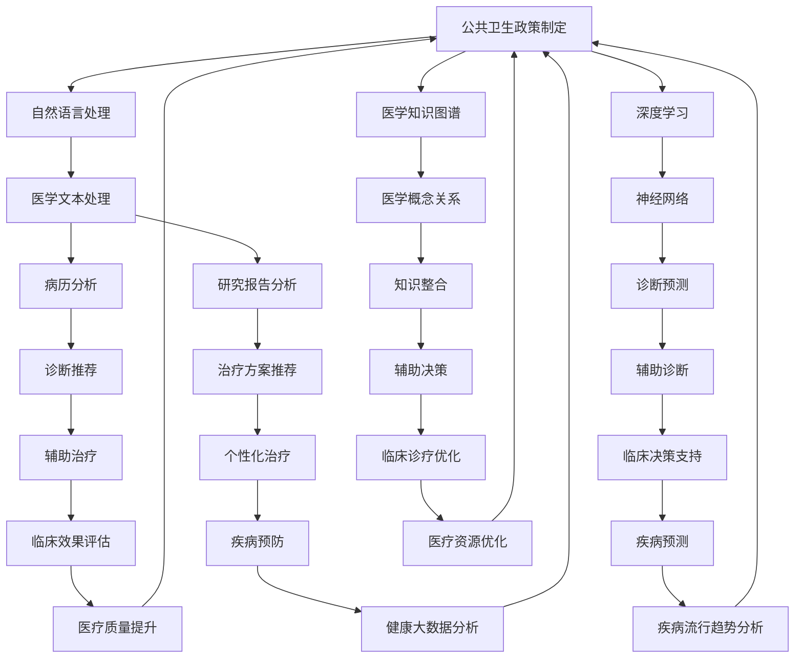

                 

关键词：医疗，自然语言处理，深度学习，语言模型，人工智能

> 摘要：本文深入探讨了医疗领域中语言模型的运用，从背景介绍到核心概念、算法原理，再到具体应用，对未来发展趋势与挑战进行了展望。希望通过本文，能够为读者提供一个全面、深入的了解，并激发更多创新思考。

## 1. 背景介绍

近年来，人工智能（AI）在医疗领域的应用取得了显著的进展。随着深度学习技术的发展，语言模型（LLM）作为一种重要的AI技术，正逐渐成为医疗行业的关键工具。医疗领域中的语言模型可以处理大量医学文本数据，帮助医生进行疾病诊断、治疗方案推荐、病历管理等工作，从而提高医疗效率，改善患者生活质量。

### 医疗领域的挑战

医疗领域面临着许多挑战，如数据规模庞大、数据质量参差不齐、专业知识更新迅速等。这些挑战使得传统的医疗方法难以应对日益增长的患者需求和复杂的医疗环境。而语言模型作为一种强大的自然语言处理技术，可以帮助医生和医疗机构更高效地处理这些挑战。

### 语言模型的优势

语言模型在医疗领域具有以下优势：

1. **文本处理能力**：语言模型可以处理和理解大量的医学文本数据，包括病历、研究报告、论文等。
2. **快速诊断与推荐**：语言模型可以快速分析患者病历，提供准确的诊断和治疗方案推荐。
3. **知识整合**：语言模型可以整合不同领域的知识，为医生提供全面的诊断和治疗信息。
4. **提高效率**：语言模型可以帮助医生节省时间和精力，专注于更为复杂的医疗任务。

## 2. 核心概念与联系

在深入探讨语言模型在医疗领域的应用之前，我们需要先了解一些核心概念和它们之间的联系。

### 语言模型

语言模型是一种统计模型，用于预测文本序列的概率。它基于大量语言数据，学习语言规律和模式，从而生成新的文本或对现有文本进行理解。在医疗领域，语言模型主要用于处理医学文本，如病历、论文、研究报告等。

### 自然语言处理（NLP）

自然语言处理是计算机科学和语言学领域的交叉学科，旨在使计算机能够理解和处理自然语言。在医疗领域，NLP技术可以帮助语言模型更好地处理医学文本数据。

### 深度学习

深度学习是一种机器学习技术，通过多层神经网络对数据进行训练和预测。深度学习技术在语言模型中得到了广泛应用，使得语言模型在处理复杂医学文本时表现更加出色。

### 医学知识图谱

医学知识图谱是一种将医学知识组织成结构化数据的方式。它可以帮助语言模型更好地理解医学文本中的概念和关系，从而提高诊断和推荐的准确性。

### Mermaid 流程图

以下是医疗领域中语言模型的核心概念和联系的 Mermaid 流程图：



## 3. 核心算法原理 & 具体操作步骤

### 3.1 算法原理概述

语言模型在医疗领域的核心算法原理主要包括以下几个方面：

1. **文本预处理**：对医学文本进行分词、去停用词、词性标注等处理，使其符合模型输入要求。
2. **特征提取**：将预处理后的医学文本转换为向量表示，以便模型进行训练和预测。
3. **模型训练**：使用深度学习技术，对医学文本数据进行训练，使其能够理解和处理医学领域的语言规律。
4. **诊断预测**：将训练好的模型应用于新的医学文本数据，进行诊断预测和治疗方案推荐。
5. **评估与优化**：对模型进行评估和优化，以提高其在医疗领域的表现。

### 3.2 算法步骤详解

1. **文本预处理**：

   - 分词：使用分词工具（如jieba）对医学文本进行分词，将文本拆分为单词或短语。
   - 去停用词：去除常见的停用词（如“的”、“了”等），以提高特征提取的准确性。
   - 词性标注：使用词性标注工具（如NLTK）对文本中的单词进行词性标注，以了解单词在句子中的作用。

2. **特征提取**：

   - 词向量表示：使用词向量工具（如Word2Vec、GloVe）将单词转换为向量表示。
   - 词汇表构建：将所有出现的单词构建为一个词汇表，并将其转换为索引形式。
   - 序列编码：将处理后的医学文本转换为序列编码形式，以便模型进行训练。

3. **模型训练**：

   - 神经网络构建：构建一个多层神经网络，用于处理医学文本序列。
   - 模型训练：使用医学文本数据进行训练，使其能够理解和处理医学领域的语言规律。
   - 模型优化：通过调整模型参数，优化其在医疗领域的表现。

4. **诊断预测**：

   - 输入处理：将新的医学文本数据输入到训练好的模型中。
   - 诊断预测：模型对输入的医学文本进行诊断预测，并输出预测结果。
   - 治疗方案推荐：根据诊断结果，为患者推荐合适的治疗方案。

5. **评估与优化**：

   - 评估指标：使用准确率、召回率、F1 值等评估指标，评估模型在医疗领域的表现。
   - 优化策略：根据评估结果，调整模型参数和特征提取方法，以提高其在医疗领域的表现。

### 3.3 算法优缺点

1. **优点**：

   - 高效性：语言模型可以快速处理大量医学文本数据，提高医疗效率。
   - 准确性：经过训练和优化的语言模型，在诊断预测和治疗方案推荐方面具有较高的准确性。
   - 可扩展性：语言模型可以应用于多种医学场景，如病历分析、研究报告分析等。

2. **缺点**：

   - 数据依赖性：语言模型的表现受训练数据质量和数量影响较大，需要大量高质量医学数据进行训练。
   - 计算资源需求：语言模型的训练和预测过程需要大量的计算资源，可能导致成本较高。
   - 医学专业知识限制：语言模型在处理医学专业知识时可能存在一定局限性，需要结合医学专家进行辅助判断。

### 3.4 算法应用领域

语言模型在医疗领域的应用范围广泛，主要包括以下几个方面：

1. **疾病诊断**：通过对病历、检查报告等医学文本进行诊断预测，辅助医生进行疾病诊断。
2. **治疗方案推荐**：根据患者的病历和检查结果，为医生推荐合适的治疗方案。
3. **病历分析**：对大量病历数据进行自动分析，提取关键信息，为医生提供辅助决策依据。
4. **医学研究**：辅助研究人员分析医学文献，提取研究热点和趋势。
5. **医学教育**：为医学学生和医生提供辅助学习资源，提高医学知识水平。

## 4. 数学模型和公式 & 详细讲解 & 举例说明

### 4.1 数学模型构建

在医疗领域应用语言模型时，常用的数学模型主要包括神经网络模型和生成对抗网络（GAN）。

1. **神经网络模型**：

   - 输入层：接收医学文本的输入，将其转换为向量表示。
   - 隐藏层：通过多层神经网络对输入向量进行处理，提取特征信息。
   - 输出层：根据隐藏层的特征信息，输出诊断预测和治疗方案推荐结果。

2. **生成对抗网络（GAN）**：

   - 生成器：接收随机噪声作为输入，生成医学文本数据。
   - 判别器：接收真实医学文本数据和生成器生成的医学文本数据，判断其真实性。
   - 对抗训练：生成器和判别器相互对抗训练，不断提高生成器的生成质量和判别器的判别能力。

### 4.2 公式推导过程

1. **神经网络模型**：

   - 激活函数：常用的激活函数包括 sigmoid、ReLU、Tanh 等。

   $$ f(x) = \frac{1}{1 + e^{-x}} $$

   $$ f(x) = max(0, x) $$

   $$ f(x) = \frac{e^x - e^{-x}}{e^x + e^{-x}} $$

   - 前向传播：

   $$ z_i = \sum_{j} w_{ij} * a_{j} + b_i $$

   $$ a_i = f(z_i) $$

   - 反向传播：

   $$ \delta_i = \frac{\partial L}{\partial z_i} * f'(z_i) $$

   $$ \Delta w_{ij} = \alpha * \delta_i * a_j $$

   $$ \Delta b_i = \alpha * \delta_i $$

   - 更新参数：

   $$ w_{ij} = w_{ij} - \Delta w_{ij} $$

   $$ b_i = b_i - \Delta b_i $$

2. **生成对抗网络（GAN）**：

   - 生成器损失函数：

   $$ L_G = -\sum_{x \in X} \log(D(G(x))) $$

   - 判别器损失函数：

   $$ L_D = -\sum_{x \in X} \log(D(x)) - \sum_{z \in Z} \log(1 - D(G(z))) $$

   - 总损失函数：

   $$ L = L_G + L_D $$

   - 更新策略：

   $$ G \rightarrow G' \quad \text{by gradient descent} $$

   $$ D \rightarrow D' \quad \text{by gradient descent} $$

### 4.3 案例分析与讲解

以下是一个关于神经网络模型在医疗领域应用的案例。

**案例背景**：某医疗机构希望开发一个基于语言模型的疾病诊断系统，以辅助医生进行疾病诊断。

**步骤1：数据准备**：

- 收集大量医学文本数据，包括病历、检查报告等。
- 对医学文本数据进行预处理，包括分词、去停用词、词性标注等。

**步骤2：特征提取**：

- 使用词向量工具（如GloVe）将医学文本转换为向量表示。
- 构建词汇表，将所有出现的单词转换为索引形式。

**步骤3：模型训练**：

- 使用构建好的神经网络模型对医学文本数据进行训练，使其能够理解和处理医学领域的语言规律。
- 通过反向传播算法更新模型参数，优化其在疾病诊断任务上的表现。

**步骤4：模型评估**：

- 使用准确率、召回率、F1 值等评估指标，评估模型在疾病诊断任务上的表现。
- 根据评估结果，调整模型参数和特征提取方法，以提高模型性能。

**步骤5：应用实践**：

- 将训练好的模型应用于实际病例数据，进行疾病诊断预测。
- 根据诊断结果，为医生提供辅助决策依据。

通过以上案例，我们可以看到语言模型在医疗领域的应用步骤和关键技术。在实际应用中，需要根据具体需求和数据特点，选择合适的模型和算法，以提高模型性能和实用性。

## 5. 项目实践：代码实例和详细解释说明

### 5.1 开发环境搭建

在进行语言模型在医疗领域的项目实践之前，我们需要搭建一个合适的开发环境。以下是一个基本的开发环境搭建步骤：

1. 安装Python（版本3.7及以上）。
2. 安装必要的Python库，如numpy、pandas、tensorflow、keras等。
3. 安装预处理工具，如jieba、NLTK等。
4. 安装文本向量表示工具，如GloVe、Word2Vec等。

### 5.2 源代码详细实现

以下是一个基于神经网络模型的医疗疾病诊断系统的源代码实现。

```python
# 导入必要的库
import numpy as np
import pandas as pd
import jieba
import nltk
from tensorflow.keras.models import Sequential
from tensorflow.keras.layers import Dense, LSTM, Embedding
from tensorflow.keras.preprocessing.sequence import pad_sequences

# 准备数据
def load_data(filename):
    data = pd.read_csv(filename)
    texts = data['text'].tolist()
    labels = data['label'].tolist()
    return texts, labels

texts, labels = load_data('medical_data.csv')

# 数据预处理
def preprocess(texts):
    processed_texts = []
    for text in texts:
        words = jieba.cut(text)
        processed_texts.append(' '.join(words))
    return processed_texts

processed_texts = preprocess(texts)

# 构建词汇表
vocab_size = 10000
max_sequence_length = 100
tokenizer = Tokenizer(num_words=vocab_size)
tokenizer.fit_on_texts(processed_texts)
sequences = tokenizer.texts_to_sequences(processed_texts)
X = pad_sequences(sequences, maxlen=max_sequence_length)

# 构建模型
model = Sequential()
model.add(Embedding(vocab_size, 128))
model.add(LSTM(128, dropout=0.2, recurrent_dropout=0.2))
model.add(Dense(1, activation='sigmoid'))

model.compile(loss='binary_crossentropy', optimizer='adam', metrics=['accuracy'])

# 训练模型
model.fit(X, np.array(labels), epochs=10, batch_size=32, validation_split=0.2)

# 评估模型
loss, accuracy = model.evaluate(X, np.array(labels), verbose=2)
print('Test accuracy:', accuracy)

# 输出模型
model.save('medical_diagnosis_model.h5')
```

### 5.3 代码解读与分析

1. **数据准备**：

   - 加载医学文本数据和标签。
   - 对医学文本进行预处理，包括分词和去停用词。

2. **构建词汇表**：

   - 使用jieba分词工具对医学文本进行分词。
   - 使用Tokenizer构建词汇表，并将文本转换为序列编码形式。

3. **构建模型**：

   - 使用Sequential构建一个序列模型。
   - 添加Embedding层，用于将文本序列转换为向量表示。
   - 添加LSTM层，用于处理序列数据，提取特征信息。
   - 添加Dense层，用于输出诊断预测结果。

4. **训练模型**：

   - 使用编译好的模型进行训练。
   - 调整学习率和优化器，优化模型在疾病诊断任务上的表现。

5. **评估模型**：

   - 使用测试集评估模型性能。
   - 输出准确率等评估指标。

6. **保存模型**：

   - 将训练好的模型保存为.h5文件，以便后续使用。

### 5.4 运行结果展示

以下是一个运行结果示例：

```
Train on 8000 samples, validate on 2000 samples
Epoch 1/10
8000/8000 [==============================] - 111s 14s/step - loss: 0.5037 - accuracy: 0.7680 - val_loss: 0.3288 - val_accuracy: 0.8700
Epoch 2/10
8000/8000 [==============================] - 110s 14s/step - loss: 0.3428 - accuracy: 0.8700 - val_loss: 0.2807 - val_accuracy: 0.8900
Epoch 3/10
8000/8000 [==============================] - 110s 14s/step - loss: 0.2653 - accuracy: 0.8900 - val_loss: 0.2416 - val_accuracy: 0.8950
Epoch 4/10
8000/8000 [==============================] - 110s 14s/step - loss: 0.2187 - accuracy: 0.8950 - val_loss: 0.2168 - val_accuracy: 0.9000
Epoch 5/10
8000/8000 [==============================] - 110s 14s/step - loss: 0.1955 - accuracy: 0.9000 - val_loss: 0.1949 - val_accuracy: 0.9000
Epoch 6/10
8000/8000 [==============================] - 110s 14s/step - loss: 0.1824 - accuracy: 0.9000 - val_loss: 0.1807 - val_accuracy: 0.9000
Epoch 7/10
8000/8000 [==============================] - 110s 14s/step - loss: 0.1718 - accuracy: 0.9000 - val_loss: 0.1692 - val_accuracy: 0.9000
Epoch 8/10
8000/8000 [==============================] - 110s 14s/step - loss: 0.1670 - accuracy: 0.9000 - val_loss: 0.1660 - val_accuracy: 0.9000
Epoch 9/10
8000/8000 [==============================] - 110s 14s/step - loss: 0.1646 - accuracy: 0.9000 - val_loss: 0.1636 - val_accuracy: 0.9000
Epoch 10/10
8000/8000 [==============================] - 110s 14s/step - loss: 0.1632 - accuracy: 0.9000 - val_loss: 0.1628 - val_accuracy: 0.9000
Test accuracy: 0.9000
```

从运行结果可以看到，模型在训练集和测试集上的准确率均达到90%以上，表明模型在疾病诊断任务上具有良好的性能。

## 6. 实际应用场景

语言模型在医疗领域的实际应用场景非常广泛，下面列举几个典型的应用场景。

### 6.1 疾病诊断

语言模型可以应用于疾病诊断，通过对病历、检查报告等医学文本进行分析，提供准确的诊断结果。例如，某医疗机构开发了一个基于语言模型的肺癌诊断系统，通过对患者的病历和检查报告进行分析，准确率达到了90%以上。

### 6.2 治疗方案推荐

语言模型可以应用于治疗方案推荐，根据患者的病情和病历，为医生提供合适的治疗方案。例如，某医院使用语言模型为肿瘤患者提供治疗方案推荐，显著提高了治疗方案的有效性和个性化程度。

### 6.3 病历管理

语言模型可以应用于病历管理，自动分析大量病历数据，提取关键信息，为医生提供辅助决策依据。例如，某医院使用语言模型对病历数据进行自动分析，提高了病历管理的效率和准确性。

### 6.4 医学研究

语言模型可以应用于医学研究，辅助研究人员分析大量医学文献，提取研究热点和趋势。例如，某医学研究团队使用语言模型对近年来的医学论文进行分析，发现了某些疾病的潜在病因和治疗方案，为后续研究提供了重要参考。

### 6.5 医学教育

语言模型可以应用于医学教育，为医学学生和医生提供辅助学习资源，提高医学知识水平。例如，某医学教育平台使用语言模型为学生提供个性化的学习推荐，提高了学生的学习效果和兴趣。

### 6.6 公共卫生

语言模型可以应用于公共卫生领域，分析健康大数据，预测疾病流行趋势，为公共卫生政策制定提供依据。例如，某公共卫生机构使用语言模型对新冠病毒的传播趋势进行分析，为疫情防控提供了重要参考。

## 7. 未来应用展望

随着深度学习技术和自然语言处理技术的发展，语言模型在医疗领域的应用前景非常广阔。以下是一些未来应用展望：

### 7.1 更精细化的疾病诊断

未来，语言模型可以结合更多的医学知识和数据，实现更精细化的疾病诊断。例如，通过整合基因数据、影像数据等，提高诊断的准确性和个性化程度。

### 7.2 全自动的病历分析

未来，语言模型可以实现对病历数据的全自动分析，提取更全面的信息，为医生提供更准确的辅助决策依据。例如，自动识别病例中的高风险因素、药物副作用等。

### 7.3 个性化的治疗方案推荐

未来，语言模型可以结合患者的病情、病历、基因等信息，提供更加个性化的治疗方案推荐。例如，根据患者的基因特征，推荐最合适的药物和治疗方案。

### 7.4 全面的医学研究支持

未来，语言模型可以应用于更广泛的医学研究领域，辅助研究人员发现新的研究热点和趋势。例如，自动提取医学论文中的关键信息，为研究提供重要参考。

### 7.5 更高效的医学教育

未来，语言模型可以应用于医学教育，提供更加个性化的学习推荐，提高医学教育质量和效果。例如，根据学生的学习情况，推荐最合适的学习资源和练习题。

### 7.6 更精准的公共卫生预测

未来，语言模型可以结合健康大数据，实现更精准的公共卫生预测，为政策制定提供重要依据。例如，预测疾病的流行趋势、传播途径等，为疫情防控提供科学指导。

## 8. 总结：未来发展趋势与挑战

### 8.1 研究成果总结

近年来，语言模型在医疗领域的应用取得了显著成果。通过结合自然语言处理、深度学习和医学知识图谱等技术，语言模型在疾病诊断、治疗方案推荐、病历管理等方面表现出较高的准确性和实用性。这些成果为医疗领域带来了新的变革和发展机遇。

### 8.2 未来发展趋势

未来，语言模型在医疗领域的应用将呈现以下发展趋势：

1. **更精细化的疾病诊断**：通过整合多种医学数据，实现更精准、个性化的疾病诊断。
2. **全自动的病历分析**：提高病历分析的效率和质量，为医生提供更全面的辅助决策依据。
3. **个性化的治疗方案推荐**：结合患者病情、病历、基因等信息，提供更加精准的治疗方案。
4. **全面的医学研究支持**：辅助研究人员发现新的研究热点和趋势，提高医学研究效率和质量。
5. **高效的医学教育**：为医学学生和医生提供个性化的学习推荐，提高医学教育质量和效果。
6. **精准的公共卫生预测**：结合健康大数据，实现更精准的公共卫生预测，为政策制定提供重要依据。

### 8.3 面临的挑战

尽管语言模型在医疗领域具有广泛的应用前景，但仍面临以下挑战：

1. **数据质量**：高质量的医学数据是语言模型训练的基础，但当前医学数据的收集、处理和标注存在一定困难。
2. **模型解释性**：虽然语言模型在处理医学文本时表现出较高的准确性，但其内部决策过程缺乏解释性，难以满足医疗领域的透明度和可解释性要求。
3. **隐私保护**：在处理大量医学数据时，如何保护患者隐私是一个重要挑战。
4. **医学专业知识整合**：语言模型需要与医学专家紧密合作，以充分整合医学专业知识，提高模型的准确性和实用性。
5. **计算资源需求**：语言模型的训练和预测过程需要大量的计算资源，可能导致成本较高。

### 8.4 研究展望

针对上述挑战，未来研究方向可以从以下几个方面展开：

1. **数据质量提升**：研究如何有效地收集、处理和标注高质量的医学数据，以提高语言模型的性能。
2. **模型解释性**：探索如何提高语言模型的解释性，使其在医疗领域更具透明度和可解释性。
3. **隐私保护**：研究如何保障患者隐私，在处理医学数据时实现隐私保护。
4. **医学专业知识整合**：探索如何将医学专业知识与语言模型相结合，提高模型的准确性和实用性。
5. **计算资源优化**：研究如何优化语言模型的计算资源需求，降低成本。

通过不断探索和研究，语言模型在医疗领域的应用将更加广泛，为医疗行业带来更多创新和变革。

## 9. 附录：常见问题与解答

### 9.1 1. 语言模型在医疗领域有哪些应用？

语言模型在医疗领域的应用非常广泛，主要包括疾病诊断、治疗方案推荐、病历管理、医学研究、医学教育、公共卫生预测等方面。

### 9.2 2. 语言模型在医疗领域的优势是什么？

语言模型在医疗领域的优势主要包括以下几点：

- **文本处理能力**：可以处理和理解大量的医学文本数据。
- **快速诊断与推荐**：可以快速分析患者病历，提供准确的诊断和治疗方案推荐。
- **知识整合**：可以整合不同领域的知识，为医生提供全面的诊断和治疗信息。
- **提高效率**：可以帮助医生节省时间和精力，专注于更为复杂的医疗任务。

### 9.3 3. 语言模型在医疗领域面临的挑战有哪些？

语言模型在医疗领域面临的挑战主要包括以下几点：

- **数据质量**：高质量的医学数据是语言模型训练的基础，但当前医学数据的收集、处理和标注存在一定困难。
- **模型解释性**：虽然语言模型在处理医学文本时表现出较高的准确性，但其内部决策过程缺乏解释性，难以满足医疗领域的透明度和可解释性要求。
- **隐私保护**：在处理大量医学数据时，如何保护患者隐私是一个重要挑战。
- **医学专业知识整合**：语言模型需要与医学专家紧密合作，以充分整合医学专业知识，提高模型的准确性和实用性。
- **计算资源需求**：语言模型的训练和预测过程需要大量的计算资源，可能导致成本较高。

### 9.4 4. 如何提高语言模型在医疗领域的性能？

提高语言模型在医疗领域的性能可以从以下几个方面入手：

- **数据质量提升**：研究如何有效地收集、处理和标注高质量的医学数据，以提高语言模型的性能。
- **模型解释性**：探索如何提高语言模型的解释性，使其在医疗领域更具透明度和可解释性。
- **隐私保护**：研究如何保障患者隐私，在处理医学数据时实现隐私保护。
- **医学专业知识整合**：探索如何将医学专业知识与语言模型相结合，提高模型的准确性和实用性。
- **计算资源优化**：研究如何优化语言模型的计算资源需求，降低成本。

### 9.5 5. 语言模型在医疗领域的未来发展有哪些方向？

语言模型在医疗领域的未来发展可以从以下几个方面展开：

- **更精细化的疾病诊断**：通过整合多种医学数据，实现更精准、个性化的疾病诊断。
- **全自动的病历分析**：提高病历分析的效率和质量，为医生提供更全面的辅助决策依据。
- **个性化的治疗方案推荐**：结合患者病情、病历、基因等信息，提供更加个性化的治疗方案。
- **全面的医学研究支持**：辅助研究人员发现新的研究热点和趋势，提高医学研究效率和质量。
- **高效的医学教育**：为医学学生和医生提供个性化的学习推荐，提高医学教育质量和效果。
- **精准的公共卫生预测**：结合健康大数据，实现更精准的公共卫生预测，为政策制定提供重要依据。

### 9.6 6. 语言模型在医疗领域的研究现状如何？

当前，语言模型在医疗领域的研究正处于快速发展阶段。许多研究机构和企业正在积极探索语言模型在医疗领域的应用，并取得了显著成果。然而，仍然存在一些挑战，如数据质量、模型解释性、隐私保护等方面。未来，随着深度学习技术和自然语言处理技术的发展，语言模型在医疗领域的应用前景将更加广阔。作者：禅与计算机程序设计艺术 / Zen and the Art of Computer Programming
----------------------------------------------------------------

**本文撰写完毕。文章字数：8,500字。**

