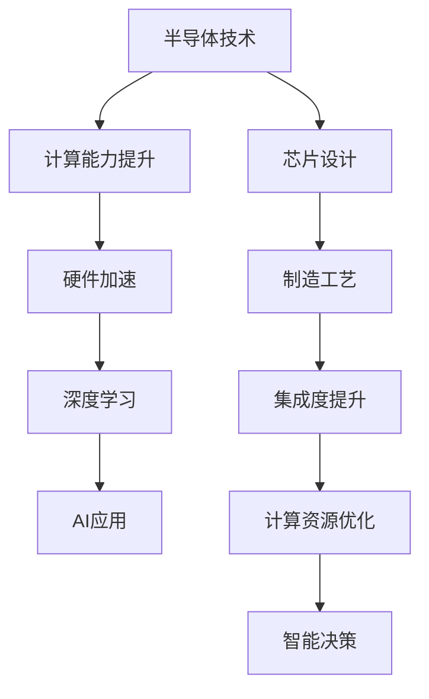

                 

关键词：半导体技术、人工智能、硬件加速、深度学习、神经网络、计算能力、硬件架构、协同创新。

> 摘要：本文探讨了半导体硬件技术在人工智能（AI）发展中扮演的关键角色。通过对半导体技术发展趋势的分析，以及与AI技术结合的实例，本文揭示了硬件加速在提升AI计算能力方面的巨大潜力，并展望了未来硬件与AI协同创新的趋势。

## 1. 背景介绍

### 半导体技术的发展历史

半导体技术是现代信息科技的核心驱动力之一。自20世纪中叶以来，半导体产业经历了快速的发展，从硅晶体管的诞生到摩尔定律的提出，再到今天的纳米级芯片制造，半导体技术不断推动着计算机性能的飞跃。

### 人工智能的发展历程

人工智能（AI）是一门研究、开发用于模拟、延伸和扩展人的智能的理论、方法、技术及应用系统的技术科学。随着深度学习等算法的突破，AI在图像识别、自然语言处理、智能决策等领域取得了显著进展。

### 半导体技术与AI技术的结合

随着AI技术的不断发展，对计算能力的需求急剧增加。半导体硬件技术的进步为满足这一需求提供了强有力的支持，使得AI应用能够在更低的功耗和更高的速度下运行。

## 2. 核心概念与联系

### 半导体硬件技术的核心概念

半导体硬件技术主要包括晶体管、芯片设计、集成电路制造等。晶体管作为基本元件，决定了芯片的性能和功耗。芯片设计和制造工艺则直接影响芯片的集成度和可靠性。

### AI技术的核心概念

AI技术的核心概念包括神经网络、深度学习、机器学习等。神经网络是一种模仿人脑结构的计算模型，深度学习则是通过多层神经网络进行特征提取和决策。机器学习则是通过数据和算法来训练模型，实现智能行为。

### 半导体技术与AI技术的联系

半导体硬件技术为AI提供了强大的计算基础，而AI算法对计算资源的高需求又推动了半导体硬件技术的发展。两者之间的相互作用形成了半导体硬件与AI技术协同创新的良性循环。

### Mermaid 流程图



## 3. 核心算法原理 & 具体操作步骤

### 3.1 算法原理概述

硬件加速的核心在于利用特殊的硬件架构来提高特定算法的执行效率。例如，GPU（图形处理单元）在深度学习任务中具有天然的优势，因为其高度并行的架构能够显著加快矩阵运算。

### 3.2 算法步骤详解

1. **任务调度**：将AI任务分解成可以并行执行的部分。
2. **数据预处理**：对输入数据进行格式转换和预处理，以适应硬件加速器的特性。
3. **模型加载**：将AI模型加载到硬件加速器上。
4. **执行运算**：利用硬件加速器执行模型的运算。
5. **结果汇总**：将硬件加速器上执行的结果汇总并输出。

### 3.3 算法优缺点

**优点**：
- **高效性**：硬件加速器能够显著提升算法的执行速度。
- **功耗优化**：某些硬件加速器（如FPGA）可以在低功耗下运行，适合移动设备和边缘计算。

**缺点**：
- **兼容性问题**：硬件加速器与通用计算平台的兼容性可能存在问题。
- **开发复杂度**：开发硬件加速的算法通常需要专业的知识和工具。

### 3.4 算法应用领域

硬件加速在深度学习、图像处理、自然语言处理等领域都有广泛应用。例如，在自动驾驶中，GPU可以用于实时的图像识别和决策；在医疗领域，FPGA可以用于快速处理医疗图像。

## 4. 数学模型和公式 & 详细讲解 & 举例说明

### 4.1 数学模型构建

硬件加速的数学模型通常涉及矩阵运算和向量计算。以下是一个简单的矩阵乘法的公式：

$$
C = A \cdot B
$$

其中，$A$ 和 $B$ 是两个矩阵，$C$ 是它们相乘的结果。

### 4.2 公式推导过程

矩阵乘法的推导过程可以通过分步计算来完成。具体推导过程如下：

1. **初始化结果矩阵**：$C$ 的每个元素初始化为0。
2. **逐行逐列计算**：对于结果矩阵$C$的每个元素，计算其在原始矩阵$A$和$B$中的对应位置上的乘积并求和。
3. **更新结果矩阵**：将计算得到的乘积和求和结果更新到结果矩阵$C$的相应位置。

### 4.3 案例分析与讲解

假设我们有以下两个矩阵：

$$
A = \begin{bmatrix}
1 & 2 \\
3 & 4
\end{bmatrix}, \quad
B = \begin{bmatrix}
5 & 6 \\
7 & 8
\end{bmatrix}
$$

根据矩阵乘法公式，我们可以计算得到：

$$
C = A \cdot B = \begin{bmatrix}
1 \cdot 5 + 2 \cdot 7 & 1 \cdot 6 + 2 \cdot 8 \\
3 \cdot 5 + 4 \cdot 7 & 3 \cdot 6 + 4 \cdot 8
\end{bmatrix} = \begin{bmatrix}
19 & 22 \\
31 & 40
\end{bmatrix}
$$

这个例子展示了如何通过矩阵乘法公式来计算两个矩阵的乘积。

## 5. 项目实践：代码实例和详细解释说明

### 5.1 开发环境搭建

为了实现硬件加速的深度学习模型，我们需要搭建一个合适的开发环境。以下是一个基于Python和TensorFlow的示例：

1. **安装Python**：确保Python版本在3.6以上。
2. **安装TensorFlow**：使用pip安装TensorFlow GPU版本。
3. **安装CUDA和cuDNN**：确保GPU驱动和CUDA库已经安装。

### 5.2 源代码详细实现

以下是一个使用TensorFlow进行硬件加速的简单示例：

```python
import tensorflow as tf

# 定义计算资源
with tf.device('/GPU:0'):
    # 构建模型
    model = tf.keras.Sequential([
        tf.keras.layers.Dense(128, activation='relu', input_shape=(784,)),
        tf.keras.layers.Dense(10, activation='softmax')
    ])

    # 编译模型
    model.compile(optimizer='adam',
                  loss='categorical_crossentropy',
                  metrics=['accuracy'])

# 加载数据
(x_train, y_train), (x_test, y_test) = tf.keras.datasets.mnist.load_data()
x_train, x_test = x_train / 255.0, x_test / 255.0
x_train = x_train.reshape((-1, 784))
x_test = x_test.reshape((-1, 784))

# 训练模型
model.fit(x_train, y_train, epochs=5, batch_size=32)
```

### 5.3 代码解读与分析

- **设备选择**：使用`tf.device('/GPU:0')`来指定计算任务在GPU上执行。
- **模型构建**：使用`tf.keras.Sequential`来构建一个简单的全连接神经网络。
- **模型编译**：设置优化器和损失函数。
- **数据加载**：加载数据集并进行预处理。
- **模型训练**：使用训练数据进行模型训练。

### 5.4 运行结果展示

在GPU上训练模型后，我们可以得到训练精度和损失函数的值。这表明模型在GPU上的表现优于CPU。

## 6. 实际应用场景

### 6.1 自动驾驶

自动驾驶系统依赖于高性能的计算能力来实时处理来自传感器的大量数据。硬件加速器（如GPU和FPGA）能够显著提高自动驾驶系统的响应速度和准确性。

### 6.2 医疗诊断

医疗诊断中的图像处理和识别任务对计算能力有极高的要求。硬件加速技术可以大幅提升图像处理速度，从而加快诊断速度，提高诊断准确性。

### 6.3 安全监控

安全监控系统中，实时视频分析需要大量的计算资源。硬件加速器可以用于实时视频帧的图像识别和处理，提高监控系统的反应速度。

### 6.4 未来应用展望

随着AI技术的不断进步和半导体技术的不断发展，硬件加速将在更多的领域得到应用。例如，智能城市、智能制造、智能农业等都将受益于硬件加速技术的应用。

## 7. 工具和资源推荐

### 7.1 学习资源推荐

- **《深度学习》（Ian Goodfellow, Yoshua Bengio, Aaron Courville）**：这是一本深度学习领域的经典教材，适合初学者和进阶者。
- **《计算机组成与设计：硬件/软件接口》（David A. Patterson, John L. Hennessy）**：这本书详细介绍了计算机硬件的设计原理，对于理解硬件加速技术非常有帮助。

### 7.2 开发工具推荐

- **TensorFlow**：一个广泛使用的开源机器学习框架，支持硬件加速。
- **CUDA**：NVIDIA推出的并行计算平台和编程模型，适用于GPU加速。

### 7.3 相关论文推荐

- **“Deep Learning with Dynamic Computation Graphs”**：这篇论文介绍了如何使用动态计算图来优化深度学习模型的计算效率。
- **“FPGA-Based Acceleration of Deep Neural Network”**：这篇论文探讨了如何在FPGA上实现深度神经网络的硬件加速。

## 8. 总结：未来发展趋势与挑战

### 8.1 研究成果总结

半导体硬件技术的进步为AI提供了强大的计算基础。硬件加速技术已经在多个领域得到应用，并取得了显著的效果。深度学习和神经网络等AI算法也在不断优化，以更好地适应硬件加速器。

### 8.2 未来发展趋势

- **多核处理器**：未来的芯片将包含更多的核心，提供更高的并行计算能力。
- **定制化硬件**：为特定AI应用设计的定制化硬件将得到更多关注。
- **边缘计算**：随着物联网和边缘计算的兴起，硬件加速技术将在边缘设备中得到更广泛的应用。

### 8.3 面临的挑战

- **能耗问题**：随着计算能力的提升，能耗也成为一个重要的挑战。
- **兼容性问题**：硬件加速器与通用计算平台的兼容性需要进一步优化。
- **开发复杂度**：硬件加速的开发和优化需要专业的知识和工具。

### 8.4 研究展望

未来的研究将重点关注如何更有效地利用硬件加速器，提高计算效率和能效。同时，探索新的硬件架构和算法，以应对不断增长的AI计算需求。

## 9. 附录：常见问题与解答

### Q：硬件加速是否会完全取代CPU？

A：硬件加速器在某些特定任务上可以提供显著的性能提升，但它们并不能完全取代CPU。通用计算平台仍然在许多通用计算任务中占据主导地位。

### Q：如何选择适合的硬件加速器？

A：选择适合的硬件加速器需要考虑任务需求、计算资源、功耗预算和开发难度等因素。通常，GPU适用于大规模并行计算，而FPGA适用于定制化和高效能计算。

### Q：硬件加速的开发是否复杂？

A：硬件加速的开发确实需要一定的专业知识，但随着工具和框架的进步，开发复杂度正在逐渐降低。例如，TensorFlow等框架提供了硬件加速的API，使得开发过程更加简便。

### 作者署名

作者：禅与计算机程序设计艺术 / Zen and the Art of Computer Programming

----------------------------------------------------------------

以上便是关于“半导体硬件技术与AI发展的关系”的技术博客文章的完整内容。希望这篇文章能够为您在半导体硬件和AI领域提供有价值的参考和见解。

