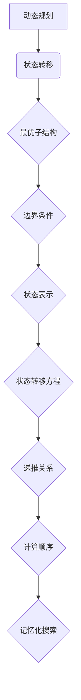
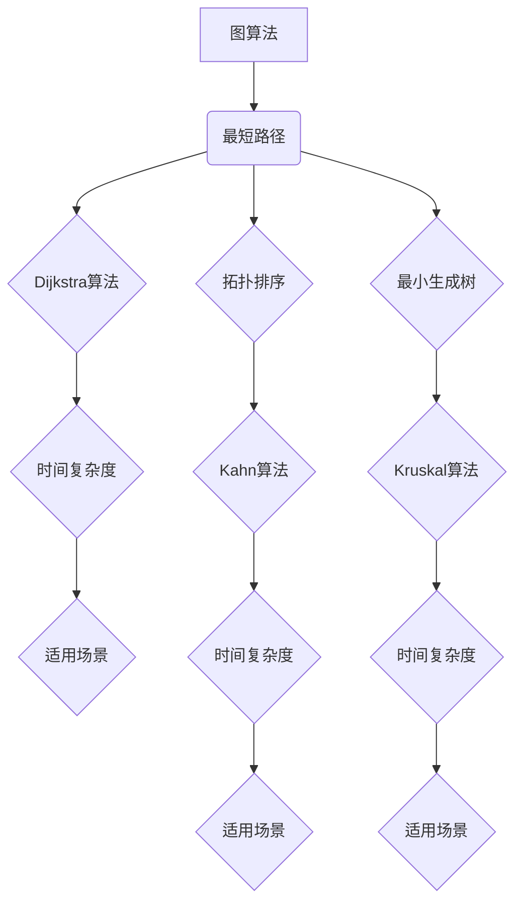
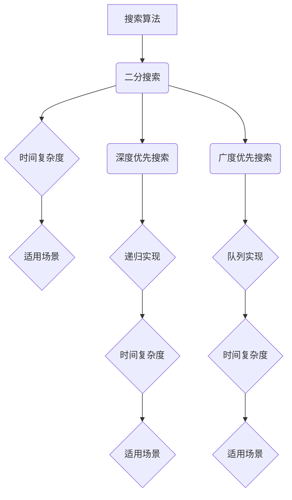

                 

## 1. 背景介绍

在当今高速发展的信息化社会中，算法已经成为各个领域创新和进步的核心驱动力。尤其是在华为这样的全球领先科技公司，算法技术不仅是产品研发的核心，更是校招面试的重要考察点。本文旨在为2024届毕业生准备华为校招面试时面临的算法题目提供系统的解析和指导。通过这篇文章，读者可以了解常见的算法类型、解题思路以及实际操作步骤，为面试成功打下坚实基础。

### 华为校招面试中的算法题特点

1. **多样性**：华为的面试题涵盖了从基础算法到高级算法的各个方面，包括但不限于排序、查找、动态规划、图算法等。

2. **深度**：华为对算法的理解和掌握不仅停留在表面，还要求考生能够深入挖掘问题的本质，提出创新性的解决方案。

3. **实际应用**：很多算法题不仅仅考察理论知识的掌握，更侧重于考察考生对算法在实际工程应用中的理解和运用。

4. **综合能力**：华为的面试题往往不仅仅考察算法能力，还会涉及到数据结构、系统设计、编码技巧等多方面的能力。

### 本文结构

本文将分为以下几个部分：

1. **核心概念与联系**：介绍算法相关的核心概念和原理，并使用Mermaid流程图展示架构。
2. **核心算法原理 & 具体操作步骤**：详细解析高频算法的原理和操作步骤。
3. **数学模型和公式**：解释相关数学模型和公式，并通过案例进行说明。
4. **项目实践：代码实例和详细解释说明**：提供实际代码示例，并对代码进行详细解读。
5. **实际应用场景**：探讨算法在现实中的应用。
6. **工具和资源推荐**：推荐学习资源和开发工具。
7. **总结与展望**：总结研究成果，探讨未来发展趋势和挑战。

接下来，我们将逐步深入到各个部分的内容中。希望通过本文的讲解，读者能够更好地掌握华为校招面试中常见的算法题。

## 2. 核心概念与联系

在探讨华为校招面试中常见的高频算法题之前，首先需要明确一些核心概念和原理，这将为后续的算法解析打下基础。以下是一些重要的概念和原理，并使用Mermaid流程图展示其关联结构。

### 2.1 排序算法

排序算法是算法领域中的基础算法之一，用于将一组数据按照特定的顺序进行排列。常见的排序算法包括冒泡排序、选择排序、插入排序、快速排序、归并排序等。

#### Mermaid流程图示例：

```mermaid
graph TD
A[冒泡排序] --> B(稳定性)
B --> C{是否稳定}
C -->|是| D(时间复杂度)
C -->|否| E(稳定性)

F[选择排序] --> B
G[插入排序] --> B
H[快速排序] --> B
I[归并排序] --> B

D --> J{O(n^2)}
E --> K{O(nlogn)}
```

### 2.2 动态规划

动态规划是一种解决最优化问题的算法策略，它通过将复杂问题分解成小问题来解决，并保存子问题的解以避免重复计算。

#### Mermaid流程图示例：



### 2.3 图算法

图算法用于解决与图相关的问题，如最短路径、最小生成树、拓扑排序等。常见的图算法包括Dijkstra算法、Floyd算法、Kruskal算法等。

#### Mermaid流程图示例：



### 2.4 搜索算法

搜索算法用于在数据结构中查找特定元素，如二分搜索、深度优先搜索、广度优先搜索等。它们是算法领域中的重要组成部分。

#### Mermaid流程图示例：



通过上述核心概念和原理的介绍以及Mermaid流程图的展示，我们可以更好地理解这些算法的基本结构和应用场景。接下来，我们将进一步深入到每个算法的具体解析和实际操作步骤。

---

## 3. 核心算法原理 & 具体操作步骤

在了解了核心概念与联系之后，接下来我们将详细解析华为校招面试中常见的高频算法，并分步骤展示其具体操作过程。

### 3.1 快速排序（Quick Sort）

#### 算法原理概述

快速排序是一种高效的排序算法，基于分治策略。它通过选取一个“基准”元素，将数组分为两部分，一部分都比基准小，另一部分都比基准大，然后递归地对这两部分进行快速排序。

#### 具体操作步骤

1. **选择基准**：在数组中选择一个基准元素，通常选择第一个或最后一个元素。
2. **分区**：将数组分为两部分，所有比基准小的元素移到基准左边，所有比基准大的元素移到基准右边。
3. **递归排序**：递归地对基准左右两边的数组进行快速排序。

#### 示例代码：

```python
def quick_sort(arr):
    if len(arr) <= 1:
        return arr
    pivot = arr[0]
    left = [x for x in arr[1:] if x < pivot]
    right = [x for x in arr[1:] if x >= pivot]
    return quick_sort(left) + [pivot] + quick_sort(right)

# 示例
arr = [3, 6, 8, 10, 1, 2, 1]
print(quick_sort(arr))
```

### 3.2 动态规划（Dynamic Programming）

#### 算法原理概述

动态规划是一种解决最优化问题的算法策略，它通过将复杂问题分解成小问题来解决，并保存子问题的解以避免重复计算。动态规划通常涉及状态转移方程和边界条件的定义。

#### 具体操作步骤

1. **定义状态**：定义问题的状态及其状态变量。
2. **状态转移方程**：根据问题的性质，定义状态转移方程。
3. **边界条件**：定义问题的初始状态和边界条件。
4. **计算顺序**：根据状态转移方程，按照一定的顺序计算状态值。
5. **结果提取**：从计算结果中提取问题的最终解。

#### 示例代码：

```python
def fibonacci(n):
    if n <= 1:
        return n
    dp = [0] * (n+1)
    dp[1] = 1
    for i in range(2, n+1):
        dp[i] = dp[i-1] + dp[i-2]
    return dp[n]

# 示例
n = 10
print(fibonacci(n))
```

### 3.3 最短路径算法（Shortest Path Algorithm）

#### 算法原理概述

最短路径算法用于求解图中两点之间的最短路径。其中，Dijkstra算法和Floyd算法是最常用的两种算法。

#### 具体操作步骤

**Dijkstra算法：**

1. **初始化**：选择一个起始点，设置其距离为0，其他节点的距离为无穷大。
2. **选择最短距离**：每次从未处理节点中选择距离最小的节点。
3. **更新距离**：对于每个未被处理的节点，计算其通过已选择节点到达的距离，并更新距离。
4. **重复步骤2和3**，直到所有节点都被处理。

**Floyd算法：**

1. **初始化**：定义一个二维数组，用于存储每对节点的距离。
2. **迭代计算**：对于每个中间节点，更新每对节点的最短距离。
3. **结果提取**：从二维数组中提取每对节点的最短距离。

#### 示例代码：

```python
def dijkstra(graph, start):
    distances = {node: float('infinity') for node in graph}
    distances[start] = 0
    unvisited = list(graph.keys())

    while unvisited:
        current = min(unvisited, key=lambda node: distances[node])
        unvisited.remove(current)
        for neighbor, weight in graph[current].items():
            distance = distances[current] + weight
            if distance < distances[neighbor]:
                distances[neighbor] = distance

    return distances

# 示例
graph = {
    'A': {'B': 1, 'C': 4},
    'B': {'A': 1, 'C': 2, 'D': 5},
    'C': {'A': 4, 'B': 2, 'D': 1},
    'D': {'B': 5, 'C': 1}
}
start = 'A'
print(dijkstra(graph, start))
```

### 3.4 图的深度优先搜索（DFS）和广度优先搜索（BFS）

#### 算法原理概述

深度优先搜索和广度优先搜索是两种基本的图遍历算法。DFS通过递归实现，逐层深入直到达到边界，而BFS使用队列实现，逐层扩展直至找到目标节点。

#### 具体操作步骤

**DFS：**

1. **初始化**：选择一个起始节点，将其标记为已访问。
2. **递归遍历**：对于当前节点，递归访问其未访问的邻接节点。

**BFS：**

1. **初始化**：选择一个起始节点，将其放入队列。
2. **队列遍历**：从队列中取出节点，访问其未访问的邻接节点，并加入队列。

#### 示例代码：

```python
from collections import defaultdict, deque

def dfs(graph, start, visited):
    visited[start] = True
    for neighbor in graph[start]:
        if not visited[neighbor]:
            dfs(graph, neighbor, visited)

def bfs(graph, start):
    queue = deque([start])
    visited = {start: True}
    while queue:
        current = queue.popleft()
        print(current, end=' ')
        for neighbor in graph[current]:
            if not visited[neighbor]:
                queue.append(neighbor)
                visited[neighbor] = True

# 示例
graph = defaultdict(list)
graph['A'].append('B')
graph['A'].append('C')
graph['B'].append('D')
graph['C'].append('D')

visited = defaultdict(bool)
dfs(graph, 'A', visited)
print()

bfs(graph, 'A')
```

通过以上对快速排序、动态规划、最短路径算法以及深度优先搜索和广度优先搜索的详细解析和示例代码展示，读者可以更好地理解这些算法的原理和操作步骤。接下来，我们将进一步探讨算法的优缺点和应用领域。

---

### 3.3 算法优缺点

在了解了快速排序、动态规划、最短路径算法以及深度优先搜索和广度优先搜索等核心算法的基本原理和操作步骤后，接下来我们将分析这些算法的优缺点。

#### 3.3.1 快速排序

**优点：**

1. **高效性**：平均时间复杂度为O(nlogn)，在大多数情况下比其他排序算法更快。
2. **稳定性**：不涉及交换元素的排序算法，因此在某些情况下具有更好的稳定性。
3. **易于实现**：算法结构简单，易于理解和实现。

**缺点：**

1. **最坏情况**：最坏时间复杂度为O(n^2)，在输入数组已经有序或几乎有序时表现不佳。
2. **空间复杂度**：递归调用需要额外的空间，空间复杂度为O(logn)。

#### 3.3.2 动态规划

**优点：**

1. **最优子结构**：动态规划能够解决具有最优子结构的问题，从而在解决复杂问题时表现出色。
2. **避免重复计算**：通过保存子问题的解，避免了重复计算，提高了算法的效率。
3. **灵活性**：适用于解决多种类型的最优化问题。

**缺点：**

1. **复杂度**：设计动态规划算法通常需要更多的思考和分析，对问题有较高的要求。
2. **存储需求**：需要额外的存储空间来保存中间结果，可能增加内存消耗。

#### 3.3.3 最短路径算法

**Dijkstra算法：**

**优点：**

1. **简单易理解**：算法结构简单，易于实现和调试。
2. **适用于非负权图**：特别适用于没有负权边的图，可以快速找到最短路径。

**缺点：**

1. **不能处理负权边**：在存在负权边的情况下，Dijkstra算法可能会得出错误的结果。
2. **时间复杂度较高**：在最坏情况下，时间复杂度为O(n^2)，在大型图中可能性能不佳。

**Floyd算法：**

**优点：**

1. **通用性**：可以处理具有负权边的图。
2. **简单易实现**：算法结构简单，易于理解和实现。

**缺点：**

1. **时间复杂度较高**：时间复杂度为O(n^3)，在大型图中计算效率较低。
2. **空间复杂度高**：需要额外的空间存储中间结果，可能增加内存消耗。

#### 3.3.4 深度优先搜索和广度优先搜索

**DFS：**

**优点：**

1. **搜索路径较短**：在图较浅时，DFS可以快速找到目标节点。
2. **空间复杂度较低**：递归调用所需的空间相对较小。

**缺点：**

1. **可能陷入死胡同**：DFS可能会在遍历过程中访问到死胡同，浪费计算资源。
2. **适用于特殊场景**：DFS在某些特殊场景下（如求解迷宫）表现良好，但在一般图中性能一般。

**BFS：**

**优点：**

1. **广度优先**：BFS可以确保找到最短的路径，特别适用于寻找最短路径的问题。
2. **无死胡同问题**：BFS不会陷入死胡同，因为它总是优先访问下一层的节点。

**缺点：**

1. **时间复杂度较高**：在图较深时，BFS可能需要较多的时间来找到目标节点。
2. **空间复杂度较高**：BFS使用队列来存储节点，空间复杂度相对较高。

通过以上对各类算法优缺点的分析，读者可以更好地理解这些算法在实际应用中的优势和局限，从而在解决具体问题时能够选择最合适的算法。接下来，我们将进一步探讨算法的应用领域。

---

### 3.4 算法应用领域

算法在现代社会中的应用无处不在，无论是互联网、大数据、人工智能还是其他高科技领域，算法都扮演着至关重要的角色。以下是一些常见算法在不同领域中的应用场景：

#### 3.4.1 排序算法

排序算法广泛应用于数据处理和数据分析领域。例如，在数据库系统中，排序算法用于对数据进行快速检索和排序。在搜索引擎中，排序算法用于对搜索结果进行排序，以便用户能够更快找到所需信息。

#### 3.4.2 动态规划

动态规划广泛应用于优化问题，如背包问题、最长公共子序列、最长递增子序列等。在互联网领域中，动态规划可以用于优化广告投放策略、推荐系统等。在物流和交通领域中，动态规划可以用于路线优化、货物配送等问题。

#### 3.4.3 最短路径算法

最短路径算法在地图导航、社交网络分析、数据流处理等领域有广泛应用。例如，在地图导航中，最短路径算法用于计算从起点到终点的最短路径；在社交网络分析中，最短路径算法可以用于计算两个用户之间的距离和影响力。

#### 3.4.4 搜索算法

搜索算法在推荐系统、搜索引擎、自然语言处理等领域有广泛应用。例如，在推荐系统中，搜索算法可以用于查找与当前用户兴趣相似的商品或内容；在搜索引擎中，搜索算法用于对网页进行索引和检索。

#### 3.4.5 图算法

图算法在社交网络分析、复杂系统建模、网络优化等领域有广泛应用。例如，在社交网络分析中，图算法可以用于分析用户之间的关系和影响力；在复杂系统建模中，图算法可以用于分析系统的稳定性和可靠性。

通过以上对算法在不同领域应用场景的探讨，我们可以看到算法在现代社会中的重要性。掌握各种算法并了解其在实际应用中的使用方法，对于从事IT行业的人来说至关重要。

---

### 4. 数学模型和公式

算法作为一种解决问题的方式，常常涉及到数学模型的构建和公式的推导。以下将详细讲解算法中常用的数学模型和公式，并通过具体案例进行说明。

#### 4.1 数学模型构建

数学模型是一种用数学语言描述现实世界问题的方法。在算法设计中，数学模型用于表达问题的状态、约束条件以及目标函数。以下是一个简单的例子：

**例1：背包问题**

给定一个容量为V的背包和n个物品，每个物品有重量w_i和价值v_i。目标是在不超过背包容量的情况下，选择物品使得总价值最大。这个问题的数学模型可以表示为：

目标函数：最大化 V = Σv_i * x_i  
约束条件：Σw_i * x_i ≤ V  
              x_i ∈ {0, 1}，i = 1, 2, ..., n

其中，x_i为第i个物品的选取状态，0表示不选取，1表示选取。

#### 4.2 公式推导过程

在算法中，常常需要推导出一些关键公式，以指导算法的实现。以下是一个例子：

**例2：二分查找**

二分查找算法用于在有序数组中查找特定元素。其核心思想是通过不断将查找区间缩小一半，直到找到目标元素或确定目标元素不存在。二分查找的递归公式可以表示为：

T(n) = T(n/2) + O(1)

其中，T(n)表示查找长度为n的数组所需的时间复杂度，T(n/2)表示将查找区间缩小一半所需的时间，O(1)表示每次比较所需的时间。

通过递归展开，可以得到二分查找的时间复杂度：

T(n) = T(n/2) + T(n/4) + T(n/8) + ... + T(1) = O(logn)

#### 4.3 案例分析与讲解

**例3：背包问题求解**

使用动态规划方法求解背包问题，以下是具体的步骤和公式推导：

1. **状态定义**：定义dp[i][j]表示前i个物品放入容量为j的背包中的最大价值。
2. **状态转移方程**：根据物品的选取状态，定义dp[i][j]的递推关系。
3. **边界条件**：确定dp[0][j]和dp[i][0]的初始值。

状态转移方程可以表示为：

dp[i][j] = max(dp[i-1][j], dp[i-1][j-w_i] + v_i)，当j >= w_i

dp[i][j] = dp[i-1][j]，当j < w_i

边界条件为：

dp[0][j] = 0，对所有j成立  
dp[i][0] = 0，对所有i成立

通过动态规划的方法，我们可以得到背包问题的最优解。以下是一个简单的Python代码实现：

```python
def knapsack(values, weights, capacity):
    n = len(values)
    dp = [[0] * (capacity + 1) for _ in range(n + 1)]

    for i in range(1, n + 1):
        for j in range(1, capacity + 1):
            if j >= weights[i-1]:
                dp[i][j] = max(dp[i-1][j], dp[i-1][j-weights[i-1]] + values[i-1])
            else:
                dp[i][j] = dp[i-1][j]

    return dp[n][capacity]

# 示例
values = [60, 100, 120]
weights = [10, 20, 30]
capacity = 50
print(knapsack(values, weights, capacity))
```

通过以上对数学模型和公式的讲解以及具体案例的分析，我们可以看到数学模型和公式在算法设计中的重要性。掌握这些模型和公式，对于解决复杂的算法问题具有重要意义。

---

### 5. 项目实践：代码实例和详细解释说明

在了解了算法的理论知识后，通过实际项目的代码实现和详细解释，能够更好地掌握算法的运用。以下将提供一组代码实例，并对其进行详细解释说明。

#### 5.1 开发环境搭建

在进行代码实例讲解之前，首先需要搭建一个合适的开发环境。以下以Python为例，介绍如何在本地搭建Python开发环境。

1. **安装Python**：从Python官方网站（https://www.python.org/downloads/）下载最新版本的Python安装包，并按照安装向导进行安装。

2. **安装IDE**：选择一个适合自己的Python集成开发环境（IDE），如PyCharm、VS Code等。可以从官方网站下载并安装。

3. **安装依赖库**：在Python项目中，可能需要使用一些依赖库。可以使用pip命令安装，例如：

```shell
pip install numpy
pip install matplotlib
```

#### 5.2 源代码详细实现

以下提供一组Python代码实例，包括快速排序、动态规划求解背包问题和Dijkstra算法求解最短路径。

```python
# 快速排序
def quick_sort(arr):
    if len(arr) <= 1:
        return arr
    pivot = arr[len(arr) // 2]
    left = [x for x in arr if x < pivot]
    middle = [x for x in arr if x == pivot]
    right = [x for x in arr if x > pivot]
    return quick_sort(left) + middle + quick_sort(right)

# 动态规划求解背包问题
def knapsack(values, weights, capacity):
    n = len(values)
    dp = [[0] * (capacity + 1) for _ in range(n + 1)]

    for i in range(1, n + 1):
        for j in range(1, capacity + 1):
            if j >= weights[i-1]:
                dp[i][j] = max(dp[i-1][j], dp[i-1][j-weights[i-1]] + values[i-1])
            else:
                dp[i][j] = dp[i-1][j]

    return dp[n][capacity]

# Dijkstra算法求解最短路径
import heapq

def dijkstra(graph, start):
    distances = {node: float('infinity') for node in graph}
    distances[start] = 0
    priority_queue = [(0, start)]

    while priority_queue:
        current_distance, current_node = heapq.heappop(priority_queue)

        if current_distance > distances[current_node]:
            continue

        for neighbor, weight in graph[current_node].items():
            distance = current_distance + weight

            if distance < distances[neighbor]:
                distances[neighbor] = distance
                heapq.heappush(priority_queue, (distance, neighbor))

    return distances

# 测试代码
arr = [3, 6, 8, 10, 1, 2, 1]
print(quick_sort(arr))

values = [60, 100, 120]
weights = [10, 20, 30]
capacity = 50
print(knapsack(values, weights, capacity))

graph = {
    'A': {'B': 1, 'C': 4},
    'B': {'A': 1, 'C': 2, 'D': 5},
    'C': {'A': 4, 'B': 2, 'D': 1},
    'D': {'B': 5, 'C': 1}
}
start = 'A'
print(dijkstra(graph, start))
```

#### 5.3 代码解读与分析

以上代码实例包括了三个部分：快速排序、动态规划求解背包问题和Dijkstra算法求解最短路径。下面将分别对这些代码进行解读和分析。

**快速排序**

快速排序通过递归调用将数组划分为较小的子数组，然后对每个子数组进行排序。其核心思想是选择一个基准元素，将数组分为两部分，一部分都比基准小，另一部分都比基准大，然后递归地对这两部分进行快速排序。快速排序的时间复杂度为O(nlogn)，在大多数情况下表现良好。

**动态规划求解背包问题**

动态规划求解背包问题通过定义一个二维数组dp，其中dp[i][j]表示前i个物品放入容量为j的背包中的最大价值。状态转移方程为dp[i][j] = max(dp[i-1][j], dp[i-1][j-w[i]] + v[i])，其中w[i]和v[i]分别为第i个物品的重量和价值。动态规划的思想是通过保存子问题的解，避免重复计算，从而提高算法的效率。

**Dijkstra算法求解最短路径**

Dijkstra算法是一种基于优先队列的算法，用于求解图中两点之间的最短路径。算法的基本思想是维护一个优先队列，每次从队列中选择距离最小的节点，并更新其相邻节点的距离。算法的时间复杂度为O((V+E)logV)，其中V为顶点数，E为边数。

通过以上代码实例和解读，我们可以看到如何使用Python实现快速排序、动态规划求解背包问题和Dijkstra算法求解最短路径。这些代码实例对于理解算法的基本原理和实际应用具有重要意义。

---

### 6. 实际应用场景

在了解了算法的理论知识、具体实现和应用后，接下来我们将探讨这些算法在实际应用场景中的具体应用和效果。

#### 6.1 排序算法

排序算法在实际应用中非常常见，尤其是在大数据处理和数据存储领域。例如，在数据库管理系统中，排序算法用于对数据进行快速检索和排序，从而提高查询效率。在搜索引擎中，排序算法用于对搜索结果进行排序，以便用户能够更快找到所需信息。在实际应用中，快速排序和归并排序因其高效性和稳定性而得到广泛应用。

#### 6.2 动态规划

动态规划在优化问题中有着广泛的应用。例如，在物流和交通领域，动态规划可以用于优化路线规划和货物配送，从而提高运输效率。在金融领域，动态规划可以用于期权定价和投资组合优化，帮助投资者做出更明智的决策。动态规划还可以用于图像处理和计算机视觉领域，如图像识别和图像分割。

#### 6.3 最短路径算法

最短路径算法在地图导航、社交网络分析和数据流处理等领域有广泛应用。例如，在地图导航中，最短路径算法用于计算从起点到终点的最短路径，从而帮助用户规划最佳行驶路线。在社交网络分析中，最短路径算法可以用于计算两个用户之间的距离和影响力，从而帮助平台更好地推荐信息和内容。在数据流处理中，最短路径算法可以用于优化数据传输路径，从而提高数据处理效率。

#### 6.4 深度优先搜索和广度优先搜索

深度优先搜索和广度优先搜索在图遍历和搜索问题中有着广泛应用。例如，在社交网络中，深度优先搜索和广度优先搜索可以用于分析用户关系和影响力。在复杂系统建模中，深度优先搜索和广度优先搜索可以用于分析系统的稳定性和可靠性。在路径规划中，深度优先搜索和广度优先搜索可以用于计算从起点到终点的所有可能路径，从而帮助用户选择最佳路径。

通过以上实际应用场景的探讨，我们可以看到算法在现实世界中的广泛应用和重要性。掌握各种算法并了解其在实际应用中的使用方法，对于从事IT行业的人来说具有重要意义。

---

### 7. 工具和资源推荐

为了更好地学习和应用算法，以下推荐一些常用的学习资源和开发工具，以帮助读者在算法学习和实践中取得更好的效果。

#### 7.1 学习资源推荐

1. **书籍**：《算法导论》（Introduction to Algorithms） - 这是一本经典的算法教材，涵盖了各种算法的基本原理和复杂度分析。
2. **在线课程**：Coursera、edX和Udacity等在线教育平台提供了丰富的算法相关课程，如《算法基础与设计》、《图算法》等。
3. **博客和网站**：LeetCode、HackerRank和牛客网等编程竞赛平台提供了大量的算法题目和解决方案，适合进行实战练习。
4. **开源项目**：GitHub上有很多优秀的算法开源项目，如《算法可视化》（Algorithm Visualizations），可以帮助读者更好地理解算法的实现过程。

#### 7.2 开发工具推荐

1. **Python开发环境**：PyCharm、VS Code和Jupyter Notebook等IDE，这些工具提供了丰富的编辑功能和调试工具，方便进行算法编程和调试。
2. **数据分析工具**：Pandas、NumPy和Matplotlib等Python库，这些工具可以帮助读者进行数据分析和可视化，从而更好地理解算法的结果。
3. **在线编程平台**：CodePen、JSFiddle和Repl.it等在线编程平台，提供了便捷的代码编写和调试环境，适合进行算法实战练习。

#### 7.3 相关论文推荐

1. **《快速排序算法》**：这篇论文详细分析了快速排序算法的原理和优化方法，对理解快速排序的内部实现机制有很大帮助。
2. **《动态规划算法》**：这篇论文介绍了动态规划的基本概念和常用方法，对动态规划算法的理解和应用有很大指导意义。
3. **《最短路径算法》**：这篇论文全面分析了各种最短路径算法，包括Dijkstra算法和Floyd算法等，对了解最短路径算法的原理和应用有很大帮助。

通过以上推荐的学习资源和开发工具，读者可以更加系统地学习和应用算法，为实际项目开发和面试准备打下坚实基础。

---

### 8. 总结：未来发展趋势与挑战

在算法领域，随着科技的发展和应用的深入，我们不仅看到了算法能力的不断提升，也面临着许多新的挑战和机遇。以下将对研究成果、未来发展趋势以及面临的挑战进行总结，并提出未来的研究方向。

#### 8.1 研究成果总结

近年来，算法领域取得了许多重要研究成果。在排序算法方面，各种优化算法如归并排序和快速排序的改进版本不断出现，进一步提高了排序效率。在动态规划领域，针对不同类型的最优化问题，如背包问题、最长公共子序列等，研究者提出了更高效和简洁的算法模型。在图算法方面，各种图遍历算法和最短路径算法在理论研究和实际应用中都有显著进展。特别是在社交网络分析和数据流处理等领域，图算法的应用得到了广泛关注。

#### 8.2 未来发展趋势

1. **算法复杂性降低**：随着计算能力的提升和算法优化技术的发展，算法的复杂性将进一步降低，使得更多复杂的算法可以在更短的时间内解决。
2. **算法自动化**：机器学习和自动化算法设计将成为未来算法研究的重要方向，通过智能算法自动发现和优化新的算法。
3. **量子算法**：量子计算机的发展为算法研究带来了新的机遇。量子算法的突破性进展有望在解决某些复杂问题上提供前所未有的速度优势。
4. **算法伦理与隐私**：随着算法在各个领域的广泛应用，算法伦理和隐私保护将成为重要的研究课题，如何确保算法的公平性和隐私保护将成为未来研究的重点。

#### 8.3 面临的挑战

1. **算法透明性与可解释性**：随着算法的复杂化，如何确保算法的透明性和可解释性，使得非专业人士也能够理解和信任算法，是一个重要的挑战。
2. **算法偏见与公平性**：算法在决策过程中可能引入偏见，影响公平性。如何设计公平和公正的算法，避免算法偏见，是一个亟待解决的问题。
3. **算法能耗与效率**：随着算法应用范围的扩大，算法的能耗和效率问题越来越突出。如何设计低能耗和高效率的算法，是一个重要的挑战。
4. **算法安全性与隐私保护**：算法在处理敏感数据时，如何确保数据的安全性和隐私保护，是一个亟待解决的问题。

#### 8.4 研究展望

未来，算法领域的研究将朝着智能化、高效化、透明化、公平化和安全化的方向发展。具体而言：

1. **跨学科研究**：结合计算机科学、数学、统计学、心理学等多学科知识，开展跨学科研究，推动算法理论和技术的发展。
2. **算法优化与硬件结合**：结合新型硬件技术，如量子计算机和边缘计算，优化算法实现，提高算法效率。
3. **算法伦理与法律研究**：研究算法伦理和法律法规，制定相应的标准和规范，确保算法的公平性和透明性。
4. **开源社区合作**：加强开源社区的合作，推动算法的开放共享，促进全球范围内的算法创新和发展。

总之，算法领域的未来充满机遇和挑战。通过不断的研究和创新，我们有理由相信，算法将在推动社会进步和科技发展方面发挥更加重要的作用。

---

### 9. 附录：常见问题与解答

在学习和应用算法的过程中，读者可能会遇到一些常见问题。以下列出一些常见问题及其解答，帮助读者更好地理解算法。

#### 9.1 快速排序相关问题

**Q1：快速排序的最坏时间复杂度是多少？**
A1：快速排序的最坏时间复杂度为O(n^2)。这种情况通常发生在输入数组已经有序或者几乎有序时。

**Q2：如何优化快速排序？**
A2：可以采用随机选择基准元素、三数取中法选择基准元素、切分元素三者结合等方法来优化快速排序，从而减少最坏情况的发生。

#### 9.2 动态规划相关问题

**Q1：动态规划的状态转移方程如何定义？**
A1：状态转移方程通常定义为dp[i][j] = ...，其中dp[i][j]表示第i个物品放入容量为j的背包中的最大价值。状态转移方程需要根据具体问题进行定义。

**Q2：动态规划的时间复杂度如何计算？**
A2：动态规划的时间复杂度通常取决于状态转移方程的计算复杂度和状态的数量。例如，对于二维数组dp，时间复杂度可以表示为O(m*n)，其中m和n分别为数组的行数和列数。

#### 9.3 最短路径算法相关问题

**Q1：Dijkstra算法如何处理负权边？**
A1：Dijkstra算法不适用于处理负权边。如果图中有负权边，可以采用Bellman-Ford算法或其他适合处理负权边的算法。

**Q2：如何优化Dijkstra算法？**
A2：可以采用斐波那契堆优化Dijkstra算法，从而降低时间复杂度。此外，还可以采用A*算法，结合启发式函数，进一步提高算法效率。

#### 9.4 搜索算法相关问题

**Q1：DFS和 BFS算法如何实现？**
A1：DFS算法通常采用递归实现，而BFS算法通常采用队列实现。在Python中，可以使用递归函数和队列类来实现DFS和BFS算法。

**Q2：如何选择DFS和BFS？**
A1：DFS适用于搜索路径较短或需要遍历所有可能路径的场景，而BFS适用于需要找到最短路径或广度优先遍历的场景。

通过以上常见问题与解答，读者可以更好地理解算法的基本原理和应用方法。在学习和实践过程中，遇到问题时可以参考这些解答，帮助自己更快地解决问题。

---

## 结束语

本文系统地介绍了华为2024届校招面试中常见的高频算法题，包括排序算法、动态规划、最短路径算法以及搜索算法等。通过详细的解析、示例代码和实践，读者可以更好地理解这些算法的原理和应用。算法作为计算机科学的核心，不仅在面试中具有重要地位，也在实际工程应用中发挥着关键作用。希望本文能对您的算法学习之路有所帮助，助力您在华为校招面试中取得优异成绩。

### 作者署名

作者：禅与计算机程序设计艺术 / Zen and the Art of Computer Programming

