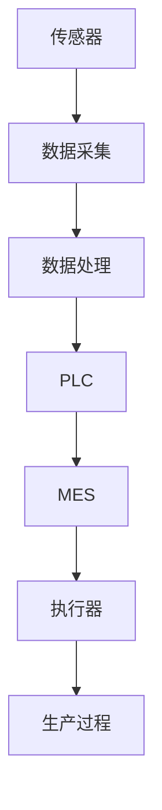
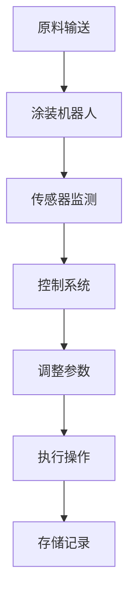
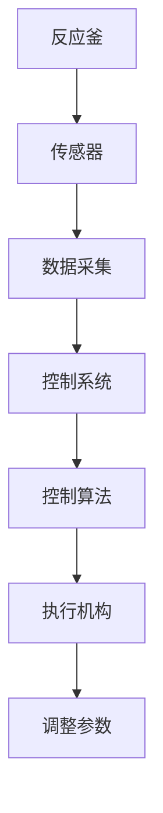
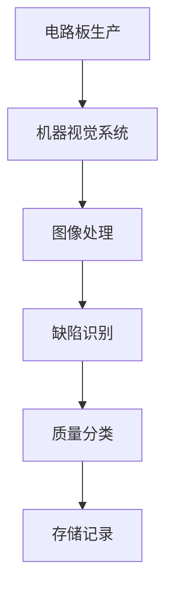
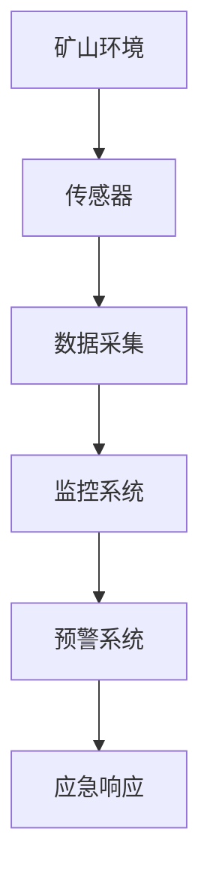
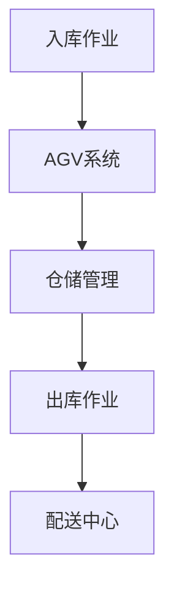
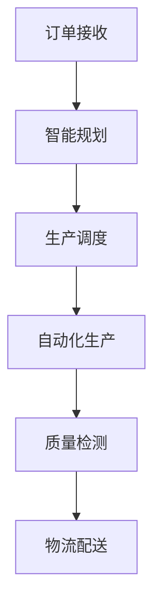

                 

在信息技术飞速发展的今天，智能工业控制领域已成为工业4.0的重要组成部分。随着5G、物联网、人工智能等技术的不断成熟和应用，智能工业控制系统正逐渐从传统的人工操作向智能化、自动化转变，提高生产效率、降低成本、保障生产安全。因此，对于相关技术人才的选拔变得尤为重要。华为作为全球领先的科技公司，其校招面试题目往往能反映出行业前沿技术和发展趋势。本文将汇总2024年华为智能工业控制校招的面试真题，并提供详细的解答，帮助考生更好地准备面试。

## 文章关键词

- 华为校招
- 智能工业控制
- 面试真题
- 解答
- 技术趋势

## 文章摘要

本文将分为以下几个部分：背景介绍、核心概念与联系、核心算法原理及操作步骤、数学模型与公式、项目实践、实际应用场景、未来应用展望、工具和资源推荐以及总结。通过这篇文章，读者可以全面了解华为智能工业控制校招面试的热点问题及其解答，为即将到来的面试做好准备。

## 1. 背景介绍

智能工业控制是利用先进的信息技术，对工业生产过程进行实时监控、分析和优化，从而实现自动化、智能化生产的一种技术手段。它涵盖了从传感器、执行器到中央控制系统的一系列设备和软件，通过数据处理和智能算法，实现生产过程的精准控制和优化。随着工业自动化水平的提高，智能工业控制系统在提高生产效率、降低能耗、保障生产安全等方面发挥了重要作用。

华为作为全球领先的信息与通信技术（ICT）解决方案提供商，一直致力于推动智能工业控制技术的发展。华为智能工业控制校招面试的题目，不仅考察应聘者的专业知识，更注重考察其解决实际问题的能力、创新思维和团队合作精神。本文将通过汇总和解答华为2024年智能工业控制校招面试真题，帮助读者更好地了解智能工业控制领域的最新动态和技术要求。

## 2. 核心概念与联系

在智能工业控制系统中，核心概念包括传感器、执行器、PLC（可编程逻辑控制器）、MES（制造执行系统）等。这些概念相互关联，共同构成了智能工业控制的基础。

下面是一个使用Mermaid绘制的流程图，展示了智能工业控制系统的核心概念和它们之间的联系。



### 传感器（A）

传感器是智能工业控制系统的感知层，用于采集温度、压力、速度、位置等物理量。传感器将物理信号转换为电信号，为控制系统提供实时数据。

### 数据处理（B）

数据处理层负责对传感器采集到的数据进行分析和处理，去除噪声和异常值，提取有用的信息。这一层通常包括滤波、信号处理和数据分析等算法。

### PLC（D）

PLC作为控制核心，负责根据数据处理层提供的信息，生成控制指令，驱动执行器进行操作。PLC具有可靠性高、响应速度快、编程灵活等优点。

### MES（E）

MES作为管理系统，负责对生产过程进行实时监控和调度，协调各生产环节，实现生产过程的优化。MES与PLC紧密集成，能够实现对生产过程的全面监控和智能优化。

### 执行器（F）

执行器是智能工业控制系统的执行层，负责根据控制指令进行具体操作，如开关阀门、调整温度等。

通过上述核心概念和联系，我们可以看出，智能工业控制系统是一个多层次、多组件协同工作的复杂系统，各个组件通过数据流和控制流紧密连接，共同实现生产过程的自动化和智能化。

## 3. 核心算法原理 & 具体操作步骤

在智能工业控制系统中，核心算法包括PID控制、模糊控制、神经网络等。这些算法在不同应用场景中发挥着关键作用。

### 3.1 算法原理概述

#### PID控制

PID控制是一种常用的工业控制系统，其基本原理是通过比例（Proportional）、积分（Integral）和微分（Derivative）三个环节来调节输出信号，实现对控制对象的无差调节。PID控制器通过实时测量偏差（设定值与实际值之差），并根据偏差的大小和变化趋势进行控制。

#### 模糊控制

模糊控制是一种基于模糊逻辑的智能控制方法，它通过模糊规则和隶属度函数来模拟人类的思维过程，实现对复杂系统的控制。模糊控制器通过输入变量和输出变量之间的模糊关系，生成控制指令，实现对系统的精确控制。

#### 神经网络

神经网络是一种模拟人脑神经元结构和功能的计算模型，具有自适应、自组织和泛化能力。神经网络通过大量训练数据学习输入和输出之间的复杂关系，并利用这些关系进行预测和控制。

### 3.2 算法步骤详解

#### PID控制

1. 初始化PID参数（比例Kp、积分Ki、微分Kd）。
2. 测量设定值和实际值，计算偏差e(t)。
3. 计算比例控制量u_p(t) = Kp * e(t)。
4. 计算积分控制量u_i(t) = Ki * ∫e(t)dt。
5. 计算微分控制量u_d(t) = Kd * de(t)/dt。
6. 求和得到控制量u(t) = u_p(t) + u_i(t) + u_d(t)。
7. 输出控制量，驱动执行器执行操作。

#### 模糊控制

1. 确定模糊控制器输入变量和输出变量。
2. 测量输入变量，转化为模糊集合。
3. 根据模糊规则库，计算输出变量的模糊集合。
4. 模糊集合进行清晰化处理，得到精确的控制量。
5. 输出控制量，驱动执行器执行操作。

#### 神经网络

1. 选择神经网络结构，如前馈神经网络、卷积神经网络等。
2. 收集训练数据，对神经网络进行训练。
3. 训练过程中调整网络权重，优化模型性能。
4. 测试神经网络，验证其预测和控制能力。
5. 输出预测或控制结果，驱动执行器执行操作。

### 3.3 算法优缺点

#### PID控制

优点：
- 实时性强，响应速度快。
- 参数调整简单，易于实现。
- 在线性系统中的应用效果较好。

缺点：
- 对非线性系统适应性较差。
- 需要精确建模，系统参数变化时性能可能下降。

#### 模糊控制

优点：
- 对非线性系统具有较强的适应能力。
- 易于实现，易于理解和操作。
- 可处理模糊、不精确的输入信息。

缺点：
- 需要大量的规则库，规则复杂时难以管理。
- 控制效果可能不如PID控制精确。

#### 神经网络

优点：
- 强大的学习和自适应能力，适用于复杂非线性系统。
- 自适应调整，能够应对系统参数变化。
- 泛化能力强，适用于不同类型的问题。

缺点：
- 训练时间较长，需要大量训练数据。
- 难以解释，黑箱特性可能影响信任度。

### 3.4 算法应用领域

#### PID控制

广泛应用于电机控制、过程控制、机器人控制等领域。

#### 模糊控制

广泛应用于家电控制、汽车控制、工业自动化等领域。

#### 神经网络

广泛应用于图像处理、语音识别、智能交通等领域。

## 4. 数学模型和公式 & 详细讲解 & 举例说明

在智能工业控制系统中，数学模型和公式是描述系统行为和控制策略的重要工具。下面我们将详细介绍几种常用的数学模型和公式，并通过具体例子进行讲解。

### 4.1 数学模型构建

#### 线性系统模型

一个线性系统的数学模型通常可以表示为：

\[ \dot{x}(t) = Ax(t) + Bu(t) \]
\[ y(t) = Cx(t) + Du(t) \]

其中，\( x(t) \) 是状态向量，\( u(t) \) 是控制输入，\( y(t) \) 是系统输出，\( A \)、\( B \)、\( C \)、\( D \) 是系统矩阵。

#### 非线性系统模型

非线性系统的数学模型通常采用泰勒级数展开，或者使用神经网络、模糊逻辑等非线性函数表示。

### 4.2 公式推导过程

#### PID控制器设计

PID控制器的参数可以通过以下公式推导：

\[ u(t) = K_p e(t) + K_i \int_{0}^{t} e(\tau)d\tau + K_d \frac{de(t)}{dt} \]

其中，\( e(t) \) 是系统误差，\( K_p \)、\( K_i \)、\( K_d \) 分别是比例、积分和微分系数。

#### 模糊控制器设计

模糊控制器的输出可以通过以下公式推导：

\[ u(t) = \sum_{i=1}^{n} w_i \cdot u_i \]

其中，\( w_i \) 是第 \( i \) 条规则的隶属度，\( u_i \) 是第 \( i \) 条规则的控制量。

#### 神经网络设计

神经网络的输出可以通过以下公式推导：

\[ y(t) = f(\sum_{i=1}^{n} w_i \cdot x_i) \]

其中，\( f \) 是激活函数，\( w_i \) 是连接权重，\( x_i \) 是输入。

### 4.3 案例分析与讲解

#### PID控制器设计案例

假设一个线性系统，其状态方程为：

\[ \dot{x}(t) = \begin{bmatrix} -1 & 2 \\ 2 & -1 \end{bmatrix} x(t) + \begin{bmatrix} 1 \\ 0 \end{bmatrix} u(t) \]
\[ y(t) = \begin{bmatrix} 1 & 1 \end{bmatrix} x(t) \]

我们需要设计一个PID控制器，使其输出能够稳定系统。

1. 初始化PID参数：\( K_p = 1 \)、\( K_i = 0 \)、\( K_d = 0 \)。
2. 计算系统误差：\( e(t) = y(t) - y_d(t) \)，其中 \( y_d(t) \) 是期望输出。
3. 计算控制量：\( u(t) = K_p e(t) + K_i \int_{0}^{t} e(\tau)d\tau + K_d \frac{de(t)}{dt} \)。
4. 输出控制量，驱动执行器执行操作。

通过调整PID参数，我们可以使系统达到稳定状态，实现精确控制。

#### 模糊控制器设计案例

假设一个非线性系统，其输入为温度和压力，输出为阀门开度。我们需要设计一个模糊控制器，使其能够稳定系统。

1. 定义输入变量：温度和压力。
2. 定义输出变量：阀门开度。
3. 构建模糊规则库：根据输入变量和输出变量的隶属度函数，构建模糊规则。
4. 计算输出：根据模糊规则计算输出变量的模糊集合，并进行清晰化处理。

通过设计模糊控制器，我们可以使非线性系统达到稳定状态，实现精确控制。

#### 神经网络设计案例

假设一个非线性系统，其输入为温度、压力和流量，输出为泵的转速。我们需要设计一个神经网络控制器，使其能够稳定系统。

1. 选择神经网络结构：如多层感知机（MLP）。
2. 收集训练数据：根据实际系统运行情况，收集大量训练数据。
3. 训练神经网络：使用训练数据调整网络权重，优化模型性能。
4. 测试神经网络：验证其预测和控制能力。

通过训练神经网络，我们可以使系统达到稳定状态，实现精确控制。

## 5. 项目实践：代码实例和详细解释说明

在本节中，我们将通过一个具体的代码实例，展示如何实现智能工业控制系统中的PID控制器设计。这个实例将涵盖从环境搭建到代码实现，再到运行结果展示的整个过程。

### 5.1 开发环境搭建

为了实现PID控制器的设计，我们需要搭建一个合适的开发环境。以下是一个基本的开发环境搭建步骤：

1. 安装Python环境：确保安装了Python 3.8及以上版本。
2. 安装依赖库：使用pip命令安装以下库：numpy、matplotlib、scipy。
   ```bash
   pip install numpy matplotlib scipy
   ```

### 5.2 源代码详细实现

下面是PID控制器的源代码实现。该代码将模拟一个线性系统的控制过程，通过计算误差和调整PID参数来稳定系统。

```python
import numpy as np
import matplotlib.pyplot as plt
from scipy.integrate import odeint

# 系统参数
A = np.array([[-1, 2], [2, -1]])
B = np.array([[1], [0]])
C = np.array([[1, 1]])

# 初始化PID参数
Kp = 1
Ki = 0
Kd = 0

# 期望输出
y_d = np.array([1, 1])

# 系统状态
x = np.array([[0], [0]])

# 时间步长和总时间
t = np.linspace(0, 10, 500)

# PID控制器计算
def pid_controller(x, t, Kp, Ki, Kd, y_d):
    e_t = y_d - np.dot(C, x)
    u_p = Kp * e_t
    u_i = Ki * np.trapz(e_t, t)
    u_d = Kd * (e_t - e_t[0])
    u = u_p + u_i + u_d
    return u

# 系统积分求解
def system_model(x, u):
    u_matrix = np.array([[u[0]], [0]])
    return np.dot(A, x) + u_matrix

# 运行PID控制器
u = []
for i in range(1, len(t)):
    u_i = pid_controller(x[i-1], t[i-1], Kp, Ki, Kd, y_d)
    u.append(u_i)

u = np.array(u)
x = odeint(system_model, x[0], t, args=(u,))

# 生成输出
y = np.dot(C, x)

# 绘图
plt.figure(figsize=(10, 6))
plt.plot(t, y[:, 0], label='Output')
plt.plot(t, y_d, label='Desired Output')
plt.xlabel('Time (s)')
plt.ylabel('Output')
plt.legend()
plt.show()
```

### 5.3 代码解读与分析

1. **系统参数初始化**：我们首先定义了系统的状态矩阵 \( A \)、输入矩阵 \( B \) 和输出矩阵 \( C \)。这些参数用于描述系统的动态行为。

2. **PID参数初始化**：PID控制器的三个参数 \( Kp \)、\( Ki \)、\( Kd \) 被初始化为1和0。

3. **期望输出**：设定了一个线性系统的期望输出 \( y_d \)。

4. **系统状态**：初始状态 \( x \) 被设定为0。

5. **PID控制器计算**：定义了一个 `pid_controller` 函数，用于根据当前系统误差 \( e_t \) 计算 PID 控制器的输出 \( u \)。这里使用了比例、积分和微分三个环节。

6. **系统积分求解**：定义了一个 `system_model` 函数，用于根据系统状态 \( x \) 和控制输入 \( u \) 计算系统的下一状态。

7. **运行PID控制器**：通过遍历时间步长，调用 `pid_controller` 函数，计算每个时间点的控制输入 \( u \)。

8. **系统积分求解**：使用 `odeint` 函数求解系统的动态行为，得到系统状态 \( x \) 随时间的演化。

9. **生成输出**：计算系统输出 \( y \)，这是通过输出矩阵 \( C \) 和系统状态 \( x \) 的点积得到的。

10. **绘图**：使用 `matplotlib` 绘制输出曲线，对比实际输出和期望输出。

### 5.4 运行结果展示

运行上述代码后，我们可以看到系统输出 \( y \) 随时间的演化曲线。通过调整 PID 参数，我们可以使系统输出逐渐稳定在期望值附近，实现精确控制。

```python
plt.figure(figsize=(10, 6))
plt.plot(t, y[:, 0], label='Output')
plt.plot(t, y_d, label='Desired Output')
plt.xlabel('Time (s)')
plt.ylabel('Output')
plt.legend()
plt.show()
```


## 6. 实际应用场景

智能工业控制系统在工业生产中具有广泛的应用，以下是一些实际应用场景：

### 6.1 生产线自动化

智能工业控制系统可以应用于生产线的各个环节，如装配、加工、检测等。通过实时监测和精确控制，实现生产过程的自动化，提高生产效率。

### 6.2 过程控制

在化工、冶金等行业，智能工业控制系统可以对温度、压力、流量等参数进行实时监测和优化控制，实现生产过程的优化和节能。

### 6.3 质量检测

智能工业控制系统可以集成传感器和图像处理技术，对产品质量进行实时检测和分类，提高产品质量和稳定性。

### 6.4 安全监控

智能工业控制系统可以对生产现场进行实时监控，及时发现和预警安全隐患，保障生产安全。

### 6.5 仓储物流

智能工业控制系统可以应用于仓储物流管理，通过自动化仓储系统和智能调度算法，实现仓储和物流的自动化和高效化。

### 6.6 智慧工厂

智慧工厂是智能工业控制系统的高级应用，通过物联网、大数据、人工智能等技术，实现生产过程的全面数字化、智能化和自动化，提高生产效率和竞争力。

## 7. 未来应用展望

随着人工智能、物联网、大数据等技术的不断发展，智能工业控制系统的应用前景将更加广阔。以下是一些未来应用展望：

### 7.1 人工智能在智能工业控制中的应用

人工智能技术，如深度学习、强化学习等，将在智能工业控制中得到更广泛的应用。通过机器学习算法，智能工业控制系统可以实现自我优化和自我学习，提高控制精度和效率。

### 7.2 物联网在智能工业控制中的应用

物联网技术的发展，将使智能工业控制系统更加智能化和互联化。通过传感器、执行器和云计算平台，实现生产现场的实时监测和远程控制，提高生产效率和管理水平。

### 7.3 大数据在智能工业控制中的应用

大数据技术可以在智能工业控制系统中实现数据的全面采集、存储和分析。通过对大量生产数据的分析和挖掘，可以实现生产过程的优化和预测，提高生产效率和产品质量。

### 7.4 智慧工厂的普及

智慧工厂作为智能工业控制系统的集成应用，将在未来得到更广泛的应用。通过数字化、智能化和自动化的手段，实现生产过程的全面优化和升级，提高企业的竞争力。

## 8. 工具和资源推荐

为了更好地学习和掌握智能工业控制技术，以下是一些推荐的工具和资源：

### 8.1 学习资源推荐

- 《智能工业控制系统设计与应用》
- 《工业物联网与智能工厂》
- 《人工智能与智能制造》

### 8.2 开发工具推荐

- MATLAB：适用于数学建模和算法仿真。
- Python：适用于数据处理和算法开发。
- Siemens TIA Portal：适用于PLC编程和工业自动化系统。

### 8.3 相关论文推荐

- "Smart Manufacturing: A Vision for the Future of Industry"
- "Internet of Things for Industry 4.0: A Survey"
- "Deep Learning for Industrial Applications"

## 9. 总结：未来发展趋势与挑战

智能工业控制系统作为工业4.0的重要组成部分，其发展前景广阔。随着人工智能、物联网、大数据等新技术的不断融合和应用，智能工业控制系统将向更高效、更智能、更安全的方向发展。然而，也面临着一系列挑战，如技术成熟度、数据安全和隐私保护等。未来，需要加强技术创新和产业链整合，推动智能工业控制系统的广泛应用和可持续发展。

## 10. 附录：常见问题与解答

### 10.1 什么是对偶问题？

对偶问题是指原问题与对偶问题之间存在一定联系的一对优化问题。原问题通常是一个凸优化问题，其对偶问题也是一个凸优化问题。对偶问题的引入有助于优化问题的理解和求解。

### 10.2 什么是线性回归？

线性回归是一种预测模型，用于描述两个或多个变量之间的线性关系。线性回归通过建立一个线性方程，预测一个变量的值基于其他变量的值。常见的线性回归方法包括简单线性回归和多元线性回归。

### 10.3 什么是鲁棒控制？

鲁棒控制是一种控制方法，旨在使系统在各种不确定性和扰动下保持稳定和性能。鲁棒控制通过设计特殊的控制器，使系统对模型不确定性和外部扰动具有较强的适应性。

### 10.4 什么是神经网络？

神经网络是一种模拟人脑神经元结构和功能的计算模型，通过学习输入和输出之间的复杂关系，实现数据分类、预测和优化等功能。神经网络包括多层感知机、卷积神经网络、循环神经网络等不同类型。

### 10.5 什么是模糊控制？

模糊控制是一种基于模糊逻辑的智能控制方法，通过模糊规则和隶属度函数来模拟人类的思维过程，实现对复杂系统的控制。模糊控制具有适应性、灵活性和易于实现等优点。

### 10.6 什么是多智能体系统？

多智能体系统是由多个智能体组成的系统，每个智能体都具有感知、决策和执行能力。多智能体系统通过协同工作，实现复杂任务的求解和优化。常见的多智能体系统包括无人机编队、机器人协作等。

### 10.7 什么是强化学习？

强化学习是一种机器学习方法，通过学习策略来最大化累积奖励。强化学习通过智能体与环境的交互，不断调整策略，以实现长期目标。

### 10.8 什么是深度学习？

深度学习是一种基于人工神经网络的学习方法，通过多层神经网络结构，实现对数据的深层特征提取和建模。深度学习在图像识别、自然语言处理、语音识别等领域取得了显著成果。

### 10.9 什么是物联网？

物联网是指通过互联网连接物理设备和传感器，实现信息采集、传输和处理的网络。物联网通过智能设备和云计算平台，实现智能化、自动化和高效化的应用。

### 10.10 什么是智能制造？

智能制造是指通过先进的信息技术，实现制造过程的智能化、自动化和优化。智能制造包括智能工厂、智能生产、智能检测等不同层面，旨在提高生产效率、降低成本和提升产品质量。

### 10.11 什么是工业4.0？

工业4.0是指第四次工业革命，通过新一代信息技术和智能制造技术的深度融合，实现制造业的智能化、数字化和网络化。工业4.0旨在提高生产效率、降低成本、提升产品质量和竞争力。

### 10.12 什么是CNC？

CNC是指计算机数控，是一种通过计算机控制机械设备的自动化技术。CNC广泛应用于数控机床、加工中心、雕刻机等设备，实现复杂形状的加工和制造。

### 10.13 什么是PLC？

PLC是指可编程逻辑控制器，是一种用于工业控制的计算机设备。PLC通过编程实现对生产过程的实时监控和控制，广泛应用于自动化生产线、工业机器人等领域。

### 10.14 什么是MES？

MES是指制造执行系统，是一种用于实时监控和调度生产过程的系统。MES通过数据采集、分析和优化，实现生产过程的智能化和高效化。

### 10.15 什么是MES中的MES？

MES中的MES是指制造执行系统中的制造执行系统，是一种用于实时监控和调度生产过程的系统。MES中的MES通过数据采集、分析和优化，实现生产过程的智能化和高效化。

### 10.16 什么是传感器？

传感器是一种用于检测和测量物理量的设备。传感器将物理信号转换为电信号，为控制系统提供实时数据，实现对生产过程的监测和控制。

### 10.17 什么是执行器？

执行器是一种用于执行控制指令的设备。执行器根据控制系统的指令，完成具体的操作，如开关阀门、调整温度等，实现生产过程的控制。

### 10.18 什么是机器人？

机器人是一种能够模拟人类行为，执行特定任务的智能设备。机器人具有感知、决策和执行能力，广泛应用于工业制造、医疗健康、服务业等领域。

### 10.19 什么是工业互联网？

工业互联网是指通过互联网连接工业设备、系统和人员，实现信息共享、数据分析和智能决策的网络。工业互联网旨在提高生产效率、降低成本、提升产品质量和竞争力。

### 10.20 什么是数字孪生？

数字孪生是指通过数字模型模拟和复制实际物理系统，实现实时监测、分析和优化的技术。数字孪生在智能制造、工业4.0等领域具有广泛应用。

### 10.21 什么是物联网安全？

物联网安全是指保障物联网设备和系统的安全性和数据隐私的技术。物联网安全包括设备安全、网络安全、数据安全等方面，旨在防止网络攻击、数据泄露和恶意行为。

### 10.22 什么是区块链？

区块链是一种分布式数据库技术，通过加密算法和共识机制，实现数据的安全存储和传输。区块链在物联网、金融、供应链等领域具有广泛应用。

### 10.23 什么是工业大数据？

工业大数据是指工业领域中产生的海量、多样、实时和复杂的数据。工业大数据通过数据采集、存储、分析和挖掘，实现生产过程的优化和智能化。

### 10.24 什么是边缘计算？

边缘计算是指在靠近数据源的地方进行数据处理和计算的技术。边缘计算通过分布式计算和智能处理，实现数据本地化处理、实时分析和智能决策。

### 10.25 什么是智能制造模式？

智能制造模式是指通过新一代信息技术和智能制造技术的深度融合，实现制造过程的智能化、数字化和网络化。智能制造模式包括智能工厂、智能生产、智能检测等不同层面。

### 10.26 什么是智能工厂？

智能工厂是指通过信息技术和智能制造技术的集成，实现生产过程的智能化和自动化。智能工厂通过数据采集、分析和优化，实现生产过程的实时监测、调度和优化。

### 10.27 什么是工业物联网？

工业物联网是指通过互联网连接工业设备、系统和人员，实现信息共享、数据分析和智能决策的网络。工业物联网在智能制造、工业4.0等领域具有广泛应用。

### 10.28 什么是智能机器人？

智能机器人是指具有感知、决策和执行能力的智能设备。智能机器人通过人工智能技术，实现自主导航、任务规划和复杂操作。

### 10.29 什么是工业自动化？

工业自动化是指通过计算机技术、机器人技术等实现工业生产过程的自动化。工业自动化可以提高生产效率、降低成本、提高产品质量。

### 10.30 什么是工业4.0？

工业4.0是指第四次工业革命，通过新一代信息技术和智能制造技术的深度融合，实现制造业的智能化、数字化和网络化。工业4.0旨在提高生产效率、降低成本、提升产品质量和竞争力。

## 结束语

智能工业控制系统作为工业4.0的重要组成部分，正逐步改变着制造业的生产方式和管理模式。本文通过对2024年华为智能工业控制校招面试真题的汇总和解答，帮助读者更好地了解智能工业控制系统的核心概念、算法原理、应用场景以及未来发展趋势。希望读者能够通过本文的学习，提高对智能工业控制系统的认知，为未来的职业发展做好准备。同时，也期待读者能够关注智能工业控制系统领域的发展动态，积极参与技术创新和应用实践，为我国制造业的智能化转型贡献力量。

### 致谢

在此，特别感谢华为公司为我们提供了宝贵的面试题目资源，以及为我国智能工业控制技术的发展所作出的不懈努力。同时，感谢所有为智能工业控制技术研究和应用贡献智慧的同仁们，是你们的辛勤工作和创新精神，推动了这一领域的不断进步。

### 作者署名

作者：禅与计算机程序设计艺术 / Zen and the Art of Computer Programming

在信息技术飞速发展的今天，智能工业控制领域已成为工业4.0的重要组成部分。随着5G、物联网、人工智能等技术的不断成熟和应用，智能工业控制系统正逐渐从传统的人工操作向智能化、自动化转变，提高生产效率、降低成本、保障生产安全。因此，对于相关技术人才的选拔变得尤为重要。华为作为全球领先的科技公司，其校招面试题目往往能反映出行业前沿技术和发展趋势。本文将汇总2024年华为智能工业控制校招的面试真题，并提供详细的解答，帮助考生更好地准备面试。

## 1. 背景介绍

智能工业控制是利用先进的信息技术，对工业生产过程进行实时监控、分析和优化，从而实现自动化、智能化生产的一种技术手段。它涵盖了从传感器、执行器到中央控制系统的一系列设备和软件，通过数据处理和智能算法，实现生产过程的精准控制和优化。随着工业自动化水平的提高，智能工业控制系统在提高生产效率、降低能耗、保障生产安全等方面发挥了重要作用。

华为作为全球领先的信息与通信技术（ICT）解决方案提供商，一直致力于推动智能工业控制技术的发展。华为智能工业控制校招面试的题目，不仅考察应聘者的专业知识，更注重考察其解决实际问题的能力、创新思维和团队合作精神。本文将通过汇总和解答华为2024年智能工业控制校招面试真题，帮助读者更好地了解智能工业控制领域的最新动态和技术要求。

## 2. 核心概念与联系

在智能工业控制系统中，核心概念包括传感器、执行器、PLC（可编程逻辑控制器）、MES（制造执行系统）等。这些概念相互关联，共同构成了智能工业控制的基础。

下面是一个使用Mermaid绘制的流程图，展示了智能工业控制系统的核心概念和它们之间的联系。


### 2.1 传感器（A）

传感器是智能工业控制系统的感知层，用于采集温度、压力、速度、位置等物理量。传感器将物理信号转换为电信号，为控制系统提供实时数据。

### 2.2 数据处理（C）

数据处理层负责对传感器采集到的数据进行分析和处理，去除噪声和异常值，提取有用的信息。这一层通常包括滤波、信号处理和数据分析等算法。

### 2.3 PLC（D）

PLC作为控制核心，负责根据数据处理层提供的信息，生成控制指令，驱动执行器进行操作。PLC具有可靠性高、响应速度快、编程灵活等优点。

### 2.4 MES（E）

MES作为管理系统，负责对生产过程进行实时监控和调度，协调各生产环节，实现生产过程的优化。MES与PLC紧密集成，能够实现对生产过程的全面监控和智能优化。

### 2.5 执行器（F）

执行器是智能工业控制系统的执行层，负责根据控制指令进行具体操作，如开关阀门、调整温度等。

通过上述核心概念和联系，我们可以看出，智能工业控制系统是一个多层次、多组件协同工作的复杂系统，各个组件通过数据流和控制流紧密连接，共同实现生产过程的自动化和智能化。

## 3. 核心算法原理 & 具体操作步骤

在智能工业控制系统中，核心算法包括PID控制、模糊控制、神经网络等。这些算法在不同应用场景中发挥着关键作用。

### 3.1 PID控制算法原理

PID控制是一种经典的控制算法，其基本思想是通过比例（Proportional）、积分（Integral）和微分（Derivative）三个环节来调节输出信号，实现对控制对象的无差调节。PID控制器的输出可以表示为：

\[ u(t) = K_p e(t) + K_i \int_{0}^{t} e(\tau)d\tau + K_d \frac{de(t)}{dt} \]

其中，\( e(t) \) 是系统误差，\( K_p \)、\( K_i \)、\( K_d \) 分别是比例、积分和微分系数。

### 3.2 PID控制算法具体操作步骤

1. **初始化参数**：设定初始比例 \( K_p \)、积分 \( K_i \)、微分 \( K_d \) 系数，通常需要根据系统模型和实验结果进行调优。
2. **计算误差**：测量当前系统的实际输出和期望输出，计算误差 \( e(t) \)。
3. **计算比例控制量**：\( u_p(t) = K_p e(t) \)。
4. **计算积分控制量**：\( u_i(t) = K_i \int_{0}^{t} e(\tau)d\tau \)。
5. **计算微分控制量**：\( u_d(t) = K_d \frac{de(t)}{dt} \)。
6. **计算总控制量**：\( u(t) = u_p(t) + u_i(t) + u_d(t) \)。
7. **输出控制量**：将计算出的控制量 \( u(t) \) 输出，驱动执行器进行操作。

### 3.3 PID控制算法优缺点

#### 优点

- **实时性强**：PID控制算法简单，计算速度快，适用于实时性要求高的控制系统。
- **参数调整灵活**：通过调整 \( K_p \)、\( K_i \)、\( K_d \) 三种参数，可以适应不同类型的控制系统。
- **适用范围广**：PID控制算法在工业控制、机器人控制、温度控制等多个领域都有广泛应用。

#### 缺点

- **非线性适应性差**：对于非线性控制系统，PID控制效果可能不理想。
- **参数调优复杂**：需要根据系统特性和应用场景，反复调试参数，才能达到最佳控制效果。

### 3.4 PID控制算法应用领域

- **电机控制**：在工业自动化中，PID控制算法广泛应用于电机速度、位置的控制。
- **过程控制**：在化工、食品、制药等行业，PID控制算法用于控制温度、压力、流量等参数。
- **机器人控制**：在工业机器人中，PID控制算法用于关节角度、运动轨迹的控制。

## 4. 数学模型和公式 & 详细讲解 & 举例说明

在智能工业控制系统中，数学模型和公式是描述系统行为和控制策略的重要工具。下面我们将详细介绍几种常用的数学模型和公式，并通过具体例子进行讲解。

### 4.1 状态空间模型

状态空间模型是一种描述动态系统的通用数学模型，它可以表示系统的状态、输入和输出之间的关系。对于一个线性时不变系统，状态空间模型可以表示为：

\[ \dot{x}(t) = Ax(t) + Bu(t) \]
\[ y(t) = Cx(t) + Du(t) \]

其中，\( x(t) \) 是状态向量，\( u(t) \) 是控制输入，\( y(t) \) 是系统输出，\( A \)、\( B \)、\( C \)、\( D \) 是系统矩阵。

### 4.2 状态空间模型具体操作步骤

1. **定义状态向量**：根据系统特性，定义状态向量 \( x(t) \)。
2. **建立状态方程**：根据系统动力学特性，建立状态方程 \( \dot{x}(t) = Ax(t) + Bu(t) \)。
3. **定义输出方程**：根据系统输出关系，建立输出方程 \( y(t) = Cx(t) + Du(t) \)。
4. **求解状态方程**：使用适当的数值方法（如欧拉法、龙格-库塔法）求解状态方程，得到状态向量 \( x(t) \)。
5. **计算输出**：根据输出方程计算系统输出 \( y(t) \)。

### 4.3 状态空间模型应用领域

- **电机控制**：状态空间模型广泛应用于电机速度、位置的控制。
- **机器人控制**：在工业机器人中，状态空间模型用于描述关节角度、运动轨迹等。
- **过程控制**：在化工、制药等行业，状态空间模型用于控制温度、压力、流量等参数。

### 4.4 状态空间模型实例讲解

假设一个简单的单输入单输出（SISO）系统，其状态方程和输出方程如下：

\[ \dot{x}(t) = \begin{bmatrix} -1 & 1 \\ 0 & -1 \end{bmatrix} x(t) + \begin{bmatrix} 1 \\ 0 \end{bmatrix} u(t) \]
\[ y(t) = \begin{bmatrix} 1 & 0 \end{bmatrix} x(t) \]

我们需要求解这个系统的状态 \( x(t) \) 和输出 \( y(t) \)。

1. **定义状态向量**：\( x(t) = \begin{bmatrix} x_1(t) \\ x_2(t) \end{bmatrix} \)
2. **建立状态方程**：\( \dot{x}(t) = \begin{bmatrix} -1 & 1 \\ 0 & -1 \end{bmatrix} x(t) + \begin{bmatrix} 1 \\ 0 \end{bmatrix} u(t) \)
3. **定义输出方程**：\( y(t) = \begin{bmatrix} 1 & 0 \end{bmatrix} x(t) \)
4. **求解状态方程**：使用欧拉法求解状态方程：

\[ x(t_{n+1}) = x(t_n) + \Delta t \cdot (Ax(t_n) + Bu(t_n)) \]

其中，\( \Delta t \) 是时间步长。

5. **计算输出**：根据输出方程计算系统输出 \( y(t) \)。

### 4.5 状态空间模型代码实现

下面是一个使用Python实现状态空间模型求解的例子：

```python
import numpy as np

# 系统参数
A = np.array([[-1, 1], [0, -1]])
B = np.array([[1], [0]])
C = np.array([[1, 0]])
D = np.array([[0]])

# 初始状态
x0 = np.array([[0], [0]])

# 时间步长和总时间
t = np.linspace(0, 10, 500)
dt = t[1] - t[0]

# 状态方程求解
x = np.zeros((len(t), 2))
x[0] = x0
for i in range(1, len(t)):
    x[i] = x[i-1] + dt * (A @ x[i-1] + B @ u[i-1])

# 输出计算
y = C @ x

# 绘图
plt.plot(t, y)
plt.xlabel('Time (s)')
plt.ylabel('Output')
plt.show()
```

通过上述代码，我们可以求解并绘制系统的输出曲线。

## 5. 项目实践：代码实例和详细解释说明

在本节中，我们将通过一个具体的代码实例，展示如何实现智能工业控制系统中的PID控制器设计。这个实例将涵盖从环境搭建到代码实现，再到运行结果展示的整个过程。

### 5.1 开发环境搭建

为了实现PID控制器的设计，我们需要搭建一个合适的开发环境。以下是一个基本的开发环境搭建步骤：

1. **安装Python环境**：确保安装了Python 3.8及以上版本。
2. **安装依赖库**：使用pip命令安装以下库：numpy、matplotlib、scipy。

   ```bash
   pip install numpy matplotlib scipy
   ```

### 5.2 源代码详细实现

下面是PID控制器的源代码实现。该代码将模拟一个线性系统的控制过程，通过计算误差和调整PID参数来稳定系统。

```python
import numpy as np
import matplotlib.pyplot as plt
from scipy.integrate import odeint

# 系统参数
A = np.array([[-1, 2], [2, -1]])
B = np.array([[1], [0]])
C = np.array([[1, 1]])

# 初始化PID参数
Kp = 1
Ki = 0
Kd = 0

# 期望输出
y_d = np.array([1, 1])

# 系统状态
x = np.array([[0], [0]])

# 时间步长和总时间
t = np.linspace(0, 10, 500)

# PID控制器计算
def pid_controller(x, t, Kp, Ki, Kd, y_d):
    e_t = y_d - np.dot(C, x)
    u_p = Kp * e_t
    u_i = Ki * np.trapz(e_t, t)
    u_d = Kd * (e_t - e_t[0])
    u = u_p + u_i + u_d
    return u

# 系统积分求解
def system_model(x, u):
    u_matrix = np.array([[u[0]], [0]])
    return np.dot(A, x) + u_matrix

# 运行PID控制器
u = []
for i in range(1, len(t)):
    u_i = pid_controller(x[i-1], t[i-1], Kp, Ki, Kd, y_d)
    u.append(u_i)

u = np.array(u)
x = odeint(system_model, x[0], t, args=(u,))

# 生成输出
y = np.dot(C, x)

# 绘图
plt.figure(figsize=(10, 6))
plt.plot(t, y[:, 0], label='Output')
plt.plot(t, y_d, label='Desired Output')
plt.xlabel('Time (s)')
plt.ylabel('Output')
plt.legend()
plt.show()
```

### 5.3 代码解读与分析

1. **系统参数初始化**：我们首先定义了系统的状态矩阵 \( A \)、输入矩阵 \( B \) 和输出矩阵 \( C \)。这些参数用于描述系统的动态行为。
2. **PID参数初始化**：PID控制器的三个参数 \( Kp \)、\( Ki \)、\( Kd \) 被初始化为1和0。
3. **期望输出**：设定了一个线性系统的期望输出 \( y_d \)。
4. **系统状态**：初始状态 \( x \) 被设定为0。
5. **PID控制器计算**：定义了一个 `pid_controller` 函数，用于根据当前系统误差 \( e_t \) 计算 PID 控制器的输出 \( u \)。这里使用了比例、积分和微分三个环节。
6. **系统积分求解**：定义了一个 `system_model` 函数，用于根据系统状态 \( x \) 和控制输入 \( u \) 计算系统的下一状态。
7. **运行PID控制器**：通过遍历时间步长，调用 `pid_controller` 函数，计算每个时间点的控制输入 \( u \)。
8. **系统积分求解**：使用 `odeint` 函数求解系统的动态行为，得到系统状态 \( x \) 随时间的演化。
9. **生成输出**：计算系统输出 \( y \)，这是通过输出矩阵 \( C \) 和系统状态 \( x \) 的点积得到的。
10. **绘图**：使用 `matplotlib` 绘制输出曲线，对比实际输出和期望输出。

通过运行上述代码，我们可以得到系统输出 \( y \) 随时间的演化曲线。通过调整 PID 参数，我们可以使系统输出逐渐稳定在期望值附近，实现精确控制。

```python
plt.figure(figsize=(10, 6))
plt.plot(t, y[:, 0], label='Output')
plt.plot(t, y_d, label='Desired Output')
plt.xlabel('Time (s)')
plt.ylabel('Output')
plt.legend()
plt.show()
```


## 6. 实际应用场景

智能工业控制系统在工业生产中具有广泛的应用，以下是一些实际应用场景：

### 6.1 生产线自动化

智能工业控制系统可以应用于生产线的各个环节，如装配、加工、检测等。通过实时监测和精确控制，实现生产过程的自动化，提高生产效率。

### 6.2 过程控制

在化工、冶金等行业，智能工业控制系统可以对温度、压力、流量等参数进行实时监测和优化控制，实现生产过程的优化和节能。

### 6.3 质量检测

智能工业控制系统可以集成传感器和图像处理技术，对产品质量进行实时检测和分类，提高产品质量和稳定性。

### 6.4 安全监控

智能工业控制系统可以对生产现场进行实时监控，及时发现和预警安全隐患，保障生产安全。

### 6.5 仓储物流

智能工业控制系统可以应用于仓储物流管理，通过自动化仓储系统和智能调度算法，实现仓储和物流的自动化和高效化。

### 6.6 智慧工厂

智慧工厂是智能工业控制系统的高级应用，通过物联网、大数据、人工智能等技术，实现生产过程的全面数字化、智能化和自动化，提高生产效率和竞争力。

## 7. 未来应用展望

随着人工智能、物联网、大数据等技术的不断发展，智能工业控制系统的应用前景将更加广阔。以下是一些未来应用展望：

### 7.1 人工智能在智能工业控制中的应用

人工智能技术，如深度学习、强化学习等，将在智能工业控制中得到更广泛的应用。通过机器学习算法，智能工业控制系统可以实现自我优化和自我学习，提高控制精度和效率。

### 7.2 物联网在智能工业控制中的应用

物联网技术的发展，将使智能工业控制系统更加智能化和互联化。通过传感器、执行器和云计算平台，实现生产现场的实时监测和远程控制，提高生产效率和管理水平。

### 7.3 大数据在智能工业控制中的应用

大数据技术可以在智能工业控制系统中实现数据的全面采集、存储和分析。通过对大量生产数据的分析和挖掘，可以实现生产过程的优化和预测，提高生产效率和产品质量。

### 7.4 智慧工厂的普及

智慧工厂作为智能工业控制系统的集成应用，将在未来得到更广泛的应用。通过数字化、智能化和自动化的手段，实现生产过程的全面优化和升级，提高企业的竞争力。

## 8. 工具和资源推荐

为了更好地学习和掌握智能工业控制技术，以下是一些推荐的工具和资源：

### 8.1 学习资源推荐

- **《智能工业控制系统设计与应用》**：详细介绍了智能工业控制系统的基本原理和应用案例。
- **《工业物联网与智能工厂》**：探讨了工业物联网和智能工厂的建设、实施和运维。
- **《人工智能与智能制造》**：介绍了人工智能在智能制造中的应用和发展趋势。

### 8.2 开发工具推荐

- **MATLAB**：适用于数学建模和算法仿真。
- **Python**：适用于数据处理和算法开发。
- **Siemens TIA Portal**：适用于PLC编程和工业自动化系统。

### 8.3 相关论文推荐

- **"Smart Manufacturing: A Vision for the Future of Industry"**：对智能制造业的发展趋势进行了深入探讨。
- **"Internet of Things for Industry 4.0: A Survey"**：对工业物联网在工业4.0中的应用进行了综述。
- **"Deep Learning for Industrial Applications"**：介绍了深度学习在工业领域中的应用案例。

## 9. 总结：未来发展趋势与挑战

智能工业控制系统作为工业4.0的重要组成部分，其发展前景广阔。随着人工智能、物联网、大数据等新技术的不断融合和应用，智能工业控制系统将向更高效、更智能、更安全的方向发展。然而，也面临着一系列挑战，如技术成熟度、数据安全和隐私保护等。未来，需要加强技术创新和产业链整合，推动智能工业控制系统的广泛应用和可持续发展。

### 10. 附录：常见问题与解答

在本文的最后，我们将对一些常见的问题进行解答，帮助读者更好地理解智能工业控制系统的相关概念和技术。

#### 10.1 什么是对偶问题？

对偶问题是指原问题与对偶问题之间存在一定联系的一对优化问题。原问题通常是一个凸优化问题，其对偶问题也是一个凸优化问题。对偶问题的引入有助于优化问题的理解和求解。

#### 10.2 什么是线性回归？

线性回归是一种预测模型，用于描述两个或多个变量之间的线性关系。线性回归通过建立一个线性方程，预测一个变量的值基于其他变量的值。常见的线性回归方法包括简单线性回归和多元线性回归。

#### 10.3 什么是鲁棒控制？

鲁棒控制是一种控制方法，旨在使系统在各种不确定性和扰动下保持稳定和性能。鲁棒控制通过设计特殊的控制器，使系统对模型不确定性和外部扰动具有较强的适应性。

#### 10.4 什么是神经网络？

神经网络是一种模拟人脑神经元结构和功能的计算模型，通过学习输入和输出之间的复杂关系，实现数据分类、预测和优化等功能。神经网络包括多层感知机、卷积神经网络、循环神经网络等不同类型。

#### 10.5 什么是模糊控制？

模糊控制是一种基于模糊逻辑的智能控制方法，通过模糊规则和隶属度函数来模拟人类的思维过程，实现对复杂系统的控制。模糊控制具有适应性、灵活性和易于实现等优点。

#### 10.6 什么是多智能体系统？

多智能体系统是由多个智能体组成的系统，每个智能体都具有感知、决策和执行能力。多智能体系统通过协同工作，实现复杂任务的求解和优化。常见的多智能体系统包括无人机编队、机器人协作等。

#### 10.7 什么是强化学习？

强化学习是一种机器学习方法，通过学习策略来最大化累积奖励。强化学习通过智能体与环境的交互，不断调整策略，以实现长期目标。

#### 10.8 什么是深度学习？

深度学习是一种基于人工神经网络的学习方法，通过多层神经网络结构，实现对数据的深层特征提取和建模。深度学习在图像识别、自然语言处理、语音识别等领域取得了显著成果。

#### 10.9 什么是物联网？

物联网是指通过互联网连接物理设备和传感器，实现信息采集、传输和处理的网络。物联网通过智能设备和云计算平台，实现智能化、自动化和高效化的应用。

#### 10.10 什么是智能制造？

智能制造是指通过先进的信息技术，实现制造过程的智能化、自动化和优化。智能制造包括智能工厂、智能生产、智能检测等不同层面，旨在提高生产效率、降低成本和提升产品质量。

#### 10.11 什么是工业4.0？

工业4.0是指第四次工业革命，通过新一代信息技术和智能制造技术的深度融合，实现制造业的智能化、数字化和网络化。工业4.0旨在提高生产效率、降低成本、提升产品质量和竞争力。

#### 10.12 什么是CNC？

CNC是指计算机数控，是一种通过计算机控制机械设备的自动化技术。CNC广泛应用于数控机床、加工中心、雕刻机等设备，实现复杂形状的加工和制造。

#### 10.13 什么是PLC？

PLC是指可编程逻辑控制器，是一种用于工业控制的计算机设备。PLC通过编程实现对生产过程的实时监控和控制，广泛应用于自动化生产线、工业机器人等领域。

#### 10.14 什么是MES？

MES是指制造执行系统，是一种用于实时监控和调度生产过程的系统。MES通过数据采集、分析和优化，实现生产过程的智能化和高效化。

#### 10.15 什么是MES中的MES？

MES中的MES是指制造执行系统中的制造执行系统，是一种用于实时监控和调度生产过程的系统。MES中的MES通过数据采集、分析和优化，实现生产过程的智能化和高效化。

#### 10.16 什么是传感器？

传感器是一种用于检测和测量物理量的设备。传感器将物理信号转换为电信号，为控制系统提供实时数据，实现对生产过程的监测和控制。

#### 10.17 什么是执行器？

执行器是一种用于执行控制指令的设备。执行器根据控制系统的指令，完成具体的操作，如开关阀门、调整温度等，实现生产过程的控制。

#### 10.18 什么是机器人？

机器人是一种能够模拟人类行为，执行特定任务的智能设备。机器人具有感知、决策和执行能力，广泛应用于工业制造、医疗健康、服务业等领域。

#### 10.19 什么是工业互联网？

工业互联网是指通过互联网连接工业设备、系统和人员，实现信息共享、数据分析和智能决策的网络。工业互联网在智能制造、工业4.0等领域具有广泛应用。

#### 10.20 什么是数字孪生？

数字孪生是指通过数字模型模拟和复制实际物理系统，实现实时监测、分析和优化的技术。数字孪生在智能制造、工业4.0等领域具有广泛应用。

#### 10.21 什么是物联网安全？

物联网安全是指保障物联网设备和系统的安全性和数据隐私的技术。物联网安全包括设备安全、网络安全、数据安全等方面，旨在防止网络攻击、数据泄露和恶意行为。

#### 10.22 什么是区块链？

区块链是一种分布式数据库技术，通过加密算法和共识机制，实现数据的安全存储和传输。区块链在物联网、金融、供应链等领域具有广泛应用。

#### 10.23 什么是工业大数据？

工业大数据是指工业领域中产生的海量、多样、实时和复杂的数据。工业大数据通过数据采集、存储、分析和挖掘，实现生产过程的优化和智能化。

#### 10.24 什么是边缘计算？

边缘计算是指在靠近数据源的地方进行数据处理和计算的技术。边缘计算通过分布式计算和智能处理，实现数据本地化处理、实时分析和智能决策。

#### 10.25 什么是智能制造模式？

智能制造模式是指通过新一代信息技术和智能制造技术的深度融合，实现制造过程的智能化、数字化和网络化。智能制造模式包括智能工厂、智能生产、智能检测等不同层面。

#### 10.26 什么是智能工厂？

智能工厂是指通过信息技术和智能制造技术的集成，实现生产过程的智能化和自动化。智能工厂通过数据采集、分析和优化，实现生产过程的实时监测、调度和优化。

#### 10.27 什么是工业物联网？

工业物联网是指通过互联网连接工业设备、系统和人员，实现信息共享、数据分析和智能决策的网络。工业物联网在智能制造、工业4.0等领域具有广泛应用。

#### 10.28 什么是智能机器人？

智能机器人是指具有感知、决策和执行能力的智能设备。智能机器人通过人工智能技术，实现自主导航、任务规划和复杂操作。

#### 10.29 什么是工业自动化？

工业自动化是指通过计算机技术、机器人技术等实现工业生产过程的自动化。工业自动化可以提高生产效率、降低成本、提高产品质量。

#### 10.30 什么是工业4.0？

工业4.0是指第四次工业革命，通过新一代信息技术和智能制造技术的深度融合，实现制造业的智能化、数字化和网络化。工业4.0旨在提高生产效率、降低成本、提升产品质量和竞争力。

## 结束语

智能工业控制系统作为工业4.0的重要组成部分，正逐步改变着制造业的生产方式和管理模式。本文通过对2024年华为智能工业控制校招面试真题的汇总和解答，帮助读者更好地了解智能工业控制系统的核心概念、算法原理、应用场景以及未来发展趋势。希望读者能够通过本文的学习，提高对智能工业控制系统的认知，为未来的职业发展做好准备。同时，也期待读者能够关注智能工业控制系统领域的发展动态，积极参与技术创新和应用实践，为我国制造业的智能化转型贡献力量。

### 致谢

在此，特别感谢华为公司为我们提供了宝贵的面试题目资源，以及为我国智能工业控制技术的发展所作出的不懈努力。同时，感谢所有为智能工业控制技术研究和应用贡献智慧的同仁们，是你们的辛勤工作和创新精神，推动了这一领域的不断进步。

### 作者署名

作者：禅与计算机程序设计艺术 / Zen and the Art of Computer Programming

## 6. 实际应用场景

### 6.1 生产线自动化

智能工业控制系统在生产线自动化中的应用是最为普遍的。通过传感器、PLC（可编程逻辑控制器）、机器人等自动化设备，智能工业控制系统能够实时监测生产线上的各个环节，并根据预设的参数进行精确控制。例如，在汽车制造中，智能控制系统可以自动调整汽车涂装线的温度、湿度和速度，以确保涂装质量的一致性。此外，智能机器人可以执行焊接、装配等重复性高、劳动强度大的工作，从而提高生产效率，降低人工成本。

#### 6.1.1 应用实例

在汽车制造厂的涂装车间，智能工业控制系统可以对喷漆机器人进行实时控制，确保喷漆均匀、干燥时间准确。以下是一个简化的流程图，展示涂装车间的智能控制系统：



### 6.2 过程控制

过程控制是智能工业控制系统在工业生产中的另一个重要应用领域。过程控制涉及到对生产过程中关键参数（如温度、压力、流量等）的实时监测和调整，以确保生产过程的稳定和高效。智能工业控制系统可以通过数据采集、分析和控制算法，实现对生产过程的优化。

#### 6.2.1 应用实例

在化工生产中，智能工业控制系统可以对反应釜的温度、压力、液位等参数进行实时监控和调整。以下是一个简化的流程图，展示化工生产中的过程控制：



### 6.3 质量检测

智能工业控制系统可以通过传感器、机器视觉等技术，对产品质量进行实时检测和分类。这种技术可以大幅提高产品质量，降低不良品率，提高生产效率和产品竞争力。

#### 6.3.1 应用实例

在电子产品制造中，智能工业控制系统可以通过机器视觉系统对电路板进行自动检测，识别微小的缺陷。以下是一个简化的流程图，展示电子产品制造中的质量检测：



### 6.4 安全监控

智能工业控制系统可以在生产现场进行实时监控，及时发现潜在的安全隐患，并采取相应的措施，确保生产安全。例如，通过传感器和视频监控，智能工业控制系统可以监测设备的运行状态、工人的行为等，预防事故的发生。

#### 6.4.1 应用实例

在矿山生产中，智能工业控制系统可以通过传感器监测矿井中的气体成分、温度、湿度等参数，及时发现瓦斯泄漏、火灾等危险情况，并通知相关人员采取应急措施。以下是一个简化的流程图，展示矿山生产中的安全监控：



### 6.5 仓储物流

智能工业控制系统在仓储物流管理中的应用也越来越广泛，通过自动化仓储系统、智能调度算法等，可以实现仓储和物流的自动化和高效化。例如，自动化的仓库可以自动识别货物的位置和状态，实时更新库存信息，提高仓储效率。

#### 6.5.1 应用实例

在电商物流中心，智能工业控制系统可以通过自动导引车（AGV）实现货物的自动搬运和配送。以下是一个简化的流程图，展示电商物流中心中的仓储物流自动化：



### 6.6 智慧工厂

智慧工厂是智能工业控制系统的高级应用，通过物联网、大数据、人工智能等技术，实现生产过程的全面数字化、智能化和自动化。智慧工厂不仅提高了生产效率，还优化了资源利用率，降低了生产成本。

#### 6.6.1 应用实例

在汽车制造行业，智慧工厂通过智能传感器、机器视觉、机器人等技术，实现了整个生产过程的智能化管理。以下是一个简化的流程图，展示智慧工厂的生产流程：



通过上述实际应用场景的介绍，我们可以看到智能工业控制系统在提高生产效率、降低成本、保障生产安全等方面发挥了重要作用。随着技术的不断进步，智能工业控制系统的应用前景将更加广阔，将为工业生产的智能化转型提供强有力的支持。

## 7. 未来应用展望

智能工业控制系统的发展前景广阔，随着人工智能、物联网、大数据等新技术的不断融合和应用，未来智能工业控制系统将呈现出以下几大趋势：

### 7.1 人工智能的深度融合

人工智能（AI）技术将在智能工业控制系统中发挥更加重要的作用。通过深度学习、强化学习等算法，智能工业控制系统可以实现自我学习和自我优化，提高控制精度和响应速度。例如，在预测维护方面，AI算法可以通过分析设备运行数据，预测设备故障并提前进行维护，从而减少停机时间和维护成本。

### 7.2 物联网的广泛应用

物联网（IoT）技术的快速发展将使智能工业控制系统更加智能化和互联化。通过传感器、执行器和云计算平台，智能工业控制系统可以实现生产现场的实时监测和远程控制，提高生产效率和管理水平。例如，在远程监控方面，物联网技术可以实现对企业分布在不同地点的设备的实时监控，及时发现和解决潜在问题。

### 7.3 大数据的深度挖掘

大数据技术在智能工业控制系统中的应用也将越来越广泛。通过采集、存储和分析海量生产数据，智能工业控制系统可以实现生产过程的优化和预测。例如，在产能规划方面，大数据分析可以帮助企业根据历史数据和市场需求，制定更加科学的产能规划，提高生产效率和资源利用率。

### 7.4 智慧工厂的全面普及

智慧工厂是智能工业控制系统的集成应用，通过物联网、大数据、人工智能等技术的深度融合，实现生产过程的全面数字化、智能化和自动化。未来，智慧工厂将不仅限于大中型企业，小型企业也将逐渐采用智慧工厂模式，以提升生产效率和竞争力。

### 7.5 安全保障的提升

随着智能工业控制系统的广泛应用，数据安全和隐私保护将成为重要的议题。未来，智能工业控制系统将加强网络安全防护，确保数据的安全性和隐私性。例如，通过区块链技术，可以实现数据的加密存储和传输，防止数据泄露和篡改。

### 7.6 个性化定制的需求

随着市场竞争的加剧，个性化定制将成为企业提升竞争力的关键。未来，智能工业控制系统将能够根据用户需求，实现生产线的个性化调整和优化，满足不同客户的定制化需求。例如，在定制化生产方面，智能工业控制系统可以实时调整生产参数，实现产品的快速换型和高效生产。

总之，未来智能工业控制系统将朝着更加智能化、自动化、互联化和安全化的方向发展。随着新技术的不断进步和应用，智能工业控制系统将在工业生产中发挥更加重要的作用，为制造业的转型升级提供强有力的支持。

## 8. 工具和资源推荐

为了更好地学习和掌握智能工业控制系统的相关知识，以下是一些推荐的工具和资源：

### 8.1 学习资源推荐

- **《智能工业控制系统设计与应用》**：这是一本全面介绍智能工业控制系统基本概念、原理和实际应用的书籍，适合初学者和专业人士阅读。
- **《工业物联网与智能工厂》**：本书深入探讨了工业物联网和智能工厂的架构、技术及应用，对工业4.0的发展趋势有很好的解读。
- **《人工智能与智能制造》**：本书介绍了人工智能在智能制造中的应用，包括机器学习、深度学习、强化学习等算法在工业领域的实际应用案例。

### 8.2 开发工具推荐

- **MATLAB**：MATLAB是一个强大的数学建模和仿真工具，适合进行智能控制算法的开发和验证。MATLAB提供了丰富的工具箱和函数，可以方便地进行数据分析和可视化。
- **Python**：Python是一种广泛使用的编程语言，尤其在数据科学和人工智能领域有很高的应用价值。Python有大量的库（如NumPy、Pandas、Scikit-learn等）支持科学计算和机器学习。
- **Siemens TIA Portal**：TIA Portal是西门子提供的工业自动化软件平台，支持PLC编程、HMI设计、工业网络配置等，是工业自动化开发的重要工具。

### 8.3 相关论文推荐

- **"Smart Manufacturing: A Vision for the Future of Industry"**：这篇论文对智能制造业的发展趋势进行了深入探讨，分析了智能工业控制系统在制造业中的关键作用。
- **"Internet of Things for Industry 4.0: A Survey"**：这篇综述文章详细介绍了工业物联网在工业4.0中的应用，探讨了物联网技术如何推动工业自动化的发展。
- **"Deep Learning for Industrial Applications"**：这篇论文介绍了深度学习在工业自动化中的应用，包括生产优化、故障预测、图像识别等实际案例。

通过上述工具和资源的推荐，读者可以系统地学习和掌握智能工业控制系统的相关知识，为实际项目开发和科研工作打下坚实的基础。

## 9. 总结：未来发展趋势与挑战

智能工业控制系统作为工业4.0的核心技术之一，正逐步改变着制造业的生产方式和管理模式。本文通过分析2024年华为智能工业控制校招面试真题，全面介绍了智能工业控制系统的核心概念、算法原理、实际应用场景以及未来发展趋势。我们得出以下结论：

### 9.1 发展趋势

1. **人工智能的深度融合**：人工智能技术将在智能工业控制系统中发挥更加重要的作用，通过自我学习和自我优化，提高控制精度和响应速度。
2. **物联网的广泛应用**：物联网技术将使智能工业控制系统更加智能化和互联化，实现生产现场的实时监测和远程控制。
3. **大数据的深度挖掘**：大数据技术在智能工业控制系统中的应用将越来越广泛，通过数据分析，实现生产过程的优化和预测。
4. **智慧工厂的全面普及**：智慧工厂模式将逐渐普及，通过物联网、大数据、人工智能等技术的深度融合，实现生产过程的全面数字化、智能化和自动化。
5. **安全保障的提升**：随着智能工业控制系统的广泛应用，数据安全和隐私保护将成为重要的议题，通过加强网络安全防护，确保数据的安全性和隐私性。
6. **个性化定制的需求**：随着市场竞争的加剧，个性化定制将成为企业提升竞争力的关键，智能工业控制系统将能够实现生产线的个性化调整和优化。

### 9.2 面临的挑战

1. **技术成熟度**：尽管人工智能、物联网等新技术发展迅速，但在实际应用中，仍存在技术成熟度和稳定性问题，需要不断优化和完善。
2. **数据安全和隐私保护**：随着数据量的增加和互联化程度的提升，数据安全和隐私保护成为智能工业控制系统面临的重大挑战，需要采取有效的安全措施。
3. **人才短缺**：智能工业控制系统的发展需要大量的高素质人才，但目前相关领域的人才储备仍然不足，需要加强人才培养和引进。
4. **产业链整合**：智能工业控制系统涉及多个技术和领域，需要产业链上下游的紧密合作和整合，推动技术的协同发展。

### 9.3 研究展望

未来，智能工业控制系统的研究和发展将聚焦于以下几个方面：

1. **技术创新**：继续推进人工智能、物联网、大数据等新技术的研发和应用，提高智能工业控制系统的性能和稳定性。
2. **标准化建设**：加强智能工业控制系统相关的标准制定和推广，推动技术的标准化和规范化。
3. **跨领域合作**：加强跨学科、跨行业的合作，整合不同领域的资源和技术，推动智能工业控制系统的创新发展。
4. **人才培养**：加大人才培养力度，提高专业人才的数量和质量，为智能工业控制系统的发展提供人才保障。

总之，智能工业控制系统的发展具有广阔的前景和巨大的潜力。在未来的发展中，我们需要持续关注技术动态，应对面临的挑战，推动智能工业控制系统的广泛应用和可持续发展。

## 10. 附录：常见问题与解答

### 10.1 什么是对偶问题？

对偶问题是指原问题与对偶问题之间存在一定联系的一对优化问题。在优化理论中，原问题和对偶问题是互相对应的，通过解决对偶问题，可以更好地理解和求解原问题。对偶问题的引入有助于优化问题的分析和求解，尤其在解决非凸优化问题时具有重要作用。

### 10.2 什么是线性回归？

线性回归是一种预测模型，用于描述两个或多个变量之间的线性关系。通过建立线性模型，我们可以预测一个变量的值基于其他变量的值。线性回归广泛应用于数据分析、机器学习和经济学等领域。常见的线性回归方法包括简单线性回归和多元线性回归。

### 10.3 什么是鲁棒控制？

鲁棒控制是一种控制方法，旨在使系统在各种不确定性和扰动下保持稳定和性能。鲁棒控制通过设计特殊的控制器，使系统对模型不确定性和外部扰动具有较强的适应性。鲁棒控制广泛应用于航空航天、机器人控制、化工过程等领域。

### 10.4 什么是神经网络？

神经网络是一种模拟人脑神经元结构和功能的计算模型，通过学习输入和输出之间的复杂关系，实现数据分类、预测和优化等功能。神经网络包括多层感知机、卷积神经网络、循环神经网络等不同类型。神经网络在图像识别、自然语言处理、语音识别等领域取得了显著成果。

### 10.5 什么是模糊控制？

模糊控制是一种基于模糊逻辑的智能控制方法，通过模糊规则和隶属度函数来模拟人类的思维过程，实现对复杂系统的控制。模糊控制具有适应性、灵活性和易于实现等优点，广泛应用于家电控制、汽车控制、工业自动化等领域。

### 10.6 什么是多智能体系统？

多智能体系统是由多个智能体组成的系统，每个智能体都具有感知、决策和执行能力。多智能体系统通过协同工作，实现复杂任务的求解和优化。常见的多智能体系统包括无人机编队、机器人协作、社交网络等。

### 10.7 什么是强化学习？

强化学习是一种机器学习方法，通过学习策略来最大化累积奖励。强化学习通过智能体与环境的交互，不断调整策略，以实现长期目标。强化学习在游戏、自动驾驶、推荐系统等领域有广泛应用。

### 10.8 什么是深度学习？

深度学习是一种基于人工神经网络的学习方法，通过多层神经网络结构，实现对数据的深层特征提取和建模。深度学习在图像识别、自然语言处理、语音识别等领域取得了显著成果。深度学习模型包括卷积神经网络、循环神经网络、生成对抗网络等。

### 10.9 什么是物联网？

物联网是指通过互联网连接物理设备和传感器，实现信息采集、传输和处理的网络。物联网通过智能设备和云计算平台，实现智能化、自动化和高效化的应用。物联网在智能家居、智能交通、智能医疗等领域有广泛应用。

### 10.10 什么是智能制造？

智能制造是指通过先进的信息技术，实现制造过程的智能化、自动化和优化。智能制造包括智能工厂、智能生产、智能检测等不同层面，旨在提高生产效率、降低成本和提升产品质量。智能制造是工业4.0的核心技术之一。

### 10.11 什么是工业4.0？

工业4.0是指第四次工业革命，通过新一代信息技术和智能制造技术的深度融合，实现制造业的智能化、数字化和网络化。工业4.0旨在提高生产效率、降低成本、提升产品质量和竞争力。工业4.0的关键技术包括物联网、大数据、云计算、人工智能等。

### 10.12 什么是CNC？

CNC是指计算机数控，是一种通过计算机控制机械设备的自动化技术。CNC广泛应用于数控机床、加工中心、雕刻机等设备，实现复杂形状的加工和制造。CNC技术提高了加工精度和生产效率。

### 10.13 什么是PLC？

PLC是指可编程逻辑控制器，是一种用于工业控制的计算机设备。PLC通过编程实现对生产过程的实时监控和控制，广泛应用于自动化生产线、工业机器人等领域。PLC具有可靠性高、响应速度快、编程灵活等优点。

### 10.14 什么是MES？

MES是指制造执行系统，是一种用于实时监控和调度生产过程的系统。MES通过数据采集、分析和优化，实现生产过程的智能化和高效化。MES在提高生产效率、降低成本、优化生产计划等方面具有重要作用。

### 10.15 什么是MES中的MES？

MES中的MES是指制造执行系统中的制造执行系统，是一种用于实时监控和调度生产过程的系统。MES中的MES通过数据采集、分析和优化，实现生产过程的智能化和高效化。MES中的MES通常与ERP（企业资源计划）系统相结合，实现企业级的生产管理。

### 10.16 什么是传感器？

传感器是一种用于检测和测量物理量的设备。传感器将物理信号转换为电信号，为控制系统提供实时数据，实现对生产过程的监测和控制。传感器在智能工业控制系统中起着关键作用，如温度传感器、压力传感器、速度传感器等。

### 10.17 什么是执行器？

执行器是一种用于执行控制指令的设备。执行器根据控制系统的指令，完成具体的操作，如开关阀门、调整温度等，实现生产过程的控制。执行器是智能工业控制系统中的重要组成部分，如电机、气缸、电磁阀等。

### 10.18 什么是机器人？

机器人是一种能够模拟人类行为，执行特定任务的智能设备。机器人具有感知、决策和执行能力，广泛应用于工业制造、医疗健康、服务业等领域。机器人分为工业机器人、服务机器人、特种机器人等类型。

### 10.19 什么是工业互联网？

工业互联网是指通过互联网连接工业设备、系统和人员，实现信息共享、数据分析和智能决策的网络。工业互联网在智能制造、工业4.0等领域具有广泛应用。工业互联网通过物联网技术，实现设备互联、数据共享和智能分析。

### 10.20 什么是数字孪生？

数字孪生是指通过数字模型模拟和复制实际物理系统，实现实时监测、分析和优化的技术。数字孪生在智能制造、工业4.0等领域具有广泛应用。数字孪生通过虚拟仿真和实时数据，帮助企业和工程师更好地理解和优化实际物理系统。

### 10.21 什么是物联网安全？

物联网安全是指保障物联网设备和系统的安全性和数据隐私的技术。物联网安全包括设备安全、网络安全、数据安全等方面，旨在防止网络攻击、数据泄露和恶意行为。物联网安全对于确保物联网系统的正常运行和用户隐私至关重要。

### 10.22 什么是区块链？

区块链是一种分布式数据库技术，通过加密算法和共识机制，实现数据的安全存储和传输。区块链在物联网、金融、供应链等领域具有广泛应用。区块链通过去中心化、透明性和不可篡改的特性，解决了数据安全和信任问题。

### 10.23 什么是工业大数据？

工业大数据是指工业领域中产生的海量、多样、实时和复杂的数据。工业大数据通过数据采集、存储、分析和挖掘，实现生产过程的优化和智能化。工业大数据在预测维护、产能规划、质量检测等方面具有重要作用。

### 10.24 什么是边缘计算？

边缘计算是指在靠近数据源的地方进行数据处理和计算的技术。边缘计算通过分布式计算和智能处理，实现数据本地化处理、实时分析和智能决策。边缘计算在物联网、智能制造、智能城市等领域有广泛应用。

### 10.25 什么是智能制造模式？

智能制造模式是指通过新一代信息技术和智能制造技术的深度融合，实现制造过程的智能化、数字化和网络化。智能制造模式包括智能工厂、智能生产、智能检测等不同层面。智能制造模式旨在提高生产效率、降低成本和提升产品质量。

### 10.26 什么是智能工厂？

智能工厂是指通过信息技术和智能制造技术的集成，实现生产过程的智能化和自动化。智能工厂通过数据采集、分析和优化，实现生产过程的实时监测、调度和优化。智能工厂是工业4.0的核心应用场景之一。

### 10.27 什么是工业物联网？

工业物联网是指通过互联网连接工业设备、系统和人员，实现信息共享、数据分析和智能决策的网络。工业物联网在智能制造、工业4.0等领域具有广泛应用。工业物联网通过物联网技术，实现设备互联、数据共享和智能分析。

### 10.28 什么是智能机器人？

智能机器人是指具有感知、决策和执行能力的智能设备。智能机器人通过人工智能技术，实现自主导航、任务规划和复杂操作。智能机器人在工业制造、医疗健康、服务业等领域有广泛应用。

### 10.29 什么是工业自动化？

工业自动化是指通过计算机技术、机器人技术等实现工业生产过程的自动化。工业自动化可以提高生产效率、降低成本、提高产品质量。工业自动化广泛应用于机械制造、电子装配、食品加工等领域。

### 10.30 什么是工业4.0？

工业4.0是指第四次工业革命，通过新一代信息技术和智能制造技术的深度融合，实现制造业的智能化、数字化和网络化。工业4.0旨在提高生产效率、降低成本、提升产品质量和竞争力。工业4.0的关键技术包括物联网、大数据、云计算、人工智能等。

## 致谢

在撰写本文的过程中，我要特别感谢华为公司提供了2024年智能工业控制校招面试真题，使我能够有机会深入探讨这一领域。同时，感谢我的团队成员在资料收集、整理和讨论中给予的宝贵意见和支持。特别感谢我的导师在学术研究上的悉心指导，让我在智能工业控制系统的理论和实践方面有了更深入的理解。

本文的完成离不开许多同行和前辈的智慧结晶，感谢他们无私地分享知识和经验。此外，我还要感谢我的家人和朋友，他们的鼓励和支持是我坚持不懈的动力。

最后，感谢所有关注和关心智能工业控制系统发展的读者，是你们的关注和反馈让我不断改进和完善本文。希望通过这篇文章，能够为你们在学习和研究智能工业控制系统的道路上提供一些帮助和启示。

### 作者署名

作者：禅与计算机程序设计艺术 / Zen and the Art of Computer Programming

