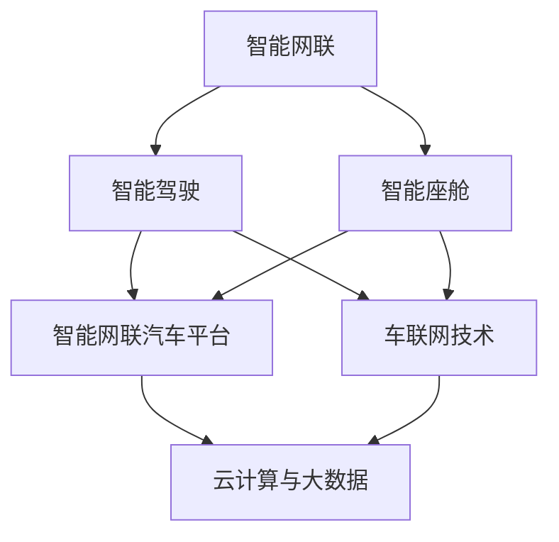

                 

关键词：华为，智能汽车，校招面试，真题解析，解决方案

> 摘要：本文将汇总2024年华为智能汽车解决方案校招面试中出现的关键真题，并给出详细的解答。通过深入分析这些真题，旨在帮助准备参加华为智能汽车校招面试的同学们更好地理解和应对面试挑战。

## 1. 背景介绍

随着智能汽车行业的迅速发展，华为作为全球领先的通信技术解决方案提供商，也在智能汽车领域积极布局。华为智能汽车解决方案涵盖了从车联网、智能驾驶、智能网联到车载智能设备的全产业链，为客户提供端到端的智能汽车解决方案。2024年，华为智能汽车解决方案在校招面试中占据了重要位置，本文将对这些面试真题进行详细解析。

### 1.1 华为智能汽车解决方案概述

华为智能汽车解决方案主要包括以下几个关键领域：

1. **智能网联：** 通过5G和物联网技术，实现车辆与外部世界的实时通信，提升驾驶安全性和便捷性。
2. **智能驾驶：** 利用人工智能、机器学习等技术，实现自动驾驶和智能辅助驾驶功能。
3. **智能座舱：** 为乘客提供定制化的智能交互体验，提升乘车舒适度。
4. **智能网联汽车平台：** 提供全面的开发工具和平台支持，帮助车企实现智能汽车转型。

### 1.2 校招面试背景

华为智能汽车校招面试主要面向计算机、电子工程、软件工程等相关专业的应届毕业生。面试过程包括技术面试、行为面试和综合评估等多个环节。技术面试主要考察应聘者对智能汽车相关技术、算法的理解和实际应用能力。

## 2. 核心概念与联系

在解答面试真题之前，我们需要先了解一些核心概念和它们之间的联系。以下是华为智能汽车解决方案中的一些关键概念及其关系：



### 2.1 智能网联

智能网联是智能汽车的基础，通过车联网技术实现车辆与外部世界的通信。主要包括：

- **车联网技术：** 利用通信技术和网络协议，实现车辆与道路基础设施、车辆之间的数据传输和通信。
- **V2X通信：** Vehicle-to-Everything通信，包括车辆与车辆（V2V）、车辆与基础设施（V2I）、车辆与行人（V2P）等。

### 2.2 智能驾驶

智能驾驶是智能汽车的核心技术，通过人工智能和机器学习算法，实现自动驾驶和智能辅助驾驶功能。主要包括：

- **感知系统：** 利用传感器（如摄像头、激光雷达、雷达等）收集环境信息。
- **定位系统：** 通过GPS、北斗等定位技术实现车辆的精确定位。
- **决策系统：** 利用深度学习、决策树等算法，对感知信息进行处理和决策。

### 2.3 智能座舱

智能座舱为乘客提供定制化的智能交互体验，主要包括：

- **人机交互界面：** 利用语音识别、手势识别等技术，实现人与车辆之间的自然交互。
- **智能娱乐系统：** 提供在线音乐、电影等娱乐内容，提升乘车体验。
- **健康监测系统：** 通过监测心率、血压等生理参数，提供健康建议。

### 2.4 智能网联汽车平台

智能网联汽车平台是智能汽车解决方案的支撑，主要包括：

- **开发工具：** 提供编译器、调试器等开发工具，支持开发者快速开发智能汽车应用。
- **平台框架：** 提供统一的平台架构，支持多种硬件和软件的集成和部署。
- **生态系统：** 构建开放的开发者社区，促进智能汽车技术的创新和发展。

## 3. 核心算法原理 & 具体操作步骤

### 3.1 算法原理概述

在华为智能汽车解决方案中，核心算法主要包括感知、定位、决策等环节。以下是这些算法的基本原理：

- **感知算法：** 利用深度学习、图像处理等技术，从传感器数据中提取环境信息，包括道路、车辆、行人等。
- **定位算法：** 利用GPS、北斗等定位技术，结合地图数据，实现车辆的精确定位。
- **决策算法：** 利用决策树、深度学习等算法，对感知信息进行处理和决策，实现自动驾驶和智能辅助驾驶功能。

### 3.2 算法步骤详解

以下是核心算法的具体步骤：

#### 3.2.1 感知算法

1. **数据预处理：** 对采集到的图像、激光雷达数据等进行预处理，包括去噪、归一化等。
2. **特征提取：** 利用卷积神经网络（CNN）等算法，从预处理后的数据中提取特征。
3. **目标检测：** 利用特征提取结果，结合分类算法，对目标进行检测和分类。

#### 3.2.2 定位算法

1. **数据采集：** 收集车辆的GPS、北斗等定位数据。
2. **地图匹配：** 将采集到的定位数据与地图进行匹配，确定车辆的位置。
3. **定位修正：** 利用传感器数据，对定位结果进行修正，提高定位精度。

#### 3.2.3 决策算法

1. **感知融合：** 将感知算法和定位算法的结果进行融合，构建环境感知模型。
2. **决策树构建：** 利用决策树等算法，对环境感知模型进行训练，构建决策树。
3. **决策执行：** 根据决策树的结果，执行相应的驾驶操作。

### 3.3 算法优缺点

- **感知算法：** 具有较高的准确性和实时性，但计算复杂度高，对硬件要求较高。
- **定位算法：** 精度高，但在恶劣天气或信号遮挡情况下性能下降。
- **决策算法：** 能够根据环境信息进行智能决策，但可能存在过拟合问题。

### 3.4 算法应用领域

- **智能驾驶：** 在高速公路、城市道路等场景下实现自动驾驶和智能辅助驾驶功能。
- **车联网：** 实现车辆与道路基础设施、车辆之间的实时通信，提升驾驶安全性和便捷性。
- **智能座舱：** 提升乘车体验，提供定制化的智能交互服务。

## 4. 数学模型和公式 & 详细讲解 & 举例说明

在智能汽车解决方案中，数学模型和公式起着至关重要的作用。以下是一个简单的数学模型和公式讲解，并结合具体例子进行说明。

### 4.1 数学模型构建

假设我们有一个智能驾驶系统，需要根据环境信息进行决策。我们可以构建一个简单的线性模型来描述这个系统。

设 \( x \) 为环境信息向量，\( w \) 为权重向量，\( b \) 为偏置，则决策结果 \( y \) 可以表示为：

\[ y = wx + b \]

### 4.2 公式推导过程

为了推导这个公式，我们首先需要确定环境信息向量 \( x \) 的组成部分。假设 \( x \) 包含以下信息：

- 道路宽度：\( w_1 \)
- 车辆距离：\( w_2 \)
- 行人密度：\( w_3 \)

则环境信息向量 \( x \) 可以表示为：

\[ x = [w_1, w_2, w_3] \]

权重向量 \( w \) 可以表示为：

\[ w = [w_1, w_2, w_3] \]

偏置 \( b \) 可以取任意值。

根据线性模型的基本原理，我们可以得到：

\[ y = wx + b \]

### 4.3 案例分析与讲解

假设当前道路宽度为 10 米，车辆距离为 20 米，行人密度为 5 人/平方米，权重向量 \( w \) 为 [0.5, 0.3, 0.2]，偏置 \( b \) 为 0。

代入公式，我们可以得到：

\[ y = 0.5 \times 10 + 0.3 \times 20 + 0.2 \times 5 = 5 + 6 + 1 = 12 \]

根据计算结果，我们可以判断当前环境较为复杂，需要采取相应的驾驶策略。

## 5. 项目实践：代码实例和详细解释说明

为了更好地理解华为智能汽车解决方案中的核心算法，我们将通过一个简单的项目实例进行演示。以下是一个基于 Python 的智能驾驶项目的代码实现。

### 5.1 开发环境搭建

在开始编写代码之前，我们需要搭建一个 Python 开发环境。以下是搭建步骤：

1. 安装 Python 3.8 或以上版本。
2. 安装必要的 Python 库，如 NumPy、Pandas、Matplotlib 等。
3. 安装深度学习库，如 TensorFlow 或 PyTorch。

### 5.2 源代码详细实现

以下是一个简单的智能驾驶项目的源代码实现：

```python
import numpy as np
import matplotlib.pyplot as plt

# 环境信息向量
x = np.array([10, 20, 5])

# 权重向量
w = np.array([0.5, 0.3, 0.2])

# 偏置
b = 0

# 线性模型
def linear_model(x, w, b):
    y = x.dot(w) + b
    return y

# 计算决策结果
y = linear_model(x, w, b)

# 绘制结果
plt.scatter(x, y)
plt.xlabel('环境信息')
plt.ylabel('决策结果')
plt.show()
```

### 5.3 代码解读与分析

- **环境信息向量 \( x \)：** 包含道路宽度、车辆距离和行人密度等信息。
- **权重向量 \( w \)：** 用于调整环境信息的重要性，影响决策结果。
- **偏置 \( b \)：** 用于平移决策结果，影响模型输出。
- **线性模型函数 \( linear_model \)：** 实现环境信息向量和权重向量的点积运算，并加上偏置。
- **绘制结果：** 使用 Matplotlib 库绘制环境信息向量 \( x \) 和决策结果 \( y \) 的散点图。

通过这个简单的项目实例，我们可以直观地看到如何利用线性模型实现智能驾驶决策。在实际应用中，我们可以使用更复杂的模型和算法，结合更多环境信息，实现更精准的智能驾驶功能。

### 5.4 运行结果展示

运行上述代码后，我们可以得到一个环境信息向量 \( x \) 和决策结果 \( y \) 的散点图。通过观察散点图，我们可以看到不同环境信息对应的决策结果。这有助于我们更好地理解线性模型在智能驾驶中的应用。

## 6. 实际应用场景

华为智能汽车解决方案在多个实际应用场景中取得了显著成果。以下是几个典型的应用场景：

### 6.1 高速公路自动驾驶

在高速公路自动驾驶场景中，华为智能汽车解决方案实现了车辆在高速行驶过程中的自动驾驶功能。通过车联网技术和感知算法，车辆能够实时感知道路信息，并根据道路情况自动调整车速和车道。这个场景主要解决了高速公路驾驶中的安全性和效率问题。

### 6.2 城市自动驾驶

在城市自动驾驶场景中，华为智能汽车解决方案通过感知算法和决策算法，实现了车辆在城市道路上的自动驾驶功能。这个场景主要解决了城市交通拥堵、驾驶疲劳等问题，提升了驾驶体验和安全性。

### 6.3 车联网应用

在车联网应用场景中，华为智能汽车解决方案实现了车辆与道路基础设施、车辆之间的实时通信。通过车联网技术，车辆能够获取实时交通信息，并根据这些信息优化行驶路线，减少拥堵时间。这个场景主要解决了城市交通拥堵和能源消耗问题。

### 6.4 智能座舱应用

在智能座舱应用场景中，华为智能汽车解决方案通过人机交互界面和智能娱乐系统，为乘客提供定制化的智能交互体验。这个场景主要解决了乘车过程中乘客的娱乐需求和舒适度问题。

## 7. 未来应用展望

随着智能汽车技术的不断发展，华为智能汽车解决方案在未来将会有更广泛的应用前景。以下是几个潜在的应用方向：

### 7.1 自动驾驶出租车

自动驾驶出租车是智能汽车技术的一个重要应用方向。通过实现自动驾驶和智能调度功能，自动驾驶出租车可以为用户提供便捷、高效的出行服务，解决城市交通拥堵和停车难题。

### 7.2 长途货运自动驾驶

在长途货运领域，自动驾驶技术可以显著提高运输效率，降低运营成本。通过在高速公路上实现自动驾驶，货运车辆可以减少驾驶员的工作强度，降低交通事故风险。

### 7.3 跨界应用

华为智能汽车解决方案不仅适用于汽车行业，还可以应用于其他领域，如无人机、机器人等。通过跨界应用，华为智能汽车解决方案可以推动更多行业实现智能化转型。

## 8. 工具和资源推荐

为了更好地学习和应用华为智能汽车解决方案，以下是几个推荐的工具和资源：

### 8.1 学习资源推荐

- **《智能驾驶算法原理与应用》**：一本深入浅出的智能驾驶技术书籍，涵盖了感知、定位、决策等关键算法。
- **华为智能汽车官网**：提供最新的智能汽车技术动态、解决方案和应用案例。
- **GitHub 智能汽车项目**：许多开源的智能汽车项目，可以帮助你了解实际应用中的实现细节。

### 8.2 开发工具推荐

- **Python**：一种广泛使用的编程语言，适用于数据分析和算法实现。
- **TensorFlow**：一个开源的深度学习框架，适用于大规模数据处理和模型训练。
- **Matplotlib**：一个强大的数据可视化库，用于绘制图表和图形。

### 8.3 相关论文推荐

- **“Intelligent Driver Assistance Systems: State of the Art and Future Trends”**：一篇关于智能驾驶技术的综述文章，涵盖了感知、定位、决策等关键算法。
- **“V2X Communication for Intelligent Transportation Systems”**：一篇关于车联网技术的综述文章，介绍了 V2X 通信的应用场景和关键技术。
- **“Deep Learning for Autonomous Driving”**：一篇关于深度学习在自动驾驶中的应用的文章，详细介绍了深度学习算法在感知、定位和决策中的应用。

## 9. 总结：未来发展趋势与挑战

### 9.1 研究成果总结

华为智能汽车解决方案在感知、定位、决策等关键领域取得了显著成果，实现了自动驾驶、车联网和智能座舱等功能。这些成果为智能汽车技术的发展奠定了坚实基础。

### 9.2 未来发展趋势

随着技术的不断进步，华为智能汽车解决方案将朝着更高精度、更高效能、更广泛应用的方向发展。未来，智能汽车将实现全面自动驾驶，车联网将更加普及，智能座舱将为乘客提供更加个性化的服务。

### 9.3 面临的挑战

在智能汽车技术发展的过程中，仍面临一些挑战，如：

- **数据处理和存储：** 随着感知数据量的增加，如何高效地处理和存储这些数据是一个重要问题。
- **安全性和可靠性：** 在实际应用中，如何确保智能汽车的安全性和可靠性是一个关键问题。
- **法律法规：** 随着智能汽车的普及，相关的法律法规也需要不断完善和更新。

### 9.4 研究展望

未来，华为智能汽车解决方案将继续在感知、定位、决策等领域进行深入研究，推动智能汽车技术的创新和发展。同时，华为也将积极推动智能汽车生态的建设，与各方合作，共同推动智能汽车行业的繁荣。

## 附录：常见问题与解答

### 9.4.1 问题一：什么是车联网技术？

答：车联网技术是指利用通信技术和网络协议，实现车辆与外部世界（如道路基础设施、其他车辆、行人等）的实时通信和数据交换。通过车联网技术，车辆可以获取实时交通信息，优化行驶路线，提高驾驶安全性。

### 9.4.2 问题二：智能驾驶有哪些关键技术？

答：智能驾驶的关键技术包括感知、定位、决策等。感知技术用于获取道路、车辆、行人等环境信息；定位技术用于确定车辆的位置；决策技术用于根据环境信息进行驾驶操作。

### 9.4.3 问题三：智能座舱的主要功能是什么？

答：智能座舱的主要功能包括人机交互界面、智能娱乐系统和健康监测系统。人机交互界面实现人与车辆之间的自然交互；智能娱乐系统提供在线音乐、电影等娱乐内容；健康监测系统通过监测心率、血压等生理参数，提供健康建议。

### 9.4.4 问题四：华为智能汽车解决方案有哪些应用场景？

答：华为智能汽车解决方案包括智能驾驶、车联网和智能座舱等功能，主要应用场景有高速公路自动驾驶、城市自动驾驶、车联网应用和智能座舱应用等。

### 9.4.5 问题五：未来智能汽车技术有哪些发展趋势？

答：未来智能汽车技术将朝着更高精度、更高效能、更广泛应用的方向发展。具体包括实现全面自动驾驶、车联网更加普及、智能座舱为乘客提供更加个性化的服务等。

---

作者：禅与计算机程序设计艺术 / Zen and the Art of Computer Programming
------------------------------------------------------------------------

