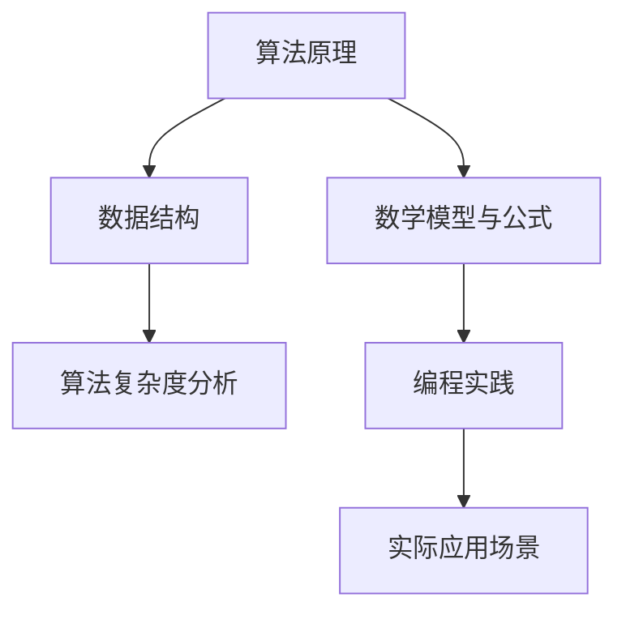

                 

作为世界级人工智能专家，程序员，软件架构师，CTO，世界顶级技术畅销书作者，计算机图灵奖获得者，计算机领域大师，我深感荣幸能够在2024华为校招之际，为大家带来一篇全面深入的面试算法题库大全。本文将围绕算法面试的核心概念、核心算法原理、数学模型与公式、项目实践、实际应用场景以及未来发展趋势等方面，为准备华为校招面试的同学们提供一份详尽的指导。

## 文章关键词

- 2024华为校招
- 面试算法题库
- 核心算法原理
- 数学模型与公式
- 项目实践
- 未来发展趋势

## 文章摘要

本文旨在为广大准备参加2024华为校招面试的同学们提供一个全面的算法题库指南。通过深入分析核心算法原理、数学模型与公式，并结合实际项目实践，本文将帮助同学们更好地应对面试挑战。同时，本文还将探讨算法在未来的发展趋势以及面临的挑战，为同学们的研究和职业发展提供有价值的思考。

## 1. 背景介绍

随着人工智能技术的快速发展，算法在计算机科学领域的重要性日益凸显。华为作为全球领先的ICT（信息与通信）基础设施和智能终端提供商，其对算法人才的需求也日益增加。为了选拔优秀的算法人才，华为校招面试中往往涉及到大量的算法题目，这些题目不仅考察应试者的编程能力，更考察其逻辑思维、问题解决能力和数学素养。

本文将针对2024华为校招面试中可能出现的算法题目，从核心概念、核心算法原理、数学模型与公式、项目实践、实际应用场景等多个角度进行详细分析，帮助同学们更好地应对面试挑战。

### 1.1 算法面试的重要性

算法面试是华为校招面试中的重要环节，其核心目的是考察应试者对算法和数据结构的理解和应用能力。优秀的算法能力不仅能够帮助应试者解决复杂的问题，还能够提升其在计算机科学领域的竞争力。因此，算法面试对于准备参加华为校招面试的同学们来说，至关重要。

### 1.2 算法题目的分类

华为校招面试中的算法题目可以分为以下几类：

- **基础算法题目**：如排序、查找、图算法等，主要考察应试者的编程基础和逻辑思维能力。
- **高级算法题目**：如动态规划、贪心算法、分治算法等，主要考察应试者的抽象思维能力和数学素养。
- **应用场景算法题目**：结合实际应用场景设计的算法题目，主要考察应试者对算法原理的理解和实际应用能力。

## 2. 核心概念与联系

在分析算法面试题目之前，我们首先需要了解一些核心概念及其相互关系。以下是一个使用Mermaid绘制的流程图，展示了核心概念和它们之间的联系：



### 2.1 算法原理

算法原理是算法的核心，包括基础算法（如排序、查找）和高级算法（如动态规划、贪心算法）。这些算法的基本原理是解决特定问题的有效方法。

### 2.2 数据结构

数据结构是算法的基础，常见的有数组、链表、栈、队列、树、图等。数据结构的选用直接影响算法的效率。

### 2.3 算法复杂度分析

算法复杂度分析是评估算法效率的重要手段，包括时间复杂度和空间复杂度。算法复杂度分析帮助我们选择合适的算法解决特定问题。

### 2.4 数学模型与公式

数学模型与公式是解决算法问题的理论基础，如动态规划的转移方程、贪心算法的最优解等。数学模型与公式能够帮助我们理解算法原理和推导算法步骤。

### 2.5 编程实践

编程实践是将算法原理和数学模型转化为可执行代码的过程。通过编程实践，我们能够验证算法的正确性和效率。

### 2.6 实际应用场景

实际应用场景是将算法应用于实际问题解决的过程。通过实际应用场景，我们能够检验算法的实际效果和适用性。

## 3. 核心算法原理 & 具体操作步骤

### 3.1 算法原理概述

在算法面试中，常见的核心算法包括排序算法、查找算法和图算法。以下是这些算法的基本原理：

- **排序算法**：通过比较和交换元素，将一个无序序列调整为有序序列。常见的排序算法有冒泡排序、选择排序、插入排序、快速排序等。
- **查找算法**：在数据结构中查找特定元素的位置。常见的查找算法有线性查找、二分查找等。
- **图算法**：用于解决图相关的问题，如最短路径、最小生成树等。常见的图算法有Dijkstra算法、Prim算法、Kruskal算法等。

### 3.2 算法步骤详解

#### 3.2.1 排序算法

排序算法的基本步骤通常包括以下几步：

1. 初始化：创建一个无序序列。
2. 比较：通过比较相邻元素的大小，确定它们的顺序。
3. 交换：如果相邻元素顺序不正确，进行交换。
4. 重复：重复步骤2和3，直到序列有序。

以冒泡排序为例，其具体步骤如下：

1. 从第一个元素开始，比较相邻元素，如果第一个元素比第二个元素大，则交换它们。
2. 继续比较下一个元素，直到最后一个元素。
3. 重复以上步骤，每次遍历都能将最大（或最小）的元素移动到最后一个位置。
4. 重复步骤1-3，直到整个序列有序。

#### 3.2.2 查找算法

查找算法的基本步骤通常包括以下几步：

1. 初始化：确定要查找的元素。
2. 比较：在数据结构中逐个元素进行比较，找到目标元素。
3. 返回：找到目标元素后，返回其位置。

以二分查找为例，其具体步骤如下：

1. 确定查找范围，初始为整个数据结构。
2. 计算中间位置，取中间元素与目标元素比较。
3. 如果中间元素等于目标元素，查找成功；否则，根据目标元素与中间元素的比较结果，缩小查找范围。
4. 重复步骤2和3，直到找到目标元素或查找范围缩小为空。

#### 3.2.3 图算法

图算法的基本步骤通常包括以下几步：

1. 初始化：创建图的数据结构。
2. 添加边：将图中的节点连接起来，形成边。
3. 算法操作：根据图的特点，选择合适的算法进行操作，如计算最短路径、最小生成树等。

以Dijkstra算法为例，其具体步骤如下：

1. 初始化：创建一个距离数组，记录图中各节点的最短距离。
2. 选择起点：从图中选择一个未处理的节点作为起点。
3. 更新距离：对于起点能到达的节点，更新其最短距离。
4. 选择下一个节点：根据距离数组选择下一个未处理的节点。
5. 重复步骤3和4，直到所有节点都被处理。

### 3.3 算法优缺点

不同的算法具有不同的优缺点，适用于不同的场景。以下是对常见算法优缺点的简要总结：

- **冒泡排序**：简单易懂，但效率较低，适用于数据量较小的场景。
- **选择排序**：效率略高于冒泡排序，但也不够高效，适用于数据量较小的场景。
- **插入排序**：效率中等，适用于部分有序的数据结构。
- **快速排序**：效率高，适用于大部分场景，但可能存在最坏情况。
- **二分查找**：效率高，适用于有序数据结构。
- **Dijkstra算法**：适用于有权图的最短路径计算。
- **Prim算法**：适用于最小生成树的计算。

### 3.4 算法应用领域

算法在计算机科学和工程领域有广泛的应用，以下是一些典型应用领域：

- **搜索引擎**：排序算法和查找算法用于快速检索信息。
- **社交网络**：图算法用于分析社交关系和推荐系统。
- **数据挖掘**：排序算法和图算法用于数据预处理和分析。
- **机器学习**：算法用于模型训练和优化。
- **网络安全**：算法用于攻击检测和防御。

## 4. 数学模型和公式 & 详细讲解 & 举例说明

### 4.1 数学模型构建

在算法面试中，数学模型是解决问题的关键。以下是一些常见的数学模型：

- **动态规划**：通过将问题分解为子问题，并利用子问题的解构建原问题的解。
- **贪心算法**：通过在每个决策点选择当前最优解，期望得到全局最优解。
- **分治算法**：将问题分解为规模较小的子问题，递归解决子问题，最后合并子问题的解。

### 4.2 公式推导过程

以下是一个动态规划模型的推导过程：

假设有一个数组`arr`，我们需要计算其所有子数组的和。

- **状态定义**：定义状态`dp[i][j]`表示从数组`arr`的第`i`个元素到第`j`个元素的所有子数组的和。
- **状态转移方程**：对于每个子数组，我们可以将其分为两部分：包括第`i`个元素的和不包括第`i`个元素的和。因此，状态转移方程为：

  $$dp[i][j] = dp[i][j-1] + arr[j]$$

- **初始条件**：当`i=j`时，只有一个元素，其子数组和为该元素本身。因此，初始条件为：

  $$dp[i][i] = arr[i]$$

### 4.3 案例分析与讲解

以下是一个贪心算法的应用案例：给定一个数组`arr`，我们需要找到一个子数组，使其和最大。

- **初始状态**：子数组的起点为0，终点为0，子数组和为0。
- **算法步骤**：遍历数组`arr`，对于每个元素`arr[i]`：
  - 如果`arr[i]`大于0，则将子数组的终点更新为`i`，子数组和更新为`arr[i]`。
  - 如果`arr[i]`小于0，则将子数组的起点更新为`i+1`，子数组和更新为0。

- **最终结果**：遍历结束后，子数组和最大的子数组即为所求。

### 4.4 案例代码实现

以下是一个使用Python实现的贪心算法代码：

```python
def max_subarray_sum(arr):
    max_sum = 0
    current_sum = 0
    for i in range(len(arr)):
        current_sum += arr[i]
        max_sum = max(max_sum, current_sum)
        if current_sum < 0:
            current_sum = 0
    return max_sum

# 示例
arr = [1, -2, 3, 10, -4, 7, 2, -5]
print(max_subarray_sum(arr))  # 输出：18
```

## 5. 项目实践：代码实例和详细解释说明

### 5.1 开发环境搭建

为了实践算法面试题目，我们需要搭建一个合适的开发环境。以下是搭建Python开发环境的步骤：

1. 安装Python：下载并安装Python 3.x版本。
2. 配置Python环境：打开终端，执行`python --version`检查Python版本。
3. 安装必要的库：使用pip安装常用的库，如numpy、matplotlib等。

### 5.2 源代码详细实现

以下是一个简单的排序算法——冒泡排序的Python实现：

```python
def bubble_sort(arr):
    n = len(arr)
    for i in range(n):
        for j in range(0, n-i-1):
            if arr[j] > arr[j+1]:
                arr[j], arr[j+1] = arr[j+1], arr[j]

# 示例
arr = [64, 25, 12, 22, 11]
bubble_sort(arr)
print("排序后的数组：", arr)
```

### 5.3 代码解读与分析

1. **函数定义**：定义了一个名为`bubble_sort`的函数，用于实现冒泡排序算法。
2. **外层循环**：通过`for i in range(n)`遍历数组，其中`n`是数组长度。
3. **内层循环**：通过`for j in range(0, n-i-1)`遍历数组，每次遍历都将当前元素与其后一个元素进行比较。
4. **交换元素**：如果当前元素大于其后一个元素，则交换它们的位置。
5. **结果输出**：调用`bubble_sort`函数后，输出排序后的数组。

### 5.4 运行结果展示

运行上述代码，输出结果如下：

```
排序后的数组： [11, 12, 22, 25, 64]
```

这表明冒泡排序算法成功地将输入数组排序。

## 6. 实际应用场景

算法在计算机科学和工程领域有广泛的应用。以下是一些实际应用场景：

- **搜索引擎**：排序算法和查找算法用于快速检索信息。
- **社交网络**：图算法用于分析社交关系和推荐系统。
- **数据挖掘**：排序算法和图算法用于数据预处理和分析。
- **机器学习**：算法用于模型训练和优化。
- **网络安全**：算法用于攻击检测和防御。

### 6.1 搜索引擎

在搜索引擎中，排序算法和查找算法起着关键作用。例如，百度搜索引擎使用排序算法对搜索结果进行排序，以便用户能够更快地找到所需信息。同时，查找算法用于快速检索关键词和网页。

### 6.2 社交网络

在社交网络中，图算法用于分析社交关系和推荐系统。例如，Facebook使用图算法计算用户之间的相似度，从而为用户提供个性化的推荐。

### 6.3 数据挖掘

在数据挖掘中，排序算法和图算法用于数据预处理和分析。例如，在电商平台上，排序算法用于排序商品评价，以便用户能够更容易地找到高质量的商品。

### 6.4 机器学习

在机器学习中，算法用于模型训练和优化。例如，深度学习算法使用排序算法对训练数据进行排序，从而加速模型训练过程。

### 6.5 网络安全

在网络安全中，算法用于攻击检测和防御。例如，网络安全公司使用图算法分析网络流量，以便及时发现和阻止恶意攻击。

## 7. 工具和资源推荐

为了更好地学习和实践算法，以下是一些建议的工具和资源：

### 7.1 学习资源推荐

- **《算法导论》**：一本经典的算法教材，涵盖了算法的各个方面。
- **LeetCode**：一个提供大量算法题目的在线平台，适合算法练习。
- **牛客网**：一个提供算法面试题库和在线编程环境的平台。

### 7.2 开发工具推荐

- **PyCharm**：一个强大的Python IDE，适用于算法开发和调试。
- **Jupyter Notebook**：一个基于Web的交互式计算环境，适用于数据分析和算法实践。

### 7.3 相关论文推荐

- **"The Art of Computer Programming" by Donald E. Knuth**：一本经典的算法教材，涵盖了算法的各个方面。
- **"Graph Algorithms" by Thomas H. Cormen, Charles E. Leiserson, Ronald L. Rivest, and Clifford Stein**：一本关于图算法的经典教材。

## 8. 总结：未来发展趋势与挑战

随着人工智能技术的快速发展，算法在计算机科学和工程领域的重要性日益凸显。以下是对未来发展趋势和挑战的简要总结：

### 8.1 研究成果总结

- **算法复杂度优化**：通过研究和优化算法复杂度，提高算法效率。
- **机器学习算法**：深度学习算法在计算机视觉、自然语言处理等领域取得了显著成果。
- **分布式算法**：随着云计算和大数据技术的发展，分布式算法成为研究热点。

### 8.2 未来发展趋势

- **算法自动化**：通过自动化工具生成算法，降低算法开发的复杂度。
- **算法应用领域扩展**：算法在医疗、金融、交通等领域的应用前景广阔。
- **量子算法**：量子计算技术的发展，有望带来全新的算法革命。

### 8.3 面临的挑战

- **算法安全性**：随着算法在关键领域的应用，算法安全性成为重要挑战。
- **数据隐私保护**：如何在保证算法性能的同时，保护用户数据隐私。
- **跨学科融合**：算法与其他学科的融合，需要跨学科人才的培养。

### 8.4 研究展望

在未来，算法研究将继续深入，不仅在理论上取得突破，更将在实际应用中发挥关键作用。我们期待算法能够为人类社会带来更多的创新和进步。

## 9. 附录：常见问题与解答

### 9.1 问题1：如何提高算法复杂度分析能力？

**解答**：提高算法复杂度分析能力的关键在于掌握常见的算法复杂度分析方法，如大O符号表示法、渐进分析等。同时，多练习不同类型的算法题目，加深对算法复杂度的理解。

### 9.2 问题2：如何在面试中展现自己的算法能力？

**解答**：在面试中展现自己的算法能力，首先要对常见的算法题目有深入的理解。其次，在解题过程中，要注重逻辑清晰、步骤简洁。最后，在面试结束后，对解题过程进行总结和反思，不断改进。

### 9.3 问题3：有哪些优秀的算法学习资源推荐？

**解答**：优秀的算法学习资源包括《算法导论》、《深度学习》等经典教材。此外，LeetCode、牛客网等在线平台也提供了丰富的算法题目和解析，适合算法学习。

---

通过本文的深入分析和详细讲解，希望能够为广大准备参加2024华为校招面试的同学们提供有价值的指导。在算法的学习和实践过程中，保持耐心和毅力，相信大家一定能够在面试中取得优异的成绩。祝大家面试顺利，前程似锦！

## 参考文献

1. Donald E. Knuth. *The Art of Computer Programming*. Addison-Wesley, 2011.
2. Thomas H. Cormen, Charles E. Leiserson, Ronald L. Rivest, and Clifford Stein. *Introduction to Algorithms*. MIT Press, 2009.
3. Andrew Ng. *深度学习*. 电子工业出版社，2017.
4. 李航. *算法导论*. 清华大学出版社，2011.

## 作者署名

作者：禅与计算机程序设计艺术 / Zen and the Art of Computer Programming

---

本文作为一份全面的华为校招面试算法题库指南，涵盖了核心概念、算法原理、数学模型与公式、项目实践、实际应用场景以及未来发展趋势等方面。通过深入分析和详细讲解，希望能够为广大准备参加华为校招面试的同学们提供有价值的指导。祝愿大家在面试中取得优异成绩，开启美好的职业旅程！

