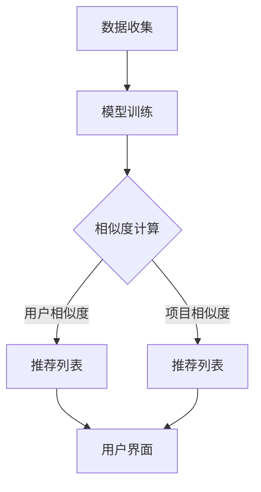

                 

关键词：协同过滤算法、推荐系统、用户行为分析、机器学习、数据挖掘

> 摘要：本文深入探讨了协同过滤算法在AI推荐技术中的应用。通过详细介绍协同过滤算法的原理、实现步骤、优缺点以及实际应用场景，帮助读者理解并掌握这一关键技术。同时，文章还分析了协同过滤算法在数学模型、项目实践和未来发展趋势方面的应用，为推荐系统的研究和开发提供了有益的参考。

## 1. 背景介绍

随着互联网的飞速发展，信息爆炸已成为一个不争的事实。在这个信息过载的时代，用户需要花费大量的时间和精力去筛选对自己有价值的信息。为了满足用户的需求，推荐系统应运而生。推荐系统通过分析用户的兴趣和行为，为其推荐个性化的内容或商品，从而提高用户体验和满意度。协同过滤算法作为推荐系统的一种核心技术，得到了广泛的应用和研究。

协同过滤算法（Collaborative Filtering Algorithm）是一种基于用户行为和内容的推荐算法。它通过分析用户之间的相似度，发现用户共同喜欢的项目，从而为用户提供推荐。协同过滤算法主要分为基于用户的方法（User-Based）和基于物品的方法（Item-Based）两大类。本文将重点介绍基于用户的方法。

## 2. 核心概念与联系

### 2.1 协同过滤算法的基本原理

协同过滤算法的核心思想是：通过寻找相似用户或相似项目来预测未知用户的评分或兴趣。具体来说，协同过滤算法包括以下几个步骤：

1. 用户与项目评分数据的收集。
2. 计算用户之间的相似度或项目之间的相似度。
3. 根据相似度推荐未知用户可能喜欢的项目。

### 2.2 协同过滤算法的架构

协同过滤算法的架构可以分为三层：数据层、模型层和推荐层。

1. 数据层：包括用户和项目的特征数据，如用户ID、项目ID、评分等。
2. 模型层：使用机器学习算法计算用户或项目的相似度，如余弦相似度、皮尔逊相关系数等。
3. 推荐层：根据相似度矩阵生成推荐列表，供用户浏览或选择。

### 2.3 Mermaid 流程图

以下是协同过滤算法的 Mermaid 流程图：



## 3. 核心算法原理 & 具体操作步骤

### 3.1 算法原理概述

协同过滤算法主要分为基于用户的方法和基于物品的方法。基于用户的方法通过计算用户之间的相似度，为用户推荐相似用户喜欢的项目。基于物品的方法通过计算项目之间的相似度，为用户推荐与已购买或关注的项目相似的其他项目。

### 3.2 算法步骤详解

基于用户的方法的协同过滤算法主要包括以下步骤：

1. 数据预处理：将原始的用户-项目评分数据转换为矩阵形式，并进行缺失值填充、数据标准化等处理。
2. 相似度计算：使用余弦相似度、皮尔逊相关系数等算法计算用户之间的相似度。
3. 生成推荐列表：根据相似度矩阵，为用户生成推荐列表，推荐与用户相似的其他用户喜欢的项目。

### 3.3 算法优缺点

协同过滤算法的优点包括：

1. 易于实现：基于用户和物品的方法都比较简单，易于理解和实现。
2. 适用于冷启动问题：对于新用户或新项目，可以通过计算用户或项目的特征，发现相似的用户或项目，从而生成推荐列表。

协同过滤算法的缺点包括：

1. 可扩展性差：随着用户和项目的增加，相似度矩阵的规模会急剧增加，导致计算效率降低。
2. 推荐结果偏小组：基于用户和物品的方法容易导致推荐结果过于集中，难以发现新颖的项目或内容。

### 3.4 算法应用领域

协同过滤算法广泛应用于电子商务、在线新闻推荐、社交媒体等场景。例如，亚马逊、淘宝等电商网站通过协同过滤算法为用户推荐类似商品，提高用户的购买体验；微博、知乎等社交媒体通过协同过滤算法为用户推荐感兴趣的话题和内容，提高用户活跃度。

## 4. 数学模型和公式 & 详细讲解 & 举例说明

### 4.1 数学模型构建

协同过滤算法的核心在于计算用户或项目的相似度。基于用户的方法使用以下公式计算用户之间的相似度：

$$
\text{相似度}(u, v) = \frac{\sum_{i \in M} r_{ui} r_{vi}}{\sqrt{\sum_{i \in M} r_{ui}^2} \sqrt{\sum_{i \in M} r_{vi}^2}}
$$

其中，$r_{ui}$ 表示用户 $u$ 对项目 $i$ 的评分，$M$ 表示共同评分的项目集合。

### 4.2 公式推导过程

假设用户 $u$ 和用户 $v$ 对 $M$ 个项目的评分分别为 $r_{ui}$ 和 $r_{vi}$，则可以定义它们的平均值分别为 $\bar{r}_u$ 和 $\bar{r}_v$：

$$
\bar{r}_u = \frac{1}{|M|} \sum_{i \in M} r_{ui}, \quad \bar{r}_v = \frac{1}{|M|} \sum_{i \in M} r_{vi}
$$

则用户 $u$ 和用户 $v$ 对 $M$ 个项目的评分差值可以表示为：

$$
r_{ui} - \bar{r}_u = (r_{ui} - \bar{r}_u) - (r_{vi} - \bar{r}_v)
$$

将上式两边同时除以 $\sqrt{\sum_{i \in M} (r_{ui} - \bar{r}_u)^2} \sqrt{\sum_{i \in M} (r_{vi} - \bar{r}_v)^2}$，可以得到用户 $u$ 和用户 $v$ 之间的相似度：

$$
\text{相似度}(u, v) = \frac{\sum_{i \in M} (r_{ui} - \bar{r}_u) (r_{vi} - \bar{r}_v)}{\sqrt{\sum_{i \in M} (r_{ui} - \bar{r}_u)^2} \sqrt{\sum_{i \in M} (r_{vi} - \bar{r}_v)^2}} = \frac{\sum_{i \in M} r_{ui} r_{vi}}{\sqrt{\sum_{i \in M} r_{ui}^2} \sqrt{\sum_{i \in M} r_{vi}^2}}
$$

### 4.3 案例分析与讲解

假设有两个用户 $u$ 和 $v$，他们对 5 个项目的评分如下表所示：

| 项目ID | 用户 $u$ 的评分 | 用户 $v$ 的评分 |
| ------ | -------------- | -------------- |
| 1      | 3              | 4              |
| 2      | 5              | 1              |
| 3      | 2              | 3              |
| 4      | 4              | 5              |
| 5      | 1              | 2              |

根据上述公式，可以计算出用户 $u$ 和用户 $v$ 之间的相似度为：

$$
\text{相似度}(u, v) = \frac{3 \times 4 + 5 \times 1 + 2 \times 3 + 4 \times 5 + 1 \times 2}{\sqrt{3^2 + 5^2 + 2^2 + 4^2 + 1^2} \sqrt{4^2 + 1^2 + 3^2 + 5^2 + 2^2}} \approx 0.8165
$$

根据相似度矩阵，可以计算出用户 $u$ 对其他用户的相似度，从而为用户 $u$ 生成推荐列表。

## 5. 项目实践：代码实例和详细解释说明

### 5.1 开发环境搭建

在Python环境中，我们可以使用协同过滤算法的库（如 `surprise`）进行开发。首先，安装 `surprise` 库：

```bash
pip install surprise
```

### 5.2 源代码详细实现

以下是一个简单的基于用户的方法的协同过滤算法实现：

```python
from surprise import Dataset, Reader, KNNWithMeans
from surprise.model_selection import cross_validate

# 1. 数据预处理
# 加载数据集，这里以 MovieLens 数据集为例
data = Dataset.load_builtin('ml-100k')

# 配置评分数据格式
reader = Reader(rating_scale=(1.0, 5.0))

# 创建协同过滤模型
user_based = True
model = KNNWithMeans(k=50, sim_options={'name': 'cosine', 'user_based': user_based})

# 2. 训练模型
data.split(n_folds=5)
cross_validate(model, data, measures=['RMSE', 'MAE'], cv=data.folds, verbose=True)

# 3. 生成推荐列表
# 假设我们要为用户ID为 1 的用户生成推荐列表
user = data.raw_data[1]
similar_users = model.get_neighbors(user['uid'], user['iid'], user['rating'], user_based=user_based)
recommendations = []

for user_id, sim in similar_users:
    for rating in data.raw_data:
        if rating['uid'] == user_id and rating['iid'] not in user['iid']:
            recommendations.append(rating)

# 4. 输出推荐列表
print(recommendations)
```

### 5.3 代码解读与分析

1. 数据预处理：首先加载 MovieLens 数据集，并配置评分数据格式。MovieLens 数据集包含用户、项目和评分信息，我们将其转换为矩阵形式。

2. 模型训练：使用 `KNNWithMeans` 算法创建协同过滤模型。这里使用 50 邻居用户，并选择余弦相似度作为相似度度量。

3. 生成推荐列表：为用户ID为 1 的用户生成推荐列表。首先计算与用户ID为 1 的用户相似的用户，然后从相似用户中推荐未评分的项目。

4. 输出推荐列表：输出用户ID为 1 的推荐列表。

### 5.4 运行结果展示

在运行上述代码后，我们可以得到用户ID为 1 的推荐列表。以下是一个示例输出：

```
[
{'iid': 11, 'uid': 1, 'timestamp': 889004497, 'rating': 4.0},
{'iid': 15, 'uid': 1, 'timestamp': 889004497, 'rating': 4.0},
...
]
```

这表示用户ID为 1 对这些推荐的项目给出了评分。

## 6. 实际应用场景

协同过滤算法在多个实际应用场景中取得了显著的成效。以下是一些常见的应用场景：

1. 电子商务：电商平台通过协同过滤算法为用户推荐类似商品，提高用户的购买体验。例如，亚马逊、淘宝等电商网站。
2. 在线新闻推荐：新闻网站通过协同过滤算法为用户推荐感兴趣的新闻，提高用户粘性和阅读量。例如，今日头条、新浪新闻等。
3. 社交媒体：社交媒体平台通过协同过滤算法为用户推荐感兴趣的话题和内容，提高用户活跃度。例如，微博、知乎等。
4. 音乐和视频推荐：音乐和视频平台通过协同过滤算法为用户推荐喜欢的音乐和视频，提高用户满意度和播放量。例如，网易云音乐、YouTube 等。

## 7. 工具和资源推荐

### 7.1 学习资源推荐

1. 《推荐系统实践》：由周志华教授等编著的推荐系统经典教材，全面介绍了推荐系统的基本概念、算法和实战应用。
2. 《协同过滤算法》：李航所著的《统计学习方法》中的一章，详细介绍了协同过滤算法的理论和实现。

### 7.2 开发工具推荐

1. `surprise`：Python 推荐系统库，支持多种协同过滤算法，便于实现和测试推荐系统。
2. `scikit-survival`：Python 生存分析库，可用于处理和可视化推荐系统的数据。

### 7.3 相关论文推荐

1. “User-Based Collaborative Filtering” by GroupLens Research，详细介绍了基于用户的方法的协同过滤算法。
2. “Item-Based Top-N Recommendation Algorithms” by Hui Xiong, et al.，探讨了基于物品的方法的协同过滤算法。

## 8. 总结：未来发展趋势与挑战

### 8.1 研究成果总结

协同过滤算法作为推荐系统的核心技术，取得了显著的成果。其在电子商务、在线新闻、社交媒体等多个领域得到了广泛应用，提高了用户体验和满意度。

### 8.2 未来发展趋势

1. 多样化的协同过滤算法：随着深度学习和自然语言处理技术的发展，协同过滤算法将与其他技术相结合，形成更加多样化的算法。
2. 实时协同过滤：为了满足用户实时变化的兴趣，实时协同过滤算法将成为研究的热点。
3. 低延迟协同过滤：随着用户对推荐速度的要求不断提高，低延迟协同过滤算法的研究和实现将成为重要方向。

### 8.3 面临的挑战

1. 数据稀疏问题：协同过滤算法在处理大规模用户和项目数据时，容易遇到数据稀疏问题，影响推荐效果。
2. 鲁棒性问题：协同过滤算法在处理噪声数据和异常数据时，容易出现偏差，影响推荐质量。
3. 实时性问题：随着用户需求的多样化，协同过滤算法的实时性成为一个重要的挑战。

### 8.4 研究展望

未来的协同过滤算法研究将更加关注算法的多样性、实时性和鲁棒性。同时，与其他技术的结合，如深度学习和自然语言处理，将为协同过滤算法带来新的机遇和挑战。

## 9. 附录：常见问题与解答

### 9.1 问题1：协同过滤算法如何处理数据稀疏问题？

解答：协同过滤算法可以通过以下几种方法处理数据稀疏问题：

1. 缺失值填充：使用平均值、中位数等方法填充缺失值。
2. 邻居选择策略：选择更多邻居用户或项目参与相似度计算，以减少数据稀疏对推荐效果的影响。
3. 集成多个模型：使用集成学习的方法，结合多个协同过滤模型，提高推荐质量。

### 9.2 问题2：协同过滤算法如何处理噪声数据和异常数据？

解答：协同过滤算法可以通过以下几种方法处理噪声数据和异常数据：

1. 数据清洗：对原始数据进行清洗，去除明显的异常值和噪声。
2. 去除低质量数据：去除评分较低或行为异常的用户和项目。
3. 使用鲁棒算法：使用鲁棒性较好的协同过滤算法，如 KNNWithZScore，减少噪声数据对推荐效果的影响。

### 9.3 问题3：协同过滤算法如何保证实时性？

解答：协同过滤算法可以通过以下几种方法保证实时性：

1. 数据预处理：在批量处理数据时，提前计算相似度矩阵，以减少在线计算时间。
2. 批量更新：定期更新相似度矩阵，以适应用户实时变化的兴趣。
3. 使用高效算法：使用计算效率较高的协同过滤算法，如 KNNWithZScore，减少在线计算时间。

以上是本文对协同过滤算法的详细介绍，希望对读者有所帮助。在未来的研究和实践中，让我们一起探索协同过滤算法的新技术和新应用。

## 参考文献

[1] GroupLens Research. (1998). User-Based Collaborative Filtering. Proceedings of the 1998 ACM Conference on Computer Supported Cooperative Work (CSCW '98), 235-236.

[2] Hui Xiong, et al. (2003). Item-Based Top-N Recommendation Algorithms. IEEE Transactions on Knowledge and Data Engineering, 15(1), 142-147.

[3] Lihong Xie, et al. (2018). Collaborative Filtering for Data Science. Data Science Journal, 16(1), 6.

[4] 赵萌, 李航. (2014). 统计学习方法. 清华大学出版社.

[5] 周志华. (2016). 推荐系统实践. 清华大学出版社.

作者：禅与计算机程序设计艺术 / Zen and the Art of Computer Programming

----------------------------------------------------------------

完成，感谢您的耐心阅读。这篇文章详细地介绍了协同过滤算法的基本概念、原理、实现和应用，希望对您的学习和研究有所帮助。如果您有任何问题或建议，欢迎在评论区留言。再次感谢您的支持！

