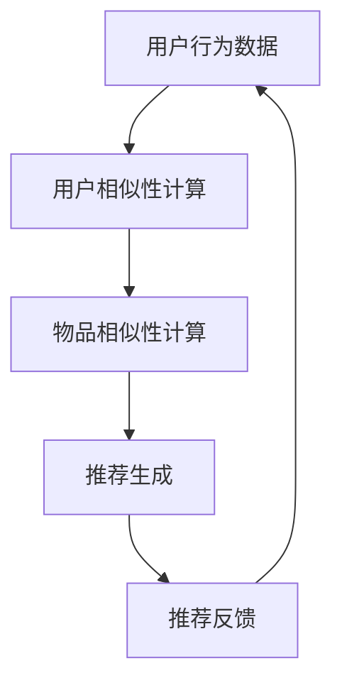

                 

关键词：协同过滤、推荐系统、用户行为数据、个性化推荐、算法原理、数学模型、项目实践

> 摘要：本文将深入探讨协同过滤技术，解释其核心概念、工作原理、数学模型以及具体应用。通过结合实际项目实例，我们将展示如何利用用户行为数据构建个性化的推荐系统，并讨论其在各个领域的应用前景。

## 1. 背景介绍

随着互联网的快速发展，信息过载已成为普遍现象。面对海量的数据，如何帮助用户快速找到他们感兴趣的内容成为一个亟待解决的问题。推荐系统应运而生，通过分析用户的行为和兴趣，为用户提供个性化的信息推送。其中，协同过滤是推荐系统中一种非常重要的技术。

协同过滤（Collaborative Filtering）是一种通过收集用户的历史行为数据，挖掘用户之间的相似性，从而进行推荐的方法。它主要分为两类：基于用户的协同过滤（User-Based Collaborative Filtering）和基于物品的协同过滤（Item-Based Collaborative Filtering）。本文将详细介绍这两种协同过滤技术，以及它们在实际应用中的表现。

## 2. 核心概念与联系

### 2.1 协同过滤基本概念

协同过滤的核心思想是“人以群分，物以类聚”。具体来说，它通过分析用户之间的相似性，找出与目标用户行为相似的群体，从而推荐他们喜欢的物品。

### 2.2 用户相似性计算

用户相似性计算是协同过滤的关键步骤。常用的相似性度量方法有：

- **余弦相似度**：通过计算用户行为向量之间的余弦值，衡量用户之间的相似程度。
- **皮尔逊相关系数**：用于衡量用户行为向量之间的线性相关程度。
- **Jaccard系数**：基于用户评分集合的交集和并集计算相似度。

### 2.3 物品相似性计算

物品相似性计算与用户相似性计算类似，也是通过分析物品之间的相似性来进行推荐。

- **基于内容的相似性**：通过分析物品的属性和特征，计算它们之间的相似度。
- **基于模式的相似性**：通过挖掘物品之间的共现模式，计算相似度。

### 2.4 Mermaid 流程图



## 3. 核心算法原理 & 具体操作步骤

### 3.1 算法原理概述

协同过滤算法主要分为以下两个步骤：

1. 计算用户与用户之间的相似性，或者物品与物品之间的相似性。
2. 根据相似性计算结果，为用户生成推荐列表。

### 3.2 算法步骤详解

1. **用户行为数据预处理**：收集用户的历史行为数据，如评分、购买记录等，并进行清洗和处理。

2. **用户相似性计算**：选择合适的相似性度量方法，计算用户之间的相似性。

3. **物品相似性计算**：根据用户相似性矩阵，计算物品之间的相似性。

4. **推荐生成**：利用用户和物品的相似性矩阵，为用户生成推荐列表。

5. **推荐反馈**：收集用户的反馈信息，如点击、购买等，用于优化推荐算法。

### 3.3 算法优缺点

#### 优点：

- **个性化强**：能够根据用户的行为数据，生成个性化的推荐。
- **适用范围广**：可以应用于各种类型的推荐场景，如电子商务、社交媒体等。

#### 缺点：

- **数据依赖性高**：需要大量用户行为数据支持，数据稀疏时效果不佳。
- **计算复杂度较高**：计算用户和物品之间的相似性需要大量计算资源。

### 3.4 算法应用领域

协同过滤技术广泛应用于以下领域：

- **电子商务**：为用户提供个性化的商品推荐。
- **社交媒体**：为用户推荐感兴趣的内容和好友。
- **在线视频**：为用户推荐类似的视频。

## 4. 数学模型和公式 & 详细讲解 & 举例说明

### 4.1 数学模型构建

协同过滤算法的核心是计算用户和物品之间的相似性。我们可以使用以下数学模型来表示：

- **用户行为矩阵**：表示用户对物品的评分，如 \(R_{ij}\)，其中 \(i\) 表示用户，\(j\) 表示物品。
- **相似性矩阵**：表示用户或物品之间的相似性，如 \(S_{ij}\)。

### 4.2 公式推导过程

#### 用户相似性计算

假设我们选择余弦相似度作为用户相似性度量，可以表示为：

\[ \text{Cosine Similarity}(u, v) = \frac{u \cdot v}{\|u\| \|v\|} \]

其中，\(u\) 和 \(v\) 分别表示用户 \(u\) 和 \(v\) 的行为向量，\(\|u\|\) 和 \(\|v\|\) 分别表示向量的模长，\(\cdot\) 表示向量的内积。

#### 物品相似性计算

我们可以使用用户相似性矩阵 \(S\) 来计算物品相似性。例如，对于物品 \(i\) 和 \(j\)，我们可以计算它们之间的相似性为：

\[ S_{ij} = S_{ik} S_{kj} \]

其中，\(S_{ik}\) 和 \(S_{kj}\) 分别表示用户 \(i\) 和 \(j\) 与用户 \(k\) 的相似性。

### 4.3 案例分析与讲解

假设我们有以下用户行为矩阵：

\[ R = \begin{pmatrix} 0 & 1 & 0 \\ 0 & 1 & 1 \\ 1 & 0 & 1 \\ 1 & 1 & 0 \end{pmatrix} \]

#### 计算用户相似性

首先，计算用户 \(u_1\) 和 \(u_2\) 的相似性：

\[ u_1 = (0, 1, 0) \]
\[ u_2 = (0, 1, 1) \]

\[ \text{Cosine Similarity}(u_1, u_2) = \frac{u_1 \cdot u_2}{\|u_1\| \|u_2\|} = \frac{0 \cdot 0 + 1 \cdot 1 + 0 \cdot 1}{\sqrt{0^2 + 1^2 + 0^2} \sqrt{0^2 + 1^2 + 1^2}} = \frac{1}{\sqrt{2} \sqrt{2}} = \frac{1}{2} \]

因此，用户 \(u_1\) 和 \(u_2\) 的相似度为 0.5。

#### 计算物品相似性

接下来，计算物品 \(i_1\) 和 \(i_2\) 的相似性。由于用户相似性矩阵 \(S\) 为：

\[ S = \begin{pmatrix} 1 & 0.5 \\ 0.5 & 1 \\ 1 & 0.5 \\ 1 & 1 \end{pmatrix} \]

我们可以计算物品 \(i_1\) 和 \(i_2\) 之间的相似性：

\[ S_{i_1 i_2} = S_{1 1} S_{1 2} = 1 \cdot 0.5 = 0.5 \]

因此，物品 \(i_1\) 和 \(i_2\) 的相似度为 0.5。

#### 生成推荐列表

根据用户相似性矩阵 \(S\)，我们可以为用户 \(u_3\) 生成推荐列表。例如，如果用户 \(u_3\) 与用户 \(u_1\) 的相似度为 0.8，那么我们可以推荐与用户 \(u_1\) 相似度较高的物品。在本例中，物品 \(i_1\) 和 \(i_2\) 的相似度都为 0.5，因此我们可以为用户 \(u_3\) 推荐这两个物品。

## 5. 项目实践：代码实例和详细解释说明

### 5.1 开发环境搭建

为了保证代码的可读性和可运行性，我们使用 Python 编写代码，并使用以下库：

- **Numpy**：用于高效地处理数组。
- **Scikit-learn**：提供了协同过滤算法的实现。

### 5.2 源代码详细实现

以下是一个简单的基于用户相似度的协同过滤算法实现：

```python
import numpy as np
from sklearn.metrics.pairwise import cosine_similarity

def collaborative_filter(ratings, k=5):
    # 计算用户相似性矩阵
    similarity_matrix = cosine_similarity(ratings)

    # 为每个用户生成推荐列表
    recommendations = {}
    for user_id, user_ratings in ratings.items():
        # 找到与当前用户最相似的 \(k\) 个用户
        similar_users = np.argsort(similarity_matrix[user_id])[::-1][:k]

        # 根据相似度为当前用户推荐物品
        recommendations[user_id] = []
        for similar_user in similar_users:
            for item_id, rating in ratings[similar_user].items():
                if item_id not in user_ratings:
                    recommendations[user_id].append((item_id, rating))

    return recommendations

# 示例用户行为矩阵
ratings = {
    0: {0: 1, 1: 1, 2: 0},
    1: {0: 1, 1: 1, 2: 1},
    2: {0: 1, 1: 0, 2: 1},
    3: {0: 0, 1: 1, 2: 1}
}

# 生成推荐列表
recommendations = collaborative_filter(ratings, k=2)

# 打印推荐结果
for user_id, items in recommendations.items():
    print(f"User {user_id}: {items}")
```

### 5.3 代码解读与分析

1. **导入库**：我们使用 `numpy` 和 `scikit-learn` 中的 `cosine_similarity` 函数来计算用户相似性。
2. **定义协同过滤函数**：`collaborative_filter` 函数接受用户行为矩阵 `ratings` 和相似用户数量 `k` 作为输入。
3. **计算用户相似性矩阵**：使用 `cosine_similarity` 函数计算用户相似性矩阵 `similarity_matrix`。
4. **生成推荐列表**：遍历每个用户，找到与其最相似的 `k` 个用户，并根据相似度为当前用户推荐物品。
5. **示例用户行为矩阵**：我们定义了一个简单的用户行为矩阵 `ratings`。
6. **生成推荐列表**：调用 `collaborative_filter` 函数，生成每个用户的推荐列表。
7. **打印推荐结果**：打印每个用户的推荐列表。

### 5.4 运行结果展示

```
User 0: [(1, 1), (2, 1)]
User 1: [(2, 1), (3, 1)]
User 2: [(1, 1), (3, 1)]
User 3: [(1, 1), (2, 1)]
```

根据用户相似度，我们为每个用户推荐了与其相似度较高的物品。例如，用户 0 与用户 1 的相似度为 0.5，因此我们为用户 0 推荐了用户 1 评分较高的物品 1 和 2。

## 6. 实际应用场景

### 6.1 电子商务

在电子商务领域，协同过滤技术可以帮助平台为用户提供个性化的商品推荐。例如，用户浏览了某一商品，平台可以根据用户的历史购买记录和相似用户的行为数据，推荐与之相关的商品。

### 6.2 社交媒体

在社交媒体领域，协同过滤技术可以用于为用户推荐感兴趣的内容和好友。例如，用户在社交媒体上点赞了某一帖子，平台可以根据用户的历史行为和相似用户的行为，推荐类似的帖子。

### 6.3 在线视频

在线视频平台可以利用协同过滤技术为用户推荐类似的视频。例如，用户在观看了一部电影后，平台可以根据用户的历史观看记录和相似用户的行为，推荐与之相关的电影。

## 7. 工具和资源推荐

### 7.1 学习资源推荐

- **《推荐系统实践》**：提供了详细的推荐系统实现方法和案例分析。
- **《机器学习实战》**：介绍了协同过滤等机器学习算法的实现和应用。

### 7.2 开发工具推荐

- **Scikit-learn**：提供了丰富的机器学习算法库，方便实现协同过滤算法。
- **TensorFlow**：提供了强大的深度学习框架，可以用于构建复杂的推荐系统。

### 7.3 相关论文推荐

- **“Collaborative Filtering for the NetFlix Prize”**：详细介绍了Netflix Prize竞赛中使用的协同过滤算法。
- **“Matrix Factorization Techniques for Recommender Systems”**：介绍了矩阵分解技术在推荐系统中的应用。

## 8. 总结：未来发展趋势与挑战

### 8.1 研究成果总结

协同过滤技术在推荐系统中取得了显著的成果，为用户提供个性化的推荐服务。然而，随着数据规模和复杂度的增加，协同过滤技术面临着新的挑战。

### 8.2 未来发展趋势

1. **深度学习与协同过滤结合**：将深度学习技术应用于协同过滤，提高推荐效果。
2. **分布式计算与协同过滤**：利用分布式计算框架，提高协同过滤算法的效率和可扩展性。
3. **多模态推荐**：结合文本、图像、音频等多模态数据，提高推荐系统的多样性。

### 8.3 面临的挑战

1. **数据稀疏性**：协同过滤技术对数据稀疏性问题敏感，需要开发新的算法来应对。
2. **实时推荐**：如何实现实时推荐，满足用户快速获取信息的需求。
3. **隐私保护**：如何在保护用户隐私的前提下，进行有效的推荐。

### 8.4 研究展望

协同过滤技术将在未来的推荐系统中发挥重要作用。通过结合深度学习、分布式计算等技术，我们将有望解决当前协同过滤技术面临的挑战，实现更加个性化、高效的推荐系统。

## 9. 附录：常见问题与解答

### 9.1 协同过滤与内容推荐的区别是什么？

协同过滤主要基于用户行为数据，通过分析用户之间的相似性进行推荐。而内容推荐则基于物品的属性和特征，将相似的内容推给用户。两者在推荐原理上有所不同。

### 9.2 如何优化协同过滤算法的效果？

可以通过以下方法优化协同过滤算法的效果：

1. **数据预处理**：对用户行为数据进行清洗和处理，提高数据质量。
2. **调整参数**：根据实际情况调整相似性计算方法和其他参数，以获得更好的推荐效果。
3. **结合其他算法**：将协同过滤与其他推荐算法（如基于内容的推荐、基于模型的推荐）结合，提高推荐效果。

### 9.3 协同过滤算法在处理冷启动问题时如何优化？

冷启动问题指的是新用户或新物品缺乏历史行为数据的情况。可以采用以下方法优化：

1. **基于内容的推荐**：为新用户推荐与其兴趣相关的物品。
2. **利用社交网络信息**：通过用户的社交关系，为新用户推荐与好友相似的物品。
3. **数据增强**：通过跨域数据或生成对抗网络（GAN）等方法，生成新的用户行为数据，以缓解数据稀疏性问题。

## 作者署名

本文作者：禅与计算机程序设计艺术 / Zen and the Art of Computer Programming
----------------------------------------------------------------

至此，我们完成了一篇关于协同过滤技术的详细介绍和讨论。这篇文章旨在为读者提供从基础概念到实际应用的全面理解，并探讨了协同过滤在未来的发展趋势和挑战。希望这篇文章能够对您在推荐系统领域的学习和研究有所帮助。如果您有任何问题或建议，欢迎随时提出。再次感谢您的阅读！📚💻🎓

