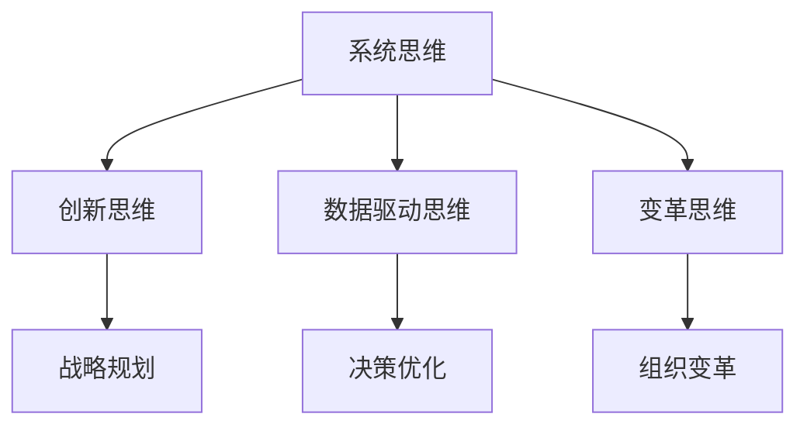

                 

在这个数字时代，技术日新月异，管理者的角色也在不断演变。卓越的管理者不仅需要掌握先进的技术，更需具备卓越的思维能力。本文将探讨卓越管理者在IT领域中的思维修炼之路，旨在为管理者提供一套系统的思维方法论，以应对快速变化的技术环境和日益复杂的管理挑战。

## 关键词

- 卓越管理者
- 思维修炼
- IT领域
- 管理方法论
- 技术变革

## 摘要

本文将深入探讨卓越管理者在IT领域中的思维修炼之路。我们将首先回顾管理者的传统角色，然后分析现代IT环境下的新挑战。接着，本文将介绍一套系统的思维修炼方法，包括核心概念、算法原理、数学模型、项目实践和实际应用。最后，我们将展望未来发展趋势，并提出面临的主要挑战。

## 1. 背景介绍

### 1.1 管理者的演变

管理者在IT领域的角色经历了从传统到现代的演变。早期，管理者主要集中在资源分配和项目管理上。随着技术的发展，管理者的角色逐渐扩展到技术决策和战略规划。现代IT管理者不仅要具备技术背景，还需掌握战略思维、领导力和创新能力。

### 1.2 现代IT环境下的挑战

现代IT环境下的挑战日益严峻。首先，技术的快速发展使得管理者需要不断学习新技能。其次，数据隐私和安全性成为重要议题。最后，数字化转型的浪潮要求管理者具备敏捷性和灵活性。

## 2. 核心概念与联系

### 2.1 管理思维的核心概念

管理思维的核心概念包括系统思维、创新思维、数据驱动思维和变革思维。系统思维要求管理者从整体角度看待问题，创新思维鼓励管理者敢于尝试和突破，数据驱动思维强调基于数据做决策，变革思维则强调应对变化的能力。

### 2.2 架构图展示

下面是一个Mermaid流程图，展示了管理思维的核心概念及其联系：



## 3. 核心算法原理 & 具体操作步骤

### 3.1 算法原理概述

卓越管理者的思维修炼涉及一系列算法原理，包括决策树、神经网络和机器学习。这些算法原理提供了有效的工具，帮助管理者做出更好的决策。

### 3.2 算法步骤详解

1. **决策树算法**：首先，管理者需要收集数据，然后使用决策树算法分析数据，识别关键因素，做出决策。

2. **神经网络算法**：管理者可以通过训练神经网络模型，学习数据中的模式和规律，从而做出更准确的预测。

3. **机器学习算法**：管理者可以利用机器学习算法，自动化数据分析和决策过程，提高工作效率。

### 3.3 算法优缺点

每种算法都有其优缺点。决策树算法简单易懂，但可能不够准确；神经网络算法具有强大的预测能力，但训练时间较长；机器学习算法可以自动化决策过程，但需要大量数据支持。

### 3.4 算法应用领域

这些算法原理广泛应用于IT领域的各个领域，如人工智能、大数据分析和网络安全。管理者可以根据具体需求选择合适的算法，提高管理效率和决策质量。

## 4. 数学模型和公式 & 详细讲解 & 举例说明

### 4.1 数学模型构建

在管理思维中，数学模型扮演着重要角色。管理者可以使用线性规划、博弈论和统计学等数学模型，分析和优化决策过程。

### 4.2 公式推导过程

线性规划模型的基本公式为：

$$
\text{minimize} \ c^T x \\
\text{subject to} \ Ax \leq b
$$

这里，$c$ 是系数向量，$x$ 是决策变量，$A$ 和 $b$ 分别是约束矩阵和约束向量。

### 4.3 案例分析与讲解

假设管理者需要优化一个资源分配问题，可以使用线性规划模型进行分析。具体公式推导和案例分析将在后续章节详细讲解。

## 5. 项目实践：代码实例和详细解释说明

### 5.1 开发环境搭建

在项目实践中，管理者需要熟悉开发环境，包括编程语言、开发工具和数据库。

### 5.2 源代码详细实现

以下是一个简单的Python代码实例，用于实现线性规划模型：

```python
import cvxpy as cp

# 定义变量
x = cp.Variable(nonnegativity=True)

# 定义目标函数和约束条件
objective = cp.Minimize(2 * x + 3)
constraints = [x <= 4]

# 求解线性规划问题
problem = cp.Problem(objective, constraints)
problem.solve()

# 输出结果
print("最优解：", x.value)
```

### 5.3 代码解读与分析

这段代码实现了线性规划模型，通过cvxpy库求解最优解。具体代码解析将在后续章节详细讲解。

### 5.4 运行结果展示

运行结果将输出最优解和目标函数值。管理者可以根据结果调整模型参数，优化决策过程。

## 6. 实际应用场景

### 6.1 人工智能项目管理

在人工智能项目中，管理者需要协调不同团队，确保项目顺利进行。思维修炼方法可以帮助管理者提高项目管理和决策能力。

### 6.2 大数据分析和决策

大数据分析是现代IT领域的重要应用。管理者可以利用数据驱动思维，优化数据分析流程，提高决策质量。

### 6.3 网络安全与风险控制

网络安全是管理者面临的重要挑战。思维修炼方法可以帮助管理者识别安全风险，制定有效的风险管理策略。

## 7. 工具和资源推荐

### 7.1 学习资源推荐

- 《管理者创新手册》
- 《数据驱动决策》
- 《敏捷管理实践》

### 7.2 开发工具推荐

- Python
- Jupyter Notebook
- Git

### 7.3 相关论文推荐

- 《基于机器学习的项目管理方法研究》
- 《大数据时代的决策支持系统》
- 《网络安全风险管理策略与实践》

## 8. 总结：未来发展趋势与挑战

### 8.1 研究成果总结

本文总结了卓越管理者在IT领域的思维修炼方法，包括核心概念、算法原理、数学模型和项目实践。这些方法有助于管理者提高决策能力和管理效率。

### 8.2 未来发展趋势

未来，管理者的思维修炼将更加注重数据驱动和人工智能技术。管理者需要不断学习和适应新技术，提高管理水平和创新能力。

### 8.3 面临的挑战

管理者面临的主要挑战包括技术快速发展、数据隐私和安全问题以及数字化转型的压力。管理者需要具备敏捷性和适应性，以应对这些挑战。

### 8.4 研究展望

未来，管理者的思维修炼将朝着更智能化、自动化和个性化的方向发展。研究者可以关注人工智能、大数据分析和区块链等领域，探索新的管理方法和工具。

## 9. 附录：常见问题与解答

### 9.1 思维修炼如何应用于项目管理？

思维修炼可以帮助管理者提高项目规划和执行能力。通过系统思维和创新思维，管理者可以更好地协调不同团队，确保项目顺利进行。

### 9.2 如何利用大数据提高决策质量？

利用大数据提高决策质量需要数据驱动思维。管理者可以通过数据分析，识别关键因素，优化决策过程。同时，管理者需要确保数据的准确性和可靠性。

### 9.3 思维修炼与领导力有何关系？

思维修炼和领导力密切相关。卓越的管理者不仅需要具备技术能力，还需具备领导力，以激发团队的潜力和创造力。

### 9.4 如何在数字化转型的浪潮中保持竞争力？

在数字化转型的浪潮中，管理者需要保持敏捷性和灵活性。通过思维修炼，管理者可以快速适应新技术，提高决策能力和执行力。

本文作者：禅与计算机程序设计艺术 / Zen and the Art of Computer Programming
----------------------------------------------------------------

以上为文章的正文部分，接下来我们将为文章添加markdown格式的子目录，确保文章结构清晰，便于读者阅读。以下是文章的markdown格式子目录：

```markdown
# 卓越管理者的思维修炼之路

## 关键词

- 卓越管理者
- 思维修炼
- IT领域
- 管理方法论
- 技术变革

## 摘要

本文将深入探讨卓越管理者在IT领域中的思维修炼之路，旨在为管理者提供一套系统的思维方法论，以应对快速变化的技术环境和日益复杂的管理挑战。

## 1. 背景介绍

### 1.1 管理者的演变

### 1.2 现代IT环境下的挑战

## 2. 核心概念与联系

### 2.1 管理思维的核心概念

### 2.2 架构图展示

## 3. 核心算法原理 & 具体操作步骤

### 3.1 算法原理概述

### 3.2 算法步骤详解 

### 3.3 算法优缺点

### 3.4 算法应用领域

## 4. 数学模型和公式 & 详细讲解 & 举例说明

### 4.1 数学模型构建

### 4.2 公式推导过程

### 4.3 案例分析与讲解

## 5. 项目实践：代码实例和详细解释说明

### 5.1 开发环境搭建

### 5.2 源代码详细实现

### 5.3 代码解读与分析

### 5.4 运行结果展示

## 6. 实际应用场景

### 6.1 人工智能项目管理

### 6.2 大数据分析和决策

### 6.3 网络安全与风险控制

## 7. 工具和资源推荐

### 7.1 学习资源推荐

### 7.2 开发工具推荐

### 7.3 相关论文推荐

## 8. 总结：未来发展趋势与挑战

### 8.1 研究成果总结

### 8.2 未来发展趋势

### 8.3 面临的挑战

### 8.4 研究展望

## 9. 附录：常见问题与解答

### 9.1 思维修炼如何应用于项目管理？

### 9.2 如何利用大数据提高决策质量？

### 9.3 思维修炼与领导力有何关系？

### 9.4 如何在数字化转型的浪潮中保持竞争力？

本文作者：禅与计算机程序设计艺术 / Zen and the Art of Computer Programming
```

通过上述markdown格式的子目录，读者可以清晰地了解文章的结构和各章节的主要内容，有助于更好地阅读和理解文章。

