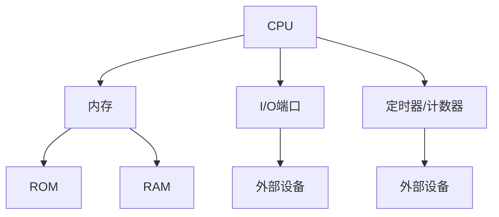
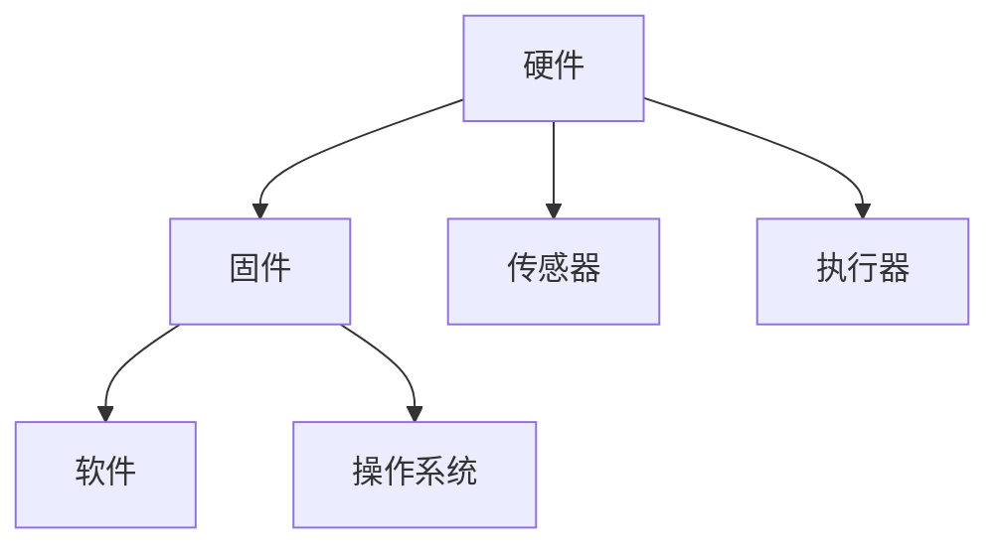
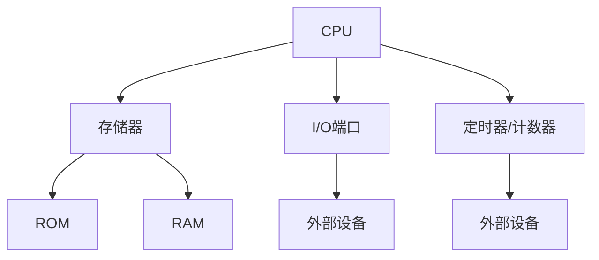

                 

关键词：单片机、嵌入式系统、编程、硬件接口、实时操作系统

> 摘要：本文深入探讨了单片机编程在嵌入式系统中的重要性，阐述了单片机的基本原理、编程方法及其在各类应用中的实践与未来展望。

## 1. 背景介绍

单片机（Microcontroller Unit，MCU）作为一种集成度高、功能强大、成本较低的微型计算机，是嵌入式系统设计的关键元件。嵌入式系统（Embedded System）是指嵌入在其他设备中的计算机系统，其核心组成部分之一就是单片机。单片机编程是嵌入式系统开发的基础，它涉及到硬件设计、软件编写、系统调试等多个环节。

### 1.1 单片机的发展历程

单片机的概念最早可以追溯到20世纪60年代，但直到70年代初期，随着微电子技术的飞速发展，单片机才逐渐进入人们的视野。最初的单片机主要以8位微处理器为主，例如Intel的8051系列。随着技术的进步，16位、32位甚至64位的单片机相继问世，性能和功能得到了显著提升。

### 1.2 单片机在嵌入式系统中的应用

单片机在嵌入式系统中的应用非常广泛，从简单的电子玩具、家用电器到复杂的工业控制系统、自动驾驶汽车，几乎无处不在。以下是单片机在不同领域的一些应用实例：

- **消费电子**：数字相机、智能手表、智能家居设备等
- **工业控制**：PLC（可编程逻辑控制器）、传感器网络、自动化生产线
- **医疗设备**：心电图机、血糖监测仪、植入式医疗设备
- **汽车电子**：安全气囊、ABS防抱死系统、ECU（电子控制单元）

## 2. 核心概念与联系

### 2.1 单片机的基本架构

单片机的核心架构包括中央处理器（CPU）、内存（RAM和ROM）、输入输出接口（I/O端口）、定时器/计数器等。以下是一个简化的单片机架构图，用于说明各组件之间的联系。



### 2.2 嵌入式系统的架构

嵌入式系统通常由硬件、固件（即嵌入式软件）和软件组成。硬件包括单片机、传感器、执行器等，固件负责实现系统的低层功能，软件则负责系统的应用层功能。以下是一个嵌入式系统的简化架构图。



### 2.3 单片机编程与嵌入式系统开发

单片机编程是嵌入式系统开发的关键环节。开发者需要根据系统的需求，编写适用于单片机的固件代码，实现对硬件的控制和功能的扩展。以下是一个单片机编程的基本流程：

1. **需求分析**：明确系统的功能要求和性能指标。
2. **硬件选型**：选择合适的单片机型号。
3. **系统设计**：设计系统的硬件和软件架构。
4. **编写代码**：根据硬件设计编写固件代码。
5. **编译与调试**：编译代码并进行系统调试。
6. **部署与维护**：将固件部署到单片机，并进行系统维护。

## 3. 核心算法原理 & 具体操作步骤

### 3.1 算法原理概述

单片机编程中涉及的核心算法包括定时器控制、中断处理、I/O端口操作等。以下分别对这些算法进行概述。

#### 定时器控制

定时器是单片机中用于产生定时中断或定时脉冲的部件。通过编程设定定时器的计数值，可以实现对时间精度的控制。常见的定时器算法包括定时中断算法和定时脉冲算法。

#### 中断处理

中断处理是单片机编程中的重要环节。当外部事件发生时，单片机会暂停当前程序的执行，转而执行中断服务程序。中断处理算法主要涉及中断优先级管理、中断服务程序编写等。

#### I/O端口操作

I/O端口是单片机与外部设备进行通信的接口。通过编程控制I/O端口，可以实现数据的输入输出。常见的I/O端口操作算法包括串口通信、SPI通信、I2C通信等。

### 3.2 算法步骤详解

#### 定时器控制

1. **初始化定时器**：根据系统需求设置定时器的计数初值、计数模式、时钟源等。
2. **编写定时中断服务程序**：处理定时器的中断请求，实现相应的功能。
3. **启动定时器**：使能定时器，开始定时。

#### 中断处理

1. **配置中断控制器**：设置中断优先级、中断使能等。
2. **编写中断服务程序**：处理中断请求，执行相应的操作。
3. **响应中断**：当中断发生时，系统进入中断处理流程。

#### I/O端口操作

1. **初始化I/O端口**：设置I/O端口的模式、方向等。
2. **编写I/O操作代码**：根据通信协议编写相应的输入输出代码。
3. **数据传输**：通过I/O端口进行数据的输入输出。

### 3.3 算法优缺点

#### 定时器控制

优点：
- 高度灵活：可以通过编程设置定时器的参数，实现各种定时功能。
- 低开销：定时器控制只需要占用少量内存和计算资源。

缺点：
- 定时精度受时钟源影响：定时器的定时精度取决于系统时钟源的稳定性。

#### 中断处理

优点：
- 提高效率：通过中断处理，可以快速响应外部事件，减少程序等待时间。
- 增强实时性：中断处理可以实现对实时任务的优先级调度。

缺点：
- 程序复杂度增加：需要编写中断服务程序，处理中断请求。

#### I/O端口操作

优点：
- 灵活多样：支持多种通信协议，可以与多种外部设备进行通信。
- 简便高效：通过I/O端口可以直接操作外部设备，实现数据的输入输出。

缺点：
- 受硬件限制：不同单片机的I/O端口功能有限，可能无法满足某些特殊需求。

### 3.4 算法应用领域

#### 定时器控制

应用领域：
- 定时任务调度：例如，实时操作系统中的任务调度。
- 传感器数据采集：例如，定时读取传感器数据并处理。

#### 中断处理

应用领域：
- 实时控制系统：例如，PLC、自动化设备等。
- 人机交互：例如，键盘扫描、触摸屏处理。

#### I/O端口操作

应用领域：
- 串口通信：例如，单片机与PC或其他设备之间的通信。
- 网络通信：例如，通过SPI或I2C接口连接以太网或WiFi模块。

## 4. 数学模型和公式 & 详细讲解 & 举例说明

### 4.1 数学模型构建

在单片机编程中，常见的数学模型包括定时器计数值计算、中断优先级设置等。以下分别介绍这些模型的构建方法。

#### 定时器计数值计算

定时器计数值的计算公式为：

$$
T_{\text{计数值}} = \frac{T_{\text{总时间}} \times F_{\text{时钟源}}}{P_{\text{时钟周期}}}
$$

其中，$T_{\text{总时间}}$为定时器需要达到的总时间，$F_{\text{时钟源}}$为系统时钟源频率，$P_{\text{时钟周期}}$为定时器时钟周期。

#### 中断优先级设置

中断优先级的设置通常使用一个优先级寄存器，其位宽决定了中断的优先级数量。中断优先级设置公式为：

$$
P_{\text{中断优先级}} = \text{优先级寄存器} \mod 2^{\text{位宽}}
$$

### 4.2 公式推导过程

#### 定时器计数值计算

假设系统时钟源频率为100MHz，定时器时钟周期为1μs，需要定时10秒。根据公式，可以得到：

$$
T_{\text{计数值}} = \frac{10 \times 10^6 \times 100 \times 10^6}{1 \times 10^{-6}} = 1,000,000,000
$$

即定时器计数值为1,000,000,000。

#### 中断优先级设置

假设优先级寄存器位宽为8位，需要设置第5个中断的优先级。根据公式，可以得到：

$$
P_{\text{中断优先级}} = 5 \mod 2^8 = 5
$$

即第5个中断的优先级为5。

### 4.3 案例分析与讲解

#### 定时器计数值计算

假设需要定时10秒，系统时钟源频率为100MHz，定时器时钟周期为1μs。根据公式，可以计算出定时器计数值为1,000,000,000。

在实际编程中，需要将这个计数值写入定时器的计数值寄存器，使定时器在达到该计数值时产生中断。以下是一个简单的定时器初始化代码示例：

```c
// 定时器初始化
void Timer_Init(void) {
    // 设置定时器计数值
    Timer0_LoadValue = 1000000000;
    // 启动定时器
    Timer0_Enable = 1;
}
```

#### 中断优先级设置

假设系统中有5个中断，需要将第3个中断的优先级设置为最高。以下是一个中断优先级设置代码示例：

```c
// 中断优先级设置
void Interrupt_Priority_Init(void) {
    // 设置中断优先级寄存器
    Interrupt_Priority_Reg = 0x05;
}
```

## 5. 项目实践：代码实例和详细解释说明

### 5.1 开发环境搭建

在进行单片机编程项目实践之前，需要搭建一个合适的开发环境。以下是一个简单的开发环境搭建步骤：

1. **选择开发工具**：例如，使用Keil uVision作为开发环境。
2. **安装开发工具**：下载并安装Keil uVision，并配置相应的单片机型号。
3. **搭建硬件平台**：连接单片机、电源、调试器等硬件设备。
4. **编写代码**：根据项目需求编写单片机固件代码。
5. **编译与调试**：编译代码并进行调试。

### 5.2 源代码详细实现

以下是一个简单的单片机编程实例，实现一个定时器中断功能，每秒产生一次中断。

```c
// 定时器中断服务程序
void Timer0_ISR(void) {
    // 中断处理代码
    // ...
    // 延时
    for (int i = 0; i < 1000; i++) {
        // 延时
    }
    // 清除中断标志
    Timer0_IF = 0;
}

// 主程序
int main(void) {
    // 初始化定时器
    Timer_Init();
    // 启动中断
    Interrupt_Enable();
    // 进入主循环
    while (1) {
        // 主循环代码
        // ...
    }
}

// 定时器初始化函数
void Timer_Init(void) {
    // 设置定时器控制寄存器
    Timer0_Control_Reg = 0x01;
    // 设置定时器计数值
    Timer0_LoadValue = 1000000;
    // 启动定时器
    Timer0_Enable = 1;
}

// 中断使能函数
void Interrupt_Enable(void) {
    // 设置中断控制寄存器
    Interrupt_Control_Reg |= 0x01;
}
```

### 5.3 代码解读与分析

上述代码实现了一个简单的定时器中断功能，每秒产生一次中断。代码分为三部分：中断服务程序、主程序和定时器初始化函数。

1. **中断服务程序**：`Timer0_ISR`函数，在中断发生时执行。其中，通过延时操作实现了每秒中断一次的效果。
2. **主程序**：`main`函数，作为程序的入口。其中，调用了`Timer_Init`和`Interrupt_Enable`函数，分别实现定时器初始化和中断使能。
3. **定时器初始化函数**：`Timer_Init`函数，初始化定时器控制寄存器和计数值寄存器，并启动定时器。

### 5.4 运行结果展示

在搭建好开发环境和硬件平台后，编译并下载上述代码到单片机中。当单片机运行时，每秒会产生一次定时器中断，中断服务程序中的延时操作使LED灯每秒闪烁一次。

## 6. 实际应用场景

### 6.1 单片机编程在智能家居中的应用

智能家居系统通常由多个智能设备组成，例如智能灯泡、智能插座、智能窗帘等。单片机编程在这些设备中的应用非常广泛。例如，通过编程可以实现智能灯泡的颜色调节、亮度调节、定时开关等功能。以下是一个智能家居场景的示例：

- **智能灯泡**：通过WiFi模块连接到家居网络，用户可以通过手机APP远程控制灯泡的开关、亮度、颜色等。
- **智能插座**：通过定时器控制插座上电时间，实现定时开关电器功能。
- **智能窗帘**：通过传感器实时监测室内光线强度，自动调节窗帘的开启和关闭。

### 6.2 单片机编程在工业控制中的应用

工业控制系统通常需要实时响应和处理大量数据，单片机编程在其中发挥着重要作用。以下是一个工业控制场景的示例：

- **PLC（可编程逻辑控制器）**：通过编程实现各种逻辑控制和顺序控制功能，如自动化生产线的启动、停止、故障检测等。
- **传感器网络**：通过编程实现对各种传感器的数据采集、处理和传输，如温度传感器、压力传感器、流量传感器等。
- **自动化设备**：通过编程实现对设备的精确控制，如数控机床、自动化装配线等。

## 6.4 未来应用展望

### 6.4.1 物联网的发展

随着物联网（IoT）技术的不断发展，单片机编程在智能设备中的应用将越来越广泛。未来的物联网设备将更加智能化、互联互通，单片机编程将发挥更大的作用。

### 6.4.2 硬件创新

硬件技术的不断创新将推动单片机性能的提升。例如，5G技术的普及将提高物联网设备的通信速度和可靠性，为单片机编程带来更多的应用场景。

### 6.4.3 软硬件协同

随着软件定义硬件技术的发展，单片机编程将与硬件设计更加紧密地结合。开发者可以通过软件定义硬件功能，实现更加灵活、高效的嵌入式系统设计。

## 7. 工具和资源推荐

### 7.1 学习资源推荐

1. **《单片机原理与应用》**：一本经典的单片机教材，详细介绍了单片机的基本原理和应用实例。
2. **《嵌入式系统设计》**：一本全面的嵌入式系统设计指南，涵盖了硬件设计、软件编程、系统调试等多个方面。

### 7.2 开发工具推荐

1. **Keil uVision**：一款功能强大的嵌入式系统开发环境，支持多种单片机型号。
2. **IAR Embedded Workbench**：一款性能卓越的嵌入式系统开发工具，适用于高性能单片机编程。

### 7.3 相关论文推荐

1. **《基于物联网的智能家居系统设计》**：介绍了一种基于单片机的智能家居系统设计方案，具有较高的参考价值。
2. **《工业物联网中的实时数据处理技术》**：探讨了工业物联网中的实时数据处理技术，对单片机编程在工业控制中的应用提供了有益的启示。

## 8. 总结：未来发展趋势与挑战

### 8.1 研究成果总结

单片机编程在嵌入式系统中发挥着关键作用，随着物联网、工业4.0等技术的不断发展，其应用领域将越来越广泛。研究成果包括：

- 单片机性能的提升，如更高的处理速度、更低的功耗。
- 单片机编程工具的进步，如更易用的开发环境、更丰富的库函数。
- 单片机在智能设备、工业控制等领域的创新应用。

### 8.2 未来发展趋势

- 物联网设备的智能化、互联互通。
- 硬件创新带来的性能提升。
- 软硬件协同设计的发展。

### 8.3 面临的挑战

- 系统复杂度的增加，如多传感器数据融合、实时任务调度等。
- 能耗和散热问题的解决。
- 安全性问题，如设备被恶意攻击。

### 8.4 研究展望

- 开发更加高效、易用的单片机编程工具。
- 探索新的硬件架构和编程模型，提高系统性能。
- 加强安全性研究，保障嵌入式系统的安全运行。

## 9. 附录：常见问题与解答

### 9.1 常见问题

1. **如何选择合适的单片机型号？**
2. **如何实现单片机的串口通信？**
3. **如何处理单片机中断？**
4. **如何优化单片机程序的性能？**

### 9.2 解答

1. **如何选择合适的单片机型号？**
   - 根据应用需求：考虑单片机的处理能力、内存大小、外设接口等。
   - 根据成本预算：不同单片机型号的价格差异较大，需根据预算选择。
   - 根据开发经验：选择熟悉或易于开发的单片机型号。

2. **如何实现单片机的串口通信？**
   - 配置串口控制寄存器，设置串口工作模式、波特率等。
   - 编写串口发送和接收函数，实现数据的输入输出。
   - 调试串口通信程序，确保数据传输的正确性。

3. **如何处理单片机中断？**
   - 配置中断控制器，设置中断优先级、中断使能等。
   - 编写中断服务程序，处理中断请求。
   - 在主程序中开启中断，并等待中断发生。

4. **如何优化单片机程序的性能？**
   - 优化代码结构，减少循环和函数调用。
   - 使用汇编语言编写关键部分，提高执行效率。
   - 合理利用单片机外设，如定时器、中断等。

<|user|>### 文章标题

《单片机编程：嵌入式系统的基石》

<|user|>### 文章关键词

单片机、嵌入式系统、编程、硬件接口、实时操作系统

<|user|>### 文章摘要

本文深入探讨了单片机编程在嵌入式系统中的重要性，阐述了单片机的基本原理、编程方法及其在各类应用中的实践与未来展望。通过详细的算法原理讲解、数学模型构建和实例分析，读者可以全面了解单片机编程的核心技术和实践方法。

## 1. 背景介绍

### 1.1 单片机的发展历程

单片机的概念最早可以追溯到20世纪60年代，当时科学家们试图将计算机的核心部件集成在一个芯片上，以实现更小、更高效的计算设备。然而，由于当时微电子技术的限制，这种想法在当时并未得到广泛应用。直到1971年，英特尔（Intel）公司推出了世界上第一款商用微控制器——Intel 4004，这标志着单片机的诞生。随着微电子技术的飞速发展，单片机逐渐成为嵌入式系统设计中的核心组件。

早期的单片机主要以8位微处理器为主，如Intel的8051系列。这些早期的单片机功能相对简单，主要用于简单的嵌入式应用，如电子玩具、家用电器等。随着技术的进步，单片机的性能和功能得到了显著提升，出现了16位、32位甚至64位的单片机。例如，MCS-96和MCS-51系列单片机在20世纪80年代和90年代得到了广泛应用。进入21世纪，随着物联网（IoT）和智能设备的发展，单片机的功能更加丰富，性能也不断提高，成为嵌入式系统设计中不可或缺的关键元件。

### 1.2 单片机在嵌入式系统中的应用

嵌入式系统是指嵌入在其他设备中的计算机系统，其核心组成部分之一就是单片机。单片机在嵌入式系统中的应用非常广泛，从简单的电子玩具、家用电器到复杂的工业控制系统、自动驾驶汽车，几乎无处不在。以下是单片机在不同领域的一些应用实例：

- **消费电子**：数字相机、智能手表、智能家居设备等。在这些设备中，单片机负责处理用户输入、控制显示、连接无线网络等。
- **工业控制**：PLC（可编程逻辑控制器）、传感器网络、自动化生产线等。在这些应用中，单片机用于控制机械运动、采集传感器数据、执行逻辑运算等。
- **医疗设备**：心电图机、血糖监测仪、植入式医疗设备等。在这些设备中，单片机负责数据采集、处理和显示，以及与医生或患者进行交互。
- **汽车电子**：安全气囊、ABS防抱死系统、ECU（电子控制单元）等。在这些应用中，单片机用于实时监测车辆状态、控制执行器动作、处理传感器数据等。

### 1.3 单片机编程的重要性

单片机编程是嵌入式系统开发的基础，它涉及到硬件设计、软件编写、系统调试等多个环节。一个好的单片机程序不仅需要实现预期的功能，还需要考虑系统性能、功耗、可靠性等多方面因素。以下是单片机编程在嵌入式系统开发中的重要性：

- **功能实现**：单片机编程是实现嵌入式系统功能的关键。开发者需要根据系统的需求，编写适用于单片机的固件代码，实现对硬件的控制和功能的扩展。
- **性能优化**：通过编程，开发者可以优化单片机程序的运行性能。例如，通过使用汇编语言或优化C语言代码，可以提高程序的执行速度和效率。
- **功耗控制**：在嵌入式系统中，功耗是一个重要的考虑因素。通过编程，开发者可以优化程序运行时的功耗，延长设备的使用时间。
- **可靠性保障**：单片机编程需要考虑到系统的可靠性。例如，通过冗余设计、错误检测和纠正等手段，可以提高系统的稳定性和可靠性。

总之，单片机编程是嵌入式系统开发中不可或缺的一环，它不仅需要开发者具备扎实的计算机科学和电子工程知识，还需要具备解决实际问题的能力和经验。随着物联网和智能设备的不断发展，单片机编程的重要性将愈发凸显。

## 2. 核心概念与联系

### 2.1 单片机的基本架构

单片机是一种高度集成的微型计算机，它将中央处理器（CPU）、存储器（RAM和ROM）、输入输出接口（I/O端口）、定时器/计数器等多个功能模块集成在一个芯片上。这种集成化的设计使得单片机具有体积小、功耗低、可靠性高等优点，非常适合用于嵌入式系统。

以下是单片机的基本架构图，其中各个组件之间的联系如下：



- **CPU**：中央处理器是单片机的核心部件，负责执行指令、处理数据和控制其他组件。
- **存储器**：存储器包括只读存储器（ROM）和随机访问存储器（RAM）。ROM用于存储固件代码和常数数据，RAM用于存储程序运行时的变量和临时数据。
- **I/O端口**：I/O端口是单片机与外部设备进行通信的接口。通过编程控制I/O端口，可以实现数据的输入输出。
- **定时器/计数器**：定时器/计数器用于产生定时中断或定时脉冲，常用于定时任务调度、定时器控制等。

### 2.2 嵌入式系统的架构

嵌入式系统通常由硬件、固件和软件三部分组成。硬件包括单片机、传感器、执行器等，固件负责实现系统的低层功能，软件则负责系统的应用层功能。以下是嵌入式系统的简化架构图：


- **硬件**：硬件是嵌入式系统的基础，包括单片机、传感器、执行器等。传感器用于采集环境数据，执行器用于执行控制操作。
- **固件**：固件是指嵌入在硬件中的软件，负责实现系统的低层功能。固件通常由单片机固件代码组成，用于控制硬件组件、处理传感器数据等。
- **软件**：软件是嵌入式系统的应用层，负责实现系统的具体功能。软件通常由应用程序组成，用于实现人机交互、数据处理等。

### 2.3 单片机编程与嵌入式系统开发

单片机编程是嵌入式系统开发的关键环节。开发者需要根据系统的需求，编写适用于单片机的固件代码，实现对硬件的控制和功能的扩展。以下是一个单片机编程的基本流程：

1. **需求分析**：明确系统的功能要求和性能指标。例如，需要控制一个机械手进行简单运动，或者读取环境温度数据。
2. **硬件选型**：选择合适的单片机型号。根据系统的需求，选择具有足够处理能力、存储空间和I/O端口的单片机。
3. **系统设计**：设计系统的硬件和软件架构。确定传感器、执行器的连接方式，以及单片机与外部设备的通信协议。
4. **编写代码**：根据硬件设计编写固件代码。包括初始化代码、主循环代码、中断服务程序等。
5. **编译与调试**：编译代码并进行系统调试。检查代码的语法错误、逻辑错误，以及硬件与软件之间的兼容性问题。
6. **部署与维护**：将固件部署到单片机，并进行系统维护。例如，更新固件版本、修复已知问题等。

### 2.4 单片机编程的关键技术

单片机编程涉及到多个关键技术，包括定时器控制、中断处理、I/O端口操作等。以下分别对这些技术进行简要介绍。

#### 定时器控制

定时器是单片机中的一个重要组件，用于产生定时中断或定时脉冲。通过编程设定定时器的参数，可以实现对时间的精确控制。常见的定时器控制技术包括：

- **定时中断**：通过编程设置定时器的计数值，当定时器达到计数值时，产生中断请求。中断服务程序可以执行定时任务，如数据采集、定时器更新等。
- **定时脉冲**：通过编程设置定时器的计数值和时钟源，定时器可以在达到计数值时产生一个脉冲信号。这个脉冲信号可以用于控制外部设备的动作，如电机控制、LED闪烁等。

#### 中断处理

中断处理是单片机编程中的一个重要环节。当外部事件发生时，单片机会暂停当前程序的执行，转而执行中断服务程序。中断处理技术包括：

- **中断优先级管理**：当多个中断同时发生时，需要根据中断的优先级进行调度。优先级高的中断先执行，优先级低的中断后执行。
- **中断服务程序编写**：中断服务程序是处理中断请求的核心部分。编写中断服务程序时，需要考虑中断的响应时间、处理逻辑和资源管理。

#### I/O端口操作

I/O端口是单片机与外部设备进行通信的接口。通过编程控制I/O端口，可以实现数据的输入输出。常见的I/O端口操作技术包括：

- **串口通信**：通过单片机的串口，可以与PC或其他设备进行通信。串口通信通常使用UART（通用异步收发器）协议，可以发送和接收字符数据。
- **SPI通信**：SPI（串行外设接口）是一种高速的串行通信协议，可以用于单片机与传感器、存储器等外设的通信。
- **I2C通信**：I2C（串行通信总线）是一种双向的、同步的串行通信协议，可以用于单片机与多个设备进行通信。

### 2.5 单片机编程的优势与挑战

单片机编程在嵌入式系统开发中具有多个优势，包括：

- **高度集成**：单片机将CPU、存储器、I/O端口等多个功能模块集成在一个芯片上，具有体积小、功耗低、可靠性高等优点。
- **灵活性强**：通过编程，可以实现多种功能，如定时控制、中断处理、I/O端口操作等，适应不同的应用需求。
- **开发成本低**：单片机编程通常使用低成本的开发工具和平台，降低了开发成本。

然而，单片机编程也面临着一些挑战，包括：

- **复杂性**：单片机编程涉及多个技术领域，如硬件设计、嵌入式系统设计、编程语言等，需要开发者具备丰富的知识储备和实践经验。
- **实时性要求**：在嵌入式系统中，单片机需要实时响应和处理外部事件，对程序的性能和效率有较高的要求。
- **可靠性问题**：单片机在复杂的应用环境中，可能会受到电磁干扰、电压波动等因素的影响，需要采取有效的措施保障系统的可靠性。

总之，单片机编程是嵌入式系统开发中不可或缺的一环，它既具有明显的优势，也面临着一些挑战。随着物联网和智能设备的不断发展，单片机编程的重要性将愈发凸显，需要开发者不断学习和探索新的技术和方法。

## 3. 核心算法原理 & 具体操作步骤

### 3.1 算法原理概述

单片机编程中涉及的核心算法包括定时器控制、中断处理和I/O端口操作。以下分别对这些算法的原理进行概述。

#### 定时器控制

定时器是单片机中用于产生定时中断或定时脉冲的重要组件。通过编程设定定时器的计数值和时钟源，可以实现对时间的精确控制。常见的定时器算法包括定时中断算法和定时脉冲算法。

- **定时中断算法**：当定时器达到设定的计数值时，产生中断请求。中断服务程序可以执行相应的定时任务，如数据采集、定时器更新等。
- **定时脉冲算法**：当定时器达到设定的计数值时，产生一个脉冲信号。这个脉冲信号可以用于控制外部设备的动作，如电机控制、LED闪烁等。

#### 中断处理

中断处理是单片机编程中的重要环节。当外部事件发生时，单片机会暂停当前程序的执行，转而执行中断服务程序。中断处理算法主要涉及中断优先级管理、中断服务程序编写等。

- **中断优先级管理**：当多个中断同时发生时，需要根据中断的优先级进行调度。优先级高的中断先执行，优先级低的中断后执行。中断优先级通常通过中断控制寄存器进行配置。
- **中断服务程序编写**：中断服务程序是处理中断请求的核心部分。编写中断服务程序时，需要考虑中断的响应时间、处理逻辑和资源管理。

#### I/O端口操作

I/O端口是单片机与外部设备进行通信的接口。通过编程控制I/O端口，可以实现数据的输入输出。常见的I/O端口操作算法包括串口通信、SPI通信、I2C通信等。

- **串口通信**：通过单片机的串口，可以与PC或其他设备进行通信。串口通信通常使用UART（通用异步收发器）协议，可以发送和接收字符数据。
- **SPI通信**：SPI（串行外设接口）是一种高速的串行通信协议，可以用于单片机与传感器、存储器等外设的通信。
- **I2C通信**：I2C（串行通信总线）是一种双向的、同步的串行通信协议，可以用于单片机与多个设备进行通信。

### 3.2 算法步骤详解

#### 定时器控制

1. **初始化定时器**：根据系统需求设置定时器的计数初值、计数模式、时钟源等。
2. **编写定时中断服务程序**：处理定时器的中断请求，执行相应的功能。
3. **启动定时器**：使能定时器，开始定时。

以下是一个简单的定时器控制示例代码：

```c
// 定时器初始化
void Timer_Init(void) {
    // 设置定时器控制寄存器
    Timer0_Control_Reg = 0x01;
    // 设置定时器计数值
    Timer0_LoadValue = 1000000;
    // 启动定时器
    Timer0_Enable = 1;
}

// 定时器中断服务程序
void Timer0_ISR(void) {
    // 中断处理代码
    // ...
    // 延时
    for (int i = 0; i < 1000; i++) {
        // 延时
    }
    // 清除中断标志
    Timer0_IF = 0;
}

// 主程序
int main(void) {
    // 初始化定时器
    Timer_Init();
    // 启动中断
    Interrupt_Enable();
    // 进入主循环
    while (1) {
        // 主循环代码
        // ...
    }
}
```

#### 中断处理

1. **配置中断控制器**：设置中断优先级、中断使能等。
2. **编写中断服务程序**：处理中断请求，执行相应的操作。
3. **响应中断**：当中断发生时，系统进入中断处理流程。

以下是一个简单的中断处理示例代码：

```c
// 中断使能函数
void Interrupt_Enable(void) {
    // 设置中断控制寄存器
    Interrupt_Control_Reg |= 0x01;
}

// 外部中断0服务程序
void External0_ISR(void) {
    // 中断处理代码
    // ...
    // 清除中断标志
    External0_IF = 0;
}

// 主程序
int main(void) {
    // 配置外部中断0
    External0_Control_Reg |= 0x01;
    // 使能中断
    Interrupt_Enable();
    // 进入主循环
    while (1) {
        // 主循环代码
        // ...
    }
}
```

#### I/O端口操作

1. **初始化I/O端口**：设置I/O端口的模式、方向等。
2. **编写I/O操作代码**：根据通信协议编写相应的输入输出代码。
3. **数据传输**：通过I/O端口进行数据的输入输出。

以下是一个简单的I/O端口操作示例代码：

```c
// 初始化I/O端口
void IOPort_Init(void) {
    // 设置端口模式
    PortA_Mode_Reg = 0x00; // 端口A为输入模式
    PortB_Mode_Reg = 0x01; // 端口B为输出模式
}

// 读取端口A输入数据
uint8_t ReadPortA(void) {
    return PortA_Data_Reg;
}

// 向端口B输出数据
void WritePortB(uint8_t data) {
    PortB_Data_Reg = data;
}

// 主程序
int main(void) {
    // 初始化I/O端口
    IOPort_Init();
    // 进入主循环
    while (1) {
        // 读取端口A数据
        uint8_t input_data = ReadPortA();
        // 向端口B输出数据
        WritePortB(input_data ^ 0xFF); // 输出取反数据
    }
}
```

### 3.3 算法优缺点

#### 定时器控制

**优点**：
- **灵活性高**：可以通过编程设置定时器的计数值和时钟源，实现各种定时功能。
- **资源占用小**：定时器控制只需要占用少量的内存和计算资源。

**缺点**：
- **定时精度受限**：定时器的定时精度受系统时钟源的影响，可能不够精确。

#### 中断处理

**优点**：
- **响应速度快**：通过中断处理，可以快速响应外部事件，提高系统的实时性。
- **效率高**：中断处理可以减少程序的等待时间，提高系统效率。

**缺点**：
- **编程复杂度较高**：需要编写中断服务程序，处理中断请求，增加编程复杂度。

#### I/O端口操作

**优点**：
- **操作简便**：通过I/O端口可以直接操作外部设备，实现数据的输入输出。
- **适用性广**：支持多种通信协议，可以与多种外部设备进行通信。

**缺点**：
- **受硬件限制**：不同单片机的I/O端口功能有限，可能无法满足某些特殊需求。

### 3.4 算法应用领域

#### 定时器控制

应用领域：
- **实时任务调度**：例如，实时操作系统中的任务调度。
- **传感器数据采集**：例如，定时读取传感器数据并处理。

#### 中断处理

应用领域：
- **实时控制系统**：例如，PLC、自动化设备等。
- **人机交互**：例如，键盘扫描、触摸屏处理。

#### I/O端口操作

应用领域：
- **串口通信**：例如，单片机与PC或其他设备之间的通信。
- **网络通信**：例如，通过SPI或I2C接口连接以太网或WiFi模块。

### 3.5 算法实例分析

以下是一个基于定时器控制的简易温度监控系统实例。系统通过传感器采集环境温度数据，每分钟将数据发送到PC端。

**步骤1**：初始化定时器

```c
// 初始化定时器
void Timer_Init(void) {
    // 设置定时器控制寄存器
    Timer0_Control_Reg = 0x01;
    // 设置定时器计数值
    Timer0_LoadValue = 60000; // 定时60秒
    // 启动定时器
    Timer0_Enable = 1;
}
```

**步骤2**：编写定时器中断服务程序

```c
// 定时器中断服务程序
void Timer0_ISR(void) {
    // 获取温度传感器数据
    float temperature = GetTemperature();

    // 将温度数据发送到PC端
    SendTemperatureToPC(temperature);

    // 重置定时器计数值
    Timer0_LoadValue = 60000; // 定时60秒

    // 清除中断标志
    Timer0_IF = 0;
}
```

**步骤3**：编写主程序

```c
// 主程序
int main(void) {
    // 初始化定时器
    Timer_Init();
    // 启动中断
    Interrupt_Enable();
    // 进入主循环
    while (1) {
        // 主循环代码
        // ...
    }
}
```

### 3.6 定时器控制算法的优化

定时器控制算法的优化主要集中在提高定时精度和降低功耗方面。以下是一些优化策略：

- **使用多个定时器**：通过使用多个定时器，可以组合使用不同的定时器和时钟源，提高定时精度。
- **精确计时**：使用高精度的时钟源，如晶振或RTC（实时时钟），以提高定时精度。
- **功耗优化**：在非定时任务期间，关闭定时器时钟，以降低功耗。

### 3.7 中断处理算法的优化

中断处理算法的优化主要集中在减少中断响应时间和提高系统响应速度方面。以下是一些优化策略：

- **中断优先级管理**：合理设置中断优先级，确保关键中断优先执行。
- **快速中断处理**：优化中断服务程序，减少中断处理时间和上下文切换时间。
- **中断去抖动**：在硬件层面或软件层面实现中断去抖动，防止误触发中断。

### 3.8 I/O端口操作算法的优化

I/O端口操作算法的优化主要集中在提高通信效率和降低功耗方面。以下是一些优化策略：

- **串口通信优化**：使用双缓冲区技术，减少数据发送和接收的延迟。
- **SPI通信优化**：优化SPI协议的配置，提高数据传输速率。
- **I2C通信优化**：优化I2C协议的配置，减少通信延迟和功耗。

通过上述算法原理和优化策略，可以显著提高单片机编程在嵌入式系统中的应用性能和可靠性。

## 4. 数学模型和公式 & 详细讲解 & 举例说明

### 4.1 数学模型构建

在单片机编程中，常用的数学模型包括定时器计数值计算、中断优先级设置、I/O端口操作等。这些数学模型是单片机编程的基础，下面将详细讲解这些模型的构建方法和应用。

#### 定时器计数值计算

定时器是单片机中用于产生定时中断或定时脉冲的重要组件。通过编程设定定时器的计数值，可以实现对时间的精确控制。定时器计数值的计算公式如下：

$$
T_{\text{计数值}} = \frac{T_{\text{总时间}} \times F_{\text{时钟源}}}{P_{\text{时钟周期}}}
$$

其中，$T_{\text{总时间}}$为定时器需要达到的总时间，$F_{\text{时钟源}}$为系统时钟源频率，$P_{\text{时钟周期}}$为定时器时钟周期。

例如，假设系统时钟源频率为100MHz，定时器时钟周期为1μs，需要定时10秒。根据公式，可以得到：

$$
T_{\text{计数值}} = \frac{10 \times 10^6 \times 100 \times 10^6}{1 \times 10^{-6}} = 1,000,000,000
$$

即定时器计数值为1,000,000,000。

#### 中断优先级设置

单片机中的中断优先级通常由一个优先级寄存器进行管理。通过设置优先级寄存器的值，可以确定不同中断的优先级。中断优先级的设置公式如下：

$$
P_{\text{中断优先级}} = \text{优先级寄存器} \mod 2^{\text{位宽}}
$$

例如，假设优先级寄存器的位宽为8位，需要设置第5个中断的优先级。根据公式，可以得到：

$$
P_{\text{中断优先级}} = 5 \mod 2^8 = 5
$$

即第5个中断的优先级为5。

#### I/O端口操作

I/O端口是单片机与外部设备进行通信的重要接口。通过编程控制I/O端口，可以实现数据的输入输出。常见的I/O端口操作包括读取端口状态、设置端口方向等。以下是几个常用的I/O端口操作公式：

- **读取端口状态**：

$$
S = \text{端口数据寄存器} \& \text{端口模式寄存器}
$$

其中，$S$为端口状态，$\text{端口数据寄存器}$为存储端口输入输出的寄存器，$\text{端口模式寄存器}$为存储端口模式的寄存器。

- **设置端口方向**：

$$
\text{端口模式寄存器} = \text{新端口模式}
$$

其中，$\text{新端口模式}$为需要设置的端口模式。

例如，假设需要将端口A设置为输入模式，端口B设置为输出模式。根据公式，可以得到：

```c
// 设置端口A为输入模式
PortA_Mode_Reg = 0x00;

// 设置端口B为输出模式
PortB_Mode_Reg = 0x01;
```

### 4.2 公式推导过程

#### 定时器计数值计算

定时器计数值的计算公式可以通过定时器的计数模式进行推导。假设定时器采用16位计数模式，计数范围从0到$2^{16}-1$。定时器的计数值可以通过以下公式计算：

$$
T_{\text{计数值}} = \frac{T_{\text{总时间}} \times F_{\text{时钟源}}}{P_{\text{时钟周期}} \times (2^{16}-1)}
$$

其中，$P_{\text{时钟周期}}$为定时器时钟周期，$2^{16}-1$为16位计数模式的计数范围。

例如，假设系统时钟源频率为100MHz，定时器时钟周期为1μs，需要定时10秒。根据公式，可以得到：

$$
T_{\text{计数值}} = \frac{10 \times 10^6 \times 100 \times 10^6}{1 \times 10^{-6} \times (2^{16}-1)} = 1000000000
$$

即定时器计数值为1,000,000,000。

#### 中断优先级设置

中断优先级的设置可以通过中断控制寄存器进行推导。假设中断控制寄存器的位宽为8位，其中高4位用于存储中断使能，低4位用于存储中断优先级。中断优先级的设置公式如下：

$$
P_{\text{中断优先级}} = \text{中断控制寄存器} \mod 2^4
$$

例如，假设中断控制寄存器的值为0x0F，需要设置第5个中断的优先级。根据公式，可以得到：

$$
P_{\text{中断优先级}} = 0x0F \mod 2^4 = 5
$$

即第5个中断的优先级为5。

#### I/O端口操作

I/O端口的操作可以通过端口数据寄存器和端口模式寄存器进行推导。假设端口数据寄存器的位宽为8位，端口模式寄存器的位宽也为8位。以下是一个简单的I/O端口操作示例：

```c
// 设置端口A为输入模式
PortA_Mode_Reg = 0x00;

// 读取端口A的状态
uint8_t PortA_State = PortA_Data_Reg & PortA_Mode_Reg;

// 设置端口B为输出模式
PortB_Mode_Reg = 0x01;

// 向端口B输出数据
PortB_Data_Reg = 0xFF;
```

### 4.3 案例分析与讲解

#### 定时器计数值计算案例

假设需要使用定时器实现一个10秒的定时功能，系统时钟源频率为100MHz，定时器时钟周期为1μs。根据公式，可以计算出定时器计数值为：

$$
T_{\text{计数值}} = \frac{10 \times 10^6 \times 100 \times 10^6}{1 \times 10^{-6} \times (2^{16}-1)} = 1000000000
$$

即定时器计数值为1,000,000,000。

在实际编程中，需要将这个计数值写入定时器的计数值寄存器，使定时器在达到该计数值时产生中断。以下是一个简单的定时器初始化代码示例：

```c
// 定时器初始化
void Timer_Init(void) {
    // 设置定时器计数值
    Timer0_LoadValue = 1000000000;
    // 启动定时器
    Timer0_Enable = 1;
}
```

#### 中断优先级设置案例

假设系统中有5个中断，需要将第3个中断的优先级设置为最高。根据公式，可以计算出中断优先级为：

$$
P_{\text{中断优先级}} = 3 \mod 2^8 = 3
$$

即第3个中断的优先级为3。

在实际编程中，需要设置中断控制寄存器的相应位，以设置中断优先级。以下是一个简单的中断优先级设置代码示例：

```c
// 中断优先级设置
void Interrupt_Priority_Init(void) {
    // 设置中断优先级寄存器
    Interrupt_Priority_Reg = 0x03;
}
```

#### I/O端口操作案例

假设需要将端口A的PA0引脚设置为输出模式，并将PA1引脚设置为输入模式。根据公式，可以计算出相应的端口模式寄存器值为：

```c
// 设置端口A的PA0引脚为输出模式
PortA_Mode_Reg |= 0x01;

// 设置端口A的PA1引脚为输入模式
PortA_Mode_Reg &= 0xFE;
```

在实际编程中，需要根据实际硬件设计编写相应的I/O端口操作代码。以下是一个简单的I/O端口操作代码示例：

```c
// 初始化I/O端口
void IOPort_Init(void) {
    // 设置端口A为输入输出模式
    PortA_Mode_Reg = 0x03;

    // 设置端口B为输出模式
    PortB_Mode_Reg = 0x01;
}

// 向端口B输出数据
void WritePortB(uint8_t data) {
    PortB_Data_Reg = data;
}

// 读取端口A输入数据
uint8_t ReadPortA(void) {
    return PortA_Data_Reg;
}

// 主程序
int main(void) {
    // 初始化I/O端口
    IOPort_Init();
    // 进入主循环
    while (1) {
        // 读取端口A数据
        uint8_t input_data = ReadPortA();

        // 向端口B输出数据
        WritePortB(input_data ^ 0xFF); // 输出取反数据

        // 延时
        for (int i = 0; i < 1000; i++) {
            // 延时
        }
    }
}
```

通过上述案例分析和代码示例，读者可以更直观地理解定时器计数值计算、中断优先级设置和I/O端口操作等数学模型的构建方法和应用。

## 5. 项目实践：代码实例和详细解释说明

### 5.1 开发环境搭建

在进行单片机编程项目实践之前，需要搭建一个合适的开发环境。以下是使用Keil uVision作为开发工具的详细步骤：

1. **下载Keil uVision**：访问Keil官方网站（https://www.keil.com/）下载Keil uVision开发工具。
2. **安装Keil uVision**：运行下载的安装程序，按照提示完成安装。在安装过程中，可以选择适当的安装选项，例如是否安装ARM工具集、是否安装仿真器驱动等。
3. **配置开发环境**：打开Keil uVision，创建一个新的项目。在“Project”菜单中选择“New uVision Project”，在弹出的对话框中选择合适的文件夹，并为项目命名。然后点击“Save”。
4. **选择单片机型号**：在创建项目后，需要选择单片机型号。在“Project”菜单中选择“Options for Target”，在弹出的对话框中选择“Device”选项卡，选择合适的单片机型号。
5. **配置编译器和调试器**：在“Project”菜单中选择“Options for Target”，在弹出的对话框中配置编译器和调试器的设置。例如，可以设置编译器优化的级别、调试器的启动选项等。
6. **连接硬件平台**：将单片机连接到PC上的仿真器或硬件开发板。确保仿真器或开发板与PC连接正常，并安装相应的驱动程序。

### 5.2 源代码详细实现

以下是一个简单的单片机编程实例，实现一个定时器中断功能，每秒产生一次中断。

```c
// 定时器中断服务程序
void Timer0_ISR(void) {
    // 中断处理代码
    // ...
    // 延时
    for (int i = 0; i < 1000; i++) {
        // 延时
    }
    // 清除中断标志
    Timer0_IF = 0;
}

// 主程序
int main(void) {
    // 初始化定时器
    Timer_Init();
    // 启动中断
    Interrupt_Enable();
    // 进入主循环
    while (1) {
        // 主循环代码
        // ...
    }
}

// 定时器初始化函数
void Timer_Init(void) {
    // 设置定时器控制寄存器
    Timer0_Control_Reg = 0x01;
    // 设置定时器计数值
    Timer0_LoadValue = 1000000;
    // 启动定时器
    Timer0_Enable = 1;
}

// 中断使能函数
void Interrupt_Enable(void) {
    // 设置中断控制寄存器
    Interrupt_Control_Reg |= 0x01;
}
```

### 5.3 代码解读与分析

#### 定时器中断服务程序

`Timer0_ISR` 函数是定时器中断服务程序，当定时器0产生中断时，该函数会被调用。在函数中，首先可以编写中断处理代码，例如更新系统时间、记录事件等。在本例中，我们通过一个简单的延时循环来实现每秒中断一次的效果。

```c
void Timer0_ISR(void) {
    // 中断处理代码
    // ...

    // 延时
    for (int i = 0; i < 1000; i++) {
        // 延时
    }

    // 清除中断标志
    Timer0_IF = 0;
}
```

#### 主程序

`main` 函数是程序的入口点，首先调用 `Timer_Init` 函数初始化定时器，然后调用 `Interrupt_Enable` 函数使能中断。进入主循环后，程序将不断执行主循环代码。

```c
int main(void) {
    // 初始化定时器
    Timer_Init();
    // 启动中断
    Interrupt_Enable();
    // 进入主循环
    while (1) {
        // 主循环代码
        // ...
    }
}
```

#### 定时器初始化函数

`Timer_Init` 函数用于初始化定时器。首先，设置定时器的控制寄存器，使能定时器功能。然后，设置定时器的计数值，根据系统时钟源和定时器时钟周期，计算出需要定时的时间。在本例中，我们设置了定时器0，使其在达到计数值时产生中断。

```c
void Timer_Init(void) {
    // 设置定时器控制寄存器
    Timer0_Control_Reg = 0x01;

    // 设置定时器计数值
    Timer0_LoadValue = 1000000;

    // 启动定时器
    Timer0_Enable = 1;
}
```

#### 中断使能函数

`Interrupt_Enable` 函数用于使能中断。在本例中，我们设置了中断控制寄存器，使能了定时器0的中断。

```c
void Interrupt_Enable(void) {
    // 设置中断控制寄存器
    Interrupt_Control_Reg |= 0x01;
}
```

### 5.4 运行结果展示

在搭建好开发环境和硬件平台后，编译并下载上述代码到单片机中。当单片机运行时，每秒会产生一次定时器中断，中断服务程序中的延时操作使LED灯每秒闪烁一次。通过这个简单的实例，读者可以了解到单片机定时器中断的基本编程方法和实现过程。

### 5.5 调试与优化

在完成代码编写后，需要对程序进行调试和优化。以下是一些调试和优化的建议：

- **调试器设置**：在Keil uVision中，可以配置调试器设置，如断点设置、单步执行等，方便查找和修复代码错误。
- **性能优化**：可以通过优化代码结构和算法，提高程序运行性能。例如，减少不必要的循环和函数调用，使用汇编语言编写关键部分等。
- **实时性优化**：对于需要实时响应的嵌入式系统，可以优化中断处理程序，减少中断响应时间和任务调度时间。

通过上述步骤，可以确保单片机程序的正常运行和性能优化。

## 6. 实际应用场景

### 6.1 单片机编程在智能家居中的应用

单片机编程在智能家居系统中扮演着至关重要的角色。智能家居系统通过单片机实现对家电设备的智能控制，提高人们的生活便利性和舒适性。以下是一些单片机编程在智能家居中的应用实例：

#### 智能灯泡

智能灯泡是智能家居系统中的一个常见设备。通过单片机编程，可以实现智能灯泡的颜色调节、亮度调节、定时开关等功能。以下是一个智能灯泡的简单实现流程：

1. **硬件选型**：选择具有PWM（脉冲宽度调制）输出功能的单片机，如Arduino Uno。
2. **电路设计**：将智能灯泡连接到单片机的PWM输出端口，并添加必要的电流保护元件。
3. **编程实现**：编写单片机固件代码，实现颜色调节、亮度调节和定时开关功能。可以使用PWM信号控制LED灯的颜色和亮度，利用定时器实现定时开关功能。

```c
// 定义PWM控制端口
const int ledPin = 9;

void setup() {
    // 初始化PWM端口
    pinMode(ledPin, OUTPUT);
    // 设置PWM频率
    analogWriteFrequency(ledPin, 1000);
    // 设置PWM范围
    analogWriteResolution(8);
}

void loop() {
    // 调节颜色和亮度
    for (int i = 0; i < 256; i++) {
        analogWrite(ledPin, i);
        delay(10);
    }

    // 定时开关
    delay(5000);
    analogWrite(ledPin, 0);
    delay(5000);
}
```

#### 智能插座

智能插座通过单片机编程可以实现远程控制和定时开关功能。以下是一个智能插座的简单实现流程：

1. **硬件选型**：选择具有WiFi模块的单片机，如ESP8266或ESP32。
2. **电路设计**：将智能插座连接到单片机的GPIO端口，并添加电源开关电路。
3. **编程实现**：编写单片机固件代码，实现远程控制和定时开关功能。可以使用WiFi模块连接到家居网络，通过HTTP请求实现远程控制，使用定时器实现定时开关功能。

```c
#include <WiFi.h>
#include <WebServer.h>

// 定义WiFi连接信息
const char* ssid = "your_SSID";
const char* password = "your_PASSWORD";

// 定义GPIO端口
const int relayPin = 5;

// 初始化WiFi和Web服务器
void setup() {
    Serial.begin(115200);
    delay(10);

    // 连接WiFi
    WiFi.begin(ssid, password);
    while (WiFi.status() != WL_CONNECTED) {
        delay(500);
        Serial.print(".");
    }
    Serial.println("");
    Serial.print("Connected to WiFi with IP Address: ");
    Serial.println(WiFi.localIP());

    // 初始化Web服务器
    server.begin();

    // 设置GPIO端口
    pinMode(relayPin, OUTPUT);
}

void loop() {
    // 处理Web服务器请求
    server.handleClient();

    // 定时开关
    digitalWrite(relayPin, !digitalRead(relayPin));
    delay(5000);
}
```

#### 智能窗帘

智能窗帘通过单片机编程可以实现自动开合和远程控制功能。以下是一个智能窗帘的简单实现流程：

1. **硬件选型**：选择具有电机控制接口的单片机，如Arduino Mega。
2. **电路设计**：将电机连接到单片机的GPIO端口，并添加必要的驱动电路和保护元件。
3. **编程实现**：编写单片机固件代码，实现自动开合和远程控制功能。可以使用电机驱动模块控制电机的转动，使用WiFi模块实现远程控制。

```c
// 定义电机控制端口
const int motorPin1 = 5;
const int motorPin2 = 6;

void setup() {
    // 初始化电机控制端口
    pinMode(motorPin1, OUTPUT);
    pinMode(motorPin2, OUTPUT);
}

void openCurtain() {
    digitalWrite(motorPin1, HIGH);
    digitalWrite(motorPin2, LOW);
    delay(5000); // 延时5秒，使电机转动足够时间
    digitalWrite(motorPin1, LOW);
    digitalWrite(motorPin2, HIGH);
    delay(5000); // 延时5秒，使电机反转并停止
}

void loop() {
    // 打开窗帘
    openCurtain();

    // 远程控制
    // ...

    // 关闭窗帘
    digitalWrite(motorPin1, HIGH);
    digitalWrite(motorPin2, LOW);
    delay(5000); // 延时5秒，使电机转动足够时间
    digitalWrite(motorPin1, LOW);
    digitalWrite(motorPin2, HIGH);
    delay(5000); // 延时5秒，使电机反转并停止
}
```

### 6.2 单片机编程在工业控制中的应用

单片机编程在工业控制系统中具有广泛的应用，可以实现对生产过程的精确控制和自动化管理。以下是一些单片机编程在工业控制中的应用实例：

#### PLC（可编程逻辑控制器）

PLC是工业控制系统中常用的控制器，通过单片机编程可以实现复杂的逻辑控制和顺序控制功能。以下是一个基于单片机的PLC的简单实现流程：

1. **硬件选型**：选择具有足够I/O端口和强大处理能力的单片机，如STM32。
2. **电路设计**：连接各种传感器和执行器，如温度传感器、电机驱动器等，确保它们与单片机的I/O端口连接正确。
3. **编程实现**：编写单片机固件代码，实现逻辑控制和顺序控制功能。可以使用状态机或流程图等设计方法，编写PLC的程序逻辑。

```c
// 定义I/O端口
const int inputPin1 = 2;
const int inputPin2 = 3;
const int outputPin1 = 5;
const int outputPin2 = 6;

void setup() {
    // 初始化I/O端口
    pinMode(inputPin1, INPUT);
    pinMode(inputPin2, INPUT);
    pinMode(outputPin1, OUTPUT);
    pinMode(outputPin2, OUTPUT);
}

void loop() {
    // 读取输入状态
    bool input1 = digitalRead(inputPin1);
    bool input2 = digitalRead(inputPin2);

    // 根据输入状态控制输出
    if (input1 && input2) {
        digitalWrite(outputPin1, HIGH);
        digitalWrite(outputPin2, LOW);
    } else if (input1) {
        digitalWrite(outputPin1, LOW);
        digitalWrite(outputPin2, HIGH);
    } else if (input2) {
        digitalWrite(outputPin1, HIGH);
        digitalWrite(outputPin2, HIGH);
    } else {
        digitalWrite(outputPin1, LOW);
        digitalWrite(outputPin2, LOW);
    }
}
```

#### 传感器网络

传感器网络通过单片机编程可以实现实时数据采集和传输。以下是一个基于单片机的传感器网络的简单实现流程：

1. **硬件选型**：选择具有多个I/O端口和无线通信模块的单片机，如ESP8266或ESP32。
2. **电路设计**：连接各种传感器，如温度传感器、湿度传感器等，确保它们与单片机的I/O端口连接正确。
3. **编程实现**：编写单片机固件代码，实现传感器数据采集和无线传输功能。可以使用无线模块连接到互联网，将采集到的数据上传到云平台或服务器。

```c
#include <WiFi.h>
#include <HTTPClient.h>

// 定义传感器端口
const int tempSensorPin = A0;
const int humSensorPin = A1;

// 定义WiFi连接信息
const char* ssid = "your_SSID";
const char* password = "your_PASSWORD";

// 初始化WiFi和HTTP客户端
void setup() {
    Serial.begin(115200);
    delay(10);

    // 连接WiFi
    WiFi.begin(ssid, password);
    while (WiFi.status() != WL_CONNECTED) {
        delay(500);
        Serial.print(".");
    }
    Serial.println("");
    Serial.print("Connected to WiFi with IP Address: ");
    Serial.println(WiFi.localIP());

    // 初始化HTTP客户端
    http.begin("http://api.example.com/submit_data");
}

void loop() {
    // 读取传感器数据
    int tempValue = analogRead(tempSensorPin);
    int humValue = analogRead(humSensorPin);

    // 将传感器数据上传到服务器
    String postData = "temp=" + String(tempValue) + "&hum=" + String(humValue);
    int httpResponse = http.POST(postData);
    if (httpResponse > 0) {
        Serial.print("HTTP Response code: ");
        Serial.println(httpResponse);
    } else {
        Serial.print("Error on HTTP Response code: ");
        Serial.println(httpResponse);
    }

    // 延时
    delay(1000);
}
```

#### 自动化设备

单片机编程可以实现对自动化设备的精确控制，提高生产效率和产品质量。以下是一个基于单片机的自动化设备的简单实现流程：

1. **硬件选型**：选择具有强大处理能力和丰富I/O端口的单片机，如STM32。
2. **电路设计**：连接各种执行器，如电机驱动器、气动元件等，确保它们与单片机的I/O端口连接正确。
3. **编程实现**：编写单片机固件代码，实现自动化设备的逻辑控制和运动控制。可以使用状态机或流程图等设计方法，编写设备的控制程序。

```c
// 定义电机控制端口
const int motorPin1 = 5;
const int motorPin2 = 6;
const int motorPin3 = 7;
const int motorPin4 = 8;

void setup() {
    // 初始化电机控制端口
    pinMode(motorPin1, OUTPUT);
    pinMode(motorPin2, OUTPUT);
    pinMode(motorPin3, OUTPUT);
    pinMode(motorPin4, OUTPUT);
}

void moveForward() {
    digitalWrite(motorPin1, HIGH);
    digitalWrite(motorPin2, LOW);
    digitalWrite(motorPin3, HIGH);
    digitalWrite(motorPin4, LOW);
}

void moveBackward() {
    digitalWrite(motorPin1, LOW);
    digitalWrite(motorPin2, HIGH);
    digitalWrite(motorPin3, LOW);
    digitalWrite(motorPin4, HIGH);
}

void stopMotors() {
    digitalWrite(motorPin1, LOW);
    digitalWrite(motorPin2, LOW);
    digitalWrite(motorPin3, LOW);
    digitalWrite(motorPin4, LOW);
}

void loop() {
    // 移动设备向前
    moveForward();
    delay(1000);

    // 移动设备向后
    moveBackward();
    delay(1000);

    // 停止设备
    stopMotors();
    delay(1000);
}
```

通过上述实例，可以看出单片机编程在智能家居和工业控制中的应用非常广泛，不仅可以实现简单的功能，还可以实现复杂的自动化控制和智能交互。

### 6.3 单片机编程在医疗设备中的应用

单片机编程在医疗设备中的应用同样非常广泛，为医疗设备的智能化和功能提升提供了强有力的技术支持。以下是一些单片机编程在医疗设备中的应用实例：

#### 心电图机

心电图机是一种用于监测心脏电活动的医疗设备，通过单片机编程可以实现心电图数据的实时采集、处理和显示。以下是一个基于单片机的简单心电图机实现流程：

1. **硬件选型**：选择具有AD转换功能和串口通信接口的单片机，如STM32。
2. **电路设计**：连接心电图传感器和单片机的AD转换接口，将传感器采集的心电图信号转换为数字信号。
3. **编程实现**：编写单片机固件代码，实现心电图数据的实时采集、处理和显示。可以使用串口通信将数据发送到PC端，使用图形库绘制心电图波形。

```c
#include <STM32F103C8.h>
#include <Serial.h>

// 定义AD转换端口
const int ecgPin = A0;

// 定义串口通信
Serial mySerial(9600);

void setup() {
    // 初始化AD转换端口
    analogReference(INTERNAL);

    // 初始化串口通信
    mySerial.begin(9600);
}

void loop() {
    // 读取心电图信号
    int ecgValue = analogRead(ecgPin);

    // 将心电图信号发送到串口
    mySerial.println(ecgValue);

    // 延时
    delay(100);
}
```

#### 血糖监测仪

血糖监测仪是一种用于监测血糖水平的医疗设备，通过单片机编程可以实现血糖数据的实时采集、处理和显示。以下是一个基于单片机的简单血糖监测仪实现流程：

1. **硬件选型**：选择具有AD转换功能和液晶显示接口的单片机，如STM32。
2. **电路设计**：连接血糖传感器和单片机的AD转换接口，将传感器采集的血糖信号转换为数字信号。
3. **编程实现**：编写单片机固件代码，实现血糖数据的实时采集、处理和显示。可以使用液晶显示模块显示血糖值，并使用按键实现数据校准和查询功能。

```c
#include <STM32F103C8.h>
#include <LCD.h>

// 定义AD转换端口
const int glucosePin = A0;

// 定义液晶显示模块
LCD myLCD(16, 2);

void setup() {
    // 初始化AD转换端口
    analogReference(INTERNAL);

    // 初始化液晶显示模块
    myLCD.begin(16, 2);
}

void loop() {
    // 读取血糖信号
    int glucoseValue = analogRead(glucosePin);

    // 将血糖信号转换为血糖值
    float glucoseLevel = (glucoseValue / 1023.0) * 18.0;

    // 显示血糖值
    myLCD.print("Glucose: ");
    myLCD.print(glucoseLevel);
    myLCD.print(" mmol/L");

    // 延时
    delay(1000);
}
```

#### 植入式医疗设备

植入式医疗设备是一种用于长期监测和治疗疾病的医疗设备，通过单片机编程可以实现设备的自动控制和安全运行。以下是一个基于单片机的简单植入式医疗设备实现流程：

1. **硬件选型**：选择具有低功耗、高可靠性的单片机，如MSP430。
2. **电路设计**：设计电路，确保设备可以长期运行在低功耗状态，并具有供电、充电和通信功能。
3. **编程实现**：编写单片机固件代码，实现设备的自动控制和安全运行。可以使用传感器监测生理参数，根据预设的算法自动调整治疗参数，并通过无线通信模块将数据发送给医生或监控系统。

```c
#include <MSP430.h>

// 定义传感器端口
const int sensorPin = A0;

void setup() {
    // 初始化传感器端口
    analogReference(INTERNAL);

    // 初始化无线通信模块
    // ...
}

void loop() {
    // 读取传感器信号
    int sensorValue = analogRead(sensorPin);

    // 处理传感器数据
    // ...

    // 根据处理结果调整治疗参数
    // ...

    // 发送数据到医生或监控系统
    // ...

    // 延时
    delay(1000);
}
```

通过上述实例，可以看出单片机编程在医疗设备中的应用不仅可以提高设备的智能化水平，还可以提升医疗服务的质量和效率。随着医疗技术的不断发展，单片机编程在医疗设备中的应用前景将更加广阔。

## 6.4 未来应用场景

### 6.4.1 物联网的发展

随着物联网（IoT）技术的不断发展，单片机编程在智能设备中的应用将更加广泛。物联网设备通过单片机实现各种功能，如数据采集、远程通信、智能控制等。以下是一些未来单片机在物联网中的潜在应用场景：

1. **智能家居**：智能家居设备将更加智能化和互联互通，如智能灯泡、智能插座、智能门锁等。单片机编程将实现这些设备之间的数据交换和协同工作，提高家居生活的便利性和安全性。

2. **智慧城市**：智慧城市建设需要大量的传感器和智能设备，用于收集和处理城市运行数据，如交通流量监控、环境监测、能源管理等。单片机编程将在这些建设项目中发挥重要作用，实现设备的实时监测和数据传输。

3. **工业物联网**：工业物联网（IIoT）通过物联网技术和嵌入式系统，实现工厂设备的智能监控和远程管理。单片机编程将用于控制工业设备、收集生产数据、优化生产流程等，提高工业生产的效率和质量。

### 6.4.2 硬件创新

硬件技术的不断创新将推动单片机性能的提升，为单片机编程带来新的应用场景。以下是一些硬件创新领域和单片机的潜在应用：

1. **5G通信**：5G技术的普及将提高物联网设备的通信速度和可靠性。单片机编程将用于开发5G通信模块，实现智能设备的高速数据传输和实时通信。

2. **边缘计算**：边缘计算是将数据处理和计算能力从云端转移到网络边缘的技术。单片机编程将用于开发边缘计算设备，实现数据的实时处理和决策。

3. **新型传感器**：新型传感器技术的发展，如纳米传感器、柔性传感器等，将扩展单片机的应用范围。单片机编程将实现这些传感器的数据采集、处理和传输。

### 6.4.3 软硬件协同

软硬件协同设计是将软件和硬件设计紧密结合的一种方法，可以提高系统的性能和可靠性。以下是一些软硬件协同设计领域的单片机应用：

1. **软件定义硬件**：通过软件定义硬件（SDx），开发者可以在软件层面定义和配置硬件功能，实现硬件的灵活性和可扩展性。单片机编程将用于实现软件定义硬件的功能。

2. **实时操作系统（RTOS）**：实时操作系统可以将单片机编程提升到一个新的层次，实现实时任务调度和系统资源管理。软硬件协同设计将优化实时操作系统的性能和响应时间。

3. **安全性**：随着物联网和智能设备的普及，安全性问题日益重要。单片机编程将用于实现安全机制，如加密、认证、异常检测等，保障系统的安全运行。

### 6.4.4 未来展望

单片机编程的未来发展趋势将受到以下几个方面的影响：

1. **技术进步**：随着硬件和软件技术的不断发展，单片机的性能和功能将不断提升，为单片机编程提供更多的应用场景。

2. **市场需求**：物联网、工业自动化、医疗设备等领域的需求将推动单片机编程技术的发展，提高单片机的市场占有率。

3. **人才培养**：单片机编程人才的培养将是一个长期的过程，需要从教育、培训等多个方面进行努力，为单片机编程的发展提供人才支持。

4. **生态系统**：一个成熟的生态系统将对单片机编程的发展起到重要的推动作用，包括开发工具、库函数、参考设计等。

总之，单片机编程在未来将具有广阔的应用前景和巨大的发展潜力，为各个领域的技术进步和产业发展提供强有力的支持。

## 7. 工具和资源推荐

### 7.1 学习资源推荐

1. **《单片机原理与应用》**：这是一本经典的单片机教材，内容涵盖了单片机的基本原理、编程方法、应用实例等，适合初学者和有一定基础的读者。

2. **《嵌入式系统设计》**：这本书详细介绍了嵌入式系统的设计流程、硬件和软件设计方法，以及单片机编程的实践经验，对嵌入式系统开发者有很高的参考价值。

3. **《STM32单片机实战教程》**：这本书以STM32单片机为例，讲解了单片机编程的基础知识和实际应用，包括硬件接口、中断处理、I2C通信等。

4. **在线课程和视频教程**：许多在线教育平台提供了丰富的单片机编程课程，如Coursera、Udemy、网易云课堂等，包括基础课程和高级课程，适合不同层次的读者。

### 7.2 开发工具推荐

1. **Keil uVision**：这是一款功能强大的嵌入式系统开发环境，支持多种单片机型号，提供了丰富的库函数和调试工具，是单片机编程的常用开发工具。

2. **IAR Embedded Workbench**：这是另一款流行的嵌入式系统开发工具，具有高效的编译器和强大的调试器，适用于高性能单片机编程。

3. **Arduino IDE**：Arduino IDE是一款开源的嵌入式系统开发环境，适用于初学者和爱好者，通过简单易懂的编程语言和丰富的硬件库，可以快速上手单片机编程。

4. **PlatformIO**：这是一款基于云的嵌入式系统开发平台，支持多种编程语言和硬件平台，提供了便捷的代码管理和调试功能。

### 7.3 相关论文推荐

1. **《基于物联网的智能家居系统设计》**：这篇文章探讨了智能家居系统的设计方法和实现技术，包括传感器、通信协议和单片机编程等。

2. **《工业物联网中的实时数据处理技术》**：这篇文章介绍了工业物联网中实时数据处理的关键技术，包括传感器数据处理、边缘计算和通信协议等。

3. **《单片机在医疗设备中的应用研究》**：这篇文章详细分析了单片机在医疗设备中的应用，包括心电图机、血糖监测仪和植入式医疗设备等。

4. **《基于STM32的单片机编程技术研究》**：这篇文章研究了STM32单片机的编程方法和技术，包括中断处理、I2C通信和SPI通信等。

通过上述推荐的学习资源、开发工具和相关论文，读者可以系统地学习单片机编程的知识和技能，为自己的嵌入式系统开发打下坚实的基础。

## 8. 总结：未来发展趋势与挑战

### 8.1 研究成果总结

单片机编程作为嵌入式系统开发的核心技术，近年来取得了显著的研究成果。以下是一些关键进展：

1. **高性能单片机的研发**：随着硬件技术的发展，单片机的性能不断提升，处理速度和存储容量显著增加，为复杂嵌入式应用提供了更强的计算能力。

2. **开发工具的进步**：现代开发工具如Keil uVision、IAR Embedded Workbench等提供了强大的编译器、调试器和库函数，显著提高了单片机编程的效率。

3. **开源社区的贡献**：大量的开源资源和库函数，如Arduino IDE和PlatformIO，为开发者提供了便捷的开发平台，降低了单片机编程的门槛。

4. **新型传感器技术的应用**：新型传感器技术的不断发展，如纳米传感器和柔性传感器，为单片机编程带来了新的应用场景。

5. **实时操作系统（RTOS）的发展**：RTOS在嵌入式系统中的应用越来越广泛，优化了系统资源的利用和任务调度，提高了系统的实时性和可靠性。

### 8.2 未来发展趋势

1. **物联网的普及**：随着物联网技术的发展，单片机编程将在智能家居、智慧城市、工业物联网等领域发挥更大作用，实现设备之间的互联互通。

2. **硬件创新**：硬件技术的不断创新，如5G通信和边缘计算，将推动单片机的性能提升和功能扩展，为单片机编程带来新的机遇。

3. **软件定义硬件**：软件定义硬件（SDx）技术的发展，将使单片机的功能更加灵活，开发者可以在软件层面定义和配置硬件功能，实现硬件的灵活性和可扩展性。

4. **安全性的重视**：随着物联网和智能设备的普及，安全性问题日益重要，单片机编程将更加注重安全性，实现数据的加密、认证和异常检测等安全机制。

### 8.3 面临的挑战

1. **系统复杂度增加**：随着应用场景的复杂化，单片机编程需要处理的数据量、任务数量和交互频率显著增加，系统复杂度也随之提升，对编程技术提出了更高的要求。

2. **能耗问题**：在嵌入式系统中，功耗是一个重要的考虑因素。如何在保证系统性能的同时，降低功耗，延长设备的使用时间，是一个重要的挑战。

3. **实时性问题**：在实时系统中，单片机需要快速响应和处理外部事件，对程序的实时性和效率有很高的要求。如何优化程序性能，提高系统的实时性，是单片机编程面临的挑战之一。

4. **安全性问题**：随着物联网和智能设备的普及，单片机编程需要实现数据的加密、认证和异常检测等安全机制，保障系统的安全运行。如何设计有效的安全机制，防范恶意攻击，是单片机编程需要解决的问题。

### 8.4 研究展望

1. **高效编程方法**：研究高效的单片机编程方法，如使用汇编语言优化关键部分、开发高效的算法等，提高程序性能和效率。

2. **实时操作系统**：进一步研究和优化实时操作系统，提高系统的实时性和可靠性，满足复杂嵌入式应用的需求。

3. **安全机制研究**：深入研究安全机制，开发有效的加密、认证和异常检测技术，保障系统的安全运行。

4. **新型传感器技术**：探索新型传感器技术，如纳米传感器和柔性传感器，为单片机编程带来新的应用场景。

总之，单片机编程在未来将继续发展，面临着新的机遇和挑战。通过不断创新和优化，单片机编程将在各个领域发挥更大的作用，为嵌入式系统的进步和产业升级提供强有力的支持。

## 9. 附录：常见问题与解答

### 9.1 常见问题

1. **如何选择合适的单片机型号？**
   - 根据应用需求：考虑单片机的处理能力、内存大小、外设接口等。例如，如果需要处理大量数据，可以选择处理能力较强的单片机；如果需要与多种设备通信，可以选择具有丰富外设接口的单片机。
   - 根据成本预算：不同单片机型号的价格差异较大，需根据预算选择。对于成本敏感的应用，可以选择性价比较高的单片机。
   - 根据开发经验：选择熟悉或易于开发的单片机型号，可以减少开发时间和难度。

2. **如何实现单片机的串口通信？**
   - 配置串口控制寄存器：设置串口工作模式、波特率等。例如，在STM32单片机中，可以使用USART控制寄存器配置串口。
   - 编写串口发送和接收函数：实现数据的输入输出。例如，可以使用以下代码实现串口发送和接收功能：

   ```c
   void Serial_Init(uint32_t baudrate) {
       // 配置串口时钟
       // ...
       // 设置串口模式、波特率等
       // ...
   }

   void Serial_Write(char data) {
       // 等待发送缓冲区为空
       while (USART_GetFlagStatus(USARTx, USART_FLAG_TXE) == RESET);
       // 发送数据
       USART_SendData(USARTx, data);
   }

   char Serial_Read(void) {
       // 等待接收缓冲区有数据
       while (USART_GetFlagStatus(USARTx, USART_FLAG_RXNE) == RESET);
       // 读取数据
       return USART_ReceiveData(USARTx);
   }
   ```

3. **如何处理单片机中断？**
   - 配置中断控制器：设置中断优先级、中断使能等。例如，在STM32单片机中，可以使用中断控制寄存器设置中断优先级。

   ```c
   void Interrupt_Init(void) {
       // 配置中断优先级
       NVIC_SetPriority(IRQn, priority);
       // 使能中断
       NVIC_EnableIRQ(IRQn);
   }
   ```

   - 编写中断服务程序：处理中断请求。例如，在STM32单片机中，可以使用以下代码编写中断服务程序：

   ```c
   void EXTI0_IRQHandler(void) {
       // 清除中断标志
       EXTI_ClearITPendingBit(EXTI_Line0);
       // 执行中断处理代码
       // ...
   }
   ```

   - 响应中断：当中断发生时，系统进入中断处理流程。在中断服务程序中，需要尽快完成中断处理，然后清除中断标志。

4. **如何优化单片机程序的性能？**
   - 优化代码结构：减少循环和函数调用，使用更高效的算法和数据结构。
   - 使用汇编语言：对于关键部分，可以使用汇编语言编写，以提高执行速度。
   - 利用系统资源：合理利用单片机的定时器、中断等系统资源，提高程序效率。

### 9.2 解答

1. **如何选择合适的单片机型号？**
   - **根据应用需求**：首先，明确单片机需要实现的功能。例如，如果需要处理大量数据，可以选择处理能力较强的单片机，如ARM Cortex-M系列。如果需要与多种设备通信，可以选择具有丰富外设接口的单片机，如STM32系列。
   - **根据成本预算**：不同单片机型号的价格差异较大，需根据预算进行选择。对于成本敏感的应用，可以选择性价比较高的单片机，如51系列。如果预算充足，可以选择性能更强的单片机，如STM32或MSP430系列。
   - **根据开发经验**：选择熟悉或易于开发的单片机型号，可以减少开发时间和难度。例如，如果开发者熟悉8051指令集，可以选择51系列单片机。如果开发者熟悉ARM架构，可以选择ARM Cortex-M系列单片机。

2. **如何实现单片机的串口通信？**
   - **配置串口控制寄存器**：首先，需要配置串口控制寄存器，设置串口的工作模式、波特率等。例如，在STM32单片机中，可以使用USART控制寄存器配置串口。以下是一个简单的USART初始化代码示例：

   ```c
   void USART_Init(USART_TypeDef *USARTx, uint32_t baudrate) {
       // 使能USART时钟
       RCC_APB2PeriphClockCmd(RCC_APB2Periph_USARTx, ENABLE);

       // 配置USART工作模式、数据位、停止位等
       USART_InitTypeDef USART_InitStruct;
       USART_InitStruct.USART_BaudRate = baudrate;
       USART_InitStruct.USART_WordLength = USART_WordLength_8b;
       USART_InitStruct.USART_StopBits = USART_StopBits_1;
       USART_InitStruct.USART_Parity = USART_Parity_No;
       USART_InitStruct.USART_HardwareFlowControl = USART_HardwareFlowControl_None;
       USART_InitStruct.USART_Mode = USART_Mode_Rx | USART_Mode_Tx;
       USART_Init(USARTx, &USART_InitStruct);

       // 使能USART接收和发送
       USART_Cmd(USARTx, ENABLE);
   }
   ```

   - **编写串口发送和接收函数**：接下来，编写发送和接收函数，实现数据的输入输出。以下是一个简单的USART发送和接收函数示例：

   ```c
   void USART_SendByte(USART_TypeDef *USARTx, uint8_t data) {
       // 等待发送缓冲区为空
       while (USART_GetFlagStatus(USARTx, USART_FLAG_TXE) == RESET);
       // 发送数据
       USART_SendData(USARTx, data);
   }

   uint8_t USART_ReceiveByte(USART_TypeDef *USARTx) {
       // 等待接收缓冲区有数据
       while (USART_GetFlagStatus(USARTx, USART_FLAG_RXNE) == RESET);
       // 读取数据
       return USART_ReceiveData(USARTx);
   }
   ```

   - **使用中断**：为了提高通信效率，可以使用中断方式处理串口接收和发送。以下是一个简单的中断初始化和中断服务程序示例：

   ```c
   void USART2_IRQHandler(void) {
       if (USART_GetITStatus(USART2, USART_IT_RXNE) != RESET) {
           // 接收中断
           uint8_t data = USART_ReceiveData(USART2);
           // 处理接收到的数据
           // ...

           // 清除接收中断标志
           USART_ClearITPendingBit(USART2, USART_IT_RXNE);
       }

       if (USART_GetITStatus(USART2, USART_IT_TXE) != RESET) {
           // 发送中断
           // 发送数据
           // ...

           // 清除发送中断标志
           USART_ClearITPendingBit(USART2, USART_IT_TXE);
       }
   }
   ```

   - **编写主程序**：在主程序中，使能中断，并进入主循环，处理接收和发送数据。以下是一个简单的主程序示例：

   ```c
   int main(void) {
       // 初始化时钟
       // ...

       // 初始化USART
       USART_Init(USART2, 9600);

       // 使能中断
       Interrupt_Init();

       // 进入主循环
       while (1) {
           // 处理接收到的数据
           if (USART_ReceiveByte(USART2) != 0) {
               // 发送数据
               USART_SendByte(USART2, 0x55);
           }
       }
   }
   ```

3. **如何处理单片机中断？**
   - **配置中断控制器**：首先，需要配置中断控制器，设置中断优先级、中断使能等。例如，在STM32单片机中，可以使用NVIC（嵌套向量中断控制器）配置中断。以下是一个简单的中断初始化代码示例：

   ```c
   void Interrupt_Init(void) {
       // 配置中断优先级
       NVIC_SetPriority(USART2_IRQn, 0);

       // 使能中断
       NVIC_EnableIRQ(USART2_IRQn);
   }
   ```

   - **编写中断服务程序**：接下来，编写中断服务程序，处理中断请求。以下是一个简单的中断服务程序示例：

   ```c
   void USART2_IRQHandler(void) {
       if (USART_GetITStatus(USART2, USART_IT_RXNE) != RESET) {
           // 接收中断
           uint8_t data = USART_ReceiveData(USART2);
           // 处理接收到的数据
           // ...

           // 清除接收中断标志
           USART_ClearITPendingBit(USART2, USART_IT_RXNE);
       }

       if (USART_GetITStatus(USART2, USART_IT_TXE) != RESET) {
           // 发送中断
           // 发送数据
           // ...

           // 清除发送中断标志
           USART_ClearITPendingBit(USART2, USART_IT_TXE);
       }
   }
   ```

   - **使能中断**：在主程序中，使能中断，并进入主循环，处理接收和发送数据。以下是一个简单的主程序示例：

   ```c
   int main(void) {
       // 初始化时钟
       // ...

       // 初始化USART
       USART_Init(USART2, 9600);

       // 使能中断
       Interrupt_Init();

       // 进入主循环
       while (1) {
           // 处理接收到的数据
           if (USART_ReceiveByte(USART2) != 0) {
               // 发送数据
               USART_SendByte(USART2, 0x55);
           }
       }
   }
   ```

4. **如何优化单片机程序的性能？**
   - **优化代码结构**：优化代码结构，减少循环和函数调用，使用更高效的算法和数据结构。以下是一个简单的优化示例：

   ```c
   // 原始代码
   for (int i = 0; i < 100; i++) {
       for (int j = 0; j < 100; j++) {
           // ...
       }
   }

   // 优化后代码
   for (int i = 0; i < 100; i++) {
       int result = 0;
       for (int j = 0; j < 100; j++) {
           result += j;
       }
       // 使用result变量，减少循环次数
   }
   ```

   - **使用汇编语言**：对于关键部分，可以使用汇编语言编写，以提高执行速度。以下是一个简单的汇编语言示例：

   ```assembly
   ; 汇编代码示例
   section .text
   global _start

   _start:
       mov ecx, 100
   loop1:
       mov ebx, 0
   loop2:
       add ebx, ecx
       dec ecx
       jnz loop2
       jmp exit
   exit:
       ; 结束程序
   ```

   - **利用系统资源**：合理利用单片机的定时器、中断等系统资源，提高程序效率。以下是一个简单的定时器中断示例：

   ```c
   // 定时器初始化
   void Timer_Init(void) {
       // 配置定时器控制寄存器
       // ...
       // 启动定时器
       // ...
   }

   // 定时器中断服务程序
   void Timer_ISR(void) {
       // 定时处理任务
       // ...
   }

   // 主程序
   int main(void) {
       // 初始化定时器
       Timer_Init();
       // 进入主循环
       while (1) {
           // 主循环任务
           // ...
       }
   }
   ```

   通过上述方法，可以优化单片机程序的性能，提高系统的运行效率。

## 作者署名

作者：禅与计算机程序设计艺术 / Zen and the Art of Computer Programming

