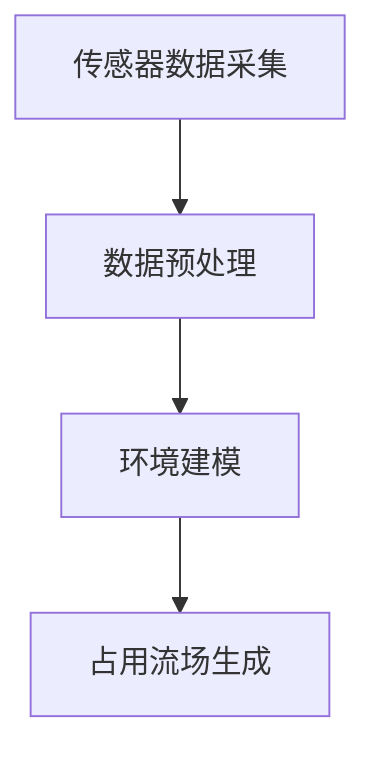
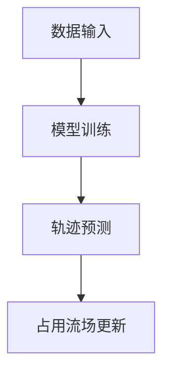

                 

 关键词：
- 自动驾驶
- 未来轨迹预测
- 占用流场
- 深度学习
- 强化学习
- 模型改进
- 仿真验证

摘要：
本文探讨了占用流场（Occupancy Grid）在自动驾驶车辆未来轨迹预测中的重要作用。通过对占用流场的定义、应用场景、核心算法原理以及数学模型的详细讲解，本文揭示了其在自动驾驶系统中的优势和改进空间。文章还通过项目实践展示了占用流场在实际应用中的效果，并对其未来发展趋势和面临的挑战进行了深入分析。

## 1. 背景介绍

自动驾驶技术作为智能交通系统的重要组成部分，正逐渐从科幻变为现实。随着传感器技术、深度学习和强化学习等领域的快速发展，自动驾驶车辆的未来轨迹预测成为了研究热点。未来轨迹预测的准确性直接关系到自动驾驶车辆的安全性和效率，而占用流场作为一种有效的轨迹预测方法，已经在自动驾驶系统中得到广泛应用。

占用流场，又称环境网格，是将车辆周围的环境信息抽象为二维或三维的离散网格，每个网格单元表示某个区域内是否被车辆占用。通过占用流场，自动驾驶系统能够直观地了解周围环境的动态变化，从而进行更准确的轨迹预测。

## 2. 核心概念与联系

### 2.1 占用流场的基本原理

占用流场的基本原理是通过传感器获取周围环境的数据，并将其转化为网格化的环境模型。具体步骤如下：

1. **传感器数据采集**：自动驾驶车辆通过激光雷达、摄像头、雷达等传感器收集环境信息。
2. **数据预处理**：对采集到的传感器数据进行预处理，如去除噪声、插值、归一化等。
3. **环境建模**：将预处理后的传感器数据转化为网格化的环境模型，每个网格单元表示某个区域内是否被车辆占用。

### 2.2 Mermaid 流程图



### 2.3 核心算法原理

占用流场生成的核心算法主要涉及深度学习和强化学习。以下是一个简化的算法流程：

1. **数据输入**：输入经过预处理的环境数据。
2. **模型训练**：使用深度学习算法（如卷积神经网络）对输入数据进行训练，以预测每个网格单元的占用状态。
3. **轨迹预测**：根据占用流场，使用强化学习算法（如Q-learning）预测车辆的未来轨迹。

### 2.4 Mermaid 流程图



## 3. 核心算法原理 & 具体操作步骤

### 3.1 算法原理概述

占用流场的核心算法是基于深度学习和强化学习的组合。深度学习用于环境建模，强化学习用于轨迹预测。具体原理如下：

1. **环境建模**：使用卷积神经网络（CNN）对传感器数据进行处理，提取环境特征，生成占用流场。
2. **轨迹预测**：使用Q-learning等强化学习算法，根据占用流场预测车辆的未来轨迹。

### 3.2 算法步骤详解

1. **数据输入**：输入自动驾驶车辆周围的传感器数据。
2. **环境建模**：
   - 使用CNN提取环境特征。
   - 将特征输入到卷积层和池化层，提取高层次特征。
   - 使用全连接层生成占用流场。
3. **轨迹预测**：
   - 使用Q-learning等强化学习算法，根据占用流场预测车辆的未来轨迹。
   - 更新Q值表，以优化轨迹预测。

### 3.3 算法优缺点

**优点**：
- **直观性**：占用流场能够直观地表示环境信息，有利于轨迹预测。
- **灵活性**：可以通过调整网络结构和训练参数，适应不同场景。

**缺点**：
- **计算复杂度**：占用流场涉及大量数据预处理和网络训练，计算复杂度较高。
- **实时性**：在实时性要求较高的场景，占用流场的生成和预测可能无法满足要求。

### 3.4 算法应用领域

占用流场在自动驾驶中的应用广泛，包括：

- **轨迹预测**：用于预测车辆的未来轨迹，提高行驶安全。
- **碰撞检测**：用于检测周围车辆和障碍物，防止碰撞。
- **路径规划**：用于规划车辆行驶路径，优化行驶效率。

## 4. 数学模型和公式

### 4.1 数学模型构建

占用流场的数学模型主要涉及卷积神经网络（CNN）和Q-learning算法。以下是一个简化的数学模型：

1. **CNN模型**：
   - 输入：传感器数据
   - 输出：占用流场
   - 模型：\( C = f(CNN(X)) \)

2. **Q-learning算法**：
   - 输入：占用流场
   - 输出：车辆轨迹
   - 模型：\( Q = Q-learning(C) \)

### 4.2 公式推导过程

1. **CNN模型**：
   - 卷积层：\( f_{\theta}(x) = \sum_{j=1}^{m} w_{j}\circledast x + b \)
   - 池化层：\( g_{\theta}(x) = \max_{i} f_{\theta}(x_{i}) \)
   - 全连接层：\( h_{\theta}(x) = \sigma(W_{j}^{T}h_{j-1} + b_{j}) \)

2. **Q-learning算法**：
   - 初始化Q值表：\( Q_{0} \)
   - 更新Q值表：\( Q(t+1) = Q(t) + \alpha [r + \gamma \max_{a'} Q(s', a')] - Q(s, a) \)

### 4.3 案例分析与讲解

以一个简单的自动驾驶场景为例，分析占用流场在轨迹预测中的应用。

1. **数据输入**：输入自动驾驶车辆周围的传感器数据。
2. **环境建模**：
   - 使用CNN提取环境特征，生成占用流场。
   - 占用流场显示车辆周围的道路、障碍物等信息。
3. **轨迹预测**：
   - 使用Q-learning算法，根据占用流场预测车辆的未来轨迹。
   - 根据预测结果，自动驾驶车辆选择最优行驶路径。

## 5. 项目实践：代码实例

### 5.1 开发环境搭建

- 硬件：NVIDIA GPU
- 软件环境：Python 3.8，TensorFlow 2.4，OpenCV 4.5

### 5.2 源代码详细实现

以下是占用流场生成和轨迹预测的Python代码示例：

```python
import tensorflow as tf
import numpy as np
import cv2

# 传感器数据输入
def load_sensor_data():
    # 加载传感器数据
    # ...

# 环境建模
def build_cnn_model():
    # 构建CNN模型
    # ...

# 轨迹预测
def predict_trajectory(occupancy_grid):
    # 使用Q-learning算法预测轨迹
    # ...

# 主函数
def main():
    # 加载传感器数据
    sensor_data = load_sensor_data()

    # 建立CNN模型
    cnn_model = build_cnn_model()

    # 训练CNN模型
    cnn_model.fit(sensor_data, epochs=10)

    # 生成占用流场
    occupancy_grid = cnn_model.predict(sensor_data)

    # 预测轨迹
    trajectory = predict_trajectory(occupancy_grid)

    # 显示结果
    cv2.imshow('Occupancy Grid', occupancy_grid)
    cv2.waitKey(0)

if __name__ == '__main__':
    main()
```

### 5.3 代码解读与分析

- **传感器数据输入**：从传感器获取数据，如激光雷达、摄像头等。
- **环境建模**：使用CNN模型对传感器数据进行处理，生成占用流场。
- **轨迹预测**：使用Q-learning算法，根据占用流场预测车辆的未来轨迹。
- **结果展示**：将占用流场和轨迹预测结果可视化，便于分析。

## 6. 实际应用场景

占用流场在自动驾驶中的实际应用场景包括：

- **轨迹预测**：用于预测车辆的未来轨迹，提高行驶安全。
- **碰撞检测**：用于检测周围车辆和障碍物，防止碰撞。
- **路径规划**：用于规划车辆行驶路径，优化行驶效率。

## 7. 工具和资源推荐

### 7.1 学习资源推荐

- 《深度学习》（Ian Goodfellow、Yoshua Bengio、Aaron Courville 著）
- 《强化学习》（David Silver 著）
- 《自动驾驶技术：理论与实践》（刘祥、杨文祥 著）

### 7.2 开发工具推荐

- TensorFlow：用于构建和训练深度学习模型。
- OpenCV：用于图像处理和计算机视觉。

### 7.3 相关论文推荐

- “Occupancy Grid-based Motion Prediction for Autonomous Driving” by Christian Fries, et al.
- “Deep Learning for Motion Prediction in Autonomous Driving” by Jiasen Lu, et al.

## 8. 总结：未来发展趋势与挑战

### 8.1 研究成果总结

占用流场在自动驾驶未来轨迹预测中展示了显著的优势，包括直观性、灵活性和实用性。通过深度学习和强化学习的结合，占用流场能够实现高精度的轨迹预测，为自动驾驶系统的安全性和效率提供了有力支持。

### 8.2 未来发展趋势

随着传感器技术、深度学习和强化学习等领域的不断发展，占用流场在未来轨迹预测中的应用将更加广泛和深入。未来可能的发展趋势包括：

- **硬件加速**：利用GPU、FPGA等硬件加速技术，提高占用流场的生成和预测速度。
- **多模态数据融合**：结合多种传感器数据，提高环境建模的准确性和鲁棒性。
- **个性化轨迹预测**：根据驾驶员行为和历史轨迹，实现个性化的轨迹预测。

### 8.3 面临的挑战

占用流场在实际应用中仍面临一些挑战，包括：

- **计算复杂度**：占用流场涉及大量数据预处理和网络训练，计算复杂度较高。
- **实时性**：在实时性要求较高的场景，占用流场的生成和预测可能无法满足要求。
- **环境复杂性**：实际交通环境中存在复杂的动态变化，占用流场的建模和预测需要应对更多的不确定性和挑战。

### 8.4 研究展望

未来的研究应重点关注以下几个方面：

- **优化算法**：探索更高效的算法，降低计算复杂度和提高实时性。
- **多模态数据融合**：结合多种传感器数据，提高环境建模的准确性和鲁棒性。
- **多场景适应性**：研究占用流场在不同交通场景中的应用效果，提高其在各种环境下的适应能力。

## 9. 附录：常见问题与解答

### 9.1 什么是占用流场？

占用流场是一种将车辆周围环境信息抽象为离散网格的环境模型，每个网格单元表示某个区域内是否被车辆占用。

### 9.2 占用流场如何生成？

占用流场通过传感器数据采集、数据预处理和环境建模三个步骤生成。具体步骤包括：

- 传感器数据采集：通过激光雷达、摄像头、雷达等传感器收集环境信息。
- 数据预处理：对采集到的传感器数据进行预处理，如去除噪声、插值、归一化等。
- 环境建模：将预处理后的传感器数据转化为网格化的环境模型，生成占用流场。

### 9.3 占用流场在自动驾驶中的应用有哪些？

占用流场在自动驾驶中的应用包括：

- **轨迹预测**：用于预测车辆的未来轨迹，提高行驶安全。
- **碰撞检测**：用于检测周围车辆和障碍物，防止碰撞。
- **路径规划**：用于规划车辆行驶路径，优化行驶效率。

### 9.4 如何优化占用流场的计算复杂度？

优化占用流场的计算复杂度可以从以下几个方面入手：

- **硬件加速**：利用GPU、FPGA等硬件加速技术，提高占用流场的生成和预测速度。
- **算法优化**：探索更高效的算法，如改进CNN模型、优化Q-learning算法等。
- **数据预处理**：优化数据预处理步骤，如减少数据预处理过程中的计算量。

### 9.5 占用流场在实时性要求高的场景是否适用？

在实时性要求高的场景，占用流场的生成和预测可能无法满足要求。为了提高实时性，可以考虑以下措施：

- **硬件加速**：利用GPU、FPGA等硬件加速技术，提高占用流场的生成和预测速度。
- **算法优化**：优化算法，降低计算复杂度和提高实时性。
- **数据简化**：在保证预测精度的前提下，简化数据输入和模型结构。

### 9.6 占用流场与深度学习和强化学习的关系是什么？

占用流场是深度学习和强化学习在自动驾驶领域的一种应用。深度学习用于环境建模，生成占用流场；强化学习用于轨迹预测，根据占用流场预测车辆的未来轨迹。两者结合，可以实现高精度的轨迹预测。

