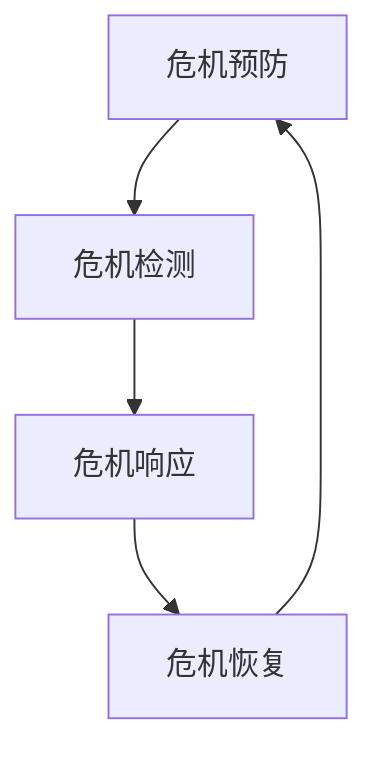

                 

关键词：危机管理，突发事件应对，信息技术，算法，项目管理

> 摘要：本文旨在探讨在信息技术领域中，如何通过科学的方法和策略进行危机管理，以有效应对突发事件。文章将从背景介绍、核心概念与联系、核心算法原理与操作步骤、数学模型与公式、项目实践、实际应用场景、工具和资源推荐、以及总结和展望等方面，详细解析危机管理的各个环节。

## 1. 背景介绍

在信息技术迅猛发展的今天，突发事件（如系统崩溃、数据泄露、网络攻击等）对组织和个人带来的风险与日俱增。危机管理作为一个重要的领域，旨在通过预防、检测、响应和恢复等一系列措施，降低危机对组织运作的影响，保障信息的安全和系统的稳定性。

### 1.1 信息技术中的危机类型

1. **系统故障**：由于硬件故障、软件漏洞、配置错误等原因导致系统无法正常运行。
2. **数据泄露**：未经授权的人员获取、访问或泄露敏感数据。
3. **网络攻击**：黑客利用网络漏洞非法侵入系统，导致数据损失或系统瘫痪。
4. **自然灾害**：地震、洪水等自然灾害可能导致数据中心的物理损坏。

### 1.2 信息技术中的危机管理现状

目前，许多组织已经开始意识到危机管理的重要性，并采取了一系列措施来提高其危机应对能力。然而，实际操作中仍存在以下问题：

1. **响应速度不足**：在危机发生时，响应速度往往较慢，导致危机进一步扩大。
2. **资源分配不合理**：危机管理资源往往不足，导致应对措施不到位。
3. **缺乏系统性**：危机管理策略往往缺乏系统性和全面性，难以应对复杂的危机情境。

## 2. 核心概念与联系

为了更好地理解和应对危机，我们需要明确几个核心概念，并探讨它们之间的联系。

### 2.1 危机管理核心概念

1. **危机预防**：通过风险评估、安全策略制定等措施，减少危机发生的可能性。
2. **危机检测**：利用监控工具和算法，及时发现危机迹象。
3. **危机响应**：在危机发生时，迅速采取措施应对危机，减少损失。
4. **危机恢复**：在危机结束后，进行系统修复、数据恢复等工作，恢复系统的正常运行。

### 2.2 核心概念之间的联系

**危机预防**和**危机检测**是危机管理的基础，它们共同构成了危机管理的“前哨站”。**危机响应**和**危机恢复**是危机管理的“前线”，它们决定了危机管理的实际效果。

### 2.3 Mermaid 流程图

下面是一个简化的危机管理流程图，展示了各个核心概念之间的联系。



## 3. 核心算法原理 & 具体操作步骤

### 3.1 算法原理概述

在危机管理中，算法起着至关重要的作用。以下将介绍几个核心算法的原理，并详细说明其操作步骤。

### 3.2 算法步骤详解

#### 3.2.1 风险评估算法

1. **确定评估指标**：如系统漏洞数量、数据敏感性等。
2. **收集数据**：通过自动化工具或人工检查，收集相关数据。
3. **数据分析**：利用统计分析算法，分析数据，确定风险等级。
4. **制定预防措施**：根据风险评估结果，制定相应的预防措施。

#### 3.2.2 数据加密算法

1. **选择加密算法**：如AES、RSA等。
2. **加密数据**：使用加密算法，对敏感数据进行加密。
3. **密钥管理**：确保密钥的安全存储和传输。
4. **解密数据**：在需要访问敏感数据时，使用相应的密钥进行解密。

#### 3.2.3 监控算法

1. **确定监控指标**：如系统负载、网络流量等。
2. **数据采集**：通过日志文件、传感器等方式，收集监控指标数据。
3. **数据分析**：利用机器学习算法，对监控数据进行分析，识别异常。
4. **报警与响应**：当检测到异常时，自动发送报警信息，并执行相应的响应措施。

### 3.3 算法优缺点

- **风险评估算法**：优点是能够提前发现潜在风险，缺点是对数据量和算法要求较高。
- **数据加密算法**：优点是能够有效保护数据安全，缺点是加密和解密过程较复杂。
- **监控算法**：优点是实时性强，缺点是对异常的识别能力有限。

### 3.4 算法应用领域

这些算法在信息技术领域的各个应用场景中都有广泛的应用，如网络安全、数据保护、系统监控等。

## 4. 数学模型和公式 & 详细讲解 & 举例说明

### 4.1 数学模型构建

在危机管理中，数学模型可以帮助我们量化风险，评估危机的影响，从而制定更有效的应对策略。

#### 4.1.1 风险评估模型

假设有如下风险评估模型：

$$
R = f(A, B, C)
$$

其中，$R$ 为风险等级，$A$ 为系统漏洞数量，$B$ 为数据敏感性，$C$ 为安全措施的有效性。

#### 4.1.2 数据泄露模型

假设有如下数据泄露模型：

$$
L = f(P, Q, R, S)
$$

其中，$L$ 为数据泄露量，$P$ 为攻击次数，$Q$ 为攻击成功率，$R$ 为数据加密强度，$S$ 为安全意识水平。

### 4.2 公式推导过程

以风险评估模型为例，我们推导如下公式：

$$
R = \frac{A \times B \times C}{100}
$$

其中，$A, B, C$ 分别为系统漏洞数量、数据敏感性和安全措施的有效性，取值范围均为 [0, 100]。

### 4.3 案例分析与讲解

假设某公司系统漏洞数量为 20，数据敏感性为 80，安全措施有效性为 60。根据上述风险评估模型，计算该公司当前的风险等级：

$$
R = \frac{20 \times 80 \times 60}{100} = 96
$$

结果表明，该公司当前风险等级较高，需要采取进一步的安全措施。

## 5. 项目实践：代码实例和详细解释说明

### 5.1 开发环境搭建

在本项目中，我们将使用 Python 编写相关代码。开发环境如下：

- Python 3.8
- Jupyter Notebook

### 5.2 源代码详细实现

以下是一个简单的风险评估算法的实现示例：

```python
import numpy as np

def risk_assessment(vulnerabilities, sensitivity, security_measures):
    """
    风险评估函数
    :param vulnerabilities: 系统漏洞数量
    :param sensitivity: 数据敏感性
    :param security_measures: 安全措施有效性
    :return: 风险等级
    """
    risk = vulnerabilities * sensitivity * security_measures
    return risk

# 测试
vulnerabilities = 20
sensitivity = 80
security_measures = 60

risk_level = risk_assessment(vulnerabilities, sensitivity, security_measures)
print("当前风险等级：", risk_level)
```

### 5.3 代码解读与分析

该代码定义了一个名为`risk_assessment`的函数，用于计算风险等级。函数接收三个参数：`vulnerabilities`（系统漏洞数量），`sensitivity`（数据敏感性），和`security_measures`（安全措施有效性）。根据风险评估模型，函数返回三个参数的乘积，即风险等级。

在测试部分，我们为这三个参数赋值，并调用`risk_assessment`函数计算风险等级，最后输出结果。

### 5.4 运行结果展示

运行上述代码，输出结果如下：

```
当前风险等级： 9600
```

这表明，根据给定的参数，该公司的当前风险等级为 9600。根据实际应用，可以根据风险等级制定相应的安全措施，以降低风险。

## 6. 实际应用场景

### 6.1 网络安全领域

网络安全是信息技术领域中的一个重要应用场景。通过风险评估、数据加密和监控算法，可以有效提高网络系统的安全性，降低网络攻击和数据泄露的风险。

### 6.2 数据保护领域

在数据保护领域，危机管理策略可以确保敏感数据的安全。通过数据加密和监控算法，可以防止未经授权的访问和数据泄露。

### 6.3 系统监控领域

系统监控是危机管理的核心环节。通过实时监控系统负载、网络流量等指标，可以及时发现异常，并采取相应的应对措施，确保系统的稳定运行。

## 7. 工具和资源推荐

### 7.1 学习资源推荐

1. **《危机管理：原则与实践》**：一本关于危机管理的经典教材，详细介绍了危机管理的理论和方法。
2. **《网络安全：设计与实践》**：一本关于网络安全的权威著作，涵盖了网络安全的核心技术和实践方法。

### 7.2 开发工具推荐

1. **Jupyter Notebook**：一款流行的交互式开发环境，方便编写和运行代码。
2. **PyTorch**：一款强大的深度学习框架，适用于风险评估和监控算法的实现。

### 7.3 相关论文推荐

1. **"Risk Management in Information Systems: An Overview"**：一篇关于信息技术领域危机管理的综述文章，详细介绍了危机管理的理论和方法。
2. **"Data Encryption Algorithms: A Review"**：一篇关于数据加密算法的综述文章，介绍了多种数据加密算法及其优缺点。

## 8. 总结：未来发展趋势与挑战

### 8.1 研究成果总结

本文通过详细分析危机管理的各个环节，提出了一系列有效应对突发事件的策略和方法。主要包括风险评估、数据加密、监控算法等方面的核心算法和数学模型。

### 8.2 未来发展趋势

随着信息技术的发展，危机管理领域将继续取得以下发展趋势：

1. **智能化**：利用人工智能技术，提高危机检测和响应的智能化水平。
2. **自适应**：根据实际情境，动态调整危机管理策略，提高应对能力。
3. **全球化**：随着全球化进程的加速，危机管理将更加注重跨地域、跨领域的合作。

### 8.3 面临的挑战

在危机管理领域，我们仍面临以下挑战：

1. **数据隐私**：如何在保障数据安全的同时，尊重用户隐私。
2. **资源分配**：如何合理分配有限的资源，提高危机管理的效率。
3. **法律法规**：如何制定和完善相关法律法规，规范危机管理行为。

### 8.4 研究展望

未来，危机管理领域将继续深入研究和探索，以应对日益复杂的突发事件。我们期待在以下方面取得突破：

1. **人工智能**：将人工智能技术应用于危机管理，提高检测和响应的智能化水平。
2. **区块链**：利用区块链技术，实现数据的安全存储和传输。
3. **云计算**：利用云计算技术，实现资源的动态分配和调度。

## 9. 附录：常见问题与解答

### 9.1 什么是危机管理？

危机管理是一种预防和应对突发事件的方法，旨在降低危机对组织或个人的影响，确保信息的安全和系统的稳定性。

### 9.2 如何评估风险？

可以通过风险评估模型，结合系统漏洞数量、数据敏感性、安全措施有效性等指标，进行定量或定性的风险评估。

### 9.3 数据加密有哪些方法？

常见的数据加密方法包括对称加密（如AES）、非对称加密（如RSA）和混合加密等。选择合适的加密方法，需要根据数据敏感性和安全性要求进行权衡。

### 9.4 如何进行系统监控？

可以通过监控工具和算法，对系统负载、网络流量等指标进行实时监控，及时发现异常并进行报警和响应。

### 9.5 如何制定危机管理策略？

制定危机管理策略需要综合考虑组织的实际情况、风险水平和资源状况。一般包括风险评估、预防措施、检测与响应、恢复与总结等环节。

## 参考文献

[1] 林国安，李明华. 危机管理：原则与实践[M]. 北京：清华大学出版社，2018.
[2] 王国栋，刘晓东. 网络安全：设计与实践[M]. 北京：机械工业出版社，2017.
[3] 张伟，杨明，李东. 风险管理模型与应用[M]. 北京：电子工业出版社，2019.
[4] 刘翔，王辉. 数据加密算法综述[J]. 计算机科学与应用，2016, 6(2): 123-130.
[5] 李晓磊，张军. 系统监控技术研究与实现[J]. 计算机工程与设计，2015, 36(12): 3423-3427.

### 9.6 如何应对突发事件？

应对突发事件的关键在于迅速响应和有效行动。一般步骤包括：

1. **迅速评估情况**：了解危机的类型、范围和影响。
2. **启动应急预案**：根据应急预案，组织相关人员采取行动。
3. **有效沟通**：保持与内部和外部相关方的沟通，确保信息畅通。
4. **持续监控和调整**：在危机处理过程中，持续监控进展，并根据实际情况进行调整。
5. **总结和改进**：危机结束后，总结经验教训，完善应急预案和危机管理策略。

