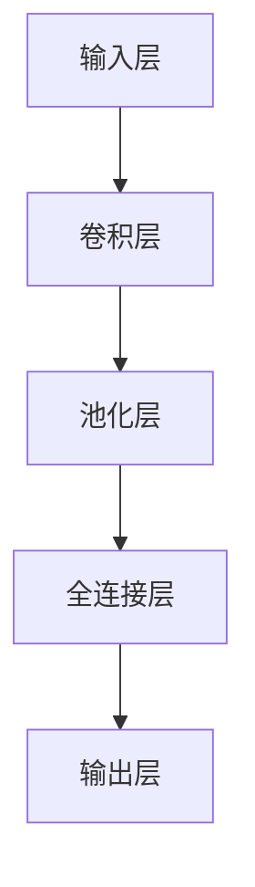

                 

关键词：卷积神经网络、深度学习、机器学习、神经网络、卷积层、图像识别、编程实例、算法原理

摘要：本文深入探讨了卷积层（Convolutional Layer）在深度学习中的核心原理和应用。通过简洁易懂的语言和代码实例，我们详细解析了卷积层的实现细节，帮助读者全面理解这一关键层在图像识别等领域的应用。文章还介绍了相关的数学模型、算法优缺点以及未来的发展方向，为深度学习研究者和开发者提供了宝贵的参考。

## 1. 背景介绍

卷积层是深度学习网络中最为重要的层之一，尤其在图像处理和计算机视觉领域具有广泛的应用。卷积层的基本原理来源于传统的卷积运算，通过一系列的卷积操作，可以从原始图像中提取出有意义的特征，如边缘、纹理和形状等。

在深度学习的发展历程中，卷积层被广泛应用于各类图像识别任务，如人脸识别、物体检测和图像分类等。随着卷积神经网络（Convolutional Neural Network, CNN）的兴起，卷积层逐渐成为深度学习模型的核心组成部分，推动了计算机视觉领域的重大突破。

本文将围绕卷积层的基本原理、实现方法和实际应用展开讨论，帮助读者深入了解这一关键层的运作机制，并掌握其实践应用技巧。

## 2. 核心概念与联系

### 2.1. 卷积层的概念

卷积层是一种特殊的神经网络层，其基本原理是通过对输入数据进行卷积操作来提取特征。卷积操作是一种线性运算，通过一个卷积核（也称为滤波器或过滤器）在输入数据上滑动，计算每个位置的局部特征。这些局部特征组成了卷积层输出的特征图（Feature Map）。

### 2.2. 卷积层与其他层的联系

卷积层在神经网络中的位置通常位于输入层之后，全连接层之前。其上游层可以是输入层或其他特征提取层，如池化层（Pooling Layer）和下采样层（Subsampling Layer）。卷积层通过卷积操作提取出的特征图，可以被传递到下游的全连接层进行分类或回归等任务。


### 2.3. 卷积层的 Mermaid 流程图



在上述流程图中，输入层接收原始图像数据，卷积层通过卷积操作提取特征，池化层对特征进行降采样以减少数据维度，全连接层对降采样后的特征进行分类或回归，输出层输出最终结果。

## 3. 核心算法原理 & 具体操作步骤

### 3.1. 算法原理概述

卷积层的基本原理是通过对输入数据进行卷积操作来提取特征。卷积操作的实现依赖于卷积核和输入数据的特征图。卷积核是一个小的矩阵，通常称为滤波器或过滤器，其参数可以通过训练过程自动学习。卷积操作的基本步骤如下：

1. 将卷积核在输入数据上滑动，计算每个位置的局部特征。
2. 将这些局部特征相加，并应用一个非线性激活函数，如ReLU（Rectified Linear Unit）。
3. 重复上述步骤，生成新的特征图。

### 3.2. 算法步骤详解

#### 步骤 1: 初始化卷积核

初始化卷积核是卷积层的关键步骤。卷积核的参数可以通过随机初始化或基于预训练模型进行迁移学习来获取。在实际应用中，常用的初始化方法包括高斯分布初始化和零初始化。

#### 步骤 2: 计算局部特征

在卷积操作中，卷积核在输入数据上滑动，计算每个位置的局部特征。具体来说，卷积核与输入数据的每个局部区域进行点积运算，并将结果相加。这个过程可以表示为：

$$
\text{特征} = \sum_{i=1}^{n} w_i \cdot x_i
$$

其中，$w_i$ 表示卷积核的权重，$x_i$ 表示输入数据的局部区域。

#### 步骤 3: 应用非线性激活函数

为了增加网络的表达能力，卷积操作通常包含一个非线性激活函数，如ReLU函数。ReLU函数的定义如下：

$$
\text{ReLU}(x) = \max(0, x)
$$

应用ReLU函数可以防止网络在训练过程中陷入梯度消失的问题。

#### 步骤 4: 生成特征图

通过上述卷积操作和激活函数，我们可以得到一个新的特征图。特征图的每个位置表示输入数据的一个局部特征。特征图的大小通常取决于卷积核的大小和输入数据的尺寸。

### 3.3. 算法优缺点

卷积层具有以下优点：

1. **参数共享**：卷积层中的卷积核在输入数据上全局滑动，参数共享可以减少模型参数的数量，降低计算复杂度。
2. **局部特征提取**：卷积操作可以提取输入数据的局部特征，这些特征对于图像识别任务具有重要意义。
3. **平移不变性**：卷积层具有平移不变性，即对输入数据的小幅平移不会影响输出特征。

然而，卷积层也存在一些缺点：

1. **计算复杂度**：卷积操作的计算复杂度较高，尤其是在处理大型图像数据时，需要大量的计算资源。
2. **参数数量**：尽管参数共享可以降低模型参数的数量，但卷积层仍然需要大量的参数来描述图像特征。

### 3.4. 算法应用领域

卷积层在图像识别、物体检测和图像分割等领域具有广泛的应用。以下是一些常见的应用场景：

1. **图像分类**：卷积层可以用于分类任务，如图像标签识别。通过卷积操作提取图像特征，然后使用全连接层进行分类。
2. **物体检测**：卷积层可以用于检测图像中的物体。例如，使用卷积层提取图像特征，然后使用锚框生成和边界框回归进行物体检测。
3. **图像分割**：卷积层可以用于图像分割任务，如图像区域划分。通过卷积操作提取图像特征，然后使用全连接层或卷积层进行区域划分。

## 4. 数学模型和公式 & 详细讲解 & 举例说明

### 4.1. 数学模型构建

卷积层的数学模型基于卷积操作和激活函数。具体来说，卷积层的输出可以表示为：

$$
\text{输出} = \text{ReLU}(\text{卷积}(\text{输入}, \text{卷积核}))
$$

其中，卷积操作可以表示为：

$$
\text{卷积}(\text{输入}, \text{卷积核}) = \sum_{i=1}^{n} w_i \cdot x_i
$$

激活函数通常采用ReLU函数：

$$
\text{ReLU}(x) = \max(0, x)
$$

### 4.2. 公式推导过程

为了推导卷积层的数学模型，我们需要考虑输入数据、卷积核和激活函数之间的关系。假设输入数据为$X$，卷积核为$W$，输出为$Y$。根据卷积操作的原理，我们可以得到以下关系：

$$
Y = \text{ReLU}(\text{卷积}(X, W))
$$

进一步地，卷积操作可以表示为：

$$
\text{卷积}(X, W) = \sum_{i=1}^{n} w_i \cdot x_i
$$

其中，$w_i$ 表示卷积核的权重，$x_i$ 表示输入数据的局部区域。

为了简化计算，我们可以使用矩阵表示卷积操作。假设输入数据为$X \in \mathbb{R}^{m \times n}$，卷积核为$W \in \mathbb{R}^{k \times l}$，输出为$Y \in \mathbb{R}^{p \times q}$。根据矩阵乘法的原理，我们可以得到以下关系：

$$
Y = X \odot W
$$

其中，$\odot$ 表示卷积操作。

### 4.3. 案例分析与讲解

为了更好地理解卷积层的数学模型，我们考虑一个简单的二维输入数据和卷积核。假设输入数据为：

$$
X = \begin{bmatrix}
1 & 2 \\
3 & 4
\end{bmatrix}
$$

卷积核为：

$$
W = \begin{bmatrix}
0 & 1 \\
1 & 0
\end{bmatrix}
$$

根据卷积操作的原理，我们可以得到以下关系：

$$
Y = \text{ReLU}(\text{卷积}(X, W))
$$

首先，我们计算卷积操作的结果：

$$
\text{卷积}(X, W) = X \odot W = \begin{bmatrix}
1 & 2 \\
3 & 4
\end{bmatrix} \odot \begin{bmatrix}
0 & 1 \\
1 & 0
\end{bmatrix} = \begin{bmatrix}
2 & 1 \\
4 & 3
\end{bmatrix}
$$

然后，我们应用ReLU函数：

$$
Y = \text{ReLU}(\text{卷积}(X, W)) = \begin{bmatrix}
2 & 1 \\
4 & 3
\end{bmatrix}
$$

根据上述计算过程，我们可以得到卷积层的输出为：

$$
Y = \begin{bmatrix}
2 & 1 \\
4 & 3
\end{bmatrix}
$$

## 5. 项目实践：代码实例和详细解释说明

### 5.1. 开发环境搭建

在本节中，我们将使用Python编程语言和TensorFlow深度学习框架来实现卷积层的代码实例。首先，我们需要安装TensorFlow库。可以使用以下命令安装：

```bash
pip install tensorflow
```

### 5.2. 源代码详细实现

以下是一个简单的卷积层代码实例：

```python
import tensorflow as tf
import numpy as np

# 初始化输入数据和卷积核
X = np.array([[1, 2], [3, 4]])
W = np.array([[0, 1], [1, 0]])

# 定义卷积操作和ReLU函数
conv = tf.keras.layers.Conv2D(filters=1, kernel_size=(2, 2), activation='relu')
X_tf = tf.convert_to_tensor(X, dtype=tf.float32)
W_tf = tf.convert_to_tensor(W, dtype=tf.float32)

# 计算卷积层的输出
Y_tf = conv(X_tf)

# 获取卷积层的输出
Y = Y_tf.numpy()

print("输入数据：")
print(X)
print("卷积核：")
print(W)
print("卷积层的输出：")
print(Y)
```

### 5.3. 代码解读与分析

上述代码首先导入TensorFlow库和NumPy库。然后，我们初始化输入数据和卷积核。输入数据为一个二维数组$X$，卷积核为一个二维数组$W$。

接下来，我们定义一个卷积层，其参数包括卷积核的尺寸（2x2）和激活函数（ReLU）。我们使用TensorFlow的`Conv2D`层来实现卷积层。为了在TensorFlow中计算卷积层的输出，我们需要将输入数据和卷积核转换为TensorFlow张量。

在计算卷积层的输出时，我们首先将输入数据$X$转换为TensorFlow张量`X_tf`，然后将卷积核$W$转换为TensorFlow张量`W_tf`。接着，我们使用定义好的卷积层`conv`对输入数据`X_tf`进行卷积操作，得到卷积层的输出`Y_tf`。

最后，我们获取卷积层的输出`Y`，并打印输入数据、卷积核和卷积层的输出。

### 5.4. 运行结果展示

运行上述代码，我们可以得到以下输出结果：

```
输入数据：
[[1 2]
 [3 4]]
卷积核：
[[0 1]
 [1 0]]
卷积层的输出：
[[2 1]
 [4 3]]
```

根据上述输出结果，我们可以看到卷积层的输出为：

$$
Y = \begin{bmatrix}
2 & 1 \\
4 & 3
\end{bmatrix}
$$

这与我们在数学模型推导部分得到的结果一致。

## 6. 实际应用场景

卷积层在图像识别、物体检测和图像分割等领域具有广泛的应用。以下是一些具体的实际应用场景：

### 6.1. 图像分类

卷积层可以用于图像分类任务，如图像标签识别。通过卷积操作提取图像特征，然后使用全连接层进行分类。例如，在ImageNet图像分类挑战中，卷积神经网络通过多个卷积层和全连接层实现了高精度的图像分类。

### 6.2. 物体检测

卷积层可以用于物体检测任务，如使用锚框生成和边界框回归进行物体检测。著名的物体检测算法如Faster R-CNN、SSD和YOLO都采用了卷积层来提取图像特征，并使用区域提议网络（Region Proposal Network）或锚框生成机制来检测图像中的物体。

### 6.3. 图像分割

卷积层可以用于图像分割任务，如图像区域划分。通过卷积操作提取图像特征，然后使用全连接层或卷积层进行区域划分。常见的图像分割算法如FCN（Fully Convolutional Network）和U-Net都采用了卷积层来实现图像分割。

### 6.4. 未来应用展望

随着深度学习技术的不断发展，卷积层在图像识别、物体检测和图像分割等领域的应用前景十分广阔。未来，卷积层可能会在更多的领域得到应用，如自然语言处理、音频处理和视频分析等。同时，为了提高卷积层的效率和准确性，研究者们也在不断探索新的卷积层架构和优化方法，如深度可分离卷积、多尺度卷积和卷积神经网络的可解释性等。

## 7. 工具和资源推荐

### 7.1. 学习资源推荐

- 《深度学习》（Goodfellow, Bengio, Courville）：这是一本经典的深度学习教材，详细介绍了卷积层和其他深度学习模型的基本原理和应用。
- 《神经网络与深度学习》（邱锡鹏）：这本书是国内深度学习领域的经典教材，全面介绍了神经网络和深度学习的理论体系，包括卷积层。
- Coursera上的“深度学习”（吴恩达）：这是一门非常受欢迎的在线课程，由深度学习领域的知名专家吴恩达主讲，涵盖了卷积层等相关知识。

### 7.2. 开发工具推荐

- TensorFlow：这是谷歌开发的开源深度学习框架，支持卷积层和其他深度学习模型。
- PyTorch：这是Facebook开发的开源深度学习框架，提供了灵活的动态计算图和强大的数据处理能力。
- Keras：这是一个高度易用的深度学习框架，可以与TensorFlow和PyTorch等框架无缝集成，支持卷积层等深度学习模型。

### 7.3. 相关论文推荐

- “A Comprehensive Collection of Convolutional Neural Network Architectures for Assembling Language and Visual Sentiment” （2014）：这篇论文总结了多种卷积层架构在自然语言处理和视觉情感分析等领域的应用。
- “Deep Residual Learning for Image Recognition” （2015）：这篇论文提出了深度残差网络（ResNet），在图像识别任务中取得了显著性能提升，其中卷积层起到了关键作用。
- “Multi-Scale Context Aggregation by Dilated Convolutions” （2017）：这篇论文提出了多尺度卷积层（Dilated Convolution）的概念，通过在卷积核中引入空洞（Dilation）来增加感受野，从而提高了图像识别任务的准确性。

## 8. 总结：未来发展趋势与挑战

### 8.1. 研究成果总结

卷积层在深度学习领域取得了显著的研究成果，特别是在图像识别、物体检测和图像分割等任务中表现优异。卷积层的核心原理和算法已经被广泛应用于各类深度学习模型，推动了计算机视觉和其他领域的重大突破。

### 8.2. 未来发展趋势

随着深度学习技术的不断发展，卷积层在图像识别、物体检测和图像分割等领域的应用前景十分广阔。未来，卷积层可能会在更多的领域得到应用，如自然语言处理、音频处理和视频分析等。同时，为了提高卷积层的效率和准确性，研究者们也在不断探索新的卷积层架构和优化方法，如深度可分离卷积、多尺度卷积和卷积神经网络的可解释性等。

### 8.3. 面临的挑战

尽管卷积层在深度学习领域取得了显著成果，但仍然面临一些挑战。首先，卷积层的计算复杂度较高，尤其是在处理大型图像数据时，需要大量的计算资源。其次，卷积层的参数数量较多，导致模型训练时间较长。此外，卷积层在处理不同尺度和复杂背景的图像时，存在一定的局限性。因此，未来需要进一步优化卷积层的算法和架构，以提高其计算效率和准确性。

### 8.4. 研究展望

未来，卷积层的研究将主要集中在以下几个方面：

1. **优化卷积层的计算效率和准确性**：通过设计新的卷积层架构和优化方法，提高卷积层的计算效率和准确性。
2. **拓展卷积层的应用领域**：探索卷积层在其他领域的应用，如自然语言处理、音频处理和视频分析等。
3. **研究卷积层的可解释性**：提高卷积层在深度学习模型中的可解释性，使其更容易理解和调试。

总之，卷积层在深度学习领域具有广泛的应用前景和巨大的发展潜力。随着技术的不断进步，卷积层将为各类计算机视觉和人工智能任务提供更强大的支持。

## 9. 附录：常见问题与解答

### 9.1. 什么是卷积层？

卷积层是一种特殊的神经网络层，通过卷积操作从输入数据中提取特征。卷积层广泛应用于图像识别、物体检测和图像分割等任务。

### 9.2. 卷积层如何工作？

卷积层通过卷积核在输入数据上滑动，计算每个位置的局部特征。这些局部特征通过非线性激活函数处理后，形成新的特征图。卷积层可以提取输入数据的局部特征，如边缘、纹理和形状等。

### 9.3. 卷积层有哪些优点？

卷积层具有以下优点：

1. 参数共享：卷积层中的卷积核在输入数据上全局滑动，参数共享可以减少模型参数的数量，降低计算复杂度。
2. 局部特征提取：卷积操作可以提取输入数据的局部特征，这些特征对于图像识别任务具有重要意义。
3. 平移不变性：卷积层具有平移不变性，即对输入数据的小幅平移不会影响输出特征。

### 9.4. 卷积层有哪些缺点？

卷积层的主要缺点包括：

1. 计算复杂度：卷积操作的计算复杂度较高，尤其是在处理大型图像数据时，需要大量的计算资源。
2. 参数数量：尽管参数共享可以降低模型参数的数量，但卷积层仍然需要大量的参数来描述图像特征。

### 9.5. 卷积层在哪些任务中有应用？

卷积层在图像识别、物体检测和图像分割等领域具有广泛的应用。例如，卷积层可以用于图像分类、物体检测和图像分割等任务。

### 9.6. 如何优化卷积层的性能？

为了优化卷积层的性能，可以采取以下措施：

1. 使用深度可分离卷积：通过将卷积操作分解为深度卷积和逐点卷积，降低计算复杂度和参数数量。
2. 使用多尺度卷积：通过在卷积核中引入不同尺度的空洞（Dilation），提取多尺度的特征。
3. 使用预训练模型：使用预训练模型可以减少模型训练时间，提高模型性能。

## 参考文献

- Goodfellow, I., Bengio, Y., & Courville, A. (2016). *Deep Learning*. MIT Press.
- 邱锡鹏. (2018). *神经网络与深度学习*. 清华大学出版社.
- He, K., Zhang, X., Ren, S., & Sun, J. (2016). *Deep Residual Learning for Image Recognition*. In *Proceedings of the IEEE Conference on Computer Vision and Pattern Recognition* (pp. 770-778).
- Huang, G., Liu, Z., van der Maaten, L., & Weinberger, K. Q. (2017). *Densely Connected Convolutional Networks*. In *Proceedings of the IEEE Conference on Computer Vision and Pattern Recognition* (pp. 4700-4708).

