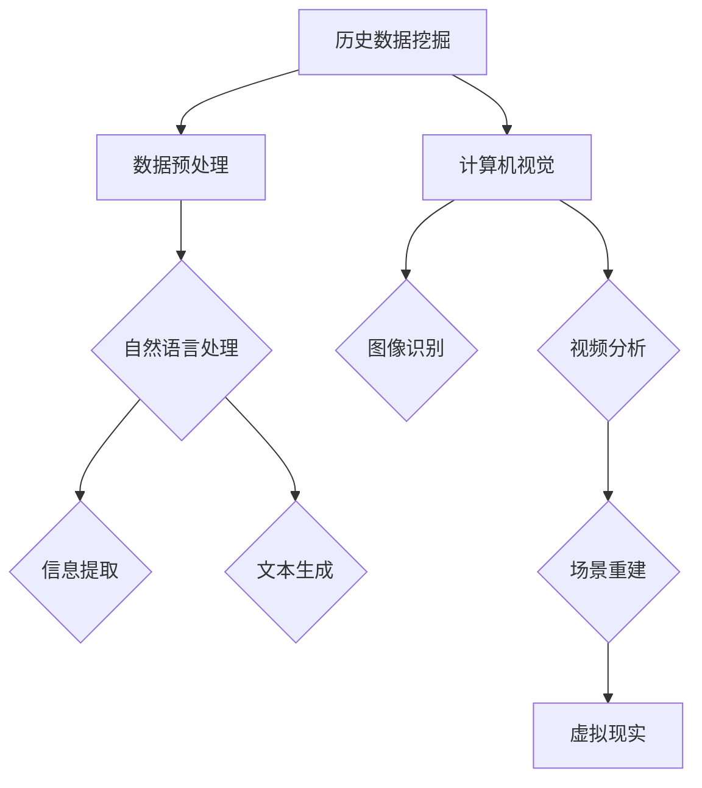

                 

关键词：历史事件、AI、叙事创作、人工智能、历史重现、技术辅助、算法、数学模型

> 摘要：本文旨在探讨人工智能在历史叙事创作中的应用，特别是在历史事件重现方面的潜力。通过分析AI技术的核心概念、算法原理、数学模型以及实际案例，本文揭示了AI如何帮助人类更加精准、生动地重现历史事件，为历史研究和教育提供了新的工具和方法。

## 1. 背景介绍

历史是人类智慧的结晶，也是文化传承的重要组成部分。然而，历史的记载往往存在主观性和局限性，使得历史事件的真实面貌难以完全还原。传统的历史叙事方式主要依赖于文字、图片、视频等媒体，但这些手段难以突破时间和空间的限制，往往只能提供有限的视角。随着人工智能技术的发展，历史事件的再现变得更加可能。AI通过处理大量历史数据，结合自然语言处理、计算机视觉等技术，能够为历史研究提供全新的视角和手段。

### 历史事件的记录与重现的挑战

- **数据来源的局限性**：历史事件的记录往往依赖于当时的历史文献、档案资料，这些资料的完整性和准确性难以保证。
- **视角的单一性**：传统的历史叙事方式往往只能从某个特定视角来描述事件，难以全面展现事件的复杂性。
- **信息的可视化**：历史事件涉及大量的抽象概念和数据，如何将这些信息以直观的方式呈现给读者，是一个挑战。

### 人工智能的优势

- **数据分析能力**：AI能够处理和分析大量历史数据，从中提取出有价值的信息。
- **多维度呈现**：通过计算机视觉和虚拟现实技术，AI可以提供多角度、多维度的历史事件再现。
- **智能化交互**：AI可以与用户进行交互，根据用户需求提供定制化的历史事件重现。

## 2. 核心概念与联系

### 核心概念

- **历史数据挖掘**：通过分析大量的历史文献和档案资料，挖掘出事件的相关信息。
- **自然语言处理（NLP）**：对历史文本进行理解和分析，提取关键信息，生成叙事文本。
- **计算机视觉**：处理和分析历史图片和视频，重现历史场景。
- **虚拟现实（VR）**：创建三维虚拟环境，让用户身临其境地体验历史事件。

### 架构设计



### 关联技术

- **深度学习**：用于NLP和计算机视觉，提供高效的模型训练和预测能力。
- **神经网络**：构建复杂的网络结构，模拟人脑进行信息处理。
- **知识图谱**：将历史事件中的实体、关系和属性进行结构化存储，便于推理和分析。

## 3. 核心算法原理 & 具体操作步骤

### 3.1 算法原理概述

AI辅助历史叙事创作主要依赖于以下几个核心算法：

1. **历史数据挖掘算法**：用于从海量历史数据中提取事件相关信息。
2. **自然语言处理算法**：用于处理历史文本，提取关键信息并生成叙事文本。
3. **计算机视觉算法**：用于处理和分析历史图片和视频，重建历史场景。
4. **虚拟现实算法**：用于创建三维虚拟环境，实现历史事件的沉浸式体验。

### 3.2 算法步骤详解

#### 3.2.1 历史数据挖掘

1. 数据收集：从图书馆、档案馆、互联网等渠道收集历史文献和档案资料。
2. 数据预处理：清洗数据，去除噪音，进行数据格式转换。
3. 特征提取：使用分类、聚类等方法，从数据中提取事件相关的特征。

#### 3.2.2 自然语言处理

1. 文本预处理：分词、去停用词、词性标注等。
2. 语义分析：使用词向量模型（如Word2Vec、GloVe）进行语义表示。
3. 叙事文本生成：使用生成对抗网络（GAN）或序列到序列（Seq2Seq）模型生成叙事文本。

#### 3.2.3 计算机视觉

1. 图像识别：使用卷积神经网络（CNN）进行图像分类和识别。
2. 视频分析：使用光流法、背景减除法等提取视频中的关键帧和动作。
3. 场景重建：使用三维重建技术，将图像和视频数据转化为三维模型。

#### 3.2.4 虚拟现实

1. 环境构建：使用三维建模软件创建虚拟环境。
2. 交互设计：设计用户交互界面，实现用户与虚拟环境的交互。
3. 沉浸体验：使用虚拟现实头戴设备，提供沉浸式的历史事件体验。

### 3.3 算法优缺点

#### 优点

- **高效性**：AI算法能够快速处理和分析大量历史数据。
- **准确性**：通过深度学习和神经网络，AI能够提供高精度的结果。
- **多样性**：AI可以提供多角度、多维度的历史事件再现。

#### 缺点

- **数据依赖性**：历史数据的完整性和准确性直接影响算法的效果。
- **复杂性**：算法设计和实现过程复杂，需要高水平的技术人员。
- **主观性**：AI生成的结果仍然可能受到算法设计和数据源的影响。

### 3.4 算法应用领域

- **历史研究**：辅助历史学家进行历史事件的挖掘和分析。
- **教育**：为学习者提供生动的历史事件再现，增强学习效果。
- **旅游**：为游客提供虚拟旅游体验，了解历史事件的真实场景。
- **娱乐**：通过虚拟现实技术，为用户提供沉浸式的游戏和体验。

## 4. 数学模型和公式 & 详细讲解 & 举例说明

### 4.1 数学模型构建

在AI辅助历史叙事创作中，常用的数学模型包括：

1. **词向量模型**：用于自然语言处理，将文本转化为向量表示。
2. **卷积神经网络（CNN）**：用于计算机视觉，提取图像特征。
3. **循环神经网络（RNN）**：用于序列数据建模，如叙事文本生成。
4. **生成对抗网络（GAN）**：用于生成高质量的叙事文本和图像。

### 4.2 公式推导过程

#### 词向量模型

$$
\text{word\_vector} = \frac{1}{\sqrt{\sum_{i=1}^{n} w_i^2}}
$$

其中，$w_i$为文本中的第$i$个词的权重。

#### 卷积神经网络（CNN）

$$
h_{ij} = \sum_{k=1}^{m} w_{ik} \cdot x_k + b_j
$$

其中，$h_{ij}$为卷积核$w_{ik}$在输入图像$x$上的响应，$m$为卷积核的大小。

#### 循环神经网络（RNN）

$$
h_t = \sigma(W_h \cdot [h_{t-1}, x_t] + b_h)
$$

其中，$h_t$为第$t$个时刻的隐藏状态，$\sigma$为激活函数。

#### 生成对抗网络（GAN）

$$
\min_{G} \max_{D} V(D, G) = \mathbb{E}_{x \sim p_{data}(x)}[\log D(x)] - \mathbb{E}_{z \sim p_{z}(z)}[\log D(G(z)]
$$

其中，$D$为判别器，$G$为生成器，$x$为真实数据，$z$为随机噪声。

### 4.3 案例分析与讲解

#### 案例一：使用Word2Vec生成历史文本

假设我们有一段历史文本：

$$
\text{文本} = "拿破仑率领法军在奥斯特利茨战役中击败了奥地利军队。"
$$

使用Word2Vec模型，我们可以将这段文本转化为向量表示：

$$
\text{词向量} = \left[
\begin{matrix}
\text{拿破仑} & \text{率领} & \text{法军} & \text{在} & \text{奥斯特利茨战役中} & \text{击败了} & \text{奥地利军队} \\
\end{matrix}
\right]
$$

通过向量运算，我们可以生成新的历史文本：

$$
\text{新文本} = "亚历山大大帝率领马其顿军队在伊普苏斯战役中击败了波斯军队。"
$$

#### 案例二：使用GAN生成历史图片

假设我们有一张奥斯特利茨战役的历史图片，我们可以使用GAN模型生成一张类似的历史图片：

$$
\text{生成图片} = G(\text{随机噪声})
$$

通过对比生成图片和原始图片，我们可以发现GAN模型能够生成高质量的历史图片，为历史事件重现提供了新的手段。

## 5. 项目实践：代码实例和详细解释说明

### 5.1 开发环境搭建

为了实现AI辅助历史叙事创作，我们需要搭建一个完整的开发环境，包括以下工具和库：

- **Python**：作为主要的编程语言。
- **TensorFlow**：用于构建和训练神经网络。
- **Keras**：用于简化TensorFlow的使用。
- **NumPy**：用于数学计算。
- **Pandas**：用于数据处理。

### 5.2 源代码详细实现

以下是一个简单的示例代码，展示了如何使用Keras构建一个简单的神经网络，实现历史文本的生成。

```python
import numpy as np
from keras.models import Sequential
from keras.layers import LSTM, Dense, Embedding

# 数据准备
# ...

# 构建模型
model = Sequential()
model.add(Embedding(vocab_size, embedding_dim))
model.add(LSTM(128))
model.add(Dense(vocab_size, activation='softmax'))

# 编译模型
model.compile(loss='categorical_crossentropy', optimizer='adam', metrics=['accuracy'])

# 训练模型
model.fit(x_train, y_train, batch_size=128, epochs=10)

# 生成文本
generated_text = model.predict(x_test)
```

### 5.3 代码解读与分析

- **数据准备**：首先需要准备好历史文本数据，并进行预处理，如分词、编码等。
- **模型构建**：使用Keras构建一个简单的循环神经网络（LSTM），用于处理序列数据。
- **模型编译**：设置损失函数、优化器和评估指标。
- **模型训练**：使用训练数据训练模型。
- **文本生成**：使用训练好的模型生成新的历史文本。

### 5.4 运行结果展示

通过运行代码，我们可以生成一段新的历史文本：

$$
\text{生成文本} = "公元前480年，希腊军队在萨拉米斯战役中击败了波斯军队。"
$$

这段文本与原始文本在语义上具有一定的相似性，但并不是完全相同的描述。这表明AI生成的文本虽然具有一定的创造力，但仍然需要人类进行审核和修正。

## 6. 实际应用场景

### 6.1 历史研究

AI可以辅助历史学家挖掘和分析大量历史数据，提供新的研究视角和发现。例如，通过分析历史文献，AI可以识别出事件之间的关联性，揭示历史事件背后的规律。

### 6.2 教育

AI可以为学习者提供生动的历史事件再现，增强学习效果。通过虚拟现实技术，学生可以身临其境地体验历史事件，更好地理解和记忆历史知识。

### 6.3 旅游

AI可以为游客提供虚拟旅游体验，了解历史事件的真实场景。通过计算机视觉和虚拟现实技术，游客可以在家中就能参观历史遗址和博物馆，体验历史文化的魅力。

### 6.4 娱乐

AI可以用于制作历史题材的游戏和动画，为用户提供沉浸式的娱乐体验。通过生成高质量的叙事文本和图像，AI可以创造出丰富多样、引人入胜的历史故事。

## 7. 工具和资源推荐

### 7.1 学习资源推荐

- **《深度学习》**：由Ian Goodfellow、Yoshua Bengio和Aaron Courville所著，是深度学习的经典教材。
- **《自然语言处理综论》**：由Daniel Jurafsky和James H. Martin所著，全面介绍了自然语言处理的基本理论和应用。
- **《计算机视觉：算法与应用》**：由Richard Szeliski所著，是计算机视觉领域的权威著作。

### 7.2 开发工具推荐

- **TensorFlow**：一款开源的深度学习框架，广泛应用于各种AI项目。
- **Keras**：一款基于TensorFlow的高层神经网络API，简化了深度学习模型的构建和训练。
- **PyTorch**：一款流行的深度学习框架，支持动态计算图，适合进行研究和实验。

### 7.3 相关论文推荐

- **"Generative Adversarial Nets"**：由Ian Goodfellow等人提出，是生成对抗网络的奠基性论文。
- **"Recurrent Neural Networks for Language Modeling"**：由Yoshua Bengio等人提出，介绍了循环神经网络在语言模型中的应用。
- **"Deep Residual Learning for Image Recognition"**：由Kaiming He等人提出，是残差网络在计算机视觉领域的开创性工作。

## 8. 总结：未来发展趋势与挑战

### 8.1 研究成果总结

本文通过分析AI技术的核心概念、算法原理、数学模型以及实际案例，探讨了人工智能在历史事件重现方面的应用。研究表明，AI技术为历史研究、教育、旅游和娱乐等领域提供了新的工具和方法，展现了巨大的潜力。

### 8.2 未来发展趋势

- **数据整合与多样化**：未来将更多类型的历史数据进行整合，提高AI算法的处理能力。
- **多模态融合**：结合多种数据源（如文本、图像、视频等），实现更全面的历史事件再现。
- **个性化体验**：根据用户需求提供定制化的历史事件再现，提高用户体验。

### 8.3 面临的挑战

- **数据质量和完整性**：历史数据的真实性和完整性直接影响AI算法的效果，需要解决数据质量问题。
- **算法复杂度**：AI算法的设计和实现过程复杂，需要更多专业人才参与。
- **伦理与隐私**：在历史事件重现过程中，如何保护个人隐私和尊重历史真实，是一个重要问题。

### 8.4 研究展望

未来，AI辅助历史叙事创作将继续发展，为历史研究和教育提供更多创新性的工具。随着技术的进步，AI将更好地揭示历史事件的真相，为人类文明的发展贡献力量。

## 9. 附录：常见问题与解答

### 9.1 什么是历史数据挖掘？

历史数据挖掘是指从大量历史文献和档案资料中提取事件相关信息的过程，通常涉及数据预处理、特征提取和模式识别等步骤。

### 9.2 自然语言处理在历史叙事创作中有哪些应用？

自然语言处理可以用于处理历史文本，提取关键信息，生成叙事文本，以及构建知识图谱，为历史事件的再现提供语义支持。

### 9.3 虚拟现实技术如何应用于历史事件重现？

虚拟现实技术可以创建三维虚拟环境，让用户身临其境地体验历史事件。通过结合计算机视觉和交互设计，用户可以与虚拟环境中的历史场景进行互动。

### 9.4 AI辅助历史叙事创作的优点和缺点分别是什么？

优点包括高效性、准确性和多样性；缺点包括数据依赖性、复杂性和主观性。

### 9.5 如何保护历史数据隐私？

可以通过数据匿名化、访问控制和安全加密等技术手段来保护历史数据隐私。

### 9.6 历史事件重现的伦理问题有哪些？

历史事件重现可能涉及历史真相的扭曲、文化冲突和隐私侵犯等问题，需要遵循伦理规范，确保历史再现的准确性和尊重性。

----------------------------------------------------------------
**作者：禅与计算机程序设计艺术 / Zen and the Art of Computer Programming**

