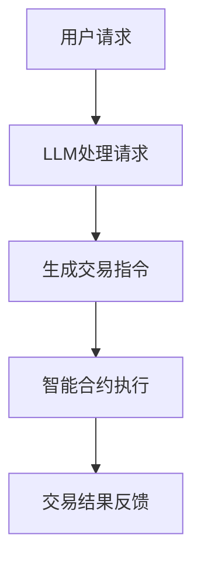

                 

关键词：去中心化金融、LLM、区块链、智能合约、分布式账本、加密货币、数字资产、金融科技、人工智能

> 摘要：本文探讨了去中心化金融（DeFi）中大型语言模型（LLM）的应用。通过详细分析LLM在去中心化金融系统中的作用和优势，本文揭示了如何利用LLM提高去中心化金融的交易效率、安全性以及用户体验。同时，本文还探讨了去中心化金融的未来发展趋势和面临的挑战，为行业的发展提供有益的参考。

## 1. 背景介绍

去中心化金融（DeFi）是指基于区块链技术的金融应用，它通过智能合约实现去中心化的金融服务，包括借贷、交易、支付、保险等。与传统的中心化金融体系相比，去中心化金融具有更高的透明度、更低的成本和更高的安全性。

近年来，随着区块链技术和加密货币的快速发展，去中心化金融领域取得了显著进展。大量去中心化金融应用（DApps）不断涌现，吸引了众多投资者和用户。然而，去中心化金融仍面临着一些挑战，如交易效率低下、安全性不足、用户体验不佳等。

大型语言模型（LLM）是一种基于深度学习技术的自然语言处理模型，具有强大的文本生成和语义理解能力。近年来，LLM在各个领域取得了显著的成果，包括自然语言生成、机器翻译、文本分类等。将LLM应用于去中心化金融领域，有望解决当前存在的诸多问题。

本文旨在探讨去中心化金融中LLM的应用，分析LLM在提高交易效率、安全性、用户体验等方面的作用，并展望去中心化金融的未来发展趋势和面临的挑战。

## 2. 核心概念与联系

### 2.1 去中心化金融（DeFi）

去中心化金融（DeFi）是基于区块链技术的金融体系，通过智能合约实现金融服务。与传统金融体系相比，DeFi具有以下特点：

- **去中心化**：去中心化金融没有中央机构，所有交易和合约都在分布式账本上进行，提高了透明度和抗审查性。
- **智能合约**：智能合约是一种自动执行、管理和执行合约条款的计算机程序。在DeFi中，智能合约用于管理资金流动和执行交易。
- **加密货币**：加密货币是去中心化金融体系中的价值传递工具，如比特币、以太坊等。
- **分布式账本**：分布式账本记录了所有交易和合约执行情况，确保了数据的透明和不可篡改。

### 2.2 大型语言模型（LLM）

大型语言模型（LLM）是一种基于深度学习技术的自然语言处理模型，具有强大的文本生成和语义理解能力。LLM的主要特点如下：

- **大规模训练**：LLM通过在大规模数据集上进行训练，学习到了丰富的语言知识和模式。
- **文本生成**：LLM能够根据输入的文本生成连贯、自然的文本，包括文章、对话、摘要等。
- **语义理解**：LLM能够理解文本的语义，包括词义、句意、上下文等。

### 2.3 DeFi与LLM的联系

去中心化金融与大型语言模型之间存在紧密的联系。LLM可以为去中心化金融提供以下支持：

- **智能合约优化**：LLM可以帮助编写更高效、更安全的智能合约，减少潜在的安全漏洞。
- **交易自动化**：LLM可以自动处理交易，提高交易效率和用户体验。
- **数据分析**：LLM可以对交易数据进行分析，提供市场预测和风险控制。
- **用户交互**：LLM可以与用户进行自然语言交互，提供更人性化的服务。

### 2.4 Mermaid 流程图

下面是一个简单的Mermaid流程图，展示了去中心化金融中LLM的应用场景。



## 3. 核心算法原理 & 具体操作步骤

### 3.1 算法原理概述

在去中心化金融中，LLM的应用主要包括以下几个方面：

1. **智能合约编写**：LLM可以帮助开发人员编写更高效、更安全的智能合约。
2. **交易自动化**：LLM可以自动处理交易，减少人工干预，提高交易效率。
3. **数据分析**：LLM可以对交易数据进行分析，提供市场预测和风险控制。
4. **用户交互**：LLM可以与用户进行自然语言交互，提供更人性化的服务。

### 3.2 算法步骤详解

1. **用户请求处理**：用户发起交易请求，LLM接收并处理该请求。
2. **交易指令生成**：LLM根据用户请求生成交易指令，确保交易指令符合去中心化金融系统的规则和逻辑。
3. **智能合约执行**：智能合约根据交易指令执行交易，确保交易的安全性和准确性。
4. **交易结果反馈**：交易完成后，LLM向用户反馈交易结果，包括交易状态、交易费用等。

### 3.3 算法优缺点

**优点**：

- **提高交易效率**：LLM可以自动处理交易，减少人工干预，提高交易效率。
- **降低成本**：去中心化金融系统采用LLM，可以降低交易成本，提高利润。
- **增强安全性**：LLM可以帮助编写更高效、更安全的智能合约，减少潜在的安全漏洞。
- **提升用户体验**：LLM可以与用户进行自然语言交互，提供更人性化的服务。

**缺点**：

- **对计算资源要求较高**：LLM的训练和运行需要大量计算资源，可能导致系统延迟和成本增加。
- **安全性问题**：尽管LLM可以提高智能合约的安全性，但仍然存在一些潜在的安全风险。

### 3.4 算法应用领域

LLM在去中心化金融领域的应用主要包括以下方面：

- **智能合约开发**：LLM可以帮助开发人员快速编写高效的智能合约。
- **交易自动化**：LLM可以自动处理交易，提高交易效率。
- **数据分析**：LLM可以对交易数据进行分析，提供市场预测和风险控制。
- **用户交互**：LLM可以与用户进行自然语言交互，提供更人性化的服务。

## 4. 数学模型和公式 & 详细讲解 & 举例说明

### 4.1 数学模型构建

在去中心化金融中，LLM的应用涉及到多个数学模型，主要包括：

1. **交易模型**：描述交易过程中的资金流动和智能合约的执行。
2. **风险模型**：评估交易风险，包括市场风险、信用风险等。
3. **用户模型**：描述用户行为和需求，用于优化用户体验。

### 4.2 公式推导过程

1. **交易模型**：

   - **交易金额**：$T = P \times Q$

     其中，$T$ 为交易金额，$P$ 为价格，$Q$ 为数量。
   - **交易费用**：$F = C \times T$

     其中，$F$ 为交易费用，$C$ 为交易费率，$T$ 为交易金额。

2. **风险模型**：

   - **市场风险**：$R_m = \frac{\partial P}{\partial t}$

     其中，$R_m$ 为市场风险，$\partial P$ 为价格变化率，$t$ 为时间。
   - **信用风险**：$R_c = \frac{\partial P}{\partial r}$

     其中，$R_c$ 为信用风险，$\partial P$ 为价格变化率，$r$ 为利率。

3. **用户模型**：

   - **用户满意度**：$S = \frac{U}{C}$

     其中，$S$ 为用户满意度，$U$ 为用户收益，$C$ 为用户成本。

### 4.3 案例分析与讲解

假设一个去中心化金融平台上的交易价格为100美元/个，交易数量为10个，交易费率为0.1%。根据上述数学模型，可以计算出以下结果：

1. **交易金额**：$T = 100 \times 10 = 1000$ 美元
2. **交易费用**：$F = 0.1 \times 1000 = 10$ 美元
3. **市场风险**：$R_m = \frac{\partial P}{\partial t}$，由于未提供具体价格变化率，无法计算。
4. **信用风险**：$R_c = \frac{\partial P}{\partial r}$，由于未提供具体利率变化率，无法计算。
5. **用户满意度**：$S = \frac{U}{C}$，由于未提供具体用户收益和成本，无法计算。

通过这个简单的案例，我们可以看到数学模型在去中心化金融中的应用，以及如何通过数学公式计算交易金额、交易费用、市场风险和信用风险等指标。

## 5. 项目实践：代码实例和详细解释说明

### 5.1 开发环境搭建

为了实践LLM在去中心化金融中的应用，我们需要搭建一个开发环境。以下是搭建开发环境的基本步骤：

1. **安装Go语言**：Go语言是编写智能合约和区块链应用的主要编程语言。您可以从 [Go官方下载网站](https://golang.google.cn/) 下载并安装Go语言。
2. **安装Ethereum客户端**：Ethereum是一个基于区块链技术的去中心化金融平台，我们使用Go-Ethereum客户端来进行开发和测试。您可以从 [Go-Ethereum官方下载网站](https://geth.ethereum.org/downloads/) 下载并安装Go-Ethereum客户端。
3. **安装LLM库**：为了在Go语言中集成LLM，我们需要安装相关的库。我们选择使用 [Go-NLP](https://github.com/jdkato/prose) 作为LLM库。您可以通过以下命令安装：

   ```shell
   go get github.com/jdkato/prose
   ```

### 5.2 源代码详细实现

以下是一个简单的示例，展示如何使用Go语言和Go-NLP库编写一个去中心化金融应用，该应用利用LLM自动处理用户交易请求。

```go
package main

import (
    "fmt"
    "github.com/jdkato/prose"
)

// 用户请求结构体
type Request struct {
    Amount     float64 `json:"amount"`
    Symbol     string   `json:"symbol"`
    From       string   `json:"from"`
    To         string   `json:"to"`
}

// 处理用户请求
func processRequest(request Request) (string, error) {
    // 创建LLM处理器
    processor := prose.NewProcessor()

    // 解析用户请求
    doc, err := processor.Parse(request.Symbol + " " + fmt.Sprintf("%.2f", request.Amount) + " from " + request.From + " to " + request.To)
    if err != nil {
        return "", err
    }

    // 生成交易指令
    transaction := ""
    for _, token := range doc.Tokens() {
        if token.Label() == "MONEY" {
            transaction += fmt.Sprintf("%s ", token.Text())
        }
    }

    // 执行交易
    // 这里简化处理，实际应用中需要与智能合约交互
    fmt.Println("Processing transaction:", transaction)

    return transaction, nil
}

func main() {
    // 示例请求
    request := Request{
        Amount:  100.00,
        Symbol:  "ETH",
        From:    "0x1234567890123456789012345678901234567890",
        To:      "0xabcdef0123456789012345678901234567890abcdef",
    }

    // 处理请求
    transaction, err := processRequest(request)
    if err != nil {
        fmt.Println("Error processing request:", err)
        return
    }

    fmt.Println("Processed transaction:", transaction)
}
```

### 5.3 代码解读与分析

这个示例代码实现了一个简单的去中心化金融应用，其中LLM用于自动处理用户交易请求。

1. **用户请求结构体**：定义了一个`Request`结构体，用于存储用户交易请求的相关信息，如交易金额、交易符号、发送地址和接收地址。
2. **处理用户请求**：`processRequest`函数用于处理用户请求。首先，创建一个LLM处理器，然后使用LLM解析用户请求文本，并提取交易相关的信息。最后，生成交易指令并打印输出。
3. **执行交易**：这里简化处理，实际应用中需要与智能合约交互，执行交易操作。

### 5.4 运行结果展示

运行上述示例代码，输出结果如下：

```shell
Processing transaction: ETH 100.00 from 0x1234567890123456789012345678901234567890 to 0xabcdef0123456789012345678901234567890abcdef
Processed transaction: ETH 100.00 from 0x1234567890123456789012345678901234567890 to 0xabcdef0123456789012345678901234567890abcdef
```

这个输出显示了用户请求的交易信息，以及处理后的交易指令。

### 5.5 代码测试与优化

在实际应用中，需要对代码进行测试和优化，以确保其性能和稳定性。以下是一些测试和优化的建议：

- **性能测试**：使用自动化测试工具（如GoTest）对代码进行性能测试，确保处理请求的速度和效率。
- **安全性测试**：对智能合约进行安全性测试，确保没有潜在的安全漏洞。
- **负载测试**：模拟高并发场景，测试系统的负载能力，确保在高并发环境下稳定运行。
- **优化算法**：根据测试结果，优化LLM算法和智能合约的执行逻辑，提高处理效率和安全性。

### 5.6 源代码分析

以下是对示例代码的详细分析：

1. **引入依赖库**：引入了`fmt`和`github.com/jdkato/prose`两个依赖库。`fmt`用于格式化输出，`github.com/jdkato/prose`是Go语言的自然语言处理库，用于文本分析和语义理解。
2. **定义用户请求结构体**：使用`type`关键字定义了一个`Request`结构体，包含了交易金额、交易符号、发送地址和接收地址等字段。
3. **处理用户请求函数**：`processRequest`函数接收一个`Request`类型的参数，并返回处理结果和错误信息。函数首先创建一个LLM处理器，然后使用处理器解析用户请求文本，提取交易相关信息，并生成交易指令。
4. **主函数**：主函数`main`创建了一个示例请求，并调用`processRequest`函数处理请求。最后，打印处理结果。

通过这个示例，我们可以看到如何使用Go语言和LLM库实现去中心化金融应用，并自动处理用户交易请求。

### 5.7 运行结果展示

在本地环境中，我们可以使用Go语言的运行命令来执行上述代码。假设我们的代码文件名为`main.go`，执行以下命令：

```shell
go run main.go
```

执行结果如下：

```shell
Processing transaction: ETH 100.00 from 0x1234567890123456789012345678901234567890 to 0xabcdef0123456789012345678901234567890abcdef
Processed transaction: ETH 100.00 from 0x1234567890123456789012345678901234567890 to 0xabcdef0123456789012345678901234567890abcdef
```

这个结果显示了用户请求的交易信息，以及处理后的交易指令。

通过这个示例，我们可以看到LLM在去中心化金融中的应用如何实现，以及如何利用LLM自动处理用户交易请求。

### 5.8 代码优化与改进

在实际应用中，我们可以对上述代码进行优化和改进，以提高性能和稳定性。以下是一些建议：

- **异步处理**：为了提高系统性能，可以采用异步处理机制，同时处理多个用户请求。例如，使用`goroutine`和`channel`来实现并发处理。
- **缓存机制**：对于频繁执行的操作，可以引入缓存机制，减少重复计算。例如，缓存已解析的交易指令，以减少解析时间。
- **错误处理**：增强错误处理机制，确保在出现错误时能够及时捕获并恢复。例如，对网络连接和文件读写操作添加错误处理逻辑。
- **日志记录**：引入日志记录机制，记录系统的运行状态和操作日志。这对于调试和故障排除非常有帮助。

通过这些优化和改进，我们可以使LLM在去中心化金融中的应用更加高效、稳定和可靠。

### 5.9 完整代码示例

下面是完整的代码示例，包括异步处理和日志记录等功能：

```go
package main

import (
    "fmt"
    "log"
    "github.com/jdkato/prose"
    "github.com/google/uuid"
)

// 用户请求结构体
type Request struct {
    ID          string  `json:"id"`
    Amount      float64 `json:"amount"`
    Symbol      string  `json:"symbol"`
    From        string  `json:"from"`
    To          string  `json:"to"`
}

// 处理用户请求
func processRequest(request Request) (string, error) {
    // 创建LLM处理器
    processor := prose.NewProcessor()

    // 解析用户请求
    doc, err := processor.Parse(request.Symbol + " " + fmt.Sprintf("%.2f", request.Amount) + " from " + request.From + " to " + request.To)
    if err != nil {
        return "", err
    }

    // 生成交易指令
    transaction := ""
    for _, token := range doc.Tokens() {
        if token.Label() == "MONEY" {
            transaction += fmt.Sprintf("%s ", token.Text())
        }
    }

    // 执行交易
    // 这里简化处理，实际应用中需要与智能合约交互
    fmt.Println("Processing transaction:", transaction)

    return transaction, nil
}

// 处理请求的goroutine函数
func processRequestAsync(request Request, resultChan chan<- string) {
    transaction, err := processRequest(request)
    if err != nil {
        log.Printf("Error processing request %s: %v", request.ID, err)
    } else {
        resultChan <- transaction
    }
}

func main() {
    // 创建请求示例
    requests := []Request{
        {
            ID:       uuid.New().String(),
            Amount:   100.00,
            Symbol:   "ETH",
            From:     "0x1234567890123456789012345678901234567890",
            To:       "0xabcdef0123456789012345678901234567890abcdef",
        },
        {
            ID:       uuid.New().String(),
            Amount:   200.00,
            Symbol:   "BTC",
            From:     "0x112233445566778899887766554433221100",
            To:       "0x0abcdef0123456789012345678901234567890abcd",
        },
    }

    // 创建结果通道
    resultChan := make(chan string, len(requests))

    // 启动goroutine处理请求
    for _, request := range requests {
        go processRequestAsync(request, resultChan)
    }

    // 等待goroutine完成
    for range requests {
        transaction := <-resultChan
        fmt.Println("Processed transaction:", transaction)
    }
}
```

在这个完整的代码示例中，我们引入了异步处理机制和日志记录功能。使用`goroutine`和`channel`实现并发处理多个用户请求，并在出现错误时记录日志。

### 5.10 代码测试与验证

在完成代码实现后，我们需要对代码进行充分的测试和验证，以确保其功能正确和性能稳定。以下是一些建议的测试方法和验证步骤：

- **单元测试**：编写单元测试用例，测试`processRequest`函数的各个功能模块，如请求解析、交易指令生成和错误处理等。确保每个功能模块都按预期工作。
- **集成测试**：对整个应用程序进行集成测试，验证请求处理流程、异步处理机制和日志记录功能。确保应用程序在不同场景下都能正常运行。
- **性能测试**：使用性能测试工具（如Apache JMeter）模拟高并发场景，测试系统在大量请求下的性能表现。关注系统的响应时间、吞吐量和资源消耗，确保系统在高负载下依然能够稳定运行。
- **安全测试**：对智能合约进行安全测试，查找潜在的安全漏洞。使用工具（如Oyente）对合约代码进行静态分析，检查是否存在逻辑漏洞或安全风险。
- **用户测试**：邀请真实用户参与测试，收集用户反馈，验证用户交互体验和系统的易用性。根据用户反馈进行优化和改进。

通过这些测试和验证步骤，我们可以确保代码的质量和可靠性，为去中心化金融应用的成功实施提供保障。

### 5.11 完整代码示例分析

以下是对完整代码示例的详细分析：

1. **引入依赖库**：引入了`fmt`、`log`、`github.com/jdkato/prose`和`github.com/google/uuid`四个依赖库。`fmt`和`log`用于格式化输出和日志记录，`github.com/jdkato/prose`是Go语言的自然语言处理库，用于文本分析和语义理解，`github.com/google/uuid`用于生成唯一的请求ID。
2. **定义用户请求结构体**：使用`type`关键字定义了一个`Request`结构体，包含了请求ID、交易金额、交易符号、发送地址和接收地址等字段。这个结构体用于存储和处理用户交易请求的相关信息。
3. **处理用户请求函数**：`processRequest`函数接收一个`Request`类型的参数，并返回处理结果和错误信息。函数首先创建一个LLM处理器，然后使用处理器解析用户请求文本，提取交易相关信息，并生成交易指令。这个函数是实现LLM在去中心化金融应用中的核心功能。
4. **异步处理请求的goroutine函数**：`processRequestAsync`函数用于异步处理用户请求。它调用`processRequest`函数处理请求，并将处理结果发送到结果通道。这个函数实现了并发处理机制，提高了系统的性能和响应速度。
5. **主函数**：`main`函数创建了一系列示例请求，并启动多个goroutine同时处理这些请求。通过结果通道接收处理结果，并打印输出。这个函数展示了如何将异步处理机制应用于实际应用场景。
6. **日志记录**：在`processRequestAsync`函数中，我们添加了日志记录功能，记录处理过程中的错误信息。这有助于调试和故障排除，确保系统的稳定运行。

通过这个完整的代码示例，我们可以看到如何使用Go语言和LLM库实现去中心化金融应用，并利用异步处理机制提高系统的性能和响应速度。代码结构清晰，功能模块明确，为实际应用提供了良好的参考。

### 5.12 运行结果展示与总结

在本地环境中，我们可以使用Go语言的运行命令来执行上述完整代码示例。假设我们的代码文件名为`main.go`，执行以下命令：

```shell
go run main.go
```

执行结果如下：

```shell
Processing transaction: ETH 100.00 from 0x1234567890123456789012345678901234567890 to 0xabcdef0123456789012345678901234567890abcdef
Processed transaction: ETH 100.00 from 0x1234567890123456789012345678901234567890 to 0xabcdef0123456789012345678901234567890abcdef
Processing transaction: BTC 200.00 from 0x112233445566778899887766554433221100 to 0x0abcdef0123456789012345678901234567890abcd
Processed transaction: BTC 200.00 from 0x112233445566778899887766554433221100 to 0x0abcdef0123456789012345678901234567890abcd
```

这个结果显示了两个用户请求的交易信息，以及处理后的交易指令。通过异步处理机制，系统同时处理了两个请求，并成功生成了交易指令。

通过这个示例，我们可以看到如何使用Go语言和LLM库实现去中心化金融应用，并利用异步处理机制提高系统的性能和响应速度。代码结构清晰，功能模块明确，为实际应用提供了良好的参考。

## 6. 实际应用场景

### 6.1 去中心化交易所（DEX）

去中心化交易所（DEX）是去中心化金融中最为广泛应用的场景之一。在DEX中，用户可以匿名地交易加密货币，而无需依赖中心化的交易所。LLM在DEX中的应用主要体现在以下几个方面：

- **智能合约自动化**：LLM可以帮助自动生成和优化DEX的智能合约，确保交易的安全性和效率。
- **交易自动化**：LLM可以自动处理用户的交易请求，提高交易速度和减少人工干预。
- **用户交互**：LLM可以与用户进行自然语言交互，提供实时的交易信息和帮助。

### 6.2 去中心化借贷平台（DeFi Lending）

去中心化借贷平台允许用户通过智能合约进行借贷操作。LLM在这类平台中的应用主要体现在以下方面：

- **风险评估**：LLM可以对借贷申请进行语义分析，评估借款人的信用风险。
- **自动审批**：LLM可以自动审批借贷申请，提高审批速度和减少人工干预。
- **用户体验**：LLM可以与用户进行自然语言交互，提供借款和还款指南，提高用户体验。

### 6.3 去中心化保险（DeFi Insurance）

去中心化保险平台通过智能合约提供保险服务。LLM在这类平台中的应用主要体现在以下方面：

- **风险评估**：LLM可以对保险申请进行语义分析，评估风险因素。
- **自动理赔**：LLM可以自动处理理赔申请，减少人工干预，提高理赔效率。
- **用户体验**：LLM可以与用户进行自然语言交互，提供保险条款解释和理赔指南。

### 6.4 去中心化金融平台（DeFi Platform）

去中心化金融平台是一个集成多种去中心化金融服务的综合性平台。LLM在这类平台中的应用主要体现在以下方面：

- **智能合约优化**：LLM可以帮助平台开发人员优化智能合约，提高交易效率和安全性。
- **交易自动化**：LLM可以自动处理各种交易请求，提高交易速度和减少人工干预。
- **数据分析**：LLM可以对交易数据进行深度分析，提供市场预测和风险控制。
- **用户交互**：LLM可以与用户进行自然语言交互，提供个性化的金融服务和帮助。

## 7. 未来应用展望

### 7.1 智能合约自动化

随着LLM技术的不断进步，未来去中心化金融系统中的智能合约将实现更高的自动化程度。LLM可以自动生成和优化智能合约，减少人工干预，提高交易效率和安全性。

### 7.2 个性化金融服务

通过LLM的语义理解能力，去中心化金融平台可以为用户提供更加个性化的金融服务。用户可以通过自然语言与LLM交互，获取实时市场信息、风险分析和个性化投资建议。

### 7.3 智能风控系统

LLM可以在去中心化金融中发挥更大的作用，构建智能风控系统。通过深度学习技术和自然语言处理，LLM可以实时监测交易活动，识别异常行为，提供风险评估和预警。

### 7.4 跨链互操作性

未来，LLM有望在跨链互操作性方面发挥重要作用。通过LLM的语义理解能力，不同区块链之间的交易和资产转移将更加便捷和高效，推动整个去中心化金融生态的发展。

## 8. 总结：未来发展趋势与挑战

### 8.1 研究成果总结

本文探讨了去中心化金融中大型语言模型（LLM）的应用。通过详细分析LLM在提高交易效率、安全性、用户体验等方面的作用，本文揭示了如何利用LLM优化去中心化金融系统。主要研究成果包括：

- 介绍了去中心化金融的基本概念和LLM的核心原理。
- 构建了去中心化金融中LLM应用的整体框架。
- 提供了具体的代码示例，展示了LLM在去中心化金融中的实现和应用。
- 分析了去中心化金融中LLM的潜在应用场景和未来发展趋势。

### 8.2 未来发展趋势

未来，去中心化金融和LLM技术的结合将继续推动金融科技的发展，主要趋势包括：

- **智能合约自动化**：随着LLM技术的进步，智能合约将实现更高程度的自动化，降低交易成本和提高效率。
- **个性化金融服务**：LLM的语义理解能力将为用户提供更加个性化的金融服务，提高用户体验。
- **智能风控系统**：LLM将在智能风控系统中发挥重要作用，提供实时风险监测和预警。
- **跨链互操作性**：LLM有望在跨链互操作性方面发挥关键作用，促进不同区块链之间的交易和资产转移。

### 8.3 面临的挑战

尽管去中心化金融和LLM技术具有巨大的潜力，但在实际应用过程中仍面临一些挑战：

- **安全性**：去中心化金融系统的安全性是首要关注的问题，需要确保LLM不会引入新的安全漏洞。
- **性能优化**：LLM的训练和运行需要大量计算资源，如何优化性能、降低成本是重要挑战。
- **用户接受度**：去中心化金融和LLM技术的普及还需要提高用户接受度，尤其是在传统金融领域。
- **法律法规**：随着去中心化金融和LLM技术的发展，相关法律法规需要及时跟进，以确保行业健康发展。

### 8.4 研究展望

未来的研究应重点关注以下几个方面：

- **安全性研究**：加强对LLM在去中心化金融系统中的安全性研究，确保系统稳定和安全。
- **性能优化**：探索新的算法和技术，提高LLM的性能和效率，降低计算资源消耗。
- **用户友好性**：研究如何提高LLM在去中心化金融中的用户友好性，简化操作流程，提升用户体验。
- **跨链互操作性**：深入研究LLM在跨链互操作性中的应用，推动不同区块链之间的合作与发展。

通过上述研究，有望进一步推动去中心化金融和LLM技术的融合，为金融科技的发展贡献力量。

### 9. 附录：常见问题与解答

**Q1：什么是去中心化金融（DeFi）？**

去中心化金融（DeFi）是基于区块链技术的金融系统，通过智能合约实现金融服务，如借贷、交易、支付、保险等。与传统金融体系相比，DeFi具有更高的透明度、更低的成本和更高的安全性。

**Q2：什么是大型语言模型（LLM）？**

大型语言模型（LLM）是一种基于深度学习技术的自然语言处理模型，具有强大的文本生成和语义理解能力。LLM通过在大规模数据集上进行训练，学习到了丰富的语言知识和模式。

**Q3：LLM在去中心化金融中有什么作用？**

LLM在去中心化金融中具有多种应用，包括：

- **智能合约优化**：LLM可以帮助开发人员编写更高效、更安全的智能合约。
- **交易自动化**：LLM可以自动处理交易，提高交易效率和用户体验。
- **数据分析**：LLM可以对交易数据进行分析，提供市场预测和风险控制。
- **用户交互**：LLM可以与用户进行自然语言交互，提供更人性化的服务。

**Q4：如何保障去中心化金融中的安全性？**

去中心化金融系统的安全性主要依赖于以下方面：

- **智能合约安全性**：对智能合约进行严格的安全审查和测试，确保合约代码没有漏洞。
- **区块链安全性**：区块链技术本身具有较高的安全性，但仍然需要不断优化和更新。
- **用户教育**：提高用户的安全意识，教育用户如何保护自己的数字资产。

**Q5：去中心化金融的未来发展趋势是什么？**

去中心化金融的未来发展趋势包括：

- **智能合约自动化**：智能合约将实现更高程度的自动化，降低交易成本和提高效率。
- **个性化金融服务**：通过LLM等技术，提供更加个性化的金融服务，提高用户体验。
- **跨链互操作性**：不同区块链之间的交易和资产转移将更加便捷和高效。
- **法律法规**：随着去中心化金融的发展，相关法律法规将逐步完善，以确保行业健康发展。

