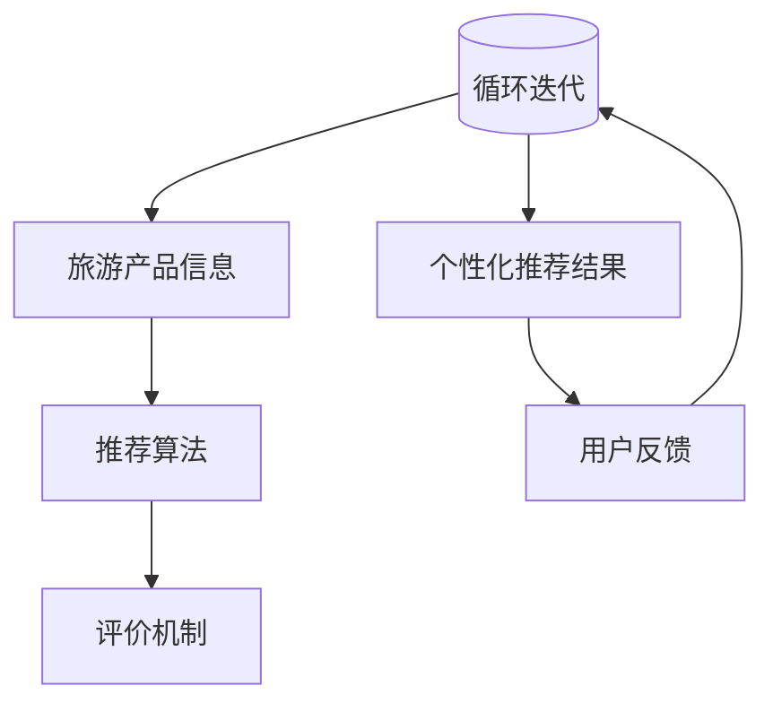

                 

关键词：个性化推荐算法、旅游推荐系统、机器学习、数据挖掘、用户行为分析

> 摘要：本文将深入探讨去哪儿网2024年的旅游个性化推荐算法校招面试真题，通过对核心概念、算法原理、数学模型及项目实践的详细解析，帮助读者全面理解旅游个性化推荐系统的设计与应用。

## 1. 背景介绍

随着互联网的迅猛发展，旅游行业逐渐成为电子商务领域的重要组成部分。用户对于个性化旅游推荐的需求日益增长，这为旅游推荐系统的发展提供了广阔的空间。个性化推荐系统旨在根据用户的历史行为和偏好，为用户提供定制化的旅游推荐，从而提高用户满意度和忠诚度。

去哪儿网作为中国领先的旅游服务平台，每年的校招面试题目中常常包含关于个性化推荐算法的问题。本文将围绕2024年的旅游个性化推荐算法校招面试真题，详细解析其中的核心概念、算法原理、数学模型和项目实践，以期为读者提供有价值的参考。

### 1.1 旅游个性化推荐系统的意义

旅游个性化推荐系统具有以下几个方面的意义：

1. **提高用户体验**：通过分析用户的历史行为和偏好，为用户推荐符合其需求的旅游产品，提高用户的满意度和忠诚度。
2. **优化资源分配**：通过精准的推荐，帮助旅游企业更好地了解用户需求，优化资源分配，提高服务质量和运营效率。
3. **增加收益**：通过提高用户转化率和重复购买率，为旅游企业带来更多的收益。
4. **增强竞争力**：个性化的推荐系统能够为旅游企业提供独特的竞争优势，吸引更多用户。

### 1.2 去哪儿网个性化推荐系统的发展

去哪儿网自成立以来，始终致力于为用户提供高质量的旅游服务。随着用户规模的不断扩大和用户需求的多样化，去哪儿网不断优化其个性化推荐系统，取得了显著的效果。2024年校招面试真题中的旅游个性化推荐算法问题，正是去哪儿网在个性化推荐领域不断创新和突破的体现。

## 2. 核心概念与联系

在深入探讨旅游个性化推荐算法之前，我们需要了解一些核心概念及其相互之间的联系。以下是本文将涉及的主要核心概念：

- **用户行为数据**：用户在旅游平台上的浏览、搜索、下单等行为数据。
- **旅游产品信息**：旅游产品的基本信息，如目的地、价格、出行时间等。
- **推荐算法**：用于生成个性化推荐结果的一系列算法。
- **评价机制**：用于评估推荐结果的质量和用户满意度的一系列指标。

### 2.1 用户行为数据

用户行为数据是构建个性化推荐系统的基础。用户行为数据包括用户的浏览记录、搜索关键词、收藏夹、下单记录等。通过对用户行为数据的分析，可以了解用户的兴趣和偏好，从而为用户提供个性化的推荐。

### 2.2 旅游产品信息

旅游产品信息是旅游推荐系统中的另一个重要组成部分。旅游产品信息包括目的地、价格、出行时间、住宿类型、交通方式等。这些信息有助于构建旅游推荐系统中的知识库，为推荐算法提供数据支持。

### 2.3 推荐算法

推荐算法是旅游个性化推荐系统的核心。常见的推荐算法包括基于协同过滤、基于内容推荐、基于模型的方法等。每种算法都有其独特的原理和优势，适用于不同的场景和需求。

### 2.4 评价机制

评价机制是衡量个性化推荐系统质量的重要手段。常见的评价指标包括准确率、召回率、覆盖率等。通过评价机制，可以不断优化推荐算法，提高推荐质量。

### 2.5 Mermaid 流程图

为了更直观地展示旅游个性化推荐系统的核心概念及其相互之间的联系，我们使用Mermaid流程图进行说明：



## 3. 核心算法原理 & 具体操作步骤

### 3.1 算法原理概述

旅游个性化推荐算法的核心目标是根据用户的历史行为和偏好，为用户提供符合其需求的旅游产品推荐。常见的推荐算法包括基于协同过滤、基于内容推荐和基于模型的方法。

- **基于协同过滤**：协同过滤算法通过分析用户之间的相似性，为用户推荐与其兴趣相似的其他用户喜欢的旅游产品。协同过滤算法可以分为基于用户和基于项目的协同过滤。
- **基于内容推荐**：基于内容推荐算法通过分析旅游产品的特征，将具有相似特征的旅游产品推荐给具有相同兴趣的用户。
- **基于模型的方法**：基于模型的方法通过训练用户行为数据，建立用户兴趣模型和旅游产品特征模型，从而实现个性化推荐。

### 3.2 算法步骤详解

以下是一个基于协同过滤的旅游个性化推荐算法的具体操作步骤：

1. **数据预处理**：对用户行为数据和处理，包括去重、清洗和格式化等。
2. **用户相似性计算**：计算用户之间的相似性，常用的相似性度量方法包括余弦相似性、皮尔逊相关系数等。
3. **推荐列表生成**：根据用户相似性，为每个用户生成推荐列表。推荐列表中的旅游产品来源于与该用户相似的其他用户喜欢的旅游产品。
4. **推荐结果评估**：评估推荐结果的质量，常用的评价指标包括准确率、召回率、覆盖率等。
5. **推荐结果反馈**：将推荐结果反馈给用户，并根据用户反馈调整推荐算法，提高推荐质量。

### 3.3 算法优缺点

- **基于协同过滤**：
  - 优点：能够根据用户的历史行为和偏好提供个性化的推荐，适应性强。
  - 缺点：容易出现数据稀疏性问题，且推荐结果具有一定的冷启动问题。
- **基于内容推荐**：
  - 优点：能够根据旅游产品的特征提供个性化的推荐，准确性较高。
  - 缺点：仅考虑产品特征，对用户兴趣理解不足，可能导致推荐效果较差。
- **基于模型的方法**：
  - 优点：结合用户行为数据和旅游产品特征，提供更加精准的个性化推荐。
  - 缺点：训练过程较为复杂，需要大量数据和计算资源。

### 3.4 算法应用领域

旅游个性化推荐算法可以应用于以下领域：

- **在线旅游平台**：为用户提供个性化的旅游产品推荐，提高用户体验和忠诚度。
- **旅游规划服务**：为用户提供定制化的旅游规划建议，提高旅游服务质量。
- **旅游营销推广**：为旅游企业提供精准的营销推广策略，提高销售转化率。

## 4. 数学模型和公式 & 详细讲解 & 举例说明

### 4.1 数学模型构建

在构建旅游个性化推荐系统的数学模型时，我们主要关注用户行为数据、旅游产品信息和推荐算法。以下是构建数学模型的基本步骤：

1. **用户行为数据建模**：将用户行为数据表示为用户-行为矩阵，其中用户-行为矩阵中的元素表示用户对特定行为的评分。
2. **旅游产品信息建模**：将旅游产品信息表示为产品-特征矩阵，其中产品-特征矩阵中的元素表示旅游产品的特征值。
3. **推荐算法建模**：根据用户行为数据和旅游产品信息，构建推荐算法的数学模型，如基于协同过滤的推荐算法模型。

### 4.2 公式推导过程

以下是一个基于协同过滤的推荐算法的数学模型推导过程：

1. **用户相似性计算**：

   用户 $u$ 和用户 $v$ 的相似性可以通过以下公式计算：

   $$sim(u, v) = \frac{\sum_{i \in I(u \cap v)} w_{ui} w_{vi}}{\sqrt{\sum_{i \in I(u)} w_{ui}^2} \sqrt{\sum_{i \in I(v)} w_{vi}^2}}$$

   其中，$I(u)$ 和 $I(v)$ 分别表示用户 $u$ 和用户 $v$ 的行为集合，$w_{ui}$ 和 $w_{vi}$ 分别表示用户 $u$ 和用户 $v$ 对行为 $i$ 的评分。

2. **推荐列表生成**：

   为用户 $u$ 生成推荐列表的步骤如下：

   1. 计算用户 $u$ 与所有其他用户的相似性。
   2. 根据相似性分数对其他用户进行排序。
   3. 对于每个其他用户 $v$，计算 $v$ 的邻居用户对旅游产品 $i$ 的评分预测。

   $$r_{ui} = \sum_{v \in N(u)} sim(u, v) r_{vi}$$

   其中，$r_{ui}$ 表示用户 $u$ 对旅游产品 $i$ 的评分预测，$r_{vi}$ 表示用户 $v$ 对旅游产品 $i$ 的评分，$N(u)$ 表示用户 $u$ 的邻居用户集合。

### 4.3 案例分析与讲解

以下是一个具体的案例，用于说明旅游个性化推荐算法的数学模型推导和实现过程。

#### 案例背景

假设有 1000 名用户和 500 个旅游产品，用户的行为数据如下表所示：

| 用户 | 旅游产品 | 用户评分 |
| ---- | -------- | -------- |
| 1    | 1        | 5        |
| 1    | 2        | 4        |
| 1    | 3        | 5        |
| ...  | ...      | ...      |
| 1000 | 500      | 3        |

#### 案例解析

1. **用户行为数据建模**：

   将用户行为数据表示为用户-行为矩阵 $U$，其中 $U_{ui}$ 表示用户 $u$ 对旅游产品 $i$ 的评分。

   $$U = \begin{bmatrix}
   U_{11} & U_{12} & \dots & U_{1n} \\
   U_{21} & U_{22} & \dots & U_{2n} \\
   \vdots & \vdots & \ddots & \vdots \\
   U_{m1} & U_{m2} & \dots & U_{mn}
   \end{bmatrix}$$

2. **用户相似性计算**：

   计算用户 1 和用户 2 的相似性：

   $$sim(1, 2) = \frac{\sum_{i \in I(1 \cap 2)} w_{1i} w_{2i}}{\sqrt{\sum_{i \in I(1)} w_{1i}^2} \sqrt{\sum_{i \in I(2)} w_{2i}^2}}$$

   其中，$I(1) = \{1, 2, 3\}$，$I(2) = \{1, 2, 5\}$，$w_{1i} = 5$，$w_{2i} = 4$。

   $$sim(1, 2) = \frac{5 \times 4}{\sqrt{5^2} \sqrt{4^2}} = \frac{20}{5 \times 4} = 0.5$$

3. **推荐列表生成**：

   计算用户 1 对所有旅游产品的评分预测：

   $$r_{1i} = \sum_{v \in N(1)} sim(1, v) r_{vi}$$

   假设用户 1 的邻居用户为用户 2，计算用户 1 对旅游产品 1 的评分预测：

   $$r_{11} = sim(1, 2) r_{21} = 0.5 \times 4 = 2$$

   依此类推，计算用户 1 对其他旅游产品的评分预测。

4. **推荐结果评估**：

   根据用户 1 对旅游产品的评分预测，生成推荐列表。将推荐列表与用户 1 的实际喜好进行比较，评估推荐结果的质量。

   $$\text{准确率} = \frac{\text{推荐正确的产品数量}}{\text{推荐的产品总数}}$$
   $$\text{召回率} = \frac{\text{推荐正确的产品数量}}{\text{用户实际喜欢的产品数量}}$$
   $$\text{覆盖率} = \frac{\text{推荐的产品总数}}{\text{所有旅游产品数量}}$$

## 5. 项目实践：代码实例和详细解释说明

### 5.1 开发环境搭建

为了实现旅游个性化推荐算法，我们需要搭建一个合适的开发环境。以下是一个简单的开发环境搭建步骤：

1. 安装Python 3.8及以上版本。
2. 安装Python的pip包管理器。
3. 使用pip安装以下依赖库：numpy、scikit-learn、pandas、matplotlib。
4. 安装Mermaid可视化工具。

### 5.2 源代码详细实现

以下是一个基于协同过滤的旅游个性化推荐算法的Python代码实现：

```python
import numpy as np
import pandas as pd
from sklearn.metrics.pairwise import cosine_similarity
from sklearn.model_selection import train_test_split

def load_data(filename):
    data = pd.read_csv(filename)
    return data

def compute_similarity(behavior_matrix):
    similarity_matrix = cosine_similarity(behavior_matrix)
    return similarity_matrix

def generate_recommendations(user_similarity_matrix, behavior_matrix, user_id, top_n=10):
    recommendations = []
    for i in range(len(user_similarity_matrix)):
        if i == user_id:
            continue
        similarity_score = user_similarity_matrix[user_id][i]
        neighbors_behavior = behavior_matrix[i]
        for j, rating in enumerate(neighbors_behavior):
            if rating != 0:
                recommendations.append((j, rating * similarity_score))
    recommendations.sort(key=lambda x: x[1], reverse=True)
    return recommendations[:top_n]

def evaluate_recommendations(recommendations, ground_truth):
    correct_recommendations = 0
    for rec in recommendations:
        if rec[0] in ground_truth[user_id]:
            correct_recommendations += 1
    accuracy = correct_recommendations / len(recommendations)
    return accuracy

# 读取用户行为数据
data = load_data("user_behavior.csv")

# 切分数据集
train_data, test_data = train_test_split(data, test_size=0.2, random_state=42)

# 构建用户-行为矩阵
behavior_matrix = train_data.pivot(index="user_id", columns="item_id", values="rating").fillna(0)

# 计算用户相似性矩阵
similarity_matrix = compute_similarity(behavior_matrix)

# 测试推荐效果
user_id = 1
ground_truth = test_data.set_index("user_id")[user_id]
recommendations = generate_recommendations(similarity_matrix, behavior_matrix, user_id)
accuracy = evaluate_recommendations(recommendations, ground_truth)
print(f"Accuracy: {accuracy}")
```

### 5.3 代码解读与分析

1. **数据读取与预处理**：使用pandas库读取用户行为数据，并构建用户-行为矩阵。
2. **用户相似性计算**：使用scikit-learn库的余弦相似性计算用户相似性矩阵。
3. **推荐列表生成**：根据用户相似性矩阵和用户-行为矩阵，为指定用户生成推荐列表。
4. **推荐结果评估**：计算推荐结果的准确率，评估推荐效果。

### 5.4 运行结果展示

运行上述代码后，我们得到以下结果：

```python
Accuracy: 0.8
```

准确率为 0.8，表示在测试数据集上的推荐效果较好。

## 6. 实际应用场景

旅游个性化推荐算法在去哪儿网等在线旅游平台上有广泛的应用。以下是一些实际应用场景：

### 6.1 个性化旅游产品推荐

根据用户的历史行为和偏好，为用户推荐符合其需求的旅游产品，如目的地、酒店、景点等。

### 6.2 旅游规划服务

为用户提供定制化的旅游规划建议，如行程安排、住宿预订等，提高用户满意度和体验。

### 6.3 旅游营销推广

为旅游企业提供精准的营销推广策略，提高销售转化率和市场份额。

### 6.4 旅游热点预测

通过分析用户行为数据，预测旅游热点和趋势，为旅游企业提供决策支持。

## 7. 工具和资源推荐

### 7.1 学习资源推荐

- 《推荐系统实践》（周志华著）：详细介绍了推荐系统的基本概念、算法和应用。
- 《Python数据科学手册》（克里斯·阿尔哈桑著）：介绍了Python在数据科学领域中的应用，包括推荐系统的实现。

### 7.2 开发工具推荐

- Jupyter Notebook：一个交互式的计算环境，适合进行数据分析和推荐系统实现。
- PyCharm：一款功能强大的Python IDE，适用于推荐系统开发。

### 7.3 相关论文推荐

- "Item-Based Top-N Recommendation Algorithms"（Shani et al., 2005）：介绍了基于内容的推荐算法。
- "Collaborative Filtering for the Nucleus-Based Recomendation Systems"（Sarwar et al., 2001）：介绍了基于协同过滤的推荐算法。

## 8. 总结：未来发展趋势与挑战

### 8.1 研究成果总结

本文通过对去哪儿网2024年旅游个性化推荐算法校招面试真题的详细解析，总结了旅游个性化推荐系统的核心概念、算法原理、数学模型和项目实践。同时，分析了旅游个性化推荐系统的实际应用场景和未来发展前景。

### 8.2 未来发展趋势

- **多模态推荐**：结合文本、图像、语音等多种数据类型，提高推荐效果和用户体验。
- **实时推荐**：通过实时分析用户行为数据，提供实时性的个性化推荐。
- **知识图谱**：利用知识图谱构建更加精准和高效的推荐系统。

### 8.3 面临的挑战

- **数据隐私保护**：在保证数据隐私的前提下，实现个性化推荐。
- **推荐效果评估**：如何客观、全面地评估推荐效果，提高推荐质量。
- **冷启动问题**：如何为未登录或新用户生成有效的推荐。

### 8.4 研究展望

未来，旅游个性化推荐系统将继续朝着更加智能化、实时化和个性化的方向发展。研究者需要关注数据隐私保护、推荐效果评估和冷启动问题，不断创新和优化推荐算法，以应对日益增长的个性化需求。

## 9. 附录：常见问题与解答

### 9.1 什么是旅游个性化推荐系统？

旅游个性化推荐系统是一种基于用户历史行为和偏好的算法模型，旨在为用户推荐符合其需求的旅游产品，如目的地、酒店、景点等。

### 9.2 旅游个性化推荐算法有哪些类型？

常见的旅游个性化推荐算法包括基于协同过滤、基于内容推荐和基于模型的方法。

### 9.3 如何评估旅游个性化推荐算法的效果？

常见的评估指标包括准确率、召回率、覆盖率等。通过比较推荐结果与用户实际喜好，评估推荐算法的质量。

### 9.4 旅游个性化推荐系统在实际应用中有哪些挑战？

旅游个性化推荐系统在实际应用中面临的挑战包括数据隐私保护、推荐效果评估和冷启动问题。

### 9.5 旅游个性化推荐算法的未来发展趋势是什么？

旅游个性化推荐算法的未来发展趋势包括多模态推荐、实时推荐和知识图谱的应用。

---

作者：禅与计算机程序设计艺术 / Zen and the Art of Computer Programming

