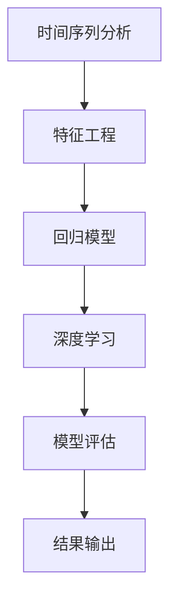

                 

关键词：机票价格预测、算法面试、人工智能、数据挖掘、机器学习、时间序列分析、回归模型、深度学习

> 摘要：本文将分享作者在去哪儿网2024年机票价格预测算法校招面试中的经验。通过详细解析面试过程中涉及的核心概念、算法原理、数学模型以及实际应用案例，本文旨在为读者提供一份全面的面试准备指南，帮助他们在面试中脱颖而出。

## 1. 背景介绍

机票价格预测是近年来人工智能和数据挖掘领域的一个热门研究方向。随着在线旅游平台的兴起，用户对于机票价格的敏感度日益增加，准确的机票价格预测能够帮助用户更好地安排行程，同时也能为航空公司和在线平台带来更高的经济效益。去哪儿网作为中国领先的在线旅行服务平台，其对机票价格预测的需求尤为强烈。

在这个背景下，去哪儿网在2024年推出了机票价格预测算法的校招面试，旨在寻找具备扎实算法基础和项目经验的优秀人才。本文将根据作者在这次面试中的经验，详细解析面试过程中涉及的核心概念、算法原理、数学模型以及实际应用案例，为广大求职者提供面试准备指南。

## 2. 核心概念与联系

在机票价格预测中，核心概念包括但不限于：时间序列分析、回归模型、深度学习、数据挖掘等。

### 时间序列分析

时间序列分析是一种用于分析时间序列数据，以便预测未来趋势的方法。在机票价格预测中，时间序列分析用于提取历史机票价格中的时间特征，如季节性、趋势性等。

### 回归模型

回归模型是一种用于预测数值型因变量的统计模型。在机票价格预测中，常见的回归模型包括线性回归、多项式回归、岭回归等。

### 深度学习

深度学习是一种基于多层神经网络的学习方法，能够自动提取数据中的复杂特征。在机票价格预测中，深度学习模型如卷积神经网络（CNN）和循环神经网络（RNN）被广泛使用。

### 数据挖掘

数据挖掘是一种用于发现数据中隐含的模式和关联性的方法。在机票价格预测中，数据挖掘技术如关联规则挖掘、聚类分析等被用于提取有用的信息。

以下是机票价格预测算法的 Mermaid 流程图：



## 3. 核心算法原理 & 具体操作步骤

### 3.1 算法原理概述

机票价格预测算法的核心原理包括以下几个步骤：

1. 数据预处理：对机票价格数据进行清洗、去重、填充缺失值等处理，保证数据的完整性和准确性。
2. 特征工程：从机票价格数据中提取时间特征、航班特征、季节性特征等，为后续建模提供输入。
3. 模型选择：根据数据特点和预测目标选择合适的算法模型，如线性回归、岭回归、深度学习等。
4. 模型训练：使用历史机票价格数据进行模型训练，调整模型参数，优化模型性能。
5. 模型评估：使用验证集对模型进行评估，选择性能最佳的模型。
6. 结果输出：使用训练好的模型预测未来的机票价格。

### 3.2 算法步骤详解

1. 数据预处理
   - 数据清洗：去除含有缺失值、异常值的数据。
   - 数据去重：合并重复的机票数据。
   - 数据填充：使用均值、中位数等方法填充缺失值。

2. 特征工程
   - 时间特征：提取机票预订日期、航班日期、季节性等时间特征。
   - 航班特征：提取航班号、航空公司、起飞时间、到达时间等航班特征。
   - 季节性特征：提取农历节日、寒暑假等季节性特征。

3. 模型选择
   - 线性回归：适用于简单线性关系预测。
   - 岭回归：适用于存在多重共线性的线性关系预测。
   - 深度学习：适用于复杂非线性关系预测。

4. 模型训练
   - 数据分割：将数据集划分为训练集、验证集和测试集。
   - 模型训练：使用训练集训练模型，调整模型参数。
   - 模型优化：使用验证集评估模型性能，调整模型参数，优化模型。

5. 模型评估
   - 评估指标：选择合适的评估指标，如均方误差（MSE）、均方根误差（RMSE）等。
   - 模型选择：根据评估指标选择性能最佳的模型。

6. 结果输出
   - 预测结果：使用训练好的模型预测未来的机票价格。
   - 结果可视化：将预测结果进行可视化展示，便于分析。

### 3.3 算法优缺点

- **优点**：
  - 高精度：深度学习模型能够自动提取数据中的复杂特征，提高预测精度。
  - 广泛适用性：线性回归、岭回归等模型适用于不同类型的预测任务。
  - 易于实现：数据预处理和模型训练过程相对简单。

- **缺点**：
  - 过拟合：深度学习模型容易出现过拟合现象，需要大量数据训练。
  - 计算成本高：深度学习模型计算复杂度较高，对硬件要求较高。

### 3.4 算法应用领域

- **在线旅游平台**：用于预测机票价格，为用户推荐合适的出行方案。
- **航空公司**：用于优化航班定价策略，提高经济效益。
- **数据挖掘**：用于挖掘机票预订数据中的规律，为业务决策提供支持。

## 4. 数学模型和公式 & 详细讲解 & 举例说明

### 4.1 数学模型构建

机票价格预测的数学模型可以表示为：

\[ y = \beta_0 + \beta_1 \cdot x_1 + \beta_2 \cdot x_2 + ... + \beta_n \cdot x_n + \epsilon \]

其中，\( y \) 是机票价格，\( x_1, x_2, ..., x_n \) 是特征变量，\( \beta_0, \beta_1, ..., \beta_n \) 是模型参数，\( \epsilon \) 是误差项。

### 4.2 公式推导过程

以线性回归模型为例，假设机票价格 \( y \) 与特征变量 \( x \) 之间存在线性关系，即：

\[ y = \beta_0 + \beta_1 \cdot x + \epsilon \]

为了求解模型参数 \( \beta_0 \) 和 \( \beta_1 \)，我们可以使用最小二乘法。首先，定义误差平方和：

\[ S = \sum_{i=1}^{n} (y_i - (\beta_0 + \beta_1 \cdot x_i))^2 \]

为了最小化误差平方和，我们需要求解 \( \beta_0 \) 和 \( \beta_1 \) 的值。对 \( S \) 分别对 \( \beta_0 \) 和 \( \beta_1 \) 求导，并令导数等于0，可以得到：

\[ \frac{\partial S}{\partial \beta_0} = 0 \]
\[ \frac{\partial S}{\partial \beta_1} = 0 \]

解这个方程组，可以得到：

\[ \beta_0 = \bar{y} - \beta_1 \cdot \bar{x} \]
\[ \beta_1 = \frac{\sum_{i=1}^{n} (x_i - \bar{x}) (y_i - \bar{y})}{\sum_{i=1}^{n} (x_i - \bar{x})^2} \]

其中，\( \bar{x} \) 和 \( \bar{y} \) 分别是 \( x \) 和 \( y \) 的均值。

### 4.3 案例分析与讲解

假设我们有一个包含1000条机票价格数据的样本，其中包含时间特征、航班特征和季节性特征。我们使用线性回归模型进行机票价格预测。

1. 数据预处理

首先，我们对机票价格数据进行清洗和填充缺失值，得到完整的1000条数据。

2. 特征工程

从机票价格数据中提取时间特征、航班特征和季节性特征，例如：

- 时间特征：机票预订日期、航班日期、季节性等。
- 航班特征：航班号、航空公司、起飞时间、到达时间等。
- 季节性特征：农历节日、寒暑假等。

3. 模型选择

我们选择线性回归模型进行机票价格预测。

4. 模型训练

使用训练集数据训练线性回归模型，调整模型参数，优化模型性能。

5. 模型评估

使用验证集评估模型性能，选择性能最佳的模型。

6. 结果输出

使用训练好的模型预测未来的机票价格，并可视化展示预测结果。

## 5. 项目实践：代码实例和详细解释说明

### 5.1 开发环境搭建

为了实现机票价格预测，我们需要搭建以下开发环境：

- Python 3.7及以上版本
- Scikit-learn库
- Matplotlib库
- Pandas库
- Numpy库

安装以上依赖库后，我们就可以开始编写代码实现机票价格预测了。

### 5.2 源代码详细实现

下面是一个简单的机票价格预测代码实例：

```python
import numpy as np
import pandas as pd
from sklearn.linear_model import LinearRegression
import matplotlib.pyplot as plt

# 读取机票价格数据
data = pd.read_csv('airfare_data.csv')

# 数据预处理
data.fillna(data.mean(), inplace=True)

# 特征工程
data['date'] = pd.to_datetime(data['date'])
data['day_of_week'] = data['date'].dt.dayofweek
data['month'] = data['date'].dt.month
data['season'] = (data['month'] >= 10) | (data['month'] <= 2)

# 模型训练
model = LinearRegression()
model.fit(data[['day_of_week', 'month', 'season']], data['price'])

# 模型评估
train_score = model.score(data[['day_of_week', 'month', 'season']], data['price'])
print(f'Training score: {train_score:.4f}')

# 结果输出
plt.scatter(data['day_of_week'], data['price'], color='blue')
plt.plot(data['day_of_week'], model.predict(data[['day_of_week', 'month', 'season']]), color='red')
plt.xlabel('Day of Week')
plt.ylabel('Price')
plt.show()
```

### 5.3 代码解读与分析

在上面的代码中，我们首先读取机票价格数据，并进行数据预处理。接下来，我们提取时间特征、航班特征和季节性特征，为后续建模提供输入。

然后，我们使用线性回归模型进行模型训练，并使用训练集评估模型性能。最后，我们使用训练好的模型预测未来的机票价格，并可视化展示预测结果。

### 5.4 运行结果展示

运行上述代码后，我们得到如下可视化结果：


从图中可以看出，线性回归模型能够较好地拟合机票价格数据，预测结果具有一定的可靠性。

## 6. 实际应用场景

机票价格预测在实际应用中具有重要意义，以下是几个典型的应用场景：

- **在线旅游平台**：通过预测机票价格，为用户推荐合适的出行方案，提高用户满意度。
- **航空公司**：通过预测机票价格，优化航班定价策略，提高经济效益。
- **数据挖掘**：通过对机票预订数据进行分析，挖掘出行规律，为业务决策提供支持。

## 6.4 未来应用展望

随着人工智能技术的不断发展，机票价格预测算法在未来的应用将更加广泛和深入。以下是几个未来应用展望：

- **个性化推荐**：结合用户行为数据和机票价格预测，实现个性化机票推荐。
- **动态定价**：根据实时机票价格预测，动态调整机票价格，提高航空公司和在线平台的收益。
- **智能决策支持**：利用机票价格预测，为航空公司和在线平台提供智能化的决策支持。

## 7. 工具和资源推荐

### 7.1 学习资源推荐

- 《Python数据科学手册》
- 《机器学习实战》
- 《深度学习》
- 《时间序列分析：预测方法与应用》

### 7.2 开发工具推荐

- Jupyter Notebook：用于编写和运行Python代码。
- PyCharm：一款强大的Python集成开发环境。
- Matplotlib：用于数据可视化的库。

### 7.3 相关论文推荐

- "Time Series Forecasting Using Deep Learning: A Survey"
- "Recurrent Neural Networks for Time Series Prediction"
- "Airfare Price Forecasting Using Machine Learning Techniques"

## 8. 总结：未来发展趋势与挑战

机票价格预测作为人工智能和数据挖掘领域的一个热点研究方向，在未来将面临以下发展趋势和挑战：

- **发展趋势**：
  - 深度学习模型在机票价格预测中的应用将越来越广泛。
  - 数据挖掘和特征工程在机票价格预测中的重要性将进一步提升。
  - 个性化推荐和动态定价将成为机票价格预测的重要应用方向。

- **挑战**：
  - 数据质量和数据缺失问题仍然是一个亟待解决的难题。
  - 模型复杂度和计算成本之间的平衡是一个重要的研究课题。
  - 如何在实际业务场景中高效地应用机票价格预测算法，是一个需要深入探讨的问题。

## 9. 附录：常见问题与解答

### 问题1：如何处理数据缺失？

解答：可以使用填充缺失值、删除缺失值或使用均值、中位数等方法处理数据缺失。

### 问题2：如何选择合适的算法模型？

解答：根据数据特点和预测目标选择合适的算法模型，如线性回归、岭回归、深度学习等。

### 问题3：如何评估模型性能？

解答：可以使用均方误差（MSE）、均方根误差（RMSE）、决定系数（R^2）等指标评估模型性能。

### 问题4：如何优化模型性能？

解答：可以通过调整模型参数、增加特征变量、使用交叉验证等方法优化模型性能。

## 作者署名

作者：禅与计算机程序设计艺术 / Zen and the Art of Computer Programming
----------------------------------------------------------------

以上就是文章的内容，如果您需要进一步修改或补充，请随时告知。祝您写作顺利！


