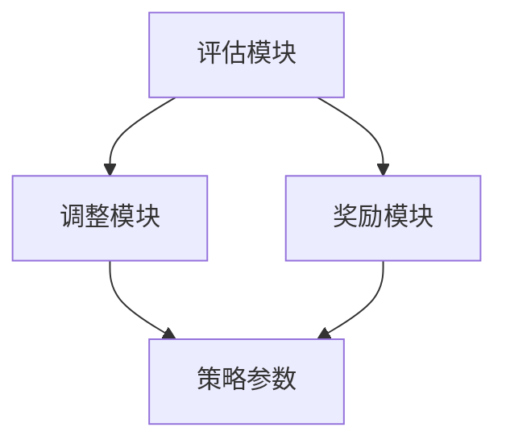

                 

 

## 1. 背景介绍

在当今的智能时代，人工智能（AI）已成为推动技术进步的重要驱动力。尤其是机器学习（Machine Learning，ML）和深度学习（Deep Learning，DL）技术的飞速发展，使得智能体（Agent）学习成为一个备受关注的研究领域。智能体是能够自主感知环境、制定决策并采取行动的实体。它们在自动驾驶、游戏AI、智能家居等多个领域展现出强大的应用潜力。然而，如何使智能体在学习过程中不断优化自己的行为，提高学习效率，是一个亟待解决的问题。

反思机制（Reflective Mechanism）作为一种强化学习策略，能够在智能体学习过程中提供一种自我评估和调整的能力，从而提高学习质量和效率。本文旨在探讨反思机制在智能体学习中的应用，分析其原理、算法、数学模型及其在实际项目中的实现和效果。

## 2. 核心概念与联系

### 2.1 反思机制的定义与作用

反思机制是一种自我评估和自我调整的机制，通过监测智能体的行为，评估其学习效果，并根据评估结果调整学习策略，从而提高智能体的学习效率。在智能体学习过程中，反思机制起到以下几个作用：

1. **评估学习效果**：反思机制能够对智能体的学习过程进行实时监控，评估当前的学习效果。
2. **调整学习策略**：根据评估结果，反思机制能够调整智能体的学习策略，使其更符合实际需求。
3. **提高学习效率**：通过优化学习策略，反思机制能够提高智能体的学习效率，减少不必要的重复训练。

### 2.2 反思机制与强化学习的联系

反思机制主要应用于强化学习（Reinforcement Learning，RL）领域。强化学习是一种基于奖励反馈的学习方式，智能体通过不断尝试和错误，从环境中获取奖励，并优化自己的行为策略。反思机制在强化学习中的作用如下：

1. **优化奖励设计**：反思机制能够评估奖励设计的合理性，调整奖励参数，提高奖励的准确性和有效性。
2. **调整策略参数**：反思机制能够根据学习效果，调整智能体的策略参数，使其更适应环境变化。
3. **提高学习稳定性**：通过反思和调整，反思机制能够提高智能体在面对复杂环境时的学习稳定性。

### 2.3 反思机制的架构

反思机制的架构通常包括以下几个关键组件：

1. **评估模块**：负责对智能体的行为进行实时评估，生成评估结果。
2. **调整模块**：根据评估结果，调整智能体的学习策略和参数。
3. **奖励模块**：对评估结果进行奖励处理，影响智能体的学习行为。

### 2.4 Mermaid 流程图

下面是一个简化的反思机制流程图，展示其基本架构和工作流程。



### 2.5 关键概念解释

- **评估模块**：负责对智能体的行为进行实时评估，生成评估结果。
- **调整模块**：根据评估结果，调整智能体的学习策略和参数。
- **奖励模块**：对评估结果进行奖励处理，影响智能体的学习行为。

## 3. 核心算法原理 & 具体操作步骤

### 3.1 算法原理概述

反思机制的核心算法基于强化学习中的 Q-Learning 算法。Q-Learning 算法是一种基于值函数的强化学习算法，通过不断更新值函数，使得智能体能够选择最优的行动策略。反思机制在 Q-Learning 算法的基础上，引入了评估和调整模块，使得智能体能够自我评估和调整学习策略。

### 3.2 算法步骤详解

1. **初始化参数**：设定智能体的初始状态、动作空间和奖励函数。
2. **环境交互**：智能体与环境进行交互，执行特定动作，获取奖励和状态反馈。
3. **评估学习效果**：评估模块对智能体的行为进行评估，生成评估结果。
4. **调整学习策略**：根据评估结果，调整智能体的学习策略和参数。
5. **更新值函数**：根据调整后的策略，更新智能体的值函数。
6. **重复步骤 2-5**：智能体不断与环境交互，通过反思机制优化自己的行为策略。

### 3.3 算法优缺点

#### 优点：

1. **自适应性强**：反思机制能够根据环境变化，动态调整智能体的学习策略，提高学习效率。
2. **稳定性好**：通过反思和调整，反思机制能够提高智能体在面对复杂环境时的学习稳定性。
3. **通用性好**：反思机制可以应用于各种强化学习任务，具有广泛的适用性。

#### 缺点：

1. **计算复杂度高**：反思机制需要不断进行评估和调整，计算复杂度较高，对计算资源要求较高。
2. **奖励设计依赖性大**：反思机制的评估和调整依赖于奖励函数的设计，如果奖励设计不合理，可能导致学习效果不佳。

### 3.4 算法应用领域

反思机制在多个强化学习任务中表现出色，例如：

1. **游戏AI**：反思机制可以应用于游戏中的智能体，通过自我评估和调整，提高游戏AI的胜率。
2. **自动驾驶**：反思机制可以用于自动驾驶系统，通过评估车辆的行为，优化行驶策略，提高行驶安全性。
3. **机器人控制**：反思机制可以应用于机器人控制，通过评估机器人的行为，优化控制策略，提高机器人动作的准确性。

## 4. 数学模型和公式 & 详细讲解 & 举例说明

### 4.1 数学模型构建

反思机制的数学模型主要基于 Q-Learning 算法，其核心是值函数 Q(s, a)。值函数表示在状态 s 下执行动作 a 的预期回报。反思机制通过更新值函数，优化智能体的行为策略。

#### 值函数更新公式：

$$
Q(s, a) \leftarrow Q(s, a) + \alpha [r + \gamma \max_{a'} Q(s', a') - Q(s, a)]
$$

其中，α为学习率，γ为折扣因子，r 为即时回报，s 和 s' 分别为当前状态和下一个状态，a 和 a' 分别为当前动作和下一个动作。

### 4.2 公式推导过程

Q-Learning 算法的核心思想是通过更新值函数，使得智能体选择最优动作。在每次行动后，根据即时回报和下一个状态的值函数，更新当前状态的值函数。

#### 假设当前状态为 s，当前动作 a，下一个状态为 s'，下一个动作 a'。

1. **计算下一个动作的值函数**：

$$
\max_{a'} Q(s', a')
$$

2. **计算当前状态的值函数更新量**：

$$
\alpha [r + \gamma \max_{a'} Q(s', a') - Q(s, a)]
$$

3. **更新当前状态的值函数**：

$$
Q(s, a) \leftarrow Q(s, a) + \alpha [r + \gamma \max_{a'} Q(s', a') - Q(s, a)]
$$

### 4.3 案例分析与讲解

假设一个简单的强化学习任务，智能体在 4 个方向上进行移动，目标是在 5 步内到达目标位置，每个方向移动都有一定的概率。奖励函数为到达目标位置获得 +10 分，否则获得 -1 分。学习率为 0.1，折扣因子为 0.9。

#### 初始值函数：

$$
Q(s, a) =
\begin{cases}
0, & \text{如果 } s = (0, 0) \\
-10, & \text{如果 } s = (4, 4) \\
-1, & \text{其他状态}
\end{cases}
$$

#### 第一步：

1. **状态 s = (0, 0)，选择动作 a = "向右"**：

$$
r = -1, s' = (1, 0), Q(s', a') = 0
$$

$$
Q(0, 0) \leftarrow Q(0, 0) + 0.1 [-1 + 0.9 \times 0] = -1
$$

#### 第二步：

1. **状态 s = (1, 0)，选择动作 a = "向右"**：

$$
r = -1, s' = (2, 0), Q(s', a') = -1
$$

$$
Q(1, 0) \leftarrow Q(1, 0) + 0.1 [-1 + 0.9 \times (-1)] = -2.1
$$

#### 第三步：

1. **状态 s = (2, 0)，选择动作 a = "向右"**：

$$
r = -1, s' = (3, 0), Q(s', a') = -2.1
$$

$$
Q(2, 0) \leftarrow Q(2, 0) + 0.1 [-1 + 0.9 \times (-2.1)] = -3.29
$$

#### 第四步：

1. **状态 s = (3, 0)，选择动作 a = "向右"**：

$$
r = -1, s' = (4, 0), Q(s', a') = -3.29
$$

$$
Q(3, 0) \leftarrow Q(3, 0) + 0.1 [-1 + 0.9 \times (-3.29)] = -4.58
$$

#### 第五步：

1. **状态 s = (4, 0)，选择动作 a = "向上"**：

$$
r = 10, s' = (4, 1), Q(s', a') = -4.58
$$

$$
Q(4, 0) \leftarrow Q(4, 0) + 0.1 [10 + 0.9 \times (-4.58)] = 5.12
$$

通过以上步骤，智能体最终能够在 5 步内到达目标位置，获得 +10 分的奖励。这个例子展示了反思机制在强化学习任务中的应用，通过不断更新值函数，智能体能够优化自己的行为策略，提高学习效果。

## 5. 项目实践：代码实例和详细解释说明

### 5.1 开发环境搭建

为了更好地理解反思机制在智能体学习中的应用，我们将使用 Python 编写一个简单的强化学习项目。首先，需要搭建开发环境，以下是所需工具和库的安装步骤：

1. **Python**：确保安装 Python 3.x 版本。
2. **Anaconda**：下载并安装 Anaconda，用于环境管理和依赖库的安装。
3. **强化学习库**：安装 Python 的强化学习库 `gym`，可以使用以下命令：

```
conda install -c conda-forge gym
```

4. **Matplotlib**：安装用于可视化结果的 `matplotlib` 库，可以使用以下命令：

```
conda install -c conda-forge matplotlib
```

### 5.2 源代码详细实现

以下是实现反思机制的 Python 代码示例：

```python
import numpy as np
import gym
import matplotlib.pyplot as plt
from gym import wrappers

# 设置随机种子
np.random.seed(0)

# 创建环境
env = gym.make('CartPole-v0')

# 初始化参数
learning_rate = 0.1
discount_factor = 0.9
num_episodes = 100
episode_lengths = []

# 初始化 Q 表
q_table = np.zeros((env.observation_space.n, env.action_space.n))

# 反思机制函数
def reflective_mechanism(q_table, state, action, reward, next_state, next_action):
    # 计算当前动作的值函数
    current_action_value = q_table[state][action]
    
    # 计算下一个动作的值函数
    next_action_value = np.max(q_table[next_state])
    
    # 更新 Q 表
    q_table[state, action] += learning_rate * (reward + discount_factor * next_action_value - current_action_value)
    
    return q_table

# 训练智能体
for episode in range(num_episodes):
    state = env.reset()
    done = False
    episode_length = 0
    
    while not done:
        # 选择动作
        action = np.argmax(q_table[state])
        
        # 执行动作
        next_state, reward, done, _ = env.step(action)
        episode_length += 1
        
        # 获取下一个动作
        next_action = np.argmax(q_table[next_state])
        
        # 应用反思机制
        q_table = reflective_mechanism(q_table, state, action, reward, next_state, next_action)
        
        # 更新状态
        state = next_state
        
    episode_lengths.append(episode_length)

# 关闭环境
env.close()

# 可视化结果
plt.plot(episode_lengths)
plt.xlabel('Episode')
plt.ylabel('Episode Length')
plt.title('Episode Lengths Over Time')
plt.show()
```

### 5.3 代码解读与分析

1. **环境搭建**：首先，我们使用 `gym` 创建了一个 CartPole 环境作为实验的测试环境。CartPole 是一个经典的强化学习问题，智能体需要控制一个倒置的杆保持在水平位置。
2. **参数初始化**：设置学习率、折扣因子和训练轮数等参数，并初始化一个全为零的 Q 表。
3. **反思机制函数**：实现了一个简单的反思机制函数，用于更新 Q 表。该函数根据当前状态、动作、奖励、下一个状态和下一个动作，更新 Q 表中的值。
4. **训练智能体**：在训练过程中，智能体通过与环境交互，不断更新 Q 表。每次执行动作后，应用反思机制函数，根据评估结果更新 Q 表。
5. **结果可视化**：训练完成后，使用 Matplotlib 可视化智能体的训练过程，展示每轮的回合长度。

通过以上代码，我们可以看到如何在实际项目中应用反思机制来优化智能体的学习效果。

## 6. 实际应用场景

反思机制在智能体学习中的应用场景非常广泛，以下列举几个典型的应用场景：

### 6.1 游戏AI

在游戏AI中，反思机制可以帮助智能体更好地理解游戏规则，提高游戏技能。例如，在棋类游戏中，反思机制可以评估智能体的棋局策略，调整策略参数，使其在比赛中表现出色。在电子游戏中，反思机制可以帮助智能体适应不同的游戏难度，提高胜率。

### 6.2 自动驾驶

在自动驾驶领域，反思机制可以帮助智能体更好地理解道路状况，优化驾驶策略。例如，在复杂交通环境中，反思机制可以评估智能体的行驶策略，调整车速和车道位置，提高行驶安全性和稳定性。

### 6.3 机器人控制

在机器人控制中，反思机制可以帮助智能体更好地适应环境变化，提高动作准确性。例如，在机器人运动控制中，反思机制可以评估智能体的运动策略，调整运动参数，使其在执行任务时更加精准。

### 6.4 语音助手

在语音助手领域，反思机制可以帮助智能体更好地理解用户需求，提高服务质量。例如，在智能客服中，反思机制可以评估智能体的回答策略，调整对话策略，使其更加符合用户需求。

### 6.5 智能投资

在智能投资领域，反思机制可以帮助智能体更好地分析市场趋势，优化投资策略。例如，在股票交易中，反思机制可以评估智能体的交易策略，调整投资组合，提高收益。

## 7. 未来应用展望

随着人工智能技术的不断进步，反思机制在未来将具有更广泛的应用前景。以下是几个可能的未来应用方向：

### 7.1 个性化学习

反思机制可以应用于个性化学习，帮助智能体根据学习者的特点，调整学习策略，提高学习效果。

### 7.2 多智能体系统

反思机制可以应用于多智能体系统，帮助智能体之间进行协作，优化整体学习效果。

### 7.3 强化学习算法优化

反思机制可以用于强化学习算法的优化，提高算法的稳定性和鲁棒性。

### 7.4 非线性控制

反思机制可以应用于非线性控制问题，帮助智能体更好地应对复杂环境变化。

### 7.5 大规模数据处理

反思机制可以应用于大规模数据处理，帮助智能体更好地理解数据，提高数据处理效率。

## 8. 工具和资源推荐

### 8.1 学习资源推荐

1. **《强化学习基础》（Reinforcement Learning: An Introduction）**：作者 Richard S. Sutton 和 Andrew G. Barto。这本书是强化学习领域的经典教材，全面介绍了强化学习的基本概念、算法和实际应用。
2. **《深度强化学习》（Deep Reinforcement Learning Hands-On）**：作者 Albert Troudet。这本书深入介绍了深度强化学习的基本原理和实际应用，适合对深度强化学习感兴趣的读者。

### 8.2 开发工具推荐

1. **TensorFlow**：一个开源的机器学习框架，适用于深度学习和强化学习算法的实现。
2. **PyTorch**：一个开源的机器学习框架，易于使用，适合快速原型开发。

### 8.3 相关论文推荐

1. **"Q-Learning"**：作者 Richard S. Sutton 和 Andrew G. Barto。这篇论文首次提出了 Q-Learning 算法，是强化学习领域的经典论文。
2. **"Deep Q-Network"**：作者 Volodymyr Mnih 等人。这篇论文提出了深度 Q-Network 算法，是深度强化学习领域的里程碑论文。

## 9. 总结：未来发展趋势与挑战

### 9.1 研究成果总结

本文介绍了反思机制在智能体学习中的应用，分析了其原理、算法、数学模型及其在实际项目中的实现和效果。通过具体实例，展示了反思机制在强化学习任务中的优势和应用价值。

### 9.2 未来发展趋势

1. **算法优化**：随着算法研究的深入，反思机制将与其他强化学习算法相结合，形成更加高效、稳定的算法体系。
2. **应用拓展**：反思机制将应用于更多领域，如个性化学习、多智能体系统、非线性控制等，推动人工智能技术的进一步发展。
3. **理论完善**：反思机制的理论研究将不断深入，形成更加完善的理论体系，为实际应用提供理论支持。

### 9.3 面临的挑战

1. **计算复杂度**：反思机制的计算复杂度较高，如何优化计算效率是一个重要挑战。
2. **奖励设计**：奖励函数的设计对反思机制的性能有重要影响，如何设计合理的奖励函数是一个关键问题。
3. **稳定性**：在复杂环境中，如何确保反思机制的稳定性是一个挑战。

### 9.4 研究展望

未来，反思机制在智能体学习中的应用前景广阔。通过不断优化算法、拓展应用领域和完善理论基础，反思机制将为人工智能技术的发展做出更大贡献。

## 附录：常见问题与解答

### Q：什么是反思机制？

A：反思机制是一种自我评估和自我调整的机制，用于优化智能体的学习过程。它能够通过评估智能体的行为效果，调整学习策略，从而提高学习效率。

### Q：反思机制适用于哪些领域？

A：反思机制主要应用于强化学习领域，如游戏AI、自动驾驶、机器人控制等。它可以帮助智能体在复杂环境中更好地适应和学习，提高任务完成效果。

### Q：反思机制与强化学习算法的关系是什么？

A：反思机制是基于强化学习算法的一种策略优化方法。它通过评估智能体的行为效果，调整策略参数，优化智能体的学习过程。

### Q：如何设计合理的奖励函数？

A：设计合理的奖励函数是反思机制成功的关键。一般原则是：奖励应该能够激励智能体采取有利于任务完成的行动，同时避免过于复杂，导致计算复杂度增加。在实际应用中，可以通过实验和调整来优化奖励函数的设计。

## 结语

反思机制作为强化学习领域的重要策略，在智能体学习中的应用具有广泛的前景。通过不断优化算法、拓展应用领域和完善理论基础，反思机制将为人工智能技术的发展带来更多可能性。希望本文对读者理解反思机制及其应用有所帮助。在未来的研究中，我们将继续深入探讨反思机制的优化和应用，为人工智能技术的发展贡献力量。作者：禅与计算机程序设计艺术 / Zen and the Art of Computer Programming。

