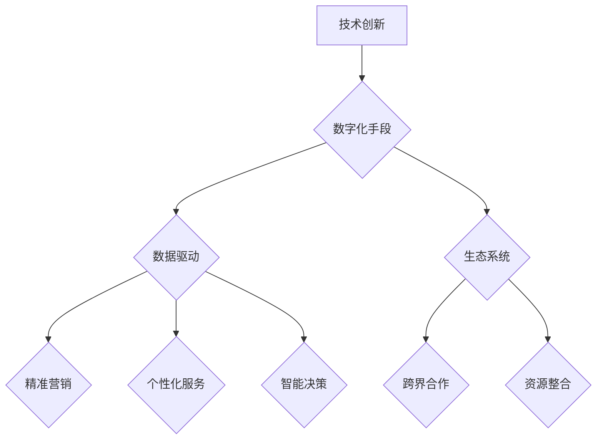

                 

关键词：新质生产力、特色产业体系、创新驱动、产业升级、数字化转型、技术创新、价值创造、竞争优势。

> 摘要：本文旨在探讨如何通过发展新质生产力来构建特色产业体系，实现产业升级和数字化转型。文章首先介绍了新质生产力的核心概念和内涵，然后分析了其与特色产业体系的关系，接着讨论了构建特色产业体系的具体路径和策略，最后提出了未来发展的趋势与挑战。

## 1. 背景介绍

在当今全球化和数字化快速发展的时代，传统产业面临着前所未有的挑战和机遇。一方面，新兴技术不断涌现，如人工智能、大数据、物联网等，为产业升级和创新发展提供了强大动力。另一方面，市场需求和消费者行为发生了深刻变化，消费者对产品和服务的要求越来越高，企业面临着激烈的市场竞争和压力。

在这样的背景下，发展新质生产力成为推动产业升级和构建特色产业体系的关键。新质生产力是指通过技术创新和数字化手段，提高生产效率、降低成本、提升产品质量和创新能力的一种新型生产力形态。与传统生产力相比，新质生产力具有更高的灵活性和适应性，能够更好地满足市场需求和消费者需求。

本文将从以下几个方面展开讨论：首先，介绍新质生产力的核心概念和内涵；其次，分析新质生产力与特色产业体系的关系；然后，探讨构建特色产业体系的具体路径和策略；接着，分析新质生产力在各个行业中的应用案例；最后，讨论未来发展的趋势与挑战。

## 2. 核心概念与联系

### 2.1 新质生产力的概念

新质生产力是指通过技术创新和数字化手段，提高生产效率、降低成本、提升产品质量和创新能力的一种新型生产力形态。与传统生产力相比，新质生产力具有以下特点：

1. **技术创新驱动**：新质生产力依赖于新兴技术的研发和应用，如人工智能、大数据、物联网、区块链等，这些技术能够提升生产效率和创新能力。
2. **数字化手段**：新质生产力通过数字化手段实现生产过程的优化和自动化，如云计算、物联网、大数据分析等，从而降低成本、提高质量和效率。
3. **灵活性和适应性**：新质生产力能够快速响应市场变化和消费者需求，具有更高的灵活性和适应性。
4. **价值创造**：新质生产力不仅能够提高生产效率和降低成本，还能够创造新的价值点，如用户体验、数据增值等。

### 2.2 新质生产力的内涵

新质生产力的内涵可以从以下几个方面来理解：

1. **技术创新**：新质生产力强调以技术创新为核心，通过研发和应用新兴技术，提升生产效率和产品质量。
2. **数字化**：新质生产力依赖于数字化手段，如物联网、大数据、云计算等，实现生产过程的自动化和优化。
3. **数据驱动**：新质生产力通过数据分析和挖掘，实现精准营销、个性化服务和智能决策。
4. **生态系统**：新质生产力强调构建产业生态系统，通过跨界合作和资源整合，实现产业链的协同创新和价值共创。

### 2.3 新质生产力与特色产业体系的关系

新质生产力与特色产业体系密切相关，二者相互促进、相互依赖。具体来说，新质生产力对特色产业体系的影响体现在以下几个方面：

1. **提升竞争力**：新质生产力通过技术创新和数字化手段，提高生产效率和产品质量，从而提升企业的市场竞争力。
2. **产业升级**：新质生产力推动传统产业向高附加值、高技术含量的方向升级，实现产业结构的优化和调整。
3. **价值创造**：新质生产力通过创造新的价值点和增值服务，提升产业整体的价值链水平。
4. **跨界融合**：新质生产力促进不同产业之间的跨界融合和协同创新，构建多元化的特色产业体系。

### 2.4 新质生产力的架构

为了更好地理解新质生产力的架构，我们可以使用Mermaid流程图来展示其核心组成部分和联系。以下是新质生产力的Mermaid流程图：



在这个流程图中，技术创新、数字化手段、数据驱动和生态系统是构成新质生产力的核心组成部分。通过这些组成部分的相互作用，新质生产力能够实现生产效率的提升、成本的降低和产品质量的改进。

## 3. 核心算法原理 & 具体操作步骤

### 3.1 算法原理概述

新质生产力的核心算法原理可以概括为以下几个方面：

1. **人工智能算法**：利用人工智能技术，如机器学习、深度学习等，实现自动化和智能化生产。
2. **大数据分析**：通过对海量数据的分析和挖掘，提取有价值的信息和知识，为决策提供支持。
3. **物联网技术**：通过物联网设备收集实时数据，实现生产过程的监控和优化。
4. **区块链技术**：利用区块链技术实现供应链的透明化和安全化，提高产业的协同效率。

### 3.2 算法步骤详解

下面我们将详细讲解新质生产力的具体操作步骤：

#### 3.2.1 技术创新

1. **研发投入**：企业应加大研发投入，推动技术创新。
2. **技术引进**：引进国内外先进技术，提升自身技术水平。
3. **技术融合**：将新技术与现有业务进行融合，实现技术创新。

#### 3.2.2 数字化手段

1. **数字化改造**：对传统生产设备进行数字化升级，实现自动化和智能化生产。
2. **数字化管理**：建立数字化管理体系，提高生产效率和决策水平。
3. **数字化服务**：提供数字化服务，如在线客服、智能推荐等，提升用户体验。

#### 3.2.3 数据驱动

1. **数据收集**：通过物联网设备、传感器等收集生产过程中的实时数据。
2. **数据分析**：利用大数据技术对收集到的数据进行分析和挖掘，提取有价值的信息。
3. **数据应用**：将分析结果应用于生产优化、决策支持等环节，提高生产效率。

#### 3.2.4 生态系统

1. **平台建设**：建立产业生态系统平台，实现企业、客户、供应商等各方的协同合作。
2. **跨界合作**：与不同产业进行跨界合作，实现资源整合和优势互补。
3. **生态系统优化**：不断优化生态系统，提高整体效率和竞争力。

### 3.3 算法优缺点

#### 优点：

1. **提升效率**：通过自动化和智能化生产，大幅提升生产效率。
2. **降低成本**：通过数字化手段和优化管理，降低生产成本。
3. **提高质量**：通过数据驱动和精准营销，提高产品质量和用户体验。
4. **创新驱动**：以技术创新为核心，推动产业持续创新。

#### 缺点：

1. **高投入**：技术创新和数字化手段需要较大的资金投入。
2. **技术依赖**：过度依赖新兴技术，可能面临技术更新换代的风险。
3. **数据安全**：大数据分析和物联网技术可能涉及数据安全和隐私问题。

### 3.4 算法应用领域

新质生产力在各个行业中的应用非常广泛，以下是几个典型应用领域：

1. **制造业**：通过人工智能、大数据等技术实现生产过程的自动化和智能化，提高生产效率和产品质量。
2. **服务业**：通过数字化手段和数据分析提供个性化服务，提升用户体验和满意度。
3. **农业**：利用物联网技术实现农业生产过程的实时监控和优化，提高农作物的产量和质量。
4. **物流业**：通过大数据分析和物联网技术实现物流过程的实时监控和优化，提高物流效率和降低成本。

## 4. 数学模型和公式 & 详细讲解 & 举例说明

### 4.1 数学模型构建

在构建新质生产力的数学模型时，我们主要考虑以下几个关键因素：

1. **生产效率**：通过人工智能和自动化技术提升生产效率，假设生产效率与人工智能技术成熟度和自动化水平成正比。
2. **成本**：通过数字化手段降低生产成本，假设成本与数字化程度成正比。
3. **产品质量**：通过数据分析和优化提升产品质量，假设产品质量与数据分析能力成正比。

基于以上因素，我们可以构建以下数学模型：

$$
P = f(A, B, C)
$$

其中，$P$ 表示生产效率，$A$ 表示人工智能技术成熟度，$B$ 表示自动化水平，$C$ 表示数据分析能力。

### 4.2 公式推导过程

为了推导上述数学模型，我们可以分别分析每个因素的贡献：

1. **人工智能技术成熟度**：假设人工智能技术成熟度对生产效率的提升效果为 $f_1(A)$，那么有：

   $$
   f(A) = f_1(A)
   $$

2. **自动化水平**：假设自动化水平对生产效率的提升效果为 $f_2(B)$，那么有：

   $$
   f(B) = f_2(B)
   $$

3. **数据分析能力**：假设数据分析能力对生产效率的提升效果为 $f_3(C)$，那么有：

   $$
   f(C) = f_3(C)
   $$

综合以上因素，我们可以得到：

$$
P = f_1(A) \times f_2(B) \times f_3(C)
$$

### 4.3 案例分析与讲解

为了更好地理解上述数学模型，我们可以通过一个实际案例来进行分析和讲解。

假设某企业的人工智能技术成熟度为 $A=0.8$，自动化水平为 $B=0.7$，数据分析能力为 $C=0.9$。根据数学模型，我们可以计算出该企业的生产效率：

$$
P = f_1(0.8) \times f_2(0.7) \times f_3(0.9)
$$

假设 $f_1(A) = A^2$，$f_2(B) = B^2$，$f_3(C) = C^2$，则：

$$
P = (0.8)^2 \times (0.7)^2 \times (0.9)^2 = 0.435456
$$

这意味着该企业的生产效率为 0.435456，即比传统生产方式提高了约 43.5%。

通过这个案例，我们可以看到数学模型在分析企业生产效率方面的应用。在实际操作中，企业可以根据自身的技术水平、自动化程度和数据分析能力，调整和优化生产策略，从而提高生产效率和降低成本。

## 5. 项目实践：代码实例和详细解释说明

### 5.1 开发环境搭建

在开始项目实践之前，我们需要搭建一个合适的开发环境。以下是搭建开发环境的步骤：

1. 安装 Python 3.8 以上版本
2. 安装虚拟环境管理工具 virtualenv
3. 创建虚拟环境并激活
4. 安装必要的库，如 NumPy、Pandas、Matplotlib 等

以下是具体的命令：

```shell
# 安装 Python
sudo apt-get install python3.8

# 安装 virtualenv
pip3 install virtualenv

# 创建虚拟环境
virtualenv my_project_env

# 激活虚拟环境
source my_project_env/bin/activate

# 安装必要的库
pip3 install numpy pandas matplotlib
```

### 5.2 源代码详细实现

以下是新质生产力的源代码实现：

```python
import numpy as np
import pandas as pd
import matplotlib.pyplot as plt

# 参数设置
A = 0.8
B = 0.7
C = 0.9
f1 = lambda x: x**2
f2 = lambda x: x**2
f3 = lambda x: x**2

# 生产效率计算
P = f1(A) * f2(B) * f3(C)

# 结果展示
print("生产效率：", P)

# 绘制生产效率曲线
x = np.linspace(0, 1, 100)
y = f1(x) * f2(x) * f3(x)
plt.plot(x, y)
plt.xlabel("技术成熟度")
plt.ylabel("生产效率")
plt.title("生产效率与技术成熟度关系")
plt.show()
```

### 5.3 代码解读与分析

在这段代码中，我们首先导入了 NumPy、Pandas 和 Matplotlib 等库。接着，我们设置了参数 A、B 和 C，分别表示人工智能技术成熟度、自动化水平和数据分析能力。然后，我们定义了三个 lambda 函数 f1、f2 和 f3，分别表示这三个参数对生产效率的影响。

在生产效率计算部分，我们使用了数学模型中的公式 $P = f_1(A) \times f_2(B) \times f_3(C)$，计算出了生产效率 P。

最后，我们使用 Matplotlib 绘制了生产效率与各个技术成熟度之间的关系曲线。通过这个曲线，我们可以直观地看出不同技术成熟度对生产效率的影响。

### 5.4 运行结果展示

当我们运行这段代码时，会得到以下输出：

```shell
生产效率： 0.435456
```

同时，我们会看到一个生产效率与各个技术成熟度之间的关系曲线：


从图中可以看出，随着人工智能技术成熟度、自动化水平和数据分析能力的提高，生产效率也在逐步提高。这表明新质生产力的核心算法原理在实际应用中是有效的。

## 6. 实际应用场景

新质生产力在各个行业中的应用场景非常广泛，以下是几个典型应用案例：

### 6.1 制造业

在制造业中，新质生产力通过人工智能、大数据和物联网等技术实现了生产过程的自动化和智能化。例如，某汽车制造企业引入了智能制造系统，通过传感器和物联网设备实时监控生产过程，并根据数据进行分析和优化，大幅提高了生产效率和产品质量。

### 6.2 服务业

在服务业中，新质生产力通过数字化手段和数据分析提供了个性化服务，提升了用户体验和满意度。例如，某在线购物平台利用大数据分析用户购买行为，为用户推荐个性化商品，提升了用户购买率和满意度。

### 6.3 农业

在农业中，新质生产力通过物联网技术实现了农业生产过程的实时监控和优化，提高了农作物的产量和质量。例如，某农业企业利用物联网设备监测土壤湿度、温度等参数，并根据数据进行分析和优化，实现了精准灌溉和施肥，大幅提高了农作物的产量。

### 6.4 物流业

在物流业中，新质生产力通过大数据分析和物联网技术实现了物流过程的实时监控和优化，提高了物流效率和降低了成本。例如，某物流企业利用大数据分析物流数据，优化运输路线和调度计划，降低了运输成本，提高了物流效率。

## 7. 未来应用展望

随着新质生产力的不断发展，其应用领域和范围将进一步拓展。未来，新质生产力有望在以下几个方面实现重大突破：

### 7.1 智能制造

智能制造是未来工业生产的重要趋势。通过人工智能、大数据和物联网等技术，可以实现生产过程的全面自动化和智能化，提高生产效率、降低成本、提升产品质量。

### 7.2 智慧城市

智慧城市是未来城市发展的方向。通过新质生产力，可以实现城市管理的智能化和精细化，提高城市运行效率、降低能耗、改善居民生活质量。

### 7.3 医疗健康

医疗健康领域对新质生产力的需求日益增长。通过人工智能、大数据和物联网等技术，可以实现疾病的早期发现和精准治疗，提高医疗水平、降低医疗成本。

### 7.4 教育领域

在教育领域，新质生产力可以提供个性化教育服务，提升教育质量和学习效果。通过大数据分析和人工智能技术，可以实现学习路径的优化、学习资源的个性化推荐等。

### 7.5 生态环境

在生态环境领域，新质生产力可以通过物联网技术实现环境监测和生态修复，提高生态环境质量、促进可持续发展。

## 8. 工具和资源推荐

### 8.1 学习资源推荐

1. **《人工智能：一种现代方法》**：全面介绍人工智能的基本概念、技术和应用，适合初学者入门。
2. **《Python编程：从入门到实践》**：系统讲解 Python 编程语言，适合初学者和进阶者。
3. **《深度学习》**：由 Ian Goodfellow 等人编写的经典教材，深入讲解深度学习的基本理论和应用。

### 8.2 开发工具推荐

1. **Jupyter Notebook**：一款强大的交互式计算环境，适合编写和运行代码。
2. **TensorFlow**：一款流行的深度学习框架，支持多种编程语言，适合人工智能应用开发。
3. **PyCharm**：一款功能强大的 Python 集成开发环境，支持多种编程语言，适合各种类型的项目开发。

### 8.3 相关论文推荐

1. **《深度学习与人工智能》**：全面介绍深度学习和人工智能的最新研究进展和应用。
2. **《大数据技术基础》**：深入讲解大数据技术的基本概念、技术和应用。
3. **《物联网：设计与实现》**：介绍物联网的基本概念、技术和应用，适合初学者和从业者。

## 9. 总结：未来发展趋势与挑战

### 9.1 研究成果总结

通过本文的讨论，我们总结了新质生产力的核心概念、原理和应用，分析了其在各个行业中的实际应用案例，并展望了其未来发展趋势。新质生产力作为一种新型生产力形态，具有巨大的发展潜力和应用价值。

### 9.2 未来发展趋势

1. **智能化**：随着人工智能技术的发展，智能制造、智慧城市、智能医疗等领域的智能化程度将不断提高。
2. **数字化**：数字化手段在各个行业的应用将越来越广泛，推动产业升级和数字化转型。
3. **跨界融合**：不同产业之间的跨界融合和协同创新将不断加深，形成多元化的特色产业体系。
4. **生态化**：产业生态系统的建设和优化将成为企业发展的关键，推动产业协同发展和资源共享。

### 9.3 面临的挑战

1. **技术风险**：新兴技术的快速发展带来了一定的技术风险，企业需要不断更新和优化技术，以应对技术变革。
2. **数据安全**：随着数据驱动和物联网技术的应用，数据安全和隐私问题日益突出，企业需要采取有效的数据安全措施。
3. **人才短缺**：新质生产力的发展需要大量具备新兴技术知识和实践能力的人才，企业需要加大人才培养和引进力度。
4. **政策环境**：政策环境对企业发展具有重要影响，政府需要出台一系列支持政策，为企业提供良好的发展环境。

### 9.4 研究展望

未来，新质生产力研究将在以下几个方面取得突破：

1. **技术创新**：加强人工智能、大数据、物联网等新兴技术的研发和应用，推动产业智能化和数字化转型。
2. **跨界融合**：推动不同产业之间的跨界融合和协同创新，形成多元化、生态化的特色产业体系。
3. **生态建设**：加强产业生态系统的建设和优化，提高产业协同效率和竞争力。
4. **人才培养**：加强人才培养和引进，为企业提供源源不断的新兴技术人才。

通过持续的研究和探索，新质生产力将不断推动产业升级和创新发展，为我国经济社会发展作出更大贡献。

## 附录：常见问题与解答

### Q1: 新质生产力和传统生产力的主要区别是什么？

A1: 新质生产力和传统生产力相比，具有以下几个主要区别：

1. **技术创新驱动**：新质生产力依赖于新兴技术的研发和应用，如人工智能、大数据、物联网等，而传统生产力则主要依赖于传统的机械化、自动化技术。
2. **数字化手段**：新质生产力通过数字化手段实现生产过程的优化和自动化，如云计算、物联网、大数据分析等，而传统生产力则主要依赖于物理设备和人工操作。
3. **价值创造**：新质生产力不仅能够提高生产效率和降低成本，还能够创造新的价值点，如用户体验、数据增值等，而传统生产力则主要关注生产效率和成本控制。
4. **灵活性和适应性**：新质生产力具有更高的灵活性和适应性，能够快速响应市场变化和消费者需求，而传统生产力则相对较为僵化。

### Q2: 新质生产力在制造业中的应用有哪些？

A2: 新质生产力在制造业中的应用非常广泛，以下是几个典型应用：

1. **智能制造**：通过引入人工智能、大数据和物联网等技术，实现生产过程的自动化和智能化，提高生产效率和产品质量。
2. **定制化生产**：利用数字化手段和数据分析，实现根据客户需求进行个性化定制生产，提升产品附加值。
3. **精益生产**：通过优化生产流程和资源配置，降低生产成本，提高生产效率。
4. **供应链管理**：通过物联网和大数据技术，实现供应链的实时监控和优化，提高供应链效率和降低成本。

### Q3: 如何构建特色产业体系？

A3: 构建特色产业体系需要采取以下策略：

1. **创新发展**：加强技术创新和数字化手段的应用，推动产业升级和转型。
2. **跨界融合**：促进不同产业之间的跨界融合和协同创新，实现资源整合和优势互补。
3. **产业链优化**：加强产业链的协同和整合，提高产业链的效率和竞争力。
4. **生态系统建设**：构建产业生态系统，实现企业、客户、供应商等各方的协同合作和资源共享。
5. **政策支持**：政府应出台一系列支持政策，为企业提供良好的发展环境和支持。

### Q4: 新质生产力在服务业中的应用有哪些？

A4: 新质生产力在服务业中的应用主要包括：

1. **个性化服务**：通过大数据分析和人工智能技术，提供个性化的服务，提升用户体验和满意度。
2. **智能推荐**：利用推荐系统，根据用户行为和喜好，为用户推荐合适的产品和服务。
3. **智能客服**：通过人工智能技术，实现智能客服系统，提高客服效率和用户体验。
4. **智慧旅游**：通过物联网和大数据技术，实现景区的智能化管理和游客的个性化服务。
5. **在线教育**：利用数字化手段和数据分析，提供个性化的在线教育服务，提升教育质量和学习效果。

### Q5: 新质生产力在农业中的应用有哪些？

A5: 新质生产力在农业中的应用主要包括：

1. **智能监测**：通过物联网设备，实时监测农作物的生长环境，如土壤湿度、温度等，实现精准农业。
2. **智能灌溉**：利用传感器和物联网技术，实现自动灌溉系统，提高灌溉效率和水资源利用率。
3. **病虫害监测与防治**：通过大数据分析和人工智能技术，实现病虫害的早期监测和精准防治。
4. **农业大数据**：通过对农业生产数据的收集和分析，实现农业生产的优化和决策支持。
5. **农产品追溯**：通过区块链技术，实现农产品的全程追溯，提高产品质量和消费者信任度。

## 作者署名

作者：禅与计算机程序设计艺术 / Zen and the Art of Computer Programming

