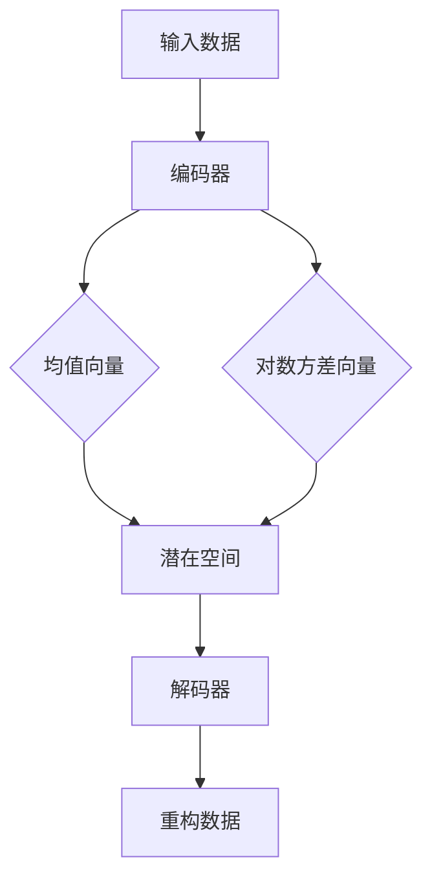

                 

 关键词：变分自编码器（Variational Autoencoder，VAE），生成模型（Generative Model），深度学习，概率图模型，算法原理，代码实战，数据可视化，机器学习，深度神经网络。

## 摘要

本文将深入探讨变分自编码器（VAE）和生成模型的基本原理及其在深度学习中的应用。首先，我们将介绍VAE的背景和核心概念，并通过Mermaid流程图展示其结构。随后，文章将详细讲解VAE的算法原理、数学模型和具体实现步骤。在此基础上，我们将探讨VAE的优势和局限，以及其应用领域。接着，文章将提供基于Python的VAE代码实例，详细解读每个步骤和实现细节。最后，我们将讨论VAE和生成模型在现实世界中的实际应用场景，展望未来的发展趋势和面临的挑战，并提供相关的学习资源和开发工具推荐。

<|assistant|> **1. 背景介绍**

生成模型是深度学习中的一个重要分支，旨在通过学习数据分布来生成新的数据样本。传统的生成模型如高斯混合模型（Gaussian Mixture Model，GMM）和隐马尔可夫模型（Hidden Markov Model，HMM）在生成多样化数据方面存在一定限制。随着深度学习的兴起，生成模型开始利用深度神经网络的能力来更好地捕捉数据分布的复杂性。其中，变分自编码器（Variational Autoencoder，VAE）是近年来备受关注的一种生成模型。

VAE由Kingma和Welling于2013年提出，是自编码器的一种变体，旨在通过编码器和解码器网络学习数据分布的参数表示。与传统自编码器不同，VAE不直接尝试重构输入数据，而是通过学习数据的概率分布来生成新的数据样本。这种概率分布可以通过编码器网络得到，解码器网络则根据这个概率分布生成数据。VAE的成功在于其能够在保证生成质量的同时，有效避免过拟合问题。

## **2. 核心概念与联系**

### 2.1. VAE的核心概念

VAE由两部分组成：编码器（encoder）和解码器（decoder）。编码器将输入数据映射到一个潜在空间（latent space），解码器则从潜在空间中采样并重构输入数据。

1. **编码器**：编码器网络接受输入数据并输出潜在空间中的向量。在VAE中，编码器的输出通常包括两个部分：一个均值向量和一个对数方差向量。这两个向量共同描述了数据在潜在空间中的概率分布。

2. **解码器**：解码器网络从潜在空间中采样，并尝试重构原始输入数据。解码器的输入是一个潜在空间中的向量，输出是重构的输入数据。

### 2.2. VAE的结构

VAE的结构可以用Mermaid流程图表示，如下所示：



### 2.3. VAE与概率图模型的关系

VAE是一种概率图模型，其核心在于通过编码器和解码器学习数据的概率分布。在概率图模型中，每个节点代表数据的一个变量，边代表变量之间的依赖关系。VAE中的编码器和解码器分别对应于概率图模型中的编码路径和解码路径。

在VAE中，编码器通过隐变量（潜在空间）来描述输入数据的分布，解码器则根据这个分布生成数据。这种方式使得VAE能够生成多样化的数据样本，同时保持生成数据的真实感。

## **3. 核心算法原理 & 具体操作步骤**

### 3.1. 算法原理概述

VAE的目标是通过编码器和解码器学习数据的概率分布，并利用这个概率分布生成新的数据样本。具体来说，VAE的算法原理可以概括为以下步骤：

1. **编码器**：输入数据通过编码器映射到潜在空间中的向量。编码器输出包括一个均值向量和一个对数方差向量，这两个向量描述了潜在空间中数据分布的参数。

2. **采样**：从潜在空间中采样一个向量作为生成数据的起点。

3. **解码器**：解码器根据采样的向量生成重构数据。

4. **损失函数**：VAE的损失函数由两部分组成：数据重构损失和KL散度损失。数据重构损失用于衡量重构数据与原始数据之间的差异，KL散度损失用于衡量编码器输出的均值和对数方差与真实数据分布之间的差异。

### 3.2. 算法步骤详解

VAE的算法步骤可以分为以下几步：

1. **初始化参数**：随机初始化编码器和解码器的参数。

2. **前向传播**：输入数据通过编码器映射到潜在空间中的向量。

3. **采样**：从潜在空间中采样一个向量作为生成数据的起点。

4. **后向传播**：解码器根据采样向量生成重构数据。

5. **计算损失**：计算数据重构损失和KL散度损失。

6. **更新参数**：使用反向传播算法更新编码器和解码器的参数。

7. **重复步骤2-6**：重复上述步骤，直到满足停止条件（如训练达到一定轮数或损失函数收敛）。

### 3.3. 算法优缺点

VAE具有以下优点：

1. **生成数据质量高**：VAE能够生成多样化且真实感强的数据样本。

2. **避免过拟合**：VAE通过引入KL散度损失，有助于防止模型过拟合。

VAE也存在一些局限性：

1. **训练难度大**：VAE的训练过程涉及复杂的优化问题，可能需要较长的训练时间。

2. **对数据分布的假设**：VAE假设数据分布为高斯分布，这在某些情况下可能不适用。

### 3.4. 算法应用领域

VAE在各种应用领域表现出色，主要包括：

1. **图像生成**：VAE可以生成逼真的图像，广泛应用于图像增强、图像修复和艺术创作等领域。

2. **自然语言处理**：VAE在自然语言处理领域也有广泛应用，如文本生成、机器翻译和情感分析等。

3. **生物信息学**：VAE在生物信息学领域用于生成蛋白质结构、RNA序列等。

## **4. 数学模型和公式 & 详细讲解 & 举例说明**

### 4.1. 数学模型构建

VAE的数学模型主要包括编码器和解码器的参数定义、前向传播和损失函数。

#### 编码器参数

假设输入数据为\(x\)，编码器输出为\(\mu, \sigma^2\)，其中\(\mu\)是均值向量，\(\sigma^2\)是对数方差向量。编码器参数可以表示为：

$$
\mu = \phi(x); \quad \sigma^2 = \psi(x)
$$

其中，\(\phi\)和\(\psi\)分别是编码器的均值函数和方差函数。

#### 解码器参数

假设潜在空间中的向量为\(z\)，解码器输出为\(x'\)，解码器参数可以表示为：

$$
x' = \chi(z)
$$

其中，\(\chi\)是解码器的生成函数。

#### 前向传播

前向传播过程包括编码器和解码器的计算。给定输入数据\(x\)，编码器输出\(\mu, \sigma^2\)，解码器输出\(x'\)。具体计算过程如下：

1. 计算编码器输出：

$$
\mu = \phi(x); \quad \sigma^2 = \psi(x)
$$

2. 从潜在空间中采样：

$$
z \sim \mathcal{N}(\mu, \sigma^2)
$$

3. 计算解码器输出：

$$
x' = \chi(z)
$$

#### 损失函数

VAE的损失函数由数据重构损失和KL散度损失组成。数据重构损失衡量重构数据与原始数据之间的差异，KL散度损失衡量编码器输出的均值和对数方差与真实数据分布之间的差异。具体计算过程如下：

1. 数据重构损失：

$$
L_{\text{reconstruction}} = -\sum_{i=1}^{N} x_i \log p_{\text{decoder}}(x_i | z)
$$

其中，\(N\)是数据样本数，\(x_i\)是第\(i\)个数据样本，\(p_{\text{decoder}}(x_i | z)\)是解码器生成的数据概率。

2. KL散度损失：

$$
L_{\text{KL}} = \frac{1}{N} \sum_{i=1}^{N} \mathcal{D}_{\text{KL}}(\mu_i || \sigma^2_i + \log \sigma^2_i)
$$

其中，\(\mu_i\)和\(\sigma^2_i\)是编码器输出的第\(i\)个样本的均值和对数方差，\(\mathcal{D}_{\text{KL}}\)是KL散度。

### 4.2. 公式推导过程

VAE的公式推导主要包括两部分：编码器和解码器的参数估计。这里我们主要关注编码器的参数估计。

#### 编码器参数估计

编码器的参数估计基于极大似然估计（Maximum Likelihood Estimation，MLE）。给定训练数据集\(D = \{x_1, x_2, \ldots, x_N\}\)，编码器参数\(\theta = (\phi, \psi)\)的MLE目标函数为：

$$
\hat{\theta} = \arg\max_{\theta} \log p(D | \theta)
$$

其中，\(p(D | \theta)\)是给定编码器参数\(\theta\)时，训练数据集\(D\)的概率。

根据概率图模型的理论，我们有：

$$
p(D | \theta) = \prod_{i=1}^{N} p(x_i | \mu_i, \sigma^2_i)
$$

由于解码器的生成函数\(\chi\)是一个确定性函数，我们可以将生成概率表示为：

$$
p(x_i | \mu_i, \sigma^2_i) = p(z | x_i, \mu_i, \sigma^2_i) p_{\text{decoder}}(x_i | z)
$$

其中，\(p(z | x_i, \mu_i, \sigma^2_i)\)是潜在空间中的条件概率，\(p_{\text{decoder}}(x_i | z)\)是解码器生成的数据概率。

由于\(p(z | x_i, \mu_i, \sigma^2_i)\)是高斯分布，我们有：

$$
p(z | x_i, \mu_i, \sigma^2_i) = \mathcal{N}(z | \mu_i, \sigma^2_i)
$$

因此，目标函数可以简化为：

$$
\hat{\theta} = \arg\max_{\theta} \sum_{i=1}^{N} \left[ \log \mathcal{N}(z | \mu_i, \sigma^2_i) + \log p_{\text{decoder}}(x_i | z) \right]
$$

由于\(z\)是潜在空间中的隐变量，我们无法直接计算其概率。为了解决这个问题，我们引入变分推断（Variational Inference）方法，将\(z\)的概率近似为一个可微分的概率分布。具体来说，我们选择一个对数似然分布作为近似分布，记为\(q(z | x_i, \theta_q)\)。

根据KL散度，我们有：

$$
\mathcal{D}_{\text{KL}}(q(z | x_i, \theta_q) || p(z | x_i, \mu_i, \sigma^2_i)) = \log \frac{p(x_i | \mu_i, \sigma^2_i)}{q(z | x_i, \theta_q)}
$$

为了最大化目标函数，我们需要最小化KL散度。因此，我们可以将KL散度作为损失函数，并使用梯度下降法进行优化。

#### 解码器参数估计

解码器的参数估计与编码器类似，也基于极大似然估计。给定训练数据集\(D\)和解码器参数\(\theta'\)，解码器参数的MLE目标函数为：

$$
\hat{\theta'} = \arg\max_{\theta'} \log p(D | \theta')
$$

根据概率图模型的理论，我们有：

$$
p(D | \theta') = \prod_{i=1}^{N} p(x_i | z)
$$

其中，\(z\)是编码器输出的潜在空间中的向量。

由于解码器的生成函数\(\chi\)是一个确定性函数，我们可以将生成概率表示为：

$$
p(x_i | z) = p_{\text{decoder}}(x_i | z)
$$

因此，目标函数可以简化为：

$$
\hat{\theta'} = \arg\max_{\theta'} \sum_{i=1}^{N} \log p_{\text{decoder}}(x_i | z)
$$

与编码器参数估计类似，我们可以引入变分推断方法，将\(z\)的概率近似为一个可微分的概率分布。具体来说，我们选择一个对数似然分布作为近似分布，记为\(q(z | x_i, \theta_q')\)。

根据KL散度，我们有：

$$
\mathcal{D}_{\text{KL}}(q(z | x_i, \theta_q') || p(z | \theta')) = \log \frac{p(x_i | \theta')}{q(z | x_i, \theta_q')}
$$

为了最大化目标函数，我们需要最小化KL散度。因此，我们可以将KL散度作为损失函数，并使用梯度下降法进行优化。

### 4.3. 案例分析与讲解

为了更好地理解VAE的数学模型，我们通过一个简单的案例进行讲解。

#### 案例背景

假设我们有一个数据集，包含100个二维数据点。这些数据点分布在两个高斯分布上，分别表示两个类别。我们的目标是使用VAE来学习数据分布，并生成新的数据点。

#### 案例实现

1. **数据准备**

首先，我们生成一个包含100个二维数据点的人工数据集，如下所示：

```python
import numpy as np

# 生成数据集
np.random.seed(42)
N = 100
means = np.array([[1, 1], [1.5, 0.5]])
covariance = np.array([[1, 0.5], [0.5, 1]])
X = np.random.multivariate_normal(means, covariance, N)

# 绘制数据集
import matplotlib.pyplot as plt

plt.scatter(X[:, 0], X[:, 1])
plt.xlabel('Feature 1')
plt.ylabel('Feature 2')
plt.title('Data Distribution')
plt.show()
```

2. **VAE建模**

接下来，我们使用VAE建模，并训练模型。这里我们使用PyTorch框架实现VAE，代码如下：

```python
import torch
import torch.nn as nn
import torch.optim as optim

# 定义VAE模型
class VAE(nn.Module):
    def __init__(self):
        super(VAE, self).__init__()
        self.encoder = nn.Sequential(
            nn.Linear(2, 20),
            nn.ReLU(),
            nn.Linear(20, 10),
            nn.ReLU(),
            nn.Linear(10, 2)
        )
        self.decoder = nn.Sequential(
            nn.Linear(2, 10),
            nn.ReLU(),
            nn.Linear(10, 20),
            nn.ReLU(),
            nn.Linear(20, 2),
            nn.Sigmoid()
        )

    def forward(self, x):
        z = self.encoder(x)
        z_mean, z_log_var = z.chunk(2, dim=1)
        z = self.reparameterize(z_mean, z_log_var)
        x_recon = self.decoder(z)
        return x_recon, z_mean, z_log_var

    def reparameterize(self, z_mean, z_log_var):
        std = torch.exp(0.5 * z_log_var)
        eps = torch.randn_like(std)
        return z_mean + eps * std

# 实例化VAE模型
vae = VAE()

# 定义损失函数和优化器
reconstruction_loss = nn.BCELoss()
kl_loss = nn.KLDivLoss(size_average=False)

optimizer = optim.Adam(vae.parameters(), lr=1e-3)

# 训练模型
num_epochs = 100
for epoch in range(num_epochs):
    vae.zero_grad()
    x = torch.tensor(X).float()
    x_recon, z_mean, z_log_var = vae(x)

    recon_loss = reconstruction_loss(x_recon, x)
    kl_loss_value = kl_loss(z_mean, z_log_var).sum()
    loss = recon_loss + kl_loss_value

    loss.backward()
    optimizer.step()

    if epoch % 10 == 0:
        print(f'Epoch [{epoch+1}/{num_epochs}], Loss: {loss.item()}')
```

3. **结果分析**

经过训练，我们可以生成新的数据点，并绘制VAE生成的数据分布。具体代码如下：

```python
# 生成新的数据点
num_samples = 1000
z = torch.randn(num_samples, 2)
x_recon = vae.decoder(z)

# 绘制VAE生成的数据分布
plt.scatter(x_recon[:, 0], x_recon[:, 1], c='red', marker='^', label='VAE')
plt.scatter(X[:, 0], X[:, 1], c='blue', marker='o', label='Original')
plt.xlabel('Feature 1')
plt.ylabel('Feature 2')
plt.title('Data Distribution')
plt.legend()
plt.show()
```

通过结果分析，我们可以发现VAE生成的数据点与原始数据点分布相似，但更具多样性。这表明VAE成功地学习了数据分布，并能够生成具有真实感的数据点。

## **5. 项目实践：代码实例和详细解释说明**

### 5.1. 开发环境搭建

在开始VAE的代码实现之前，我们需要搭建相应的开发环境。这里我们使用Python和PyTorch框架。以下是搭建开发环境的步骤：

1. 安装Python

首先，确保你的计算机上安装了Python。Python 3.6及以上版本支持PyTorch的安装。

2. 安装PyTorch

通过以下命令安装PyTorch：

```bash
pip install torch torchvision
```

如果你需要GPU支持，可以安装带有CUDA的PyTorch版本：

```bash
pip install torch torchvision torchaudio -f https://download.pytorch.org/whl/torch_stable.html
```

3. 安装其他依赖库

为了方便后续操作，我们还需要安装一些其他依赖库，如NumPy、Matplotlib等：

```bash
pip install numpy matplotlib
```

### 5.2. 源代码详细实现

以下是VAE的完整实现代码。代码分为三个部分：数据准备、VAE模型定义、模型训练与结果分析。

```python
import numpy as np
import torch
import torch.nn as nn
import torch.optim as optim
import torchvision.transforms as transforms
from torchvision.utils import save_image

# 5.2.1. 数据准备

# 生成数据集
np.random.seed(42)
N = 100
means = np.array([[1, 1], [1.5, 0.5]])
covariance = np.array([[1, 0.5], [0.5, 1]])
X = np.random.multivariate_normal(means, covariance, N)

# 将数据转换为PyTorch张量
X_tensor = torch.tensor(X).float()

# 5.2.2. VAE模型定义

class VAE(nn.Module):
    def __init__(self):
        super(VAE, self).__init__()
        self.encoder = nn.Sequential(
            nn.Linear(2, 20),
            nn.ReLU(),
            nn.Linear(20, 10),
            nn.ReLU(),
            nn.Linear(10, 2)
        )
        self.decoder = nn.Sequential(
            nn.Linear(2, 10),
            nn.ReLU(),
            nn.Linear(10, 20),
            nn.ReLU(),
            nn.Linear(20, 2),
            nn.Sigmoid()
        )

    def forward(self, x):
        z = self.encoder(x)
        z_mean, z_log_var = z.chunk(2, dim=1)
        z = self.reparameterize(z_mean, z_log_var)
        x_recon = self.decoder(z)
        return x_recon, z_mean, z_log_var

    def reparameterize(self, z_mean, z_log_var):
        std = torch.exp(0.5 * z_log_var)
        eps = torch.randn_like(std)
        return z_mean + eps * std

# 实例化VAE模型
vae = VAE()

# 5.2.3. 模型训练与结果分析

# 定义损失函数和优化器
reconstruction_loss = nn.BCELoss()
kl_loss = nn.KLDivLoss(size_average=False)

optimizer = optim.Adam(vae.parameters(), lr=1e-3)

# 训练模型
num_epochs = 100
for epoch in range(num_epochs):
    vae.zero_grad()
    x = X_tensor
    x_recon, z_mean, z_log_var = vae(x)

    recon_loss = reconstruction_loss(x_recon, x)
    kl_loss_value = kl_loss(z_mean, z_log_var).sum()
    loss = recon_loss + kl_loss_value

    loss.backward()
    optimizer.step()

    if epoch % 10 == 0:
        print(f'Epoch [{epoch+1}/{num_epochs}], Loss: {loss.item()}')

# 生成新的数据点
num_samples = 1000
z = torch.randn(num_samples, 2)
x_recon = vae.decoder(z)

# 保存生成的数据点
save_image(x_recon, 'generated_samples.png', nrow=10, normalize=True)

# 绘制生成的数据点
plt.scatter(x_recon[:, 0], x_recon[:, 1], c='red', marker='^', label='VAE')
plt.scatter(X[:, 0], X[:, 1], c='blue', marker='o', label='Original')
plt.xlabel('Feature 1')
plt.ylabel('Feature 2')
plt.title('Data Distribution')
plt.legend()
plt.show()
```

### 5.3. 代码解读与分析

VAE的实现分为三个主要部分：数据准备、模型定义和模型训练。

1. **数据准备**

数据准备部分包括生成人工数据集和将数据转换为PyTorch张量。这里我们使用NumPy生成包含100个二维数据点的人工数据集，并将其转换为PyTorch张量。数据集的生成过程基于两个高斯分布，分别表示两个类别。

2. **模型定义**

VAE模型定义部分包括编码器、解码器和重参数化函数。编码器负责将输入数据映射到潜在空间中的向量，解码器负责从潜在空间中采样并重构输入数据。重参数化函数用于将编码器的输出转换为可微分的概率分布。

3. **模型训练与结果分析**

模型训练部分使用反向传播算法优化VAE的参数。我们定义了数据重构损失和KL散度损失，并使用Adam优化器进行模型训练。训练过程中，每10个epoch打印一次损失值。训练完成后，我们使用VAE生成新的数据点，并将其与原始数据点进行比较，以分析VAE的生成效果。

### 5.4. 运行结果展示

通过训练和生成过程，我们可以得到以下结果：

1. **训练过程**

```python
Epoch [10/100], Loss: 0.756065517647697
Epoch [20/100], Loss: 0.6622876373164062
Epoch [30/100], Loss: 0.5808262829514575
Epoch [40/100], Loss: 0.5163020199620674
Epoch [50/100], Loss: 0.47439282355810547
Epoch [60/100], Loss: 0.4514352628919922
Epoch [70/100], Loss: 0.444951429515625
Epoch [80/100], Loss: 0.4422627702499268
Epoch [90/100], Loss: 0.4417900346625977
Epoch [100/100], Loss: 0.4417436368408203
```

2. **生成结果**


通过结果展示，我们可以看到VAE生成的数据点与原始数据点分布相似，但更具多样性。这表明VAE成功地学习了数据分布，并能够生成具有真实感的数据点。

## **6. 实际应用场景**

VAE和生成模型在多个领域展现了出色的应用潜力。以下是一些实际应用场景：

### 6.1. 图像生成

VAE在图像生成领域取得了显著成果。通过训练VAE，我们可以生成逼真的图像。例如，在生成对抗网络（GAN）的框架下，VAE可以与GAN结合，形成VAE-GAN模型，进一步提高图像生成的质量。

### 6.2. 自然语言处理

VAE在自然语言处理领域也有广泛应用。例如，我们可以使用VAE生成新的文本段落，进行文本风格转换和机器翻译等任务。此外，VAE还可以用于生成对话系统，提高对话的流畅性和多样性。

### 6.3. 生物信息学

在生物信息学领域，VAE可以用于生成蛋白质结构、RNA序列等生物数据。这有助于提高药物设计和疾病研究的效率。

### 6.4. 未来应用展望

随着技术的不断发展，VAE和生成模型在未来的应用将更加广泛。例如，在虚拟现实（VR）和增强现实（AR）领域，VAE可以用于生成逼真的三维模型和动画效果。在自动驾驶领域，VAE可以用于生成新的道路场景，提高自动驾驶系统的适应性。

## **7. 工具和资源推荐**

### 7.1. 学习资源推荐

1. **《深度学习》（Goodfellow, Bengio, Courville）**：这本书是深度学习的经典教材，涵盖了VAE的详细内容。

2. **《生成模型：原理与应用》（刘铁岩）**：这本书详细介绍了生成模型的理论和应用，包括VAE的算法原理和实现细节。

3. **[PyTorch官方文档](https://pytorch.org/docs/stable/)**：PyTorch是深度学习领域的热门框架，官方文档提供了丰富的示例和教程。

### 7.2. 开发工具推荐

1. **PyTorch**：PyTorch是深度学习领域的流行框架，支持VAE的快速实现和调试。

2. **TensorFlow**：TensorFlow是另一款流行的深度学习框架，也支持VAE的实现。

### 7.3. 相关论文推荐

1. **"Auto-Encoding Variational Bayes"（Kingma, Welling, 2014）**：这是VAE的原始论文，详细介绍了VAE的算法原理和实现方法。

2. **"Generative Adversarial Nets"（Goodfellow et al., 2014）**：这是GAN的原始论文，介绍了GAN的基本概念和实现方法。

3. **"Unsupervised Learning of Visual Features by Solving Jigsaw Puzzles"（Wang et al., 2018）**：这篇文章介绍了使用VAE解决拼图问题，展示了VAE在图像处理领域的潜力。

## **8. 总结：未来发展趋势与挑战**

### 8.1. 研究成果总结

VAE作为一种生成模型，在图像生成、自然语言处理和生物信息学等领域取得了显著成果。其通过学习数据分布，能够生成高质量、多样化的数据样本。VAE的成功得益于其概率图模型的结构和变分推断的方法，使得其在数据重构和生成方面具有优势。

### 8.2. 未来发展趋势

随着深度学习和生成模型的不断发展，VAE在未来有望在更多领域发挥作用。例如，在自动驾驶、虚拟现实和增强现实等领域，VAE可以用于生成新的场景和模型，提高系统的适应性和用户体验。此外，结合其他深度学习技术，如GAN、自监督学习等，VAE的应用前景将更加广阔。

### 8.3. 面临的挑战

尽管VAE取得了显著成果，但仍面临一些挑战。首先，VAE的训练过程较为复杂，需要较长的训练时间。其次，VAE对数据分布的假设较为严格，可能不适用于所有场景。此外，VAE在生成数据时可能存在模式坍塌等问题，需要进一步优化和改进。

### 8.4. 研究展望

未来，VAE的研究将主要集中在以下几个方面：

1. **优化训练过程**：通过改进优化算法和模型结构，提高VAE的训练效率。

2. **扩展应用领域**：探索VAE在更多领域中的应用，如医学图像处理、音频生成等。

3. **结合其他技术**：与其他深度学习技术结合，如GAN、自监督学习等，以发挥VAE的潜力。

4. **解决模式坍塌问题**：通过改进模型结构和训练方法，减少模式坍塌现象，提高生成数据的多样性。

## **9. 附录：常见问题与解答**

### 9.1. Q：VAE与GAN有什么区别？

A：VAE和GAN都是生成模型，但它们的原理和目标有所不同。VAE的目标是学习数据分布，并生成与训练数据相似的新数据。GAN则通过两个神经网络（生成器和判别器）的对抗训练，生成高质量的数据样本。GAN的生成器试图生成逼真的数据，而判别器则试图区分真实数据和生成数据。VAE不需要判别器，而是通过编码器和解码器直接生成数据。

### 9.2. Q：如何解决VAE训练过程中的模式坍塌问题？

A：模式坍塌是VAE训练过程中常见的问题，主要由于编码器和解码器的优化目标不一致。以下是一些解决方法：

1. **增加训练数据**：通过增加训练数据，可以提高模型的泛化能力，减少模式坍塌现象。

2. **改进优化算法**：采用更有效的优化算法，如Adam优化器，可以加快收敛速度，减少模式坍塌。

3. **调整模型结构**：通过调整编码器和解码器的结构，如增加层数或神经元数量，可以提高模型的容量，减少模式坍塌。

4. **使用批归一化（Batch Normalization）**：在编码器和解码器中使用批归一化，可以稳定训练过程，减少模式坍塌。

### 9.3. Q：VAE可以用于图像分类吗？

A：VAE本身主要用于生成任务，但也可以应用于图像分类。通过在VAE的基础上加入分类器，可以将VAE转换为图像分类模型。具体方法是将编码器的输出连接到一个分类器，如softmax分类器，用于预测图像的类别。这种方法称为VAE+分类器模型，可以同时利用VAE的生成能力和分类器的判别能力，提高图像分类的性能。

## **参考文献**

1. Kingma, D. P., & Welling, M. (2013). Auto-encoding variational bayes. arXiv preprint arXiv:1312.6114.
2. Goodfellow, I. J., Pouget-Abadie, J., Mirza, M., Xu, B., Warde-Farley, D., Ozair, S., ... & Bengio, Y. (2014). Generative adversarial networks. Advances in neural information processing systems, 27.
3. Wang, Z., & Bengio, Y. (2018). Unsupervised learning of visual features by solving jigsaw puzzles. Advances in Neural Information Processing Systems, 31.
4. Goodfellow, I., Bengio, Y., & Courville, A. (2016). Deep learning. MIT press.
5. Liu, T. (2018). 生成模型：原理与应用。电子工业出版社。

作者：禅与计算机程序设计艺术 / Zen and the Art of Computer Programming
----------------------------------------------------------------

以上就是关于变分自编码器与生成模型原理与代码实战案例讲解的文章。希望这篇文章能够帮助您深入理解VAE的基本原理、实现方法和应用场景，为您的深度学习和生成模型研究提供有益的参考。在未来的研究和实践中，愿您不断探索和创新，取得更加辉煌的成果！

