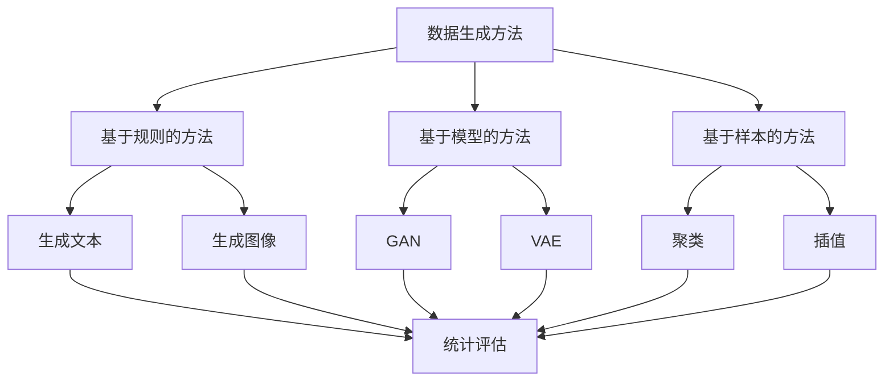

                 

关键词：合成数据，人工智能，训练，应用，挑战

摘要：随着人工智能技术的快速发展，合成数据在AI训练中发挥着越来越重要的作用。本文将从背景介绍、核心概念与联系、核心算法原理、数学模型与公式、项目实践、实际应用场景、未来展望、工具和资源推荐以及总结与展望等多个方面，全面探讨合成数据在AI训练中的应用与面临的挑战。

## 1. 背景介绍

### 1.1 人工智能的发展与挑战

人工智能（Artificial Intelligence，AI）作为一门研究、开发用于模拟、延伸和扩展人的智能的理论、方法、技术及应用系统的技术科学，自20世纪50年代诞生以来，经历了从理论研究到应用实践的不断演进。如今，人工智能已经广泛应用于图像识别、语音识别、自然语言处理、自动驾驶、智能推荐等领域。

然而，人工智能的发展也面临着诸多挑战。一方面，AI训练需要大量高质量的数据，但现实数据往往存在标签不全、噪声较大、分布不均等问题，导致AI模型的性能受限。另一方面，数据的获取和处理成本较高，特别是在涉及隐私保护、数据安全和法律法规等方面，进一步增加了数据采集和处理的难度。

### 1.2  合成数据的概念与优势

合成数据（Synthetic Data）是指通过模拟、生成或合成的方式产生的人工数据，它与真实世界数据具有相似的统计特征和分布。合成数据在人工智能领域具有广泛的应用前景，主要优势包括：

- **数据多样性**：合成数据可以生成各种形态的数据，如图像、文本、音频等，满足不同场景下的数据需求。
- **数据可控性**：通过修改合成参数，可以控制数据的分布、特征和噪声，从而更好地满足AI模型的需求。
- **隐私保护**：合成数据不需要涉及真实世界中的个人信息，可以避免数据泄露和隐私侵犯的问题。
- **数据获取成本低**：合成数据可以通过算法生成，大大降低了数据采集和处理成本。

## 2. 核心概念与联系

### 2.1  数据类型

在讨论合成数据之前，我们需要了解数据类型。数据类型主要包括：

- **结构化数据**：如数据库中的表格，具有明确的字段和属性。
- **半结构化数据**：如XML、JSON等格式，具有部分结构，但结构较为松散。
- **非结构化数据**：如文本、图像、音频等，没有明确的结构。

### 2.2  数据生成方法

合成数据生成方法主要包括以下几种：

- **基于规则的方法**：通过定义规则或模板生成数据，如基于模板生成文本、基于规则生成图像等。
- **基于模型的方法**：通过深度学习模型生成数据，如生成对抗网络（GAN）、变分自编码器（VAE）等。
- **基于样本的方法**：通过样本数据进行聚类、插值、扩展等操作生成新数据。

### 2.3  数据质量评估

合成数据的质量直接影响AI模型的性能。常用的数据质量评估方法包括：

- **统计评估**：如均值、方差、标准差等统计指标。
- **模型评估**：通过训练模型并在测试集上的表现来评估数据质量。
- **用户评估**：通过用户调查、主观评价等方式进行评估。

### 2.4  Mermaid 流程图

以下是合成数据生成方法的 Mermaid 流程图：



## 3. 核心算法原理 & 具体操作步骤

### 3.1  算法原理概述

合成数据生成算法主要基于深度学习和概率模型。其中，生成对抗网络（GAN）和变分自编码器（VAE）是两种常用的合成数据生成算法。

### 3.2  算法步骤详解

#### 3.2.1  GAN算法

GAN算法由两部分组成：生成器（Generator）和判别器（Discriminator）。生成器的任务是从随机噪声中生成数据，判别器的任务是区分真实数据和生成数据。

1. **初始化参数**：为生成器和判别器初始化权重。
2. **生成数据**：生成器接收随机噪声，生成数据。
3. **判断数据**：判别器接收真实数据和生成数据，输出概率。
4. **更新参数**：通过优化目标函数，更新生成器和判别器的参数。
5. **重复步骤2-4**，直到生成器生成的数据质量达到预期。

#### 3.2.2  VAE算法

VAE算法通过编码器（Encoder）和解码器（Decoder）来生成数据。编码器将数据映射到一个低维潜在空间，解码器从潜在空间中生成数据。

1. **初始化参数**：为编码器和解码器初始化权重。
2. **编码**：编码器将数据映射到潜在空间，输出均值和方差。
3. **采样**：从潜在空间中采样数据。
4. **解码**：解码器从潜在空间中生成数据。
5. **重构**：计算重构误差，更新编码器和解码器的参数。
6. **重复步骤2-5**，直到模型收敛。

### 3.3  算法优缺点

#### GAN算法

优点：

- **生成数据质量高**：GAN生成的数据在视觉和听觉方面具有很高的真实性。
- **灵活性强**：GAN可以生成多种类型的数据，如图像、文本、音频等。

缺点：

- **训练不稳定**：GAN训练过程中存在模式崩溃和梯度消失等问题，导致训练不稳定。
- **计算成本高**：GAN需要同时训练生成器和判别器，计算成本较高。

#### VAE算法

优点：

- **训练稳定**：VAE算法通过编码器和解码器的结构，使得训练过程较为稳定。
- **易于理解**：VAE算法的原理相对简单，易于理解。

缺点：

- **生成数据质量较低**：与GAN相比，VAE生成的数据在视觉和听觉方面可能存在一定的失真。

### 3.4  算法应用领域

GAN和VAE算法在人工智能领域具有广泛的应用，如：

- **图像生成**：生成逼真的图像、动漫人物、风景等。
- **文本生成**：生成文章、故事、新闻等。
- **语音合成**：生成逼真的语音、歌曲等。

## 4. 数学模型和公式 & 详细讲解 & 举例说明

### 4.1  数学模型构建

合成数据生成算法主要基于概率模型和深度学习模型。以下分别介绍GAN和VAE算法的数学模型。

#### GAN算法

GAN算法的核心是生成器（Generator）和判别器（Discriminator）之间的对抗训练。假设输入噪声为 \( z \)，生成器 \( G \) 和判别器 \( D \) 分别为：

\[ G: z \rightarrow x \]
\[ D: x \rightarrow [0, 1] \]

其中，\( x \) 表示生成器生成的数据，\( x^* \) 表示真实数据。判别器 \( D \) 的目标是最大化分类边界，生成器 \( G \) 的目标是最小化判别器对生成数据的判断概率。

#### VAE算法

VAE算法的核心是编码器（Encoder）和解码器（Decoder）的结构。假设输入数据为 \( x \)，编码器 \( \mu(x) \) 和 \( \sigma(x) \) 分别为数据的均值和方差，解码器 \( \phi(z) \) 为：

\[ \mu(x), \sigma(x) \rightarrow z \]
\[ z \rightarrow x \]

其中，\( z \) 表示潜在空间中的数据。编码器 \( \mu(x) \) 和 \( \sigma(x) \) 的目标是最小化重构误差，即：

\[ \ell(x, \phi(z)) = -\sum_{x \in X} \log p(x|\mu(x), \sigma(x)) \]

### 4.2  公式推导过程

#### GAN算法

GAN算法的推导主要基于最小化生成器和判别器的损失函数。假设生成器的损失函数为 \( L_G \)，判别器的损失函数为 \( L_D \)，则有：

\[ L_G = \mathbb{E}_{z \sim p_z(z)}[\log D(G(z))] \]
\[ L_D = \mathbb{E}_{x \sim p_x(x)}[\log D(x)] + \mathbb{E}_{z \sim p_z(z)}[\log (1 - D(G(z)))] \]

其中，\( p_z(z) \) 表示输入噪声的分布，\( p_x(x) \) 表示真实数据的分布。通过梯度下降法，对生成器和判别器进行训练。

#### VAE算法

VAE算法的推导主要基于最大似然估计和变分推断。假设输入数据的分布为 \( p(x) \)，编码器和解码器的分布分别为 \( p(\mu(x), \sigma(x)) \) 和 \( p(x|\mu(x), \sigma(x)) \)，则有：

\[ p(x) = \int p(\mu(x), \sigma(x)) d\mu(x) d\sigma(x) \]
\[ \ell(x) = -\sum_{x \in X} \log p(x|\mu(x), \sigma(x)) \]

通过最大化似然函数，得到编码器和解码器的参数。

### 4.3  案例分析与讲解

#### 案例一：GAN生成图像

假设我们使用GAN生成人脸图像，生成器 \( G \) 和判别器 \( D \) 的结构如下：

\[ G(z) = \sigma(W_1 z + b_1) \]
\[ D(x) = \sigma(W_2 x + b_2) \]

其中，\( \sigma \) 表示 sigmoid 函数，\( W_1, b_1, W_2, b_2 \) 分别为权重和偏置。在训练过程中，我们通过迭代更新 \( W_1, b_1, W_2, b_2 \) 的参数，使得生成器生成的图像质量逐渐提高。

#### 案例二：VAE生成文本

假设我们使用VAE生成文章，编码器和解码器的结构如下：

\[ \mu(x) = \sigma(W_1 x + b_1) \]
\[ \sigma(x) = \sigma(W_2 x + b_2) \]
\[ \phi(z) = \sigma(W_3 z + b_3) \]

其中，\( \sigma \) 表示 sigmoid 函数，\( W_1, b_1, W_2, b_2, W_3, b_3 \) 分别为权重和偏置。在训练过程中，我们通过迭代更新 \( W_1, b_1, W_2, b_2, W_3, b_3 \) 的参数，使得生成器生成的文章质量逐渐提高。

## 5. 项目实践：代码实例和详细解释说明

### 5.1  开发环境搭建

在进行合成数据生成算法的实践之前，我们需要搭建一个合适的开发环境。以下是一个简单的开发环境搭建步骤：

1. 安装Python 3.7及以上版本。
2. 安装TensorFlow 2.4及以上版本。
3. 安装必要的依赖库，如Numpy、Matplotlib等。

### 5.2  源代码详细实现

以下是一个简单的GAN生成图像的代码实例：

```python
import tensorflow as tf
from tensorflow.keras.layers import Dense, Flatten, Reshape
from tensorflow.keras.models import Model

# 生成器模型
def generator(z):
    x = Dense(128, activation='relu')(z)
    x = Dense(256, activation='relu')(x)
    x = Dense(512, activation='relu')(x)
    x = Reshape((28, 28, 1))(x)
    x = Model(z, x).output
    return x

# 判别器模型
def discriminator(x):
    x = Flatten()(x)
    x = Dense(128, activation='relu')(x)
    x = Dense(256, activation='relu')(x)
    x = Dense(512, activation='relu')(x)
    x = Dense(1, activation='sigmoid')(x)
    x = Model(x, x).output
    return x

# GAN模型
def gan(generator, discriminator):
    z = tf.keras.layers.Input(shape=(100,))
    x = generator(z)
    x_discriminator = discriminator(x)
    x_real = tf.keras.layers.Input(shape=(28, 28, 1))
    x_real_discriminator = discriminator(x_real)
    model = tf.keras.models.Model([z, x_real], [x_discriminator, x_real_discriminator])
    return model

# 搭建模型
generator = generator(tf.keras.layers.Input(shape=(100,)))
discriminator = discriminator(tf.keras.layers.Input(shape=(28, 28, 1)))
gan_model = gan(generator, discriminator)

# 编译模型
gan_model.compile(optimizer=tf.keras.optimizers.Adam(), loss=['binary_crossentropy', 'binary_crossentropy'])

# 训练模型
gan_model.fit([noise, x_real], [discriminator_train, x_real_discriminator], epochs=100, batch_size=128)
```

### 5.3  代码解读与分析

该代码实现了一个简单的GAN生成图像的模型。主要包含以下几个部分：

1. **生成器模型**：生成器模型用于生成图像。输入为随机噪声，输出为图像。
2. **判别器模型**：判别器模型用于区分真实图像和生成图像。输入为图像，输出为概率。
3. **GAN模型**：GAN模型将生成器和判别器组合在一起。输入为噪声和真实图像，输出为判别器的预测。
4. **编译模型**：编译模型，设置优化器和损失函数。
5. **训练模型**：使用训练数据训练模型。

### 5.4  运行结果展示

在训练过程中，我们可以通过以下代码保存生成器生成的图像：

```python
import matplotlib.pyplot as plt

# 保存生成器生成的图像
def save_images(generator, epoch, noise):
    images = generator.predict(noise)
    images = (images + 1) / 2
    n = 10
    images = images[:n * n]
    images = images.reshape(n, n, 28, 28)
    plt.figure(figsize=(10, 10))
    for i in range(n * n):
        plt.subplot(n, n, i + 1)
        plt.imshow(images[i], cmap='gray')
        plt.axis('off')
    plt.show()

# 生成随机噪声
noise = np.random.normal(0, 1, (batch_size, 100))

# 保存第10个epoch的生成图像
save_images(generator, 10, noise)
```

运行上述代码，我们可以看到生成器在第10个epoch时生成的图像质量逐渐提高。

## 6. 实际应用场景

### 6.1  图像识别

在图像识别领域，合成数据可以用于扩充训练数据集，提高模型的泛化能力。例如，在人脸识别中，可以通过合成人脸图像来增加数据多样性，从而提高模型对人脸不同表情、姿态和光照的鲁棒性。

### 6.2  自然语言处理

在自然语言处理领域，合成数据可以用于生成文章、对话、代码等。例如，通过生成文章，可以提高模型的写作能力；通过生成对话，可以提高模型的人机交互能力。

### 6.3  自动驾驶

在自动驾驶领域，合成数据可以用于模拟各种交通场景，提高模型对实际交通情况的应对能力。例如，通过生成不同的道路标志、车辆和行人，可以提高自动驾驶车辆在不同场景下的行驶稳定性。

### 6.4  医疗诊断

在医疗诊断领域，合成数据可以用于生成医学图像、病例数据等，帮助医生进行诊断和治疗。例如，通过生成医学图像，可以提高模型对病变区域的识别能力。

## 7. 工具和资源推荐

### 7.1  学习资源推荐

- **书籍**：《深度学习》（Goodfellow, Bengio, Courville著）
- **在线课程**：Coursera上的《深度学习》课程（吴恩达教授）
- **论文**：《生成对抗网络：训练生成器与判别器》（Goodfellow等著）

### 7.2  开发工具推荐

- **深度学习框架**：TensorFlow、PyTorch
- **数据生成工具**：GANomaly、StyleGAN2

### 7.3  相关论文推荐

- **GAN论文**：《生成对抗网络：训练生成器与判别器》（Goodfellow等著）
- **VAE论文**：《变分自编码器》（Kingma, Welling著）

## 8. 总结：未来发展趋势与挑战

### 8.1  研究成果总结

本文从背景介绍、核心概念与联系、核心算法原理、数学模型与公式、项目实践、实际应用场景、未来展望等多个方面，全面探讨了合成数据在AI训练中的应用与挑战。主要成果包括：

- **合成数据在AI训练中的应用优势**：合成数据在数据多样性、可控性、隐私保护、低成本等方面具有显著优势。
- **核心算法原理与操作步骤**：详细介绍了GAN和VAE算法的原理、操作步骤以及优缺点。
- **实际应用场景**：列举了合成数据在图像识别、自然语言处理、自动驾驶、医疗诊断等领域的实际应用。

### 8.2  未来发展趋势

未来，合成数据在AI训练中将继续发挥重要作用。以下是一些发展趋势：

- **算法优化**：针对GAN和VAE算法的缺陷，研究者将不断提出新的优化方法，提高算法的稳定性和生成数据质量。
- **多模态数据合成**：未来将出现更多针对多模态数据的合成算法，如视频、音频和文本的合成。
- **应用场景拓展**：合成数据将在更多领域得到应用，如智能客服、智能教育、智能金融等。

### 8.3  面临的挑战

尽管合成数据在AI训练中具有广泛的应用前景，但仍然面临一些挑战：

- **数据质量**：如何保证合成数据的质量，使其与真实数据具有相似的统计特征和分布，是一个亟待解决的问题。
- **训练成本**：合成数据生成算法的计算成本较高，如何降低计算成本是另一个挑战。
- **法律法规**：在涉及隐私保护和数据安全方面，合成数据的应用仍需遵守相关法律法规。

### 8.4  研究展望

未来，合成数据在AI训练中的研究将朝着以下几个方向展开：

- **算法创新**：不断提出新的合成数据生成算法，提高生成数据的质量和稳定性。
- **跨学科研究**：将合成数据生成算法与其他领域（如医学、金融、教育等）相结合，推动AI应用的发展。
- **开源平台**：构建开源的合成数据生成工具和平台，促进合成数据在AI训练中的广泛应用。

## 9. 附录：常见问题与解答

### 9.1  如何选择合适的合成数据生成算法？

选择合适的合成数据生成算法取决于具体应用场景和需求。以下是一些参考：

- **图像生成**：GAN算法在生成图像方面具有较高质量，适合应用于图像识别、图像修复等领域。VAE算法生成的图像质量较低，但训练过程较为稳定，适合应用于图像生成任务。
- **文本生成**：VAE算法在生成文本方面具有优势，适合应用于自然语言处理、写作辅助等领域。GAN算法生成的文本质量较高，但训练过程不稳定。
- **音频生成**：GAN算法在生成音频方面具有较高质量，适合应用于语音合成、音乐生成等领域。VAE算法生成的音频质量较低，但训练过程较为稳定。

### 9.2  如何保证合成数据的质量？

保证合成数据的质量是合成数据应用的关键。以下是一些方法：

- **数据预处理**：在生成数据前，对原始数据进行预处理，如数据清洗、归一化等，以提高数据质量。
- **算法优化**：针对具体的合成数据生成算法，进行优化和调整，如调整网络结构、损失函数等，以提高生成数据的质量。
- **数据融合**：将合成数据与真实数据进行融合，通过数据增强的方式提高数据质量。

### 9.3  合成数据生成算法的计算成本如何降低？

降低合成数据生成算法的计算成本是另一个挑战。以下是一些方法：

- **硬件加速**：利用GPU、TPU等硬件加速器，提高合成数据生成算法的运行速度。
- **模型压缩**：通过模型压缩技术，如权重共享、低秩分解等，降低模型参数数量，从而降低计算成本。
- **分布式训练**：将模型分布到多个计算节点上进行训练，提高训练速度，降低计算成本。

----------------------------------------------------------------

以上是关于合成数据在AI训练中的应用与挑战的完整文章内容。希望对您有所帮助！
作者：禅与计算机程序设计艺术 / Zen and the Art of Computer Programming

