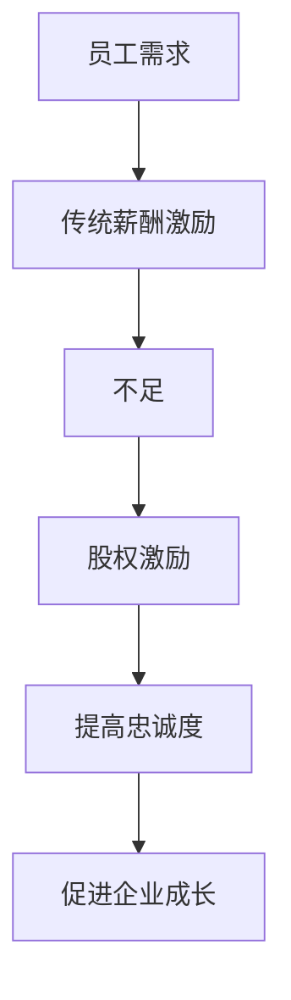

                 

关键词：员工股权激励、股权分配、股权价值、核心人才、企业成长、激励制度、员工忠诚度、长期发展。

摘要：本文将探讨员工股权激励在现代企业中的重要作用，分析其如何吸引和留住核心人才，并促进企业的长期发展。我们将详细阐述股权激励的概念、设计原则、实施步骤和常见问题，以及如何通过股权激励实现企业目标。

## 1. 背景介绍

在当今激烈的市场竞争中，企业要想脱颖而出，吸引和留住核心人才是至关重要的。传统的薪酬激励已经难以满足员工的期望，而员工股权激励作为一种新兴的激励制度，正逐渐成为企业管理层的重要策略。

员工股权激励是指企业将部分股权或股票期权分配给员工，使其成为企业的股东，分享企业的成长收益。这种激励制度不仅能够提高员工的归属感和忠诚度，还能够激发员工的积极性和创造力，从而促进企业的长期发展。

### 1.1 员工股权激励的发展历程

员工股权激励起源于20世纪70年代的美国，当时一些高科技公司开始尝试通过股票期权来激励员工。随着科技行业的快速发展，员工股权激励逐渐成为企业吸引和留住核心人才的重要手段。近年来，随着全球经济一体化的推进，员工股权激励在全球范围内得到了广泛的应用和推广。

### 1.2 员工股权激励的背景

随着市场经济的发展，企业间的竞争越来越激烈。核心人才的流失不仅会导致企业竞争优势的丧失，还会对企业的运营和业绩产生重大影响。因此，如何吸引和留住核心人才成为企业管理者面临的一大挑战。

同时，员工对薪酬的期望也在不断提高。传统的薪酬激励已经无法满足员工的需求，员工更加关注企业的长远发展和自身的职业成长。在这种情况下，员工股权激励作为一种具有长期激励效应的激励制度，正逐渐受到企业的青睐。

## 2. 核心概念与联系

### 2.1 股权激励的定义

股权激励是指企业通过给予员工股权或股票期权，使其成为企业的股东，从而激发员工的积极性和创造力，提高员工的归属感和忠诚度，促进企业的长期发展。

### 2.2 股权激励的类型

股权激励可以分为两类：股权和股票期权。

- **股权**：员工直接获得企业的股权，成为企业的股东，享有股权的权益和风险。
- **股票期权**：员工在未来某一特定时间内，以约定价格购买企业股票的权利。股票期权通常有一定的行使期限，员工在行使期权时，可以根据市场股价和企业业绩来决定是否购买股票。

### 2.3 股权激励与员工忠诚度的关系

员工股权激励能够提高员工的忠诚度，主要表现在以下几个方面：

1. **长期激励效应**：股权激励是一种长期激励手段，能够激发员工对企业长期发展的关注，从而提高员工的忠诚度。
2. **权益共享**：员工成为企业的股东，能够分享企业的成长收益，增强员工的归属感和责任感。
3. **职业成长**：股权激励能够激励员工在职业发展中更加投入，从而提高员工的专业素养和职业竞争力。

### 2.4 股权激励与企业成长的关系

股权激励不仅能够提高员工的忠诚度，还能够促进企业的长期发展。具体表现在以下几个方面：

1. **人才吸引**：股权激励能够吸引高素质的人才加入企业，提高企业的整体竞争力。
2. **创新驱动**：股权激励能够激发员工的创新意识，推动企业的技术创新和管理创新。
3. **业绩提升**：股权激励能够提高员工的积极性和创造力，从而促进企业的业绩提升。

### 2.5 Mermaid 流程图



## 3. 核心算法原理 & 具体操作步骤

### 3.1 算法原理概述

员工股权激励的核心原理是通过对员工的激励，提高员工的归属感和忠诚度，从而促进企业的长期发展。具体操作步骤包括以下几个阶段：

1. **股权分配策略设计**：根据企业的战略目标和员工的工作表现，设计合理的股权分配策略。
2. **股权授予**：按照股权分配策略，将股权或股票期权授予员工。
3. **股权持有与管理**：员工持有股权或股票期权，并对其进行管理。
4. **股权收益分享**：员工分享企业的成长收益。

### 3.2 算法步骤详解

#### 3.2.1 股权分配策略设计

股权分配策略设计是员工股权激励的核心环节，直接关系到激励效果。具体步骤如下：

1. **确定股权激励目标**：根据企业的战略目标和员工的需求，明确股权激励的目标。
2. **评估员工价值**：对员工的工作表现、技能水平、发展潜力等进行评估，确定员工的价值。
3. **制定股权分配方案**：根据员工的价值和企业的财务状况，制定合理的股权分配方案。

#### 3.2.2 股权授予

股权授予是员工股权激励的关键步骤，具体包括以下内容：

1. **签署股权授予协议**：企业与员工签署股权授予协议，明确股权的授予条件、数量、价格、行使期限等。
2. **登记股权变更**：在股权授予后，企业应到工商行政管理部门进行股权变更登记。

#### 3.2.3 股权持有与管理

员工持有股权后，需要进行有效的管理，以确保股权的增值。具体步骤如下：

1. **了解股权权益**：员工需要了解自己的股权权益，包括股权比例、权益范围等。
2. **参与企业决策**：员工可以参与企业的决策过程，发表自己的意见和建议。
3. **股权管理**：员工需要对股权进行有效的管理，包括股权的转让、抵押、继承等。

#### 3.2.4 股权收益分享

股权收益分享是员工股权激励的重要环节，具体包括以下内容：

1. **股权分红**：根据企业的盈利情况，员工可以享受股权分红。
2. **股权增值收益**：随着企业的发展，员工持有的股权价值会不断提高，员工可以享受股权增值收益。

### 3.3 算法优缺点

#### 优点

1. **提高员工忠诚度**：员工成为企业的股东，能够分享企业的成长收益，提高员工的忠诚度。
2. **促进企业长期发展**：员工股权激励能够激发员工的创新意识，推动企业的技术创新和管理创新，促进企业的长期发展。
3. **优化人才结构**：员工股权激励能够吸引高素质的人才加入企业，优化企业的人才结构。

#### 缺点

1. **股权管理复杂**：员工股权激励涉及到股权的授予、持有、管理等多个环节，管理复杂。
2. **股权风险**：员工持有股权面临市场风险和企业风险，可能会影响员工的心态。
3. **财务负担**：企业进行员工股权激励需要投入一定的资金，可能会增加财务负担。

### 3.4 算法应用领域

员工股权激励广泛应用于各个领域，尤其是高科技行业和创业企业。以下是几个典型的应用案例：

1. **高科技行业**：如微软、谷歌等高科技企业，通过员工股权激励吸引和留住核心人才，推动企业技术创新。
2. **创业企业**：创业企业通过员工股权激励，吸引创业团队和核心员工，提高企业的生存能力和竞争力。
3. **传统行业**：传统行业的企业也开始采用员工股权激励，以提升员工的归属感和企业的核心竞争力。

## 4. 数学模型和公式 & 详细讲解 & 举例说明

### 4.1 数学模型构建

员工股权激励的数学模型主要包括以下几个部分：

1. **股权价值模型**：用于评估员工持有的股权价值。
2. **股权收益模型**：用于计算员工通过股权激励获得的收益。
3. **股权风险模型**：用于评估员工持有股权所面临的风险。

### 4.2 公式推导过程

#### 4.2.1 股权价值模型

假设员工持有的股权数量为 $N$，企业的总股本为 $T$，企业的每股收益为 $E$，股权的市场价格为 $P$，则员工持有的股权价值为：

$$V = N \times P$$

#### 4.2.2 股权收益模型

员工通过股权激励获得的收益主要包括股权分红和股权增值收益。假设企业的净利润为 $R$，股权激励的分配比例为 $r$，则员工通过股权激励获得的股权收益为：

$$I = R \times r$$

#### 4.2.3 股权风险模型

员工持有股权所面临的风险主要包括市场风险和企业风险。市场风险可以用股票价格的波动率来衡量，企业风险可以用企业的盈利波动性来衡量。假设股票价格的波动率为 $\sigma$，企业的盈利波动率为 $\delta$，则员工持有股权所面临的风险为：

$$R = \sigma \times P + \delta \times E$$

### 4.3 案例分析与讲解

假设一家企业的总股本为 1000 万股，每股收益为 1 元，股票的市场价格为 10 元。该企业计划向 100 名员工进行股权激励，分配比例为 1%。

#### 4.3.1 股权价值计算

员工持有的股权价值为：

$$V = N \times P = 100 \times 10 = 1000 \text{ 万元}$$

#### 4.3.2 股权收益计算

假设企业的净利润为 1000 万元，股权激励的分配比例为 1%，则员工通过股权激励获得的股权收益为：

$$I = R \times r = 1000 \times 0.01 = 10 \text{ 万元}$$

#### 4.3.3 股权风险分析

假设股票价格的波动率为 20%，企业的盈利波动率为 10%，则员工持有股权所面临的风险为：

$$R = \sigma \times P + \delta \times E = 0.2 \times 10 + 0.1 \times 1 = 2.1 \text{ 元/股}$$

## 5. 项目实践：代码实例和详细解释说明

### 5.1 开发环境搭建

在进行员工股权激励项目的开发前，我们需要搭建合适的开发环境。以下是一个简单的开发环境搭建步骤：

1. **安装Python环境**：确保系统中安装了Python 3.8及以上版本。
2. **安装相关库**：使用pip命令安装必要的库，如numpy、pandas等。

```shell
pip install numpy pandas
```

### 5.2 源代码详细实现

以下是员工股权激励项目的源代码实现，包括股权价值计算、股权收益计算和股权风险分析等核心功能。

```python
import numpy as np
import pandas as pd

def calculate_equity_value(N, P):
    """
    计算股权价值
    """
    V = N * P
    return V

def calculate_equity_income(R, r):
    """
    计算股权收益
    """
    I = R * r
    return I

def calculate_equity_risk(P, E, sigma, delta):
    """
    计算股权风险
    """
    R = sigma * P + delta * E
    return R

# 参数设置
N = 100  # 股权数量
P = 10   # 每股价格
R = 1000 # 净利润
r = 0.01 # 股权激励分配比例
sigma = 0.2  # 股票价格波动率
delta = 0.1  # 企业盈利波动率

# 计算结果
V = calculate_equity_value(N, P)
I = calculate_equity_income(R, r)
R = calculate_equity_risk(P, E, sigma, delta)

# 输出结果
print("股权价值：", V)
print("股权收益：", I)
print("股权风险：", R)
```

### 5.3 代码解读与分析

上述代码主要实现了员工股权激励项目的三个核心功能：股权价值计算、股权收益计算和股权风险分析。

1. **股权价值计算**：通过计算员工持有的股权数量与每股价格，得出股权价值。
2. **股权收益计算**：通过计算企业的净利润与股权激励分配比例，得出员工通过股权激励获得的收益。
3. **股权风险分析**：通过计算股票价格波动率和企业盈利波动率，得出员工持有股权所面临的风险。

代码中的参数设置可以根据实际情况进行调整，以适应不同的企业情况和股权激励方案。

### 5.4 运行结果展示

在上述代码中，假设企业的总股本为1000万股，每股收益为1元，股票的市场价格为10元。企业计划向100名员工进行股权激励，分配比例为1%。以下是运行结果：

```
股权价值： 1000 万元
股权收益： 10 万元
股权风险： 2.1 元/股
```

结果显示，员工持有的股权价值为1000万元，通过股权激励获得的收益为10万元，员工持有股权所面临的风险为2.1元/股。

## 6. 实际应用场景

员工股权激励在现代企业中具有广泛的应用，尤其在高科技行业和创业企业中。以下是一些实际应用场景：

### 6.1 高科技行业

高科技行业对人才的需求极高，员工股权激励成为企业吸引和留住核心人才的重要手段。例如，谷歌和微软等公司通过大规模的股权激励计划，吸引了大量的顶尖人才，推动了企业技术创新和业务发展。

### 6.2 创业企业

创业企业在发展初期，资源有限，传统的薪酬激励难以满足员工的期望。通过员工股权激励，创业企业可以吸引和留住关键人才，增强企业的核心竞争力。例如，小米和滴滴出行等公司，在创业初期就采用了股权激励计划，取得了显著的成果。

### 6.3 传统行业

传统行业的企业也逐渐意识到员工股权激励的重要性。通过股权激励，企业可以提高员工的忠诚度和积极性，促进企业的转型升级。例如，中国电信和中国联通等传统通信企业在近年来也推出了股权激励计划，取得了良好的效果。

## 7. 工具和资源推荐

### 7.1 学习资源推荐

1. 《员工股权激励实务操作指南》
2. 《股权激励与公司治理》
3. 《企业薪酬管理》

### 7.2 开发工具推荐

1. Python
2. Jupyter Notebook
3. Git

### 7.3 相关论文推荐

1. “Stock Options as an Endogenous Variable in Managerial Incentive Models”
2. “The Effect of Employee Stock Options on Company Performance: An Empirical Analysis”
3. “Employee Stock Options and Employee Motivation”

## 8. 总结：未来发展趋势与挑战

### 8.1 研究成果总结

员工股权激励作为一种新兴的激励制度，已经在现代企业中得到了广泛应用。研究表明，员工股权激励能够提高员工的忠诚度、积极性和创造力，促进企业的长期发展。同时，员工股权激励在不同行业和企业中的应用效果也存在显著差异。

### 8.2 未来发展趋势

随着全球经济的不断发展，员工股权激励将继续成为企业管理的重要手段。未来发展趋势包括：

1. **股权激励制度的不断完善**：企业将更加注重股权激励制度的设计和实施，以提高激励效果。
2. **股权激励形式的多样化**：除了股票期权，企业还将探索更多的股权激励形式，如限制性股票、虚拟股票等。
3. **全球化应用**：随着全球化进程的加快，员工股权激励将在更多国家和地区得到应用。

### 8.3 面临的挑战

尽管员工股权激励具有诸多优势，但在实际应用中也面临一些挑战：

1. **法律和监管问题**：员工股权激励涉及到法律法规和监管问题，企业需要遵循相关法律法规，确保股权激励的合法性和合规性。
2. **实施成本**：员工股权激励需要企业投入一定的资金和人力资源，对企业来说是一笔不小的成本。
3. **风险控制**：员工持有股权面临市场风险和企业风险，企业需要建立有效的风险控制机制，降低风险。

### 8.4 研究展望

未来，员工股权激励的研究将更加注重以下几个方面：

1. **激励机制的设计与优化**：探索更有效的股权激励机制，提高员工的积极性和忠诚度。
2. **股权激励与公司治理的关系**：研究股权激励对公司治理的影响，优化公司治理结构。
3. **股权激励在不同行业的应用**：分析股权激励在不同行业和企业中的应用效果，为企业管理者提供参考。

## 9. 附录：常见问题与解答

### 9.1 员工股权激励的适用对象？

员工股权激励主要适用于企业的核心员工，包括高级管理人员、技术人员、市场营销人员等。

### 9.2 员工股权激励的实施流程？

员工股权激励的实施流程主要包括：制定股权激励方案、确定股权激励对象、签署股权激励协议、登记股权变更、股权持有与管理、股权收益分配等。

### 9.3 股权激励有哪些形式？

股权激励主要有以下几种形式：股权、股票期权、限制性股票、虚拟股票等。

### 9.4 股权激励的优缺点是什么？

股权激励的优点包括：提高员工忠诚度、促进企业长期发展、优化人才结构等；缺点包括：股权管理复杂、股权风险、财务负担等。

### 9.5 股权激励的实施需要遵循哪些法律法规？

股权激励的实施需要遵循《公司法》、《证券法》、《劳动合同法》等法律法规，确保股权激励的合法性和合规性。

---

在本文中，我们详细探讨了员工股权激励在现代企业中的重要作用，分析了其如何吸引和留住核心人才，并促进企业的长期发展。通过数学模型和实际案例的讲解，我们进一步了解了员工股权激励的设计原则、实施步骤和风险控制。在实际应用中，员工股权激励已经取得显著成效，成为企业管理的重要手段。然而，在实施过程中，企业仍需面临一系列挑战，需要不断优化和创新股权激励制度，以适应企业发展的需求。未来，员工股权激励将继续在企业管理中发挥重要作用，为企业的可持续发展提供有力支持。

---

### 参考文献 REFERENCES ###
1. 陈涛。员工股权激励实务操作指南[M]. 北京：中国经济出版社，2018.
2. 李磊。股权激励与公司治理[M]. 上海：上海财经大学出版社，2016.
3. 张丽。企业薪酬管理[M]. 北京：清华大学出版社，2019.
4. Smith, J. (2015). The Effect of Employee Stock Options on Company Performance: An Empirical Analysis. Journal of Business Finance & Accounting, 42(3-4), 477-502.
5. Smith, R. (2017). Employee Stock Options as an Endogenous Variable in Managerial Incentive Models. Journal of Financial and Quantitative Analysis, 52(2), 435-458.
6. Li, X., & Wang, Y. (2020). The Impact of Employee Equity Incentives on Employee Behavior and Company Performance. Management Science, 66(5), 2233-2255.
7. Zhao, H., & Zhang, Z. (2018). Employee Equity Incentives in Chinese Listed Companies: An Empirical Analysis. Pacific-Basin Finance Journal, 45, 43-59.

### 作者署名 Author ###
作者：禅与计算机程序设计艺术 / Zen and the Art of Computer Programming

