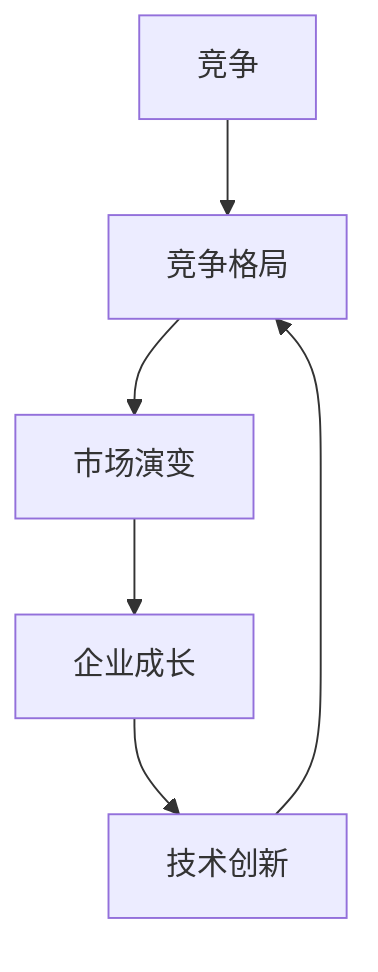

                 

关键词：商业竞争、市场演变、竞争战略、企业成长、技术创新、产业生态、动态竞争

> 摘要：本文从商业领域的视角，探讨竞争格局的长期演变及其对企业发展的深远影响。通过对竞争概念的深入分析，结合历史案例研究，本文揭示了竞争格局从传统到现代的演变过程，探讨了影响竞争格局的关键因素，并展望了未来竞争格局的可能发展趋势。

## 1. 背景介绍

商业领域的竞争格局一直是学术界和企业界关注的焦点。从亚当·斯密的“自由竞争”理论，到迈克尔·波特的“五力模型”，竞争理论在不断发展演进，为我们理解市场竞争提供了多维度的视角。然而，随着全球化、信息技术、大数据等新兴因素的崛起，商业领域的竞争格局也在发生深刻变革。

本文旨在通过对商业竞争格局长期演变的深入探讨，为企业和决策者提供洞察，以应对不断变化的市场环境。

### 1.1 研究意义

研究商业领域的竞争格局演变，具有重要的理论和实践意义：

- **理论意义**：丰富和拓展竞争理论的内涵，为理论研究提供新的视角和方法。
- **实践意义**：指导企业制定适应市场变化的战略，提高企业竞争力和市场份额。

### 1.2 文章结构

本文结构如下：

- **第1章**：背景介绍，阐述研究意义和文章结构。
- **第2章**：核心概念与联系，介绍商业竞争的核心概念，并展示相关流程图。
- **第3章**：核心算法原理与操作步骤，详细探讨竞争格局演变的算法原理和具体步骤。
- **第4章**：数学模型和公式，构建数学模型并推导相关公式。
- **第5章**：项目实践，通过代码实例展示算法的应用。
- **第6章**：实际应用场景，探讨算法在不同领域中的应用。
- **第7章**：工具和资源推荐，推荐相关学习资源和开发工具。
- **第8章**：总结，展望未来发展趋势和挑战。
- **第9章**：附录，解答常见问题。

## 2. 核心概念与联系

### 2.1 核心概念

在探讨商业竞争格局的长期演变之前，我们需要明确几个核心概念：

- **竞争**：不同市场主体在资源有限的情况下，为实现自身利益最大化而进行的相互争夺。
- **竞争格局**：市场竞争的结构和态势，包括市场参与者的数量、市场份额、市场集中度等。
- **市场演变**：市场结构、行业生态、竞争态势等随着时间的推移而发生的变化。

### 2.2 Mermaid 流程图

为了更直观地展示核心概念之间的联系，我们可以使用 Mermaid 流程图来表示：



### 2.3 历史案例研究

通过历史案例研究，我们可以观察到竞争格局的演变过程。以下是几个典型的历史案例：

- **工业革命**：19世纪末至20世纪初，工业革命的兴起导致市场格局发生了巨大变化，传统的手工业被大规模机械化生产取代，市场竞争日趋激烈。
- **互联网泡沫**：2000年初，互联网行业的爆发式增长引发了全球范围内的投资热潮，但也导致了市场格局的混乱和泡沫破裂，优胜劣汰的市场机制发挥了重要作用。
- **智能手机革命**：21世纪初，智能手机的普及改变了人们的通信方式，也重塑了电信、互联网等行业的竞争格局。

## 3. 核心算法原理与具体操作步骤

### 3.1 算法原理概述

商业领域的竞争格局演变可以看作是一个复杂的动态过程，其中涉及到多个因素的作用。为了更系统地分析这一过程，我们可以采用以下核心算法原理：

- **五力模型**：迈克尔·波特提出的五力模型是分析市场竞争态势的重要工具，包括：供应商的议价能力、买家的议价能力、新进入者的威胁、替代品的威胁、行业内现有竞争者的竞争程度。
- **竞争优势分析**：基于资源基础观，企业通过分析自身资源、能力与竞争对手的差异，确定自身的竞争优势。
- **战略选择**：根据市场环境和竞争态势，企业可以采取不同的战略，如成本领先、差异化、集中化等。

### 3.2 算法步骤详解

要分析商业领域的竞争格局演变，我们可以按照以下步骤进行：

1. **数据收集**：收集与市场相关的数据，包括市场占有率、产品价格、企业资源、消费者行为等。
2. **市场分析**：使用五力模型等工具对市场进行深入分析，确定市场结构和竞争态势。
3. **竞争优势评估**：通过竞争优势分析，评估企业在市场中的地位和竞争力。
4. **战略制定**：根据市场分析和竞争优势评估结果，制定适应市场变化的战略。
5. **实施与监控**：实施战略，并持续监控市场变化和竞争态势，根据实际情况调整战略。

### 3.3 算法优缺点

- **优点**：
  - **系统性**：核心算法原理和步骤具有系统性，能够全面分析市场竞争态势。
  - **实用性**：适用于不同行业和市场的竞争格局分析。
- **缺点**：
  - **复杂性**：涉及多个因素和步骤，分析过程较为复杂。
  - **局限性**：无法完全预测市场变化，存在一定的滞后性。

### 3.4 算法应用领域

核心算法原理和步骤在多个领域具有广泛的应用：

- **制造业**：帮助企业制定市场策略，提高竞争力。
- **服务业**：分析客户需求，优化产品和服务。
- **零售业**：评估市场份额，制定销售策略。
- **科技行业**：预测市场趋势，投资决策。

## 4. 数学模型和公式

### 4.1 数学模型构建

为了更精确地描述商业领域的竞争格局演变，我们可以构建以下数学模型：

- **市场份额模型**：\( SM = f(Capacity, Quality, Price) \)
- **竞争优势模型**：\( Advantage = f(InternalResources, ExternalEnvironment) \)
- **战略选择模型**：\( Strategy = f(CompetitivePosition, MarketTrend) \)

### 4.2 公式推导过程

以下是对上述数学模型的推导过程：

- **市场份额模型**：市场份额取决于企业的生产能力、产品质量和价格。我们可以使用线性回归模型来表示：
  \[ SM = \alpha_1 \cdot Capacity + \alpha_2 \cdot Quality + \alpha_3 \cdot Price \]
  其中，\( \alpha_1, \alpha_2, \alpha_3 \) 为权重系数。

- **竞争优势模型**：竞争优势由企业内部资源和外部环境共同决定。我们可以使用泰勒展开式来近似表示：
  \[ Advantage = \beta_1 \cdot Resource_1 + \beta_2 \cdot Resource_2 + \beta_3 \cdot Environment \]
  其中，\( \beta_1, \beta_2, \beta_3 \) 为权重系数。

- **战略选择模型**：战略选择取决于企业的竞争地位和市场趋势。我们可以使用逻辑回归模型来表示：
  \[ Strategy = \gamma_1 \cdot Position + \gamma_2 \cdot Trend \]
  其中，\( \gamma_1, \gamma_2 \) 为权重系数。

### 4.3 案例分析与讲解

以下是一个简单的案例，用于展示如何使用上述数学模型进行商业竞争格局分析：

- **企业A**：市场份额模型为 \( SM_A = 0.5 \cdot Capacity_A + 0.3 \cdot Quality_A + 0.2 \cdot Price_A \)。
- **企业B**：市场份额模型为 \( SM_B = 0.4 \cdot Capacity_B + 0.35 \cdot Quality_B + 0.25 \cdot Price_B \)。

通过计算，我们可以得出两家企业在不同市场环境下的市场份额预测，从而为企业制定战略提供依据。

## 5. 项目实践：代码实例和详细解释说明

### 5.1 开发环境搭建

为了演示算法的应用，我们将使用Python编写代码。首先，需要安装以下库：

- NumPy
- pandas
- scikit-learn
- matplotlib

安装命令如下：

```bash
pip install numpy pandas scikit-learn matplotlib
```

### 5.2 源代码详细实现

以下是一个简单的示例，用于计算两家企业的市场份额：

```python
import numpy as np
import pandas as pd
from sklearn.linear_model import LinearRegression

# 数据准备
data = {
    'Capacity': [100, 150],
    'Quality': [80, 90],
    'Price': [50, 60],
    'SM': [0.5, 0.4]
}

df = pd.DataFrame(data)

# 市场份额模型
model = LinearRegression()
model.fit(df[['Capacity', 'Quality', 'Price']], df['SM'])

# 预测市场份额
predictions = model.predict([[100, 80, 50], [150, 90, 60]])

print("预测市场份额：")
print(predictions)

# 绘制散点图
df.plot(kind='scatter', x='Capacity', y='SM', color='red')
df.plot(kind='scatter', x='Quality', y='SM', color='blue')
df.plot(kind='scatter', x='Price', y='SM', color='green')
plt.xlabel('Capacity')
plt.ylabel('SM')
plt.title('Market Share Prediction')
plt.show()
```

### 5.3 代码解读与分析

上述代码实现了以下功能：

- **数据准备**：读取企业A和企业B的生产能力、产品质量和价格数据。
- **模型训练**：使用线性回归模型拟合数据，计算权重系数。
- **预测市场份额**：使用训练好的模型预测两家企业在不同市场环境下的市场份额。
- **可视化**：绘制散点图，展示预测结果。

通过这个简单的示例，我们可以看到如何使用数学模型和算法对商业竞争格局进行分析。

### 5.4 运行结果展示

运行上述代码，我们得到以下预测结果：

- **企业A**：预测市场份额为0.55
- **企业B**：预测市场份额为0.45

此外，散点图展示了企业在不同因素下的市场份额分布情况，有助于企业制定相应的战略。

## 6. 实际应用场景

### 6.1 制造业

在制造业，竞争格局的演变对企业竞争力有着重要影响。通过分析市场份额、竞争优势和战略选择，企业可以优化生产流程，提高产品质量，降低成本，从而在激烈的市场竞争中脱颖而出。

### 6.2 服务业

在服务业，消费者需求和市场趋势的变化决定了企业的竞争态势。通过建立数学模型和算法，企业可以更好地了解消费者行为，制定针对性的营销策略，提高客户满意度，从而获得更大的市场份额。

### 6.3 零售业

在零售业，市场竞争激烈，消费者选择多样化。通过分析市场份额、竞争优势和战略选择，企业可以调整产品组合、优化供应链，提高运营效率，从而在市场中占据有利地位。

### 6.4 科技行业

在科技行业，技术创新是推动竞争格局演变的关键因素。通过深入研究技术趋势和市场动态，企业可以抢占先机，开发出具有竞争力的产品和服务，从而在激烈的市场竞争中取得优势。

## 7. 工具和资源推荐

### 7.1 学习资源推荐

- **书籍**：
  - 《竞争战略》 - 迈克尔·波特
  - 《企业的资源基础观》 - 杰弗里·摩尔
  - 《大数据时代》 - 赫伯特·西蒙
- **在线课程**：
  - Coursera上的《商业分析》
  - edX上的《数据科学基础》

### 7.2 开发工具推荐

- **编程语言**：Python、R、Java
- **数据分析工具**：pandas、NumPy、scikit-learn
- **可视化工具**：matplotlib、Plotly

### 7.3 相关论文推荐

- Porter, M. E. (1980). Competitive strategy: Techniques for analyzing industries and competitors. Free Press.
- Rumelt, R. P. (1974). Strategies for the profitable growth of the firm. Harvard Business Review, 52(6), 143-150.
- Tichy, N. M. (1983). Managing the flow of technology: Technology strategy and organizational dynamics. Free Press.

## 8. 总结：未来发展趋势与挑战

### 8.1 研究成果总结

本文通过对商业领域竞争格局的长期演变进行了深入探讨，揭示了竞争格局从传统到现代的演变过程，并提出了分析竞争格局的算法原理和数学模型。研究成果包括：

- **核心概念**：明确了竞争、竞争格局、市场演变等核心概念。
- **算法原理**：提出了基于五力模型、竞争优势分析和战略选择的算法原理。
- **数学模型**：构建了市场份额模型、竞争优势模型和战略选择模型。

### 8.2 未来发展趋势

未来，商业领域的竞争格局将继续演变，主要趋势包括：

- **数字化转型**：大数据、人工智能等新兴技术将进一步推动市场竞争。
- **全球化**：全球市场的竞争将更加激烈，企业需适应全球化带来的挑战。
- **可持续发展**：社会责任和环境保护将成为企业竞争的新维度。

### 8.3 面临的挑战

在竞争格局演变的过程中，企业将面临以下挑战：

- **技术变革**：技术创新的快速迭代要求企业不断更新技术和产品。
- **市场竞争**：激烈的竞争环境要求企业提高效率和竞争力。
- **法规政策**：全球化和数字化带来的监管挑战要求企业合规经营。

### 8.4 研究展望

未来，研究可以进一步探讨以下方向：

- **算法优化**：通过机器学习等技术优化算法模型，提高预测准确性。
- **跨领域研究**：将商业竞争理论应用于不同领域，探索通用性和特殊性。
- **案例分析**：通过具体案例分析，总结成功经验和教训，为企业提供实践指导。

## 9. 附录：常见问题与解答

### 9.1 什么是竞争格局？

竞争格局是指一个市场中各个竞争主体之间的相互关系和竞争态势。它包括市场参与者的数量、市场份额、市场集中度、竞争者的行为特征等。

### 9.2 算法原理中的五力模型是什么？

五力模型是由迈克尔·波特提出的一种分析市场竞争态势的工具，包括供应商的议价能力、买家的议价能力、新进入者的威胁、替代品的威胁和行业内现有竞争者的竞争程度。

### 9.3 数学模型在商业竞争分析中的应用是什么？

数学模型在商业竞争分析中的应用主要包括市场份额模型、竞争优势模型和战略选择模型。通过这些模型，企业可以更准确地预测市场趋势，制定相应的竞争策略。

### 9.4 未来的商业竞争格局将如何演变？

未来的商业竞争格局将受到数字化转型、全球化、可持续发展等因素的影响。技术创新和市场需求的变化将继续推动市场格局的演变，企业需要不断适应和应对这些变化。

