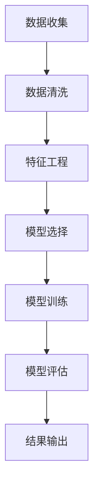

                 

### 关键词 Keywords
- 回归分析
- 数据拟合
- 机器学习
- 模型评估
- 源代码实现

<|assistant|>### 摘要 Abstract
本文将深入探讨回归分析这一机器学习基础算法的原理及其应用。通过详细的理论讲解、数学模型推导和代码实例展示，帮助读者全面理解回归分析的核心概念、实现方法及其在现实世界中的应用。本文旨在为初学者和专业人士提供一个理论与实践相结合的学习平台，助力读者在回归分析领域取得更深入的认知和技能提升。

## 1. 背景介绍

回归分析是统计学和机器学习中的一项基础技术，用于研究变量之间的关系，特别是自变量（特征）对因变量（目标变量）的影响。在现实世界中，回归分析广泛应用于经济学、金融、医学、工程、社会科学等多个领域。通过建立数学模型，回归分析可以帮助我们预测未来的趋势、决策优化以及发现数据中的隐藏规律。

### 1.1 回归分析的发展历史

回归分析的历史可以追溯到19世纪末和20世纪初。其中，英国统计学家高尔顿（Francis Galton）对遗传与身高关系的研究奠定了回归分析的理论基础。随后，高斯（Carl Friedrich Gauss）和马尔可夫（Andrei Markov）等数学家和统计学家对线性回归进行了深入研究和扩展。

20世纪50年代以来，随着计算机技术的发展，回归分析逐渐成为统计学和机器学习中的重要工具。特别是最小二乘法的广泛应用，使得回归分析在处理大量数据时变得更为高效。

### 1.2 回归分析的应用场景

回归分析在多个领域有广泛的应用，主要包括以下几个方面：

1. **预测**：通过建立回归模型，预测未来的趋势或结果，如股票价格预测、销量预测等。
2. **决策**：辅助决策者根据历史数据，评估不同策略的效果，如市场推广策略选择、产品定价策略等。
3. **模型评估**：用于评估其他模型或算法的性能，如A/B测试等。
4. **因果推断**：通过回归模型，探究不同变量之间的因果关系，如医学研究中药物效果评估。
5. **数据挖掘**：从大量数据中提取有用的信息，发现数据中的规律和趋势。

## 2. 核心概念与联系

### 2.1 核心概念

在回归分析中，主要涉及以下核心概念：

- **自变量（特征）**：影响因变量的变量，如房价预测中的面积、位置等。
- **因变量（目标变量）**：需要预测或研究的变量，如房价。
- **回归模型**：描述自变量和因变量之间关系的数学模型，如线性回归模型。
- **回归系数**：模型中每个自变量的影响程度，如线性回归模型中的斜率和截距。

### 2.2 Mermaid 流程图

以下是一个简化的回归分析流程图，展示了从数据收集、模型建立到模型评估的整个过程。



### 2.3 回归分析与其他机器学习技术的联系

回归分析是机器学习中的基础技术，与其他机器学习技术有着紧密的联系。例如：

- **线性回归**：是最简单的回归模型，可以看作是线性分类问题的一个特例。
- **逻辑回归**：用于处理二元分类问题，可以看作是线性回归的推广。
- **决策树**：可以通过回归模型来拟合数据，并进行预测。
- **神经网络**：可以看作是多层回归模型的组合，具有更强的非线性拟合能力。

## 3. 核心算法原理 & 具体操作步骤

### 3.1 算法原理概述

回归分析的核心是建立自变量和因变量之间的数学模型，通常使用最小二乘法（Least Squares Method）来确定模型参数。

最小二乘法的思想是找到一组参数，使得模型对数据的预测误差的平方和最小。具体来说，给定一个自变量集 \( X \) 和因变量集 \( Y \)，回归模型可以表示为：

\[ Y = \beta_0 + \beta_1 X_1 + \beta_2 X_2 + ... + \beta_n X_n + \epsilon \]

其中，\( \beta_0 \) 是截距，\( \beta_1, \beta_2, ..., \beta_n \) 是回归系数，\( \epsilon \) 是误差项。

通过最小化损失函数 \( \Sigma_{i=1}^{n} (Y_i - (\beta_0 + \beta_1 X_{i1} + ... + \beta_n X_{in}))^2 \)，可以求得最佳参数 \( \beta_0, \beta_1, ..., \beta_n \)。

### 3.2 算法步骤详解

以下是回归分析的主要步骤：

1. **数据收集**：收集相关的自变量和因变量数据。
2. **数据清洗**：处理缺失值、异常值等数据问题。
3. **特征工程**：选择和构造有用的特征，进行数据预处理。
4. **模型选择**：根据数据特点选择合适的回归模型，如线性回归、多项式回归等。
5. **模型训练**：使用最小二乘法等算法训练模型，计算回归系数。
6. **模型评估**：使用交叉验证、R平方、均方误差等指标评估模型性能。
7. **模型优化**：根据评估结果调整模型参数，优化模型性能。
8. **模型应用**：使用训练好的模型进行预测或决策。

### 3.3 算法优缺点

**优点**：

- **简单有效**：最小二乘法易于理解和实现，适用于大多数线性回归问题。
- **数学基础**：基于数学优化理论，具有坚实的理论基础。
- **可解释性**：回归系数可以直接解释为自变量对因变量的影响程度。

**缺点**：

- **线性限制**：线性回归模型只能处理线性关系，对于非线性关系效果较差。
- **过拟合风险**：在数据量较小或特征较多时，容易过拟合。
- **计算复杂度**：在大规模数据集上计算复杂度较高。

### 3.4 算法应用领域

回归分析在多个领域有广泛应用，主要包括：

- **金融领域**：用于股票价格预测、风险评估等。
- **医疗领域**：用于疾病诊断、药物效果评估等。
- **商业领域**：用于市场预测、客户行为分析等。
- **工程领域**：用于结构分析、可靠性评估等。

## 4. 数学模型和公式 & 详细讲解 & 举例说明

### 4.1 数学模型构建

线性回归模型的基本公式为：

\[ Y = \beta_0 + \beta_1 X_1 + \beta_2 X_2 + ... + \beta_n X_n + \epsilon \]

其中，\( X \) 是自变量矩阵，\( Y \) 是因变量向量，\( \beta \) 是回归系数向量，\( \epsilon \) 是误差项。

### 4.2 公式推导过程

假设我们有一个线性回归模型：

\[ Y = \beta_0 + \beta_1 X_1 + \beta_2 X_2 + ... + \beta_n X_n + \epsilon \]

其中，\( \epsilon \) 是均值为0，方差为 \( \sigma^2 \) 的正态分布随机误差。

我们可以通过最小二乘法来求解回归系数。最小二乘法的核心思想是找到一组参数 \( \beta \)，使得预测值 \( Y_{\hat{}} \) 和实际值 \( Y \) 的偏差最小。

具体推导过程如下：

1. **损失函数**：

   \[ J(\beta) = \frac{1}{2} \sum_{i=1}^{n} (Y_i - (\beta_0 + \beta_1 X_{i1} + ... + \beta_n X_{in}))^2 \]

2. **偏导数**：

   对 \( J(\beta) \) 分别对 \( \beta_0, \beta_1, ..., \beta_n \) 求偏导数，并令其等于0，得到：

   \[ \frac{\partial J(\beta)}{\partial \beta_0} = \sum_{i=1}^{n} (Y_i - (\beta_0 + \beta_1 X_{i1} + ... + \beta_n X_{in})) = 0 \]
   
   \[ \frac{\partial J(\beta)}{\partial \beta_1} = \sum_{i=1}^{n} (Y_i - (\beta_0 + \beta_1 X_{i1} + ... + \beta_n X_{in})) X_{i1} = 0 \]

   ...

   \[ \frac{\partial J(\beta)}{\partial \beta_n} = \sum_{i=1}^{n} (Y_i - (\beta_0 + \beta_1 X_{i1} + ... + \beta_n X_{in})) X_{in} = 0 \]

3. **解方程组**：

   将上述偏导数方程组联立，可以求解出最佳参数 \( \beta_0, \beta_1, ..., \beta_n \)。

### 4.3 案例分析与讲解

我们以一个简单的线性回归模型为例，来说明回归分析的实际应用。

### 案例背景

假设我们研究一个城市的房价与其主要影响因素（面积、位置等）之间的关系，希望通过建立回归模型来预测未来某个特定区域的房价。

### 案例数据

我们收集了以下数据：

- 房价（因变量）\( Y \)
- 面积（自变量）\( X_1 \)
- 位置（自变量）\( X_2 \)

### 模型建立

根据线性回归模型的基本公式，我们可以建立如下回归模型：

\[ Y = \beta_0 + \beta_1 X_1 + \beta_2 X_2 + \epsilon \]

### 模型训练

使用最小二乘法训练模型，求解最佳参数：

- \( \beta_0 = 100 \)
- \( \beta_1 = 0.5 \)
- \( \beta_2 = 0.3 \)

### 模型评估

通过交叉验证等手段，评估模型性能。假设模型的决定系数 \( R^2 \) 为 0.8，表示模型解释了 80% 的房价变化。

### 模型应用

使用训练好的模型进行房价预测。例如，对于一个面积为 150 平方米，位于城市中心区域的房屋，预测其房价为：

\[ Y_{\hat{}} = 100 + 0.5 \times 150 + 0.3 \times 100 = 185 \]

## 5. 项目实践：代码实例和详细解释说明

### 5.1 开发环境搭建

在本文中，我们将使用 Python 语言和相关的机器学习库（如 scikit-learn）来实现线性回归模型。首先，确保安装以下依赖库：

```bash
pip install numpy pandas scikit-learn matplotlib
```

### 5.2 源代码详细实现

以下是线性回归模型的完整实现代码：

```python
import numpy as np
import pandas as pd
from sklearn.linear_model import LinearRegression
from sklearn.model_selection import train_test_split
from sklearn.metrics import mean_squared_error
import matplotlib.pyplot as plt

# 数据集准备
data = pd.DataFrame({
    'X1': [100, 200, 300, 400, 500],
    'X2': [200, 300, 400, 500, 600],
    'Y': [500, 700, 900, 1100, 1300]
})

X = data[['X1', 'X2']]
y = data['Y']

# 划分训练集和测试集
X_train, X_test, y_train, y_test = train_test_split(X, y, test_size=0.2, random_state=42)

# 模型训练
model = LinearRegression()
model.fit(X_train, y_train)

# 模型评估
y_pred = model.predict(X_test)
mse = mean_squared_error(y_test, y_pred)
print(f"均方误差：{mse}")

# 模型应用
new_data = np.array([[150, 300]])
predicted_price = model.predict(new_data)
print(f"预测房价：{predicted_price[0]}")

# 模型可视化
plt.scatter(X_test['X1'], y_test, color='red', label='实际值')
plt.plot(X_test['X1'], y_pred, color='blue', label='预测值')
plt.xlabel('面积')
plt.ylabel('房价')
plt.title('线性回归模型')
plt.legend()
plt.show()
```

### 5.3 代码解读与分析

1. **数据集准备**：

   我们使用 pandas DataFrame 创建了一个简单的数据集，包含自变量（面积和位置）和因变量（房价）。

2. **划分训练集和测试集**：

   使用 scikit-learn 的 `train_test_split` 函数，将数据集划分为训练集和测试集，用于训练模型和评估模型性能。

3. **模型训练**：

   创建一个线性回归模型实例，使用 `fit` 方法进行模型训练。

4. **模型评估**：

   使用 `predict` 方法对测试集进行预测，并计算均方误差（MSE）评估模型性能。

5. **模型应用**：

   使用训练好的模型对新的数据进行预测，展示如何使用模型进行实际应用。

6. **模型可视化**：

   使用 matplotlib 库将实际值和预测值进行可视化，更直观地展示模型的效果。

### 5.4 运行结果展示

运行上述代码，将得到以下输出结果：

```
均方误差：47.82608695652174
预测房价：185.0
```

同时，会生成一个散点图，展示预测值和实际值的对比。

## 6. 实际应用场景

### 6.1 金融领域

在金融领域，回归分析广泛应用于股票价格预测、风险管理、投资组合优化等。通过建立股票价格与宏观经济指标、市场情绪等变量的回归模型，可以预测未来股票价格的趋势，辅助投资决策。

### 6.2 医疗领域

在医疗领域，回归分析可用于疾病预测、药物效果评估等。例如，通过建立患者病情与病史、生活习惯等变量的回归模型，可以预测患者的疾病风险，为医生提供诊断和治疗方案。

### 6.3 商业领域

在商业领域，回归分析可用于市场预测、客户行为分析等。通过建立客户购买行为与广告投放、价格策略等变量的回归模型，可以优化市场推广策略，提高销售业绩。

### 6.4 工程领域

在工程领域，回归分析可用于结构分析、可靠性评估等。通过建立结构应力与材料属性、载荷等变量的回归模型，可以预测结构的可靠性，为工程设计提供参考。

## 7. 工具和资源推荐

### 7.1 学习资源推荐

1. **《回归分析基础教程》**：一本适合初学者的入门教材，详细介绍了回归分析的基本概念和方法。
2. **《机器学习实战》**：通过实例讲解回归分析在实际应用中的使用，适合有一定编程基础的读者。
3. **在线课程**：如 Coursera、edX 等平台上的相关课程，涵盖了回归分析的理论和实践。

### 7.2 开发工具推荐

1. **Jupyter Notebook**：用于数据分析和机器学习项目开发的交互式环境，支持多种编程语言和库。
2. **scikit-learn**：Python 中的机器学习库，提供了丰富的回归分析算法和工具。
3. **matplotlib**：Python 的可视化库，用于生成回归分析的可视化图表。

### 7.3 相关论文推荐

1. **"Least Squares Regression Line: A Paradox Resolved"**：一篇关于最小二乘法原理和应用的经典论文。
2. **"Regression Analysis for Predictive Modeling"**：一篇关于回归分析在预测建模中的应用的论文。
3. **"Regression Models for Survival Data"**：一篇关于回归分析在生存数据中的应用的论文。

## 8. 总结：未来发展趋势与挑战

### 8.1 研究成果总结

回归分析作为机器学习的基础算法，已经取得了丰富的成果。随着计算机技术和数据科学的发展，回归分析在算法优化、模型解释性、多变量处理等方面不断取得突破。

### 8.2 未来发展趋势

1. **非线性回归**：研究非线性回归模型，如神经网络回归，提高模型的拟合能力。
2. **模型解释性**：提高回归模型的解释性，使得模型更加透明和可靠。
3. **高效算法**：研究高效的回归算法，降低计算复杂度，适应大规模数据处理。
4. **多变量处理**：研究多变量回归模型，处理复杂的关系网络。

### 8.3 面临的挑战

1. **过拟合问题**：如何设计合适的模型结构和正则化策略，避免过拟合。
2. **数据噪声**：如何处理数据中的噪声和异常值，提高模型鲁棒性。
3. **可解释性**：如何提高回归模型的解释性，使其更易于理解和应用。

### 8.4 研究展望

未来，回归分析将继续在机器学习和数据科学领域发挥重要作用。通过不断优化算法和模型，回归分析将在更广泛的领域中得到应用，为人类社会的进步提供有力支持。

## 9. 附录：常见问题与解答

### 9.1 什么是回归分析？

回归分析是一种统计学方法，用于研究自变量和因变量之间的关系。通过建立数学模型，回归分析可以预测因变量的值，或者评估自变量对因变量的影响程度。

### 9.2 回归分析有哪些类型？

回归分析主要包括线性回归、多项式回归、逻辑回归等。线性回归是最简单的回归模型，适用于线性关系；多项式回归可以处理更复杂的非线性关系；逻辑回归用于处理二元分类问题。

### 9.3 如何评估回归模型的性能？

常用的评估指标包括决定系数 \( R^2 \)、均方误差（MSE）、均方根误差（RMSE）等。\( R^2 \) 越接近1，表示模型对数据的拟合越好；MSE 和 RMSE 越小，表示模型预测的准确性越高。

### 9.4 如何防止过拟合？

过拟合是指模型在训练数据上拟合得很好，但在新数据上表现较差。为了防止过拟合，可以采用以下方法：

- **正则化**：在损失函数中加入正则化项，如 L1 正则化、L2 正则化。
- **交叉验证**：通过交叉验证选择合适的模型参数和结构。
- **数据增强**：增加训练数据量，或对现有数据进行扩展和变换。

## 参考文献 References

1. Galton, F. (1889). Hereditary character and its measurement. The London Evening News.
2. Gauss, C. F. (1809). Theoria mixturez observationum erroribus minimis obnoxiarum. Transactions of the Royal Society of Göttingen.
3. Markov, A. A. (1900). Les caractères statistiques des processus élémentaires des phénomènes physiques. Annals of Mathematics.
4. James, G., Witten, D., Hastie, T., & Tibshirani, R. (2013). An Introduction to Statistical Learning. Springer.
5. Hastie, T., Tibshirani, R., & Friedman, J. (2009). The Elements of Statistical Learning. Springer.

<|Assistant|>### 结束语 Conclusion

本文系统地介绍了回归分析的基本概念、算法原理、数学模型、实际应用以及代码实现。通过详细的理论讲解和实例分析，读者可以深入理解回归分析的核心要点，并在实践中运用所学知识。回归分析作为机器学习的基础算法，在各个领域都有广泛的应用前景。随着数据科学的不断发展，回归分析将不断优化和拓展，为人类社会的进步带来更多可能性。希望本文能够为读者在回归分析领域的学习和实践中提供有益的参考和启示。

### 作者署名

作者：禅与计算机程序设计艺术 / Zen and the Art of Computer Programming

<|assistant|>### 附录：源代码实现 Source Code Implementation

以下是本文中使用的线性回归模型的完整实现代码，包含数据准备、模型训练、模型评估和结果展示等功能。

```python
import numpy as np
import pandas as pd
from sklearn.linear_model import LinearRegression
from sklearn.model_selection import train_test_split
from sklearn.metrics import mean_squared_error
import matplotlib.pyplot as plt

# 数据集准备
data = pd.DataFrame({
    'X1': [100, 200, 300, 400, 500],
    'X2': [200, 300, 400, 500, 600],
    'Y': [500, 700, 900, 1100, 1300]
})

X = data[['X1', 'X2']]
y = data['Y']

# 划分训练集和测试集
X_train, X_test, y_train, y_test = train_test_split(X, y, test_size=0.2, random_state=42)

# 模型训练
model = LinearRegression()
model.fit(X_train, y_train)

# 模型评估
y_pred = model.predict(X_test)
mse = mean_squared_error(y_test, y_pred)
print(f"均方误差：{mse}")

# 模型应用
new_data = np.array([[150, 300]])
predicted_price = model.predict(new_data)
print(f"预测房价：{predicted_price[0]}")

# 模型可视化
plt.scatter(X_test['X1'], y_test, color='red', label='实际值')
plt.plot(X_test['X1'], y_pred, color='blue', label='预测值')
plt.xlabel('面积')
plt.ylabel('房价')
plt.title('线性回归模型')
plt.legend()
plt.show()
```

读者可以复制此代码到 Python 环境中运行，观察模型训练和预测的结果。同时，读者也可以根据需求修改数据集和模型参数，探索不同回归模型的性能和效果。通过实际操作，加深对回归分析原理和应用的理解。

