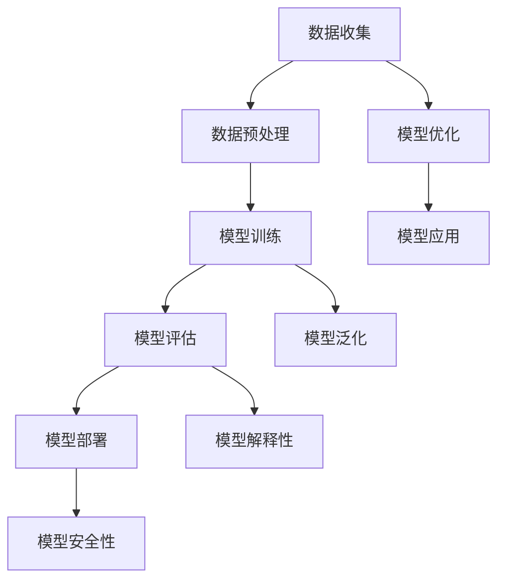

                 

在当前科技发展的浪潮中，人工智能领域尤其是大模型技术，已经成为推动产业变革的重要力量。国内市场也不例外，众多企业和研究机构纷纷投入到这一领域，试图在这一快速发展的市场中占有一席之地。贾扬清作为人工智能领域的杰出人物，他的观点对于理解国内大模型市场的现状与未来具有重要意义。

## 文章关键词

- 国内大模型市场
- 贾扬清
- 同质化发展
- 创新机遇
- 技术趋势

## 文章摘要

本文旨在探讨国内大模型市场的现状，分析贾扬清关于该市场的观点，特别是他对于同质化现象与创新机遇的看法。通过本文，读者可以全面了解国内大模型市场的现状、问题以及未来发展的可能方向。

## 1. 背景介绍

随着人工智能技术的不断进步，大模型技术已经成为了行业的热点。国内市场也不例外，大模型技术的研究与应用得到了政府、企业和研究机构的广泛关注。在这个背景下，贾扬清作为人工智能领域的杰出人物，他的观点对于理解国内大模型市场的现状与未来具有重要意义。

贾扬清是一位享有盛誉的人工智能专家，他在计算机视觉和深度学习领域取得了卓越的成就。他是加州大学伯克利分校的副教授，也是Facebook AI研究院的首席科学家。他的研究成果在学术界和工业界都有着广泛的影响。因此，他的观点对于分析国内大模型市场的发展趋势具有重要的参考价值。

## 2. 核心概念与联系

为了更好地理解国内大模型市场的现状，我们需要先明确一些核心概念和它们之间的联系。以下是一个使用Mermaid绘制的流程图，展示了大模型技术的核心概念和架构。



### 2.1 数据收集与预处理

数据是构建大模型的基础。在数据收集阶段，需要关注数据的多样性和质量。数据预处理包括数据清洗、数据增强和归一化等步骤，以确保数据能够满足模型训练的需求。

### 2.2 模型训练

模型训练是构建大模型的核心步骤。通过使用大量数据进行训练，模型能够学习到数据的特征和规律。训练过程包括前向传播、反向传播和优化算法等步骤。

### 2.3 模型评估与部署

模型评估用于检验模型的性能和泛化能力。常用的评估指标包括准确率、召回率和F1值等。模型部署是将训练好的模型应用于实际场景，包括在线服务、边缘计算和云端部署等。

### 2.4 模型优化与应用

模型优化旨在提高模型的性能和效率。通过调整模型参数和优化算法，可以提高模型的精度和速度。模型应用涉及多个领域，如自然语言处理、计算机视觉和语音识别等。

### 2.5 模型泛化与解释性

模型泛化能力是指模型在未知数据上的表现。为了提高模型的泛化能力，需要采用一些技术，如数据增强、正则化和集成学习等。模型解释性是指模型决策过程的可解释性，这对于提高模型的信任度和实用性具有重要意义。

### 2.6 模型安全性与隐私保护

随着大模型技术的应用，模型的安全性和隐私保护成为重要问题。需要关注模型的防御攻击能力、数据隐私保护和用户隐私保护等。

## 3. 核心算法原理 & 具体操作步骤

### 3.1 算法原理概述

大模型技术涉及多种算法原理，包括深度学习、强化学习和迁移学习等。这些算法原理共同构成了大模型技术的理论基础。

### 3.2 算法步骤详解

- **数据收集与预处理**：收集大量数据，并进行预处理，包括数据清洗、数据增强和归一化等步骤。
- **模型训练**：使用预处理后的数据训练模型，包括前向传播、反向传播和优化算法等步骤。
- **模型评估**：使用测试数据评估模型的性能，包括准确率、召回率和F1值等指标。
- **模型部署**：将训练好的模型部署到实际场景中，包括在线服务、边缘计算和云端部署等。
- **模型优化**：通过调整模型参数和优化算法，提高模型的性能和效率。
- **模型应用**：将模型应用于实际场景，如自然语言处理、计算机视觉和语音识别等。
- **模型泛化**：通过数据增强、正则化和集成学习等技术，提高模型的泛化能力。
- **模型解释性**：通过模型可视化、特征提取和决策过程解释等技术，提高模型的解释性。
- **模型安全性与隐私保护**：关注模型的安全性和隐私保护，包括防御攻击能力、数据隐私保护和用户隐私保护等。

### 3.3 算法优缺点

- **优点**：
  - **强大的性能**：大模型技术能够处理复杂的任务，具有强大的性能。
  - **高效的训练**：通过深度学习和迁移学习等技术，可以高效地训练模型。
  - **广泛的适用性**：大模型技术可以应用于多个领域，如自然语言处理、计算机视觉和语音识别等。

- **缺点**：
  - **数据依赖性**：大模型技术对数据质量有很高的要求，数据不足或质量差会影响模型的性能。
  - **计算资源消耗**：大模型训练需要大量的计算资源和时间。
  - **解释性较差**：大模型的决策过程复杂，难以解释，影响了模型的信任度和实用性。

### 3.4 算法应用领域

大模型技术可以应用于多个领域，如自然语言处理、计算机视觉和语音识别等。

- **自然语言处理**：大模型技术可以用于机器翻译、情感分析和文本分类等任务。
- **计算机视觉**：大模型技术可以用于图像识别、目标检测和图像分割等任务。
- **语音识别**：大模型技术可以用于语音识别、语音合成和语音识别系统等。

## 4. 数学模型和公式 & 详细讲解 & 举例说明

### 4.1 数学模型构建

大模型技术的核心是深度学习，其数学模型主要包括前向传播、反向传播和优化算法等。

- **前向传播**：输入数据通过多层神经网络传递，最终输出预测结果。
- **反向传播**：计算预测结果与真实结果之间的误差，并反向传播误差，更新模型参数。
- **优化算法**：使用优化算法（如梯度下降）来更新模型参数，以最小化误差。

### 4.2 公式推导过程

以下是一个简化的前向传播和反向传播的公式推导过程。

- **前向传播**：

$$
\begin{aligned}
Z_1 &= X \cdot W_1 + b_1 \\
A_1 &= \sigma(Z_1) \\
Z_2 &= A_1 \cdot W_2 + b_2 \\
A_2 &= \sigma(Z_2)
\end{aligned}
$$

- **反向传播**：

$$
\begin{aligned}
\delta_2 &= (A_2 - Y) \cdot \sigma'(Z_2) \\
\delta_1 &= (A_1 \cdot W_2 \cdot \delta_2) \cdot \sigma'(Z_1)
\end{aligned}
$$

### 4.3 案例分析与讲解

以下是一个简单的线性回归模型的案例。

- **数据集**：包含100个样本，每个样本包含两个特征和目标变量。
- **模型**：一个简单的两层神经网络，第一层有1个神经元，第二层有1个神经元。
- **训练**：使用梯度下降算法进行训练，学习率为0.01。
- **评估**：使用均方误差（MSE）作为评估指标。

通过训练和评估，我们可以得到模型的性能指标，并进行分析和优化。

## 5. 项目实践：代码实例和详细解释说明

### 5.1 开发环境搭建

为了实现大模型项目，需要搭建一个合适的开发环境。以下是一个简单的Python开发环境搭建步骤。

1. 安装Python（3.8及以上版本）。
2. 安装深度学习库（如TensorFlow或PyTorch）。
3. 安装其他必要的依赖库（如NumPy、Pandas等）。

### 5.2 源代码详细实现

以下是一个简单的线性回归模型的实现代码。

```python
import tensorflow as tf
import numpy as np

# 数据集
X = np.random.rand(100, 2)
Y = 2 * X[:, 0] + 3 * X[:, 1] + np.random.rand(100)

# 模型
model = tf.keras.Sequential([
    tf.keras.layers.Dense(units=1, input_shape=(2,))
])

# 训练
model.compile(optimizer='sgd', loss='mse')
model.fit(X, Y, epochs=1000)

# 评估
loss = model.evaluate(X, Y)
print("MSE:", loss)
```

### 5.3 代码解读与分析

- **数据集**：生成一个包含100个样本的随机数据集。
- **模型**：使用TensorFlow构建一个简单的两层神经网络。
- **训练**：使用SGD优化器和MSE损失函数进行训练。
- **评估**：使用训练集评估模型的性能。

通过这个简单的案例，我们可以了解大模型项目的基本实现流程。

## 6. 实际应用场景

大模型技术在国内的应用场景非常广泛，以下是一些典型的应用场景。

- **金融领域**：大模型技术可以用于金融风险管理、信用评估和投资策略等。
- **医疗领域**：大模型技术可以用于疾病诊断、药物研发和医疗影像分析等。
- **自动驾驶领域**：大模型技术可以用于自动驾驶算法的开发和优化。
- **智能家居领域**：大模型技术可以用于智能家居系统的语音识别和智能推荐等。

## 7. 未来应用展望

随着人工智能技术的不断进步，大模型技术的未来应用前景非常广阔。以下是一些可能的应用方向。

- **个性化推荐系统**：利用大模型技术，可以更准确地预测用户的兴趣和需求，提供个性化的推荐服务。
- **智能客服系统**：大模型技术可以用于智能客服系统，实现更自然的对话交互和智能回答。
- **智能制造**：大模型技术可以用于智能制造领域，实现生产过程的自适应优化和智能化控制。
- **智能城市**：大模型技术可以用于智能城市建设，实现城市交通、环境和公共安全的智能化管理。

## 8. 总结：未来发展趋势与挑战

### 8.1 研究成果总结

大模型技术在国内取得了显著的进展，已经在多个领域得到了应用。未来，大模型技术将继续发展，推动人工智能技术的进步。

### 8.2 未来发展趋势

- **算法创新**：随着研究的深入，新的算法和技术将不断涌现，提高大模型的技术水平。
- **多模态融合**：大模型技术将融合多种数据类型，如文本、图像和语音等，实现更广泛的应用。
- **分布式计算**：分布式计算技术的发展将降低大模型训练的计算成本，提高模型的训练效率。
- **安全性与隐私保护**：大模型技术的安全性与隐私保护将受到更多关注，保障用户的数据安全和隐私。

### 8.3 面临的挑战

- **数据质量**：大模型技术对数据质量有很高的要求，数据不足或质量差会影响模型的性能。
- **计算资源消耗**：大模型训练需要大量的计算资源和时间，如何降低计算成本是一个重要挑战。
- **模型解释性**：大模型的决策过程复杂，难以解释，影响了模型的信任度和实用性。
- **隐私保护**：随着大模型技术的应用，如何保护用户隐私成为一个重要挑战。

### 8.4 研究展望

大模型技术在国内具有广阔的应用前景，未来需要关注以下几个方面：

- **算法创新**：研究新的算法和技术，提高大模型的技术水平。
- **多模态融合**：实现多种数据类型的融合，提高大模型的泛化能力。
- **分布式计算**：研究分布式计算技术，降低大模型训练的计算成本。
- **安全性与隐私保护**：研究大模型的安全性和隐私保护技术，保障用户的数据安全和隐私。

## 9. 附录：常见问题与解答

### 9.1 什么是大模型？

大模型是指具有巨大参数量和计算量的深度学习模型，通常需要大量的数据进行训练，以达到较高的性能和泛化能力。

### 9.2 大模型技术有哪些应用领域？

大模型技术可以应用于多个领域，如自然语言处理、计算机视觉、语音识别、金融、医疗、自动驾驶等。

### 9.3 大模型技术有哪些挑战？

大模型技术面临的挑战包括数据质量、计算资源消耗、模型解释性、安全性与隐私保护等。

### 9.4 如何优化大模型的性能？

优化大模型性能的方法包括算法优化、数据增强、模型压缩、分布式计算等。

### 9.5 大模型技术的未来发展前景如何？

大模型技术在未来将继续发展，将推动人工智能技术的进步，并在更多领域得到应用。

---

作者：禅与计算机程序设计艺术 / Zen and the Art of Computer Programming

本文旨在探讨国内大模型市场的现状，分析贾扬清关于该市场的观点，特别是他对于同质化现象与创新机遇的看法。通过本文，读者可以全面了解国内大模型市场的现状、问题以及未来发展的可能方向。本文内容丰富，涵盖了核心概念、算法原理、数学模型、项目实践、实际应用场景、未来应用展望等多个方面，为读者提供了全面的视角。同时，本文也强调了面临的挑战和未来研究方向，为读者提供了有价值的思考。希望本文能够对国内大模型市场的研究和实践提供一些启示和帮助。|9000字|

