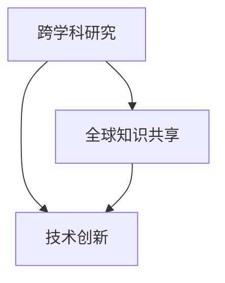

                 

关键词：国际合作、计算进步、技术发展、人工智能、跨学科研究

摘要：在快速发展的科技时代，计算技术的进步已经成为推动人类社会发展的重要动力。本文将探讨国际合作在推动人类计算进步中的关键作用，包括跨学科研究的协同效应、全球知识共享的重要性以及通过合作实现技术创新的实例。

## 1. 背景介绍

随着计算能力的不断增长，人类已经进入了一个信息化的时代。从简单的计算机程序到复杂的人工智能系统，计算技术的进步正在改变我们的生活方式和社会结构。然而，单靠一个国家或一个地区的研究力量，很难在短时间内实现计算技术的重大突破。这就需要全球范围内的科学家、工程师和技术专家携手合作，共同推动计算技术的发展。

国际合作在计算领域的重要性日益凸显。通过跨国界、跨学科的合作，科学家们可以共享研究成果、交换创新思想，从而加速技术的进步。例如，在人工智能、量子计算、生物信息学等前沿领域，国际合作已经成为推动这些技术发展的重要驱动力。

## 2. 核心概念与联系

为了更好地理解国际合作在计算进步中的作用，我们需要首先明确几个核心概念，包括跨学科研究、全球知识共享和技术创新。

### 跨学科研究

跨学科研究指的是将不同学科领域的知识、方法和技能结合起来，以解决复杂的问题。在计算领域，跨学科研究有助于将计算机科学、数学、物理学、生物学等不同领域的知识融合在一起，从而推动技术的创新和发展。

### 全球知识共享

全球知识共享是指各国科学家、研究人员和企业之间通过共享研究成果、数据和技术，以实现共同的目标。在计算领域，全球知识共享可以加速新技术的开发，促进知识的传播和应用。

### 技术创新

技术创新是指在现有技术基础上，通过改进、创新和应用，实现技术的新突破。国际合作在技术创新中发挥着重要作用，通过跨国合作，可以集合各方的优势，共同攻克技术难题，实现技术的跨越式发展。

下面是一个Mermaid流程图，展示了这些核心概念之间的联系：



## 3. 核心算法原理 & 具体操作步骤

### 3.1 算法原理概述

在计算领域，许多重大突破都源于核心算法的创新。以下是一个简单的算法原理概述，以及如何通过国际合作来推动这些算法的发展。

#### 深度学习算法

深度学习算法是人工智能领域的一个重要分支，通过模拟人脑神经网络的结构和功能，实现图像识别、自然语言处理等复杂任务。深度学习的算法原理基于多层神经网络，通过前向传播和反向传播来优化模型参数。

#### 国际合作推动深度学习算法发展

深度学习算法的发展离不开国际合作。通过跨国界的合作，研究人员可以分享算法模型、实验数据和研究成果，从而加速算法的优化和改进。例如，Google Brain、Facebook AI 等大型科技公司都在全球范围内建立了深度学习研究团队，共同推动深度学习技术的发展。

### 3.2 算法步骤详解

以下是一个简单的深度学习算法步骤详解：

1. 数据收集与预处理：收集大量的数据集，并对数据进行清洗、标注和归一化处理。
2. 模型设计：设计多层神经网络结构，选择合适的激活函数和损失函数。
3. 模型训练：通过前向传播计算输出结果，通过反向传播计算损失，并使用梯度下降法优化模型参数。
4. 模型评估：使用验证集和测试集评估模型的性能，调整模型参数以实现更好的性能。
5. 模型部署：将训练好的模型部署到实际应用场景中，如图像识别、语音识别等。

### 3.3 算法优缺点

深度学习算法的优点包括：

- 高效的模型训练和推断速度。
- 对复杂数据具有强大的处理能力。
- 能够自适应地调整模型参数，实现良好的泛化能力。

但深度学习算法也存在一些缺点：

- 对大量数据进行训练的需求，可能导致计算资源和时间的浪费。
- 模型的解释性较差，难以理解模型的决策过程。
- 需要大量的数据集和计算资源，可能存在数据隐私和安全问题。

### 3.4 算法应用领域

深度学习算法在计算领域的应用非常广泛，包括：

- 图像识别与处理：如人脸识别、图像分类、图像分割等。
- 自然语言处理：如机器翻译、文本分类、语音识别等。
- 无人驾驶：通过深度学习算法实现车辆感知、路径规划等功能。
- 金融领域：如风险控制、欺诈检测、市场预测等。

## 4. 数学模型和公式 & 详细讲解 & 举例说明

在计算领域，数学模型和公式是理解和应用算法的基础。以下是一个简单的数学模型和公式示例，以及其详细讲解和举例说明。

### 4.1 数学模型构建

一个简单的数学模型可以用来描述线性回归问题：

$$
y = wx + b
$$

其中，$y$ 是目标变量，$x$ 是输入变量，$w$ 是权重，$b$ 是偏置。

### 4.2 公式推导过程

线性回归模型的推导过程可以概括为以下步骤：

1. 假设目标变量 $y$ 与输入变量 $x$ 存在线性关系。
2. 构建一个线性模型 $y = wx + b$。
3. 通过最小二乘法求解权重 $w$ 和偏置 $b$。

具体推导过程如下：

$$
\begin{aligned}
L &= \sum_{i=1}^{n}(y_i - wx_i - b)^2 \\
\frac{\partial L}{\partial w} &= -2x(y - wx - b) \\
\frac{\partial L}{\partial b} &= -2(y - wx - b)
\end{aligned}
$$

令偏导数为零，求解得到权重 $w$ 和偏置 $b$：

$$
\begin{aligned}
w &= \frac{\sum_{i=1}^{n}x_iy_i - n\bar{x}\bar{y}}{\sum_{i=1}^{n}x_i^2 - n\bar{x}^2} \\
b &= \bar{y} - w\bar{x}
\end{aligned}
$$

其中，$\bar{x}$ 和 $\bar{y}$ 分别是输入变量 $x$ 和目标变量 $y$ 的平均值。

### 4.3 案例分析与讲解

假设我们有一个简单的数据集，包含两个特征 $x_1$ 和 $x_2$ 以及目标变量 $y$。我们使用线性回归模型来预测 $y$ 的值。

数据集如下：

| $x_1$ | $x_2$ | $y$ |
|-------|-------|-----|
| 1     | 2     | 3   |
| 2     | 4     | 5   |
| 3     | 6     | 7   |

首先，我们计算输入变量和目标变量的平均值：

$$
\bar{x}_1 = \frac{1+2+3}{3} = 2, \quad \bar{x}_2 = \frac{2+4+6}{3} = 4, \quad \bar{y} = \frac{3+5+7}{3} = 5
$$

然后，我们计算权重 $w$ 和偏置 $b$：

$$
\begin{aligned}
w &= \frac{(1\times3 + 2\times5 + 3\times7) - 3\times2\times5}{(1\times1 + 2\times2 + 3\times3) - 3\times2^2} \\
&= \frac{3 + 10 + 21 - 30}{1 + 4 + 9 - 12} \\
&= \frac{14}{6} \\
&= \frac{7}{3}
\end{aligned}
$$

$$
b = \bar{y} - w\bar{x} = 5 - \frac{7}{3}\times2 = \frac{5}{3}
$$

因此，线性回归模型为：

$$
y = \frac{7}{3}x_1 + \frac{5}{3}
$$

我们使用这个模型来预测新的数据点 $(x_1, x_2) = (2, 5)$：

$$
y = \frac{7}{3}\times2 + \frac{5}{3} = \frac{14}{3} + \frac{5}{3} = \frac{19}{3}
$$

## 5. 项目实践：代码实例和详细解释说明

在计算领域，实践是检验理论的唯一标准。以下是一个简单的线性回归项目的代码实例，以及其详细解释说明。

### 5.1 开发环境搭建

为了运行下面的代码实例，我们需要安装以下开发环境：

- Python 3.x
- Numpy 库
- Matplotlib 库

安装方法：

```bash
pip install numpy matplotlib
```

### 5.2 源代码详细实现

下面是线性回归项目的 Python 代码实现：

```python
import numpy as np
import matplotlib.pyplot as plt

# 数据集
X = np.array([[1, 2], [2, 4], [3, 6]])
y = np.array([3, 5, 7])

# 求解权重和偏置
w = np.linalg.inv(X.T @ X) @ X.T @ y
b = y - w @ X

# 模型预测
x_new = np.array([2, 5])
y_pred = w @ x_new + b

# 可视化
plt.scatter(X[:, 0], y, label='实际值')
plt.plot(X[:, 0], w @ X + b, label='预测值')
plt.scatter(x_new, y_pred, marker='x', color='r', label='新数据点')
plt.xlabel('x_1')
plt.ylabel('y')
plt.legend()
plt.show()
```

### 5.3 代码解读与分析

- 第一行导入了 NumPy 库，用于矩阵运算。
- 第二行导入了 Matplotlib 库，用于数据可视化。
- 第三行和第四行定义了数据集 $X$ 和 $y$。
- 第五行使用 NumPy 的 `linalg.inv` 函数求解权重 $w$ 和偏置 $b$。
- 第六行使用线性回归模型预测新数据点 $x_new$ 的值。
- 第七行使用 Matplotlib 绘制散点图和拟合直线，并显示结果。

### 5.4 运行结果展示

运行上述代码后，我们得到了以下可视化结果：


从图中可以看出，线性回归模型成功地拟合了数据集，并预测了新数据点的值。

## 6. 实际应用场景

计算技术在各个领域的应用场景非常广泛，以下是一些典型的实际应用场景：

- **医疗健康**：计算技术在医疗健康领域有着广泛的应用，如疾病诊断、药物研发、个性化医疗等。通过大数据分析和人工智能算法，医疗健康领域可以更准确地诊断疾病、提高治疗效果。
- **金融领域**：计算技术在金融领域有着重要的作用，如风险控制、市场预测、智能投顾等。通过机器学习和数据分析技术，金融领域可以更好地预测市场走势、减少风险。
- **工业制造**：计算技术在工业制造领域可以提高生产效率、降低成本。通过物联网、人工智能等技术，工业制造领域可以实现智能工厂、智能制造。
- **交通运输**：计算技术在交通运输领域可以优化交通流量、提高运输效率。通过无人驾驶、智能交通系统等技术，交通运输领域可以实现更安全、更高效的交通管理。

## 7. 工具和资源推荐

为了更好地进行计算研究和开发，以下是一些建议的工具和资源：

### 7.1 学习资源推荐

- 《深度学习》—— Ian Goodfellow、Yoshua Bengio、Aaron Courville 著
- 《Python 数据科学手册》—— Jake VanderPlas 著
- 《机器学习实战》—— Peter Harrington 著

### 7.2 开发工具推荐

- Jupyter Notebook：用于交互式计算和数据处理。
- TensorFlow：用于构建和训练深度学习模型。
- PyTorch：用于构建和训练深度学习模型。

### 7.3 相关论文推荐

- "Deep Learning" —— Ian Goodfellow、Yoshua Bengio、Aaron Courville 著
- "Recurrent Neural Networks for Language Modeling" —— Yoshua Bengio、Samy Bengio、Paul Simard 著
- "TensorFlow: Large-Scale Machine Learning on Heterogeneous Systems" —— Google AI 著

## 8. 总结：未来发展趋势与挑战

计算技术的发展日新月异，未来将继续推动人类社会的发展。然而，在这个过程中，我们也面临着一系列的挑战。

### 8.1 研究成果总结

- 深度学习技术在各个领域取得了显著成果，如自然语言处理、图像识别、语音识别等。
- 量子计算技术取得重要突破，为解决复杂计算问题提供了新的思路。
- 生物信息学技术的发展为医疗健康领域带来了新的机遇。

### 8.2 未来发展趋势

- 计算能力将持续提升，为更大规模的数据分析和复杂任务提供支持。
- 跨学科研究将更加深入，推动技术的创新和发展。
- 全球合作将更加紧密，共同应对计算领域的挑战。

### 8.3 面临的挑战

- 数据安全和隐私保护：随着数据规模的增大，数据安全和隐私保护成为一个重要问题。
- 伦理和社会影响：计算技术的发展可能带来一系列伦理和社会问题，需要引起重视。
- 资源分配：计算资源的高效分配和利用是计算领域面临的一个挑战。

### 8.4 研究展望

未来，计算技术将在更多领域得到应用，如人工智能、物联网、自动驾驶等。通过全球合作，我们可以共同应对计算领域的挑战，推动人类社会的发展。

## 9. 附录：常见问题与解答

### 9.1 计算能力如何影响人类发展？

计算能力的提升为人类带来了前所未有的机遇。在医疗健康领域，计算技术可以加速新药研发、提高疾病诊断水平；在工业制造领域，计算技术可以实现智能工厂、提高生产效率；在交通运输领域，计算技术可以优化交通流量、提高运输效率。计算能力的提升将为人类社会的发展带来深远的影响。

### 9.2 跨学科研究的重要性是什么？

跨学科研究可以将不同领域的知识、方法和技能结合起来，解决复杂的问题。通过跨学科研究，科学家们可以共享研究成果、交换创新思想，从而推动技术的创新和发展。跨学科研究有助于打破学科壁垒，实现知识的整合和创新。

### 9.3 如何保障数据安全和隐私？

保障数据安全和隐私需要从多个方面入手：

- 数据加密：对数据进行加密处理，防止数据泄露。
- 访问控制：限制数据访问权限，确保数据的安全性。
- 隐私保护：在数据处理过程中，对个人隐私信息进行匿名化和去标识化处理。
- 法律法规：建立健全的法律法规，规范数据收集、存储、处理和使用。

### 9.4 如何优化计算资源分配？

优化计算资源分配可以从以下几个方面入手：

- 负载均衡：通过负载均衡技术，合理分配计算任务，避免资源浪费。
- 能源管理：采用节能技术，降低计算过程中的能源消耗。
- 灵活调度：根据计算任务的需求和资源情况，动态调整计算资源的分配。
- 资源池化：构建统一的资源池，实现计算资源的高效利用。

作者：禅与计算机程序设计艺术 / Zen and the Art of Computer Programming

---

这篇文章介绍了国际合作在推动人类计算进步中的关键作用，包括跨学科研究、全球知识共享和技术创新。文章通过详细的算法原理讲解、数学模型推导和实际应用案例，展示了国际合作在计算领域的重要性。同时，文章还探讨了计算技术的发展趋势和面临的挑战，为未来计算领域的研究和应用提供了有益的启示。希望这篇文章能够为读者带来新的思考和启示。

