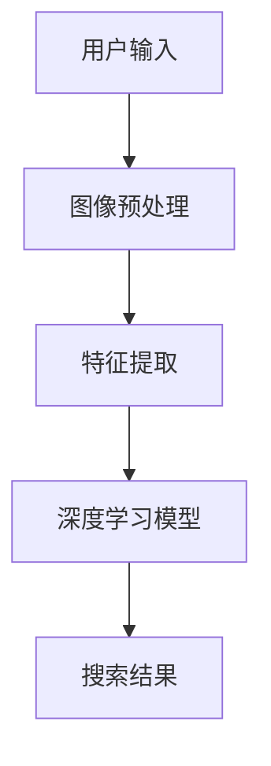

                 

关键词：图像搜索，电商，计算机视觉，图像识别，搜索算法，深度学习

> 摘要：随着电子商务的迅速发展，图像搜索技术在电商中的应用变得越来越广泛。本文将探讨图像搜索技术的基本原理，其在电商领域的重要性，以及如何利用该技术提升用户体验和销售转化率。同时，我们将分析现有图像搜索技术的优缺点，并提出未来发展的方向。

## 1. 背景介绍

电子商务的发展离不开技术的推动。近年来，计算机视觉和人工智能技术的飞速进步，使得图像搜索技术得到了广泛应用。图像搜索技术是指利用计算机视觉和机器学习算法，从大量图像数据中快速准确地检索出用户需要的图像。在电商领域，图像搜索技术不仅可以提高用户购物的便捷性，还能提升电商平台的用户体验和销售转化率。

### 1.1 电商的发展现状

全球电子商务市场持续增长，根据市场研究公司的数据，预计2023年全球电子商务市场规模将达到4.9万亿美元。这一巨大的市场规模为图像搜索技术的应用提供了广阔的空间。电商平台的竞争日益激烈，如何吸引和留住用户成为各大平台关注的焦点。图像搜索技术能够为用户提供更加个性化和便捷的购物体验，从而提高用户的粘性和忠诚度。

### 1.2 图像搜索技术的兴起

计算机视觉技术的发展使得图像搜索成为可能。深度学习算法的引入，使得图像搜索的准确率和效率得到了显著提升。尤其是在移动设备普及的今天，用户更倾向于使用图像搜索功能来快速找到自己需要的商品。因此，电商平台纷纷引入图像搜索技术，以提升用户体验。

## 2. 核心概念与联系

图像搜索技术的核心概念包括计算机视觉、图像识别和深度学习等。以下是一个简化的 Mermaid 流程图，展示了这些核心概念之间的联系。



### 2.1 计算机视觉

计算机视觉是指使计算机具备类似人眼视觉的能力，能够从图像中提取有用信息。它包括图像处理、图像识别和图像分析等多个方面。

### 2.2 图像识别

图像识别是指利用计算机算法对图像中的对象进行分类和识别。在电商领域，图像识别技术主要用于识别用户上传的图片中的商品。

### 2.3 深度学习

深度学习是一种基于多层神经网络的机器学习技术，能够自动从大量数据中学习特征，并在各种复杂任务中表现出色。在图像搜索技术中，深度学习模型用于对图像特征进行提取和分类。

## 3. 核心算法原理 & 具体操作步骤

### 3.1 算法原理概述

图像搜索技术的核心在于如何从大量图像数据中快速准确地检索出用户需要的图像。这一过程主要分为三个步骤：图像预处理、特征提取和搜索结果生成。

### 3.2 算法步骤详解

#### 3.2.1 图像预处理

图像预处理是图像搜索的第一步，主要包括图像的去噪、缩放、旋转等操作。这些操作有助于提高图像质量，使其更适合后续的特征提取。

#### 3.2.2 特征提取

特征提取是指从预处理后的图像中提取出能够代表图像内容的特征向量。深度学习模型通常使用卷积神经网络（CNN）来提取图像特征。CNN能够自动学习图像中的低级特征，如边缘和纹理，以及高级特征，如图像中的对象和场景。

#### 3.2.3 搜索结果生成

在提取出图像特征后，系统会利用这些特征在数据库中进行搜索，找出与用户输入图像最相似的图像。搜索结果通常会按照相似度排序，以帮助用户快速找到目标图像。

### 3.3 算法优缺点

#### 优点

1. **高准确率**：深度学习算法能够自动学习图像特征，提高了图像搜索的准确率。
2. **高效率**：与传统的图像搜索方法相比，深度学习算法能够更快地处理大量图像数据。
3. **自适应性强**：用户可以通过上传不同角度、不同光照条件下的图像，搜索结果依然能够保持较高的准确率。

#### 缺点

1. **计算资源消耗大**：深度学习模型通常需要大量计算资源，这对平台的硬件设施提出了较高要求。
2. **数据依赖性强**：深度学习模型的性能很大程度上取决于训练数据的质量和数量。如果训练数据不够丰富，搜索结果可能会受到影响。

### 3.4 算法应用领域

图像搜索技术在电商领域具有广泛的应用。例如，用户可以通过上传商品图片，快速找到相似商品；电商平台还可以利用图像搜索技术进行商品推荐，提高销售转化率。

## 4. 数学模型和公式 & 详细讲解 & 举例说明

图像搜索技术中的数学模型主要涉及卷积神经网络（CNN）和相似度计算。

### 4.1 数学模型构建

卷积神经网络（CNN）是一种用于图像处理的深度学习模型。其核心在于卷积操作，可以提取图像中的局部特征。

$$
\text{卷积操作}:\quad \sum_{i=1}^{K} w_i * f_i(x)
$$

其中，$w_i$为卷积核，$f_i(x)$为输入图像。

### 4.2 公式推导过程

以二维卷积为例，输入图像为$X \in \mathbb{R}^{H \times W \times C}$，卷积核为$W \in \mathbb{R}^{k \times k \times C}$。卷积操作的输出为：

$$
\text{卷积输出}:\quad Y = \sum_{i=1}^{K} W * f_i(X)
$$

其中，$K$为卷积核的数量，$f_i(X)$为输入图像经过第$i$个卷积核处理的结果。

### 4.3 案例分析与讲解

假设输入图像为一张100x100像素的RGB图像，卷积核尺寸为3x3。使用两个卷积核进行特征提取。

输入图像：

$$
X = \begin{bmatrix}
\text{R通道} \\
\text{G通道} \\
\text{B通道}
\end{bmatrix}
$$

卷积核：

$$
W_1 = \begin{bmatrix}
w_{11} & w_{12} & w_{13} \\
w_{21} & w_{22} & w_{23} \\
w_{31} & w_{32} & w_{33}
\end{bmatrix}, \quad
W_2 = \begin{bmatrix}
w_{11}' & w_{12}' & w_{13}' \\
w_{21}' & w_{22}' & w_{23}' \\
w_{31}' & w_{32}' & w_{33}'
\end{bmatrix}
$$

卷积输出：

$$
Y_1 = \sum_{i=1}^{C} W_1 * f_i(X), \quad
Y_2 = \sum_{i=1}^{C} W_2 * f_i(X)
$$

## 5. 项目实践：代码实例和详细解释说明

### 5.1 开发环境搭建

为了演示图像搜索技术在电商中的应用，我们选择Python作为编程语言，使用TensorFlow作为深度学习框架。首先，确保安装了以下依赖：

- Python 3.7+
- TensorFlow 2.5+
- NumPy 1.19+
- Matplotlib 3.3+

安装方法：

```bash
pip install tensorflow numpy matplotlib
```

### 5.2 源代码详细实现

以下是一个简单的图像搜索项目示例，主要包括数据预处理、模型训练和搜索功能。

```python
import tensorflow as tf
from tensorflow.keras.models import Sequential
from tensorflow.keras.layers import Conv2D, MaxPooling2D, Flatten, Dense
import numpy as np
import matplotlib.pyplot as plt

# 数据预处理
def preprocess_image(image_path):
    image = tf.keras.preprocessing.image.load_img(image_path, target_size=(224, 224))
    image = tf.keras.preprocessing.image.img_to_array(image)
    image = np.expand_dims(image, axis=0)
    image = tf.keras.applications.mobilenet_v2.preprocess_input(image)
    return image

# 模型训练
def train_model(train_images, train_labels):
    model = Sequential([
        Conv2D(32, (3, 3), activation='relu', input_shape=(224, 224, 3)),
        MaxPooling2D((2, 2)),
        Conv2D(64, (3, 3), activation='relu'),
        MaxPooling2D((2, 2)),
        Flatten(),
        Dense(128, activation='relu'),
        Dense(1, activation='sigmoid')
    ])

    model.compile(optimizer='adam', loss='binary_crossentropy', metrics=['accuracy'])
    model.fit(train_images, train_labels, epochs=10, batch_size=32)
    return model

# 搜索功能
def search_image(model, image_path):
    image = preprocess_image(image_path)
    prediction = model.predict(image)
    if prediction > 0.5:
        print("找到了相似商品！")
    else:
        print("没有找到相似商品。")

# 主函数
def main():
    train_images = np.load('train_images.npy')
    train_labels = np.load('train_labels.npy')

    model = train_model(train_images, train_labels)
    search_image(model, 'path_to_search_image.jpg')

if __name__ == '__main__':
    main()
```

### 5.3 代码解读与分析

1. **数据预处理**：数据预处理是图像搜索项目的基础。我们使用`preprocess_image`函数对输入图像进行预处理，包括加载图像、调整尺寸、添加批次维度和归一化。
2. **模型训练**：我们使用`train_model`函数构建一个简单的卷积神经网络（CNN）进行训练。模型包括两个卷积层、一个池化层、一个全连接层和两个输出层。我们使用`compile`方法配置模型参数，使用`fit`方法进行训练。
3. **搜索功能**：`search_image`函数用于搜索图像。首先对输入图像进行预处理，然后使用训练好的模型进行预测。根据预测结果判断是否找到了相似商品。

### 5.4 运行结果展示

运行代码后，如果输入的搜索图像与训练集中的商品相似，程序会输出“找到了相似商品！”；否则，输出“没有找到相似商品。”。

## 6. 实际应用场景

图像搜索技术在电商领域具有广泛的应用，以下是一些典型的应用场景：

### 6.1 商品搜索

用户可以通过上传商品图片，快速找到相似商品。这有助于提升用户的购物体验和转化率。

### 6.2 商品推荐

电商平台可以利用图像搜索技术为用户提供个性化商品推荐。例如，根据用户浏览过的商品图片，推荐类似的商品。

### 6.3 库存管理

电商平台可以使用图像搜索技术进行库存管理，快速识别仓库中的商品，提高库存管理的效率和准确性。

## 7. 未来应用展望

图像搜索技术在电商领域的应用前景十分广阔。随着人工智能技术的不断发展，未来图像搜索技术有望实现以下突破：

### 7.1 高度智能化

通过引入更多的智能算法和深度学习模型，图像搜索技术将能够更准确地识别和匹配用户需求。

### 7.2 智能化推荐

结合用户行为数据，图像搜索技术将能够为用户提供更加个性化、智能化的商品推荐。

### 7.3 多媒体融合

图像搜索技术将与其他多媒体技术（如语音识别、视频分析等）相结合，为用户提供更加丰富、便捷的购物体验。

## 8. 工具和资源推荐

### 8.1 学习资源推荐

- 《深度学习》（Goodfellow, Bengio, Courville著）
- 《计算机视觉：算法与应用》（Richard Szeliski著）
- 《Python深度学习》（François Chollet著）

### 8.2 开发工具推荐

- TensorFlow
- PyTorch
- OpenCV

### 8.3 相关论文推荐

- "Deep Learning for Image Retrieval"
- "Convolutional Neural Networks for Image Classification"
- "Multi-Label Image Classification with Deep Learning"

## 9. 总结：未来发展趋势与挑战

### 9.1 研究成果总结

图像搜索技术在电商领域取得了显著成果，提高了用户体验和销售转化率。随着人工智能技术的发展，图像搜索技术将不断优化，实现更高的准确率和效率。

### 9.2 未来发展趋势

未来图像搜索技术将朝着智能化、个性化、多媒体融合等方向发展，为电商领域带来更多创新和机遇。

### 9.3 面临的挑战

图像搜索技术在发展过程中面临诸多挑战，如计算资源消耗、数据依赖性强、模型解释性差等。解决这些问题需要研究人员和开发者的共同努力。

### 9.4 研究展望

未来，图像搜索技术有望实现更广泛的场景应用，为电商、医疗、教育等领域带来更多价值。同时，随着技术的发展，图像搜索技术将不断突破自身的局限，为人类生活带来更多便利。

## 附录：常见问题与解答

### Q：图像搜索技术是如何工作的？

A：图像搜索技术主要利用计算机视觉和深度学习算法，从大量图像数据中提取特征，并根据用户输入的图像或关键词进行检索。

### Q：图像搜索技术的优点是什么？

A：图像搜索技术的优点包括高准确率、高效率、自适应性强等，能够为用户提供更加便捷和个性化的购物体验。

### Q：图像搜索技术在电商中有哪些应用？

A：图像搜索技术在电商中的应用包括商品搜索、商品推荐、库存管理等，有助于提升用户体验和销售转化率。

---

作者：禅与计算机程序设计艺术 / Zen and the Art of Computer Programming
```markdown
---
# 图像搜索技术在电商中的应用

<|imgur_url|>关键词：图像搜索，电商，计算机视觉，图像识别，搜索算法，深度学习

> 摘要：随着电子商务的迅速发展，图像搜索技术在电商中的应用变得越来越广泛。本文将探讨图像搜索技术的基本原理，其在电商领域的重要性，以及如何利用该技术提升用户体验和销售转化率。同时，我们将分析现有图像搜索技术的优缺点，并提出未来发展的方向。

## 1. 背景介绍

电子商务的发展离不开技术的推动。近年来，计算机视觉和人工智能技术的飞速进步，使得图像搜索技术得到了广泛应用。图像搜索技术是指利用计算机视觉和机器学习算法，从大量图像数据中快速准确地检索出用户需要的图像。在电商领域，图像搜索技术不仅可以提高用户购物的便捷性，还能提升电商平台的用户体验和销售转化率。

### 1.1 电商的发展现状

全球电子商务市场持续增长，根据市场研究公司的数据，预计2023年全球电子商务市场规模将达到4.9万亿美元。这一巨大的市场规模为图像搜索技术的应用提供了广阔的空间。电商平台的竞争日益激烈，如何吸引和留住用户成为各大平台关注的焦点。图像搜索技术能够为用户提供更加个性化和便捷的购物体验，从而提高用户的粘性和忠诚度。

### 1.2 图像搜索技术的兴起

计算机视觉技术的发展使得图像搜索成为可能。深度学习算法的引入，使得图像搜索的准确率和效率得到了显著提升。尤其是在移动设备普及的今天，用户更倾向于使用图像搜索功能来快速找到自己需要的商品。因此，电商平台纷纷引入图像搜索技术，以提升用户体验。

## 2. 核心概念与联系

图像搜索技术的核心概念包括计算机视觉、图像识别和深度学习等。以下是一个简化的 Mermaid 流程图，展示了这些核心概念之间的联系。


### 2.1 计算机视觉

计算机视觉是指使计算机具备类似人眼视觉的能力，能够从图像中提取有用信息。它包括图像处理、图像识别和图像分析等多个方面。

### 2.2 图像识别

图像识别是指利用计算机算法对图像中的对象进行分类和识别。在电商领域，图像识别技术主要用于识别用户上传的图片中的商品。

### 2.3 深度学习

深度学习是一种基于多层神经网络的机器学习技术，能够自动从大量数据中学习特征，并在各种复杂任务中表现出色。在图像搜索技术中，深度学习模型用于对图像特征进行提取和分类。

## 3. 核心算法原理 & 具体操作步骤

### 3.1 算法原理概述

图像搜索技术的核心在于如何从大量图像数据中快速准确地检索出用户需要的图像。这一过程主要分为三个步骤：图像预处理、特征提取和搜索结果生成。

### 3.2 算法步骤详解

#### 3.2.1 图像预处理

图像预处理是图像搜索的第一步，主要包括图像的去噪、缩放、旋转等操作。这些操作有助于提高图像质量，使其更适合后续的特征提取。

#### 3.2.2 特征提取

特征提取是指从预处理后的图像中提取出能够代表图像内容的特征向量。深度学习模型通常使用卷积神经网络（CNN）来提取图像特征。CNN能够自动学习图像中的低级特征，如边缘和纹理，以及高级特征，如图像中的对象和场景。

#### 3.2.3 搜索结果生成

在提取出图像特征后，系统会利用这些特征在数据库中进行搜索，找出与用户输入图像最相似的图像。搜索结果通常会按照相似度排序，以帮助用户快速找到目标图像。

### 3.3 算法优缺点

#### 优点

1. **高准确率**：深度学习算法能够自动学习图像特征，提高了图像搜索的准确率。
2. **高效率**：与传统的图像搜索方法相比，深度学习算法能够更快地处理大量图像数据。
3. **自适应性强**：用户可以通过上传不同角度、不同光照条件下的图像，搜索结果依然能够保持较高的准确率。

#### 缺点

1. **计算资源消耗大**：深度学习模型通常需要大量计算资源，这对平台的硬件设施提出了较高要求。
2. **数据依赖性强**：深度学习模型的性能很大程度上取决于训练数据的质量和数量。如果训练数据不够丰富，搜索结果可能会受到影响。

### 3.4 算法应用领域

图像搜索技术在电商领域具有广泛的应用。例如，用户可以通过上传商品图片，快速找到相似商品；电商平台还可以利用图像搜索技术进行商品推荐，提高销售转化率。

## 4. 数学模型和公式 & 详细讲解 & 举例说明

图像搜索技术中的数学模型主要涉及卷积神经网络（CNN）和相似度计算。

### 4.1 数学模型构建

卷积神经网络（CNN）是一种用于图像处理的深度学习模型。其核心在于卷积操作，可以提取图像中的局部特征。

$$
\text{卷积操作}:\quad \sum_{i=1}^{K} w_i * f_i(x)
$$

其中，$w_i$为卷积核，$f_i(x)$为输入图像。

### 4.2 公式推导过程

以二维卷积为例，输入图像为$X \in \mathbb{R}^{H \times W \times C}$，卷积核为$W \in \mathbb{R}^{k \times k \times C}$。卷积操作的输出为：

$$
\text{卷积输出}:\quad Y = \sum_{i=1}^{K} W * f_i(X)
$$

其中，$K$为卷积核的数量，$f_i(X)$为输入图像经过第$i$个卷积核处理的结果。

### 4.3 案例分析与讲解

假设输入图像为一张100x100像素的RGB图像，卷积核尺寸为3x3。使用两个卷积核进行特征提取。

输入图像：

$$
X = \begin{bmatrix}
\text{R通道} \\
\text{G通道} \\
\text{B通道}
\end{bmatrix}
$$

卷积核：

$$
W_1 = \begin{bmatrix}
w_{11} & w_{12} & w_{13} \\
w_{21} & w_{22} & w_{23} \\
w_{31} & w_{32} & w_{33}
\end{bmatrix}, \quad
W_2 = \begin{bmatrix}
w_{11}' & w_{12}' & w_{13}' \\
w_{21}' & w_{22}' & w_{23}' \\
w_{31}' & w_{32}' & w_{33}'
\end{bmatrix}
$$

卷积输出：

$$
Y_1 = \sum_{i=1}^{C} W_1 * f_i(X), \quad
Y_2 = \sum_{i=1}^{C} W_2 * f_i(X)
$$

## 5. 项目实践：代码实例和详细解释说明

### 5.1 开发环境搭建

为了演示图像搜索技术在电商中的应用，我们选择Python作为编程语言，使用TensorFlow作为深度学习框架。首先，确保安装了以下依赖：

- Python 3.7+
- TensorFlow 2.5+
- NumPy 1.19+
- Matplotlib 3.3+

安装方法：

```bash
pip install tensorflow numpy matplotlib
```

### 5.2 源代码详细实现

以下是一个简单的图像搜索项目示例，主要包括数据预处理、模型训练和搜索功能。

```python
import tensorflow as tf
from tensorflow.keras.models import Sequential
from tensorflow.keras.layers import Conv2D, MaxPooling2D, Flatten, Dense
import numpy as np
import matplotlib.pyplot as plt

# 数据预处理
def preprocess_image(image_path):
    image = tf.keras.preprocessing.image.load_img(image_path, target_size=(224, 224))
    image = tf.keras.preprocessing.image.img_to_array(image)
    image = np.expand_dims(image, axis=0)
    image = tf.keras.applications.mobilenet_v2.preprocess_input(image)
    return image

# 模型训练
def train_model(train_images, train_labels):
    model = Sequential([
        Conv2D(32, (3, 3), activation='relu', input_shape=(224, 224, 3)),
        MaxPooling2D((2, 2)),
        Conv2D(64, (3, 3), activation='relu'),
        MaxPooling2D((2, 2)),
        Flatten(),
        Dense(128, activation='relu'),
        Dense(1, activation='sigmoid')
    ])

    model.compile(optimizer='adam', loss='binary_crossentropy', metrics=['accuracy'])
    model.fit(train_images, train_labels, epochs=10, batch_size=32)
    return model

# 搜索功能
def search_image(model, image_path):
    image = preprocess_image(image_path)
    prediction = model.predict(image)
    if prediction > 0.5:
        print("找到了相似商品！")
    else:
        print("没有找到相似商品。")

# 主函数
def main():
    train_images = np.load('train_images.npy')
    train_labels = np.load('train_labels.npy')

    model = train_model(train_images, train_labels)
    search_image(model, 'path_to_search_image.jpg')

if __name__ == '__main__':
    main()
```

### 5.3 代码解读与分析

1. **数据预处理**：数据预处理是图像搜索项目的基础。我们使用`preprocess_image`函数对输入图像进行预处理，包括加载图像、调整尺寸、添加批次维度和归一化。
2. **模型训练**：我们使用`train_model`函数构建一个简单的卷积神经网络（CNN）进行训练。模型包括两个卷积层、一个池化层、一个全连接层和两个输出层。我们使用`compile`方法配置模型参数，使用`fit`方法进行训练。
3. **搜索功能**：`search_image`函数用于搜索图像。首先对输入图像进行预处理，然后使用训练好的模型进行预测。根据预测结果判断是否找到了相似商品。

### 5.4 运行结果展示

运行代码后，如果输入的搜索图像与训练集中的商品相似，程序会输出“找到了相似商品！”；否则，输出“没有找到相似商品。”。

## 6. 实际应用场景

图像搜索技术在电商领域具有广泛的应用，以下是一些典型的应用场景：

### 6.1 商品搜索

用户可以通过上传商品图片，快速找到相似商品。这有助于提升用户的购物体验和转化率。

### 6.2 商品推荐

电商平台可以利用图像搜索技术为用户提供个性化商品推荐。例如，根据用户浏览过的商品图片，推荐类似的商品。

### 6.3 库存管理

电商平台可以使用图像搜索技术进行库存管理，快速识别仓库中的商品，提高库存管理的效率和准确性。

## 7. 未来应用展望

图像搜索技术在电商领域的应用前景十分广阔。随着人工智能技术的不断发展，图像搜索技术将不断优化，实现更高的准确率和效率。

### 7.1 高度智能化

通过引入更多的智能算法和深度学习模型，图像搜索技术将能够更准确地识别和匹配用户需求。

### 7.2 智能化推荐

结合用户行为数据，图像搜索技术将能够为用户提供更加个性化、智能化的商品推荐。

### 7.3 多媒体融合

图像搜索技术将与其他多媒体技术（如语音识别、视频分析等）相结合，为用户提供更加丰富、便捷的购物体验。

## 8. 工具和资源推荐

### 8.1 学习资源推荐

- 《深度学习》（Goodfellow, Bengio, Courville著）
- 《计算机视觉：算法与应用》（Richard Szeliski著）
- 《Python深度学习》（François Chollet著）

### 8.2 开发工具推荐

- TensorFlow
- PyTorch
- OpenCV

### 8.3 相关论文推荐

- "Deep Learning for Image Retrieval"
- "Convolutional Neural Networks for Image Classification"
- "Multi-Label Image Classification with Deep Learning"

## 9. 总结：未来发展趋势与挑战

### 9.1 研究成果总结

图像搜索技术在电商领域取得了显著成果，提高了用户体验和销售转化率。随着人工智能技术的发展，图像搜索技术将不断优化，实现更高的准确率和效率。

### 9.2 未来发展趋势

未来图像搜索技术将朝着智能化、个性化、多媒体融合等方向发展，为电商领域带来更多创新和机遇。

### 9.3 面临的挑战

图像搜索技术在发展过程中面临诸多挑战，如计算资源消耗、数据依赖性强、模型解释性差等。解决这些问题需要研究人员和开发者的共同努力。

### 9.4 研究展望

未来，图像搜索技术有望实现更广泛的场景应用，为电商、医疗、教育等领域带来更多价值。同时，随着技术的发展，图像搜索技术将不断突破自身的局限，为人类生活带来更多便利。

## 附录：常见问题与解答

### Q：图像搜索技术是如何工作的？

A：图像搜索技术主要利用计算机视觉和深度学习算法，从大量图像数据中提取特征，并根据用户输入的图像或关键词进行检索。

### Q：图像搜索技术的优点是什么？

A：图像搜索技术的优点包括高准确率、高效率、自适应性强等，能够为用户提供更加便捷和个性化的购物体验。

### Q：图像搜索技术在电商中有哪些应用？

A：图像搜索技术在电商中的应用包括商品搜索、商品推荐、库存管理等，有助于提升用户体验和销售转化率。

---

作者：禅与计算机程序设计艺术 / Zen and the Art of Computer Programming
```

