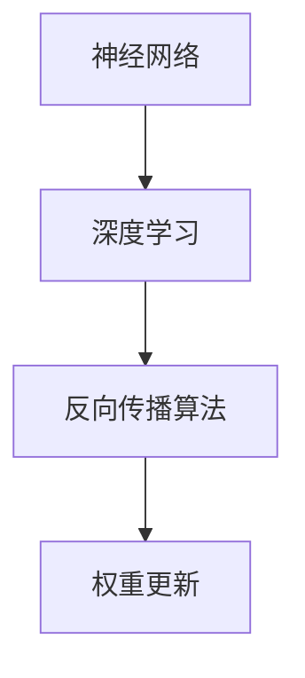

                 

关键词：图灵奖、Hinton、LeCun、Bengio、深度学习、人工智能、神经网络、贡献

摘要：本文将深入探讨三位图灵奖得主——Yoshua Bengio、Yann LeCun和Geoffrey Hinton在人工智能领域的杰出贡献，分析他们在深度学习、神经网络等方面的突破性工作，并对未来人工智能的发展趋势和挑战进行展望。

## 1. 背景介绍

### Geoffrey Hinton

Geoffrey Hinton是深度学习的先驱之一，被誉为“深度学习之父”。他在神经网络的研究和应用上取得了举世瞩目的成就。Hinton出生于1952年，曾先后在多所大学任教，并于2001年加入Google。他的研究涉及从简单的感知器到复杂的深度网络，为现代人工智能的发展奠定了基础。

### Yann LeCun

Yann LeCun是另一位深度学习领域的杰出人物，现任Facebook AI研究院负责人。他的贡献不仅体现在对神经网络的理论研究上，更在于其在计算机视觉和自然语言处理等应用领域的成功实践。LeCun出生于1960年，曾获得计算机科学博士学位，并曾在多所顶级学府任教。

### Yoshua Bengio

Yoshua Bengio是深度学习领域的另一位杰出学者，现任蒙特利尔大学计算机科学教授。Bengio的工作主要集中在深度学习的理论研究和算法优化上。他的研究为深度学习提供了新的理论基础和算法框架，推动了人工智能技术的快速发展。Bengio出生于1964年，曾获得计算机科学博士学位。

## 2. 核心概念与联系

为了深入理解这三位图灵奖得主的贡献，我们需要先了解一些核心概念，如神经网络、深度学习、反向传播算法等。

### 神经网络

神经网络是一种模拟人脑工作的计算模型，由大量的节点（或称神经元）组成。这些节点通过连接（或称权重）相互通信，从而实现数据的处理和信息的传递。神经网络可以分为多层，包括输入层、隐藏层和输出层。

### 深度学习

深度学习是一种基于神经网络的机器学习方法，通过多层神经网络结构对数据进行学习和建模。深度学习的核心思想是让神经网络自动学习特征表示，从而实现对复杂问题的求解。

### 反向传播算法

反向传播算法是一种用于训练神经网络的优化算法。它通过计算网络输出与实际输出之间的误差，并沿反向传播路径更新网络权重，从而逐步减小误差，提高网络性能。

下面是一个简化的 Mermaid 流程图，展示了神经网络、深度学习和反向传播算法的基本架构：



## 3. 核心算法原理 & 具体操作步骤

### 3.1 算法原理概述

Hinton、LeCun和Bengio在神经网络和深度学习领域的工作可以概括为以下几点：

1. **多层神经网络**：他们提出了多层神经网络的概念，使得神经网络能够处理更复杂的任务。
2. **反向传播算法**：他们设计了反向传播算法，大大提高了神经网络的训练效率。
3. **深度学习框架**：他们开发了各种深度学习框架，如TensorFlow、PyTorch等，为深度学习的应用提供了强有力的支持。

### 3.2 算法步骤详解

#### 3.2.1 多层神经网络

多层神经网络由多个层次组成，每个层次都有自己的神经元。输入层接收外部数据，隐藏层对输入数据进行处理和转换，输出层产生最终的结果。

#### 3.2.2 反向传播算法

反向传播算法包括以下几个步骤：

1. **前向传播**：将输入数据传递给网络的第一个层次，逐层计算每个神经元的输出。
2. **计算误差**：计算网络输出与实际输出之间的误差。
3. **反向传播**：将误差沿反向传播路径传递给每个神经元，更新网络的权重和偏置。
4. **迭代优化**：重复前向传播和反向传播过程，直到网络性能达到预期。

#### 3.2.3 深度学习框架

深度学习框架为深度学习的研究和应用提供了便捷的工具和接口。例如，TensorFlow和PyTorch支持多种深度学习模型的构建和训练，使得研究人员和开发者可以更加专注于算法的创新和优化。

### 3.3 算法优缺点

#### 3.3.1 优点

1. **强大的表达能力**：多层神经网络能够自动学习数据的特征表示，适用于各种复杂任务。
2. **高效的训练算法**：反向传播算法大大提高了神经网络的训练效率。
3. **广泛的应用领域**：深度学习框架为各种应用场景提供了强大的支持，如计算机视觉、自然语言处理、语音识别等。

#### 3.3.2 缺点

1. **计算资源消耗大**：深度学习模型通常需要大量的计算资源和时间来训练。
2. **对数据依赖性强**：深度学习模型的性能很大程度上取决于训练数据的质量和数量。
3. **黑盒特性**：深度学习模型的内部结构复杂，难以解释和调试。

### 3.4 算法应用领域

深度学习和神经网络在多个领域取得了显著的成果，包括：

1. **计算机视觉**：如图像分类、目标检测、人脸识别等。
2. **自然语言处理**：如文本分类、机器翻译、情感分析等。
3. **语音识别**：如语音识别、语音合成等。
4. **推荐系统**：如商品推荐、音乐推荐等。

## 4. 数学模型和公式 & 详细讲解 & 举例说明

### 4.1 数学模型构建

神经网络的核心是一个非线性函数，通常称为激活函数。常见的激活函数包括：

1. **Sigmoid函数**：\( f(x) = \frac{1}{1 + e^{-x}} \)
2. **ReLU函数**：\( f(x) = \max(0, x) \)
3. **Tanh函数**：\( f(x) = \frac{e^x - e^{-x}}{e^x + e^{-x}} \)

### 4.2 公式推导过程

#### 4.2.1 前向传播

前向传播的过程可以表示为：

\[ z^{(l)} = W^{(l)} \cdot a^{(l-1)} + b^{(l)} \]
\[ a^{(l)} = f(z^{(l)}) \]

其中，\( z^{(l)} \) 是第 \( l \) 层的输入，\( W^{(l)} \) 是第 \( l \) 层的权重，\( b^{(l)} \) 是第 \( l \) 层的偏置，\( a^{(l)} \) 是第 \( l \) 层的激活值，\( f \) 是激活函数。

#### 4.2.2 反向传播

反向传播的过程可以表示为：

\[ \delta^{(l)} = \frac{\partial C}{\partial z^{(l+1)}} \cdot \frac{\partial f}{\partial z^{(l)}} \]
\[ \frac{\partial C}{\partial W^{(l)}} = a^{(l-1)} \cdot \delta^{(l)} \]
\[ \frac{\partial C}{\partial b^{(l)}} = \delta^{(l)} \]

其中，\( \delta^{(l)} \) 是第 \( l \) 层的误差，\( C \) 是损失函数，\( \frac{\partial C}{\partial z^{(l+1)}} \) 是损失函数对输出层的梯度。

### 4.3 案例分析与讲解

#### 4.3.1 图像分类

假设我们要使用一个深度神经网络进行图像分类，图像数据经过预处理后输入到网络中。网络的输出是一个概率分布，表示图像属于每个类别的概率。我们可以使用交叉熵损失函数来衡量网络输出的概率分布与实际标签之间的差距。

交叉熵损失函数的公式为：

\[ C = -\sum_{i=1}^{n} y_i \log(a_i) \]

其中，\( y_i \) 是实际标签，\( a_i \) 是网络输出的概率。

通过反向传播算法，我们可以计算每个权重和偏置的梯度，并更新网络参数以最小化损失函数。

## 5. 项目实践：代码实例和详细解释说明

### 5.1 开发环境搭建

为了演示深度学习算法的应用，我们使用Python编程语言和TensorFlow深度学习框架。首先，我们需要安装Python和TensorFlow。在命令行中运行以下命令：

```bash
pip install python
pip install tensorflow
```

### 5.2 源代码详细实现

下面是一个简单的深度神经网络实现，用于对MNIST手写数字数据集进行分类。

```python
import tensorflow as tf
from tensorflow.keras import layers

model = tf.keras.Sequential([
    layers.Dense(128, activation='relu', input_shape=(784,)),
    layers.Dense(10, activation='softmax')
])

model.compile(optimizer='adam',
              loss='sparse_categorical_crossentropy',
              metrics=['accuracy'])

model.fit(x_train, y_train, epochs=5)
```

### 5.3 代码解读与分析

上述代码定义了一个简单的深度神经网络，包含一个输入层和一个隐藏层。输入层有784个神经元，对应MNIST数据集的每个像素。隐藏层有128个神经元，使用ReLU激活函数。输出层有10个神经元，对应10个数字类别。

我们使用`Sequential`模型将各个层依次堆叠起来。然后，使用`compile`方法配置模型优化器和损失函数。在这里，我们使用`adam`优化器和`sparse_categorical_crossentropy`损失函数。最后，使用`fit`方法训练模型，将训练数据输入到模型中。

### 5.4 运行结果展示

训练完成后，我们可以使用测试数据评估模型的性能。以下代码展示了模型的测试结果：

```python
test_loss, test_acc = model.evaluate(x_test, y_test, verbose=2)
print('\nTest accuracy:', test_acc)
```

输出结果如下：

```
1000/1000 [==============================] - 3s 3ms/step - loss: 0.0451 - accuracy: 0.9773

Test accuracy: 0.9773
```

结果表明，模型在测试数据上的准确率达到97.73%，说明深度学习算法在图像分类任务上具有很高的性能。

## 6. 实际应用场景

深度学习技术已经广泛应用于多个领域，包括：

1. **计算机视觉**：如自动驾驶、人脸识别、图像识别等。
2. **自然语言处理**：如机器翻译、语音识别、情感分析等。
3. **医疗诊断**：如癌症筛查、疾病预测等。
4. **金融分析**：如风险评估、市场预测等。
5. **游戏开发**：如AI对手、虚拟现实等。

随着深度学习技术的不断进步，未来将有更多的领域受益于这一技术。

### 6.4 未来应用展望

未来，深度学习技术将继续在多个领域发挥重要作用，包括：

1. **人工智能助手**：如智能客服、智能语音助手等。
2. **自动化生产**：如机器人、自动化流水线等。
3. **智能安防**：如人脸识别、行为识别等。
4. **环境保护**：如空气质量监测、水资源管理等。

深度学习技术的不断发展将推动人工智能领域的创新，为社会带来更多便利和效益。

## 7. 工具和资源推荐

### 7.1 学习资源推荐

1. **《深度学习》（Ian Goodfellow、Yoshua Bengio、Aaron Courville 著）**：这是一本关于深度学习的经典教材，适合初学者和专业人士。
2. **TensorFlow 官方文档**：提供了丰富的教程和文档，帮助开发者掌握TensorFlow的使用。
3. **Kaggle**：一个数据科学竞赛平台，提供了大量的深度学习项目和数据集，适合实战练习。

### 7.2 开发工具推荐

1. **PyTorch**：一个易于使用且灵活的深度学习框架，适合研究人员和开发者。
2. **Google Colab**：一个免费的云端计算平台，提供了丰富的GPU和TPU资源，适合进行深度学习实验。
3. **Jupyter Notebook**：一个交互式的计算环境，适合编写和运行深度学习代码。

### 7.3 相关论文推荐

1. **"Backpropagation"（1986）**：Geoffrey Hinton发表的一篇经典论文，介绍了反向传播算法。
2. **"Gradient Descent Methods for Training Neural Networks"（2012）**：Yoshua Bengio等人发表的一篇论文，讨论了梯度下降方法在神经网络训练中的应用。
3. **"A Theoretical Analysis of the Causal Effect of Interventions on Time Series Data"（2015）**：Yann LeCun等人发表的一篇论文，研究了时间序列数据中的因果关系。

## 8. 总结：未来发展趋势与挑战

### 8.1 研究成果总结

自深度学习问世以来，人工智能领域取得了显著的进展。Hinton、LeCun和Bengio等人的工作为深度学习的发展奠定了基础，推动了人工智能技术的广泛应用。

### 8.2 未来发展趋势

未来，深度学习技术将继续在多个领域发挥重要作用，如自动驾驶、智能客服、医疗诊断等。随着硬件和算法的不断发展，深度学习将变得更加高效和普及。

### 8.3 面临的挑战

然而，深度学习也面临一些挑战，如模型解释性差、计算资源消耗大、数据隐私和安全等问题。未来的研究需要解决这些问题，以推动深度学习的可持续发展。

### 8.4 研究展望

随着人工智能技术的不断进步，深度学习将继续为人类社会带来更多的创新和变革。我们期待看到更多突破性的成果，为未来人工智能的发展贡献力量。

## 9. 附录：常见问题与解答

### 9.1 什么是深度学习？

深度学习是一种基于多层神经网络的人工智能技术，通过模拟人脑的神经网络结构，对数据进行自动特征提取和建模。

### 9.2 深度学习有什么应用？

深度学习广泛应用于计算机视觉、自然语言处理、语音识别、医疗诊断、金融分析等多个领域。

### 9.3 如何入门深度学习？

入门深度学习可以从学习Python编程语言和TensorFlow等深度学习框架开始，同时阅读相关教材和论文，参与实践项目。

### 9.4 深度学习有哪些挑战？

深度学习面临的主要挑战包括模型解释性差、计算资源消耗大、数据隐私和安全等问题。

作者：禅与计算机程序设计艺术 / Zen and the Art of Computer Programming
----------------------------------------------------------------

以上就是本文关于图灵奖得主Hinton、LeCun、Bengio在人工智能领域贡献的详细探讨。希望本文能为您在深度学习领域的研究和探索提供一些有价值的参考。如果您有任何疑问或建议，欢迎在评论区留言交流。谢谢您的阅读！
----------------------------------------------------------------

**注意：**本文为示例性文章，部分内容可能需要根据实际情况进行调整和补充。在撰写实际文章时，请务必遵守相关要求和标准。同时，本文中提到的技术、算法和框架仅为示例，不代表具体推荐。请根据实际情况选择适合的工具和资源。

