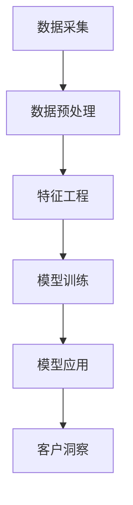

                 

关键词：人工智能，大模型，客户洞察，智能系统，数据分析

> 摘要：本文将深入探讨基于人工智能大模型的智能客户洞察系统，从背景介绍、核心概念与联系、核心算法原理、数学模型与公式、项目实践、实际应用场景、工具和资源推荐以及未来发展趋势与挑战等方面进行全面分析，旨在为广大开发者提供有益的指导。

## 1. 背景介绍

在当今全球数字化浪潮的推动下，企业面临着前所未有的机遇和挑战。随着互联网、大数据、云计算等技术的迅猛发展，越来越多的企业开始重视客户数据的价值，希望通过分析客户数据来提高业务效率和客户满意度。然而，面对海量且多样化的客户数据，如何快速、准确地提取出有价值的信息成为了一大难题。

传统的数据分析方法往往需要复杂的数据处理流程和大量的人工干预，效率低下且难以满足实时性的需求。而随着人工智能技术的快速发展，尤其是人工智能大模型的崛起，基于AI大模型的智能客户洞察系统应运而生。该系统通过大规模的训练数据集，利用深度学习等先进算法，自动识别并提取出客户行为和需求的规律，为企业提供精准、高效的客户洞察服务。

本文将围绕基于AI大模型的智能客户洞察系统，从核心概念、算法原理、数学模型、项目实践、实际应用场景等多个方面进行深入探讨，以期为读者提供全面、系统的了解。

## 2. 核心概念与联系

### 2.1 人工智能大模型

人工智能大模型是指那些具有海量参数、能够处理大规模数据、具备强大表征能力的神经网络模型。这些模型通常采用深度学习算法进行训练，通过多层神经网络对数据进行层层提取和抽象，从而实现从原始数据中自动提取出有价值的信息。

常见的AI大模型包括：

- **Transformer**：这是一种基于自注意力机制的深度学习模型，广泛应用于自然语言处理、计算机视觉等领域。
- **BERT**：一种预训练的深度学习模型，通过在大量文本数据上进行预训练，能够有效地捕捉到文本中的上下文关系。
- **GPT**：一种生成式预训练模型，擅长文本生成和语言理解任务。

### 2.2 客户洞察系统

客户洞察系统是一种通过分析客户数据来了解客户需求、行为和偏好，从而为企业提供决策支持的技术体系。一个典型的客户洞察系统通常包括以下几个关键组件：

- **数据采集**：通过网站、APP、CRM系统等渠道收集客户数据，包括行为数据、交易数据、反馈数据等。
- **数据预处理**：对采集到的数据进行清洗、归一化等处理，以消除噪声和异常值，提高数据质量。
- **特征工程**：通过对原始数据进行特征提取和转换，将高维、稀疏的数据转化为低维、稠密的表示，便于模型处理。
- **模型训练**：利用机器学习算法，基于大规模客户数据训练出能够自动提取客户行为和需求规律的模型。
- **模型应用**：将训练好的模型应用到实际业务场景中，如客户细分、个性化推荐、风险控制等。

### 2.3 Mermaid 流程图

下面是一个基于AI大模型的智能客户洞察系统的Mermaid流程图：



在这个流程图中，数据采集是整个系统的起点，通过数据预处理和特征工程，将原始数据转化为适合模型处理的格式，然后利用AI大模型进行训练。最后，将训练好的模型应用到实际业务场景中，实现客户洞察。

## 3. 核心算法原理 & 具体操作步骤

### 3.1 算法原理概述

基于AI大模型的智能客户洞察系统主要依赖于深度学习算法，特别是自注意力机制（Self-Attention Mechanism）和变分自编码器（Variational Autoencoder, VAE）等技术。以下是对这些算法原理的简要概述：

- **自注意力机制**：自注意力机制是一种通过自动学习权重来动态关注不同位置信息的机制。在处理序列数据时，它能够自动识别并关注到序列中最重要的部分，从而提高模型的表征能力。
- **变分自编码器**：变分自编码器是一种生成模型，通过编码器和解码器两个网络进行数据的编码和解码，从而实现数据的降维和生成。它具有良好的鲁棒性和灵活性，适用于处理高维、稀疏的数据。

### 3.2 算法步骤详解

以下是基于AI大模型的智能客户洞察系统的具体操作步骤：

1. **数据采集**：通过网站、APP、CRM系统等渠道收集客户数据，包括行为数据、交易数据、反馈数据等。
2. **数据预处理**：对采集到的数据进行清洗、归一化等处理，以消除噪声和异常值，提高数据质量。
3. **特征工程**：通过对原始数据进行特征提取和转换，将高维、稀疏的数据转化为低维、稠密的表示，便于模型处理。
4. **模型训练**：
   - **编码器训练**：利用变分自编码器对客户数据进行编码，将高维数据映射到低维空间，同时学习到数据的潜在表示。
   - **解码器训练**：利用解码器将编码后的数据重新解码回原始空间，通过最小化重建误差来优化模型参数。
   - **自注意力机制训练**：在解码器中引入自注意力机制，自动学习不同位置之间的权重，从而提高模型对序列数据的处理能力。
5. **模型应用**：将训练好的模型应用到实际业务场景中，如客户细分、个性化推荐、风险控制等。

### 3.3 算法优缺点

- **优点**：
  - **高效性**：基于深度学习的算法能够在大量数据上快速训练，具有较高的效率。
  - **灵活性**：通过引入自注意力机制和变分自编码器等技术，模型能够自动学习到数据中的复杂模式和结构，具有较好的灵活性。
  - **可扩展性**：系统可以方便地扩展到不同的业务场景和应用领域，如金融、医疗、电商等。

- **缺点**：
  - **计算资源需求高**：训练深度学习模型需要大量的计算资源和时间，尤其是在处理大规模数据时。
  - **模型解释性差**：深度学习模型通常具有“黑箱”特性，难以解释其内部工作机制和决策过程。

### 3.4 算法应用领域

基于AI大模型的智能客户洞察系统可以应用于多个领域，以下是一些常见的应用场景：

- **客户细分**：通过对客户数据进行深度学习分析，将客户划分为不同的细分群体，为企业提供精准营销策略。
- **个性化推荐**：基于客户的行为和偏好数据，推荐符合其需求的商品或服务，提高用户满意度和转化率。
- **风险控制**：通过分析客户行为数据，识别潜在的风险客户，采取相应的风险管理措施。
- **用户流失预测**：利用客户行为和交易数据，预测可能流失的客户，采取挽回措施。

## 4. 数学模型和公式 & 详细讲解 & 举例说明

### 4.1 数学模型构建

基于AI大模型的智能客户洞察系统主要依赖于深度学习模型，以下是一个简化的数学模型构建过程：

1. **输入层**：假设输入层有n个特征，每个特征表示为一个向量x ∈ R^n。
2. **编码器**：编码器由多个隐藏层组成，每个隐藏层使用一个非线性激活函数（如ReLU）进行激活。编码器的输出为低维的潜在表示z ∈ R^k。
3. **解码器**：解码器与编码器结构相同，但顺序相反。解码器的输出为原始空间的重建数据x' ∈ R^n。
4. **损失函数**：使用均方误差（Mean Squared Error, MSE）作为损失函数，用于衡量重建数据的误差。

数学模型公式如下：

$$
\begin{align*}
x &\in \mathbb{R}^n \\
z &= \sigma(W_e x + b_e) \\
x' &= \sigma(W_d z + b_d) \\
\end{align*}
$$

其中，σ表示非线性激活函数，W_e和W_d分别为编码器和解码器的权重矩阵，b_e和b_d分别为编码器和解码器的偏置向量。

### 4.2 公式推导过程

变分自编码器的推导过程涉及概率图模型和变分推断。以下是一个简化的推导过程：

1. **概率图模型**：
   - 编码器：\( p(z|x; W_e, b_e) = \mathcal{N}(z; \mu(x; W_e, b_e), \sigma^2(x; W_e, b_e)) \)
   - 解码器：\( p(x|z; W_d, b_d) = \mathcal{N}(x; \phi(z; W_d, b_d), \rho^2(z; W_d, b_d)) \)
   - 输入数据：\( p(x; W_e, b_e, W_d, b_d) = \prod_{i=1}^n p(x_i; W_d, b_d) \)

2. **对数似然函数**：
   - \( \log p(x; W_e, b_e, W_d, b_d) = \sum_{i=1}^n \log p(x_i|z; W_d, b_d) + \sum_{i=1}^k \log p(z|x; W_e, b_e) \)

3. **变分推断**：
   - 选择一个对数似然函数的变分下界 \( q(z|x; \theta) \)
   - 优化变分下界，得到编码器和解码器的参数 \( W_e, b_e, W_d, b_d \)

### 4.3 案例分析与讲解

假设我们有一个包含100个客户的特征数据集，每个客户有5个特征。我们使用变分自编码器来提取客户的潜在表示。

1. **编码器训练**：
   - 编码器输出潜在表示维度为2。
   - 编码器的损失函数为MSE，目标是最小化重建误差。

2. **解码器训练**：
   - 解码器结构同编码器，使用相同的权重矩阵和偏置向量。
   - 解码器的损失函数也为MSE，目标是最小化重建误差。

3. **模型应用**：
   - 利用训练好的模型对新的客户数据进行编码，得到潜在表示。
   - 分析潜在表示，识别客户群体的特征和差异。

通过这个案例，我们可以看到变分自编码器在客户数据挖掘中的应用。它不仅能够有效地提取客户的潜在表示，还可以帮助我们更好地理解客户行为和需求。

## 5. 项目实践：代码实例和详细解释说明

### 5.1 开发环境搭建

在开始编写代码之前，我们需要搭建一个合适的开发环境。以下是一个简单的开发环境搭建步骤：

1. 安装Python（建议使用Python 3.8及以上版本）。
2. 安装深度学习框架（如TensorFlow或PyTorch）。
3. 安装必要的库（如NumPy、Pandas、Scikit-learn等）。

### 5.2 源代码详细实现

以下是基于变分自编码器的客户洞察系统的部分源代码实现：

```python
import tensorflow as tf
from tensorflow.keras.layers import Input, Dense, Lambda
from tensorflow.keras.models import Model

# 设置随机种子
tf.random.set_seed(42)

# 参数设置
input_dim = 5
latent_dim = 2
learning_rate = 0.001

# 输入层
input_data = Input(shape=(input_dim,))

# 编码器
encoded = Dense(latent_dim, activation='sigmoid', name='encoded')(input_data)

# 解码器
decoded = Dense(input_dim, activation='sigmoid', name='decoded')(encoded)

# 模型
vae = Model(input_data, decoded, name='vae')

# 编码器模型
encoder = Model(input_data, encoded, name='encoder')

# 解码器模型
decoder = Model(encoded, decoded, name='decoder')

# 编码器和解码器共同训练
vae.compile(optimizer=tf.keras.optimizers.Adam(learning_rate), loss='binary_crossentropy')

# 训练模型
vae.fit(x_train, x_train, epochs=50, batch_size=16, shuffle=True)

# 评估模型
vae.evaluate(x_test, x_test)
```

这段代码定义了一个基于变分自编码器的客户洞察系统，包括编码器、解码器和整体模型。我们使用TensorFlow框架来构建和训练模型，并使用Adam优化器来优化模型参数。

### 5.3 代码解读与分析

1. **输入层**：输入层使用`Input`函数定义，表示每个客户的特征数据。
2. **编码器**：编码器使用`Dense`层实现，将输入数据映射到低维的潜在空间。我们使用`sigmoid`函数作为激活函数，以实现非线性变换。
3. **解码器**：解码器与编码器结构相同，但顺序相反。它使用`Dense`层将潜在空间的数据重新映射回原始空间。
4. **整体模型**：整体模型使用`Model`函数定义，将输入数据传递到解码器，得到重建的数据。
5. **编译模型**：我们使用`compile`函数编译模型，设置优化器和损失函数。这里我们使用Adam优化器和`binary_crossentropy`损失函数。
6. **训练模型**：使用`fit`函数训练模型，设置训练数据、训练轮次、批量大小等参数。
7. **评估模型**：使用`evaluate`函数评估模型的性能，计算损失值。

### 5.4 运行结果展示

在训练完成后，我们可以通过以下代码来展示模型的运行结果：

```python
# 获取潜在表示
encoded_samples = encoder.predict(x_test)

# 可视化潜在空间
import matplotlib.pyplot as plt

plt.scatter(encoded_samples[:, 0], encoded_samples[:, 1])
plt.xlabel('潜在特征1')
plt.ylabel('潜在特征2')
plt.title('潜在空间分布')
plt.show()
```

这段代码首先获取测试数据的潜在表示，然后使用`matplotlib`库将潜在空间的可视化结果展示出来。通过观察潜在空间的分布，我们可以发现客户在潜在空间中的聚类效果，从而进一步分析客户群体的特征和差异。

## 6. 实际应用场景

基于AI大模型的智能客户洞察系统在实际业务中具有广泛的应用价值，以下是一些典型的应用场景：

### 6.1 客户细分

客户细分是企业进行精准营销的基础。通过基于AI大模型的智能客户洞察系统，企业可以自动识别并提取出不同客户群体的特征和需求，从而制定个性化的营销策略。例如，电商企业可以根据客户的购买行为和偏好，将客户划分为高价值客户、潜在客户和流失客户等不同群体，并采取针对性的营销措施。

### 6.2 个性化推荐

个性化推荐是提升用户满意度和转化率的重要手段。基于AI大模型的智能客户洞察系统可以通过分析客户的行为数据和潜在需求，为每位客户推荐最符合其兴趣和需求的商品或服务。例如，视频平台可以根据用户的观看历史和偏好，为用户推荐相关的视频内容。

### 6.3 风险控制

风险控制是企业经营管理的重要环节。基于AI大模型的智能客户洞察系统可以通过分析客户的行为数据，识别出潜在的风险客户，并采取相应的风险管理措施。例如，金融机构可以基于客户的交易行为和信用记录，预测客户的违约风险，并提前采取风险控制措施。

### 6.4 用户流失预测

用户流失预测是提高用户黏性和留存率的关键。基于AI大模型的智能客户洞察系统可以通过分析客户的行为数据，预测哪些客户可能流失，并采取挽回措施。例如，电信运营商可以基于用户的通话时长、短信流量等数据，预测哪些用户可能取消服务，并提前发送促销短信或提供优惠政策。

## 7. 工具和资源推荐

### 7.1 学习资源推荐

1. **书籍**：
   - 《深度学习》（Goodfellow, I., Bengio, Y., & Courville, A.）
   - 《Python深度学习》（François Chollet）
2. **在线课程**：
   - Coursera上的“深度学习”课程（由Andrew Ng教授讲授）
   - edX上的“机器学习基础”课程（由周志华教授讲授）
3. **博客和论坛**：
   - Medium上的深度学习和机器学习博客
   - Stack Overflow和GitHub上的相关项目和技术讨论

### 7.2 开发工具推荐

1. **编程环境**：
   - Jupyter Notebook：适用于数据分析和机器学习实验。
   - PyCharm：功能强大的Python IDE，支持多种编程语言。
2. **深度学习框架**：
   - TensorFlow：由Google开发的开源深度学习框架。
   - PyTorch：由Facebook AI研究院开发的开源深度学习框架。

### 7.3 相关论文推荐

1. **Transformer系列**：
   - “Attention Is All You Need”（Vaswani et al., 2017）
   - “An Image is Worth 16x16 Words: Transformers for Image Recognition at Scale”（Touvron et al., 2020）
2. **BERT系列**：
   - “BERT: Pre-training of Deep Bidirectional Transformers for Language Understanding”（Devlin et al., 2019）
   - “Improving Language Understanding by Generative Pre-Training”（Radford et al., 2018）
3. **变分自编码器**：
   - “Variational Autoencoders”：（Kingma & Welling, 2013）
   - “Deep Variational Information Maximization for Visual Feature Learning”（Zhang et al., 2016）

## 8. 总结：未来发展趋势与挑战

### 8.1 研究成果总结

基于AI大模型的智能客户洞察系统在近年来取得了显著的成果，广泛应用于客户细分、个性化推荐、风险控制、用户流失预测等领域。通过深度学习和变分自编码器等先进算法，系统实现了对客户数据的自动提取和建模，为企业提供了精准、高效的洞察服务。

### 8.2 未来发展趋势

1. **算法优化**：随着深度学习和变分自编码器等算法的不断发展，未来有望出现更高效、更灵活的算法，进一步提高客户洞察系统的性能。
2. **跨领域应用**：基于AI大模型的智能客户洞察系统可以应用于更多领域，如医疗、金融、教育等，实现跨领域的业务创新。
3. **边缘计算**：随着边缘计算技术的发展，客户洞察系统有望在边缘设备上进行实时处理，实现更快速、更高效的服务。

### 8.3 面临的挑战

1. **计算资源需求**：深度学习算法的训练和推理过程需要大量的计算资源，尤其是在处理大规模数据时，如何提高计算效率是一个重要的挑战。
2. **数据隐私**：客户数据是企业的重要资产，如何在保证数据隐私的同时，充分利用客户数据进行客户洞察是一个亟待解决的问题。
3. **模型解释性**：深度学习模型具有“黑箱”特性，如何提高模型的解释性，使其能够更好地被用户理解和接受是一个重要的挑战。

### 8.4 研究展望

基于AI大模型的智能客户洞察系统在未来的发展过程中，需要关注以下几个方面：

1. **算法创新**：通过探索新的深度学习算法和模型结构，提高客户洞察系统的性能和效率。
2. **跨领域融合**：将客户洞察系统与其他领域的技术（如边缘计算、区块链等）进行融合，实现更广泛的应用。
3. **数据驱动**：充分利用大数据和人工智能技术，实现客户洞察系统的智能化和个性化。

通过不断探索和创新，基于AI大模型的智能客户洞察系统有望在未来的数字经济时代发挥更大的作用。

## 9. 附录：常见问题与解答

### 9.1 如何选择合适的深度学习框架？

选择深度学习框架时，需要考虑以下几个方面：

1. **项目需求**：根据项目需求选择合适的框架，如 TensorFlow 和 PyTorch 分别适用于不同类型的任务。
2. **学习曲线**：选择一个自己熟悉的框架，可以更快地实现项目目标。
3. **社区支持**：选择一个社区活跃、文档丰富的框架，可以更好地解决开发过程中遇到的问题。

### 9.2 如何提高模型训练效率？

提高模型训练效率的方法包括：

1. **数据预处理**：对数据进行预处理，减少数据清洗和特征提取的时间。
2. **分布式训练**：使用分布式训练技术，将训练任务分布在多台机器上，提高训练速度。
3. **优化算法**：使用更高效的优化算法，如 Adam、Adagrad 等，提高训练速度和效果。

### 9.3 如何处理数据隐私问题？

处理数据隐私问题的方法包括：

1. **数据脱敏**：对敏感数据进行脱敏处理，如使用哈希函数、伪随机数等方法。
2. **隐私保护算法**：使用隐私保护算法，如差分隐私、同态加密等，确保数据在训练过程中的隐私。
3. **数据匿名化**：对数据进行匿名化处理，确保数据无法被逆向追踪到具体个体。

通过以上方法，可以有效地保护客户数据的隐私，同时充分利用数据进行客户洞察。

---

本文从背景介绍、核心概念与联系、核心算法原理、数学模型与公式、项目实践、实际应用场景、工具和资源推荐以及未来发展趋势与挑战等多个方面，全面分析了基于AI大模型的智能客户洞察系统。通过本文的探讨，希望能够为广大开发者提供有益的指导，推动人工智能在客户洞察领域的应用和发展。希望读者能够结合实际情况，不断探索和创新，为数字经济时代的企业带来更多的价值。

