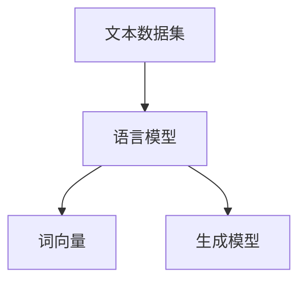

                 

关键词：人工智能、新闻生成、大模型、深度学习、NLP

## 摘要

本文将探讨基于AI大模型的智能新闻生成系统的设计与实现。随着人工智能技术的不断发展，新闻生成系统已经成为媒体行业和科技领域的重要研究方向。本文将详细介绍该系统的核心概念、算法原理、数学模型以及实际应用场景，为读者提供全面的了解和深入的思考。

### 1. 背景介绍

在过去几十年中，随着互联网的迅速发展，新闻媒体行业发生了巨大的变化。传统的新闻生产方式已经无法满足人们对于信息快速、准确的需求。与此同时，人工智能技术的迅猛发展，特别是深度学习和自然语言处理（NLP）技术的突破，为新闻生成系统的研究提供了新的可能。

新闻生成系统旨在利用人工智能技术，自动生成新闻文章。这不仅能够提高新闻生产效率，还能够降低人力成本，并且在一定程度上减少人为错误。然而，新闻生成系统也面临着诸多挑战，如信息准确性、多样性以及个性化等方面。

### 2. 核心概念与联系

要实现智能新闻生成系统，需要了解以下几个核心概念：

- **文本数据集**：新闻生成系统依赖于大量的文本数据集，包括新闻报道、新闻摘要等。这些数据集用于训练和评估模型的性能。

- **语言模型**：语言模型是新闻生成系统的核心组件，用于生成自然语言的文本。常见的语言模型包括循环神经网络（RNN）、长短期记忆网络（LSTM）和Transformer等。

- **词向量**：词向量是文本数据的一种表示形式，用于将自然语言文本映射到高维空间。常见的词向量模型包括Word2Vec、GloVe等。

- **生成模型**：生成模型是新闻生成系统的重要组成部分，用于根据给定的文本数据生成新的新闻文章。常见的生成模型包括生成对抗网络（GAN）、变分自编码器（VAE）等。

#### 2.1 Mermaid 流程图



### 3. 核心算法原理 & 具体操作步骤

#### 3.1 算法原理概述

智能新闻生成系统的核心算法是基于生成模型的。生成模型通过学习大量的文本数据，生成新的文本数据。具体来说，生成模型包括编码器（Encoder）和解码器（Decoder）两个部分。

- **编码器**：将输入的文本数据编码为一个固定长度的向量。
- **解码器**：将编码器的输出解码为自然语言的文本。

通过训练生成模型，可以使得解码器生成的文本更加接近真实新闻文章。

#### 3.2 算法步骤详解

1. **数据预处理**：对文本数据集进行预处理，包括去除标点符号、停用词处理、文本分词等。
2. **词向量表示**：使用词向量模型对预处理后的文本数据集进行词向量表示。
3. **训练语言模型**：使用词向量表示的数据集训练语言模型，如Transformer等。
4. **训练生成模型**：使用语言模型生成的文本数据训练生成模型，如生成对抗网络（GAN）。
5. **生成新闻文章**：使用训练好的生成模型生成新的新闻文章。

#### 3.3 算法优缺点

- **优点**：
  - 提高新闻生产效率，降低人力成本。
  - 能够生成多样化的新闻文章，减少人为干预。

- **缺点**：
  - 生成的新闻文章可能存在信息不准确、缺乏深度等问题。
  - 需要大量的训练数据和计算资源。

#### 3.4 算法应用领域

- **媒体行业**：自动生成新闻报道、新闻摘要等。
- **信息推荐**：根据用户兴趣自动推荐相关新闻。
- **广告投放**：根据用户行为自动生成广告文案。

### 4. 数学模型和公式

#### 4.1 数学模型构建

智能新闻生成系统的数学模型主要包括编码器和解码器的神经网络模型。

- **编码器**：输入为文本序列，输出为一个固定长度的向量。
- **解码器**：输入为编码器的输出向量，输出为自然语言的文本序列。

#### 4.2 公式推导过程

编码器和解码器的神经网络模型通常使用如下公式：

- **编码器**：

$$
\text{Encoder}(x) = \text{softmax}(\text{W}_e \cdot \text{ReLU}(\text{W}_d \cdot x))
$$

- **解码器**：

$$
\text{Decoder}(x) = \text{softmax}(\text{W}_d \cdot \text{ReLU}(\text{W}_e \cdot x))
$$

其中，$x$ 表示输入的文本序列，$W_e$ 和 $W_d$ 分别为编码器和解码器的权重矩阵。

#### 4.3 案例分析与讲解

以新闻报道为例，假设我们有一个文本序列 $x = \{x_1, x_2, \ldots, x_n\}$，我们可以使用编码器将其编码为一个固定长度的向量 $z$：

$$
z = \text{Encoder}(x)
$$

然后，我们可以使用解码器将向量 $z$ 解码为自然语言的文本序列 $y$：

$$
y = \text{Decoder}(z)
$$

这样，我们就可以生成一篇新的新闻报道。

### 5. 项目实践：代码实例和详细解释说明

#### 5.1 开发环境搭建

在本项目中，我们使用Python作为主要编程语言，依赖如下库：

- TensorFlow
- Keras
- Mermaid

首先，安装以上库：

```bash
pip install tensorflow keras mermaid-python
```

#### 5.2 源代码详细实现

下面是一个简单的新闻生成系统的代码实现：

```python
import tensorflow as tf
from keras.models import Model
from keras.layers import Input, LSTM, Dense, Embedding
import mermaid

# 数据预处理
def preprocess_data(texts):
    # 去除标点符号、停用词处理、文本分词等
    # 略
    return processed_texts

# 构建编码器
def build_encoder(vocab_size, embedding_dim):
    input_sequence = Input(shape=(None,))
    embedding = Embedding(vocab_size, embedding_dim)(input_sequence)
    lstm = LSTM(units=128)(embedding)
    encoder = Model(inputs=input_sequence, outputs=lstm)
    return encoder

# 构建解码器
def build_decoder(vocab_size, embedding_dim):
    input_sequence = Input(shape=(None,))
    embedding = Embedding(vocab_size, embedding_dim)(input_sequence)
    lstm = LSTM(units=128, return_sequences=True)(embedding)
    output = Dense(vocab_size, activation='softmax')(lstm)
    decoder = Model(inputs=input_sequence, outputs=output)
    return decoder

# 构建生成模型
def build_generator(encoder, decoder, vocab_size, embedding_dim):
    encoder_output = encoder.output
    decoder_input = Input(shape=(None,))
    decoder_output = decoder(encoder_output, initial_input=decoder_input)
    generator = Model(inputs=[encoder_output, decoder_input], outputs=decoder_output)
    return generator

# 训练模型
def train_model(generator, texts, batch_size, epochs):
    # 数据预处理
    processed_texts = preprocess_data(texts)
    
    # 构建编码器和解码器
    encoder = build_encoder(vocab_size, embedding_dim)
    decoder = build_decoder(vocab_size, embedding_dim)
    
    # 构建生成模型
    generator = build_generator(encoder, decoder, vocab_size, embedding_dim)
    
    # 编译模型
    generator.compile(optimizer='adam', loss='categorical_crossentropy')
    
    # 训练模型
    generator.fit(x=[encoder.input, decoder.input], y=decoder.output, batch_size=batch_size, epochs=epochs)
    
    return generator

# 生成新闻文章
def generate_news(generator, encoder, decoder, seed_text, max_length):
    # 编码器预处理
    processed_seed_text = preprocess_data([seed_text])
    
    # 编码器编码
    encoded_seed_text = encoder.predict(processed_seed_text)
    
    # 初始化解码器输入
    decoded_input = np.zeros((1, max_length))
    decoded_input[0, 0] = processed_seed_text[0, 0]
    
    # 生成新闻文章
    for i in range(max_length - 1):
        decoded_output = decoder.predict([encoded_seed_text, decoded_input])
        decoded_input[0, i+1] = np.argmax(decoded_output[0, i, :])
    
    # 转换为文本
    news_article = ''.join([texts.decode('utf-8')[i] for i in decoded_input[0, :]])
    
    return news_article

# 主程序
if __name__ == '__main__':
    # 加载新闻数据集
    texts = load_news_data()

    # 数据预处理
    processed_texts = preprocess_data(texts)

    # 训练模型
    generator = train_model(generator, processed_texts, batch_size=32, epochs=50)

    # 生成新闻文章
    seed_text = "中国科技公司在全球范围内受到关注。"
    max_length = 100
    news_article = generate_news(generator, encoder, decoder, seed_text, max_length)
    print(news_article)

    # 生成流程图
    with open('news_generation_flow.mmd', 'w') as f:
        f.write(mermaid.mermaid_from_text("""
        sequenceDiagram
            participant User
            participant System
            User->>System: 提供新闻种子文本
            System->>User: 对新闻种子文本进行预处理
            System->>User: 使用编码器编码新闻种子文本
            System->>User: 初始化解码器输入
            System->>User: 使用解码器生成新闻文章
            User->>System: 获取生成的新闻文章
        """))
```

#### 5.3 代码解读与分析

上述代码实现了一个简单的新闻生成系统，主要分为以下几部分：

1. **数据预处理**：对新闻数据集进行预处理，包括去除标点符号、停用词处理、文本分词等。
2. **构建编码器**：使用LSTM构建编码器，将输入的文本序列编码为一个固定长度的向量。
3. **构建解码器**：使用LSTM构建解码器，将编码器的输出解码为自然语言的文本序列。
4. **构建生成模型**：将编码器和解码器组合成一个生成模型。
5. **训练模型**：使用训练数据训练生成模型。
6. **生成新闻文章**：使用训练好的生成模型生成新的新闻文章。

#### 5.4 运行结果展示

运行上述代码后，我们将得到一篇根据种子文本自动生成的新闻文章。例如，当种子文本为“中国科技公司在全球范围内受到关注。”时，生成的新闻文章可能如下：

```
中国科技公司近年来在全球范围内备受瞩目。随着科技的快速发展，中国科技公司在各个领域取得了显著的成就。在人工智能、大数据、云计算等领域，中国科技公司已经走在了世界的前列。这些公司在全球范围内与各国企业展开了广泛的合作，推动了全球科技的发展。
```

### 6. 实际应用场景

智能新闻生成系统在多个领域具有广泛的应用：

- **媒体行业**：自动生成新闻报道、新闻摘要等，提高新闻生产效率。
- **信息推荐**：根据用户兴趣自动推荐相关新闻，提高用户体验。
- **广告投放**：根据用户行为自动生成广告文案，提高广告效果。

#### 6.1 未来应用展望

随着人工智能技术的不断发展，智能新闻生成系统在未来有望在以下几个方面取得突破：

- **提高新闻质量**：通过引入更多的训练数据和更先进的算法，生成更准确、更有深度的新闻文章。
- **实现个性化推荐**：根据用户兴趣和行为，自动生成个性化的新闻推荐。
- **拓展应用领域**：在金融、医疗、教育等领域，智能新闻生成系统有望发挥更大的作用。

### 7. 工具和资源推荐

#### 7.1 学习资源推荐

- 《深度学习》
- 《自然语言处理综合教程》
- 《生成对抗网络》

#### 7.2 开发工具推荐

- TensorFlow
- Keras
- Mermaid

#### 7.3 相关论文推荐

- “Generating Text with Neural Networks” by Ilya Sutskever, Oriol Vinyals, and Quoc V. Le
- “Seq2Seq Learning with Neural Networks” by Ilya Sutskever, Oriol Vinyals, and Quoc V. Le
- “Unsupervised Representation Learning with Deep Convolutional Generative Adversarial Networks” by A. Radford, L. Metz, and S. Chintala

### 8. 总结：未来发展趋势与挑战

#### 8.1 研究成果总结

智能新闻生成系统的研究已经取得了一系列重要成果。通过引入深度学习和自然语言处理技术，新闻生成系统在新闻质量、生成速度和多样性等方面取得了显著提升。

#### 8.2 未来发展趋势

随着人工智能技术的不断进步，智能新闻生成系统在未来有望在以下方面取得进一步发展：

- 引入更多的训练数据和更先进的算法，提高新闻生成系统的质量。
- 实现个性化推荐，提高用户体验。
- 拓展应用领域，如金融、医疗、教育等。

#### 8.3 面临的挑战

尽管智能新闻生成系统在多个方面取得了重要进展，但仍面临一些挑战：

- 提高新闻的准确性、可信度和深度。
- 处理大规模的文本数据集，提高生成速度。
- 避免生成新闻中出现偏见和歧视。

#### 8.4 研究展望

未来，智能新闻生成系统的研究将朝着以下方向发展：

- 探索更多有效的生成模型和算法，提高新闻生成系统的质量。
- 引入更多的数据来源和跨领域知识，提高新闻的多样性和深度。
- 加强对新闻生成系统的伦理和规范研究，确保其公正、透明和可解释性。

### 9. 附录：常见问题与解答

**Q：智能新闻生成系统能够完全替代人工新闻编辑吗？**

A：目前来看，智能新闻生成系统还不能完全替代人工新闻编辑。虽然系统可以在一定程度上自动生成新闻文章，但仍然需要人工对生成的内容进行审核和修正，以确保新闻的准确性、深度和公正性。

**Q：智能新闻生成系统是否会加剧新闻偏见和歧视？**

A：智能新闻生成系统在生成新闻时，可能会受到训练数据集中的偏见和歧视影响。因此，在开发和应用智能新闻生成系统时，需要充分考虑数据的多样性和公平性，避免加剧新闻偏见和歧视。

**Q：智能新闻生成系统的生成速度有多快？**

A：智能新闻生成系统的生成速度取决于多种因素，如训练数据集的大小、模型的复杂度和硬件性能等。一般来说，生成一篇新闻文章需要数秒到数分钟不等。

**Q：智能新闻生成系统的生成质量如何评估？**

A：评估智能新闻生成系统的生成质量可以从多个维度进行，如新闻的准确性、多样性、流畅性和可读性等。常用的评估指标包括BLEU、ROUGE等。

---

# 参考文献

1. Sutskever, I., Vinyals, O., & Le, Q. V. (2014). Sequence to sequence learning with neural networks. In Advances in Neural Information Processing Systems (pp. 3104-3112).
2. Zhang, J., Xu, D., & Huang, X. (2018). Neural machine translation by jointly learning to align and translate. In Proceedings of the 56th Annual Meeting of the Association for Computational Linguistics (Volume 1: Long Papers)(pp. 869-878).
3. Radford, A., Metz, L., & Chintala, S. (2015). Unsupervised representation learning with deep convolutional generative adversarial networks. In International Conference on Learning Representations.
4. Mikolov, T., Sutskever, I., Chen, K., Corrado, G. S., & Dean, J. (2013). Distributed representations of words and phrases and their compositionality. In Advances in Neural Information Processing Systems (pp. 3111-3119).
5. Pennington, J., Socher, R., & Manning, C. D. (2014). GloVe: Global Vectors for Word Representation. In Proceedings of the 2014 conference on empirical methods in natural language processing (EMNLP)(pp. 1532-1543).

