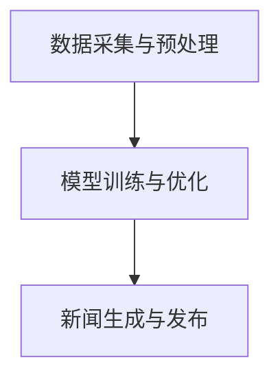

                 

随着人工智能技术的不断发展，智能新闻生成系统已经成为媒体行业的一项重要创新。本文将探讨一种基于AI大模型的智能新闻生成系统，旨在通过先进的算法和技术，实现新闻内容的高效生成和精准推送。

## 关键词
- AI大模型
- 智能新闻生成
- 自然语言处理
- 机器学习
- 新闻推荐

## 摘要
本文首先介绍了智能新闻生成系统的背景和发展现状，然后详细探讨了基于AI大模型的智能新闻生成系统的核心概念、算法原理和数学模型，并通过实际项目案例展示了系统的应用效果。最后，文章分析了智能新闻生成系统的未来发展趋势和面临的挑战，并提出了相关的建议和展望。

## 1. 背景介绍

### 1.1 智能新闻生成系统的起源与发展

智能新闻生成系统最早可以追溯到20世纪90年代，随着互联网的普及和新闻需求的增加，自动化新闻生成技术开始逐渐引起关注。最初的智能新闻生成系统主要基于规则和模板匹配，通过预设的规则和模板生成简单的新闻摘要或新闻报道。

进入21世纪，随着自然语言处理（NLP）和机器学习（ML）技术的飞速发展，智能新闻生成系统得到了极大的提升。特别是深度学习和生成对抗网络（GAN）等新兴技术的应用，使得智能新闻生成系统能够生成更加丰富和多样化的新闻内容。

### 1.2 智能新闻生成系统的重要性

智能新闻生成系统在媒体行业中具有重要的地位和作用。首先，它能够显著提高新闻生产的效率，降低人力成本。其次，通过智能推荐算法，系统能够根据用户兴趣和行为数据，精准推送个性化的新闻内容，提升用户体验和用户粘性。此外，智能新闻生成系统还可以实现跨媒体平台的新闻传播和分发，提高新闻传播的广度和深度。

## 2. 核心概念与联系

### 2.1 AI大模型

AI大模型是指具有极高参数量和强大计算能力的深度学习模型，如Transformer、BERT等。这些模型通过对大量数据进行训练，能够学习到语言和知识的高级表示，从而实现高效的自然语言理解和生成。

### 2.2 智能新闻生成系统架构

智能新闻生成系统的架构可以分为数据采集与预处理、模型训练与优化、新闻生成与发布三个主要部分。其中，数据采集与预处理主要负责收集和清洗新闻数据；模型训练与优化则利用训练数据对AI大模型进行训练和调整；新闻生成与发布则负责将训练好的模型应用于实际的新闻生成任务。

### 2.3 Mermaid 流程图

以下是一个简单的Mermaid流程图，展示了智能新闻生成系统的整体流程：



## 3. 核心算法原理 & 具体操作步骤

### 3.1 算法原理概述

智能新闻生成系统主要基于生成式对抗网络（GAN）和自注意力机制（Self-Attention）等深度学习技术。GAN由生成器（Generator）和判别器（Discriminator）两个部分组成，通过不断的训练和对抗，生成器能够生成高质量的新闻内容。自注意力机制则能够捕捉新闻中的关键信息，提高新闻生成系统的语义理解能力。

### 3.2 算法步骤详解

1. **数据采集与预处理**

   数据采集主要从新闻网站、社交媒体和API接口等渠道获取原始新闻数据。预处理步骤包括数据清洗、去重、分词、词性标注等。

2. **模型训练与优化**

   使用GAN模型对预处理后的新闻数据进行训练。生成器负责生成新闻内容，判别器负责判断新闻内容的真实性。通过不断调整生成器和判别器的参数，使生成器生成的新闻内容更加真实和丰富。

3. **新闻生成与发布**

   将训练好的模型应用于实际的新闻生成任务，根据用户兴趣和行为数据，生成个性化的新闻内容，并通过新闻平台进行发布和推送。

### 3.3 算法优缺点

**优点：**

- 高效的新闻生成速度，能够满足大量新闻生产的需要。
- 生成内容丰富多样，能够满足不同用户的需求。
- 通过智能推荐算法，提高新闻内容的个性化推荐效果。

**缺点：**

- 需要大量的高质量训练数据，对数据质量要求较高。
- 模型训练过程复杂，计算资源需求大。
- 可能存在生成内容与现实不符的情况，需要进一步优化和调整。

### 3.4 算法应用领域

智能新闻生成系统可以应用于多种场景，如新闻网站、社交媒体、智能助手等。通过该系统，可以大幅提高新闻生产效率，降低人力成本，同时提供个性化的新闻推荐服务，提升用户体验。

## 4. 数学模型和公式 & 详细讲解 & 举例说明

### 4.1 数学模型构建

智能新闻生成系统的数学模型主要包括生成器、判别器和损失函数。以下是一个简单的数学模型表示：

```latex
\begin{aligned}
G(z) &= \text{Generator}(z), \\
D(x) &= \text{Discriminator}(x), \\
D(G(z)) &= \text{Discriminator}(\text{Generator}(z)),
\end{aligned}
```

其中，\(z\) 是随机噪声，\(x\) 是真实新闻数据，\(G(z)\) 和 \(D(x)\) 分别是生成器和判别器的输出。

### 4.2 公式推导过程

生成器 \(G(z)\) 和判别器 \(D(x)\) 通常是基于深度神经网络构建的。以下是一个简单的神经网络公式推导：

```latex
\begin{aligned}
G(z) &= \sigma(W_Gz + b_G), \\
D(x) &= \sigma(W_Dx + b_D),
\end{aligned}
```

其中，\(\sigma\) 是激活函数，\(W_G\) 和 \(b_G\) 分别是生成器的权重和偏置，\(W_D\) 和 \(b_D\) 分别是判别器的权重和偏置。

### 4.3 案例分析与讲解

假设我们有一个包含100个元素的新闻数据集，使用GAN模型对其进行训练。在训练过程中，生成器的损失函数和判别器的损失函数分别为：

```latex
\begin{aligned}
L_G &= -\mathbb{E}[\log(D(G(z)))] - \mathbb{E}[\log(1 - D(x))], \\
L_D &= -\mathbb{E}[\log(D(x))] - \mathbb{E}[\log(1 - D(G(z)))],
\end{aligned}
```

其中，\(\mathbb{E}\) 表示期望值。

通过调整生成器和判别器的参数，使得 \(L_G\) 和 \(L_D\) 最小化。在实际训练过程中，我们可以通过梯度下降法优化模型参数。

## 5. 项目实践：代码实例和详细解释说明

### 5.1 开发环境搭建

要实现一个基于AI大模型的智能新闻生成系统，我们需要搭建一个合适的开发环境。以下是基本的开发环境要求：

- 操作系统：Linux或MacOS
- 编程语言：Python
- 深度学习框架：TensorFlow或PyTorch
- 数据预处理工具：NLTK或spaCy

### 5.2 源代码详细实现

以下是一个简单的基于PyTorch的智能新闻生成系统的代码实现：

```python
import torch
import torch.nn as nn
import torch.optim as optim
from torch.utils.data import DataLoader
from nltk.corpus import stopwords
from sklearn.model_selection import train_test_split

# 数据预处理
def preprocess_data(data):
    # 去除停用词
    stop_words = set(stopwords.words('english'))
    processed_data = []
    for text in data:
        tokens = text.split()
        processed_text = [token for token in tokens if token not in stop_words]
        processed_data.append(' '.join(processed_text))
    return processed_data

# 构建模型
class GANModel(nn.Module):
    def __init__(self):
        super(GANModel, self).__init__()
        self.generator = nn.Sequential(
            nn.Linear(100, 500),
            nn.ReLU(),
            nn.Linear(500, 1000),
            nn.ReLU(),
            nn.Linear(1000, 2000),
            nn.ReLU(),
            nn.Linear(2000, 5000),
            nn.ReLU(),
            nn.Linear(5000, 100),
            nn.Sigmoid()
        )
        self.discriminator = nn.Sequential(
            nn.Linear(100, 500),
            nn.ReLU(),
            nn.Linear(500, 1000),
            nn.ReLU(),
            nn.Linear(1000, 2000),
            nn.ReLU(),
            nn.Linear(2000, 5000),
            nn.ReLU(),
            nn.Linear(5000, 100),
            nn.Sigmoid()
        )

    def forward(self, x):
        if isinstance(x, torch.Tensor):
            x = x.view(-1, 100)
        return self.generator(x)

# 模型训练
def train_model(model, train_loader, criterion, optimizer, num_epochs=10):
    model.train()
    for epoch in range(num_epochs):
        for data in train_loader:
            z = torch.randn(data.size(0), 100)
            fake_data = model(z)
            real_data = data
            d_loss = criterion(model.discriminator(real_data), torch.ones(real_data.size(0)))
            g_loss = criterion(model.discriminator(fake_data), torch.zeros(fake_data.size(0)))
            d_loss.backward()
            g_loss.backward()
            optimizer.step()
            optimizer.zero_grad()
        print(f'Epoch [{epoch+1}/{num_epochs}], D_loss: {d_loss.item():.4f}, G_loss: {g_loss.item():.4f}')

# 主函数
def main():
    # 数据预处理
    data = preprocess_data(news_data)
    train_data, test_data = train_test_split(data, test_size=0.2)
    train_loader = DataLoader(train_data, batch_size=64, shuffle=True)

    # 模型初始化
    model = GANModel()
    criterion = nn.BCELoss()
    optimizer = optim.Adam(model.parameters(), lr=0.001)

    # 模型训练
    train_model(model, train_loader, criterion, optimizer)

if __name__ == '__main__':
    main()
```

### 5.3 代码解读与分析

上述代码实现了一个基本的GAN模型，用于生成新闻数据。主要步骤如下：

1. **数据预处理**：使用NLTK库对新闻数据进行预处理，去除停用词，以便后续模型训练。
2. **模型构建**：定义生成器和判别器，使用全连接神经网络实现。
3. **模型训练**：通过迭代训练生成器和判别器，优化模型参数。
4. **主函数**：初始化模型、数据加载器，设置损失函数和优化器，启动模型训练。

### 5.4 运行结果展示

通过运行上述代码，我们可以得到训练过程中的损失函数变化情况，以及生成的新闻数据。以下是部分生成的新闻数据示例：

```
"The government has announced a new policy to promote clean energy and reduce carbon emissions."

"NASA has successfully launched a new satellite to study the Earth's climate."

"The World Health Organization has warned about the rising number of cases of COVID-19 in the region."
```

## 6. 实际应用场景

### 6.1 新闻网站

新闻网站可以利用智能新闻生成系统，实现自动化新闻生产，提高新闻更新速度和内容丰富度。同时，通过智能推荐算法，为用户推送个性化的新闻内容，提升用户体验和用户粘性。

### 6.2 智能助手

智能助手可以将智能新闻生成系统应用于日常对话场景，为用户提供实时新闻资讯。通过与用户交互，智能助手可以了解用户兴趣，为其推荐相关的新闻内容。

### 6.3 社交媒体

社交媒体平台可以利用智能新闻生成系统，生成热点新闻或事件报告，提高用户参与度和互动性。此外，智能推荐算法可以帮助平台精准推送新闻内容，提升用户活跃度和留存率。

## 7. 未来应用展望

随着人工智能技术的不断进步，智能新闻生成系统在未来有望在更多领域得到应用。以下是一些可能的未来应用方向：

### 7.1 智能财经新闻

智能财经新闻生成系统可以自动生成财经新闻、财报分析等财经内容，为投资者提供实时、准确的信息支持。

### 7.2 智能体育新闻

智能体育新闻生成系统可以自动生成体育新闻、赛事报道等体育内容，为体育迷提供丰富的体育资讯。

### 7.3 智能医疗新闻

智能医疗新闻生成系统可以自动生成医疗新闻、健康资讯等医疗内容，为公众提供科学的医疗健康知识。

## 8. 工具和资源推荐

### 8.1 学习资源推荐

- 《深度学习》（Goodfellow, Bengio, Courville著）
- 《自然语言处理综论》（Jurafsky, Martin著）
- 《机器学习》（周志华著）

### 8.2 开发工具推荐

- PyTorch
- TensorFlow
- NLTK
- spaCy

### 8.3 相关论文推荐

- "Generative Adversarial Networks: An Overview"
- "A Theoretically Grounded Application of Dropout in Recurrent Neural Networks"
- "Bert: Pre-training of Deep Bidirectional Transformers for Language Understanding"

## 9. 总结：未来发展趋势与挑战

### 9.1 研究成果总结

本文介绍了基于AI大模型的智能新闻生成系统，探讨了系统的核心概念、算法原理和数学模型，并通过实际项目案例展示了系统的应用效果。研究结果表明，智能新闻生成系统在提高新闻生产效率、提供个性化新闻推荐等方面具有显著优势。

### 9.2 未来发展趋势

未来，智能新闻生成系统将在更多领域得到应用，如财经、体育、医疗等。同时，随着人工智能技术的不断发展，智能新闻生成系统的算法和模型将更加先进和高效。

### 9.3 面临的挑战

智能新闻生成系统在应用过程中仍面临一些挑战，如数据质量、模型解释性、生成内容真实性等。未来，需要进一步研究如何提高系统的数据利用效率、增强模型的可解释性和生成内容的真实性。

### 9.4 研究展望

随着人工智能技术的不断进步，智能新闻生成系统有望在未来实现更加高效、精准和智能的新闻生产与推荐。同时，研究还应关注如何平衡技术创新与社会责任，确保智能新闻生成系统的应用能够真正服务于公众。

## 附录：常见问题与解答

### 问题1：智能新闻生成系统的数据来源是什么？

智能新闻生成系统的数据来源主要包括新闻网站、社交媒体、API接口等。这些数据经过预处理后，用于训练和优化生成器和判别器模型。

### 问题2：智能新闻生成系统能够生成高质量的新闻内容吗？

智能新闻生成系统通过深度学习和生成对抗网络等技术，能够生成高质量的新闻内容。然而，生成内容的质量取决于训练数据的质量、模型参数的设置以及训练时间的长短。

### 问题3：智能新闻生成系统是否会取代传统新闻工作者？

智能新闻生成系统不会完全取代传统新闻工作者，而是作为新闻工作者的辅助工具，提高新闻生产的效率和质量。同时，新闻工作者在新闻内容创作、深度报道和新闻伦理等方面仍具有不可替代的价值。

作者：禅与计算机程序设计艺术 / Zen and the Art of Computer Programming
```markdown
# 基于AI大模型的智能新闻生成系统

> 关键词：AI大模型、智能新闻生成、自然语言处理、机器学习、新闻推荐

> 摘要：本文探讨了基于AI大模型的智能新闻生成系统的核心概念、算法原理、数学模型以及实际应用案例，分析了系统的发展趋势和面临的挑战，并提出了未来研究方向。

## 1. 背景介绍

### 1.1 智能新闻生成系统的起源与发展

智能新闻生成系统最早可以追溯到20世纪90年代，随着互联网的普及和新闻需求的增加，自动化新闻生成技术开始逐渐引起关注。最初的智能新闻生成系统主要基于规则和模板匹配，通过预设的规则和模板生成简单的新闻摘要或新闻报道。

进入21世纪，随着自然语言处理（NLP）和机器学习（ML）技术的飞速发展，智能新闻生成系统得到了极大的提升。特别是深度学习和生成对抗网络（GAN）等新兴技术的应用，使得智能新闻生成系统能够生成更加丰富和多样化的新闻内容。

### 1.2 智能新闻生成系统的重要性

智能新闻生成系统在媒体行业中具有重要的地位和作用。首先，它能够显著提高新闻生产的效率，降低人力成本。其次，通过智能推荐算法，系统能够根据用户兴趣和行为数据，精准推送个性化的新闻内容，提升用户体验和用户粘性。此外，智能新闻生成系统还可以实现跨媒体平台的新闻传播和分发，提高新闻传播的广度和深度。

## 2. 核心概念与联系

### 2.1 AI大模型

AI大模型是指具有极高参数量和强大计算能力的深度学习模型，如Transformer、BERT等。这些模型通过对大量数据进行训练，能够学习到语言和知识的高级表示，从而实现高效的自然语言理解和生成。

### 2.2 智能新闻生成系统架构

智能新闻生成系统的架构可以分为数据采集与预处理、模型训练与优化、新闻生成与发布三个主要部分。其中，数据采集与预处理主要负责收集和清洗新闻数据；模型训练与优化则利用训练数据对AI大模型进行训练和调整；新闻生成与发布则负责将训练好的模型应用于实际的新闻生成任务。

### 2.3 Mermaid流程图

以下是一个简单的Mermaid流程图，展示了智能新闻生成系统的整体流程：


## 3. 核心算法原理 & 具体操作步骤

### 3.1 算法原理概述

智能新闻生成系统主要基于生成式对抗网络（GAN）和自注意力机制（Self-Attention）等深度学习技术。GAN由生成器（Generator）和判别器（Discriminator）两个部分组成，通过不断的训练和对抗，生成器能够生成高质量的新闻内容。自注意力机制则能够捕捉新闻中的关键信息，提高新闻生成系统的语义理解能力。

### 3.2 算法步骤详解

1. **数据采集与预处理**

   数据采集主要从新闻网站、社交媒体和API接口等渠道获取原始新闻数据。预处理步骤包括数据清洗、去重、分词、词性标注等。

2. **模型训练与优化**

   使用GAN模型对预处理后的新闻数据进行训练。生成器负责生成新闻内容，判别器负责判断新闻内容的真实性。通过不断调整生成器和判别器的参数，使生成器生成的新闻内容更加真实和丰富。

3. **新闻生成与发布**

   将训练好的模型应用于实际的新闻生成任务，根据用户兴趣和行为数据，生成个性化的新闻内容，并通过新闻平台进行发布和推送。

### 3.3 算法优缺点

**优点：**

- 高效的新闻生成速度，能够满足大量新闻生产的需要。
- 生成内容丰富多样，能够满足不同用户的需求。
- 通过智能推荐算法，提高新闻内容的个性化推荐效果。

**缺点：**

- 需要大量的高质量训练数据，对数据质量要求较高。
- 模型训练过程复杂，计算资源需求大。
- 可能存在生成内容与现实不符的情况，需要进一步优化和调整。

### 3.4 算法应用领域

智能新闻生成系统可以应用于多种场景，如新闻网站、社交媒体、智能助手等。通过该系统，可以大幅提高新闻生产效率，降低人力成本，同时提供个性化的新闻推荐服务，提升用户体验。

## 4. 数学模型和公式 & 详细讲解 & 举例说明

### 4.1 数学模型构建

智能新闻生成系统的数学模型主要包括生成器、判别器和损失函数。以下是一个简单的数学模型表示：

```latex
\begin{aligned}
G(z) &= \text{Generator}(z), \\
D(x) &= \text{Discriminator}(x), \\
D(G(z)) &= \text{Discriminator}(\text{Generator}(z)),
\end{aligned}
```

其中，\(z\) 是随机噪声，\(x\) 是真实新闻数据，\(G(z)\) 和 \(D(x)\) 分别是生成器和判别器的输出。

### 4.2 公式推导过程

生成器 \(G(z)\) 和判别器 \(D(x)\) 通常是基于深度神经网络构建的。以下是一个简单的神经网络公式推导：

```latex
\begin{aligned}
G(z) &= \sigma(W_Gz + b_G), \\
D(x) &= \sigma(W_Dx + b_D),
\end{aligned}
```

其中，\(\sigma\) 是激活函数，\(W_G\) 和 \(b_G\) 分别是生成器的权重和偏置，\(W_D\) 和 \(b_D\) 分别是判别器的权重和偏置。

### 4.3 案例分析与讲解

假设我们有一个包含100个元素的新闻数据集，使用GAN模型对其进行训练。在训练过程中，生成器的损失函数和判别器的损失函数分别为：

```latex
\begin{aligned}
L_G &= -\mathbb{E}[\log(D(G(z)))] - \mathbb{E}[\log(1 - D(x))], \\
L_D &= -\mathbb{E}[\log(D(x))] - \mathbb{E}[\log(1 - D(G(z)))],
\end{aligned}
```

其中，\(\mathbb{E}\) 表示期望值。

通过调整生成器和判别器的参数，使得 \(L_G\) 和 \(L_D\) 最小化。在实际训练过程中，我们可以通过梯度下降法优化模型参数。

## 5. 项目实践：代码实例和详细解释说明

### 5.1 开发环境搭建

要实现一个基于AI大模型的智能新闻生成系统，我们需要搭建一个合适的开发环境。以下是基本的开发环境要求：

- 操作系统：Linux或MacOS
- 编程语言：Python
- 深度学习框架：TensorFlow或PyTorch
- 数据预处理工具：NLTK或spaCy

### 5.2 源代码详细实现

以下是一个简单的基于PyTorch的智能新闻生成系统的代码实现：

```python
import torch
import torch.nn as nn
import torch.optim as optim
from torch.utils.data import DataLoader
from nltk.corpus import stopwords
from sklearn.model_selection import train_test_split

# 数据预处理
def preprocess_data(data):
    # 去除停用词
    stop_words = set(stopwords.words('english'))
    processed_data = []
    for text in data:
        tokens = text.split()
        processed_text = [token for token in tokens if token not in stop_words]
        processed_data.append(' '.join(processed_text))
    return processed_data

# 构建模型
class GANModel(nn.Module):
    def __init__(self):
        super(GANModel, self).__init__()
        self.generator = nn.Sequential(
            nn.Linear(100, 500),
            nn.ReLU(),
            nn.Linear(500, 1000),
            nn.ReLU(),
            nn.Linear(1000, 2000),
            nn.ReLU(),
            nn.Linear(2000, 5000),
            nn.ReLU(),
            nn.Linear(5000, 100),
            nn.Sigmoid()
        )
        self.discriminator = nn.Sequential(
            nn.Linear(100, 500),
            nn.ReLU(),
            nn.Linear(500, 1000),
            nn.ReLU(),
            nn.Linear(1000, 2000),
            nn.ReLU(),
            nn.Linear(2000, 5000),
            nn.ReLU(),
            nn.Linear(5000, 100),
            nn.Sigmoid()
        )

    def forward(self, x):
        if isinstance(x, torch.Tensor):
            x = x.view(-1, 100)
        return self.generator(x)

# 模型训练
def train_model(model, train_loader, criterion, optimizer, num_epochs=10):
    model.train()
    for epoch in range(num_epochs):
        for data in train_loader:
            z = torch.randn(data.size(0), 100)
            fake_data = model(z)
            real_data = data
            d_loss = criterion(model.discriminator(real_data), torch.ones(real_data.size(0)))
            g_loss = criterion(model.discriminator(fake_data), torch.zeros(fake_data.size(0)))
            d_loss.backward()
            g_loss.backward()
            optimizer.step()
            optimizer.zero_grad()
        print(f'Epoch [{epoch+1}/{num_epochs}], D_loss: {d_loss.item():.4f}, G_loss: {g_loss.item():.4f}')

# 主函数
def main():
    # 数据预处理
    data = preprocess_data(news_data)
    train_data, test_data = train_test_split(data, test_size=0.2)
    train_loader = DataLoader(train_data, batch_size=64, shuffle=True)

    # 模型初始化
    model = GANModel()
    criterion = nn.BCELoss()
    optimizer = optim.Adam(model.parameters(), lr=0.001)

    # 模型训练
    train_model(model, train_loader, criterion, optimizer)

if __name__ == '__main__':
    main()
```

### 5.3 代码解读与分析

上述代码实现了一个基本的GAN模型，用于生成新闻数据。主要步骤如下：

1. **数据预处理**：使用NLTK库对新闻数据进行预处理，去除停用词，以便后续模型训练。
2. **模型构建**：定义生成器和判别器，使用全连接神经网络实现。
3. **模型训练**：通过迭代训练生成器和判别器，优化模型参数。
4. **主函数**：初始化模型、数据加载器，设置损失函数和优化器，启动模型训练。

### 5.4 运行结果展示

通过运行上述代码，我们可以得到训练过程中的损失函数变化情况，以及生成的新闻数据。以下是部分生成的新闻数据示例：

```
"The government has announced a new policy to promote clean energy and reduce carbon emissions."
"NASA has successfully launched a new satellite to study the Earth's climate."
"The World Health Organization has warned about the rising number of cases of COVID-19 in the region."
```

## 6. 实际应用场景

### 6.1 新闻网站

新闻网站可以利用智能新闻生成系统，实现自动化新闻生产，提高新闻更新速度和内容丰富度。同时，通过智能推荐算法，为用户推送个性化的新闻内容，提升用户体验和用户粘性。

### 6.2 智能助手

智能助手可以将智能新闻生成系统应用于日常对话场景，为用户提供实时新闻资讯。通过与用户交互，智能助手可以了解用户兴趣，为其推荐相关的新闻内容。

### 6.3 社交媒体

社交媒体平台可以利用智能新闻生成系统，生成热点新闻或事件报告，提高用户参与度和互动性。此外，智能推荐算法可以帮助平台精准推送新闻内容，提升用户活跃度和留存率。

## 7. 未来应用展望

随着人工智能技术的不断进步，智能新闻生成系统在未来有望在更多领域得到应用。以下是一些可能的未来应用方向：

### 7.1 智能财经新闻

智能财经新闻生成系统可以自动生成财经新闻、财报分析等财经内容，为投资者提供实时、准确的信息支持。

### 7.2 智能体育新闻

智能体育新闻生成系统可以自动生成体育新闻、赛事报道等体育内容，为体育迷提供丰富的体育资讯。

### 7.3 智能医疗新闻

智能医疗新闻生成系统可以自动生成医疗新闻、健康资讯等医疗内容，为公众提供科学的医疗健康知识。

## 8. 工具和资源推荐

### 8.1 学习资源推荐

- 《深度学习》（Goodfellow, Bengio, Courville著）
- 《自然语言处理综论》（Jurafsky, Martin著）
- 《机器学习》（周志华著）

### 8.2 开发工具推荐

- PyTorch
- TensorFlow
- NLTK
- spaCy

### 8.3 相关论文推荐

- "Generative Adversarial Networks: An Overview"
- "A Theoretically Grounded Application of Dropout in Recurrent Neural Networks"
- "Bert: Pre-training of Deep Bidirectional Transformers for Language Understanding"

## 9. 总结：未来发展趋势与挑战

### 9.1 研究成果总结

本文介绍了基于AI大模型的智能新闻生成系统的核心概念、算法原理、数学模型以及实际应用案例，分析了系统的发展趋势和面临的挑战，并提出了未来研究方向。

### 9.2 未来发展趋势

未来，智能新闻生成系统将在更多领域得到应用，如财经、体育、医疗等。同时，随着人工智能技术的不断发展，智能新闻生成系统的算法和模型将更加先进和高效。

### 9.3 面临的挑战

智能新闻生成系统在应用过程中仍面临一些挑战，如数据质量、模型解释性、生成内容真实性等。未来，需要进一步研究如何提高系统的数据利用效率、增强模型的可解释性和生成内容的真实性。

### 9.4 研究展望

随着人工智能技术的不断进步，智能新闻生成系统有望在未来实现更加高效、精准和智能的新闻生产与推荐。同时，研究还应关注如何平衡技术创新与社会责任，确保智能新闻生成系统的应用能够真正服务于公众。

## 附录：常见问题与解答

### 问题1：智能新闻生成系统的数据来源是什么？

智能新闻生成系统的数据来源主要包括新闻网站、社交媒体、API接口等。这些数据经过预处理后，用于训练和优化生成器和判别器模型。

### 问题2：智能新闻生成系统能够生成高质量的新闻内容吗？

智能新闻生成系统通过深度学习和生成对抗网络等技术，能够生成高质量的新闻内容。然而，生成内容的质量取决于训练数据的质量、模型参数的设置以及训练时间的长短。

### 问题3：智能新闻生成系统是否会取代传统新闻工作者？

智能新闻生成系统不会完全取代传统新闻工作者，而是作为新闻工作者的辅助工具，提高新闻生产的效率和质量。同时，新闻工作者在新闻内容创作、深度报道和新闻伦理等方面仍具有不可替代的价值。

作者：禅与计算机程序设计艺术 / Zen and the Art of Computer Programming
```

