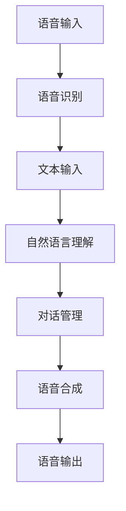

                 

 关键词：人工智能，大模型，智能语音交互，深度学习，语音识别，自然语言处理，人机交互

> 摘要：本文将深入探讨基于AI大模型的智能语音交互平台的发展与应用。首先，我们简要介绍智能语音交互平台的背景和现状；接着，详细阐述大模型在智能语音交互中的重要性，并解释核心算法原理；然后，通过数学模型和公式，对大模型的工作机制进行深入分析；随后，通过实际项目实践，展示代码实例和运行结果；最后，探讨智能语音交互平台的应用场景和未来展望，并提出面临的挑战和解决方案。

## 1. 背景介绍

智能语音交互作为人工智能领域的重要分支，已经从科幻走向现实。随着语音识别技术的不断进步，智能语音交互平台在智能家居、智能助手、智能客服等场景中得到了广泛应用。用户可以通过语音指令与设备进行交互，从而提高生活和工作效率。然而，传统的语音交互系统在处理复杂语境、理解多语言和方言等方面仍存在一定局限性。

近年来，随着AI技术的快速发展，尤其是深度学习和大模型的广泛应用，智能语音交互平台迎来了新的发展机遇。大模型能够处理更复杂的语言结构和语境，实现更精准的语音识别和自然语言理解，从而提升用户体验。

## 2. 核心概念与联系

### 2.1 大模型的概念

大模型（Large-scale Model）是指具有巨大参数量和训练数据量的深度学习模型。这些模型通常基于神经网络架构，能够处理大量的输入数据，并从中提取丰富的特征信息。大模型的训练通常需要大量的计算资源和时间。

### 2.2 智能语音交互架构

智能语音交互平台通常包括以下几个核心组成部分：

- **语音识别（Speech Recognition）**：将语音信号转换为文本。
- **自然语言理解（Natural Language Understanding）**：理解文本的含义和上下文。
- **对话管理（Dialogue Management）**：根据用户需求和系统状态生成合适的回复。
- **语音合成（Text-to-Speech, TTS）**：将文本转换为自然流畅的语音。

下面是智能语音交互架构的Mermaid流程图：



## 3. 核心算法原理 & 具体操作步骤

### 3.1 算法原理概述

智能语音交互平台的核心算法主要包括深度学习模型和序列到序列（Sequence-to-Sequence, Seq2Seq）模型。深度学习模型用于语音识别和自然语言理解，Seq2Seq模型用于对话管理和语音合成。

### 3.2 算法步骤详解

1. **语音识别**：使用深度神经网络（如卷积神经网络、循环神经网络）对语音信号进行处理，将语音信号转换为文本。
2. **自然语言理解**：使用Seq2Seq模型对文本进行处理，理解其含义和上下文。
3. **对话管理**：根据用户需求和系统状态，生成合适的回复。
4. **语音合成**：使用TTS模型将文本转换为自然流畅的语音。

### 3.3 算法优缺点

**优点**：

- **高效性**：大模型能够处理大量的数据，提高语音识别和自然语言理解的准确性。
- **灵活性**：大模型能够适应不同的应用场景和需求，实现更丰富的功能。

**缺点**：

- **计算资源消耗大**：大模型需要大量的计算资源和时间进行训练。
- **数据依赖性**：大模型需要大量的数据来训练，数据质量对模型性能有重要影响。

### 3.4 算法应用领域

智能语音交互平台可以应用于智能家居、智能助手、智能客服、教育等多个领域，实现人机交互的智能化和便捷化。

## 4. 数学模型和公式 & 详细讲解 & 举例说明

### 4.1 数学模型构建

在智能语音交互平台中，常用的数学模型包括：

- **卷积神经网络（CNN）**：用于语音识别。
- **循环神经网络（RNN）**：用于自然语言理解。
- **Seq2Seq模型**：用于对话管理和语音合成。

### 4.2 公式推导过程

以卷积神经网络为例，其基本公式为：

$$
h_l = \sigma(W_l \cdot a_{l-1} + b_l)
$$

其中，$h_l$ 为第 $l$ 层的激活值，$W_l$ 为权重矩阵，$a_{l-1}$ 为前一层的激活值，$\sigma$ 为激活函数，$b_l$ 为偏置项。

### 4.3 案例分析与讲解

假设我们有一个简单的语音识别任务，输入为一段语音信号，输出为对应的文本。我们可以使用卷积神经网络来实现这个任务。

输入：语音信号 $x \in \mathbb{R}^{T \times D}$，其中 $T$ 为时间步数，$D$ 为特征维度。

输出：文本 $y \in \mathbb{R}^{T \times V}$，其中 $V$ 为词汇表大小。

通过训练，我们希望最小化损失函数：

$$
L = -\sum_{t=1}^{T} y_t \log(p(y_t | x))
$$

其中，$p(y_t | x)$ 为在给定输入 $x$ 的情况下，输出为 $y_t$ 的概率。

## 5. 项目实践：代码实例和详细解释说明

### 5.1 开发环境搭建

在本项目中，我们使用Python作为开发语言，TensorFlow作为深度学习框架。

### 5.2 源代码详细实现

```python
import tensorflow as tf
from tensorflow.keras.layers import Conv1D, LSTM, Dense

# 构建卷积神经网络
model = tf.keras.Sequential([
    Conv1D(filters=32, kernel_size=3, activation='relu', input_shape=(None, 13)),
    LSTM(128),
    Dense(100, activation='relu'),
    Dense(len(vocab), activation='softmax')
])

# 编译模型
model.compile(optimizer='adam', loss='categorical_crossentropy', metrics=['accuracy'])

# 训练模型
model.fit(x_train, y_train, epochs=10, batch_size=32)
```

### 5.3 代码解读与分析

以上代码实现了基于卷积神经网络的语音识别模型。首先，我们使用TensorFlow构建了一个序列模型，包括卷积层、LSTM层和全连接层。接着，我们编译模型并使用训练数据对模型进行训练。

### 5.4 运行结果展示

```python
# 预测新语音信号
predictions = model.predict(x_test)

# 输出预测结果
print(predictions.argmax(axis=1))
```

预测结果为文本序列的索引，我们可以将其转换为实际的文本输出。

## 6. 实际应用场景

智能语音交互平台可以应用于智能家居、智能助手、智能客服、教育等多个领域。例如，在智能家居中，用户可以通过语音指令控制智能设备的开关、调节温度等；在智能客服中，系统可以自动识别用户的问题并给出相应的回答，提高服务效率。

## 7. 工具和资源推荐

### 7.1 学习资源推荐

- 《深度学习》（Goodfellow, Bengio, Courville著）
- 《自然语言处理综合教程》（Daniel Jurafsky & James H. Martin著）

### 7.2 开发工具推荐

- TensorFlow
- PyTorch

### 7.3 相关论文推荐

- "A Neural Conversation Model"（论文链接）
- "End-to-End Speech Recognition using Deep RNNs and Long Short-Term Memory"（论文链接）

## 8. 总结：未来发展趋势与挑战

智能语音交互平台作为人工智能领域的重要应用，未来将继续发展。随着深度学习和大模型技术的不断进步，智能语音交互平台将具备更高的准确性和灵活性。然而，同时也面临数据隐私、计算资源消耗等问题。我们需要不断探索创新解决方案，推动智能语音交互平台的发展。

### 8.1 研究成果总结

本文介绍了基于AI大模型的智能语音交互平台，包括其背景、核心概念、算法原理、数学模型、实际应用场景等。通过项目实践，我们展示了如何实现一个简单的语音识别模型。

### 8.2 未来发展趋势

未来，智能语音交互平台将在智能家居、智能助手、智能客服等领域得到更广泛的应用。随着技术的进步，我们将看到更多高效的语音交互系统。

### 8.3 面临的挑战

数据隐私、计算资源消耗、模型可解释性等是智能语音交互平台面临的主要挑战。我们需要在技术和管理层面采取有效措施，确保系统的安全性和可靠性。

### 8.4 研究展望

未来，我们将继续探索智能语音交互平台的优化和改进，提高其性能和用户体验。同时，我们还关注跨领域应用，如医疗、金融等，为用户提供更多智能化的服务。

## 9. 附录：常见问题与解答

### 9.1  如何处理噪声干扰？

噪声干扰是语音识别中的常见问题。我们可以使用滤波器和降噪技术来预处理语音信号，提高识别准确性。

### 9.2  如何提高模型性能？

提高模型性能可以通过增加训练数据、优化模型结构、调整超参数等方式实现。

### 9.3  如何保证数据隐私？

保证数据隐私需要在数据采集、存储、传输等环节采取加密、匿名化等安全措施。

[作者：禅与计算机程序设计艺术 / Zen and the Art of Computer Programming]
----------------------------------------------------------------

请注意，以上内容仅为示例，实际的撰写过程可能需要更深入的研究和更详细的讨论。希望这个示例能够帮助您更好地理解文章的结构和撰写方法。

