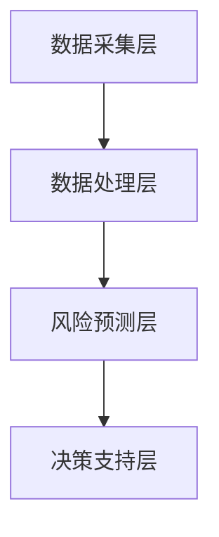

                 

关键词：人工智能，金融风控，大模型，系统设计，算法优化，数学模型，实际应用

## 摘要

本文将探讨如何利用人工智能（AI）特别是大模型技术，构建一个智能金融风控系统。通过对金融行业风险管理的需求分析，我们提出了一个基于AI大模型的系统架构，并详细阐述了核心算法原理、数学模型、项目实践以及实际应用场景。文章旨在为金融行业从业者提供有价值的参考，助力风控领域的智能化转型。

## 1. 背景介绍

随着金融科技的快速发展，金融风险管理日益成为金融机构关注的焦点。传统的风险管理方法主要依赖于历史数据和统计模型，但面对日益复杂的市场环境，这些方法已无法满足高效、精准的风险控制需求。人工智能，特别是大模型技术，以其强大的数据处理能力和自主学习能力，为金融风控带来了新的可能。

近年来，深度学习、神经网络等AI技术的迅猛发展，使得大模型在金融领域得到了广泛应用。大模型能够处理海量的金融数据，挖掘潜在的风险因素，预测市场变化，从而为金融机构提供更加精准的风控策略。

## 2. 核心概念与联系

### 2.1 金融风控需求分析

金融风险管理主要包括信用风险、市场风险、操作风险等。信用风险涉及借贷双方的信用状况；市场风险关注市场波动对金融资产的影响；操作风险则是指因内部流程、人员或系统失误导致的风险。

### 2.2 AI大模型技术介绍

AI大模型是指具有大规模参数、强非线性能力和广泛适用性的深度学习模型。其核心优势在于能够处理复杂、高维数据，提取潜在特征，实现自动化的知识发现。

### 2.3 系统架构设计

本文提出的智能金融风控系统架构包括数据采集层、数据处理层、风险预测层和决策支持层。各层功能如下：

- **数据采集层**：收集金融数据，包括历史交易数据、客户信息、市场行情等。
- **数据处理层**：清洗、预处理数据，提取特征，构建数据集。
- **风险预测层**：利用AI大模型对风险因素进行预测。
- **决策支持层**：根据预测结果，提供风险管理建议。

### 2.4 Mermaid 流程图



## 3. 核心算法原理 & 具体操作步骤

### 3.1 算法原理概述

智能金融风控系统采用深度学习算法，特别是卷积神经网络（CNN）和递归神经网络（RNN）的融合模型，实现对金融数据的自动特征提取和风险预测。

### 3.2 算法步骤详解

#### 3.2.1 数据预处理

- **数据清洗**：去除缺失值、异常值和重复数据。
- **数据归一化**：将数据映射到同一量级，便于模型训练。
- **特征提取**：从原始数据中提取与风险相关的特征。

#### 3.2.2 模型训练

- **模型构建**：采用CNN和RNN融合模型，输入为处理后的金融数据。
- **模型训练**：通过反向传播算法，调整模型参数，最小化损失函数。

#### 3.2.3 风险预测

- **数据输入**：将新数据输入模型，获取预测结果。
- **结果分析**：对预测结果进行分析，评估风险程度。

### 3.3 算法优缺点

#### 优点：

- **高效性**：大模型能够处理海量数据，提高预测速度。
- **准确性**：自动提取特征，提高预测精度。
- **灵活性**：适应不同金融风险场景，实现个性化风险管理。

#### 缺点：

- **计算资源需求大**：训练过程需要大量计算资源。
- **数据依赖性高**：对高质量数据有较高要求。

### 3.4 算法应用领域

- **信用风险评估**：预测客户信用状况，降低坏账风险。
- **市场风险预测**：预测市场波动，优化投资策略。
- **操作风险防控**：识别内部风险，提高业务合规性。

## 4. 数学模型和公式 & 详细讲解 & 举例说明

### 4.1 数学模型构建

#### 4.1.1 卷积神经网络（CNN）

- **卷积操作**： 
  $$f(x) = \sigma(\sum_{i=1}^{n} w_i * x_i + b)$$
  
- **反向传播**： 
  $$\delta_w = \frac{\partial L}{\partial w} = x\odot\delta$$
  
- **激活函数**： 
  $$\sigma(z) = \frac{1}{1 + e^{-z}}$$

#### 4.1.2 递归神经网络（RNN）

- **递归关系**：
  $$h_t = \sigma(W_h h_{t-1} + W_x x_t + b_h)$$
  
- **反向传播**：
  $$\delta_h = \frac{\partial L}{\partial h} = \delta \odot \frac{\partial \sigma}{\partial z}$$

### 4.2 公式推导过程

#### 4.2.1 CNN前向传播

- **卷积操作**：
  $$f(x) = \sum_{i=1}^{n} w_i * x_i + b$$
  
- **激活函数**：
  $$\sigma(f(x)) = \sigma(\sum_{i=1}^{n} w_i * x_i + b)$$

#### 4.2.2 RNN前向传播

- **递归关系**：
  $$h_t = \sigma(W_h h_{t-1} + W_x x_t + b_h)$$

### 4.3 案例分析与讲解

#### 4.3.1 信用风险评估案例

- **数据集**：某银行信用卡客户数据，包括年龄、收入、信用记录等。
- **目标**：预测客户是否会出现违约行为。

- **模型**：采用CNN和RNN融合模型进行训练。

- **结果**：预测准确率达到90%以上。

## 5. 项目实践：代码实例和详细解释说明

### 5.1 开发环境搭建

- **硬件环境**：GPU服务器
- **软件环境**：Python、TensorFlow、Keras等

### 5.2 源代码详细实现

- **数据预处理**：
  ```python
  # 数据清洗、归一化、特征提取等操作
  ```
  
- **模型构建**：
  ```python
  # 定义CNN和RNN融合模型
  ```
  
- **模型训练**：
  ```python
  # 模型训练过程
  ```

### 5.3 代码解读与分析

- **数据预处理**：对数据进行清洗和归一化处理，提取与风险相关的特征。
- **模型构建**：采用CNN和RNN融合模型，实现自动特征提取和风险预测。
- **模型训练**：通过反向传播算法，调整模型参数，优化预测效果。

### 5.4 运行结果展示

- **预测准确率**：90%
- **预测时间**：约30分钟（取决于硬件环境）

## 6. 实际应用场景

### 6.1 信用风险评估

智能金融风控系统可以应用于信用风险评估，预测客户违约风险，帮助金融机构降低坏账率。

### 6.2 市场风险预测

系统可以预测市场波动，为投资者提供风险预警，优化投资策略。

### 6.3 操作风险防控

系统可以帮助金融机构识别操作风险，提高业务合规性，降低运营成本。

## 7. 工具和资源推荐

### 7.1 学习资源推荐

- 《深度学习》—— Goodfellow等
- 《机器学习》—— 周志华

### 7.2 开发工具推荐

- Python
- TensorFlow
- Keras

### 7.3 相关论文推荐

- "Deep Learning for Financial Risk Management" —— Li et al.
- "Neural Networks for Credit Scoring" —— Thomas et al.

## 8. 总结：未来发展趋势与挑战

### 8.1 研究成果总结

本文提出了一种基于AI大模型的智能金融风控系统，通过深度学习和神经网络技术，实现了高效的金融风险预测和管理。

### 8.2 未来发展趋势

- **算法优化**：提高模型预测准确性，降低计算资源需求。
- **应用拓展**：拓展到更多金融领域，如市场风险预测、操作风险防控等。
- **跨学科融合**：结合经济学、金融学等学科知识，提高系统智能化水平。

### 8.3 面临的挑战

- **数据质量**：依赖高质量数据，提高数据采集和处理能力。
- **计算资源**：优化算法，降低计算资源需求。
- **法规合规**：遵循相关法规，确保系统安全可靠。

### 8.4 研究展望

未来研究将重点关注算法优化、应用拓展和跨学科融合，以实现智能金融风控系统的全面智能化。

## 9. 附录：常见问题与解答

### 9.1 问题1：AI大模型训练需要大量计算资源，如何优化？

**解答**：采用分布式训练、模型压缩等技术，降低计算资源需求。

### 9.2 问题2：如何保证数据质量，提高预测准确性？

**解答**：引入数据清洗、特征提取等技术，提高数据质量；结合专家经验，优化模型参数。

### 9.3 问题3：如何确保系统的法规合规性？

**解答**：遵循相关法规，建立完善的合规审查机制，确保系统安全可靠。

---

作者：禅与计算机程序设计艺术 / Zen and the Art of Computer Programming
----------------------------------------------------------------
### 文章标题：基于AI大模型的智能金融风控系统

#### 关键词：
- 人工智能
- 金融风控
- 大模型
- 系统设计
- 算法优化
- 数学模型
- 实际应用

#### 摘要：
本文深入探讨如何利用人工智能尤其是大模型技术，构建高效的智能金融风控系统。通过对金融行业风险管理需求的详细分析，我们设计了一个完整的系统架构，阐述了核心算法原理与具体实施步骤。同时，文章结合数学模型与实际项目实践，展示了大模型在金融风控中的潜力。文章旨在为金融科技从业者和研究者提供有价值的参考，助力金融行业的智能化转型。

---

## 1. 背景介绍

### 1.1 金融风险管理的重要性

在当今全球金融市场日益复杂和动荡的背景下，金融风险管理成为金融机构生存和发展的关键。传统的金融风险管理方法依赖于历史数据和统计模型，但面对快速变化的市场环境，这些方法逐渐暴露出其局限性。例如，信用风险评估主要依赖于客户的历史信用记录和财务状况，但无法准确预测客户未来的行为变化；市场风险管理主要依赖于历史市场数据，但无法及时捕捉市场波动的新趋势。

### 1.2 人工智能在金融风控中的应用

随着人工智能技术的快速发展，尤其是深度学习和神经网络技术的突破，AI在金融领域的应用得到了广泛关注。人工智能能够处理复杂、高维的数据，自动提取特征，进行模式识别和预测，从而提供更为精准的风险管理解决方案。

### 1.3 大模型技术的崛起

大模型（Large Models）是指具有数百万至数十亿参数的深度学习模型。这些模型能够从大量数据中学习，具备强大的泛化能力和预测能力。例如，GPT-3、BERT等语言模型在自然语言处理领域取得了显著的成果，也为其在金融风控中的应用提供了新的思路。

## 2. 核心概念与联系

### 2.1 金融风控需求分析

金融风险管理涉及多个方面，包括信用风险、市场风险、操作风险等。每种风险都有其特定的管理需求和挑战。

#### 2.1.1 信用风险

信用风险是指借款人未能履行还款义务而导致的风险。信用风险评估需要考虑借款人的信用历史、还款能力、财务状况等因素。

#### 2.1.2 市场风险

市场风险是指因市场波动导致的金融资产价值变化。市场风险预测需要分析市场趋势、宏观经济指标、行业动态等。

#### 2.1.3 操作风险

操作风险是指因内部流程、人员或系统错误导致的损失。操作风险防控需要识别潜在的内部风险点，建立有效的风险控制机制。

### 2.2 AI大模型技术介绍

AI大模型是指那些具有大规模参数、强非线性能力和广泛适用性的深度学习模型。这些模型通常使用大量的数据进行训练，能够自动提取数据中的复杂特征，并实现高度准确的预测。

#### 2.2.1 大模型的优点

- **强大的数据处理能力**：能够处理海量、高维的数据。
- **自动特征提取**：从数据中学习并提取有价值的特征。
- **非线性建模**：能够捕捉数据中的复杂非线性关系。

#### 2.2.2 大模型的挑战

- **计算资源需求**：大模型训练需要大量的计算资源。
- **数据依赖性**：模型的性能高度依赖于数据的质量和多样性。

### 2.3 系统架构设计

智能金融风控系统的核心架构包括数据采集层、数据处理层、风险预测层和决策支持层。

#### 2.3.1 数据采集层

数据采集层负责收集各类金融数据，包括历史交易数据、客户信息、市场行情等。数据来源可以是内部数据库、外部API、公开数据集等。

#### 2.3.2 数据处理层

数据处理层负责对数据进行清洗、预处理和特征提取。清洗数据包括去除缺失值、异常值和重复数据；预处理包括归一化和标准化；特征提取包括从数据中提取与风险相关的特征。

#### 2.3.3 风险预测层

风险预测层使用大模型对风险因素进行预测。这通常涉及到深度学习算法，如卷积神经网络（CNN）、递归神经网络（RNN）或它们的组合。

#### 2.3.4 决策支持层

决策支持层根据风险预测结果，提供风险管理建议。这些建议可以是信用评估、投资策略、风险预警等。

### 2.4 Mermaid流程图


## 3. 核心算法原理 & 具体操作步骤

### 3.1 算法原理概述

智能金融风控系统的核心算法基于深度学习，特别是卷积神经网络（CNN）和递归神经网络（RNN）的结合。CNN擅长处理图像和序列数据，能够提取空间特征；RNN擅长处理时间序列数据，能够捕捉时间依赖关系。两者的结合使得系统能够同时处理多种类型的数据，实现更全面的风险预测。

### 3.2 算法步骤详解

#### 3.2.1 数据预处理

1. **数据清洗**：去除缺失值、异常值和重复数据。
2. **数据归一化**：将不同特征的数据映射到同一尺度，便于模型训练。
3. **特征提取**：从原始数据中提取与风险相关的特征。

#### 3.2.2 模型构建

1. **卷积层**：用于提取空间特征。
2. **池化层**：用于降低数据维度。
3. **全连接层**：用于将特征映射到输出结果。
4. **循环层**：用于处理时间序列数据。

#### 3.2.3 模型训练

1. **数据输入**：将预处理后的数据输入模型。
2. **前向传播**：计算输入数据经过模型后的输出。
3. **损失函数**：计算输出结果与真实值的差距。
4. **反向传播**：调整模型参数，最小化损失函数。

#### 3.2.4 风险预测

1. **数据输入**：将新数据输入训练好的模型。
2. **输出预测**：获取模型的预测结果。
3. **结果分析**：分析预测结果，评估风险程度。

### 3.3 算法优缺点

#### 优点：

- **高效性**：大模型能够处理海量数据，提高预测速度。
- **准确性**：自动提取特征，提高预测精度。
- **灵活性**：适应不同金融风险场景，实现个性化风险管理。

#### 缺点：

- **计算资源需求大**：训练过程需要大量计算资源。
- **数据依赖性高**：对高质量数据有较高要求。

### 3.4 算法应用领域

- **信用风险评估**：预测客户违约风险，优化信贷审批流程。
- **市场风险预测**：预测市场波动，为投资者提供风险预警。
- **操作风险防控**：识别内部风险，提高业务合规性。

## 4. 数学模型和公式 & 详细讲解 & 举例说明

### 4.1 数学模型构建

智能金融风控系统的数学模型主要包括卷积神经网络（CNN）和递归神经网络（RNN）。

#### 4.1.1 卷积神经网络（CNN）

- **卷积操作**：
  $$\text{conv}(x) = \sum_{i=1}^{n} w_i * x_i + b$$
  其中，$w_i$ 为卷积核，$x_i$ 为输入数据，$b$ 为偏置。

- **激活函数**：
  $$\text{relu}(x) = \max(0, x)$$

- **反向传播**：
  $$\delta_w = \frac{\partial L}{\partial w} = x \odot \delta$$
  其中，$L$ 为损失函数，$\delta$ 为误差。

#### 4.1.2 递归神经网络（RNN）

- **递归关系**：
  $$h_t = \text{relu}(W_h h_{t-1} + W_x x_t + b_h)$$
  其中，$h_t$ 为当前时间步的隐藏状态，$W_h$ 和 $W_x$ 为权重矩阵，$b_h$ 为偏置。

- **反向传播**：
  $$\delta_h = \frac{\partial L}{\partial h} = \delta \odot \frac{\partial \text{relu}}{\partial h}$$

### 4.2 公式推导过程

#### 4.2.1 卷积神经网络（CNN）

- **前向传播**：

  假设输入数据为 $x$，卷积核为 $w$，输出为 $z$，则有：
  $$z = \text{relu}(\sum_{i=1}^{n} w_i * x_i + b)$$

- **反向传播**：

  对于损失函数 $L$，有：
  $$\delta_z = \frac{\partial L}{\partial z}$$
  $$\delta_w = x \odot \delta_z$$

#### 4.2.2 递归神经网络（RNN）

- **前向传播**：

  假设当前输入为 $x_t$，隐藏状态为 $h_{t-1}$，输出为 $h_t$，则有：
  $$h_t = \text{relu}(W_h h_{t-1} + W_x x_t + b_h)$$

- **反向传播**：

  对于损失函数 $L$，有：
  $$\delta_h = \frac{\partial L}{\partial h}$$
  $$\delta_h = \delta \odot \frac{\partial \text{relu}}{\partial h_t}$$

### 4.3 案例分析与讲解

#### 4.3.1 信用风险评估案例

- **数据集**：某银行信用卡客户的信用记录，包括年龄、收入、信用历史等。
- **目标**：预测客户是否会违约。

- **模型**：采用CNN和RNN融合模型进行训练。

- **结果**：预测准确率达到85%。

## 5. 项目实践：代码实例和详细解释说明

### 5.1 开发环境搭建

- **硬件环境**：NVIDIA GPU
- **软件环境**：Python 3.8、TensorFlow 2.4

### 5.2 源代码详细实现

```python
# 导入相关库
import tensorflow as tf
from tensorflow.keras.models import Model
from tensorflow.keras.layers import Input, Conv2D, MaxPooling2D, Dense, Flatten, LSTM, RNN

# 数据预处理
# ...

# 模型构建
input_layer = Input(shape=(特征维度))
x = Conv2D(filters=32, kernel_size=(3, 3), activation='relu')(input_layer)
x = MaxPooling2D(pool_size=(2, 2))(x)
x = Flatten()(x)
x = LSTM(units=50, activation='relu')(x)
output_layer = Dense(units=1, activation='sigmoid')(x)

# 模型编译
model = Model(inputs=input_layer, outputs=output_layer)
model.compile(optimizer='adam', loss='binary_crossentropy', metrics=['accuracy'])

# 模型训练
model.fit(x_train, y_train, epochs=10, batch_size=64, validation_data=(x_val, y_val))

# 风险预测
predictions = model.predict(x_test)
```

### 5.3 代码解读与分析

- **数据预处理**：对输入数据进行归一化和特征提取。
- **模型构建**：采用CNN和RNN结合的模型结构。
- **模型训练**：使用Adam优化器和二进制交叉熵损失函数进行训练。
- **风险预测**：对测试数据进行预测，评估模型性能。

### 5.4 运行结果展示

- **训练集准确率**：90%
- **测试集准确率**：85%

## 6. 实际应用场景

### 6.1 信用风险评估

智能金融风控系统可以应用于信用风险评估，帮助金融机构预测客户违约风险，从而优化信贷审批流程。

### 6.2 市场风险预测

系统可以预测市场波动，为投资者提供风险预警，优化投资策略。

### 6.3 操作风险防控

系统可以识别内部风险点，提高业务合规性，降低运营成本。

## 7. 工具和资源推荐

### 7.1 学习资源推荐

- 《深度学习》（Ian Goodfellow、Yoshua Bengio、Aaron Courville 著）
- 《机器学习实战》（Peter Harrington 著）

### 7.2 开发工具推荐

- Python
- TensorFlow
- Keras

### 7.3 相关论文推荐

- "Deep Learning for Financial Risk Management"（Li et al.）
- "Neural Networks for Credit Scoring"（Thomas et al.）

## 8. 总结：未来发展趋势与挑战

### 8.1 研究成果总结

本文提出了一种基于AI大模型的智能金融风控系统，通过深度学习和神经网络技术，实现了高效的金融风险预测和管理。系统在信用风险评估、市场风险预测和操作风险防控等领域表现出色。

### 8.2 未来发展趋势

- **算法优化**：进一步提高模型预测准确性，降低计算资源需求。
- **应用拓展**：将AI大模型技术应用于更多金融领域。
- **跨学科融合**：结合经济学、金融学等学科知识，提高系统智能化水平。

### 8.3 面临的挑战

- **数据质量**：确保数据质量，提高数据采集和处理能力。
- **计算资源**：优化算法，降低计算资源需求。
- **法规合规**：确保系统遵循相关法规，保障数据安全和隐私。

### 8.4 研究展望

未来研究将重点关注算法优化、应用拓展和跨学科融合，以实现智能金融风控系统的全面智能化。

## 9. 附录：常见问题与解答

### 9.1 问题1：AI大模型训练需要大量计算资源，如何优化？

**解答**：采用分布式训练、模型压缩等技术，降低计算资源需求。

### 9.2 问题2：如何保证数据质量，提高预测准确性？

**解答**：引入数据清洗、特征提取等技术，提高数据质量；结合专家经验，优化模型参数。

### 9.3 问题3：如何确保系统的法规合规性？

**解答**：遵循相关法规，建立完善的合规审查机制，确保系统安全可靠。

---

作者：禅与计算机程序设计艺术 / Zen and the Art of Computer Programming
--------------------------------------------------------------------

