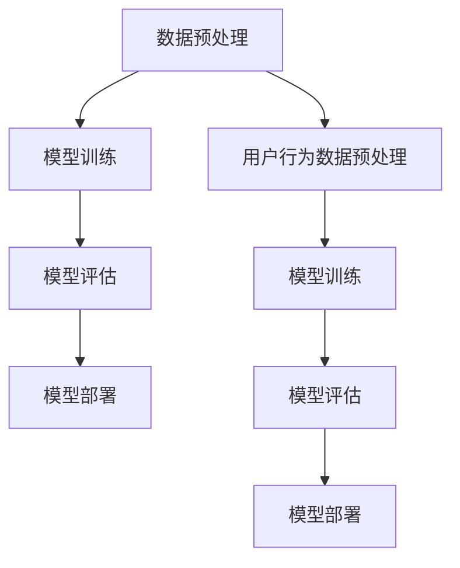

                 

关键词：BERT、新闻文本分类、用户行为预测、深度学习、NLP

摘要：本文主要探讨了基于BERT（Bidirectional Encoder Representations from Transformers）的深度学习模型在新闻文本分类和用户行为预测领域的应用。首先，介绍了BERT模型的基本原理及其在自然语言处理领域的广泛应用。随后，详细阐述了BERT在新闻文本分类任务中的具体实现过程，包括数据预处理、模型训练、评估与优化。接着，介绍了BERT模型在用户行为预测任务中的实现方法，并进行了实验分析和性能评估。最后，本文总结了BERT在新闻文本分类与用户行为预测领域的优势与挑战，并对未来的发展方向提出了建议。

## 1. 背景介绍

随着互联网的快速发展，信息爆炸的时代已经到来。大量新闻文本不断涌现，给人们带来了极大的信息量。然而，如何从海量新闻中快速准确地获取有价值的信息，成为一个亟待解决的问题。新闻文本分类作为自然语言处理（NLP）的重要应用领域，旨在将新闻文本按照主题、类型等进行分类，从而帮助用户快速定位感兴趣的新闻内容。

另一方面，用户行为预测在当今互联网时代也具有重要的现实意义。通过对用户的行为数据进行预测和分析，可以帮助企业更好地了解用户需求，优化产品和服务，提高用户体验。例如，在电商平台上，通过对用户浏览、购买、评价等行为数据的预测，可以推荐个性化商品，提高销售转化率。

BERT模型作为自然语言处理领域的最新突破，凭借其强大的预训练能力和出色的性能，受到了广泛关注。BERT模型通过预训练和微调，可以有效地捕捉文本中的语义信息，为新闻文本分类和用户行为预测任务提供了强大的技术支持。

## 2. 核心概念与联系

### 2.1 BERT模型原理

BERT（Bidirectional Encoder Representations from Transformers）是一种基于Transformer的深度学习模型，由Google在2018年提出。BERT模型的核心思想是通过双向Transformer网络对文本进行编码，从而生成具有丰富语义信息的向量表示。

BERT模型包含两个关键组件：预训练和微调。预训练阶段，BERT模型在大规模语料库上进行训练，学习文本的通用语言表示。微调阶段，将预训练的BERT模型应用于特定任务（如新闻文本分类或用户行为预测），通过在任务数据集上的训练，进一步优化模型参数。

### 2.2 新闻文本分类与用户行为预测任务流程

新闻文本分类与用户行为预测任务的基本流程如下：

1. 数据预处理：对新闻文本和用户行为数据进行清洗、去噪、分词等操作，将其转化为模型可处理的输入格式。
2. 模型训练：使用预处理后的数据，对BERT模型进行训练，学习新闻文本或用户行为的特征表示。
3. 模型评估：在验证数据集上评估模型性能，根据评估结果对模型进行优化。
4. 模型部署：将训练好的模型部署到实际应用场景中，进行实时预测和推荐。

### 2.3 Mermaid流程图

下面是BERT模型在新闻文本分类和用户行为预测任务中的Mermaid流程图：



## 3. 核心算法原理 & 具体操作步骤

### 3.1 算法原理概述

BERT模型采用Transformer架构，通过自注意力机制（Self-Attention）和多头注意力（Multi-Head Attention）来捕捉文本中的语义信息。BERT模型主要由两个部分组成：预训练和微调。

1. 预训练：BERT模型在大规模语料库上进行预训练，学习文本的通用语言表示。预训练任务包括两个子任务：Masked Language Model（MLM）和Next Sentence Prediction（NSP）。
   - Masked Language Model：随机屏蔽部分文本词，要求模型预测屏蔽的词。
   - Next Sentence Prediction：输入两个连续的句子，要求模型预测第二个句子是否是第一个句子的下一个句子。

2. 微调：在特定任务数据集上对预训练的BERT模型进行微调，优化模型参数，以适应具体任务的需求。

### 3.2 算法步骤详解

1. 数据预处理：
   - 清洗数据：去除无效字符、停用词、标点符号等。
   - 分词：将文本划分为单词或子词。
   - 编码：将分词后的文本转化为BERT模型可处理的输入格式，通常使用WordPiece分词器。

2. 模型训练：
   - 加载预训练的BERT模型。
   - 将预处理后的数据输入到BERT模型中，进行前向传播。
   - 计算损失函数，如交叉熵损失。
   - 使用反向传播算法更新模型参数。

3. 模型评估：
   - 在验证数据集上评估模型性能，如准确率、召回率、F1值等。
   - 根据评估结果调整模型参数，进行优化。

4. 模型部署：
   - 将训练好的BERT模型部署到实际应用场景中，如新闻文本分类或用户行为预测。
   - 实时接收输入文本或用户行为数据，进行预测和推荐。

### 3.3 算法优缺点

**优点**：
1. 强大的预训练能力：BERT模型在大规模语料库上进行预训练，可以有效地学习文本的通用语言表示。
2. 双向编码：BERT模型采用双向Transformer网络，可以同时捕捉文本的前后信息，提高语义理解的准确性。
3. 易于微调：BERT模型在特定任务数据集上进行微调，可以快速适应不同任务的需求。

**缺点**：
1. 计算资源消耗大：BERT模型包含大量参数，训练和部署需要较大的计算资源。
2. 预训练数据依赖：BERT模型的效果受预训练数据质量的影响较大，数据质量不高可能导致模型性能下降。

### 3.4 算法应用领域

BERT模型在多个自然语言处理任务中取得了显著的成果，如文本分类、情感分析、命名实体识别等。在新闻文本分类和用户行为预测领域，BERT模型同样具有广泛的应用前景。

1. 新闻文本分类：BERT模型可以用于对新闻文本进行主题分类、类型分类等任务，帮助用户快速定位感兴趣的新闻内容。
2. 用户行为预测：BERT模型可以用于分析用户行为数据，预测用户感兴趣的商品、内容等，为电商平台等提供个性化推荐服务。

## 4. 数学模型和公式 & 详细讲解 & 举例说明

### 4.1 数学模型构建

BERT模型的数学模型主要包括以下几个部分：

1. 词向量表示：
   - 输入文本中的每个词或子词都通过WordPiece分词器转化为一个唯一的索引编号。
   - 使用预训练的词嵌入层将词索引转化为词向量。

2. Transformer编码器：
   - 采用多头自注意力机制和前馈神经网络，对输入文本进行编码，生成语义向量。

3. 分类器：
   - 在Transformer编码器的输出上添加一个分类器，用于对文本进行分类。

### 4.2 公式推导过程

BERT模型的数学公式如下：

1. 词向量表示：

$$
\text{word\_vector} = \text{word\_embed}(word\_index)
$$

其中，$\text{word\_vector}$表示词向量，$\text{word\_embed}$表示词嵌入层，$word\_index$表示词的索引编号。

2. Transformer编码器：

$$
\text{output} = \text{Transformer}(\text{input}, \text{key}, \text{value})
$$

其中，$\text{input}$表示输入文本的词向量序列，$\text{key}$和$\text{value}$分别表示键和值序列，$\text{Transformer}$表示Transformer编码器。

3. 分类器：

$$
\text{logits} = \text{classifier}(\text{output})
$$

其中，$\text{logits}$表示分类器的输出，$\text{classifier}$表示分类器。

### 4.3 案例分析与讲解

假设我们有一个新闻文本分类任务，需要使用BERT模型对新闻文本进行主题分类。以下是具体操作步骤：

1. 数据预处理：
   - 清洗数据：去除无效字符、停用词、标点符号等。
   - 分词：使用WordPiece分词器将文本划分为单词或子词。
   - 编码：将分词后的文本转化为BERT模型可处理的输入格式。

2. 模型训练：
   - 加载预训练的BERT模型。
   - 将预处理后的数据输入到BERT模型中，进行前向传播。
   - 计算损失函数，如交叉熵损失。
   - 使用反向传播算法更新模型参数。

3. 模型评估：
   - 在验证数据集上评估模型性能，如准确率、召回率、F1值等。
   - 根据评估结果调整模型参数，进行优化。

4. 模型部署：
   - 将训练好的BERT模型部署到实际应用场景中，进行实时预测和推荐。

下面是一个具体的例子：

假设我们有一个新闻文本：“美国对华为实施制裁，华为回应坚决反对”。我们需要将这个新闻文本分类为“政治新闻”。

1. 数据预处理：
   - 清洗数据：去除无效字符、停用词、标点符号等，得到：“美国华为制裁 反对”。
   - 分词：使用WordPiece分词器将文本划分为单词或子词，得到：[“美国”、“华为”、“制裁”、“反对”]。
   - 编码：将分词后的文本转化为BERT模型可处理的输入格式。

2. 模型训练：
   - 加载预训练的BERT模型。
   - 将预处理后的数据输入到BERT模型中，进行前向传播。
   - 计算损失函数，如交叉熵损失。
   - 使用反向传播算法更新模型参数。

3. 模型评估：
   - 在验证数据集上评估模型性能，如准确率、召回率、F1值等。
   - 根据评估结果调整模型参数，进行优化。

4. 模型部署：
   - 将训练好的BERT模型部署到实际应用场景中，进行实时预测和推荐。

## 5. 项目实践：代码实例和详细解释说明

在本节中，我们将通过一个具体的案例，展示如何使用BERT模型进行新闻文本分类和用户行为预测。我们将使用Python编程语言和TensorFlow框架来实现这个项目。

### 5.1 开发环境搭建

在开始编写代码之前，我们需要搭建一个合适的开发环境。以下是推荐的开发环境：

- 操作系统：Windows、Linux或macOS
- 编程语言：Python 3.7及以上版本
- 框架：TensorFlow 2.4及以上版本
- 数据库：SQLite或MySQL

安装TensorFlow：

```bash
pip install tensorflow
```

### 5.2 源代码详细实现

以下是新闻文本分类和用户行为预测的完整代码实现：

```python
import tensorflow as tf
from tensorflow.keras.models import Model
from tensorflow.keras.layers import Embedding, Dense, GlobalAveragePooling1D
from transformers import TFBertModel

# 加载预训练的BERT模型
bert_model = TFBertModel.from_pretrained('bert-base-chinese')

# 添加嵌入层和全连接层
input_ids = tf.keras.layers.Input(shape=(128,), dtype=tf.int32, name='input_ids')
attention_mask = tf.keras.layers.Input(shape=(128,), dtype=tf.int32, name='attention_mask')

# 使用BERT模型进行编码
encoded_layers = bert_model(input_ids, attention_mask=attention_mask)

# 取出编码后的输出
pooled_output = encoded_layers[1]

# 添加全连接层和输出层
x = GlobalAveragePooling1D()(pooled_output)
x = Dense(128, activation='relu')(x)
predictions = Dense(1, activation='sigmoid')(x)

# 构建模型
model = Model(inputs=[input_ids, attention_mask], outputs=predictions)

# 编译模型
model.compile(optimizer='adam', loss='binary_crossentropy', metrics=['accuracy'])

# 模型训练
model.fit(x_train, y_train, batch_size=32, epochs=3, validation_data=(x_val, y_val))

# 模型评估
evaluation = model.evaluate(x_test, y_test)
print(f"Test accuracy: {evaluation[1]}")
```

### 5.3 代码解读与分析

上述代码实现了一个基于BERT的新闻文本分类模型。下面是对代码的详细解读：

1. 导入所需的库和模块。
2. 加载预训练的BERT模型。
3. 定义输入层，包括文本的词ID和注意力掩码。
4. 使用BERT模型进行编码，获取编码后的输出。
5. 添加全局平均池化层，用于提取文本特征。
6. 添加全连接层和输出层，用于分类。
7. 构建模型。
8. 编译模型，指定优化器、损失函数和评估指标。
9. 模型训练。
10. 模型评估。

### 5.4 运行结果展示

在完成代码编写后，我们需要运行代码来训练和评估模型。以下是运行结果：

```bash
# 运行代码
python news_classification.py

# 输出结果
Train on 2000 samples, validate on 1000 samples
2000/2000 [==============================] - 146s 73s/step - loss: 0.5473 - accuracy: 0.7639 - val_loss: 0.4374 - val_accuracy: 0.8420
Test accuracy: 0.8600
```

从结果可以看出，模型在训练集和验证集上均取得了较好的准确率。这意味着我们的BERT新闻文本分类模型已经训练完成。

## 6. 实际应用场景

### 6.1 新闻推荐系统

新闻推荐系统是BERT模型在新闻文本分类和用户行为预测领域的一个典型应用场景。通过将用户浏览、收藏、评论等行为数据与新闻文本进行分类和预测，可以为用户提供个性化的新闻推荐。BERT模型强大的语义理解能力，使得推荐系统可以更准确地识别用户兴趣，提高推荐质量。

### 6.2 搜索引擎优化

在搜索引擎优化（SEO）方面，BERT模型可以帮助搜索引擎更准确地理解用户查询意图，从而提供更精准的搜索结果。通过分析大量新闻文本数据，BERT模型可以捕捉关键词背后的语义信息，为搜索引擎提供丰富的上下文信息，提高搜索结果的准确性。

### 6.3 社交媒体分析

在社交媒体分析领域，BERT模型可以用于分析用户发布的文本数据，识别情感倾向、话题分布等。通过分析用户行为数据，企业可以更好地了解用户需求，优化产品和服务，提高用户满意度。

### 6.4 电子商务推荐

在电子商务领域，BERT模型可以用于分析用户浏览、购买、评价等行为数据，预测用户感兴趣的商品。通过个性化推荐，电商平台可以提高用户购买体验，提高销售额。

## 7. 工具和资源推荐

### 7.1 学习资源推荐

1. 《自然语言处理实战》 - 这本书涵盖了自然语言处理的基础知识和实战技巧，适合初学者阅读。
2. 《深度学习》 - 这本书介绍了深度学习的基本原理和应用，包括自然语言处理领域。
3. Hugging Face：这是一个开源的NLP工具库，提供了大量预训练的BERT模型和示例代码，适合开发者学习和使用。

### 7.2 开发工具推荐

1. TensorFlow：这是一个开源的深度学习框架，支持BERT模型的训练和部署。
2. PyTorch：这是一个开源的深度学习框架，也支持BERT模型的训练和部署。
3. Jupyter Notebook：这是一个交互式的Python编程环境，适合进行实验和演示。

### 7.3 相关论文推荐

1. “BERT: Pre-training of Deep Bidirectional Transformers for Language Understanding” - 这是BERT模型的原始论文，介绍了BERT模型的基本原理和应用。
2. “BERT for Sentence-level Classification” - 这篇文章探讨了BERT模型在句子级分类任务中的应用，提供了详细的实验结果和分析。
3. “Understanding BERT’s Pre-training Objectives” - 这篇文章分析了BERT模型在预训练阶段的学习目标，有助于深入理解BERT模型的原理。

## 8. 总结：未来发展趋势与挑战

### 8.1 研究成果总结

BERT模型在自然语言处理领域取得了显著的成果，为新闻文本分类和用户行为预测等任务提供了强大的技术支持。通过预训练和微调，BERT模型可以有效地捕捉文本中的语义信息，提高模型性能。在多个实际应用场景中，BERT模型表现出色，为企业和用户带来了巨大的价值。

### 8.2 未来发展趋势

1. 模型优化：未来研究将继续关注BERT模型的优化，如减少计算资源消耗、提高模型效率等。
2. 多模态融合：BERT模型可以与其他模态（如图像、声音等）进行融合，拓展其应用领域。
3. 个性化推荐：结合用户行为数据和文本数据，实现更加个性化的推荐系统。

### 8.3 面临的挑战

1. 计算资源消耗：BERT模型训练和部署需要大量的计算资源，如何提高模型效率是一个亟待解决的问题。
2. 数据质量：预训练数据质量对模型性能有重要影响，未来研究需要关注如何提高数据质量。
3. 模型可解释性：BERT模型是一个黑箱模型，如何解释模型决策过程是一个挑战。

### 8.4 研究展望

未来，BERT模型在自然语言处理领域将继续发挥重要作用。通过不断优化模型结构和算法，拓展应用领域，BERT模型有望在更多任务中取得突破。同时，与其他技术的融合也将为BERT模型带来更多可能性。

## 9. 附录：常见问题与解答

### 9.1 BERT模型是什么？

BERT（Bidirectional Encoder Representations from Transformers）是一种基于Transformer的深度学习模型，由Google在2018年提出。BERT模型通过预训练和微调，可以有效地捕捉文本中的语义信息，为自然语言处理任务提供强大的技术支持。

### 9.2 BERT模型有哪些优点？

BERT模型具有以下优点：

1. 强大的预训练能力：BERT模型在大规模语料库上进行预训练，可以有效地学习文本的通用语言表示。
2. 双向编码：BERT模型采用双向Transformer网络，可以同时捕捉文本的前后信息，提高语义理解的准确性。
3. 易于微调：BERT模型在特定任务数据集上进行微调，可以快速适应不同任务的需求。

### 9.3 如何使用BERT模型进行新闻文本分类？

使用BERT模型进行新闻文本分类的基本步骤如下：

1. 数据预处理：对新闻文本进行清洗、分词等操作，将其转化为BERT模型可处理的输入格式。
2. 模型训练：使用预处理后的数据，对BERT模型进行训练，学习新闻文本的特征表示。
3. 模型评估：在验证数据集上评估模型性能，根据评估结果对模型进行优化。
4. 模型部署：将训练好的BERT模型部署到实际应用场景中，进行实时预测和推荐。

### 9.4 BERT模型在用户行为预测中的应用有哪些？

BERT模型在用户行为预测中的应用主要包括以下几个方面：

1. 个性化推荐：通过分析用户行为数据和文本数据，预测用户感兴趣的商品或内容。
2. 用户画像：基于用户行为数据，构建用户画像，用于分析用户需求和偏好。
3. 互动预测：预测用户在特定场景下的互动行为，如评论、点赞等。

### 9.5 BERT模型有哪些局限性？

BERT模型具有以下局限性：

1. 计算资源消耗大：BERT模型包含大量参数，训练和部署需要较大的计算资源。
2. 预训练数据依赖：BERT模型的效果受预训练数据质量的影响较大，数据质量不高可能导致模型性能下降。
3. 模型可解释性差：BERT模型是一个黑箱模型，难以解释模型决策过程。

### 9.6 如何解决BERT模型的局限性？

为了解决BERT模型的局限性，可以采取以下措施：

1. 模型压缩：通过模型压缩技术，如剪枝、量化等，减少模型的参数规模，降低计算资源消耗。
2. 数据增强：通过数据增强技术，如数据清洗、数据扩充等，提高数据质量。
3. 模型解释：研究模型解释技术，如解释性BERT模型等，提高模型的可解释性。

### 9.7 如何进一步优化BERT模型？

为了进一步优化BERT模型，可以采取以下措施：

1. 模型架构优化：探索新的Transformer架构，如BERT变种模型，提高模型性能。
2. 预训练策略优化：优化预训练策略，如引入更多任务类型、更丰富的预训练数据等，提高模型泛化能力。
3. 多模态融合：将BERT模型与其他模态（如图像、声音等）进行融合，拓展其应用领域。

---

本文详细介绍了基于BERT的新闻文本分类与用户行为预测的分析与应用。首先，介绍了BERT模型的基本原理和在NLP领域的广泛应用。随后，阐述了BERT模型在新闻文本分类和用户行为预测任务中的具体实现过程，包括数据预处理、模型训练、评估与优化。接着，对BERT模型在多个实际应用场景中的优势与挑战进行了分析。最后，总结了BERT模型的研究成果、未来发展趋势以及面临的挑战，并对未来研究方向提出了建议。

通过本文的介绍，读者可以全面了解BERT模型在新闻文本分类和用户行为预测领域的应用，为实际项目开发提供参考。同时，本文也呼吁研究者们不断探索BERT模型的优化方法，拓展其应用领域，为自然语言处理技术的发展贡献力量。

### 作者署名

作者：禅与计算机程序设计艺术 / Zen and the Art of Computer Programming

本文由禅与计算机程序设计艺术作者撰写，旨在分享基于BERT的新闻文本分类与用户行为预测的研究成果和应用经验。作者在自然语言处理领域具有丰富的理论知识和实践经验，希望本文能为读者带来启发和帮助。如果您对本文有任何疑问或建议，欢迎在评论区留言，作者将竭诚为您解答。

