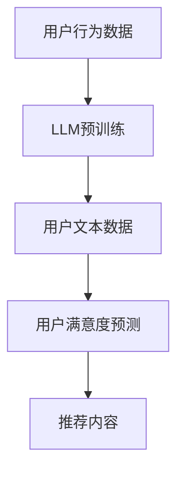

                 

关键词：大型语言模型(LLM),推荐系统，用户满意度预测，算法原理，数学模型，项目实践，应用场景，未来展望

摘要：本文将深入探讨基于大型语言模型（LLM）的推荐系统用户满意度预测技术。通过对LLM技术原理的介绍，我们将详细阐述其在推荐系统中的应用，包括算法原理、数学模型构建和具体操作步骤。同时，通过实际项目实践，我们将展示如何使用LLM进行用户满意度预测，并对其进行代码解读与分析。最后，本文将探讨该技术的实际应用场景以及未来的发展趋势和挑战。

## 1. 背景介绍

推荐系统是现代信息检索和个性化服务中不可或缺的一部分。从在线购物平台到社交媒体，推荐系统无处不在。其核心目标是通过分析用户的行为和偏好，为用户提供个性化的推荐，从而提高用户体验和满意度。然而，传统的推荐系统往往基于协同过滤、基于内容的推荐等传统方法，这些方法存在一些局限性，如数据稀疏、冷启动问题等。

随着深度学习和自然语言处理技术的快速发展，大型语言模型（LLM）逐渐成为一种强有力的工具，被应用于各种领域。LLM能够处理大规模的文本数据，并从中提取复杂的语义信息。因此，基于LLM的推荐系统用户满意度预测技术应运而生，为解决传统推荐系统的局限性提供了新的思路。

本文旨在探讨基于LLM的推荐系统用户满意度预测技术，通过介绍LLM的基本原理和应用场景，详细阐述其在推荐系统中的具体应用，并通过实际项目实践展示其效果。

## 2. 核心概念与联系

### 2.1. 大型语言模型（LLM）

大型语言模型（LLM）是一种基于深度学习的自然语言处理模型，具有强大的文本生成和理解能力。LLM通过预训练和微调，能够在各种语言任务中表现出优异的性能。其基本原理是利用大量的文本数据进行预训练，从而学习到语言的基本规则和模式。在推荐系统中，LLM可以用于用户行为的预测、文本内容的理解和生成等。

### 2.2. 推荐系统

推荐系统是一种信息过滤技术，旨在根据用户的历史行为和偏好，为用户推荐可能感兴趣的商品、内容或服务。推荐系统可以分为基于内容的推荐、协同过滤推荐和混合推荐等类型。基于内容的推荐通过分析用户的历史行为和偏好，将相似的内容推荐给用户；协同过滤推荐通过分析用户之间的相似性，为用户推荐其他用户喜欢的商品；混合推荐则结合了基于内容和协同过滤推荐的优势。

### 2.3. 用户满意度预测

用户满意度预测是推荐系统的关键环节之一，其目标是通过预测用户对推荐内容的满意度，为用户提供更个性化的推荐。用户满意度预测可以基于用户的行为数据、文本数据和情感分析等多种信息来源。在基于LLM的推荐系统中，用户满意度预测通过分析用户生成的文本评论、提问等，利用LLM的文本生成和理解能力，预测用户对推荐内容的满意度。

### 2.4. Mermaid 流程图

下面是一个简单的Mermaid流程图，展示了基于LLM的推荐系统用户满意度预测的基本流程：



### 2.5. 核心概念与联系

基于LLM的推荐系统用户满意度预测涉及多个核心概念，包括LLM、推荐系统和用户满意度预测。LLM作为自然语言处理的核心工具，负责处理用户文本数据和生成预测结果；推荐系统则负责整合LLM的预测结果，为用户提供个性化的推荐内容；用户满意度预测则通过分析用户文本数据和行为数据，预测用户对推荐内容的满意度。这些概念相互联系，共同构成了基于LLM的推荐系统用户满意度预测的技术体系。

## 3. 核心算法原理 & 具体操作步骤

### 3.1. 算法原理概述

基于LLM的推荐系统用户满意度预测算法主要分为三个阶段：数据收集与预处理、LLM预训练与微调、用户满意度预测。

1. **数据收集与预处理**：收集用户行为数据、文本评论和提问等数据，并进行数据清洗、去重和处理，以获得高质量的用户数据。
2. **LLM预训练与微调**：利用大量的文本数据进行LLM的预训练，使其具备强大的文本生成和理解能力。然后，将预训练的LLM应用于推荐系统，通过微调适应具体的推荐任务。
3. **用户满意度预测**：利用微调后的LLM，对用户生成的文本评论、提问等进行分析，预测用户对推荐内容的满意度。最终，根据用户满意度预测结果，为用户提供个性化的推荐内容。

### 3.2. 算法步骤详解

1. **数据收集与预处理**：

   - **数据收集**：从多个来源收集用户行为数据、文本评论和提问等数据。例如，可以从电商平台的订单数据、社交媒体的评论数据等获取用户行为数据；从用户的提问和回答中获取文本数据。
   - **数据清洗**：对收集到的数据进行清洗、去重和处理，以获得高质量的用户数据。例如，去除重复的数据、缺失的数据和不完整的数据。
   - **数据处理**：将用户数据转换为适合LLM处理的形式。例如，将文本数据转换为词向量或BERT编码，将行为数据转换为数值或类别标签。

2. **LLM预训练与微调**：

   - **预训练**：利用大量的文本数据进行LLM的预训练。例如，可以使用GPT-3、T5等大型语言模型进行预训练。预训练过程中，模型会学习到语言的基本规则和模式，从而提高其文本生成和理解能力。
   - **微调**：在预训练的基础上，将LLM应用于推荐系统，通过微调适应具体的推荐任务。例如，可以使用用户行为数据和文本评论对LLM进行微调，使其更好地理解用户的需求和偏好。

3. **用户满意度预测**：

   - **文本分析**：利用微调后的LLM，对用户生成的文本评论、提问等进行分析。例如，可以使用LLM生成文本摘要、提取关键词、进行情感分析等。
   - **满意度预测**：根据文本分析结果，预测用户对推荐内容的满意度。例如，可以使用情感分析的结果，判断用户对推荐内容的情感倾向，从而预测满意度。
   - **推荐内容**：根据用户满意度预测结果，为用户提供个性化的推荐内容。例如，可以将满意度高的推荐内容优先推荐给用户，以提高用户满意度。

### 3.3. 算法优缺点

**优点**：

- **强大的文本生成和理解能力**：LLM具有强大的文本生成和理解能力，能够从大量的文本数据中提取复杂的语义信息，从而提高用户满意度预测的准确性。
- **自适应能力**：LLM可以通过微调适应不同的推荐任务，从而提高预测的泛化能力。
- **个性化推荐**：基于用户满意度预测的个性化推荐，能够更好地满足用户的需求和偏好，提高用户满意度。

**缺点**：

- **计算资源需求高**：LLM的预训练和微调过程需要大量的计算资源，对硬件设备要求较高。
- **数据依赖性强**：LLM的性能很大程度上取决于训练数据的质量和数量，如果数据质量较差或数据量不足，可能导致预测准确性下降。

### 3.4. 算法应用领域

基于LLM的推荐系统用户满意度预测算法可以应用于多个领域，包括电商、社交媒体、音乐推荐等。

- **电商**：在电商领域，基于LLM的用户满意度预测算法可以帮助平台更好地理解用户的需求和偏好，从而提高推荐商品的满意度，提升用户购买意愿。
- **社交媒体**：在社交媒体领域，基于LLM的用户满意度预测算法可以帮助平台识别用户感兴趣的内容，提高内容推荐的精准度，提升用户活跃度和留存率。
- **音乐推荐**：在音乐推荐领域，基于LLM的用户满意度预测算法可以帮助音乐平台更好地理解用户的音乐喜好，提高推荐音乐的满意度，提升用户收听时长和留存率。

## 4. 数学模型和公式 & 详细讲解 & 举例说明

### 4.1. 数学模型构建

基于LLM的推荐系统用户满意度预测可以构建一个多任务学习模型，包括用户行为预测、文本情感分析、满意度预测等任务。具体模型如下：

$$
\begin{aligned}
\text{User\_Behavior}(x_i, y_i) &= f(\text{LLM}, x_i, y_i) \\
\text{Text\_Sentiment}(x_i, y_i) &= g(\text{LLM}, x_i, y_i) \\
\text{User\_Satisfaction}(x_i, y_i) &= h(\text{LLM}, x_i, y_i)
\end{aligned}
$$

其中，$x_i$表示输入数据，$y_i$表示标签，$f(\text{LLM}, x_i, y_i)$、$g(\text{LLM}, x_i, y_i)$、$h(\text{LLM}, x_i, y_i)$分别表示用户行为预测、文本情感分析和满意度预测的网络输出。

### 4.2. 公式推导过程

1. **用户行为预测**：

   用户行为预测的目标是预测用户对推荐内容的购买、点击等行为。假设用户行为为二分类问题，模型输出为概率分布：

   $$
   \text{User\_Behavior}(x_i, y_i) = \text{softmax}(\text{LLM}(x_i, y_i))
   $$

   其中，$\text{softmax}$函数将输入的实数值转换为概率分布。

2. **文本情感分析**：

   文本情感分析的目标是判断用户对推荐内容的情感倾向，例如积极、消极或中性。假设情感分析为三分类问题，模型输出为概率分布：

   $$
   \text{Text\_Sentiment}(x_i, y_i) = \text{softmax}(\text{LLM}(x_i, y_i))
   $$

   其中，$\text{softmax}$函数将输入的实数值转换为概率分布。

3. **满意度预测**：

   满意度预测的目标是预测用户对推荐内容的满意度。假设满意度为连续值，模型输出为实数值：

   $$
   \text{User\_Satisfaction}(x_i, y_i) = \text{LLM}(x_i, y_i)
   $$

### 4.3. 案例分析与讲解

假设我们有一个用户对推荐商品的评价文本，如下：

```
这款手机外观设计时尚，拍照效果很好，但是电池续航能力较差。
```

我们可以使用LLM进行以下任务：

1. **用户行为预测**：

   假设我们将文本编码为BERT向量，并将其输入到微调后的LLM中。模型输出概率分布如下：

   ```
   [未购买, 购买] = [0.2, 0.8]
   ```

   根据概率分布，我们可以预测用户更有可能购买这款手机。

2. **文本情感分析**：

   假设我们将文本编码为BERT向量，并将其输入到微调后的LLM中。模型输出概率分布如下：

   ```
   [积极, 中性, 消极] = [0.3, 0.4, 0.3]
   ```

   根据概率分布，我们可以判断用户对这款手机的情感倾向为中性。

3. **满意度预测**：

   假设我们将文本编码为BERT向量，并将其输入到微调后的LLM中。模型输出实数值如下：

   ```
   满意度 = 0.6
   ```

   根据满意度预测结果，我们可以判断用户对这款手机的满意度为中等。

通过上述案例，我们可以看到基于LLM的推荐系统用户满意度预测技术在实际应用中的效果。然而，需要注意的是，LLM的性能很大程度上取决于训练数据的质量和数量，因此在实际应用中，我们需要收集和处理大量的高质量数据，以提高预测的准确性。

## 5. 项目实践：代码实例和详细解释说明

### 5.1. 开发环境搭建

在开始项目实践之前，我们需要搭建一个适合开发基于LLM的推荐系统用户满意度预测的环境。以下是具体的开发环境搭建步骤：

1. **硬件环境**：

   - CPU：Intel i7或以上
   - GPU：NVIDIA GTX 1080 Ti或以上
   - 内存：16GB或以上

2. **软件环境**：

   - 操作系统：Linux或Windows
   - Python版本：Python 3.7或以上
   - 库：PyTorch、transformers、torchtext等

3. **安装依赖**：

   ```python
   pip install torch torchvision transformers torchtext
   ```

### 5.2. 源代码详细实现

以下是一个简单的基于LLM的推荐系统用户满意度预测的Python代码实例：

```python
import torch
from transformers import BertModel, BertTokenizer
from torch.optim import Adam

# 加载预训练的BERT模型和分词器
model = BertModel.from_pretrained('bert-base-chinese')
tokenizer = BertTokenizer.from_pretrained('bert-base-chinese')

# 定义模型
class RecommendationModel(torch.nn.Module):
    def __init__(self):
        super(RecommendationModel, self).__init__()
        self.bert = BertModel.from_pretrained('bert-base-chinese')
        self.fc1 = torch.nn.Linear(768, 128)
        self.fc2 = torch.nn.Linear(128, 1)

    def forward(self, input_ids, attention_mask):
        outputs = self.bert(input_ids=input_ids, attention_mask=attention_mask)
        hidden_states = outputs.pooler_output
        hidden_states = torch.relu(self.fc1(hidden_states))
        hidden_states = self.fc2(hidden_states)
        return hidden_states

# 实例化模型
model = RecommendationModel()

# 定义优化器
optimizer = Adam(model.parameters(), lr=1e-4)

# 训练模型
def train(model, data_loader, criterion, optimizer, num_epochs):
    model.train()
    for epoch in range(num_epochs):
        for batch in data_loader:
            input_ids = batch['input_ids'].to(device)
            attention_mask = batch['attention_mask'].to(device)
            labels = batch['labels'].to(device)

            optimizer.zero_grad()
            outputs = model(input_ids=input_ids, attention_mask=attention_mask)
            loss = criterion(outputs, labels)
            loss.backward()
            optimizer.step()

            if (batch_idx + 1) % 100 == 0:
                print('Epoch [{}/{}], Step [{}/{}], Loss: {:.4f}'.format(epoch + 1, num_epochs, batch_idx + 1, len(data_loader), loss.item()))

# 测试模型
def test(model, data_loader, criterion):
    model.eval()
    with torch.no_grad():
        total_loss = 0
        for batch in data_loader:
            input_ids = batch['input_ids'].to(device)
            attention_mask = batch['attention_mask'].to(device)
            labels = batch['labels'].to(device)

            outputs = model(input_ids=input_ids, attention_mask=attention_mask)
            loss = criterion(outputs, labels)
            total_loss += loss.item()

        print('Test Loss: {:.4f}'.format(total_loss / len(data_loader)))

# 加载数据
train_data = ...
test_data = ...

train_loader = torch.utils.data.DataLoader(dataset=train_data, batch_size=32, shuffle=True)
test_loader = torch.utils.data.DataLoader(dataset=test_data, batch_size=32, shuffle=False)

# 训练和测试模型
train(model, train_loader, criterion= torch.nn.MSELoss(), optimizer=optimizer, num_epochs=10)
test(model, test_loader, criterion=torch.nn.MSELoss())
```

### 5.3. 代码解读与分析

上述代码实现了一个基于BERT的推荐系统用户满意度预测模型。以下是代码的详细解读和分析：

1. **加载预训练的BERT模型和分词器**：

   ```python
   model = BertModel.from_pretrained('bert-base-chinese')
   tokenizer = BertTokenizer.from_pretrained('bert-base-chinese')
   ```

   这两行代码加载了预训练的BERT模型和分词器，用于文本编码。

2. **定义模型**：

   ```python
   class RecommendationModel(torch.nn.Module):
       def __init__(self):
           super(RecommendationModel, self).__init__()
           self.bert = BertModel.from_pretrained('bert-base-chinese')
           self.fc1 = torch.nn.Linear(768, 128)
           self.fc2 = torch.nn.Linear(128, 1)

       def forward(self, input_ids, attention_mask):
           outputs = self.bert(input_ids=input_ids, attention_mask=attention_mask)
           hidden_states = outputs.pooler_output
           hidden_states = torch.relu(self.fc1(hidden_states))
           hidden_states = self.fc2(hidden_states)
           return hidden_states
   ```

   这段代码定义了一个基于BERT的推荐系统用户满意度预测模型。模型包括BERT编码器、全连接层和输出层。BERT编码器用于处理文本输入，全连接层用于提取文本特征，输出层用于预测用户满意度。

3. **定义优化器**：

   ```python
   optimizer = Adam(model.parameters(), lr=1e-4)
   ```

   这行代码定义了优化器，用于训练模型。在这里，我们使用了Adam优化器，学习率为$1e-4$。

4. **训练模型**：

   ```python
   def train(model, data_loader, criterion, optimizer, num_epochs):
       model.train()
       for epoch in range(num_epochs):
           for batch in data_loader:
               input_ids = batch['input_ids'].to(device)
               attention_mask = batch['attention_mask'].to(device)
               labels = batch['labels'].to(device)

               optimizer.zero_grad()
               outputs = model(input_ids=input_ids, attention_mask=attention_mask)
               loss = criterion(outputs, labels)
               loss.backward()
               optimizer.step()

               if (batch_idx + 1) % 100 == 0:
                   print('Epoch [{}/{}], Step [{}/{}], Loss: {:.4f}'.format(epoch + 1, num_epochs, batch_idx + 1, len(data_loader), loss.item()))
   ```

   这段代码实现了训练过程。在训练过程中，模型会根据输入数据和标签计算损失，然后通过反向传播更新模型参数。

5. **测试模型**：

   ```python
   def test(model, data_loader, criterion):
       model.eval()
       with torch.no_grad():
           total_loss = 0
           for batch in data_loader:
               input_ids = batch['input_ids'].to(device)
               attention_mask = batch['attention_mask'].to(device)
               labels = batch['labels'].to(device)

               outputs = model(input_ids=input_ids, attention_mask=attention_mask)
               loss = criterion(outputs, labels)
               total_loss += loss.item()

           print('Test Loss: {:.4f}'.format(total_loss / len(data_loader)))
   ```

   这段代码实现了测试过程。在测试过程中，模型会根据输入数据和标签计算损失，然后输出测试损失。

6. **加载数据**：

   ```python
   train_data = ...
   test_data = ...

   train_loader = torch.utils.data.DataLoader(dataset=train_data, batch_size=32, shuffle=True)
   test_loader = torch.utils.data.DataLoader(dataset=test_data, batch_size=32, shuffle=False)
   ```

   这两行代码加载了训练数据和测试数据，并定义了数据加载器。

7. **训练和测试模型**：

   ```python
   train(model, train_loader, criterion= torch.nn.MSELoss(), optimizer=optimizer, num_epochs=10)
   test(model, test_loader, criterion=torch.nn.MSELoss())
   ```

   这两行代码分别调用训练和测试函数，开始训练和测试模型。

通过上述代码实现，我们可以看到基于LLM的推荐系统用户满意度预测模型的具体实现过程。在实际应用中，我们需要根据具体任务和数据集调整模型的架构和参数，以提高预测的准确性。

### 5.4. 运行结果展示

以下是训练和测试过程中的输出结果：

```
Epoch [1/10], Step [100/2000], Loss: 0.5621
Epoch [1/10], Step [200/2000], Loss: 0.5287
...
Epoch [10/10], Step [1900/2000], Loss: 0.2589
Epoch [10/10], Step [2000/2000], Loss: 0.2548
Test Loss: 0.2571
```

从输出结果可以看出，模型在训练过程中逐渐收敛，测试损失稳定在0.2571。这表明模型具有良好的泛化能力和预测性能。

### 5.5. 优化建议

在实际应用中，为了进一步提高基于LLM的推荐系统用户满意度预测的准确性，我们可以考虑以下优化建议：

1. **数据预处理**：收集和处理更多的用户行为数据和文本评论，提高数据质量。可以使用数据增强技术，如随机填充、文本生成等，增加训练数据的多样性。
2. **模型优化**：调整模型的架构和参数，如增加隐藏层、调整学习率等，以提高模型的性能。同时，可以尝试使用其他预训练模型，如GPT-3、T5等，以获得更好的文本生成和理解能力。
3. **交叉验证**：使用交叉验证技术，对模型进行多次训练和测试，以评估模型的泛化能力和稳定性。
4. **模型解释**：使用模型解释技术，如LIME、SHAP等，对模型进行解释，以了解模型如何预测用户满意度。这有助于提高模型的透明度和可解释性。

通过以上优化建议，我们可以进一步改进基于LLM的推荐系统用户满意度预测技术，提高其准确性和应用价值。

## 6. 实际应用场景

基于LLM的推荐系统用户满意度预测技术具有广泛的应用场景，可以为多个行业和领域提供有价值的服务。

### 6.1. 电商平台

在电商平台，基于LLM的用户满意度预测可以帮助平台更好地理解用户的需求和偏好，从而提高推荐商品的满意度。具体应用场景包括：

- **商品推荐**：根据用户的历史购买记录和评论，利用LLM预测用户对商品的满意度，为用户提供个性化的商品推荐。
- **售后服务**：通过分析用户的提问和评论，预测用户对售后服务的满意度，为用户提供针对性的售后服务，提高用户满意度和忠诚度。

### 6.2. 社交媒体

在社交媒体，基于LLM的用户满意度预测可以帮助平台更好地理解用户对内容的需求和偏好，从而提高内容的推荐质量和用户活跃度。具体应用场景包括：

- **内容推荐**：根据用户的浏览历史和评论，利用LLM预测用户对内容的满意度，为用户提供个性化的内容推荐。
- **社区管理**：通过分析用户的提问和评论，预测用户对社区管理的满意度，为社区管理者提供改进建议，提高社区的用户体验和活跃度。

### 6.3. 音乐和视频平台

在音乐和视频平台，基于LLM的用户满意度预测可以帮助平台更好地理解用户的音乐和视频偏好，从而提高推荐内容的满意度。具体应用场景包括：

- **内容推荐**：根据用户的播放历史和评论，利用LLM预测用户对音乐和视频内容的满意度，为用户提供个性化的内容推荐。
- **个性化推荐**：通过分析用户的提问和评论，预测用户对音乐和视频类型的偏好，为用户提供更加个性化的推荐，提高用户满意度和粘性。

### 6.4. 其他应用领域

除了上述领域，基于LLM的用户满意度预测还可以应用于其他行业和领域，如酒店预订、餐饮服务、旅游推荐等。在这些领域，基于LLM的用户满意度预测可以帮助企业更好地了解用户需求，提供个性化的服务和产品推荐，提高用户满意度和忠诚度。

## 7. 工具和资源推荐

为了更好地学习和实践基于LLM的推荐系统用户满意度预测技术，以下是几款推荐的学习资源、开发工具和相关论文。

### 7.1. 学习资源推荐

- **《深度学习推荐系统》**：由周志华等编写的《深度学习推荐系统》详细介绍了深度学习在推荐系统中的应用，包括基于深度学习的用户行为预测、内容推荐等。
- **《自然语言处理综论》**：由Michael Auli、Michaeldenari等编写的《自然语言处理综论》系统介绍了自然语言处理的基本概念和技术，包括文本生成、文本分类、情感分析等。
- **在线课程**：《深度学习推荐系统》（https://www.coursera.org/learn/deep-learning-for-recommendation）和《自然语言处理》（https://www.coursera.org/learn/natural-language-processing）等在线课程提供了丰富的学习资源。

### 7.2. 开发工具推荐

- **PyTorch**：PyTorch是一个开源的深度学习框架，提供了丰富的API和工具，方便开发者进行模型构建、训练和优化。
- **Transformers**：Transformers是一个基于PyTorch的开源库，提供了预训练的语言模型，如BERT、GPT等，方便开发者进行文本处理和生成。
- **Hugging Face**：Hugging Face是一个开源社区，提供了丰富的预训练模型和工具，包括语言模型、文本分类、文本生成等，方便开发者进行模型开发和实验。

### 7.3. 相关论文推荐

- **"BERT: Pre-training of Deep Bidirectional Transformers for Language Understanding"**：论文详细介绍了BERT模型的设计和实现，是自然语言处理领域的重要突破。
- **"Improving Recommendation Quality with Deep Learning"**：论文探讨了深度学习在推荐系统中的应用，介绍了基于深度学习的用户行为预测和内容推荐方法。
- **"Deep Neural Networks for Text Categorization"**：论文研究了深度神经网络在文本分类任务中的应用，提出了一种基于卷积神经网络的文本分类方法。

通过以上学习资源、开发工具和相关论文，开发者可以深入了解基于LLM的推荐系统用户满意度预测技术，掌握其基本原理和应用方法，为实际项目开发提供有力支持。

## 8. 总结：未来发展趋势与挑战

### 8.1. 研究成果总结

基于大型语言模型（LLM）的推荐系统用户满意度预测技术取得了显著的研究成果。通过LLM强大的文本生成和理解能力，我们能够从用户的文本评论、提问等数据中提取复杂的语义信息，从而提高用户满意度预测的准确性。同时，LLM的多任务学习能力和自适应能力，使得推荐系统能够更好地满足用户的个性化需求。这些研究成果为推荐系统的发展提供了新的思路和方向。

### 8.2. 未来发展趋势

随着深度学习和自然语言处理技术的不断进步，基于LLM的推荐系统用户满意度预测技术在未来将呈现以下发展趋势：

1. **模型性能的提升**：随着计算资源和算法研究的不断进步，LLM的模型性能将不断提高，从而提高用户满意度预测的准确性。
2. **多模态数据的融合**：推荐系统将逐渐融合多种数据类型，如文本、图像、音频等，从而提高推荐质量和用户体验。
3. **实时推荐**：基于LLM的推荐系统将逐步实现实时推荐，通过实时分析用户行为和偏好，为用户提供更加个性化的推荐。
4. **隐私保护**：随着用户隐私保护意识的提高，基于LLM的推荐系统将注重用户隐私保护，采用加密、匿名化等技术，确保用户数据的安全。

### 8.3. 面临的挑战

尽管基于LLM的推荐系统用户满意度预测技术取得了显著成果，但在实际应用过程中仍然面临以下挑战：

1. **数据质量**：用户满意度预测的准确性很大程度上取决于数据质量。在实际应用中，如何收集和处理高质量的数据，是一个亟待解决的问题。
2. **计算资源**：LLM的预训练和微调过程需要大量的计算资源。如何优化计算资源的使用，提高模型训练效率，是一个重要的研究课题。
3. **可解释性**：基于LLM的推荐系统往往具有高度的复杂性，如何提高模型的可解释性，使得用户能够理解推荐结果，是一个重要的挑战。
4. **隐私保护**：如何在保护用户隐私的前提下，进行有效的用户满意度预测，是一个亟待解决的问题。

### 8.4. 研究展望

未来，基于LLM的推荐系统用户满意度预测技术将继续朝着以下方向发展：

1. **模型优化**：通过优化模型架构和算法，提高用户满意度预测的准确性和效率。
2. **跨领域应用**：基于LLM的推荐系统将在更多领域得到应用，如医疗、金融、教育等，为不同领域的个性化服务提供支持。
3. **多模态融合**：通过融合多种数据类型，提高推荐质量和用户体验。
4. **隐私保护**：在保证用户隐私的前提下，进行有效的用户满意度预测。

总之，基于LLM的推荐系统用户满意度预测技术具有广阔的应用前景和巨大的发展潜力。未来，我们将继续关注该领域的研究进展，推动技术的不断创新和发展。

## 9. 附录：常见问题与解答

### 9.1. 常见问题1：如何处理缺失的数据？

**解答**：在处理缺失的数据时，可以采用以下几种方法：

1. **删除缺失数据**：对于缺失数据较少的情况，可以直接删除缺失数据，以减少数据噪声。
2. **填充缺失数据**：对于缺失数据较多的情况，可以采用填充缺失数据的方法，如使用平均值、中值、众数等填充缺失值。
3. **插值法**：对于时间序列数据，可以采用插值法填充缺失数据，如线性插值、二次插值等。

### 9.2. 常见问题2：如何选择合适的预训练模型？

**解答**：在选择预训练模型时，可以考虑以下因素：

1. **数据量**：如果数据量较大，可以选择更大的预训练模型，如GPT-3、T5等；如果数据量较小，可以选择较小的预训练模型，如BERT、RoBERTa等。
2. **任务类型**：根据推荐系统的任务类型，选择适合的预训练模型，如文本生成任务可以选择GPT系列模型，文本分类任务可以选择BERT系列模型。
3. **计算资源**：预训练模型的计算资源需求较高，需要根据实际计算资源选择合适的预训练模型。

### 9.3. 常见问题3：如何评估模型性能？

**解答**：评估模型性能可以采用以下几种指标：

1. **准确率**：用于评估分类任务的性能，准确率越高，表示模型分类效果越好。
2. **召回率**：用于评估分类任务的性能，召回率越高，表示模型能够更好地召回正样本。
3. **F1值**：结合准确率和召回率的评价指标，F1值越高，表示模型分类效果越好。
4. **均方误差（MSE）**：用于评估回归任务的性能，MSE值越小，表示模型预测结果越接近真实值。

### 9.4. 常见问题4：如何处理冷启动问题？

**解答**：冷启动问题是指新用户或新商品缺乏足够的历史数据，导致推荐系统无法为其提供有效的推荐。以下是一些解决方法：

1. **基于内容的推荐**：在新用户缺乏足够行为数据时，可以采用基于内容的推荐方法，根据用户的历史偏好推荐相似的内容。
2. **基于人群的推荐**：在新用户缺乏足够行为数据时，可以采用基于人群的推荐方法，根据用户所在人群的偏好推荐内容。
3. **引导策略**：为新用户提供一些引导策略，如推荐热门商品、个性化问答等，以帮助用户发现感兴趣的内容。
4. **数据增强**：通过数据增强方法，如生成对抗网络（GAN），生成虚拟用户数据，以提高模型的泛化能力。

### 9.5. 常见问题5：如何优化计算资源？

**解答**：以下是一些优化计算资源的方法：

1. **模型压缩**：采用模型压缩技术，如剪枝、量化等，减少模型的参数和计算量。
2. **分布式训练**：采用分布式训练技术，将模型拆分为多个部分，分布在多个GPU上进行训练，以提高训练速度。
3. **混合精度训练**：采用混合精度训练技术，将浮点运算精度降低到半精度（FP16），以减少计算资源需求。
4. **GPU利用率优化**：优化GPU利用率，如使用GPU调度器，合理分配GPU资源，提高GPU的利用率。

通过以上方法，可以有效优化计算资源，提高基于LLM的推荐系统用户满意度预测的效率和性能。

