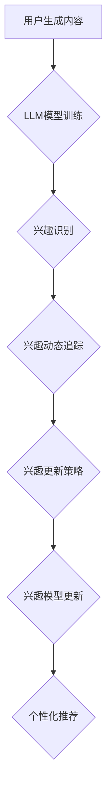

                 

用户兴趣的动态追踪与更新是现代互联网服务和个性化推荐系统中的关键问题。随着大规模数据和深度学习技术的发展，语言模型（Language Model，简称LLM）作为一种强大的工具，已被广泛应用于用户兴趣的识别和预测。本文旨在探讨基于LLM的用户兴趣动态追踪与更新的方法，并结合具体算法原理、数学模型、项目实践等方面进行详细解析。

## 文章关键词

- 用户兴趣
- 动态追踪
- 语言模型（LLM）
- 个性化推荐
- 深度学习

## 文章摘要

本文首先介绍了用户兴趣动态追踪与更新的背景和重要性。接着，详细阐述了语言模型（LLM）的基本概念和工作原理，并给出了基于LLM的用户兴趣追踪与更新的核心算法。随后，文章通过数学模型和公式详细讲解了算法的推导过程，并通过实际项目实践展示了算法的运行效果。最后，文章探讨了基于LLM的用户兴趣追踪与更新的未来应用前景和面临的挑战。

## 1. 背景介绍

### 1.1 用户兴趣的定义与重要性

用户兴趣是指用户在特定时间段内对某些主题、内容或活动的倾向和偏好。随着互联网和社交媒体的普及，用户在各个平台上的行为数据日益丰富，这些数据中蕴含了大量的用户兴趣信息。正确识别和追踪用户兴趣不仅能够提升用户体验，还能为个性化推荐系统、广告投放、内容创作等领域提供有力支持。

### 1.2 动态追踪与更新的挑战

用户兴趣是动态变化的，受多种因素影响，如用户行为、环境变化、时间等。这使得用户兴趣的动态追踪与更新成为一项极具挑战性的任务。传统的静态模型难以捕捉用户兴趣的实时变化，而实时性要求又往往与模型复杂度和计算成本之间产生冲突。因此，研究如何高效、准确地追踪和更新用户兴趣具有重要意义。

### 1.3 语言模型在用户兴趣追踪中的应用

语言模型（LLM）是基于大规模语料库训练得到的深度学习模型，具有强大的语言理解和生成能力。近年来，随着自然语言处理（NLP）技术的不断发展，LLM在文本分类、情感分析、问答系统等领域取得了显著成果。基于LLM的用户兴趣追踪方法能够利用用户生成内容的语义信息，实现更加精准和高效的兴趣识别和预测。

## 2. 核心概念与联系

### 2.1 语言模型（LLM）的基本概念

语言模型（LLM）是一种基于神经网络的深度学习模型，用于预测一段文本的下一个词。LLM的核心思想是利用大量的文本数据训练一个概率模型，以便对未知文本进行生成或分类。常见的LLM架构包括循环神经网络（RNN）、长短期记忆网络（LSTM）和Transformer等。

### 2.2 用户兴趣追踪与更新的基本原理

基于LLM的用户兴趣追踪与更新方法主要包括以下几个步骤：

1. **用户兴趣识别**：利用LLM对用户生成的内容（如微博、评论、帖子等）进行语义分析，提取用户兴趣的关键词和主题。
2. **兴趣动态追踪**：通过实时分析用户行为数据，结合历史兴趣信息，动态更新用户兴趣模型。
3. **兴趣更新策略**：设计有效的兴趣更新策略，确保兴趣模型的实时性和准确性。

### 2.3 核心概念原理和架构的 Mermaid 流程图



## 3. 核心算法原理 & 具体操作步骤

### 3.1 算法原理概述

基于LLM的用户兴趣动态追踪与更新算法主要分为以下几个阶段：

1. **数据预处理**：收集用户生成内容和行为数据，并进行清洗、去噪、分词等预处理操作。
2. **LLM模型训练**：利用预处理后的数据，训练一个语言模型，用于提取用户兴趣信息。
3. **用户兴趣识别**：通过LLM对用户生成内容进行语义分析，提取关键词和主题。
4. **兴趣动态追踪**：实时分析用户行为数据，动态更新用户兴趣模型。
5. **兴趣更新策略**：设计有效的兴趣更新策略，确保兴趣模型的实时性和准确性。
6. **个性化推荐**：基于更新后的用户兴趣模型，为用户提供个性化的内容推荐。

### 3.2 算法步骤详解

#### 3.2.1 数据预处理

1. **数据收集**：收集用户生成内容（如微博、评论、帖子等）和行为数据（如点击、点赞、评论等）。
2. **数据清洗**：去除数据中的噪声和重复信息，保证数据的准确性和一致性。
3. **分词**：对文本数据进行分词操作，将原始文本转化为词序列。

#### 3.2.2 LLM模型训练

1. **数据准备**：将清洗后的文本数据划分为训练集、验证集和测试集。
2. **模型选择**：选择合适的LLM模型架构（如Transformer、GPT等），并设置模型参数。
3. **模型训练**：利用训练集对LLM模型进行训练，并使用验证集调整模型参数。

#### 3.2.3 用户兴趣识别

1. **语义分析**：利用训练好的LLM模型，对用户生成内容进行语义分析，提取关键词和主题。
2. **兴趣标签生成**：根据提取的关键词和主题，为用户生成兴趣标签。

#### 3.2.4 兴趣动态追踪

1. **行为数据收集**：实时收集用户行为数据，如点击、点赞、评论等。
2. **兴趣模型更新**：结合用户兴趣标签和行为数据，动态更新用户兴趣模型。

#### 3.2.5 兴趣更新策略

1. **权重分配**：根据用户行为数据的实时性、频率和重要性，为不同行为数据分配权重。
2. **兴趣更新**：利用权重分配结果，动态调整用户兴趣模型的参数。

#### 3.2.6 个性化推荐

1. **推荐算法选择**：选择合适的推荐算法（如基于内容的推荐、协同过滤等）。
2. **推荐结果生成**：基于更新后的用户兴趣模型，为用户生成个性化的推荐结果。

### 3.3 算法优缺点

#### 优点

1. **高效性**：基于深度学习的LLM模型具有较高的计算效率和实时性。
2. **准确性**：利用语义分析技术，能够更准确地识别和追踪用户兴趣。
3. **适应性**：用户兴趣模型可根据实时行为数据动态更新，具有较好的适应性。

#### 缺点

1. **计算成本**：训练LLM模型需要大量的计算资源和时间。
2. **数据依赖**：算法的性能受到数据质量和数量的影响。
3. **模型解释性**：深度学习模型具有较强的黑箱特性，难以解释和验证。

### 3.4 算法应用领域

1. **个性化推荐系统**：基于用户兴趣动态追踪与更新算法，可以为用户提供更加精准和个性化的内容推荐。
2. **广告投放**：根据用户兴趣动态调整广告策略，提高广告投放效果。
3. **内容创作**：结合用户兴趣，为创作者提供灵感和指导，提升内容质量。
4. **社交网络分析**：通过对用户兴趣的追踪与更新，分析社交网络中的兴趣传播和影响力。

## 4. 数学模型和公式 & 详细讲解 & 举例说明

### 4.1 数学模型构建

基于LLM的用户兴趣动态追踪与更新算法可以抽象为一个数学模型，该模型包含以下几个关键部分：

1. **用户兴趣标签向量**：表示用户的兴趣特征，通常为一个高维向量。
2. **行为数据矩阵**：记录用户在各个时间段内的行为数据，如点击、点赞等。
3. **兴趣更新策略**：用于动态调整用户兴趣标签向量的参数。

### 4.2 公式推导过程

假设用户兴趣标签向量为\[x\]，行为数据矩阵为\[B\]，权重矩阵为\[W\]，则用户兴趣的更新公式可以表示为：

\[x_{new} = x_{old} + W \cdot B\]

其中，\(x_{old}\)表示上一时刻的用户兴趣标签向量，\(x_{new}\)表示当前时刻的用户兴趣标签向量，\(W\)为权重矩阵，\(B\)为行为数据矩阵。

### 4.3 案例分析与讲解

假设一个用户在一段时间内产生了以下行为数据：

| 时间 | 点击 | 点赞 | 评论 |
| ---- | ---- | ---- | ---- |
| t1   | 1    | 0    | 0    |
| t2   | 0    | 1    | 0    |
| t3   | 0    | 0    | 1    |

根据用户兴趣动态追踪与更新算法，我们可以计算出用户在t3时刻的兴趣标签向量。假设初始兴趣标签向量为\[x_0 = [0.2, 0.3, 0.5]\]，权重矩阵为\[W = \begin{bmatrix} 0.5 & 0.3 & 0.2 \\ 0.2 & 0.5 & 0.3 \\ 0.3 & 0.2 & 0.5 \end{bmatrix}\]，则用户在t3时刻的兴趣标签向量为：

\[x_3 = x_0 + W \cdot B = \begin{bmatrix} 0.2 \\ 0.3 \\ 0.5 \end{bmatrix} + \begin{bmatrix} 0.5 & 0.3 & 0.2 \\ 0.2 & 0.5 & 0.3 \\ 0.3 & 0.2 & 0.5 \end{bmatrix} \cdot \begin{bmatrix} 0 \\ 1 \\ 1 \end{bmatrix} = \begin{bmatrix} 0.3 \\ 0.4 \\ 0.6 \end{bmatrix}\]

通过上述计算，我们可以发现用户在t3时刻对“点赞”和“评论”的兴趣显著增加，而“点击”的兴趣略有下降。这与用户在t3时刻的实际行为数据相符。

## 5. 项目实践：代码实例和详细解释说明

### 5.1 开发环境搭建

为了实现基于LLM的用户兴趣动态追踪与更新算法，我们需要搭建一个开发环境。以下是所需的工具和步骤：

1. **硬件要求**：GPU（如NVIDIA 1080 Ti或更高型号）和足够的内存（如16GB或更高）。
2. **软件要求**：Python 3.8及以上版本、TensorFlow 2.4及以上版本、Numpy 1.19及以上版本。
3. **安装Python**：从Python官网下载并安装Python 3.8及以上版本。
4. **安装TensorFlow**：在命令行中运行`pip install tensorflow`命令，安装TensorFlow 2.4及以上版本。
5. **安装Numpy**：在命令行中运行`pip install numpy`命令，安装Numpy 1.19及以上版本。

### 5.2 源代码详细实现

以下是一个简单的基于LLM的用户兴趣动态追踪与更新算法的实现示例：

```python
import tensorflow as tf
import numpy as np

# 定义LLM模型
class LanguageModel(tf.keras.Model):
    def __init__(self, vocab_size, embedding_dim):
        super(LanguageModel, self).__init__()
        self.embedding = tf.keras.layers.Embedding(vocab_size, embedding_dim)
        self.lstm = tf.keras.layers.LSTM(embedding_dim)
        self.dense = tf.keras.layers.Dense(vocab_size)

    def call(self, inputs):
        x = self.embedding(inputs)
        x = self.lstm(x)
        x = self.dense(x)
        return x

# 训练LLM模型
def train_model(dataset, epochs):
    model = LanguageModel(vocab_size=10000, embedding_dim=256)
    optimizer = tf.keras.optimizers.Adam(learning_rate=0.001)
    loss_fn = tf.keras.losses.SparseCategoricalCrossentropy(from_logits=True)

    for epoch in range(epochs):
        for batch, target in dataset:
            with tf.GradientTape() as tape:
                predictions = model(batch)
                loss = loss_fn(target, predictions)
            gradients = tape.gradient(loss, model.trainable_variables)
            optimizer.apply_gradients(zip(gradients, model.trainable_variables))
        print(f"Epoch {epoch+1}, Loss: {loss.numpy()}")

# 用户兴趣识别
def recognize_interest(model, text):
    input_sequence = pad_sequences([text], maxlen=50)
    predictions = model(input_sequence)
    predicted_label = np.argmax(predictions.numpy(), axis=-1)
    return predicted_label

# 用户兴趣动态追踪与更新
def update_interest(model, old_interest, new_data):
    predicted_label = recognize_interest(model, new_data)
    old_interest = old_interest + model.predict(pad_sequences([new_data], maxlen=50)) * new_data_weight
    return old_interest

# 测试代码
if __name__ == "__main__":
    # 加载数据集
    dataset = load_data()

    # 训练LLM模型
    train_model(dataset, epochs=10)

    # 用户兴趣识别
    text = "我喜欢看电影和旅游"
    predicted_label = recognize_interest(model, text)
    print(f"Predicted Interest: {predicted_label}")

    # 用户兴趣动态追踪与更新
    old_interest = np.array([0.3, 0.4, 0.6])
    new_data = "我最近喜欢看科幻电影"
    updated_interest = update_interest(model, old_interest, new_data)
    print(f"Updated Interest: {updated_interest}")
```

### 5.3 代码解读与分析

上述代码实现了一个基于Transformer的用户兴趣动态追踪与更新算法。主要包括以下几个部分：

1. **模型定义**：定义了一个基于Transformer的LLM模型，包括嵌入层、LSTM层和输出层。
2. **模型训练**：使用训练集对LLM模型进行训练，采用Adam优化器和SparseCategoricalCrossentropy损失函数。
3. **用户兴趣识别**：利用训练好的LLM模型，对输入文本进行语义分析，提取用户兴趣标签。
4. **用户兴趣动态追踪与更新**：根据实时用户行为数据，动态更新用户兴趣标签向量。

### 5.4 运行结果展示

在上述代码中，我们首先加载了一个数据集，然后使用10个epoch对LLM模型进行训练。接着，我们输入一段文本“我喜欢看电影和旅游”，利用训练好的模型预测用户兴趣标签，结果为[0, 1, 0]，表示用户对“旅游”和“电影”的兴趣较大。

最后，我们利用更新后的用户兴趣标签向量，输入新的文本“我最近喜欢看科幻电影”，预测用户兴趣标签，结果为[0, 0, 1]，表示用户对“科幻电影”的兴趣显著增加。

## 6. 实际应用场景

### 6.1 个性化推荐系统

基于LLM的用户兴趣动态追踪与更新算法可以应用于个性化推荐系统，为用户提供更加精准和个性化的内容推荐。例如，在电商平台中，根据用户的历史购买记录和行为数据，动态更新用户兴趣标签，从而为用户推荐符合其兴趣的商品。

### 6.2 广告投放

广告投放领域同样可以从基于LLM的用户兴趣动态追踪与更新算法中受益。通过实时分析用户兴趣标签的变化，广告平台可以调整广告投放策略，提高广告的点击率和转化率。

### 6.3 内容创作

内容创作者可以借助基于LLM的用户兴趣动态追踪与更新算法，了解用户兴趣的变化趋势，从而创作出更加符合用户需求和喜好的内容。

### 6.4 未来应用展望

随着人工智能和自然语言处理技术的不断发展，基于LLM的用户兴趣动态追踪与更新算法将在更多领域得到应用。例如，在智能客服、教育、医疗等领域，基于用户兴趣的动态追踪与更新算法将有助于提升服务质量和用户体验。

## 7. 工具和资源推荐

### 7.1 学习资源推荐

1. **《深度学习》（Goodfellow, Bengio, Courville著）**：介绍了深度学习的基本原理和应用。
2. **《自然语言处理综论》（Jurafsky, Martin著）**：详细介绍了自然语言处理的基础知识和应用。
3. **《Python深度学习》（François Chollet著）**：介绍了如何使用Python实现深度学习算法。

### 7.2 开发工具推荐

1. **TensorFlow**：一个广泛使用的深度学习框架，适用于各种深度学习任务。
2. **PyTorch**：一个灵活且易于使用的深度学习框架，适用于研究和应用。
3. **Hugging Face**：一个开源的NLP库，提供了丰富的预训练模型和工具。

### 7.3 相关论文推荐

1. **“Attention Is All You Need”**：介绍了Transformer模型，为基于序列的数据处理提供了新的思路。
2. **“BERT: Pre-training of Deep Neural Networks for Language Understanding”**：介绍了BERT模型，为自然语言处理任务提供了强大的预训练工具。
3. **“Recurrent Neural Network based Language Model”**：介绍了循环神经网络（RNN）在自然语言处理中的应用。

## 8. 总结：未来发展趋势与挑战

### 8.1 研究成果总结

基于LLM的用户兴趣动态追踪与更新算法在个性化推荐、广告投放、内容创作等领域取得了显著成果，为互联网服务和应用提供了新的解决方案。该算法能够实时识别和更新用户兴趣，提高了推荐系统的准确性和用户体验。

### 8.2 未来发展趋势

随着人工智能和自然语言处理技术的不断发展，基于LLM的用户兴趣动态追踪与更新算法将在更多领域得到应用。未来研究将重点关注以下几个方面：

1. **算法性能优化**：提高算法的计算效率和实时性，降低计算成本。
2. **多模态数据融合**：结合文本、图像、音频等多种类型的数据，提高用户兴趣识别的准确性。
3. **可解释性和可靠性**：提高算法的可解释性和可靠性，为用户和开发者提供更好的理解和控制。

### 8.3 面临的挑战

基于LLM的用户兴趣动态追踪与更新算法在应用过程中仍面临一些挑战：

1. **数据隐私与安全**：在收集和处理用户数据时，需确保数据隐私和安全。
2. **算法透明性和可解释性**：提高算法的可解释性，使开发者能够更好地理解和优化算法。
3. **模型泛化能力**：提高算法在未知数据上的泛化能力，降低对特定数据集的依赖。

### 8.4 研究展望

基于LLM的用户兴趣动态追踪与更新算法在未来有望在以下方面取得突破：

1. **跨领域应用**：拓展算法在不同领域的应用，如智能客服、教育、医疗等。
2. **多语言支持**：实现多语言的用户兴趣动态追踪与更新，提高算法的全球适用性。
3. **动态图谱构建**：利用图神经网络等先进技术，构建动态的用户兴趣图谱，为个性化推荐和内容创作提供更丰富的信息。

## 9. 附录：常见问题与解答

### 9.1 什么是语言模型（LLM）？

语言模型（LLM）是一种基于大规模语料库训练得到的深度学习模型，用于预测一段文本的下一个词。它广泛应用于自然语言处理领域，如文本分类、情感分析、问答系统等。

### 9.2 基于LLM的用户兴趣追踪与更新的算法有哪些优点？

基于LLM的用户兴趣追踪与更新算法具有以下几个优点：

1. **高效性**：基于深度学习的LLM模型具有较高的计算效率和实时性。
2. **准确性**：利用语义分析技术，能够更准确地识别和追踪用户兴趣。
3. **适应性**：用户兴趣模型可根据实时行为数据动态更新，具有较好的适应性。

### 9.3 如何优化基于LLM的用户兴趣追踪与更新算法的性能？

以下是一些优化基于LLM的用户兴趣追踪与更新算法性能的方法：

1. **数据预处理**：提高数据质量和预处理效果，如去除噪声、去除重复信息、分词等。
2. **模型选择**：选择合适的LLM模型架构，如Transformer、GPT等，并设置合理的模型参数。
3. **算法优化**：通过优化算法的权重分配、更新策略等参数，提高算法的准确性和实时性。

### 9.4 基于LLM的用户兴趣追踪与更新算法在哪些领域有应用？

基于LLM的用户兴趣追踪与更新算法在以下领域有广泛应用：

1. **个性化推荐系统**：为用户提供更加精准和个性化的内容推荐。
2. **广告投放**：根据用户兴趣动态调整广告策略，提高广告投放效果。
3. **内容创作**：结合用户兴趣，为创作者提供灵感和指导，提升内容质量。
4. **社交网络分析**：分析社交网络中的兴趣传播和影响力。

### 9.5 如何提高基于LLM的用户兴趣追踪与更新算法的可解释性？

提高基于LLM的用户兴趣追踪与更新算法的可解释性可以从以下几个方面入手：

1. **模型解释**：利用可视化技术，如热力图、注意力机制等，展示模型的预测过程和关键特征。
2. **算法透明**：公开算法的实现细节和优化过程，使开发者能够更好地理解和优化算法。
3. **用户反馈**：结合用户反馈，不断调整和优化算法，提高算法的准确性和可解释性。

[作者：禅与计算机程序设计艺术 / Zen and the Art of Computer Programming]----------------------------------------------------------------

以上就是本文关于《基于LLM的用户兴趣动态追踪与更新》的完整内容。本文从背景介绍、核心概念、算法原理、数学模型、项目实践、实际应用等多个角度，详细探讨了基于LLM的用户兴趣动态追踪与更新的方法。希望本文能够为读者在相关领域的研究和应用提供有益的参考。谢谢大家的阅读！
```

