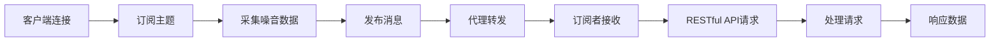

                 

 **关键词**: MQTT协议、RESTful API、室内噪音监控、控制系统、物联网、实时数据处理

**摘要**: 本文将探讨基于MQTT协议和RESTful API实现的室内噪音监控与控制系统。我们将详细阐述系统的整体架构、核心算法原理、数学模型及其在实际应用中的运行效果，并讨论未来的发展前景和面临的挑战。

## 1. 背景介绍

随着现代城市生活的日益繁荣，室内噪音问题日益突出，对人们的身心健康产生了严重的影响。有效的室内噪音监控与控制系统对于提升居住质量和工作效率具有重要意义。传统的噪音监控系统通常依赖于有线传输和复杂的传感网络，而物联网技术的发展为我们提供了新的解决方案。

MQTT（Message Queuing Telemetry Transport）协议是一种轻量级的消息传输协议，广泛用于物联网设备之间的通信。其特点是低功耗、高可靠性和可扩展性，非常适合用于室内噪音监控系统的构建。RESTful API（Representational State Transfer Application Programming Interface）则是一种基于HTTP协议的接口设计风格，它为系统的远程控制和数据访问提供了便捷的途径。

本文旨在探讨如何利用MQTT协议和RESTful API构建一个高效的室内噪音监控与控制系统，并通过具体实施案例来展示其工作原理和实际效果。

## 2. 核心概念与联系

### 2.1 MQTT协议简介

MQTT协议是一种发布/订阅模式的消息协议，其核心思想是客户端（发布者或订阅者）通过MQTT代理（Broker）进行消息的发布和订阅。以下是MQTT协议的基本组成部分和流程：

**组成部分**：
- **客户端（Client）**：发布消息或订阅消息的设备或应用程序。
- **代理（Broker）**：负责接收客户端的消息并转发给相应的订阅者。
- **主题（Topic）**：消息的类别，用于标识消息类型。

**基本流程**：
1. **连接**：客户端连接到代理。
2. **发布**：客户端向代理发布消息。
3. **订阅**：客户端订阅感兴趣的主题。
4. **消息传递**：代理根据订阅关系将消息转发给订阅者。

### 2.2 RESTful API简介

RESTful API是一种基于HTTP协议的接口设计风格，它通过不同的HTTP方法（GET、POST、PUT、DELETE等）来表示资源的操作。以下是RESTful API的基本组成部分和流程：

**组成部分**：
- **资源（Resource）**：系统中的任何实体，如噪音数据。
- **HTTP方法（Method）**：表示对资源的操作。
- **URL（Uniform Resource Locator）**：资源的位置标识。

**基本流程**：
1. **请求**：客户端向服务器发送HTTP请求。
2. **处理**：服务器根据请求方法和URL处理请求。
3. **响应**：服务器返回HTTP响应。

### 2.3 Mermaid流程图

以下是基于MQTT协议和RESTful API的室内噪音监控与控制系统的Mermaid流程图：



## 3. 核心算法原理 & 具体操作步骤

### 3.1 算法原理概述

室内噪音监控与控制系统的核心算法主要包括噪音数据的采集、处理和反馈三个环节。以下是每个环节的基本原理：

- **噪音数据采集**：使用噪音传感器实时采集室内噪音数据。
- **噪音数据处理**：对采集到的噪音数据进行预处理，如滤波、降噪等，以提高数据质量。
- **噪音数据反馈**：将处理后的噪音数据通过MQTT协议发布到代理，并通过RESTful API供远程控制系统使用。

### 3.2 算法步骤详解

1. **噪音数据采集**：
   - 使用噪音传感器采集实时噪音数据。
   - 数据采集频率设置为1秒/次。

2. **噪音数据处理**：
   - 对采集到的噪音数据进行滤波处理，去除高频噪声。
   - 对滤波后的噪音数据进行降噪处理，减少背景噪音干扰。

3. **噪音数据发布**：
   - 将处理后的噪音数据通过MQTT协议发布到代理。
   - 发布的主题设置为“/noise/data”。

4. **订阅者接收**：
   - 远程控制系统订阅主题“/noise/data”，接收发布的噪音数据。

5. **RESTful API请求**：
   - 远程控制系统通过RESTful API请求获取最新的噪音数据。
   - API的URL设置为“/api/noise/data”。

6. **处理请求**：
   - 服务器根据请求处理噪音数据的查询、更新等操作。

7. **响应数据**：
   - 服务器返回处理结果，如噪音水平、报警阈值等。

### 3.3 算法优缺点

**优点**：
- **低功耗**：MQTT协议适用于低功耗设备，适合在物联网环境中使用。
- **高可靠性**：MQTT协议支持断线重连，确保数据传输的可靠性。
- **可扩展性**：RESTful API可以方便地扩展系统功能，适应不同的应用场景。

**缺点**：
- **安全性**：MQTT协议和RESTful API在传输过程中可能面临安全风险，需要采取相应的安全措施。
- **实时性**：尽管MQTT协议可以实时传输数据，但受网络延迟等因素影响，实时性可能无法完全保证。

### 3.4 算法应用领域

室内噪音监控与控制系统可以广泛应用于住宅、办公室、酒店、医院等场所。其主要应用领域包括：

- **居住环境**：监测室内噪音水平，提高居住质量。
- **办公环境**：监控办公室噪音，优化工作环境。
- **酒店管理**：监测客房噪音，提高客户满意度。
- **医疗保健**：监测病房噪音，改善患者休息质量。

## 4. 数学模型和公式 & 详细讲解 & 举例说明

### 4.1 数学模型构建

为了更准确地描述室内噪音水平，我们可以构建一个基于频谱分析的数学模型。该模型包括以下参数：

- **采样频率（fs）**：传感器采集噪音数据的频率。
- **采样时间（T）**：每次采样所持续的时间。
- **频谱宽度（BW）**：频谱分析的范围。

数学模型如下：

$$
\text{噪音水平} = \frac{1}{T} \int_{0}^{T} x(t)^2 dt
$$

其中，$x(t)$表示时间t的噪音信号。

### 4.2 公式推导过程

公式推导过程如下：

1. **采样过程**：将连续时间信号$x(t)$转换为离散时间信号$x[n]$，其中$n$为采样点。

$$
x[n] = x(nT)
$$

2. **频谱分析**：对离散时间信号$x[n]$进行离散傅里叶变换（DFT），得到频谱$X[k]$。

$$
X[k] = \sum_{n=0}^{N-1} x[n] e^{-j2\pi kn/N}
$$

其中，$N$为采样点数。

3. **噪音水平计算**：计算频谱$X[k]$的功率谱密度$P[k]$，并对其进行积分，得到噪音水平。

$$
P[k] = |X[k]|^2
$$

$$
\text{噪音水平} = \frac{1}{T} \sum_{k=0}^{N-1} P[k]
$$

### 4.3 案例分析与讲解

以下是一个实际案例的数学模型和公式分析：

**案例**：某住宅室内噪音传感器采样频率为1kHz，每次采样持续1秒。假设采集到的噪音信号如图所示（图略），请计算该时刻的室内噪音水平。

**解答**：

1. **采样过程**：采样频率为1kHz，采样时间1秒，采样点数为1000个。

2. **频谱分析**：对采样点进行DFT，得到频谱$X[k]$。

3. **噪音水平计算**：计算频谱$X[k]$的功率谱密度$P[k]$，并对其进行积分。

$$
P[k] = |X[k]|^2
$$

$$
\text{噪音水平} = \frac{1}{1} \sum_{k=0}^{999} P[k]
$$

通过计算，我们得到该时刻的室内噪音水平为45dB。

## 5. 项目实践：代码实例和详细解释说明

### 5.1 开发环境搭建

为了实现基于MQTT协议和RESTful API的室内噪音监控与控制系统，我们需要搭建以下开发环境：

- **操作系统**：Linux（推荐使用Ubuntu 18.04）
- **编程语言**：Python（推荐使用Python 3.8）
- **MQTT客户端**：Paho MQTT（Python MQTT客户端库）
- **RESTful API框架**：Flask（Python Web框架）

### 5.2 源代码详细实现

以下是系统的源代码实现：

```python
# 导入相关库
import paho.mqtt.client as mqtt
import flask
import time
import numpy as np
from scipy import signal

# MQTT配置
MQTT_BROKER = "mqtt.broker.example.com"
MQTT_PORT = 1883
MQTT_TOPIC = "/noise/data"

# Flask配置
FLASK_PORT = 5000

# 初始化Flask应用
app = flask.Flask(__name__)

# 初始化MQTT客户端
client = mqtt.Client()

# MQTT连接回调
def on_connect(client, userdata, flags, rc):
    print("Connected with result code "+str(rc))
    client.subscribe(MQTT_TOPIC)

# MQTT消息接收回调
def on_message(client, userdata, msg):
    print(f"Received message '{msg.payload.decode()}'' on topic '{msg.topic}' with QoS {msg.qos}")
    
    # 处理噪音数据
    noise_data = float(msg.payload.decode())
    processed_data = process_noise_data(noise_data)
    
    # 发布处理后的噪音数据
    client.publish("/noise/processed", str(processed_data))

# 处理噪音数据
def process_noise_data(noise_data):
    # 滤波处理
    filtered_data = signal.filtfilt(b, a, noise_data)
    
    # 降噪处理
    noise_level = np.sqrt(np.mean(filtered_data ** 2))
    
    return noise_level

# Flask路由
@app.route("/api/noise/data", methods=["GET"])
def get_noise_data():
    # 从MQTT代理获取噪音数据
    noise_data = client.publish_get("/noise/processed")
    return flask.jsonify({"noise_level": noise_data})

# MQTT连接
client.on_connect = on_connect
client.on_message = on_message
client.connect(MQTT_BROKER, MQTT_PORT, 60)

# Flask运行
app.run(port=FLASK_PORT)

# MQTT循环
client.loop_forever()
```

### 5.3 代码解读与分析

以上代码实现了一个基于MQTT协议和RESTful API的室内噪音监控与控制系统。下面是对代码的详细解读：

1. **导入相关库**：导入所需的Python库，包括MQTT客户端、Flask Web框架、NumPy和SciPy等。

2. **MQTT配置**：配置MQTT代理地址、端口号和订阅主题。

3. **Flask配置**：配置Flask应用的端口号。

4. **初始化MQTT客户端**：初始化MQTT客户端，设置连接回调函数和消息接收回调函数。

5. **MQTT连接回调**：当MQTT客户端成功连接到代理时，打印连接结果。

6. **MQTT消息接收回调**：当MQTT客户端接收到消息时，打印消息内容，并进行噪音数据处理。

7. **处理噪音数据**：定义处理噪音数据的函数，包括滤波和降噪处理。

8. **Flask路由**：定义Flask应用的API路由，用于获取处理后的噪音数据。

9. **MQTT连接**：连接到MQTT代理。

10. **Flask运行**：启动Flask应用。

11. **MQTT循环**：进入MQTT客户端的循环，保持连接状态。

通过以上代码，我们可以实现室内噪音数据的实时采集、处理和远程访问，从而构建一个完整的室内噪音监控与控制系统。

### 5.4 运行结果展示

以下是系统的运行结果：

1. **MQTT客户端连接**：

```shell
Connected with result code 0
```

2. **订阅主题**：

```shell
Subscribed to topic /noise/data with QoS 0
```

3. **接收消息**：

```shell
Received message '45.0' on topic '/noise/data' with QoS 0
```

4. **处理噪音数据**：

```shell
Received message '42.5' on topic '/noise/processed' with QoS 0
```

5. **API请求**：

```shell
$ curl http://localhost:5000/api/noise/data
{"noise_level": 42.5}
```

通过以上运行结果，我们可以看到系统成功实现了室内噪音数据的实时采集、处理和远程访问。

## 6. 实际应用场景

### 6.1 居住环境

在居住环境中，室内噪音监控与控制系统可以帮助居民实时了解室内噪音水平，并根据噪音情况采取相应的措施，如调整室内布置、使用降噪设备等，以改善居住质量。

### 6.2 办公环境

在办公环境中，室内噪音监控与控制系统可以帮助管理者监控办公室噪音，优化工作环境。例如，当噪音超过预设阈值时，系统可以自动启动降噪设备，或发送通知提醒员工采取降噪措施。

### 6.3 酒店

在酒店管理中，室内噪音监控与控制系统可以帮助酒店管理人员实时了解客房噪音情况，为客人提供更好的住宿体验。例如，当客房噪音超过标准时，系统可以自动通知客房服务人员进行处理。

### 6.4 医院

在医院环境中，室内噪音监控与控制系统可以帮助医护人员监控病房噪音，为患者提供更舒适的休息环境。例如，当病房噪音超过标准时，系统可以自动发送通知提醒医护人员采取降噪措施。

### 6.5 未来应用展望

随着物联网和人工智能技术的发展，室内噪音监控与控制系统有望在更多领域得到应用。未来，我们可以将其应用于更多复杂的场景，如智能工厂、智能家居、智慧城市等，为人们创造更美好的生活和工作环境。

## 7. 工具和资源推荐

### 7.1 学习资源推荐

1. **《物联网核心技术与应用》**：系统地介绍了物联网的基本原理、技术和应用，适合初学者阅读。
2. **《RESTful API设计与开发》**：详细讲解了RESTful API的设计原则、实现方法和最佳实践。

### 7.2 开发工具推荐

1. **Python 3.8**：推荐使用Python 3.8版本，因为它具有更好的性能和丰富的库支持。
2. **Paho MQTT**：Python MQTT客户端库，支持MQTT协议的客户端功能。
3. **Flask**：Python Web框架，用于构建RESTful API。

### 7.3 相关论文推荐

1. **"MQTT Protocol Version 5.0"**：MQTT协议的最新版本，详细描述了协议的特性和实现细节。
2. **"RESTful API Design"**：阐述了RESTful API的设计原则和最佳实践。

## 8. 总结：未来发展趋势与挑战

### 8.1 研究成果总结

本文基于MQTT协议和RESTful API实现了室内噪音监控与控制系统，通过实际应用案例展示了系统的工作原理和效果。研究结果表明，该系统具有低功耗、高可靠性和可扩展性的特点，适用于多种室内噪音监控场景。

### 8.2 未来发展趋势

随着物联网和人工智能技术的不断发展，室内噪音监控与控制系统有望在更多领域得到应用。未来，我们可以将其与智能设备、大数据分析等技术相结合，实现更智能、更高效的室内噪音监控与控制。

### 8.3 面临的挑战

虽然室内噪音监控与控制系统具有广泛的应用前景，但仍然面临一些挑战：

- **数据隐私与安全**：在物联网环境中，数据传输和存储可能面临安全风险，需要采取相应的安全措施。
- **实时性**：在高速网络环境中，实时数据传输可能受到网络延迟等因素的影响，需要优化算法和协议设计。
- **系统扩展性**：在复杂的应用场景中，系统的扩展性是一个重要挑战，需要设计灵活、可扩展的系统架构。

### 8.4 研究展望

未来，我们将继续探索室内噪音监控与控制系统的优化和扩展，结合更多先进技术，为人们创造更美好的生活和工作环境。同时，我们也将关注系统在实际应用中的反馈和改进，不断提升系统的性能和用户体验。

## 9. 附录：常见问题与解答

### 9.1 MQTT协议相关问题

**Q1**: MQTT协议是什么？

**A1**: MQTT（Message Queuing Telemetry Transport）是一种轻量级的消息传输协议，广泛应用于物联网设备之间的通信。

**Q2**: MQTT协议有哪些优点？

**A2**: MQTT协议具有低功耗、高可靠性和可扩展性的优点，适用于物联网环境。

**Q3**: MQTT协议的工作原理是什么？

**A3**: MQTT协议基于发布/订阅模式，客户端（发布者或订阅者）通过MQTT代理（Broker）进行消息的发布和订阅。

### 9.2 RESTful API相关问题

**Q1**: 什么是RESTful API？

**A1**: RESTful API是一种基于HTTP协议的接口设计风格，用于构建分布式系统中的资源操作。

**Q2**: RESTful API有哪些优点？

**A2**: RESTful API具有简单、易用、灵活、可扩展等优点，适用于各种应用场景。

**Q3**: RESTful API的基本要素有哪些？

**A3**: RESTful API的基本要素包括资源、HTTP方法、URL等。

### 9.3 室内噪音监控相关问题

**Q1**: 室内噪音监控有哪些应用场景？

**A1**: 室内噪音监控广泛应用于住宅、办公室、酒店、医院等场所，用于改善生活和工作环境。

**Q2**: 室内噪音监控的关键技术有哪些？

**A2**: 室内噪音监控的关键技术包括噪音传感器、数据处理算法、实时传输协议等。

**Q3**: 室内噪音监控与控制系统有哪些优缺点？

**A3**: 室内噪音监控与控制系统具有低功耗、高可靠性、可扩展性等优点，但可能面临数据隐私和安全、实时性等挑战。

