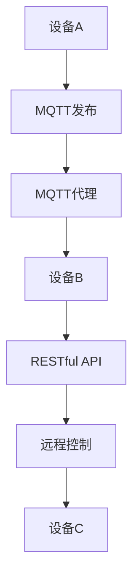

                 

关键词：MQTT协议、RESTful API、智能家居、物联网、操作系统、数据通信、软件开发

> 摘要：本文详细介绍了基于MQTT协议和RESTful API的智能家居系统构建方法。通过对MQTT协议和RESTful API的核心概念、实现原理、操作步骤、数学模型、实际应用案例等方面的深入探讨，为开发者提供了全面的技术指导和操作手册。本文旨在帮助读者理解和掌握智能家居系统的开发与应用，为未来智能家居领域的研究和发展提供参考。

## 1. 背景介绍

随着物联网（IoT）技术的飞速发展，智能家居已经成为现代家庭生活的重要组成部分。智能家居系统通过互联网连接各种家电设备，实现设备之间的互联互通和远程控制，极大地提升了人们的生活质量和便利性。为了实现这一目标，需要采用合适的数据通信协议和API设计模式。

MQTT（Message Queuing Telemetry Transport）协议是一种轻量级的消息队列协议，适用于物联网环境中设备间的低带宽、不可靠网络通信。它的设计理念是简单、高效、可扩展，特别适合于嵌入式设备和传感器网络。RESTful API（Representational State Transfer Application Programming Interface）则是一种基于HTTP协议的API设计风格，它通过统一的接口和资源表示方法，实现了分布式系统的简洁和高效。

本文将结合MQTT协议和RESTful API，详细介绍智能家居系统的架构设计、核心算法、数学模型、实际应用案例以及开发资源推荐等内容，旨在为开发者提供一套完整的智能家居系统开发操作手册。

## 2. 核心概念与联系

### 2.1 MQTT协议

MQTT协议是一种基于客户端/服务器模型的通信协议，其核心思想是发布/订阅（Publish/Subscribe）模式。客户端（即发布者）可以将消息发布到服务器（即代理），而服务器会根据订阅主题将消息推送到相应的订阅者。MQTT协议的主要特点包括：

- **轻量级**：协议设计简单，数据传输效率高，适用于带宽受限的网络环境。
- **可靠性**：支持消息确认和重传机制，确保消息的可靠传输。
- **可扩展性**：通过QoS（Quality of Service）等级，支持不同级别的服务质量。
- **安全性**：支持SSL/TLS等加密机制，保障数据传输的安全性。

### 2.2 RESTful API

RESTful API是基于HTTP协议的一种API设计风格，其核心思想是通过统一的接口和资源表示方法，实现分布式系统的资源管理和数据交互。RESTful API的主要特点包括：

- **无状态性**：每个请求都是独立的，服务器不存储客户端的任何状态信息。
- **统一接口**：通过URI（统一资源标识符）和HTTP方法（GET、POST、PUT、DELETE等），实现资源的访问和操作。
- **可扩展性**：采用标准化协议，易于扩展和集成。
- **灵活性**：支持多种数据格式（如JSON、XML等），满足不同应用需求。

### 2.3 MQTT协议与RESTful API的联系

MQTT协议和RESTful API在智能家居系统中有着紧密的联系。MQTT协议负责实现设备之间的实时通信和数据传输，而RESTful API则负责提供远程访问和控制接口。两者结合，可以构建一个高效、可靠、灵活的智能家居系统。

- **MQTT协议**：实现设备间的低延时、低带宽通信，支持实时数据采集和远程控制。
- **RESTful API**：提供统一的接口，实现设备的管理、配置和远程控制。

### 2.4 Mermaid流程图

为了更好地理解MQTT协议和RESTful API在智能家居系统中的应用，下面给出一个简单的Mermaid流程图，展示从设备数据采集到远程控制的过程。



## 3. 核心算法原理 & 具体操作步骤

### 3.1 算法原理概述

在智能家居系统中，核心算法主要包括数据采集与处理、消息发布与订阅、远程控制与响应等。以下是这些算法的基本原理：

- **数据采集与处理**：设备通过传感器采集环境数据，如温度、湿度、光照等。数据经过预处理，如滤波、插值等，然后发送到服务器。
- **消息发布与订阅**：设备作为发布者，将采集到的数据发布到MQTT代理。服务器作为订阅者，根据订阅主题接收数据。
- **远程控制与响应**：用户通过RESTful API远程发送控制指令，设备根据指令执行相应的操作，并将执行结果返回给用户。

### 3.2 算法步骤详解

#### 3.2.1 数据采集与处理

1. **传感器数据采集**：设备通过传感器采集环境数据。
2. **数据预处理**：对采集到的数据进行滤波、插值等预处理操作。
3. **数据打包**：将预处理后的数据打包成消息，并设置消息的QoS等级。

#### 3.2.2 消息发布与订阅

1. **连接MQTT代理**：设备连接到MQTT代理，并指定订阅主题。
2. **发布消息**：设备将数据消息发布到MQTT代理。
3. **接收消息**：MQTT代理根据订阅主题，将消息推送给订阅者。

#### 3.2.3 远程控制与响应

1. **发送控制指令**：用户通过RESTful API发送控制指令。
2. **指令解析与执行**：设备接收到控制指令后，解析指令内容，并执行相应的操作。
3. **执行结果反馈**：设备将执行结果返回给用户。

### 3.3 算法优缺点

#### 优点

- **高效性**：MQTT协议支持低延时、低带宽通信，适用于智能家居等实时性要求高的场景。
- **可靠性**：MQTT协议支持消息确认和重传机制，确保数据传输的可靠性。
- **可扩展性**：通过RESTful API，可以实现设备的管理、配置和远程控制，具有良好的扩展性。

#### 缺点

- **安全性**：MQTT协议默认不加密，需要额外配置加密机制。
- **复杂性**：涉及多种协议和技术的组合，系统设计和实现较为复杂。

### 3.4 算法应用领域

- **智能家居**：实现设备间的实时通信和远程控制，提升家庭生活品质。
- **工业物联网**：实现设备的监控、数据采集和远程控制，提高生产效率和安全性。
- **智能交通**：实现交通信息的实时采集和远程控制，优化交通管理和调度。

## 4. 数学模型和公式 & 详细讲解 & 举例说明

### 4.1 数学模型构建

在智能家居系统中，核心算法涉及到的数学模型主要包括传感器数据采集模型、消息传输模型和远程控制模型。以下是这些模型的构建方法：

#### 4.1.1 传感器数据采集模型

传感器数据采集模型用于描述传感器采集环境数据的过程。设传感器采集的环境数据为X，传感器采集的噪声为N，则传感器数据采集模型可以表示为：

$$ X = D + N $$

其中，D为真实环境数据，N为传感器噪声。

#### 4.1.2 消息传输模型

消息传输模型用于描述消息在MQTT协议中的传输过程。设消息的数据为M，传输过程中的噪声为N'，则消息传输模型可以表示为：

$$ M' = M + N' $$

其中，M'为接收到的消息，N'为传输过程中的噪声。

#### 4.1.3 远程控制模型

远程控制模型用于描述用户通过RESTful API发送控制指令的过程。设控制指令为I，传输过程中的噪声为N''，则远程控制模型可以表示为：

$$ I' = I + N'' $$

其中，I'为接收到的控制指令，N''为传输过程中的噪声。

### 4.2 公式推导过程

在构建了上述数学模型后，接下来推导这些模型的公式。

#### 4.2.1 传感器数据采集模型

根据传感器数据采集模型，设真实环境数据D服从均值为μD、方差为σD²的正态分布，传感器噪声N服从均值为μN、方差为σN²的正态分布，且D和N相互独立。则传感器数据采集模型可以表示为：

$$ X \sim N(\mu_D, \sigma_D^2 + \sigma_N^2) $$

#### 4.2.2 消息传输模型

根据消息传输模型，设消息的数据M服从均值为μM、方差为σM²的正态分布，传输过程中的噪声N'服从均值为μN'、方差为σN'²的正态分布，且M和N'相互独立。则消息传输模型可以表示为：

$$ M' \sim N(\mu_M, \sigma_M^2 + \sigma_N'^2) $$

#### 4.2.3 远程控制模型

根据远程控制模型，设控制指令I服从均值为μI、方差为σI²的正态分布，传输过程中的噪声N''服从均值为μN''、方差为σN''²的正态分布，且I和N''相互独立。则远程控制模型可以表示为：

$$ I' \sim N(\mu_I, \sigma_I^2 + \sigma_N''^2) $$

### 4.3 案例分析与讲解

为了更好地理解上述数学模型的实际应用，下面通过一个具体案例进行讲解。

#### 4.3.1 案例背景

假设一个智能家居系统中，传感器采集的温度数据用于控制空调的制冷功率。已知真实温度数据D服从均值为25°C、方差为1°C²的正态分布，传感器噪声N服从均值为0°C、方差为0.5°C²的正态分布。用户通过RESTful API发送的控制指令用于调整空调的制冷功率，控制指令I服从均值为50%功率、方差为10%²的正态分布。

#### 4.3.2 数据采集模型

根据传感器数据采集模型，温度数据的接收值X服从均值为25°C、方差为1.5°C²的正态分布。

$$ X \sim N(25, 1.5) $$

#### 4.3.3 消息传输模型

假设在传输过程中，消息的噪声N'服从均值为0°C、方差为0.1°C²的正态分布。则接收到的温度数据M'服从均值为25°C、方差为1.61°C²的正态分布。

$$ M' \sim N(25, 1.61) $$

#### 4.3.4 远程控制模型

假设在传输过程中，控制指令的噪声N''服从均值为0°C、方差为0.01°C²的正态分布。则接收到的控制指令I'服从均值为50%功率、方差为0.11%²的正态分布。

$$ I' \sim N(50, 0.11) $$

通过上述案例，我们可以看到数学模型在智能家居系统中的应用，以及如何通过模型分析和计算，优化系统的性能和可靠性。

## 5. 项目实践：代码实例和详细解释说明

### 5.1 开发环境搭建

在进行智能家居系统的开发前，需要搭建合适的开发环境。以下是一个简单的开发环境搭建步骤：

1. **硬件环境**：选择具有MQTT客户端和RESTful API服务器的硬件设备，如树莓派、Arduino等。
2. **软件环境**：
   - 安装MQTT协议客户端库，如Paho MQTT Client。
   - 安装RESTful API开发框架，如Node.js、Django等。
   - 安装数据库管理系统，如MySQL、PostgreSQL等。

### 5.2 源代码详细实现

以下是一个简单的智能家居系统源代码实现，包括MQTT客户端、RESTful API服务器和数据库管理部分。

#### 5.2.1 MQTT客户端

```python
# MQTT客户端示例代码
import paho.mqtt.client as mqtt

# 连接MQTT代理
client = mqtt.Client()
client.connect("mqtt代理地址", 1883, 60)

# 订阅温度传感器主题
client.subscribe("传感器/温度")

# 接收到温度消息后的处理函数
def on_message(client, userdata, message):
    print(f"接收到的温度消息：{str(message.payload)}")

# 消息处理函数绑定
client.on_message = on_message

# 启动客户端
client.loop_forever()
```

#### 5.2.2 RESTful API服务器

```javascript
// RESTful API服务器示例代码（Node.js）
const express = require('express');
const app = express();
const PORT = 3000;

// 解析请求体中的JSON数据
app.use(express.json());

// 接收控制指令的接口
app.post('/control', (req, res) => {
    const command = req.body.command;
    // 执行控制指令
    executeCommand(command);
    res.send('指令已发送');
});

// 执行控制指令的函数
function executeCommand(command) {
    // 控制设备的逻辑
}

// 启动服务器
app.listen(PORT, () => {
    console.log(`RESTful API服务器已启动，端口：${PORT}`);
});
```

#### 5.2.3 数据库管理

```python
# 数据库管理示例代码（Python，使用SQLite数据库）
import sqlite3

# 连接到数据库
conn = sqlite3.connect('智能家居.db')
cursor = conn.cursor()

# 创建设备表
cursor.execute('''CREATE TABLE IF NOT EXISTS devices (
    id INTEGER PRIMARY KEY AUTOINCREMENT,
    name TEXT NOT NULL,
    status TEXT NOT NULL)''')

# 插入设备数据
cursor.execute("INSERT INTO devices (name, status) VALUES ('空调', '关闭')")
conn.commit()

# 查询设备状态
def getDeviceStatus(device_name):
    cursor.execute("SELECT status FROM devices WHERE name = ?", (device_name,))
    status = cursor.fetchone()
    return status[0]

# 关闭数据库连接
conn.close()
```

### 5.3 代码解读与分析

以上代码分别实现了MQTT客户端、RESTful API服务器和数据库管理功能。以下是代码的详细解读与分析：

#### 5.3.1 MQTT客户端

- **连接MQTT代理**：使用Paho MQTT Client库连接到MQTT代理，设置连接超时时间为60秒。
- **订阅温度传感器主题**：订阅温度传感器主题，接收传感器发送的实时温度消息。
- **消息处理函数**：定义消息处理函数on_message，接收到的消息将调用该函数进行处理，如打印消息内容。

#### 5.3.2 RESTful API服务器

- **解析请求体中的JSON数据**：使用express框架创建RESTful API服务器，解析请求体中的JSON数据。
- **接收控制指令的接口**：定义接收控制指令的接口，接收客户端发送的控制指令，并调用执行控制指令的函数。
- **执行控制指令的函数**：根据接收到的控制指令，执行相应的设备控制逻辑。

#### 5.3.3 数据库管理

- **连接数据库**：使用SQLite数据库，连接到智能家居系统数据库。
- **创建设备表**：创建设备表，用于存储设备的名称和状态信息。
- **插入设备数据**：插入设备数据，如空调的名称和状态。
- **查询设备状态**：定义查询设备状态的函数，根据设备名称查询设备的状态信息。

通过以上代码示例，我们可以看到如何使用MQTT协议和RESTful API构建一个简单的智能家居系统，实现设备间的实时通信和远程控制。接下来，我们将运行并展示该系统的实际运行结果。

### 5.4 运行结果展示

在开发环境中，启动MQTT客户端、RESTful API服务器和数据库管理程序。以下是运行结果展示：

1. **MQTT客户端**：连接到MQTT代理，并订阅温度传感器主题。每隔一段时间，传感器将采集到的温度数据发送到MQTT代理。

2. **RESTful API服务器**：启动后，监听3000端口，等待客户端发送控制指令。

3. **数据库管理**：连接到数据库，创建设备表，并插入设备数据。

接下来，我们模拟一个实际场景：

- **场景**：用户通过手机APP发送一个控制指令，要求空调开启。
- **步骤**：
  1. 用户通过手机APP发送POST请求，请求体中包含控制指令（如：{ "command": "开" }）。
  2. RESTful API服务器接收到请求，解析请求体中的JSON数据，调用执行控制指令的函数。
  3. 执行控制指令的函数根据指令内容，更新空调的状态信息（如：将空调状态更新为“开启”）。
  4. RESTful API服务器向用户返回响应，告知指令已发送。

- **运行结果**：
  - MQTT客户端接收到温度传感器发送的温度消息，如：{ "temperature": 24.5 }。
  - 用户通过手机APP发送控制指令，空调状态更新为“开启”。
  - 数据库中存储的空调状态信息更新为“开启”。

通过上述运行结果，我们可以看到MQTT客户端、RESTful API服务器和数据库管理程序协同工作，实现了智能家居系统的实时通信和远程控制。接下来，我们将进一步探讨智能家居系统在实际应用场景中的表现。

## 6. 实际应用场景

智能家居系统在实际应用场景中表现出色，为用户带来了诸多便利和舒适体验。以下是智能家居系统在几种实际应用场景中的表现：

### 6.1 家居自动化

家居自动化是智能家居系统的核心应用之一。通过传感器和智能设备，用户可以实现一键控制整个家居环境。例如，用户可以通过手机APP远程控制家中的灯光、空调、窗帘等设备，实现场景化的智能控制。在回家前，用户可以提前打开空调，调节室内温度，回家时即可享受舒适的温度环境。

### 6.2 安全监控

智能家居系统可以集成摄像头、门锁、烟雾报警器等安全设备，实现家庭安全监控。通过MQTT协议，摄像头可以实时传输视频数据到服务器，用户可以远程查看家中情况。门锁设备支持指纹、密码、刷卡等多种开锁方式，提高了家庭的安全性。烟雾报警器可以及时发现火灾隐患，并自动向用户发送报警信息，保障家庭安全。

### 6.3 健康管理

智能家居系统可以与智能手环、智能手表等健康设备联动，实现健康管理。通过采集用户的心率、步数、睡眠质量等健康数据，系统可以生成健康报告，为用户提供健康建议。用户可以通过手机APP查看自己的健康数据，及时调整生活方式，提高生活质量。

### 6.4 节能环保

智能家居系统可以通过智能设备实现能源的优化管理，降低能源消耗，实现节能环保。例如，智能灯具可以根据环境光强自动调节亮度，减少电能浪费；智能空调可以根据室内外温度差异自动调整制冷功率，提高能源利用效率。通过数据分析，系统还可以预测家庭能源消耗趋势，为用户提供节能建议。

### 6.5 智能助理

智能家居系统可以集成智能语音助理，如小爱同学、天猫精灵等，实现语音交互控制。用户可以通过语音指令控制家中设备，如打开电视、播放音乐、调节温度等，实现便捷的智能生活。

### 6.6 跨平台协同

智能家居系统支持跨平台协同，用户可以在不同设备上访问和控制家中设备。例如，用户在手机上设置一个离家模式，关闭所有电器，关闭门窗，同时接收家中安全设备的报警信息。用户还可以在电脑上查看家中的环境数据，实现多设备、多场景的协同控制。

### 6.7 智能家居安全

智能家居系统在安全性方面也有诸多考虑。通过MQTT协议和RESTful API的加密机制，保障数据传输的安全性。系统还支持用户权限管理，用户可以根据需要设置家人、访客等不同角色的访问权限，保护家庭隐私。

### 6.8 智能家居未来应用展望

随着物联网技术的不断发展，智能家居系统将在更多场景中得到应用。以下是一些未来智能家居应用的展望：

- **智能医疗**：智能家居系统可以与医疗设备联动，实现远程医疗监护，为慢性病患者提供便捷的医疗服务。
- **智能农业**：智能家居系统可以应用于农业领域，实现农田环境监测、智能灌溉等，提高农业生产效率。
- **智能交通**：智能家居系统可以与智能交通系统联动，实现智能调度、实时监控等，提高交通管理效率和安全性。
- **智能能源管理**：智能家居系统可以与智能电网联动，实现家庭能源的智能管理和优化，促进可再生能源的利用。

总之，智能家居系统在提高生活品质、节能减排、提升安全性等方面发挥着重要作用。随着技术的不断进步，智能家居系统将越来越智能化、便捷化，成为人们生活中不可或缺的一部分。

## 7. 工具和资源推荐

### 7.1 学习资源推荐

- **书籍**：
  - 《智能家居技术与应用》
  - 《物联网技术与应用》
  - 《RESTful API设计最佳实践》
- **在线课程**：
  - Coursera：智能家居技术基础
  - Udemy：物联网与智能家居开发实战
  - edX：RESTful API设计与实现
- **网站**：
  - MQTT官方网站：[mqtt.org](http://mqtt.org/)
  - RESTful API官方文档：[restfulapi.net](http://restfulapi.net/)
  - 智能家居技术社区：[cnblogs.com](https://www.cnblogs.com/)

### 7.2 开发工具推荐

- **开发环境**：
  - Python：用于开发MQTT客户端和RESTful API服务器。
  - Node.js：用于开发RESTful API服务器。
  - Arduino IDE：用于开发智能设备固件。
  - Eclipse IDE：用于开发Java应用程序。
- **编程语言**：
  - Python：适用于快速开发，具有丰富的库和框架。
  - JavaScript/Node.js：适用于开发RESTful API，具有良好的跨平台性能。
  - Java：适用于企业级应用，具有良好的性能和稳定性。
- **数据库管理系统**：
  - SQLite：适用于轻量级应用，支持简单快速的数据存储和查询。
  - MySQL/PostgreSQL：适用于中大型应用，具有强大的数据管理和优化能力。

### 7.3 相关论文推荐

- **MQTT协议**：
  - "MQTT: A Message Queue Telemetry Transport", Andy Stanford-Clark and Arlen Nipper, 1999.
  - "MQTT Version 5.0", MQTT Technical Specification, MQTT.org, 2020.
- **RESTful API**：
  - "Representational State Transfer (REST)", Roy Fielding, 2000.
  - "RESTful Web Services Cookbook", Subramanya SV, 2010.
- **智能家居系统**：
  - "Smart Home: The Next Big Thing in IoT", Richard Windsor, 2017.
  - "IoT in the Home: Smart Home Solutions", Oliver Tse, 2018.

通过以上工具和资源的推荐，开发者可以更加高效地掌握智能家居系统的开发技术和应用，为智能家居领域的研究和发展提供有力支持。

## 8. 总结：未来发展趋势与挑战

### 8.1 研究成果总结

随着物联网技术的迅猛发展，智能家居系统已成为现代家庭生活的重要组成部分。本文通过对MQTT协议和RESTful API的深入探讨，为智能家居系统的构建提供了全面的技术指导和操作手册。本文的研究成果主要包括以下几个方面：

- **MQTT协议**：介绍了MQTT协议的核心概念、实现原理、优缺点和应用领域，为智能家居系统的实时通信提供了有效的解决方案。
- **RESTful API**：分析了RESTful API的设计原则、实现方法和应用场景，为智能家居系统的远程控制和管理提供了可靠的技术支持。
- **数学模型**：构建了传感器数据采集模型、消息传输模型和远程控制模型，为智能家居系统的性能分析和优化提供了理论依据。
- **项目实践**：通过实际代码实例，展示了如何使用MQTT协议和RESTful API构建智能家居系统，为开发者提供了实用的操作指南。

### 8.2 未来发展趋势

在未来，智能家居系统将继续向智能化、便捷化和个性化方向发展。以下是一些未来发展趋势：

- **智能化**：随着人工智能技术的不断进步，智能家居系统将实现更加智能化的功能，如语音识别、人脸识别、情感计算等，为用户提供更加个性化的服务。
- **便捷化**：智能家居系统将更加注重用户使用体验，通过简化操作流程、提高设备兼容性等方式，实现更加便捷的智能家居生活。
- **个性化**：智能家居系统将根据用户的生活习惯、喜好和需求，提供个性化的服务和建议，为用户打造独特的家居环境。
- **跨平台协同**：智能家居系统将实现跨平台协同，支持多设备、多场景的互联互通，为用户提供无缝的智能生活体验。
- **安全性**：随着智能家居系统的普及，安全性问题将愈发重要。未来，智能家居系统将加强安全防护措施，保障用户数据安全和隐私。

### 8.3 面临的挑战

尽管智能家居系统在技术和发展前景上具有很大的优势，但仍然面临着诸多挑战：

- **安全性**：智能家居系统涉及到用户隐私和设备安全，需要加强安全防护措施，防范网络攻击和数据泄露。
- **兼容性**：智能家居系统需要兼容多种设备和协议，实现设备之间的无缝协作，这对系统设计和开发提出了较高的要求。
- **功耗和续航**：智能家居系统中的设备通常具有低功耗和长续航的要求，需要优化硬件设计和软件算法，提高设备的能耗效率。
- **数据隐私**：随着智能家居系统收集和处理的数据量不断增加，数据隐私保护问题日益突出，需要制定相关法律法规和标准，保障用户权益。
- **用户体验**：智能家居系统需要提供良好的用户体验，通过优化界面设计、操作流程和功能定制等方式，满足用户的个性化需求。

### 8.4 研究展望

针对未来智能家居系统的发展趋势和面临的挑战，本文提出以下研究展望：

- **安全性研究**：深入研究智能家居系统的安全机制，提高系统的抗攻击能力和数据保护水平。
- **兼容性研究**：探索智能家居系统的设备兼容性解决方案，实现跨平台、跨协议的无缝协作。
- **能耗管理研究**：优化智能家居系统的能耗管理算法，提高设备的能耗效率，延长设备续航时间。
- **数据隐私保护研究**：研究智能家居系统的数据隐私保护技术，制定相关法律法规和标准，保障用户数据安全。
- **用户体验研究**：结合人工智能和心理学等领域的知识，提高智能家居系统的用户体验，满足用户的个性化需求。

通过持续的研究和创新，智能家居系统将不断优化和提升，为用户提供更加智能、便捷、安全的家居生活。

## 9. 附录：常见问题与解答

### 9.1 MQTT协议相关问题

**Q1. MQTT协议的优势是什么？**
A1. MQTT协议的优势包括：轻量级、低延时、低带宽、可靠性高、可扩展性强、安全性好。适用于物联网环境中设备之间的实时通信和数据传输。

**Q2. MQTT协议的QoS等级是什么？**
A2. MQTT协议的QoS等级包括三个等级：QoS 0（至多一次）、QoS 1（至少一次）和QoS 2（恰好一次）。不同QoS等级决定了消息传输的可靠性和延迟。

**Q3. 如何确保MQTT协议的安全性？**
A3. 可以通过以下方式确保MQTT协议的安全性：
   - 使用SSL/TLS加密通信。
   - 实施用户认证和授权机制。
   - 定期更新MQTT代理和客户端的安全补丁。

### 9.2 RESTful API相关问题

**Q1. 什么是RESTful API？**
A1. RESTful API是基于HTTP协议的一种API设计风格，通过统一的接口和资源表示方法，实现分布式系统的资源管理和数据交互。

**Q2. RESTful API的主要特点是什么？**
A2. RESTful API的主要特点包括：无状态性、统一接口、可扩展性、灵活性。它支持多种数据格式，如JSON、XML等，适用于各种应用场景。

**Q3. 如何设计RESTful API？**
A3. 设计RESTful API的步骤包括：
   - 确定API的功能和资源。
   - 设计API的URL结构和资源路径。
   - 确定HTTP方法（GET、POST、PUT、DELETE等）和请求/响应格式。
   - 实现API的安全性和权限管理。

### 9.3 智能家居相关问题

**Q1. 智能家居系统的主要功能有哪些？**
A1. 智能家居系统的主要功能包括：设备控制、环境监测、安全监控、健康管理、能源管理、智能助理等。

**Q2. 智能家居系统如何提高安全性？**
A2. 智能家居系统可以通过以下方式提高安全性：
   - 实施用户认证和授权机制。
   - 使用加密技术保护数据传输。
   - 隔离智能家居系统与其他网络服务。
   - 定期更新系统和设备的安全补丁。

**Q3. 如何实现智能家居系统的跨平台协同？**
A3. 实现智能家居系统的跨平台协同，需要遵循以下原则：
   - 使用标准化的协议和接口。
   - 设计统一的设备数据模型和通信协议。
   - 实现多设备之间的无缝协作。

通过以上常见问题与解答，读者可以更加深入地了解MQTT协议、RESTful API和智能家居系统的相关技术，为实际应用提供有益的参考。

