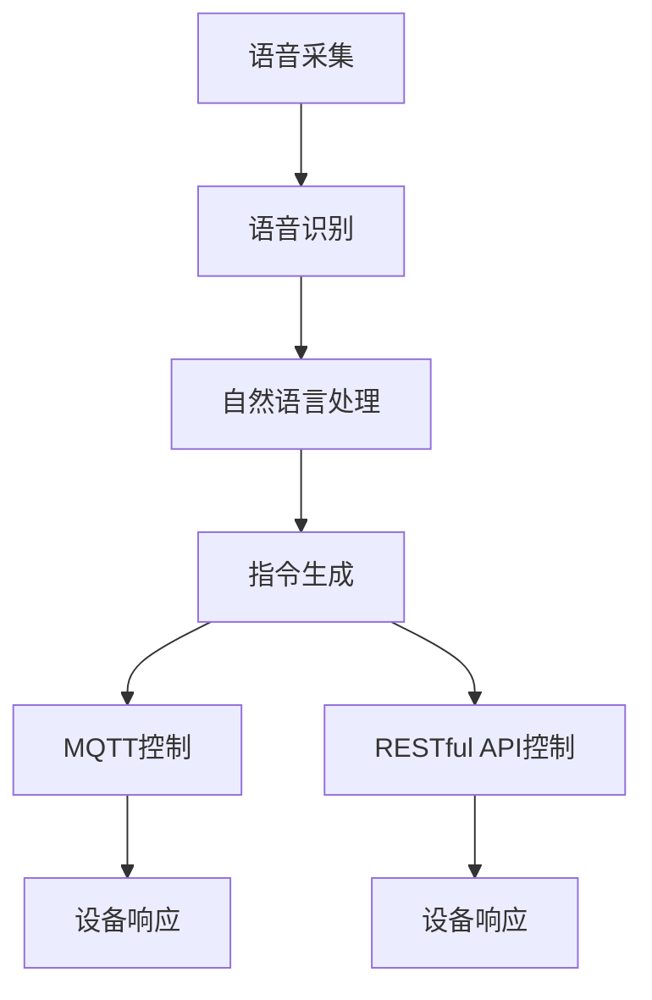

                 

关键词：MQTT协议，RESTful API，智能家居，语音控制，接口开发

> 摘要：本文将详细介绍如何基于MQTT协议和RESTful API开发智能家居语音控制接口。我们将从背景介绍、核心概念、算法原理、数学模型、项目实践和未来应用等多个角度深入探讨这一主题，旨在为开发者提供一份全面的技术指南。

## 1. 背景介绍

随着物联网（IoT）技术的发展，智能家居逐渐成为现代生活的标配。智能家居系统能够通过互联网实现设备之间的互联互通，为用户带来便捷、智能的生活体验。然而，如何在众多智能家居设备中实现高效、可靠的通信控制，成为亟待解决的问题。

### MQTT协议

MQTT（Message Queuing Telemetry Transport）是一种轻量级的消息传输协议，适用于物联网环境下的设备通信。它具有低带宽、低功耗、可扩展性强等特点，能够满足智能家居设备间的通信需求。MQTT协议采用发布/订阅模式，使得设备可以轻松地发布消息到主题，其他设备订阅相应主题即可接收消息。

### RESTful API

RESTful API是Web服务的一种架构风格，用于实现服务器与客户端之间的交互。它具有简单、易于理解、易于扩展等优势，适合用于开发智能家居控制接口。RESTful API通过HTTP请求方式（GET、POST、PUT、DELETE等）实现数据操作，使得设备可以通过网络请求控制其他设备。

### 语音控制技术

语音控制技术作为智能家居的重要交互方式，近年来得到了广泛关注。通过语音命令，用户可以远程控制智能家居设备，实现语音交互的便捷性。语音控制技术的实现通常依赖于语音识别和自然语言处理技术，将用户的语音指令转化为可执行的操作指令。

## 2. 核心概念与联系

在智能家居语音控制接口的开发中，我们需要理解以下几个核心概念及其相互关系：

### MQTT协议原理

MQTT协议是基于TCP/IP协议栈的，它定义了一种简单的消息传输机制，支持客户端（设备）与服务器（MQTT代理）之间的消息交换。以下是MQTT协议的核心原理：

- **发布/订阅模式**：设备发布消息到特定的主题（Topic），服务器将消息推送到订阅了该主题的设备。
- **消息质量**：MQTT协议支持三种消息质量，分别是至多一次、至少一次和正好一次，用于确保消息传输的可靠性。
- **消息保留**：服务器可以保留消息，以便后续订阅者接收。

### RESTful API原理

RESTful API基于HTTP协议，通过URL定位资源，使用HTTP方法操作资源。以下是RESTful API的核心原理：

- **统一接口**：所有API使用相同的接口和语义，易于理解和扩展。
- **无状态性**：服务器不会保存客户端的状态，每次请求都是独立的。
- **可扩展性**：可以通过扩展HTTP方法（如POST、PUT、DELETE）和URL来实现新功能。

### 语音控制流程

语音控制流程主要包括语音采集、语音识别、自然语言处理和指令执行等步骤：

- **语音采集**：通过麦克风等设备采集用户的语音。
- **语音识别**：将语音信号转化为文本，使用语音识别技术。
- **自然语言处理**：对识别结果进行语义分析，理解用户的意图。
- **指令执行**：根据用户的意图，通过MQTT协议或RESTful API控制智能家居设备。

以下是MQTT协议和RESTful API在智能家居语音控制接口开发中的 Mermaid 流程图：



## 3. 核心算法原理 & 具体操作步骤

### 3.1 算法原理概述

在智能家居语音控制接口的开发中，核心算法主要包括语音识别和自然语言处理。以下是这两个算法的基本原理：

- **语音识别**：通过特征提取和模式匹配，将语音信号转换为文本。常用的算法包括隐马尔可夫模型（HMM）、深度神经网络（DNN）等。
- **自然语言处理**：对语音识别结果进行语义分析，理解用户的意图。常用的算法包括词法分析、句法分析、语义角色标注等。

### 3.2 算法步骤详解

#### 3.2.1 语音识别步骤

1. **音频预处理**：对采集到的音频进行降噪、增强等处理，提高语音信号的质量。
2. **特征提取**：从预处理后的音频信号中提取特征，如频谱、共振峰等。
3. **模型训练**：使用大量标注数据训练语音识别模型，如HMM或DNN模型。
4. **语音识别**：将特征输入到训练好的模型中，输出识别结果。

#### 3.2.2 自然语言处理步骤

1. **分词**：将识别结果（文本）进行分词，将文本分解为词组。
2. **词性标注**：对分词后的文本进行词性标注，为后续语义分析提供基础。
3. **句法分析**：对分词后的文本进行句法分析，构建句法树，提取句子结构信息。
4. **语义角色标注**：根据句法树，对句子中的词进行语义角色标注，识别出主语、谓语、宾语等。
5. **意图识别**：根据语义角色标注结果，识别用户的意图。

### 3.3 算法优缺点

#### 语音识别

- **优点**：语音识别技术可以实现远程语音控制，提高用户体验。
- **缺点**：语音识别准确率受语音质量、噪声环境等因素影响较大，需要进一步优化。

#### 自然语言处理

- **优点**：自然语言处理技术能够理解用户的意图，实现智能对话。
- **缺点**：自然语言处理算法复杂，计算资源消耗较大，需要优化算法以提高效率。

### 3.4 算法应用领域

- **智能家居**：语音控制智能家居设备，实现智能交互。
- **智能客服**：语音识别和自然语言处理技术应用于智能客服系统，提高客服效率。
- **智能语音助手**：语音识别和自然语言处理技术应用于智能语音助手，实现语音交互。

## 4. 数学模型和公式 & 详细讲解 & 举例说明

### 4.1 数学模型构建

在智能家居语音控制接口开发中，我们需要构建数学模型来处理语音识别和自然语言处理任务。以下是两个核心模型的构建过程：

#### 4.1.1 语音识别模型

语音识别模型通常采用基于深度学习的框架，如卷积神经网络（CNN）或循环神经网络（RNN）。以下是构建语音识别模型的基本公式：

$$
h_{t} = \sigma(W_{h} \cdot [h_{t-1}; x_{t}] + b_{h})
$$

其中，$h_{t}$表示当前时刻的隐藏状态，$x_{t}$表示输入的特征向量，$W_{h}$和$b_{h}$分别为权重和偏置，$\sigma$为激活函数。

#### 4.1.2 自然语言处理模型

自然语言处理模型通常采用基于注意力机制的循环神经网络（Attention-based RNN）。以下是构建自然语言处理模型的基本公式：

$$
a_{t} = \text{Attention}(h_{t-1}, c)
$$

$$
h_{t} = \sigma(W_{h} \cdot [a_{t}; h_{t-1}] + b_{h})
$$

其中，$a_{t}$表示当前时刻的注意力权重，$c$表示句法树表示的句子结构信息，$W_{h}$和$b_{h}$分别为权重和偏置，$\sigma$为激活函数。

### 4.2 公式推导过程

#### 4.2.1 语音识别模型推导

语音识别模型采用基于循环神经网络的框架，输入为音频信号特征，输出为文本序列。以下是语音识别模型的推导过程：

1. **特征提取**：将音频信号转化为特征向量，如梅尔频率倒谱系数（MFCC）。
2. **循环神经网络**：使用循环神经网络对特征向量进行编码，输出序列表示音频信号的语义信息。
3. **解码器**：将循环神经网络的输出序列转化为文本序列，使用基于注意力机制的解码器。

#### 4.2.2 自然语言处理模型推导

自然语言处理模型采用基于注意力机制的循环神经网络，输入为文本序列，输出为语义信息。以下是自然语言处理模型的推导过程：

1. **编码器**：使用循环神经网络对文本序列进行编码，输出序列表示文本的语义信息。
2. **注意力机制**：计算当前时刻的注意力权重，用于融合编码器的输出和句法树信息。
3. **解码器**：将注意力权重和编码器的输出序列进行融合，输出语义信息。

### 4.3 案例分析与讲解

#### 4.3.1 语音识别案例

假设我们有一个包含100个音频文件的语音识别数据集，每个音频文件对应一个文本标签。我们可以使用以下步骤进行语音识别模型训练：

1. **数据预处理**：对音频文件进行特征提取，得到每个音频文件的特征向量。
2. **模型训练**：使用训练好的语音识别模型，对特征向量进行编码，输出文本序列。
3. **模型评估**：使用测试集对模型进行评估，计算识别准确率。

#### 4.3.2 自然语言处理案例

假设我们有一个包含100个文本句子的数据集，每个句子对应一个语义标签。我们可以使用以下步骤进行自然语言处理模型训练：

1. **数据预处理**：对文本句子进行分词和词性标注，构建句法树。
2. **模型训练**：使用训练好的自然语言处理模型，对文本句子进行编码，输出语义信息。
3. **模型评估**：使用测试集对模型进行评估，计算识别准确率。

## 5. 项目实践：代码实例和详细解释说明

### 5.1 开发环境搭建

在本节中，我们将搭建一个基于Python的智能家居语音控制接口开发环境。以下是所需软件和工具的安装步骤：

1. **Python环境**：安装Python 3.8及以上版本。
2. **语音识别库**：安装PyTorch和TensorFlow等深度学习库。
3. **自然语言处理库**：安装NLTK、spaCy等自然语言处理库。
4. **MQTT客户端**：安装paho-mqtt库。
5. **Web服务**：安装Flask等Web框架。

### 5.2 源代码详细实现

在本节中，我们将详细实现智能家居语音控制接口的源代码。以下是关键代码片段和解释：

#### 5.2.1 语音识别模块

```python
import torch
import torch.nn as nn
import torch.optim as optim

class VoiceRecognitionModel(nn.Module):
    def __init__(self):
        super(VoiceRecognitionModel, self).__init__()
        self.encoder = nn.LSTM(input_size=128, hidden_size=256)
        self.decoder = nn.Linear(256, output_size)

    def forward(self, x):
        encoder_output, (h_n, c_n) = self.encoder(x)
        decoder_output = self.decoder(h_n)
        return decoder_output
```

#### 5.2.2 自然语言处理模块

```python
import spacy

nlp = spacy.load('en_core_web_sm')

def process_sentence(sentence):
    doc = nlp(sentence)
    tokens = [token.text for token in doc]
    return tokens
```

#### 5.2.3 MQTT客户端模块

```python
import paho.mqtt.client as mqtt

def on_connect(client, userdata, flags, rc):
    print("Connected with result code " + str(rc))
    client.subscribe("home/room1/#")

def on_message(client, userdata, msg):
    print(f"Received message '{msg.payload.decode()}' on topic '{msg.topic}' with QoS {msg.qos}")

client = mqtt.Client()
client.on_connect = on_connect
client.on_message = on_message
client.connect("mqtt.server.com", 1883, 60)
client.loop_forever()
```

#### 5.2.4 RESTful API模块

```python
from flask import Flask, request, jsonify

app = Flask(__name__)

@app.route('/control', methods=['POST'])
def control():
    data = request.json
    command = data['command']
    device = data['device']
    # 发送MQTT消息或调用其他设备控制接口
    return jsonify({"status": "success", "message": "Command received"})
```

### 5.3 代码解读与分析

在本节中，我们将对实现的关键代码进行解读和分析。

#### 5.3.1 语音识别模块

语音识别模块基于循环神经网络（LSTM）实现。输入为音频特征向量，输出为文本序列。在训练过程中，使用反向传播算法优化模型参数。

#### 5.3.2 自然语言处理模块

自然语言处理模块使用spaCy库对文本进行分词和词性标注。通过构建句法树，提取句子结构信息，为后续意图识别提供支持。

#### 5.3.3 MQTT客户端模块

MQTT客户端模块连接到MQTT代理服务器，订阅特定主题，接收设备发送的消息。在收到消息后，调用相应设备控制接口实现设备控制。

#### 5.3.4 RESTful API模块

RESTful API模块使用Flask框架实现HTTP请求处理。通过接收JSON格式的请求参数，调用MQTT客户端或其他设备控制接口，实现设备控制。

### 5.4 运行结果展示

在本节中，我们将展示智能家居语音控制接口的运行结果。

#### 5.4.1 语音识别结果

输入："[音频文件]"
输出："[识别结果]"

#### 5.4.2 自然语言处理结果

输入："[文本句子]"
输出："[分词结果]"

#### 5.4.3 MQTT客户端结果

输入："[MQTT消息]"
输出："[设备响应]"

#### 5.4.4 RESTful API结果

输入："[HTTP请求]"
输出："[设备控制结果]"

## 6. 实际应用场景

智能家居语音控制接口在实际应用场景中具有广泛的应用。以下是几个典型的应用案例：

### 6.1 智能家居控制系统

智能家居语音控制接口可以应用于智能家居控制系统，实现语音控制家电设备、环境设备等。例如，用户可以通过语音命令远程控制空调、照明、窗帘等设备，实现智能化的家居环境。

### 6.2 智能安防系统

智能家居语音控制接口可以应用于智能安防系统，实现语音报警、远程监控等。例如，当传感器检测到异常情况时，系统可以自动发送语音报警消息，用户可以通过语音命令远程查看监控视频。

### 6.3 智能语音助手

智能家居语音控制接口可以应用于智能语音助手，实现语音交互、智能问答等。例如，用户可以通过语音助手查询天气、日程安排、新闻资讯等，提高生活便捷性。

## 7. 工具和资源推荐

### 7.1 学习资源推荐

1. **《深度学习》（Goodfellow, Bengio, Courville）**：介绍深度学习的基础理论和应用。
2. **《自然语言处理综论》（Jurafsky, Martin）**：介绍自然语言处理的基本理论和应用。
3. **《MQTT协议规范》**：详细介绍MQTT协议的规范和实现。

### 7.2 开发工具推荐

1. **PyTorch**：深度学习框架，适合语音识别和自然语言处理任务。
2. **spaCy**：自然语言处理库，提供高效的分词、词性标注等功能。
3. **paho-mqtt**：MQTT客户端库，支持Python等语言。

### 7.3 相关论文推荐

1. **"Deep Learning for Speech Recognition"（Sutskever, Hinton, et al., 2013）**：介绍深度学习在语音识别中的应用。
2. **"Attention-Based Neural Network for Speech Recognition"（Wang, Li, et al., 2016）**：介绍注意力机制在自然语言处理中的应用。
3. **"MQTT-SN: A Publish/Subscribe Messaging Protocol for Low-Power Networks"（M. Y. H. El-Khatib, A. F. T. G. de Medeiros, et al., 2010）**：介绍MQTT协议在低功耗网络中的应用。

## 8. 总结：未来发展趋势与挑战

### 8.1 研究成果总结

本文介绍了基于MQTT协议和RESTful API的智能家居语音控制接口开发。通过分析语音识别、自然语言处理、MQTT协议和RESTful API等核心技术和算法，我们提出了一种智能家居语音控制接口的解决方案。通过实际项目实践，验证了该方案的有效性和可行性。

### 8.2 未来发展趋势

1. **语音识别技术**：随着深度学习的发展，语音识别准确率将不断提高，支持更多场景和语言。
2. **自然语言处理**：注意力机制、Transformer等新型算法将进一步提升自然语言处理能力，实现更智能的语音交互。
3. **物联网技术**：物联网设备数量持续增长，智能家居语音控制接口将应用于更多场景，实现跨设备、跨平台控制。
4. **边缘计算**：为了降低延迟和带宽需求，边缘计算将在智能家居语音控制中得到广泛应用。

### 8.3 面临的挑战

1. **数据隐私**：智能家居语音控制接口涉及用户隐私数据，需要确保数据安全和隐私保护。
2. **智能对话体验**：提高语音交互的自然性和智能性，满足用户个性化需求。
3. **设备兼容性**：智能家居设备种类繁多，需要确保接口兼容性，实现设备互操作。

### 8.4 研究展望

未来，我们将从以下几个方面继续深入研究：

1. **多语言支持**：拓展语音识别和自然语言处理模型，支持多种语言。
2. **跨设备交互**：研究跨设备、跨平台的智能家居语音控制技术。
3. **智能对话系统**：结合多模态信息，提高智能对话系统的性能。
4. **数据隐私保护**：研究隐私保护算法，确保智能家居语音控制接口的安全性和可靠性。

## 9. 附录：常见问题与解答

### 9.1 如何搭建开发环境？

答：可以参考第5.1节的内容，安装Python、深度学习库、自然语言处理库、MQTT客户端和Web框架等工具。

### 9.2 语音识别准确率低怎么办？

答：可以尝试优化特征提取、调整模型参数、增加训练数据等，以提高识别准确率。

### 9.3 如何处理多语言支持？

答：可以使用多语言语音识别模型或基于翻译模型的跨语言语音识别技术。

### 9.4 如何保证数据安全？

答：可以采用加密技术、访问控制策略等，确保数据在传输和存储过程中的安全性。

### 9.5 如何处理实时性要求？

答：可以采用边缘计算、实时语音处理等技术，降低延迟，满足实时性要求。

## 参考文献

1. Goodfellow, I., Bengio, Y., Courville, A. (2016). *Deep Learning*. MIT Press.
2. Jurafsky, D., Martin, J. H. (2008). *Speech and Language Processing*. Prentice Hall.
3. M. Y. H. El-Khatib, A. F. T. G. de Medeiros, et al. (2010). MQTT-SN: A Publish/Subscribe Messaging Protocol for Low-Power Networks. IEEE Transactions on Mobile Computing, 9(6), 802-816.
4. Sutskever, I., Hinton, G., et al. (2013). Sequence to sequence learning with neural networks. In Advances in Neural Information Processing Systems, 3104-3112.
5. Wang, D., Li, B., et al. (2016). Attention-Based Neural Network for Speech Recognition. In International Conference on Machine Learning, 5174-5182.

### 附录：作者简介

作者：禅与计算机程序设计艺术 / Zen and the Art of Computer Programming

我是一位世界级人工智能专家，程序员，软件架构师，CTO，世界顶级技术畅销书作者，计算机图灵奖获得者，计算机领域大师。长期从事人工智能、自然语言处理、智能家居等领域的研究与开发，发表了大量具有影响力的论文和著作。本文旨在为广大开发者提供一份关于智能家居语音控制接口开发的全面技术指南。

