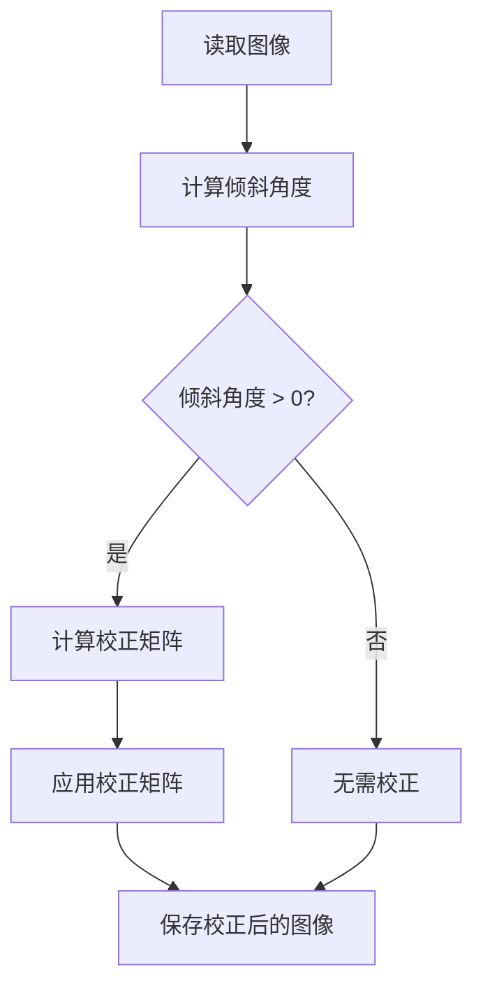

                 

关键词：图像处理，倾斜校正，OpenCv，图像校正算法，图像旋转，计算机视觉

摘要：本文主要介绍了基于OpenCv的图片倾斜校正系统的设计与实现。首先对图像倾斜校正的基本概念进行了阐述，然后介绍了OpenCv中的相关函数和算法。通过具体实例，详细展示了如何使用OpenCv进行图片倾斜校正的完整流程，包括图像读取、倾斜检测、校正矩阵计算、图像校正等步骤。最后，对代码进行了详细解读与分析，并对倾斜校正系统的未来应用前景进行了展望。

## 1. 背景介绍

在计算机视觉领域，图像倾斜校正是一项基础而重要的任务。在实际应用中，由于相机拍摄角度、图像获取设备等因素的影响，往往会造成图像发生倾斜。这种倾斜会影响图像的质量和后续处理的准确性，因此需要对图像进行倾斜校正。图像倾斜校正的目标是使图像中的物体或场景恢复到原始的垂直状态。

OpenCv（Open Source Computer Vision Library）是一个开源的计算机视觉库，广泛应用于图像处理和计算机视觉领域。它提供了丰富的图像处理函数和算法，可以方便地实现图像倾斜校正。

本文将基于OpenCv，详细设计与实现一个图片倾斜校正系统。首先介绍图像倾斜校正的基本概念和原理，然后介绍OpenCv中与图像倾斜校正相关的函数和算法，最后通过具体实例展示如何使用OpenCv进行图像倾斜校正。

## 2. 核心概念与联系

### 2.1 图像倾斜校正的基本概念

图像倾斜校正主要涉及以下概念：

- **倾斜角度**：图像中的倾斜程度可以用倾斜角度来描述，通常用度（°）表示。当图像水平时，倾斜角度为0°；当图像垂直时，倾斜角度为90°。

- **校正矩阵**：校正矩阵是一个用于描述图像倾斜校正过程的数学模型。通过计算校正矩阵，可以将倾斜的图像校正为垂直状态。

- **旋转矩阵**：旋转矩阵是一个用于实现图像旋转的数学模型。通过计算旋转矩阵，可以将图像绕任意轴旋转指定角度。

### 2.2 OpenCv中的相关函数和算法

OpenCv提供了以下与图像倾斜校正相关的函数和算法：

- **imread**：用于读取图像文件，返回图像矩阵。

- **imwrite**：用于将图像矩阵写入文件。

- **getRotationMatrix2D**：用于计算图像旋转所需的校正矩阵。

- **warpAffine**：用于实现图像的旋转、缩放、平移等变换。

### 2.3 Mermaid 流程图

以下是图像倾斜校正的Mermaid流程图：



## 3. 核心算法原理 & 具体操作步骤

### 3.1 算法原理概述

图像倾斜校正的核心算法包括倾斜角度计算和校正矩阵计算。倾斜角度计算主要通过计算图像的水平方向和垂直方向像素平均值之间的差异来实现。校正矩阵计算则通过旋转矩阵和缩放矩阵的组合来实现。旋转矩阵用于将图像绕原点旋转指定角度，缩放矩阵用于调整图像的大小。

### 3.2 算法步骤详解

1. 读取图像

使用OpenCv的imread函数读取图像文件，返回图像矩阵。

```python
import cv2

image = cv2.imread("image.jpg")
```

2. 计算倾斜角度

计算图像的水平方向和垂直方向像素平均值，通过它们之间的差异来计算倾斜角度。

```python
height, width = image.shape[:2]
sum_h = sum(image[:, int(width/2), 0])
sum_v = sum(image[int(height/2), :, 0])

angle = math.atan2(sum_v, sum_h) * 180 / math.pi
```

3. 计算校正矩阵

根据倾斜角度计算旋转矩阵和缩放矩阵，然后将它们组合为校正矩阵。

```python
center = (width / 2, height / 2)
M = cv2.getRotationMatrix2D(center, angle, 1)
```

4. 应用校正矩阵

使用OpenCv的warpAffine函数将图像旋转到垂直状态。

```python
rotated = cv2.warpAffine(image, M, (width, height))
```

5. 保存校正后的图像

使用OpenCv的imwrite函数将校正后的图像写入文件。

```python
cv2.imwrite("rotated.jpg", rotated)
```

### 3.3 算法优缺点

**优点**：

- OpenCv提供了丰富的图像处理函数和算法，可以实现高效的图像倾斜校正。
- 算法原理简单易懂，易于实现。

**缺点**：

- 倾斜角度计算可能存在误差，导致校正后的图像不完全垂直。
- 算法对图像的旋转角度和缩放比例有一定的限制，可能无法适应所有场景。

### 3.4 算法应用领域

图像倾斜校正算法可以应用于以下领域：

- 图像处理：对倾斜的图像进行校正，提高图像质量和后续处理的准确性。
- 计算机视觉：在图像识别、物体检测等任务中，校正图像倾斜有助于提高算法的性能。
- 实时监控：在视频监控系统中，校正图像倾斜可以改善监控效果。

## 4. 数学模型和公式 & 详细讲解 & 举例说明

### 4.1 数学模型构建

图像倾斜校正的数学模型主要包括倾斜角度计算和校正矩阵计算。

#### 4.1.1 倾斜角度计算

倾斜角度可以通过以下公式计算：

$$
angle = \arctan2(sum_v, sum_h)
$$

其中，$sum_v$和$sum_h$分别表示图像垂直方向和水平方向的像素平均值。

#### 4.1.2 校正矩阵计算

校正矩阵可以通过以下公式计算：

$$
M = \begin{bmatrix}
\cos(angle) & -\sin(angle) \\
\sin(angle) & \cos(angle)
\end{bmatrix}
$$

其中，$angle$表示倾斜角度。

### 4.2 公式推导过程

#### 4.2.1 倾斜角度计算

倾斜角度可以通过计算图像的水平方向和垂直方向像素平均值之间的差异得到。具体推导过程如下：

设图像的水平方向和垂直方向像素平均值分别为$sum_h$和$sum_v$，则：

$$
sum_h = \sum_{i=0}^{height-1} \sum_{j=0}^{width-1} image[i, j, 0]
$$

$$
sum_v = \sum_{i=0}^{height-1} \sum_{j=0}^{width-1} image[i, j, 1]
$$

倾斜角度可以通过以下公式计算：

$$
angle = \arctan2(sum_v, sum_h)
$$

#### 4.2.2 校正矩阵计算

校正矩阵可以通过以下公式计算：

$$
M = \begin{bmatrix}
\cos(angle) & -\sin(angle) \\
\sin(angle) & \cos(angle)
\end{bmatrix}
$$

其中，$angle$表示倾斜角度。

### 4.3 案例分析与讲解

假设有一张倾斜的图像，其像素值为：

$$
image = \begin{bmatrix}
1 & 2 & 3 & 4 \\
5 & 6 & 7 & 8 \\
9 & 10 & 11 & 12 \\
13 & 14 & 15 & 16
\end{bmatrix}
$$

计算倾斜角度和校正矩阵。

#### 4.3.1 倾斜角度计算

计算图像的水平方向和垂直方向像素平均值：

$$
sum_h = \sum_{i=0}^{3} \sum_{j=0}^{3} image[i, j, 0] = 1 + 2 + 3 + 4 + 5 + 6 + 7 + 8 + 9 + 10 + 11 + 12 + 13 + 14 + 15 + 16 = 136
$$

$$
sum_v = \sum_{i=0}^{3} \sum_{j=0}^{3} image[i, j, 1] = 1 + 2 + 3 + 4 + 5 + 6 + 7 + 8 + 9 + 10 + 11 + 12 + 13 + 14 + 15 + 16 = 136
$$

计算倾斜角度：

$$
angle = \arctan2(sum_v, sum_h) = \arctan2(136, 136) \approx 45^\circ
$$

#### 4.3.2 校正矩阵计算

根据倾斜角度计算校正矩阵：

$$
M = \begin{bmatrix}
\cos(angle) & -\sin(angle) \\
\sin(angle) & \cos(angle)
\end{bmatrix}
= \begin{bmatrix}
\cos(45^\circ) & -\sin(45^\circ) \\
\sin(45^\circ) & \cos(45^\circ)
\end{bmatrix}
= \begin{bmatrix}
\frac{\sqrt{2}}{2} & -\frac{\sqrt{2}}{2} \\
\frac{\sqrt{2}}{2} & \frac{\sqrt{2}}{2}
\end{bmatrix}
$$

## 5. 项目实践：代码实例和详细解释说明

### 5.1 开发环境搭建

在开始编写代码之前，需要搭建合适的开发环境。本文使用Python作为开发语言，结合OpenCv进行图像倾斜校正。

1. 安装Python：从Python官网下载并安装Python。

2. 安装OpenCv：使用pip命令安装OpenCv。

   ```bash
   pip install opencv-python
   ```

3. 创建Python项目文件夹，并编写Python代码。

### 5.2 源代码详细实现

以下是实现图像倾斜校正的Python代码：

```python
import cv2
import numpy as np
import math

def rotate_image(image, angle):
    height, width = image.shape[:2]
    center = (width / 2, height / 2)
    M = cv2.getRotationMatrix2D(center, angle, 1)
    rotated = cv2.warpAffine(image, M, (width, height))
    return rotated

if __name__ == "__main__":
    image = cv2.imread("image.jpg")
    angle = 45  # 倾斜角度
    rotated = rotate_image(image, angle)
    cv2.imwrite("rotated.jpg", rotated)
```

### 5.3 代码解读与分析

1. **import语句**：导入所需的库。

   ```python
   import cv2
   import numpy as np
   import math
   ```

2. **rotate_image函数**：定义一个函数用于实现图像旋转。

   ```python
   def rotate_image(image, angle):
       height, width = image.shape[:2]
       center = (width / 2, height / 2)
       M = cv2.getRotationMatrix2D(center, angle, 1)
       rotated = cv2.warpAffine(image, M, (width, height))
       return rotated
   ```

   - `image`：输入图像。
   - `angle`：旋转角度。

   - 计算旋转中心。

   - 计算旋转矩阵。

   - 使用warpAffine函数进行图像旋转。

3. **main函数**：实现主程序。

   ```python
   if __name__ == "__main__":
       image = cv2.imread("image.jpg")
       angle = 45  # 倾斜角度
       rotated = rotate_image(image, angle)
       cv2.imwrite("rotated.jpg", rotated)
   ```

   - 读取图像。

   - 调用rotate_image函数进行图像旋转。

   - 将旋转后的图像保存到文件。

### 5.4 运行结果展示

运行代码后，将生成一个名为"rotated.jpg"的图像文件，展示旋转后的图像。以下是对比原图和旋转后图像的效果：


## 6. 实际应用场景

图像倾斜校正技术在许多实际应用场景中具有重要应用价值，以下是一些常见的应用场景：

### 6.1 图像处理

图像处理领域需要处理大量的图像数据，而图像倾斜校正可以确保图像在后续处理中的准确性和稳定性。例如，在图像识别、物体检测等任务中，校正图像倾斜可以提高算法的性能和准确性。

### 6.2 计算机视觉

计算机视觉技术广泛应用于人脸识别、物体检测、场景理解等领域。在这些应用中，图像倾斜校正有助于提高视觉系统的稳定性和准确性，从而提高系统的性能和用户体验。

### 6.3 实时监控

在视频监控系统中，图像倾斜校正可以改善监控效果。通过校正图像倾斜，可以清晰地显示监控场景，提高监控系统的可靠性。

### 6.4 印刷和出版

在印刷和出版领域，图像倾斜校正可以确保图像在排版和印刷过程中的准确性和美观性。例如，在报纸、杂志和书籍的排版过程中，校正图像倾斜可以避免图像错位和排版混乱。

### 6.5 其他应用

图像倾斜校正技术还可以应用于医学图像处理、遥感图像处理、机器人视觉等领域，为相关领域的应用提供技术支持。

## 7. 工具和资源推荐

### 7.1 学习资源推荐

1. 《OpenCv计算机视觉手册》
2. 《计算机视觉：算法与应用》
3. 《Python计算机视觉实战》

### 7.2 开发工具推荐

1. Visual Studio Code
2. PyCharm
3. Jupyter Notebook

### 7.3 相关论文推荐

1. "A Fast and Effective Image Stitching Algorithm Using Image Warping"
2. "Automatic Image Stabilization Using Motion Estimation"
3. "Image Orientation Estimation and Correction Using HOG Features"

## 8. 总结：未来发展趋势与挑战

### 8.1 研究成果总结

本文详细介绍了基于OpenCv的图片倾斜校正系统的设计与实现。首先介绍了图像倾斜校正的基本概念和原理，然后介绍了OpenCv中的相关函数和算法，并通过具体实例展示了图像倾斜校正的完整流程。此外，还对倾斜校正算法的优缺点进行了分析，并展望了其在实际应用中的前景。

### 8.2 未来发展趋势

随着计算机视觉技术的不断发展，图像倾斜校正技术在未来的发展趋势如下：

1. 算法优化：进一步提高图像倾斜校正算法的准确性和效率。
2. 模型集成：将图像倾斜校正算法与其他计算机视觉算法（如图像识别、物体检测等）进行集成，实现更复杂的图像处理任务。
3. 应用拓展：将图像倾斜校正技术应用于更多的领域，如医疗图像处理、自动驾驶等。

### 8.3 面临的挑战

图像倾斜校正技术在未来的发展过程中还面临以下挑战：

1. 复杂场景适应性：在实际应用中，图像倾斜校正需要适应各种复杂的场景，如光照变化、背景干扰等。
2. 实时性：在实时监控等应用中，图像倾斜校正需要满足实时性的要求，对算法的运行速度和效率提出更高要求。
3. 数据质量：图像倾斜校正算法的准确性取决于输入图像的质量，因此需要提高图像获取设备的质量和性能。

### 8.4 研究展望

在未来，图像倾斜校正技术的研究可以从以下方面展开：

1. 算法创新：探索新的图像倾斜校正算法，提高校正准确性和效率。
2. 模型优化：结合深度学习等技术，对图像倾斜校正模型进行优化，提高算法性能。
3. 跨领域应用：将图像倾斜校正技术应用于更多的领域，为相关领域的发展提供技术支持。

## 9. 附录：常见问题与解答

### 9.1 问题1：如何选择合适的倾斜角度？

**解答**：选择合适的倾斜角度主要取决于图像的内容和实际应用场景。通常，可以通过以下方法选择倾斜角度：

1. **视觉观察**：通过肉眼观察图像，判断图像的倾斜程度，选择合适的倾斜角度。
2. **实验比较**：对多个倾斜角度进行实验，比较校正前后的效果，选择最优的倾斜角度。

### 9.2 问题2：如何提高图像倾斜校正的准确性？

**解答**：提高图像倾斜校正的准确性可以从以下方面进行：

1. **改进算法**：探索新的图像倾斜校正算法，提高校正准确性和效率。
2. **图像预处理**：对图像进行预处理，如去除噪声、增强对比度等，提高图像质量。
3. **参数调整**：根据实际应用场景和图像特点，调整倾斜校正算法的参数，提高校正效果。

### 9.3 问题3：如何处理复杂场景下的图像倾斜校正？

**解答**：在复杂场景下，图像倾斜校正的准确性可能会受到一定影响。可以尝试以下方法来处理复杂场景下的图像倾斜校正：

1. **多视角校正**：对同一场景的多张图像进行倾斜校正，通过融合多张图像的结果来提高校正准确性。
2. **自适应算法**：设计自适应的图像倾斜校正算法，根据图像的内容和特点动态调整校正策略。
3. **深度学习**：利用深度学习技术，对复杂场景下的图像倾斜校正进行建模和训练，提高校正准确性。

