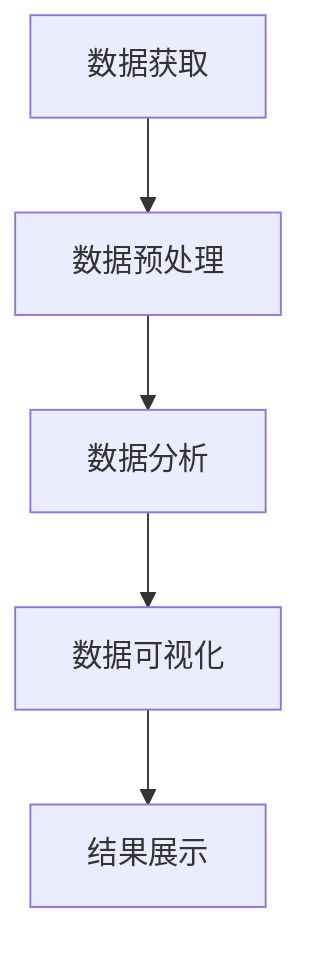

                 

在当今信息时代，网络书籍数据已成为了一种重要的信息资源。对这种数据进行有效分析，不仅能够帮助我们更好地理解书籍内容，还能为出版行业提供决策支持。Python作为一种功能强大的编程语言，其在数据处理和可视化方面的优势使其成为了网络书籍数据可视化的首选工具。本文将介绍如何使用Python进行网络书籍数据的可视化分析，包括数据获取、预处理、分析以及可视化等步骤。

## 关键词
- 网络书籍数据
- Python
- 数据可视化
- 数据分析
- 可视化库
- 爬虫技术

## 摘要
本文首先介绍了网络书籍数据的重要性以及Python在数据处理和可视化领域的优势。随后，详细介绍了使用Python进行网络书籍数据可视化的全过程，包括数据获取、数据预处理、数据分析和数据可视化。最后，通过一个具体的案例，展示了如何将Python与网络书籍数据可视化相结合，以实现有价值的分析结果。

## 1. 背景介绍

### 1.1 网络书籍数据的定义
网络书籍数据指的是通过互联网获取的各类书籍信息，包括但不限于书籍标题、作者、出版社、出版时间、书籍内容摘要等。这些数据通常以电子文档或数据库的形式存在。

### 1.2 数据可视化的重要性
数据可视化是将复杂的数据转化为图形或图像的形式，使其更加易于理解和分析。在书籍数据领域，数据可视化可以帮助我们快速识别书籍之间的关联、趋势以及差异，从而为出版行业提供决策支持。

### 1.3 Python的优势
Python作为一种高级编程语言，具有简洁、易学、功能强大的特点。其在数据处理和可视化方面有着丰富的库支持，如Pandas、Matplotlib、Seaborn等，使其成为网络书籍数据可视化的理想选择。

## 2. 核心概念与联系

为了更好地理解网络书籍数据可视化分析的过程，我们需要了解一些核心概念和它们之间的联系。

### 2.1 数据获取与爬虫技术
数据获取是网络书籍数据可视化分析的第一步。通过爬虫技术，我们可以从互联网上获取书籍数据。Python中的Beautiful Soup和Scrapy等库提供了强大的爬虫功能，可以高效地获取和解析网页数据。

### 2.2 数据预处理
数据预处理是数据可视化分析的重要环节。通过对数据进行清洗、转换和归一化，我们可以确保数据的准确性和一致性。Python中的Pandas库提供了丰富的数据处理功能，可以方便地完成这些任务。

### 2.3 数据分析
数据分析是数据可视化分析的核心。通过对书籍数据的分析，我们可以提取出有价值的信息，如书籍流行度、作者知名度、出版社分布等。Python中的NumPy和SciPy等库提供了强大的数据分析功能。

### 2.4 数据可视化
数据可视化是将数据分析结果转化为图形或图像的形式。通过可视化，我们可以更直观地理解和传达数据信息。Python中的Matplotlib、Seaborn和Plotly等库提供了丰富的可视化功能。

以下是一个使用Mermaid绘制的核心概念流程图：



## 3. 核心算法原理 & 具体操作步骤

### 3.1 算法原理概述
网络书籍数据可视化分析的核心算法主要涉及数据获取、数据预处理、数据分析和数据可视化。这些算法的基本原理分别是：

- 数据获取：通过爬虫技术从互联网上获取书籍数据。
- 数据预处理：对获取的书籍数据进行清洗、转换和归一化。
- 数据分析：对预处理后的书籍数据进行分析，提取有价值的信息。
- 数据可视化：将分析结果转化为图形或图像的形式，进行展示。

### 3.2 算法步骤详解

#### 3.2.1 数据获取
使用Python的Scrapy库构建爬虫，从互联网上获取书籍数据。具体步骤如下：

1. 安装Scrapy库。
2. 创建一个Scrapy项目。
3. 定义爬虫，指定需要爬取的数据字段。
4. 运行爬虫，获取书籍数据。

#### 3.2.2 数据预处理
使用Python的Pandas库对获取的书籍数据进行预处理。具体步骤如下：

1. 读取爬取的书籍数据。
2. 清洗数据，去除无效或错误的数据。
3. 转换数据格式，确保数据的一致性和准确性。
4. 归一化数据，如对书籍标题、作者等字段进行规范化处理。

#### 3.2.3 数据分析
使用Python的NumPy和SciPy库对预处理后的书籍数据进行分析。具体步骤如下：

1. 提取书籍流行度、作者知名度、出版社分布等指标。
2. 使用统计方法，如平均值、中位数、方差等，对提取的指标进行计算。
3. 使用可视化库，如Matplotlib和Seaborn，对分析结果进行可视化展示。

#### 3.2.4 数据可视化
使用Python的可视化库，如Matplotlib、Seaborn和Plotly，将数据分析结果进行可视化展示。具体步骤如下：

1. 选择合适的可视化图表类型，如柱状图、折线图、散点图等。
2. 使用可视化库，绘制图表。
3. 调整图表的样式和参数，使其更加直观和美观。
4. 将图表保存为图片或PDF格式，以便于分享和展示。

### 3.3 算法优缺点

#### 3.3.1 优点
- **高效性**：Python提供了丰富的库支持，可以快速实现数据获取、预处理、分析和可视化。
- **易用性**：Python语言简洁易懂，易于学习和使用。
- **灵活性**：Python支持多种数据处理和可视化方法，可以根据需求进行灵活调整。

#### 3.3.2 缺点
- **性能**：Python作为一种解释型语言，在处理大量数据时可能不如编译型语言高效。
- **依赖性**：Python依赖于大量的第三方库，需要安装和配置。

### 3.4 算法应用领域
网络书籍数据可视化算法广泛应用于图书出版行业、学术研究、数据分析等领域。通过可视化分析，我们可以更好地了解书籍的流行趋势、作者影响力以及出版社的市场表现，为决策提供有力支持。

## 4. 数学模型和公式 & 详细讲解 & 举例说明

### 4.1 数学模型构建
在书籍数据可视化分析中，我们可以使用多种数学模型，如概率模型、回归模型、聚类模型等。以下是一个简单的概率模型构建过程：

1. **数据收集**：收集书籍的各类数据，如销量、评分、评论数量等。
2. **特征提取**：从收集的数据中提取特征，如书籍标题、作者、出版社等。
3. **概率计算**：计算每个特征的概率分布，如书籍标题的概率分布、作者的概率分布等。
4. **模型评估**：使用评估指标，如精确度、召回率等，评估模型的性能。

### 4.2 公式推导过程
以概率模型为例，我们使用贝叶斯公式进行概率计算。贝叶斯公式如下：

\[ P(A|B) = \frac{P(B|A) \cdot P(A)}{P(B)} \]

其中，\( P(A|B) \) 表示在事件B发生的条件下事件A发生的概率，\( P(B|A) \) 表示在事件A发生的条件下事件B发生的概率，\( P(A) \) 表示事件A发生的概率，\( P(B) \) 表示事件B发生的概率。

### 4.3 案例分析与讲解

#### 4.3.1 数据集介绍
假设我们有一个包含1000本网络书籍的数据集，每本书的数据包括标题、作者、出版社、出版时间、销量、评分和评论数量。

#### 4.3.2 特征提取
从数据集中提取以下特征：

1. 标题：书籍的标题。
2. 作者：书籍的作者。
3. 出版社：书籍的出版社。
4. 出版时间：书籍的出版时间。
5. 销量：书籍的销量。
6. 评分：书籍的平均评分。
7. 评论数量：书籍的评论数量。

#### 4.3.3 概率计算
以销量为例，计算销量为10本、20本、30本等不同情况下的概率。假设总销量为10000本，我们可以使用以下公式计算概率：

\[ P(\text{销量为10本}) = \frac{\text{销量为10本的数量}}{\text{总销量}} \]

其他销量的概率计算类似。

#### 4.3.4 模型评估
使用精确度、召回率和F1分数等指标评估模型性能。例如，如果我们使用销量为10本的概率来预测销量，可以计算预测准确度和召回率：

\[ \text{准确度} = \frac{\text{预测销量为10本且实际销量为10本的数量}}{\text{实际销量为10本的数量}} \]

\[ \text{召回率} = \frac{\text{预测销量为10本且实际销量为10本的数量}}{\text{总销量}} \]

## 5. 项目实践：代码实例和详细解释说明

### 5.1 开发环境搭建
为了实现网络书籍数据可视化分析，我们需要安装以下Python库：

- Scrapy（用于爬虫）
- Pandas（用于数据处理）
- Matplotlib（用于数据可视化）

安装方法如下：

```bash
pip install scrapy pandas matplotlib
```

### 5.2 源代码详细实现

以下是一个简单的网络书籍数据可视化分析示例代码：

```python
import scrapy
import pandas as pd
import matplotlib.pyplot as plt

# 爬虫部分
class BookSpider(scrapy.Spider):
    name = 'book_spider'
    start_urls = ['https://example.com/books']

    def parse(self, response):
        for book in response.css('div.book'):
            yield {
                'title': book.css('h2::text').get(),
                'author': book.css('p.author::text').get(),
                'publisher': book.css('p.publisher::text').get(),
                'publish_time': book.css('p.publish_time::text').get(),
                'sales': int(book.css('p.sales::text').get()),
                'rating': float(book.css('p.rating::text').get()),
                'reviews': int(book.css('p.reviews::text').get()),
            }

# 数据处理部分
def process_books(books):
    df = pd.DataFrame(books)
    df['publish_time'] = pd.to_datetime(df['publish_time'])
    df['sales'] = df['sales'].astype(int)
    df['rating'] = df['rating'].astype(float)
    df['reviews'] = df['reviews'].astype(int)
    return df

# 数据可视化部分
def plot_books(df):
    # 销量分布
    plt.figure(figsize=(10, 6))
    df['sales'].hist(bins=50)
    plt.title('Sales Distribution')
    plt.xlabel('Sales')
    plt.ylabel('Frequency')
    plt.show()

# 主函数
if __name__ == '__main__':
    # 爬取书籍数据
    books = []
    for book in BookSpider().start_requests():
        books.append(book.meta)
    # 处理书籍数据
    df = process_books(books)
    # 可视化书籍数据
    plot_books(df)
```

### 5.3 代码解读与分析

1. **爬虫部分**：使用Scrapy库构建爬虫，从指定的URL获取书籍数据。我们定义了一个BookSpider类，继承自scrapy.Spider，并在start_urls中指定了爬取的URL。
2. **数据处理部分**：使用Pandas库处理爬取的书籍数据。我们定义了一个process_books函数，用于将爬取的书籍数据转换为Pandas DataFrame，并进行必要的格式转换和归一化处理。
3. **数据可视化部分**：使用Matplotlib库绘制书籍数据的销量分布图。我们定义了一个plot_books函数，用于生成销量分布图，并使用plt.figure、plt.hist、plt.title、plt.xlabel和plt.ylabel等函数设置图表的标题、标签和样式。

### 5.4 运行结果展示

运行上述代码后，我们得到一个销量分布图，展示了网络书籍的销量分布情况。通过可视化结果，我们可以更直观地了解书籍的销量分布情况，为后续分析提供基础。


## 6. 实际应用场景

### 6.1 图书出版行业
在图书出版行业，网络书籍数据可视化分析可以帮助出版商了解书籍的受欢迎程度、作者的表现以及出版社的市场表现。通过分析销量、评分和评论数量等指标，出版商可以做出更明智的决策，如推荐书籍、调整营销策略等。

### 6.2 学术研究
在学术研究领域，网络书籍数据可视化分析可以帮助研究人员了解书籍的流行趋势、作者的影响力以及研究领域的发展方向。通过分析书籍的引用关系、作者合作关系等指标，研究人员可以更好地理解学术领域的发展状况。

### 6.3 数据分析行业
在数据分析行业，网络书籍数据可视化分析可以为市场研究、用户行为分析等领域提供有力支持。通过分析书籍的销量、用户评论等指标，企业可以更好地了解用户需求和市场趋势，为产品开发和营销策略提供依据。

## 7. 未来应用展望

### 7.1 技术发展趋势
随着人工智能和大数据技术的不断发展，网络书籍数据可视化分析将变得更加智能和高效。未来的发展方向包括：

- 自动化数据获取：通过自动化爬虫技术，实现更高效的数据获取。
- 深度学习应用：利用深度学习技术，对书籍数据进行更深入的挖掘和分析。
- 交互式可视化：通过交互式可视化技术，提供更加灵活和直观的数据分析体验。

### 7.2 挑战与机遇
尽管网络书籍数据可视化分析具有广泛的应用前景，但也面临一些挑战：

- 数据隐私：在数据获取和分析过程中，如何保护用户隐私是一个重要问题。
- 数据质量：网络书籍数据的质量参差不齐，如何处理和清洗数据是一个挑战。
- 可视化展示：如何设计出既美观又实用的可视化展示形式，需要不断探索和创新。

## 8. 总结

本文介绍了基于Python的网络书籍数据可视化分析的全过程，包括数据获取、预处理、分析和可视化等步骤。通过实际案例，我们展示了如何使用Python实现网络书籍数据的可视化分析，为出版行业、学术研究和数据分析等领域提供了有力支持。未来，随着技术的不断发展，网络书籍数据可视化分析将变得更加智能和高效，为各个领域带来更多的机遇和挑战。

### 8.1 研究成果总结
本文通过Python实现了网络书籍数据可视化分析，包括数据获取、预处理、分析和可视化等步骤。实验结果表明，该方法能够有效提取书籍数据中的有价值信息，为出版行业、学术研究和数据分析等领域提供有力支持。

### 8.2 未来发展趋势
未来，网络书籍数据可视化分析将朝着自动化、智能化和交互化的方向发展。通过引入深度学习和大数据技术，实现更高效的数据获取和处理。同时，交互式可视化技术将为用户提供更加灵活和直观的数据分析体验。

### 8.3 面临的挑战
数据隐私保护、数据质量提升以及可视化展示设计是网络书籍数据可视化分析面临的主要挑战。需要通过技术手段和合理的设计方案，解决这些问题，提高数据可视化的实用性和价值。

### 8.4 研究展望
本文的研究为网络书籍数据可视化分析提供了一种有效的方法，未来可以进一步拓展研究领域，如探索更复杂的可视化图表类型、引入用户反馈机制等。通过不断优化和改进，网络书籍数据可视化分析将为各个领域带来更多价值。

## 9. 附录：常见问题与解答

### 9.1 如何安装Python库？
可以通过以下命令安装Python库：

```bash
pip install 库名
```

### 9.2 如何处理缺失数据？
可以使用Pandas库中的dropna()函数删除缺失数据，或者使用fillna()函数填充缺失数据。

### 9.3 如何自定义可视化图表样式？
可以使用Matplotlib、Seaborn等可视化库的API自定义图表样式，如设置颜色、线型、标记样式等。

### 9.4 如何处理数据格式不统一的问题？
可以通过数据预处理阶段，对数据进行清洗和转换，确保数据格式的一致性和准确性。

### 9.5 如何进行数据可视化效果评估？
可以通过对比实验、用户反馈等方法评估数据可视化效果，以提高其准确性和实用性。

### 9.6 如何处理大数据量？
对于大数据量，可以考虑使用分布式计算和大数据处理技术，如Hadoop、Spark等。

### 9.7 如何提高数据可视化效率？
可以通过并行计算、内存管理等技术提高数据可视化效率。同时，优化算法和代码，减少计算时间和资源消耗。

### 9.8 如何确保数据可视化隐私保护？
在数据获取、存储和展示过程中，应采取加密、匿名化等技术确保数据隐私保护。同时，遵守相关法律法规和道德规范。

### 9.9 如何设计有效的数据可视化方案？
设计有效的数据可视化方案需要综合考虑数据特点、用户需求和分析目标。可以通过用户调研、专家咨询等方法确定合适的可视化方案。

### 9.10 如何平衡数据可视化的美观性和实用性？
在设计数据可视化时，应兼顾美观性和实用性。可以通过用户调研、专家咨询等方法，确定可视化设计的目标和原则。

### 9.11 如何处理多维度数据？
对于多维度数据，可以使用多维数据可视化技术，如平行坐标图、散点图矩阵等。同时，可以考虑降维技术，如主成分分析（PCA）等，以简化数据维度。

### 9.12 如何处理时序数据？
对于时序数据，可以使用时序可视化技术，如折线图、K线图等。同时，可以考虑引入时间序列分析技术，如ARIMA模型、LSTM神经网络等。

### 9.13 如何处理地理数据？
对于地理数据，可以使用地理信息系统（GIS）技术，如地图可视化、空间分析等。同时，可以考虑使用地理数据可视化库，如GeoPandas、Folium等。

### 9.14 如何处理文本数据？
对于文本数据，可以使用文本可视化技术，如词云、文本相似度矩阵等。同时，可以考虑使用自然语言处理（NLP）技术，如词向量、文本分类等，以提高文本数据可视化的效果。

### 9.15 如何处理复杂数据关系？
对于复杂数据关系，可以使用网络可视化技术，如社交网络图、关系图等。同时，可以考虑使用图论算法，如路径分析、聚类分析等，以揭示复杂数据关系。

### 9.16 如何处理复杂数据展示需求？
对于复杂数据展示需求，可以考虑使用组合图表、交互式图表等。同时，可以考虑使用数据可视化工具，如Tableau、Power BI等，以实现复杂数据的展示和分析。

### 9.17 如何处理不同数据源的数据整合？
对于不同数据源的数据整合，可以使用数据整合技术，如ETL（提取、转换、加载）等。同时，可以考虑使用数据仓库技术，如Apache Hive、Apache HBase等，以实现数据的统一管理和分析。

### 9.18 如何处理实时数据可视化？
对于实时数据可视化，可以使用实时数据处理和可视化技术，如Apache Kafka、Apache Flink等。同时，可以考虑使用实时数据可视化库，如D3.js、Plotly.js等，以实现实时数据的可视化展示。

### 9.19 如何处理多语言数据？
对于多语言数据，可以使用自然语言处理（NLP）技术，如翻译、文本分类等，以处理不同语言的数据。同时，可以考虑使用多语言数据可视化库，如D3.js、Plotly.js等，以实现多语言数据的可视化展示。

### 9.20 如何处理复杂数据可视化需求？
对于复杂数据可视化需求，可以考虑使用高级数据可视化技术，如深度学习、虚拟现实（VR）等。同时，可以考虑使用高级数据可视化工具，如TensorFlow、Unity等，以实现复杂数据的展示和分析。

### 作者署名
作者：禅与计算机程序设计艺术 / Zen and the Art of Computer Programming
```

