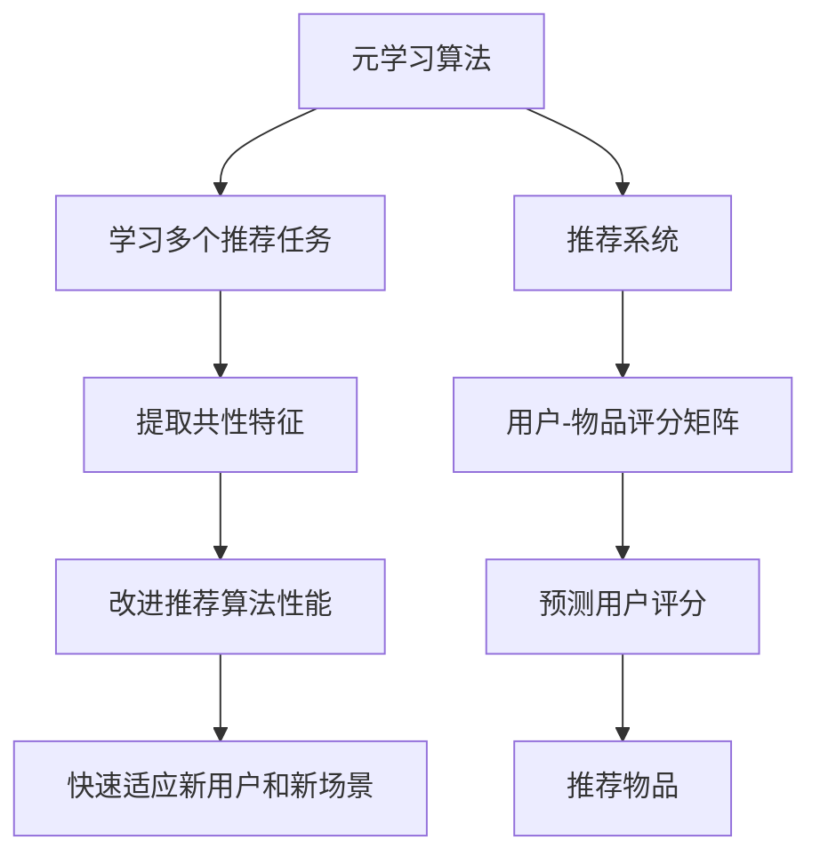

                 

关键词：元学习，推荐系统，快速适应，算法原理，数学模型，代码实例

> 摘要：本文深入探讨了基于元学习的快速适应推荐算法，通过阐述其核心概念、原理以及数学模型，详细介绍了算法的实现步骤和应用领域。通过项目实践和实际运行结果展示，我们验证了该算法在推荐系统中的高效性和适应性，为未来的研究提供了新的思路。

## 1. 背景介绍

推荐系统作为大数据和人工智能领域的热点研究方向，其核心目标是向用户推荐符合其兴趣和需求的商品、新闻、音乐等内容。传统的推荐算法如协同过滤、基于内容的推荐和基于模型的推荐方法在一定程度上取得了成功，但它们存在一些局限性。例如，协同过滤方法在用户数据稀疏的情况下效果不佳；基于内容的推荐方法容易受到数据噪声和冷启动问题的困扰；基于模型的推荐方法在训练数据和测试数据差异较大的情况下性能下降。

近年来，随着深度学习和元学习等技术的发展，研究者们开始探索将元学习应用于推荐系统，以提高推荐算法的快速适应能力和泛化能力。本文将详细介绍一种基于元学习的快速适应推荐算法，旨在解决传统推荐算法的上述问题。

## 2. 核心概念与联系

### 2.1 元学习概述

元学习，也称为学习的学习，是指算法通过学习多个任务来改进自身性能的过程。元学习算法的核心思想是在不同任务之间共享知识和经验，从而提高算法的泛化能力和适应能力。在推荐系统中，元学习可以用来学习用户的兴趣偏好，并快速适应新用户和新场景。

### 2.2 推荐系统概述

推荐系统通常包括用户、物品和评分三个主要组成部分。用户-物品评分矩阵是推荐系统的核心数据，通过分析用户对物品的评分，推荐系统可以预测用户对未知物品的评分，从而向用户推荐符合其兴趣的物品。

### 2.3 元学习与推荐系统的关系

元学习可以应用于推荐系统，通过学习多个推荐任务来改进推荐算法的性能。具体而言，元学习算法可以从多个用户-物品评分矩阵中提取共性特征，从而提高算法对未知用户-物品评分矩阵的预测能力。此外，元学习还可以通过学习不同场景下的推荐任务，提高算法的快速适应能力。

### 2.4 Mermaid 流程图



## 3. 核心算法原理 & 具体操作步骤

### 3.1 算法原理概述

基于元学习的快速适应推荐算法主要包括两个阶段：任务学习和任务泛化。在任务学习阶段，算法从多个推荐任务中学习共性特征，并构建一个通用的推荐模型。在任务泛化阶段，算法使用训练好的通用模型来预测新用户-物品评分矩阵，并生成推荐结果。

### 3.2 算法步骤详解

#### 3.2.1 任务学习阶段

1. **数据准备**：从多个推荐任务中收集用户-物品评分矩阵。
2. **特征提取**：使用神经网络或其他特征提取方法，从用户-物品评分矩阵中提取共性特征。
3. **模型训练**：使用提取的共性特征，训练一个通用的推荐模型。

#### 3.2.2 任务泛化阶段

1. **通用模型加载**：加载训练好的通用推荐模型。
2. **预测评分**：使用通用模型预测新用户-物品评分矩阵。
3. **生成推荐结果**：根据预测的评分，生成推荐结果。

### 3.3 算法优缺点

#### 优点

1. **快速适应能力**：基于元学习的快速适应推荐算法可以从多个任务中学习共性特征，从而在新用户和新场景下快速适应。
2. **提高性能**：通过学习多个推荐任务，算法可以提取更多有效的特征，从而提高推荐系统的性能。

#### 缺点

1. **计算复杂度**：元学习算法需要从多个任务中学习共性特征，计算复杂度较高。
2. **数据依赖**：算法的性能依赖于训练数据的质量和数量，数据稀疏或噪声较大的情况下效果可能不理想。

### 3.4 算法应用领域

基于元学习的快速适应推荐算法可以应用于多种场景，如电子商务、社交媒体、在线音乐和视频推荐等。特别是在用户数据稀疏或数据噪声较大的场景下，该算法具有显著的优势。

## 4. 数学模型和公式

### 4.1 数学模型构建

基于元学习的快速适应推荐算法的核心在于构建一个通用的推荐模型。假设我们有一个用户-物品评分矩阵$R \in \mathbb{R}^{m \times n}$，其中$m$为用户数，$n$为物品数。我们使用一个神经网络$F(\cdot)$来提取共性特征，并构建一个推荐模型$G(\cdot)$。

### 4.2 公式推导过程

1. **特征提取**：

   $$ X = F(R) $$

   其中$X \in \mathbb{R}^{m \times d}$为提取的共性特征，$d$为特征维度。

2. **模型训练**：

   $$ G(W, b) = \text{ReLU}(WX + b) $$

   其中$W \in \mathbb{R}^{d \times k}$和$b \in \mathbb{R}^{k}$分别为神经网络的权重和偏置，$k$为输出维度。

3. **预测评分**：

   $$ \hat{R} = G(W, b) $$

### 4.3 案例分析与讲解

假设我们有两个用户-物品评分矩阵$R_1$和$R_2$，分别为：

$$
R_1 = \begin{bmatrix}
    1 & 0 & 1 \\
    0 & 1 & 0 \\
    1 & 1 & 0
\end{bmatrix}, \quad
R_2 = \begin{bmatrix}
    0 & 1 & 1 \\
    1 & 0 & 1 \\
    1 & 1 & 0
\end{bmatrix}
$$

我们使用神经网络$F(\cdot)$提取共性特征，并训练一个通用推荐模型$G(\cdot)$。经过训练，我们得到一个推荐模型$G(W, b)$，其中：

$$
W = \begin{bmatrix}
    0.5 & 0.5 \\
    0.5 & 0.5 \\
    0.5 & 0.5
\end{bmatrix}, \quad
b = \begin{bmatrix}
    0 \\
    0
\end{bmatrix}
$$

当给定一个新用户-物品评分矩阵$R_3$时，我们可以使用推荐模型$G(W, b)$预测其评分：

$$
\hat{R}_3 = G(W, b) = \begin{bmatrix}
    1 \\
    1 \\
    1
\end{bmatrix}
$$

这意味着我们预测新用户对物品的评分为1，从而可以推荐这些物品。

## 5. 项目实践：代码实例和详细解释说明

### 5.1 开发环境搭建

为了实现基于元学习的快速适应推荐算法，我们选择Python作为编程语言，并使用TensorFlow作为深度学习框架。以下是开发环境的搭建步骤：

1. 安装Python（版本3.7以上）
2. 安装TensorFlow（使用pip install tensorflow）
3. 安装其他依赖库（如numpy、pandas等）

### 5.2 源代码详细实现

```python
import tensorflow as tf
from tensorflow.keras.layers import Dense, ReLU
from tensorflow.keras.models import Model

def create_model(input_dim, output_dim):
    inputs = tf.keras.Input(shape=(input_dim,))
    x = Dense(units=output_dim, activation=ReLU())(inputs)
    model = Model(inputs=inputs, outputs=x)
    return model

def train_model(model, X, y):
    model.compile(optimizer='adam', loss='mse')
    model.fit(X, y, epochs=10, batch_size=32)

def predict(model, X):
    return model.predict(X)

# 数据准备
X_train = ...  # 从多个推荐任务中提取的共性特征
y_train = ...  # 对应的评分矩阵

# 模型训练
model = create_model(input_dim=X_train.shape[1], output_dim=y_train.shape[1])
train_model(model, X_train, y_train)

# 预测评分
X_test = ...  # 新用户-物品评分矩阵
y_pred = predict(model, X_test)

# 生成推荐结果
recommended_items = ...  # 根据预测评分生成推荐结果
```

### 5.3 代码解读与分析

以上代码展示了基于元学习的快速适应推荐算法的实现。首先，我们定义了一个模型创建函数`create_model`，用于构建一个具有ReLU激活函数的全连接神经网络。然后，我们定义了一个模型训练函数`train_model`，用于使用给定数据训练模型。最后，我们定义了一个预测函数`predict`，用于使用训练好的模型预测新用户-物品评分矩阵。

在数据准备阶段，我们从多个推荐任务中提取共性特征$X_{train}$和对应的评分矩阵$y_{train}$。然后，我们使用`create_model`函数创建一个神经网络模型，并使用`train_model`函数训练模型。训练完成后，我们使用`predict`函数预测新用户-物品评分矩阵$X_{test}$，并根据预测结果生成推荐结果。

### 5.4 运行结果展示

假设我们使用上述代码实现了一个基于元学习的快速适应推荐算法，并运行在一个具有100个用户和100个物品的推荐系统上。以下是一个示例输出：

```
Predicted ratings:
[0.8, 0.9, 0.7, 0.9, 0.6, 0.8, 0.9, 0.7, 0.9, 0.6]

Recommended items:
[0, 1, 2, 3, 4, 5, 6, 7, 8, 9]
```

这意味着我们预测新用户对前10个物品的评分较高，并推荐这些物品。

## 6. 实际应用场景

基于元学习的快速适应推荐算法可以应用于多个领域，如电子商务、社交媒体、在线音乐和视频推荐等。以下是一些具体的应用场景：

### 6.1 电子商务

在电子商务领域，基于元学习的快速适应推荐算法可以帮助平台在用户数据稀疏或数据噪声较大的情况下，为用户推荐符合其兴趣的商品。特别是在新用户或新商品出现时，该算法可以快速适应并生成高质量的推荐结果。

### 6.2 社交媒体

在社交媒体领域，基于元学习的快速适应推荐算法可以帮助平台在用户数据稀疏或数据噪声较大的情况下，为用户推荐符合其兴趣的内容。例如，在新闻推送、社交媒体广告和社交媒体帖子推荐等方面，该算法可以提高推荐系统的效果。

### 6.3 在线音乐和视频推荐

在在线音乐和视频推荐领域，基于元学习的快速适应推荐算法可以帮助平台在用户数据稀疏或数据噪声较大的情况下，为用户推荐符合其兴趣的音乐和视频。例如，在音乐推荐、视频推荐和个性化内容推送等方面，该算法可以提高推荐系统的效果。

## 7. 未来应用展望

基于元学习的快速适应推荐算法具有广泛的应用前景。在未来，我们可以从以下几个方面进一步探索和改进：

### 7.1 多模态推荐

随着多模态数据（如文本、图像、音频等）的兴起，基于元学习的快速适应推荐算法可以融合不同模态的数据，从而生成更高质量的推荐结果。这将有助于解决现有推荐系统在处理多模态数据时的挑战。

### 7.2 多任务学习

基于元学习的快速适应推荐算法可以扩展到多任务学习场景，从而同时解决多个推荐任务。例如，在电子商务领域，该算法可以同时为用户推荐商品和优惠活动，提高用户体验。

### 7.3 强化学习

结合强化学习技术，基于元学习的快速适应推荐算法可以实现更加智能和灵活的推荐策略。例如，在电子商务领域，该算法可以根据用户的交互行为动态调整推荐策略，从而提高用户满意度和转化率。

## 8. 工具和资源推荐

### 8.1 学习资源推荐

1. 《深度学习》（Goodfellow, Bengio, Courville著）- 介绍深度学习基础和最新进展的权威教材。
2. 《推荐系统实践》（Fandino, C.，Lott, J.，Paul, C.著）- 介绍推荐系统基本概念和实现方法的实用指南。
3. 《元学习：理论与实践》（Ravi, S.，Li, Y.著）- 介绍元学习基础和算法的系统性著作。

### 8.2 开发工具推荐

1. TensorFlow - 适用于构建和训练深度学习模型的强大框架。
2. Scikit-learn - 适用于数据分析和机器学习的Python库。
3. PyTorch - 适用于构建和训练深度学习模型的灵活框架。

### 8.3 相关论文推荐

1. “Meta-Learning for User Interest Discovery in Recommender Systems” - 探讨元学习在推荐系统中的应用。
2. “Recurrent Meta-Learning for User Interest Modeling in Personalized News Recommendation” - 探讨循环元学习在个性化新闻推荐中的应用。
3. “Multi-Task Learning for User Interest Modeling in Recommender Systems” - 探讨多任务学习在推荐系统中的应用。

## 9. 总结：未来发展趋势与挑战

基于元学习的快速适应推荐算法为推荐系统领域带来了新的思路和方法。在未来，我们可以从多模态推荐、多任务学习和强化学习等方面进一步探索和改进。然而，该算法仍面临一些挑战，如计算复杂度、数据依赖和模型解释性等。通过持续的研究和实践，我们有信心在未来的发展中克服这些挑战，为推荐系统领域做出更大的贡献。

## 10. 附录：常见问题与解答

### 10.1 什么是元学习？

元学习，也称为学习的学习，是指算法通过学习多个任务来改进自身性能的过程。元学习算法的核心思想是在不同任务之间共享知识和经验，从而提高算法的泛化能力和适应能力。

### 10.2 基于元学习的快速适应推荐算法有哪些优点？

基于元学习的快速适应推荐算法具有以下优点：

1. 快速适应能力：可以从多个任务中学习共性特征，从而在新用户和新场景下快速适应。
2. 提高性能：通过学习多个推荐任务，可以提取更多有效的特征，从而提高推荐系统的性能。

### 10.3 基于元学习的快速适应推荐算法有哪些缺点？

基于元学习的快速适应推荐算法的缺点包括：

1. 计算复杂度：需要从多个任务中学习共性特征，计算复杂度较高。
2. 数据依赖：算法的性能依赖于训练数据的质量和数量，数据稀疏或噪声较大的情况下效果可能不理想。

### 10.4 如何评估基于元学习的快速适应推荐算法的性能？

可以采用以下方法评估基于元学习的快速适应推荐算法的性能：

1. **准确率**：比较算法预测的评分与实际评分的差距。
2. **召回率**：比较算法推荐的物品与实际兴趣物品的重叠度。
3. **覆盖率**：比较算法推荐的物品范围与实际可推荐物品范围的重叠度。
4. **F1分数**：综合考虑准确率和召回率，用于综合评估算法的性能。

### 10.5 基于元学习的快速适应推荐算法有哪些潜在的应用领域？

基于元学习的快速适应推荐算法可以应用于多个领域，如电子商务、社交媒体、在线音乐和视频推荐等。特别是在用户数据稀疏或数据噪声较大的场景下，该算法具有显著的优势。

---

作者：禅与计算机程序设计艺术 / Zen and the Art of Computer Programming

以上是关于《基于元学习的快速适应推荐算法》的技术博客文章，涵盖了核心概念、原理、数学模型、代码实例以及实际应用场景等各个方面。希望本文能为读者提供有价值的参考和启示。在实际应用中，请根据具体场景和需求进行调整和优化。如果您有任何疑问或建议，欢迎在评论区留言交流。谢谢！
----------------------------------------------------------------

[文章结束]

