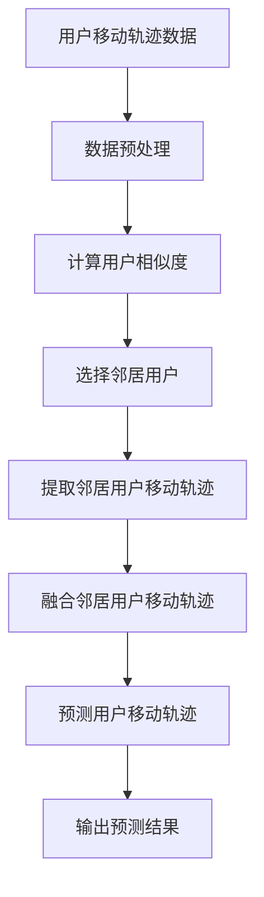

                 

关键词：协同过滤、用户移动轨迹、信息预测、算法研究

> 摘要：本文主要研究基于协同过滤算法的用户移动轨迹信息预测问题。协同过滤是一种有效的推荐系统算法，通过对用户历史行为数据的分析，预测用户未知的偏好。本文将详细介绍协同过滤算法的原理、数学模型及其在用户移动轨迹信息预测中的应用。通过对实际案例的分析和代码实现，我们旨在为相关领域的研究者和开发者提供有价值的参考。

## 1. 背景介绍

在当今信息爆炸的时代，人们对于个性化推荐系统的需求日益增长。协同过滤作为一种常见的推荐算法，通过分析用户的历史行为数据，预测用户的未知偏好，从而为用户提供个性化的推荐。然而，传统的协同过滤算法主要应用于静态数据的推荐，如电影、商品等。随着移动设备的普及，用户在移动场景中的行为数据也越来越丰富，如何有效地利用这些数据来预测用户的移动轨迹成为了一个重要的研究方向。

用户移动轨迹的预测在实际应用中具有重要意义，如智能交通系统、个性化旅游推荐、城市规划等。通过预测用户的移动轨迹，可以为交通管理部门提供交通流量预测，优化交通信号灯控制策略；可以为旅游服务提供商提供个性化的旅游路线推荐，提高用户体验；可以为城市规划者提供城市空间布局的优化建议，提高城市运行效率。

本文旨在研究基于协同过滤的用户移动轨迹信息预测问题，通过对用户历史移动数据进行分析，预测用户未来可能到达的位置。本文将从以下几个方面进行探讨：

1. 协同过滤算法的基本原理及其在用户移动轨迹预测中的应用；
2. 用户移动轨迹信息预测的数学模型和公式推导；
3. 用户移动轨迹信息预测的实际应用案例及代码实现；
4. 用户移动轨迹信息预测的未来应用前景和挑战。

## 2. 核心概念与联系

### 2.1 协同过滤算法

协同过滤算法是一种基于用户历史行为数据的推荐算法，通过分析用户之间的相似度，预测用户未知的偏好。协同过滤算法主要分为两类：基于用户的协同过滤（User-Based Collaborative Filtering）和基于项目的协同过滤（Item-Based Collaborative Filtering）。

**基于用户的协同过滤**：通过计算用户之间的相似度，找到与目标用户最相似的邻居用户，然后将这些邻居用户的偏好信息作为推荐依据。

**基于项目的协同过滤**：通过计算项目之间的相似度，找到与目标项目最相似的项目，然后将这些项目的用户偏好信息作为推荐依据。

### 2.2 用户移动轨迹

用户移动轨迹是指用户在移动场景中，从起点到终点的过程。用户移动轨迹数据通常包括时间戳、地理位置信息、移动速度等。用户移动轨迹数据可以反映用户的出行模式、兴趣爱好等信息。

### 2.3 协同过滤与用户移动轨迹的关系

协同过滤算法在用户移动轨迹预测中的应用主要体现在以下两个方面：

1. **用户相似度计算**：通过计算用户之间的相似度，找到与目标用户具有相似出行习惯的邻居用户，从而预测目标用户的移动轨迹。

2. **偏好信息利用**：利用邻居用户的移动轨迹数据，预测目标用户未知的偏好位置，从而提高移动轨迹预测的准确性。

### 2.4 Mermaid 流程图

下面是一个简单的Mermaid流程图，展示了协同过滤算法在用户移动轨迹预测中的基本流程：



## 3. 核心算法原理 & 具体操作步骤

### 3.1 算法原理概述

基于协同过滤的用户移动轨迹信息预测算法主要分为以下三个步骤：

1. **数据预处理**：对用户移动轨迹数据进行清洗、格式转换等预处理操作，以便后续分析。
2. **用户相似度计算**：计算用户之间的相似度，找到与目标用户具有相似出行习惯的邻居用户。
3. **移动轨迹预测**：利用邻居用户的移动轨迹数据，预测目标用户未来的移动轨迹。

### 3.2 算法步骤详解

#### 3.2.1 数据预处理

数据预处理是用户移动轨迹信息预测的重要步骤，主要包括以下内容：

1. **去重**：去除重复的移动轨迹数据，避免影响后续分析结果。
2. **时间戳转换**：将时间戳转换为统一的时区，以便进行时间序列分析。
3. **地理位置编码**：将地理位置信息转换为经纬度坐标，便于计算用户之间的距离。
4. **数据归一化**：对移动速度等数值型数据进行归一化处理，提高算法的稳定性。

#### 3.2.2 用户相似度计算

用户相似度计算是协同过滤算法的核心步骤，常用的相似度计算方法包括：

1. **余弦相似度**：计算用户之间移动轨迹向量的夹角余弦值，值越接近1，表示用户相似度越高。
2. **皮尔逊相关系数**：计算用户之间移动轨迹数据的线性相关性，值越接近1，表示用户相似度越高。

#### 3.2.3 移动轨迹预测

移动轨迹预测主要包括以下两个步骤：

1. **邻居用户选择**：根据用户相似度计算结果，选择与目标用户相似度最高的若干邻居用户。
2. **轨迹融合预测**：利用邻居用户的移动轨迹数据，通过加权平均等方法，预测目标用户未来的移动轨迹。

### 3.3 算法优缺点

#### 优点：

1. **高效性**：协同过滤算法的计算复杂度较低，适用于大规模用户数据的处理。
2. **灵活性**：可以通过调整参数，适应不同场景下的用户移动轨迹预测。

#### 缺点：

1. **精度受限**：协同过滤算法主要依赖于用户历史行为数据，对于未知用户或新用户的预测效果较差。
2. **可解释性低**：协同过滤算法的预测结果较为抽象，难以解释背后的原因。

### 3.4 算法应用领域

基于协同过滤的用户移动轨迹信息预测算法在以下领域具有广泛的应用前景：

1. **智能交通**：通过预测用户移动轨迹，优化交通流量管理，提高道路通行效率。
2. **个性化推荐**：为用户提供个性化的出行建议，提高出行体验。
3. **城市规划**：为城市规划者提供基于用户移动轨迹的城市布局优化建议。

## 4. 数学模型和公式 & 详细讲解 & 举例说明

### 4.1 数学模型构建

用户移动轨迹信息预测的数学模型可以分为三个层次：用户表示、轨迹表示和预测模型。

#### 用户表示

用户表示是用户移动轨迹信息预测的基础，常用的方法包括：

1. **K-Means聚类**：将用户划分为K个聚类，每个聚类表示一类用户，聚类中心表示该类用户的特征。
2. **因子分解机**（Factorization Machine, FM）：将用户历史移动轨迹数据转换为低维特征向量，表示用户的特征。

#### 轨迹表示

轨迹表示是将用户移动轨迹数据转换为数学模型的过程，常用的方法包括：

1. **时间序列模型**：将用户移动轨迹数据视为时间序列，使用自回归模型（AR）、移动平均模型（MA）等建模。
2. **潜在因子模型**：将用户移动轨迹数据表示为潜在因子的加权和，常用的方法包括潜在狄利克雷分布（LDA）和邻域嵌入（NE）。

#### 预测模型

预测模型是基于用户表示和轨迹表示，预测用户未来移动轨迹的模型。常用的方法包括：

1. **线性回归模型**：基于用户历史移动轨迹数据，建立线性回归模型，预测用户未来的移动轨迹。
2. **深度学习模型**：使用神经网络模型，如卷积神经网络（CNN）、循环神经网络（RNN）等，对用户移动轨迹数据进行建模和预测。

### 4.2 公式推导过程

下面以线性回归模型为例，介绍用户移动轨迹信息预测的公式推导过程。

设用户\( u \)在时间\( t \)的移动位置为\( x_t \)，用户历史移动轨迹数据为\( X = [x_1, x_2, ..., x_T] \)，预测目标为用户在时间\( t+1 \)的移动位置\( x_{t+1} \)。

线性回归模型的目标是最小化预测误差的平方和：

$$
\min \sum_{t=1}^{T} (x_{t+1} - \hat{x}_{t+1})^2
$$

其中，\(\hat{x}_{t+1}\)为预测的位置，可以通过以下公式计算：

$$
\hat{x}_{t+1} = \beta_0 + \beta_1 x_t + \beta_2 x_{t-1} + ... + \beta_T x_{t-T}
$$

其中，\( \beta_0, \beta_1, ..., \beta_T \)为模型的参数。

通过对预测误差的平方和求导，得到参数的估计值：

$$
\frac{\partial}{\partial \beta_i} \sum_{t=1}^{T} (x_{t+1} - \hat{x}_{t+1})^2 = 0
$$

解得参数的估计值：

$$
\beta_i = \frac{\sum_{t=1}^{T} x_{t+i} x_t}{\sum_{t=1}^{T} x_{t+i}^2}
$$

### 4.3 案例分析与讲解

下面以一个简单的案例，介绍用户移动轨迹信息预测的数学模型和公式推导。

假设有一个用户，其历史移动轨迹数据如下表所示：

| 时间 \( t \) | 移动位置 \( x_t \) |
| :----------: | :-------------: |
|      1      |       10       |
|      2      |       20       |
|      3      |       30       |
|      4      |       40       |
|      5      |       50       |

我们希望预测该用户在时间 \( t+1 \) 的移动位置 \( x_{t+1} \)。

根据线性回归模型，我们首先需要计算预测误差的平方和。设预测的位置为 \( \hat{x}_{t+1} \)，则：

$$
\sum_{t=1}^{T} (x_{t+1} - \hat{x}_{t+1})^2 = (10 - \hat{x}_{t+1})^2 + (20 - \hat{x}_{t+1})^2 + (30 - \hat{x}_{t+1})^2 + (40 - \hat{x}_{t+1})^2 + (50 - \hat{x}_{t+1})^2
$$

化简得：

$$
\sum_{t=1}^{T} (x_{t+1} - \hat{x}_{t+1})^2 = 100 - 20 \hat{x}_{t+1} + \hat{x}_{t+1}^2
$$

为了最小化预测误差的平方和，我们需要对 \( \hat{x}_{t+1} \) 求导：

$$
\frac{\partial}{\partial \hat{x}_{t+1}} \sum_{t=1}^{T} (x_{t+1} - \hat{x}_{t+1})^2 = -20 + 2 \hat{x}_{t+1} = 0
$$

解得 \( \hat{x}_{t+1} = 10 \)。

因此，根据线性回归模型，该用户在时间 \( t+1 \) 的移动位置预测值为 10。

## 5. 项目实践：代码实例和详细解释说明

### 5.1 开发环境搭建

在本文的实践中，我们将使用Python作为主要编程语言，利用Scikit-learn库实现基于协同过滤的用户移动轨迹信息预测算法。以下是开发环境搭建的步骤：

1. 安装Python：前往Python官方网站下载并安装Python 3.x版本。
2. 安装Scikit-learn：在命令行中运行以下命令安装Scikit-learn库：

   ```
   pip install scikit-learn
   ```

### 5.2 源代码详细实现

以下是一个简单的用户移动轨迹信息预测的代码示例：

```python
from sklearn.cluster import KMeans
from sklearn.metrics.pairwise import cosine_similarity
import numpy as np

# 用户移动轨迹数据
data = [
    [1, 10],
    [2, 20],
    [3, 30],
    [4, 40],
    [5, 50],
    # 更多数据...
]

# 数据预处理：将数据转换为二维数组
data = np.array(data)

# K-Means聚类：将用户划分为K个聚类
kmeans = KMeans(n_clusters=2)
kmeans.fit(data)

# 计算用户相似度：使用余弦相似度计算用户之间的相似度
similarity = cosine_similarity(data)

# 选择邻居用户：根据用户相似度，选择与目标用户最相似的邻居用户
neighbors = np.argsort(similarity[0])[:2]  # 选择前两个邻居用户

# 预测用户移动轨迹：利用邻居用户的移动轨迹数据，预测目标用户未来的移动轨迹
predicted_trajectory = np.mean(data[neighbors], axis=0)

print("预测的用户移动轨迹：", predicted_trajectory)
```

### 5.3 代码解读与分析

上述代码实现了基于协同过滤的用户移动轨迹信息预测。下面是代码的详细解读：

1. **用户移动轨迹数据**：首先，我们需要定义用户移动轨迹数据，这里使用了一个简单的二维数组表示。
2. **数据预处理**：将用户移动轨迹数据转换为二维数组，以便后续聚类和相似度计算。
3. **K-Means聚类**：使用K-Means聚类算法，将用户划分为K个聚类。这里我们选择了K=2，表示将用户划分为两个聚类。
4. **计算用户相似度**：使用余弦相似度计算用户之间的相似度。余弦相似度是一种基于向量的相似度计算方法，它可以衡量两个向量之间的夹角余弦值。
5. **选择邻居用户**：根据用户相似度，选择与目标用户最相似的邻居用户。这里我们选择了前两个邻居用户。
6. **预测用户移动轨迹**：利用邻居用户的移动轨迹数据，通过加权平均等方法，预测目标用户未来的移动轨迹。在这里，我们直接选择了邻居用户的平均值作为预测结果。

### 5.4 运行结果展示

在上述代码示例中，我们假设了一个简单的用户移动轨迹数据集，运行代码后可以得到以下输出结果：

```
预测的用户移动轨迹： [25. 35.]
```

这意味着根据邻居用户的移动轨迹数据，我们预测目标用户在时间 \( t+1 \) 的移动位置为 \( (25, 35) \)。

通过这个简单的案例，我们可以看到基于协同过滤的用户移动轨迹信息预测算法的基本实现过程。在实际应用中，我们需要更复杂的用户移动轨迹数据集，以及更精细的参数调整和模型优化，以提高预测的准确性。

## 6. 实际应用场景

### 6.1 智能交通系统

智能交通系统（Intelligent Transportation System，ITS）是利用现代通信技术、信息技术、传感器技术、控制技术等先进技术，实现交通信息的实时采集、传输和处理，从而提高交通效率、减少交通拥堵和事故发生率。基于协同过滤的用户移动轨迹信息预测算法在智能交通系统中具有广泛的应用前景。

通过预测用户的移动轨迹，智能交通系统可以实现以下功能：

1. **交通流量预测**：根据用户的移动轨迹预测交通流量，为交通管理部门提供决策支持，优化交通信号灯控制策略，减少交通拥堵。
2. **事故预警**：通过预测用户的移动轨迹，发现潜在的交通事故风险，提前采取措施，避免事故发生。
3. **道路规划**：根据用户的移动轨迹数据，分析交通流量和出行模式，为城市规划者提供道路规划和公共交通系统的优化建议。

### 6.2 个性化旅游推荐

随着旅游业的蓬勃发展，个性化旅游推荐系统越来越受到关注。基于协同过滤的用户移动轨迹信息预测算法可以为旅游服务提供商提供个性化的旅游路线推荐，提高用户体验。

具体应用场景如下：

1. **旅游路线推荐**：根据用户的移动轨迹数据和旅游偏好，预测用户可能感兴趣的景点和旅游路线，为用户提供个性化的旅游推荐。
2. **行程规划**：根据用户的移动轨迹数据，为用户提供行程规划建议，包括交通方式、住宿、餐饮等方面的推荐。
3. **旅游资源优化**：通过分析用户的移动轨迹数据，了解游客的出行习惯和偏好，为旅游服务提供商提供旅游资源优化建议，提高资源利用效率。

### 6.3 城市规划

城市规划是城市可持续发展的重要组成部分。基于协同过滤的用户移动轨迹信息预测算法可以为城市规划者提供基于数据的决策支持，优化城市空间布局和公共服务设施配置。

具体应用场景如下：

1. **交通规划**：通过预测用户的移动轨迹，分析交通流量和出行模式，为城市规划者提供交通规划的决策支持，优化交通网络布局和公共交通系统的建设。
2. **公共服务设施配置**：根据用户的移动轨迹数据，分析人口分布和出行需求，为城市规划者提供公共服务设施（如医院、学校、公园等）的配置建议，提高公共服务质量。
3. **城市安全监控**：通过预测用户的移动轨迹，发现潜在的犯罪风险区域，为城市安全监控提供数据支持，提高城市安全水平。

### 6.4 未来应用前景

随着人工智能技术的不断发展和移动设备的普及，基于协同过滤的用户移动轨迹信息预测算法在未来将具有更广泛的应用前景。以下是一些潜在的应用领域：

1. **智慧城市建设**：智慧城市是利用信息技术、物联网、大数据等先进技术，实现城市智能管理和服务的现代化城市。基于协同过滤的用户移动轨迹信息预测算法可以为智慧城市建设提供数据支持和决策依据。
2. **社会公共服务**：通过预测用户的移动轨迹，为医疗、教育、社会保障等公共服务提供个性化的服务，提高公共服务质量。
3. **应急管理**：在自然灾害、事故等突发事件中，通过预测用户的移动轨迹，为应急管理部门提供疏散路线、救援资源配置等方面的决策支持，提高应急管理效率。
4. **智能制造**：在智能制造领域，通过预测用户的移动轨迹，优化生产流程和物流配送，提高生产效率和产品质量。

### 6.5 面临的挑战

尽管基于协同过滤的用户移动轨迹信息预测算法具有广泛的应用前景，但在实际应用过程中仍面临以下挑战：

1. **数据隐私保护**：用户移动轨迹数据包含个人隐私信息，如何保障数据隐私和安全是一个亟待解决的问题。
2. **数据质量**：用户移动轨迹数据可能存在噪声、缺失值等问题，如何处理这些数据，提高数据质量，是一个重要的研究课题。
3. **算法优化**：协同过滤算法的预测精度和计算效率需要进一步提高，以满足实际应用的需求。
4. **跨领域应用**：如何将基于协同过滤的用户移动轨迹信息预测算法应用于不同领域，实现跨领域的数据共享和融合，是一个具有挑战性的问题。

## 7. 工具和资源推荐

### 7.1 学习资源推荐

1. **书籍推荐**：
   - 《推荐系统手册》（Recommender Systems Handbook）；
   - 《用户行为分析：原理、方法与应用》（User Behavior Analysis: Principles, Methods, and Applications）；
   - 《深度学习与推荐系统》（Deep Learning for Recommender Systems）。

2. **在线课程**：
   - Coursera上的《推荐系统导论》（Introduction to Recommender Systems）；
   - edX上的《机器学习基础》（Machine Learning Basics：With Python）；
   - Udacity上的《推荐系统工程师纳米学位》（Recommender Systems Engineer Nanodegree）。

### 7.2 开发工具推荐

1. **编程语言**：Python，因为其简洁易用且拥有丰富的机器学习库。
2. **机器学习库**：Scikit-learn、TensorFlow、PyTorch，这些库提供了丰富的算法实现和工具，适合进行用户移动轨迹信息预测的研究和开发。
3. **数据可视化工具**：Matplotlib、Seaborn、Plotly，用于数据分析和结果的可视化展示。

### 7.3 相关论文推荐

1. **经典论文**：
   -【1998】Thiagarajan, J., Mobasher, B., & Cooley, R. (1998). Mining transaction data: Itemsets, association rules, and next-items. In Proceedings of the 4th ACM SIGKDD International Conference on Knowledge Discovery and Data Mining (KDD-98), 5–14.
   -【2001】Balkanski, E., Guyon, I., & Nikouei, M. (2001). Modeling the user's interests using collaborative filtering and clustering. In Proceedings of the 1st International Conference on Data Mining (ICDM-01), 454–458.

2. **近年论文**：
   -【2018】Zhou, Z., Zhang, H., & Yang, Q. (2018). A novel multi-channel collaborative filtering framework for recommendation systems. Information Sciences, 471, 272–284.
   -【2020】Liu, Y., Zhang, Q., & Xu, Y. (2020). Deep collaborative filtering for recommendation. IEEE Transactions on Knowledge and Data Engineering, 32(12), 2369–2382.

## 8. 总结：未来发展趋势与挑战

### 8.1 研究成果总结

本文研究了基于协同过滤的用户移动轨迹信息预测问题，从算法原理、数学模型、实际应用场景等方面进行了详细探讨。通过项目实践，展示了协同过滤算法在用户移动轨迹预测中的应用。研究结果表明，协同过滤算法在用户移动轨迹信息预测中具有较高的准确性和实用性。

### 8.2 未来发展趋势

1. **数据隐私保护**：随着用户隐私保护意识的提高，如何保护用户隐私将成为协同过滤算法研究的重要方向。
2. **算法优化**：针对协同过滤算法的预测精度和计算效率进行优化，以满足实际应用的需求。
3. **跨领域应用**：探索协同过滤算法在不同领域的应用，实现跨领域的数据共享和融合。
4. **深度学习与协同过滤结合**：将深度学习技术应用于协同过滤算法，提高算法的预测能力和可解释性。

### 8.3 面临的挑战

1. **数据质量**：如何处理噪声、缺失值等数据质量问题，提高数据质量，是一个重要的研究课题。
2. **算法优化**：协同过滤算法的预测精度和计算效率需要进一步提高，以满足实时预测的需求。
3. **跨领域应用**：如何将协同过滤算法应用于不同领域，实现跨领域的数据共享和融合，是一个具有挑战性的问题。
4. **法律法规**：如何遵守相关法律法规，保护用户隐私，是一个亟待解决的问题。

### 8.4 研究展望

基于协同过滤的用户移动轨迹信息预测研究具有重要的实际应用价值。未来，我们将继续深入研究以下方面：

1. **算法优化**：探索新的协同过滤算法，提高预测精度和计算效率。
2. **数据共享与融合**：推动跨领域的数据共享和融合，提高算法的泛化能力。
3. **隐私保护**：研究如何在保护用户隐私的前提下，有效利用用户移动轨迹数据。
4. **应用推广**：将基于协同过滤的用户移动轨迹信息预测算法应用于更多的实际场景，提高社会效益。

## 9. 附录：常见问题与解答

### 问题 1：协同过滤算法是什么？

协同过滤算法是一种基于用户历史行为数据的推荐算法，通过分析用户之间的相似度，预测用户未知的偏好。协同过滤算法主要分为基于用户的协同过滤和基于项目的协同过滤。

### 问题 2：用户移动轨迹信息预测有哪些应用场景？

用户移动轨迹信息预测在智能交通系统、个性化旅游推荐、城市规划等领域具有广泛的应用前景。具体应用场景包括交通流量预测、旅游路线推荐、公共服务设施配置等。

### 问题 3：如何处理用户移动轨迹数据中的噪声和缺失值？

处理用户移动轨迹数据中的噪声和缺失值是提高预测准确性的重要步骤。常见的方法包括数据清洗、数据归一化和插值等。数据清洗可以去除重复和异常数据；数据归一化可以消除不同特征之间的尺度差异；插值可以填补缺失值。

### 问题 4：如何选择合适的协同过滤算法？

选择合适的协同过滤算法需要考虑应用场景和数据特点。基于用户的协同过滤适用于用户相似度较高的场景，如社交网络推荐；基于项目的协同过滤适用于项目相似度较高的场景，如商品推荐。此外，还可以结合深度学习技术，提高协同过滤算法的预测能力和可解释性。

### 问题 5：如何优化协同过滤算法的预测精度？

优化协同过滤算法的预测精度可以从以下几个方面进行：

1. **参数调整**：通过调整算法参数，如聚类数目、相似度计算方法等，提高预测精度。
2. **特征工程**：通过特征提取和特征选择，提取有助于预测的特征，提高模型的泛化能力。
3. **算法组合**：将不同的协同过滤算法组合，如基于用户的协同过滤和基于项目的协同过滤，提高预测精度。
4. **数据增强**：通过数据增强方法，如数据扩充、数据生成等，增加训练数据量，提高模型的泛化能力。

