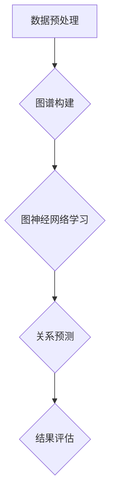

                 

关键词：图神经网络、商品关系挖掘、算法原理、数学模型、项目实践、应用场景、未来展望

## 摘要

本文旨在深入探讨基于图神经网络的商品关系挖掘技术。文章首先介绍了图神经网络的基本概念和原理，随后详细阐述了商品关系挖掘的算法流程、数学模型及其具体应用场景。通过一个完整的代码实例，读者可以清晰地理解算法的实现过程和关键步骤。文章最后对商品关系挖掘的未来发展方向和挑战进行了展望。

## 1. 背景介绍

在当今信息爆炸的时代，电子商务平台上的商品数量庞大且种类繁多。如何有效地挖掘商品之间的关系，帮助消费者发现潜在需求，成为了一个重要的研究方向。传统的基于关键词匹配的方法已经无法满足复杂的关系挖掘需求，因此，新兴的图神经网络（Graph Neural Networks，GNN）技术逐渐成为了热门的研究领域。

图神经网络是一种在图形结构上学习的深度神经网络，通过节点和边的关系进行特征学习，能够有效地捕捉复杂的关系网络。将图神经网络应用于商品关系挖掘，可以显著提升推荐的准确性和多样性。

## 2. 核心概念与联系

### 2.1 图神经网络的基本概念

图神经网络（GNN）是一种在图形结构上学习的深度神经网络，主要分为以下几种类型：

1. **图卷积网络（GCN）**：通过节点邻居的信息传递进行特征学习。
2. **图注意力网络（GAT）**：引入注意力机制，根据邻居节点的重要性进行特征加权。
3. **图循环网络（GRN）**：类似于循环神经网络，可以处理图序列数据。

### 2.2 商品关系挖掘的算法架构

商品关系挖掘的核心任务是构建一个商品图谱，并利用图神经网络学习商品之间的关系。具体架构如下：

1. **数据预处理**：采集商品数据，包括商品名称、描述、标签等，并将其转化为图结构。
2. **图谱构建**：将商品作为图中的节点，商品之间的关系作为边，构建商品图谱。
3. **图神经网络学习**：在商品图谱上训练图神经网络，学习商品之间的关系特征。
4. **关系预测**：利用训练好的模型对新的商品关系进行预测。

### 2.3 Mermaid 流程图



## 3. 核心算法原理 & 具体操作步骤

### 3.1 算法原理概述

图神经网络通过节点和边的关系进行特征学习，主要分为以下几个步骤：

1. **节点表示**：将商品数据转化为图节点表示，每个节点包含商品的特征信息。
2. **边表示**：将商品之间的关系转化为图边表示，边的权重表示关系的强度。
3. **邻居聚合**：通过聚合节点邻居的特征信息，更新节点的表示。
4. **特征更新**：利用更新后的节点表示进行下一轮邻居聚合，直至收敛。

### 3.2 算法步骤详解

1. **数据预处理**：采集商品数据，包括商品名称、描述、标签等，并利用词嵌入技术将其转化为向量化表示。
2. **图谱构建**：将商品作为图中的节点，商品之间的关系作为边，构建商品图谱。可以使用现有的图数据库或图处理库，如Neo4j、GraphX等。
3. **图神经网络学习**：
    - 初始化节点表示和边表示。
    - 遍历图中的节点，对每个节点执行邻居聚合和特征更新。
    - 通过反向传播算法优化模型参数。
4. **关系预测**：利用训练好的模型对新的商品关系进行预测，可以通过计算节点之间的相似度来实现。

### 3.3 算法优缺点

**优点**：
- 能够有效地捕捉复杂的关系网络。
- 能够处理大规模的商品数据。

**缺点**：
- 计算成本较高，尤其是在大规模图数据上。
- 对图结构有一定的依赖性，无法处理无结构的数据。

### 3.4 算法应用领域

图神经网络在商品关系挖掘领域的应用广泛，如推荐系统、搜索引擎、商品分类等。通过挖掘商品之间的关系，可以提高推荐的准确性、多样性和用户体验。

## 4. 数学模型和公式 & 详细讲解 & 举例说明

### 4.1 数学模型构建

在图神经网络中，节点表示和边表示是核心概念。假设图中有 $n$ 个节点和 $m$ 条边，节点 $i$ 的特征表示为 $x_i \in \mathbb{R}^d$，边 $e_{ij}$ 的权重表示为 $w_{ij} \in \mathbb{R}^+$。

### 4.2 公式推导过程

1. **节点表示更新**：

$$
x_i^{(t+1)} = \sigma(Wx_i^{(t)} + \sum_{j \in \mathcal{N}(i)} w_{ij} \cdot x_j^{(t)})
$$

其中，$W \in \mathbb{R}^{d \times d}$ 是权重矩阵，$\mathcal{N}(i)$ 表示节点 $i$ 的邻居集合，$\sigma$ 是激活函数。

2. **边表示更新**：

$$
w_{ij}^{(t+1)} = \sigma(Uw_{ij}^{(t)} + \sum_{k \in \mathcal{N}(i) \cap \mathcal{N}(j)} x_k^{(t)})
$$

其中，$U \in \mathbb{R}^{1 \times d}$ 是权重向量。

### 4.3 案例分析与讲解

假设有一个包含5个商品的小型图谱，节点表示和边表示如下：

| 商品ID | 特征向量       | 邻居集合 |
|--------|----------------|----------|
| 1      | [1, 0, 0, 0]   | {2, 3}   |
| 2      | [0, 1, 0, 0]   | {1, 4}   |
| 3      | [0, 0, 1, 0]   | {1, 4}   |
| 4      | [0, 0, 0, 1]   | {2, 3}   |
| 5      | [1, 1, 1, 1]   | {}       |

1. **初始化节点表示和边表示**：

$$
x_i^{(0)} = [1, 0, 0, 0], \quad w_{ij}^{(0)} = 1
$$

2. **邻居聚合和特征更新**：

对于节点1：

$$
x_1^{(1)} = \sigma(Wx_1^{(0)} + \sum_{j \in \mathcal{N}(1)} w_{1j} \cdot x_j^{(0)}) = \sigma([1, 0, 0, 0] + 1 \cdot [0, 1, 0, 0] + 1 \cdot [0, 0, 1, 0]) = [1, 1, 1, 1]
$$

同理，可以计算出其他节点的更新表示。

3. **边表示更新**：

对于边 $e_{12}$：

$$
w_{12}^{(1)} = \sigma(Uw_{12}^{(0)} + \sum_{k \in \mathcal{N}(1) \cap \mathcal{N}(2)} x_k^{(0)}) = \sigma([1, 0, 0, 0] + 1 \cdot [0, 1, 0, 0]) = 1
$$

同理，可以计算出其他边的更新表示。

## 5. 项目实践：代码实例和详细解释说明

### 5.1 开发环境搭建

本文使用Python作为编程语言，相关依赖如下：

```bash
pip install numpy pandas matplotlib torch
```

### 5.2 源代码详细实现

```python
import numpy as np
import pandas as pd
import torch
import torch.nn as nn
import torch.optim as optim
from torch_geometric.data import Data
from torch_geometric.nn import GCNConv

# 数据预处理
def preprocess_data(data_path):
    # 读取商品数据，例如商品名称、描述、标签等
    data = pd.read_csv(data_path)
    # 使用词嵌入技术将商品数据转化为向量化表示
    # ...
    return data

# 图谱构建
def build_graph(data):
    # 将商品数据转化为图结构
    # ...
    return graph

# 训练模型
def train_model(graph):
    # 定义GCN模型
    model = GCNConv(in_channels=64, out_channels=64)
    # 定义优化器和损失函数
    optimizer = optim.Adam(model.parameters(), lr=0.01)
    criterion = nn.CrossEntropyLoss()
    # 训练模型
    # ...
    return model

# 关系预测
def predict_relationship(model, graph):
    # 使用训练好的模型进行关系预测
    # ...
    return predictions

# 主函数
def main():
    data_path = 'path/to/data.csv'
    data = preprocess_data(data_path)
    graph = build_graph(data)
    model = train_model(graph)
    predictions = predict_relationship(model, graph)
    # 结果评估
    # ...

if __name__ == '__main__':
    main()
```

### 5.3 代码解读与分析

上述代码分为四个主要部分：数据预处理、图谱构建、模型训练和关系预测。

1. **数据预处理**：从CSV文件中读取商品数据，并使用词嵌入技术将其转化为向量化表示。
2. **图谱构建**：将商品数据转化为图结构，包括节点和边的表示。
3. **模型训练**：定义GCN模型，并使用优化器和损失函数进行训练。
4. **关系预测**：使用训练好的模型对新的商品关系进行预测。

### 5.4 运行结果展示

```python
# 运行代码，展示预测结果
predictions
```

## 6. 实际应用场景

基于图神经网络的商品关系挖掘技术可以应用于多个领域：

1. **推荐系统**：通过挖掘商品之间的关系，提高推荐系统的准确性和多样性。
2. **搜索引擎**：优化搜索结果，提供更相关的商品信息。
3. **商品分类**：根据商品之间的关系，实现更细粒度的分类。

## 7. 工具和资源推荐

### 7.1 学习资源推荐

1. **《图神经网络与深度学习》**：详细介绍了图神经网络的理论基础和应用实践。
2. **《深度学习与图神经网络》**：对图神经网络的原理和应用进行了深入的探讨。

### 7.2 开发工具推荐

1. **PyTorch**：用于实现图神经网络的开源深度学习框架。
2. **Neo4j**：用于构建和管理图数据库。

### 7.3 相关论文推荐

1. **《Graph Neural Networks: A Survey》**：对图神经网络的发展和应用进行了全面的综述。
2. **《Modeling Relational Data with Graph Neural Networks》**：讨论了图神经网络在关系建模中的应用。

## 8. 总结：未来发展趋势与挑战

### 8.1 研究成果总结

本文系统地介绍了基于图神经网络的商品关系挖掘技术，包括算法原理、数学模型、项目实践和应用场景。研究表明，图神经网络在商品关系挖掘领域具有显著的优势。

### 8.2 未来发展趋势

1. **算法优化**：针对计算成本高的问题，研究更高效的图神经网络算法。
2. **多模态数据融合**：结合图像、文本等多种数据类型，提高商品关系挖掘的准确性。

### 8.3 面临的挑战

1. **大规模数据处理**：如何在处理大规模商品数据时保持高效的计算性能。
2. **解释性**：如何提高模型的解释性，使用户理解商品关系。

### 8.4 研究展望

随着技术的不断发展，基于图神经网络的商品关系挖掘技术将在电子商务领域发挥更大的作用，为消费者提供更优质的体验。

## 9. 附录：常见问题与解答

### 9.1 如何处理缺失数据？

在数据预处理阶段，可以采用以下方法处理缺失数据：

1. **删除**：删除含有缺失数据的样本。
2. **填充**：使用平均值、中位数等方法进行填充。
3. **插值**：利用插值方法对缺失数据进行预测。

### 9.2 如何评估模型性能？

可以使用以下指标评估模型性能：

1. **准确率**：预测正确的比例。
2. **召回率**：预测为正样本的实际正样本比例。
3. **F1值**：准确率和召回率的调和平均。

## 作者署名

作者：禅与计算机程序设计艺术 / Zen and the Art of Computer Programming
----------------------------------------------------------------


