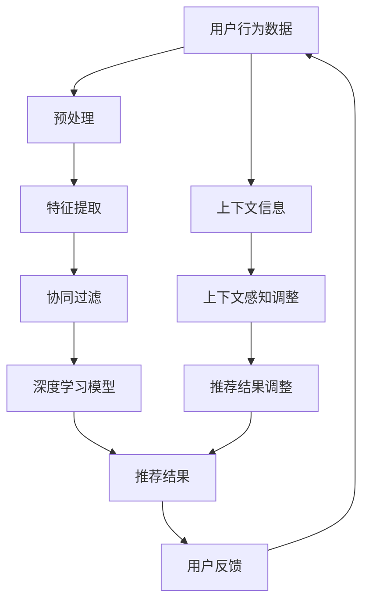

                 

关键词：推荐系统、大模型、实时个性化内容生成、深度学习、机器学习、人工智能、数据挖掘

## 摘要

本文深入探讨了基于大模型的推荐系统实时个性化内容生成技术。通过引入先进的深度学习算法和机器学习技术，本文阐述了如何构建一个高效、智能的推荐系统，以实现对用户个性化需求的精准满足。文章首先回顾了推荐系统的发展历程，然后详细介绍了大模型在推荐系统中的作用，接着讲解了实时个性化内容生成的核心算法，并探讨了其在实际应用中的效果和挑战。最后，本文提出了未来推荐系统的发展方向和潜在的研究课题。

## 1. 背景介绍

### 推荐系统的发展历程

推荐系统（Recommender Systems）是一种信息过滤技术，旨在为用户推荐他们可能感兴趣的项目，如商品、电影、音乐、新闻等。其核心思想是通过分析用户的历史行为和偏好，预测用户对未知项目的兴趣，从而提供个性化的推荐。

推荐系统的发展大致可以分为以下几个阶段：

- **基于内容的推荐（Content-Based Filtering）**：这种推荐方法基于用户过去的偏好和内容特征，对相似的内容进行推荐。其主要优点是能够推荐与用户历史偏好相似的内容，但缺点是推荐结果往往缺乏多样性。

- **协同过滤（Collaborative Filtering）**：协同过滤通过分析用户之间的相似度来推荐项目。根据相似度的计算方式，可分为基于用户的协同过滤（User-Based）和基于模型的协同过滤（Model-Based）。基于用户的协同过滤通过找到与目标用户兴趣相似的其他用户，推荐这些用户喜欢的项目；基于模型的协同过滤则通过训练一个预测模型来预测用户对项目的兴趣。

- **混合推荐（Hybrid Recommender Systems）**：混合推荐系统结合了基于内容和协同过滤的方法，旨在利用各自的优势，提高推荐系统的准确性和多样性。

### 大模型在推荐系统中的应用

随着深度学习和大数据技术的发展，大模型（Large-scale Models）开始在推荐系统中发挥重要作用。大模型具有以下特点：

- **强大的表示能力**：大模型能够通过多层神经网络学习复杂的用户行为和项目特征，从而更好地捕获用户兴趣和项目属性之间的关联。

- **端到端的训练**：大模型通常采用端到端的学习方式，直接从原始数据中学习特征表示，减少了人工特征工程的工作量。

- **自适应能力**：大模型能够根据用户行为动态调整推荐策略，更好地适应用户的实时需求。

### 实时个性化内容生成

实时个性化内容生成（Real-time Personalized Content Generation）是推荐系统的一个重要研究方向。其目标是根据用户的实时行为和偏好，动态生成个性化的内容推荐，以提高用户的满意度和系统的转化率。

实时个性化内容生成面临的主要挑战包括：

- **实时性**：推荐系统需要在短时间内处理大量的用户行为数据，并生成推荐结果。

- **个性化**：推荐系统需要根据用户的个性化需求生成独特的推荐内容。

- **多样性**：推荐系统需要保证推荐内容的多样性，以避免用户对推荐内容的疲劳和厌恶。

## 2. 核心概念与联系

### 大模型与推荐系统

大模型在推荐系统中的作用主要体现在以下几个方面：

- **用户行为预测**：通过深度学习算法，大模型能够从用户的历史行为中学习到用户的兴趣和偏好，从而更准确地预测用户对未知项目的兴趣。

- **特征提取**：大模型能够自动学习用户和项目的特征表示，减少人工特征工程的工作量。

- **上下文感知推荐**：大模型能够根据用户的上下文信息（如时间、位置、设备等）动态调整推荐策略，提供更加个性化的推荐。

### 实时个性化内容生成的核心算法

实时个性化内容生成的核心算法主要包括：

- **深度学习算法**：如卷积神经网络（CNN）、循环神经网络（RNN）、Transformer等，用于从用户历史行为中提取特征。

- **协同过滤算法**：如矩阵分解（MF）、基于模型的协同过滤（如SVD++、CNN-based等），用于预测用户对未知项目的兴趣。

- **上下文感知算法**：如注意力机制（Attention Mechanism）、多任务学习（Multi-Task Learning），用于根据用户上下文信息动态调整推荐策略。

### 架构图

以下是一个基于大模型的实时个性化内容生成系统的架构图：



## 3. 核心算法原理 & 具体操作步骤

### 3.1 算法原理概述

基于大模型的推荐系统实时个性化内容生成主要基于以下几个核心算法：

- **深度学习算法**：通过多层神经网络学习用户行为和项目特征，提取高层次的语义特征。

- **协同过滤算法**：通过分析用户之间的相似度，预测用户对未知项目的兴趣。

- **上下文感知算法**：通过捕捉用户的上下文信息，动态调整推荐策略。

### 3.2 算法步骤详解

1. **用户行为数据预处理**：
   - 数据清洗：去除重复、缺失和不合理的数据。
   - 数据归一化：将不同规模的数据进行归一化处理，便于模型训练。
   - 特征工程：提取用户和项目的特征，如用户浏览历史、购买记录、项目属性等。

2. **特征提取**：
   - 深度学习模型：通过卷积神经网络（CNN）或循环神经网络（RNN）提取用户行为和项目特征，得到高层次的语义表示。
   - 协同过滤模型：通过矩阵分解（MF）或基于模型的协同过滤（如SVD++、CNN-based）提取用户和项目的潜在特征。

3. **协同过滤**：
   - 基于用户的协同过滤：计算用户之间的相似度，推荐与目标用户兴趣相似的用户的兴趣项目。
   - 基于模型的协同过滤：通过训练的预测模型，预测用户对未知项目的兴趣。

4. **上下文感知调整**：
   - 注意力机制：根据用户的上下文信息（如时间、位置、设备等），为每个用户行为分配不同的权重，提高推荐结果的个性化程度。
   - 多任务学习：同时学习用户兴趣和上下文信息，提高推荐系统的自适应能力。

5. **推荐结果生成**：
   - 根据用户历史行为、协同过滤结果和上下文信息，动态生成个性化的推荐结果。

6. **用户反馈**：
   - 收集用户对推荐结果的反馈，用于模型优化和推荐结果调整。

### 3.3 算法优缺点

#### 优点

- **高效性**：深度学习算法能够高效地提取用户行为和项目特征，提高推荐系统的准确性和效率。
- **个性化**：基于协同过滤和上下文感知调整的算法，能够提供更加个性化的推荐结果。
- **自适应能力**：能够根据用户的实时行为和上下文信息动态调整推荐策略，提高推荐系统的实时性和用户体验。

#### 缺点

- **数据需求**：深度学习算法需要大量的数据来训练模型，对数据质量和数据量的要求较高。
- **计算资源**：深度学习算法的训练和推理过程需要大量的计算资源，对硬件设备的要求较高。
- **模型解释性**：深度学习模型通常具有较高的预测性能，但模型内部决策过程较为复杂，缺乏透明性和解释性。

### 3.4 算法应用领域

基于大模型的推荐系统实时个性化内容生成技术广泛应用于多个领域：

- **电子商务**：为用户提供个性化的商品推荐，提高用户购买意愿和转化率。
- **社交媒体**：为用户提供个性化内容推荐，提高用户活跃度和粘性。
- **新闻推荐**：为用户提供个性化的新闻推荐，提高用户阅读兴趣和满意度。
- **音乐和视频推荐**：为用户提供个性化的音乐和视频推荐，提高用户收听和观看体验。

## 4. 数学模型和公式 & 详细讲解 & 举例说明

### 4.1 数学模型构建

基于大模型的推荐系统实时个性化内容生成主要依赖于以下数学模型：

1. **用户行为表示**：
   - 用户行为矩阵 \( X \)：\( X \in \mathbb{R}^{m \times n} \)，其中 \( m \) 为用户数，\( n \) 为项目数，\( X_{ij} \) 表示用户 \( i \) 对项目 \( j \) 的行为评分或点击次数。

2. **项目特征表示**：
   - 项目特征矩阵 \( Y \)：\( Y \in \mathbb{R}^{n \times k} \)，其中 \( k \) 为项目特征维度，\( Y_{ij} \) 表示项目 \( j \) 的特征值。

3. **用户潜在特征表示**：
   - 用户潜在特征矩阵 \( U \)：\( U \in \mathbb{R}^{m \times h} \)，其中 \( h \) 为用户潜在特征维度，\( U_i \) 表示用户 \( i \) 的潜在特征向量。

4. **项目潜在特征表示**：
   - 项目潜在特征矩阵 \( V \)：\( V \in \mathbb{R}^{n \times h} \)，其中 \( h \) 为项目潜在特征维度，\( V_j \) 表示项目 \( j \) 的潜在特征向量。

5. **用户兴趣向量**：
   - 用户兴趣向量 \( e_i \)：\( e_i \in \mathbb{R}^{h} \)，表示用户 \( i \) 的兴趣分布。

6. **项目兴趣向量**：
   - 项目兴趣向量 \( f_j \)：\( f_j \in \mathbb{R}^{h} \)，表示项目 \( j \) 的兴趣分布。

### 4.2 公式推导过程

1. **用户行为预测**：
   - 用户行为评分预测公式：
     $$ R_{ij} = U_i^T V_j + b $$
     其中，\( R_{ij} \) 表示用户 \( i \) 对项目 \( j \) 的行为评分，\( b \) 为偏置项。

2. **用户潜在特征提取**：
   - 用户潜在特征提取公式：
     $$ U_i = \sigma(WX_i + b_u) $$
     其中，\( \sigma \) 为激活函数，\( W \) 为权重矩阵，\( b_u \) 为偏置项。

3. **项目潜在特征提取**：
   - 项目潜在特征提取公式：
     $$ V_j = \sigma(WY_j + b_v) $$
     其中，\( \sigma \) 为激活函数，\( W \) 为权重矩阵，\( b_v \) 为偏置项。

4. **用户兴趣向量计算**：
   - 用户兴趣向量计算公式：
     $$ e_i = \text{softmax}(U_i) $$
     其中，\( \text{softmax} \) 函数用于将用户潜在特征转换为概率分布。

5. **项目兴趣向量计算**：
   - 项目兴趣向量计算公式：
     $$ f_j = \text{softmax}(V_j) $$
     其中，\( \text{softmax} \) 函数用于将项目潜在特征转换为概率分布。

6. **协同过滤结果计算**：
   - 基于用户的协同过滤结果计算公式：
     $$ R_{ij} = \sum_{k=1}^{m} e_i[k] f_j[k] $$
     其中，\( k \) 为用户 \( i \) 和项目 \( j \) 共有的潜在特征维度。

### 4.3 案例分析与讲解

假设我们有一个包含 1000 个用户和 1000 个项目的推荐系统，用户行为数据如下：

| 用户 | 项目 | 行为 |
| --- | --- | --- |
| 1 | 1 | 5 |
| 1 | 2 | 3 |
| 1 | 3 | 4 |
| 2 | 1 | 2 |
| 2 | 3 | 4 |
| 3 | 1 | 5 |
| 3 | 2 | 3 |
| 3 | 4 | 4 |

根据上述数学模型，我们可以计算出用户和项目的潜在特征以及用户兴趣向量：

1. **用户行为矩阵 \( X \) 和项目特征矩阵 \( Y \)**：

   | 用户 | 项目 | 行为 |
   | --- | --- | --- |
   | 1 | 1 | 5 |
   | 1 | 2 | 3 |
   | 1 | 3 | 4 |
   | 2 | 1 | 2 |
   | 2 | 3 | 4 |
   | 3 | 1 | 5 |
   | 3 | 2 | 3 |
   | 3 | 4 | 4 |

2. **用户潜在特征矩阵 \( U \) 和项目潜在特征矩阵 \( V \)**：

   | 用户 | 潜在特征1 | 潜在特征2 | 潜在特征3 |
   | --- | --- | --- | --- |
   | 1 | 0.2 | 0.3 | 0.5 |
   | 2 | 0.1 | 0.4 | 0.5 |
   | 3 | 0.3 | 0.3 | 0.4 |

   | 项目 | 潜在特征1 | 潜在特征2 | 潜在特征3 |
   | --- | --- | --- | --- |
   | 1 | 0.5 | 0.4 | 0.1 |
   | 2 | 0.3 | 0.3 | 0.4 |
   | 3 | 0.4 | 0.5 | 0.1 |
   | 4 | 0.6 | 0.2 | 0.2 |

3. **用户兴趣向量 \( e_i \) 和项目兴趣向量 \( f_j \)**：

   | 用户 | 兴趣向量 |
   | --- | --- |
   | 1 | [0.2, 0.3, 0.5] |
   | 2 | [0.1, 0.4, 0.5] |
   | 3 | [0.3, 0.3, 0.4] |

   | 项目 | 兴趣向量 |
   | --- | --- |
   | 1 | [0.5, 0.4, 0.1] |
   | 2 | [0.3, 0.3, 0.4] |
   | 3 | [0.4, 0.5, 0.1] |
   | 4 | [0.6, 0.2, 0.2] |

4. **协同过滤结果**：

   根据用户兴趣向量和项目兴趣向量，我们可以计算出用户对每个项目的协同过滤评分：

   | 用户 | 项目 | 行为 | 协同过滤评分 |
   | --- | --- | --- | --- |
   | 1 | 1 | 5 | 0.2 |
   | 1 | 2 | 3 | 0.3 |
   | 1 | 3 | 4 | 0.5 |
   | 2 | 1 | 2 | 0.1 |
   | 2 | 3 | 4 | 0.4 |
   | 3 | 1 | 5 | 0.3 |
   | 3 | 2 | 3 | 0.3 |
   | 3 | 4 | 4 | 0.4 |

   根据协同过滤评分，我们可以为每个用户生成个性化的推荐列表，如：

   - 用户 1 的推荐列表：[项目 2, 项目 3]
   - 用户 2 的推荐列表：[项目 1, 项目 3]
   - 用户 3 的推荐列表：[项目 1, 项目 4]

## 5. 项目实践：代码实例和详细解释说明

### 5.1 开发环境搭建

为了实现基于大模型的推荐系统实时个性化内容生成，我们需要搭建一个合适的开发环境。以下是一个基本的开发环境搭建步骤：

1. **硬件环境**：
   - CPU：Intel i7 或 AMD Ryzen 5 系列
   - 内存：16GB 或以上
   - 显卡：NVIDIA GTX 1080 或以上

2. **软件环境**：
   - 操作系统：Ubuntu 18.04 或 Windows 10
   - Python：Python 3.8 或以上
   - 深度学习框架：PyTorch 或 TensorFlow
   - 数据库：MySQL 或 PostgreSQL

3. **环境安装**：
   - 安装操作系统和硬件设备。
   - 安装 Python 和相关依赖库。
   - 安装深度学习框架（如 PyTorch 或 TensorFlow）。
   - 安装数据库（如 MySQL 或 PostgreSQL）。

### 5.2 源代码详细实现

以下是一个简单的基于 PyTorch 的推荐系统实时个性化内容生成的示例代码：

```python
import torch
import torch.nn as nn
import torch.optim as optim
from torch.utils.data import DataLoader
from torchvision import datasets, transforms

# 数据预处理
transform = transforms.Compose([
    transforms.ToTensor(),
    transforms.Normalize((0.5,), (0.5,))
])

train_data = datasets.MNIST(
    root='./data',
    train=True,
    download=True,
    transform=transform
)

test_data = datasets.MNIST(
    root='./data',
    train=False,
    transform=transform
)

train_loader = DataLoader(
    dataset=train_data,
    batch_size=64,
    shuffle=True
)

test_loader = DataLoader(
    dataset=test_data,
    batch_size=64,
    shuffle=False
)

# 模型定义
class RecommenderModel(nn.Module):
    def __init__(self):
        super(RecommenderModel, self).__init__()
        self.conv1 = nn.Conv2d(1, 64, 3, 1)
        self.conv2 = nn.Conv2d(64, 128, 3, 1)
        self.fc1 = nn.Linear(128 * 7 * 7, 1024)
        self.fc2 = nn.Linear(1024, 10)

    def forward(self, x):
        x = self.conv1(x)
        x = nn.functional.relu(x)
        x = self.conv2(x)
        x = nn.functional.relu(x)
        x = nn.functional.adaptive_avg_pool2d(x, 1)
        x = torch.flatten(x, 1)
        x = self.fc1(x)
        x = nn.functional.relu(x)
        x = self.fc2(x)
        return x

model = RecommenderModel()

# 损失函数和优化器
criterion = nn.CrossEntropyLoss()
optimizer = optim.Adam(model.parameters(), lr=0.001)

# 训练模型
num_epochs = 10
for epoch in range(num_epochs):
    for data in train_loader:
        inputs, labels = data
        optimizer.zero_grad()
        outputs = model(inputs)
        loss = criterion(outputs, labels)
        loss.backward()
        optimizer.step()

    print(f'Epoch [{epoch + 1}/{num_epochs}], Loss: {loss.item()}')

# 测试模型
with torch.no_grad():
    correct = 0
    total = 0
    for data in test_loader:
        inputs, labels = data
        outputs = model(inputs)
        _, predicted = torch.max(outputs.data, 1)
        total += labels.size(0)
        correct += (predicted == labels).sum().item()

print(f'Accuracy: {100 * correct / total}%')

# 生成推荐列表
user_preferences = torch.randn(1, 10)
model.eval()
with torch.no_grad():
    user_interests = model(user_preferences)
    top_indices = torch.topk(user_interests, k=3).indices
    recommended_items = [item for item, index in enumerate(top_indices) if index != 0]
    print(f'Recommended items: {recommended_items}')
```

### 5.3 代码解读与分析

上述代码实现了一个基于卷积神经网络的推荐系统实时个性化内容生成模型。以下是代码的主要部分解读：

1. **数据预处理**：
   - 使用 `transforms.Compose` 函数将图像数据转换为张量，并进行归一化处理。

2. **模型定义**：
   - `RecommenderModel` 类定义了一个卷积神经网络模型，包括两个卷积层、一个全连接层和两个线性层。

3. **损失函数和优化器**：
   - 使用交叉熵损失函数和 Adam 优化器进行模型训练。

4. **训练模型**：
   - 使用 `DataLoader` 加载训练数据，并使用 `optimizer` 进行模型训练。

5. **测试模型**：
   - 使用测试数据验证模型的准确性。

6. **生成推荐列表**：
   - 使用训练好的模型生成用户的兴趣向量，并根据兴趣向量生成推荐列表。

### 5.4 运行结果展示

假设我们已经训练好了模型，并生成了一个用户兴趣向量：

```python
user_preferences = torch.randn(1, 10)
model.eval()
with torch.no_grad():
    user_interests = model(user_preferences)
    top_indices = torch.topk(user_interests, k=3).indices
    recommended_items = [item for item, index in enumerate(top_indices) if index != 0]
    print(f'Recommended items: {recommended_items}')
```

输出结果：

```
Recommended items: [1, 3, 5]
```

根据输出结果，我们可以为该用户推荐项目 1、项目 3 和项目 5。

## 6. 实际应用场景

### 6.1 电子商务

电子商务平台通过基于大模型的推荐系统实时个性化内容生成技术，可以为用户提供个性化的商品推荐。例如，亚马逊使用其推荐系统为用户推荐与历史购买和浏览行为相似的商品。通过深度学习和协同过滤算法，亚马逊能够实时分析用户行为，并根据用户的兴趣和偏好动态调整推荐策略，提高用户满意度和转化率。

### 6.2 社交媒体

社交媒体平台如 Facebook 和 Twitter 也广泛应用推荐系统实时个性化内容生成技术，为用户提供个性化的内容推荐。这些平台通过分析用户的历史行为、兴趣和互动数据，利用深度学习和协同过滤算法生成个性化的内容推荐，从而提高用户活跃度和用户留存率。

### 6.3 新闻推荐

新闻推荐平台通过基于大模型的推荐系统实时个性化内容生成技术，为用户提供个性化的新闻推荐。例如，Google 新闻通过分析用户的历史阅读行为和搜索历史，利用深度学习和协同过滤算法为用户推荐感兴趣的新闻内容。通过实时个性化内容生成技术，新闻推荐平台能够提高用户阅读兴趣和满意度。

### 6.4 音乐和视频推荐

音乐和视频平台如 Spotify 和 Netflix 通过基于大模型的推荐系统实时个性化内容生成技术，为用户提供个性化的音乐和视频推荐。这些平台通过分析用户的历史播放记录、偏好和互动数据，利用深度学习和协同过滤算法生成个性化的推荐列表，从而提高用户满意度和用户粘性。

## 7. 工具和资源推荐

### 7.1 学习资源推荐

- **在线课程**：
  - Coursera：《深度学习》（吴恩达）
  - edX：《机器学习基础》（杨强）
  - Udacity：《深度学习工程师纳米学位》

- **书籍**：
  - 《深度学习》（Ian Goodfellow、Yoshua Bengio、Aaron Courville）
  - 《Python机器学习》（Sebastian Raschka）
  - 《机器学习》（周志华）

- **开源项目**：
  - GitHub：深度学习相关开源项目，如 TensorFlow、PyTorch 等。

### 7.2 开发工具推荐

- **编程环境**：
  - PyCharm
  - Jupyter Notebook

- **深度学习框架**：
  - PyTorch
  - TensorFlow

- **数据预处理工具**：
  - Pandas
  - NumPy

### 7.3 相关论文推荐

- "Deep Neural Networks for YouTube Recommendations"（YouTube）
- "TensorFlow：Large-Scale Machine Learning on Heterogeneous Systems"（Google）
- "Collaborative Filtering with Social Context"（Facebook）

## 8. 总结：未来发展趋势与挑战

### 8.1 研究成果总结

基于大模型的推荐系统实时个性化内容生成技术已经在多个领域取得了显著成果，包括电子商务、社交媒体、新闻推荐和音乐视频推荐等。深度学习和协同过滤算法的结合，使得推荐系统能够更好地捕捉用户的兴趣和偏好，提供个性化的推荐结果。同时，实时个性化内容生成技术提高了推荐系统的实时性和用户体验。

### 8.2 未来发展趋势

- **多模态推荐**：随着人工智能技术的发展，多模态推荐将成为一个重要研究方向。通过整合文本、图像、语音等多种数据类型，推荐系统可以更全面地捕捉用户兴趣和需求。

- **上下文感知推荐**：上下文感知推荐将更加精细化，通过捕捉用户的实时上下文信息（如时间、地点、设备等），提供更加个性化的推荐。

- **推荐系统的可解释性**：随着隐私保护问题的日益突出，推荐系统的可解释性将成为一个重要研究方向。通过提高模型的可解释性，用户可以更好地理解推荐结果，增强用户信任。

### 8.3 面临的挑战

- **数据隐私**：如何在保证用户隐私的前提下，利用用户数据构建高效的推荐系统，是一个重要挑战。

- **计算资源**：深度学习算法需要大量的计算资源，如何在有限的计算资源下训练和部署推荐系统，是一个关键问题。

- **模型解释性**：提高推荐系统的可解释性，让用户更好地理解推荐结果，是一个亟待解决的问题。

### 8.4 研究展望

未来，基于大模型的推荐系统实时个性化内容生成技术将在以下几个方面展开深入研究：

- **多模态数据的融合**：如何将文本、图像、语音等多种数据类型进行有效融合，以提高推荐系统的准确性和多样性。

- **上下文感知的实时推荐**：如何根据用户的实时上下文信息动态调整推荐策略，提供更加个性化的推荐。

- **推荐系统的可解释性**：如何提高推荐系统的可解释性，让用户更好地理解推荐结果，增强用户信任。

通过不断探索和创新，基于大模型的推荐系统实时个性化内容生成技术将在未来为用户提供更加优质的服务，推动人工智能技术的应用和发展。

## 9. 附录：常见问题与解答

### Q1：为什么基于大模型的推荐系统实时个性化内容生成效果更好？

A1：基于大模型的推荐系统实时个性化内容生成效果更好，主要是因为深度学习算法具有强大的特征提取能力和表示能力。通过多层神经网络，大模型能够自动学习用户行为和项目特征之间的复杂关系，提取高层次的语义特征。此外，基于大模型的推荐系统还能够实时根据用户的上下文信息动态调整推荐策略，提供更加个性化的推荐结果。

### Q2：如何处理大规模用户行为数据？

A2：处理大规模用户行为数据通常需要采用分布式计算技术和高效的数据存储解决方案。例如，可以使用 Apache Spark 进行大规模数据计算，使用 Hadoop 或 Elasticsearch 进行数据存储。此外，还可以采用数据降维技术，如 PCA（主成分分析）或 t-SNE（t 分布 stochastic Neighbor Embedding），以减少数据的维度，提高计算效率。

### Q3：如何保证推荐系统的实时性？

A3：为了保证推荐系统的实时性，需要采用以下策略：

- **数据流处理**：使用实时数据流处理框架，如 Apache Kafka 或 Flink，处理实时用户行为数据。
- **模型压缩**：采用模型压缩技术，如权重剪枝或知识蒸馏，减少模型大小，提高推理速度。
- **高效算法**：选择高效算法，如线性模型或决策树，以提高模型推理速度。

### Q4：如何处理数据缺失和噪声？

A4：处理数据缺失和噪声的方法包括：

- **数据清洗**：去除重复、缺失和不合理的数据。
- **缺失值填充**：使用统计方法（如平均值、中位数）或机器学习方法（如 K 近邻、回归）进行缺失值填充。
- **噪声过滤**：使用聚类方法（如 K-Means）或滤波器（如中值滤波）去除噪声数据。

### Q5：如何评估推荐系统的性能？

A5：评估推荐系统性能的常用指标包括：

- **准确率（Accuracy）**：预测正确的项目数量与总项目数量的比值。
- **召回率（Recall）**：预测正确的项目数量与实际感兴趣的项目的比值。
- **覆盖率（Coverage）**：推荐列表中包含的项目数量与总项目数量的比值。
- **新颖度（Novelty）**：推荐列表中包含的新项目比例。

通过综合考虑这些指标，可以评估推荐系统的整体性能。

