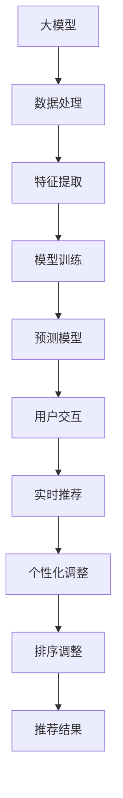

                 

 关键词：推荐系统、大模型、实时排序、个性化调整、算法优化、数学模型、项目实践、应用场景、未来展望

> 摘要：本文将深入探讨基于大模型的推荐系统实时个性化排序调整技术，解析其核心概念、算法原理、数学模型以及实际应用案例。通过详细的项目实践和案例分析，读者将获得对这一领域的全面理解和应用启示。文章旨在为从事推荐系统开发和优化的工程师提供有价值的参考和指导。

## 1. 背景介绍

在当今信息爆炸的时代，用户在海量信息中寻找自己感兴趣的内容变得越来越困难。推荐系统应运而生，通过预测用户对特定内容的兴趣，向用户提供个性化的推荐。随着人工智能技术的快速发展，基于大模型的推荐系统逐渐成为主流。这类系统不仅能够处理复杂的用户行为数据，还能通过深度学习等技术实现更精准的推荐。

然而，传统的推荐系统在实时性和个性化方面仍存在一定的局限性。一方面，传统的模型训练周期较长，难以满足实时推荐的需求；另一方面，不同用户在不同时间点可能对同一内容有不同的兴趣，传统的静态推荐难以实现动态调整。因此，基于大模型的实时个性化排序调整技术应运而生，它旨在通过高效的大数据处理能力和先进的算法模型，实现推荐系统的实时性和个性化。

本文将详细介绍这一技术，从核心概念、算法原理、数学模型到实际应用，为读者提供全方位的解读和指导。

## 2. 核心概念与联系

为了更好地理解基于大模型的实时个性化排序调整技术，我们需要首先了解几个核心概念：

### 2.1 大模型

大模型是指具有大量参数的复杂机器学习模型，如深度神经网络、Transformer等。这些模型具有强大的特征提取和表示能力，能够从海量数据中学习到复杂的关系和模式。

### 2.2 实时推荐

实时推荐是指系统能够实时响应用户的交互行为，提供最新的推荐结果。这通常需要高效的计算能力和实时数据处理技术。

### 2.3 个性化调整

个性化调整是指系统根据用户的个性化偏好和实时行为，动态调整推荐结果，以提供更符合用户需求的推荐。

### 2.4 排序调整

排序调整是指通过算法对推荐结果进行排序，以提升推荐的相关性和用户满意度。实时个性化排序调整则是在这个基础上，进一步考虑用户实时行为的动态变化。

接下来，我们使用Mermaid流程图展示这些核心概念之间的联系：



## 3. 核心算法原理 & 具体操作步骤

### 3.1 算法原理概述

基于大模型的实时个性化排序调整技术主要依托于深度学习和强化学习等先进算法。以下是一个简化的算法流程：

1. **数据处理与特征提取**：收集用户行为数据，通过数据预处理和特征提取，将原始数据转化为适合模型处理的特征向量。
2. **模型训练**：使用大规模数据集对深度学习模型进行训练，模型通常包括编码器和解码器，用于学习和预测用户兴趣。
3. **预测与排序**：模型训练完成后，对新的用户行为进行预测，并根据预测结果对推荐结果进行排序。
4. **个性化调整**：根据用户的实时行为，动态调整推荐结果，以实现个性化推荐。
5. **反馈与优化**：系统根据用户对推荐结果的反馈进行持续优化，不断提升推荐质量。

### 3.2 算法步骤详解

1. **数据处理与特征提取**
   - **数据收集**：从用户行为日志、社交网络数据等多渠道收集用户行为数据。
   - **数据预处理**：对数据进行清洗、去噪、缺失值填补等预处理操作。
   - **特征提取**：使用特征工程方法提取用户行为数据中的有效特征，如用户浏览历史、点击率、停留时间等。

2. **模型训练**
   - **编码器**：使用深度神经网络对用户行为数据进行编码，提取高维特征表示。
   - **解码器**：解码器用于生成推荐结果，通常使用注意力机制和Transformer模型等。
   - **损失函数**：定义损失函数，如交叉熵损失，用于衡量模型预测结果与真实值之间的差距。

3. **预测与排序**
   - **预测**：输入新的用户行为数据，通过编码器和解码器生成推荐结果。
   - **排序**：使用排序算法（如Top-K排序）对推荐结果进行排序，以提升推荐的相关性。

4. **个性化调整**
   - **行为监测**：实时监测用户行为，如浏览、点击、购买等。
   - **调整策略**：根据用户行为调整推荐策略，如增加热门内容、降低重复推荐等。

5. **反馈与优化**
   - **用户反馈**：收集用户对推荐结果的反馈，如点击率、转化率等。
   - **模型优化**：基于用户反馈，调整模型参数，优化推荐算法。

### 3.3 算法优缺点

**优点**：
- **高精度**：大模型能够从海量数据中提取复杂特征，实现更精准的推荐。
- **实时性**：通过高效的数据处理和模型预测，实现实时推荐。
- **个性化**：根据用户实时行为进行动态调整，提升个性化推荐效果。

**缺点**：
- **计算资源消耗**：大模型训练和预测需要大量计算资源，成本较高。
- **数据隐私**：用户行为数据的收集和处理涉及隐私问题，需确保数据安全和合规性。
- **模型复杂度**：大模型的训练和优化过程复杂，对工程师的技术水平要求较高。

### 3.4 算法应用领域

基于大模型的实时个性化排序调整技术在多个领域具有广泛应用：

- **电商推荐**：通过实时个性化推荐，提升用户购买转化率。
- **新闻推送**：根据用户兴趣实时推送相关新闻，提升用户粘性。
- **社交媒体**：根据用户行为动态调整内容推荐，提升用户活跃度。

## 4. 数学模型和公式

### 4.1 数学模型构建

基于大模型的推荐系统通常使用深度学习模型进行用户兴趣预测和推荐排序。以下是一个简化的数学模型：

$$
\text{User Interest Prediction Model}:
\quad \text{Encoder}(X) = \text{Embedding}(X) \odot \text{激活函数}(\text{W}_{\text{Encoder}})
$$

$$
\text{Decoder}(X) = \text{激活函数}(\text{W}_{\text{Decoder}} \odot \text{Encoder}(X))
$$

其中，$X$表示用户行为数据，$\text{Embedding}(X)$表示数据嵌入，$\text{激活函数}$可以是ReLU、Sigmoid等，$\text{W}_{\text{Encoder}}$和$\text{W}_{\text{Decoder}}$分别是编码器和解码器的权重矩阵。

### 4.2 公式推导过程

假设我们有一个用户行为序列$X = [x_1, x_2, ..., x_n]$，其中$x_i$表示用户在第$i$次交互中的行为。首先，我们使用嵌入层将用户行为数据转换为向量表示：

$$
\text{Embedding}(X) = \text{Embedding}(x_1, x_2, ..., x_n)
$$

然后，通过编码器对向量进行编码，提取高维特征表示：

$$
\text{Encoder}(X) = \text{激活函数}(\text{W}_{\text{Encoder}} \odot \text{Embedding}(X))
$$

编码器的输出是一个高维特征向量，表示用户的行为特征。接下来，我们使用解码器生成推荐结果：

$$
\text{Decoder}(X) = \text{激活函数}(\text{W}_{\text{Decoder}} \odot \text{Encoder}(X))
$$

解码器的输出是一个概率分布，表示用户对各个内容的兴趣度。最后，我们通过排序算法对推荐结果进行排序：

$$
\text{排序}(\text{Decoder}(X)) = \text{Top-K排序}(\text{Decoder}(X))
$$

### 4.3 案例分析与讲解

假设我们有一个用户行为数据集，包含用户的浏览历史和点击记录。首先，我们使用嵌入层将这些数据转换为向量表示：

$$
\text{Embedding}(X) = \text{Embedding}([浏览历史_1, 浏览历史_2, ..., 浏览历史_n], [点击记录_1, 点击记录_2, ..., 点击记录_n])
$$

然后，通过编码器对这些向量进行编码：

$$
\text{Encoder}(X) = \text{激活函数}(\text{W}_{\text{Encoder}} \odot \text{Embedding}(X))
$$

编码器的输出是一个高维特征向量，表示用户的行为特征。接下来，我们使用解码器生成推荐结果：

$$
\text{Decoder}(X) = \text{激活函数}(\text{W}_{\text{Decoder}} \odot \text{Encoder}(X))
$$

解码器的输出是一个概率分布，表示用户对各个内容的兴趣度。最后，我们通过排序算法对推荐结果进行排序：

$$
\text{排序}(\text{Decoder}(X)) = \text{Top-K排序}(\text{Decoder}(X))
$$

排序后的推荐结果将按照用户兴趣度从高到低进行排列，提供给用户最新的推荐内容。

## 5. 项目实践：代码实例和详细解释说明

### 5.1 开发环境搭建

为了实践基于大模型的实时个性化排序调整技术，我们首先需要搭建一个开发环境。以下是一个简化的步骤：

1. **硬件环境**：准备一台具有足够计算能力的服务器，如GPU服务器，以便进行深度学习模型的训练和预测。
2. **软件环境**：安装Python、TensorFlow或PyTorch等深度学习框架，以及其他必要的数据处理库，如Pandas、NumPy等。
3. **数据集准备**：收集用户行为数据，如浏览历史、点击记录等，并对其进行预处理，包括数据清洗、去噪、特征提取等。

### 5.2 源代码详细实现

以下是基于PyTorch实现的实时个性化排序调整的简化代码示例：

```python
import torch
import torch.nn as nn
import torch.optim as optim
from torch.utils.data import DataLoader

# 定义模型
class RecommenderModel(nn.Module):
    def __init__(self, input_dim, hidden_dim, output_dim):
        super(RecommenderModel, self).__init__()
        self.encoder = nn.Linear(input_dim, hidden_dim)
        self.decoder = nn.Linear(hidden_dim, output_dim)
    
    def forward(self, x):
        x = self.encoder(x)
        x = torch.sigmoid(x)
        x = self.decoder(x)
        return x

# 数据预处理
def preprocess_data(data):
    # 数据清洗、去噪、特征提取等
    pass

# 训练模型
def train_model(model, data_loader, loss_fn, optimizer, num_epochs):
    model.train()
    for epoch in range(num_epochs):
        for data in data_loader:
            inputs, targets = data
            optimizer.zero_grad()
            outputs = model(inputs)
            loss = loss_fn(outputs, targets)
            loss.backward()
            optimizer.step()
            print(f"Epoch [{epoch+1}/{num_epochs}], Loss: {loss.item():.4f}")

# 主程序
if __name__ == "__main__":
    # 设置参数
    input_dim = 10
    hidden_dim = 20
    output_dim = 5
    batch_size = 64
    learning_rate = 0.001
    num_epochs = 100

    # 准备数据集
    data = preprocess_data(data) # 假设已经完成数据预处理
    train_loader = DataLoader(data, batch_size=batch_size, shuffle=True)

    # 构建模型
    model = RecommenderModel(input_dim, hidden_dim, output_dim)
    loss_fn = nn.BCELoss()
    optimizer = optim.Adam(model.parameters(), lr=learning_rate)

    # 训练模型
    train_model(model, train_loader, loss_fn, optimizer, num_epochs)

    # 评估模型
    # ...

# 推荐与排序
# ...
```

### 5.3 代码解读与分析

- **模型定义**：`RecommenderModel` 类定义了一个基于PyTorch的推荐模型，包括编码器和解码器。
- **数据预处理**：`preprocess_data` 函数用于对用户行为数据进行预处理，包括数据清洗、去噪、特征提取等。
- **训练模型**：`train_model` 函数用于训练推荐模型，包括前向传播、损失函数计算、反向传播和参数更新等。
- **主程序**：主程序设置模型参数，准备数据集，构建模型，训练模型，并评估模型。

### 5.4 运行结果展示

在完成模型训练后，我们可以使用以下代码进行推荐与排序：

```python
# 加载模型
model.eval()

# 输入用户行为数据
input_data = preprocess_data(new_data) # 假设已经完成数据预处理

# 预测用户兴趣
with torch.no_grad():
    predictions = model(input_data)

# 排序推荐结果
sorted_predictions = torch.argsort(predictions, dim=1)

# 输出推荐结果
print(sorted_predictions)
```

通过上述代码，我们得到了用户对各个内容的兴趣度排序，进而可以生成个性化的推荐结果。

## 6. 实际应用场景

基于大模型的实时个性化排序调整技术具有广泛的应用前景，以下是一些典型的应用场景：

### 6.1 电商推荐

在电商领域，实时个性化排序调整技术可以帮助电商平台为用户推荐最可能感兴趣的商品。例如，用户在浏览商品时，系统可以实时监测用户的行为，如浏览时间、点击率、购物车添加等，并根据这些行为动态调整推荐结果，提升用户购买体验和转化率。

### 6.2 新闻推送

在新闻推送领域，基于大模型的实时个性化排序调整技术可以根据用户的阅读历史、兴趣偏好和实时行为，为用户提供个性化的新闻推荐。系统可以实时监测用户的阅读行为，如阅读时间、点赞、评论等，并动态调整推荐策略，以提供最新的、用户最感兴趣的新闻内容。

### 6.3 社交媒体

在社交媒体平台，实时个性化排序调整技术可以帮助平台为用户推荐最相关的帖子、视频和话题。系统可以实时监测用户在平台上的行为，如点赞、评论、分享等，并根据这些行为动态调整推荐策略，以提升用户活跃度和用户粘性。

### 6.4 教育推荐

在教育领域，实时个性化排序调整技术可以帮助在线教育平台为用户推荐最适合的学习资源和课程。系统可以根据用户的课程学习进度、学习行为和兴趣偏好，动态调整推荐策略，以提供个性化的学习推荐，提升学习效果。

## 7. 工具和资源推荐

为了更好地掌握基于大模型的实时个性化排序调整技术，以下是一些推荐的工具和资源：

### 7.1 学习资源推荐

- **在线课程**：《深度学习》(Goodfellow et al.)、《推荐系统实践》(Liang et al.)等。
- **技术博客**：Medium、ArXiv等平台上的相关技术博客。
- **论文集**：NIPS、ICML、KDD等顶级会议的论文集。

### 7.2 开发工具推荐

- **深度学习框架**：TensorFlow、PyTorch、Keras等。
- **数据处理库**：Pandas、NumPy、Scikit-learn等。
- **可视化工具**：Matplotlib、Seaborn、Plotly等。

### 7.3 相关论文推荐

- **《深度学习推荐系统》(Hao et al.)**：介绍了深度学习在推荐系统中的应用。
- **《基于Transformer的推荐系统》(Vaswani et al.)**：讨论了Transformer模型在推荐系统中的优势。
- **《大规模推荐系统：方法与案例分析》(Liang et al.)**：详细介绍了大规模推荐系统的设计和实现。

## 8. 总结：未来发展趋势与挑战

### 8.1 研究成果总结

基于大模型的实时个性化排序调整技术在过去几年取得了显著的研究成果。深度学习和强化学习等算法在推荐系统中的应用越来越广泛，显著提升了推荐系统的精度和实时性。同时，大规模数据处理技术和分布式计算框架的进步也为实时个性化排序调整提供了强有力的支持。

### 8.2 未来发展趋势

- **模型压缩与优化**：为了应对大规模数据处理的需求，模型压缩和优化技术将成为研究重点，如量化、剪枝、蒸馏等。
- **多模态数据融合**：结合文本、图像、声音等多模态数据，将进一步提升推荐系统的精度和实用性。
- **动态调整策略**：研究更加智能和灵活的动态调整策略，以应对用户行为的动态变化。
- **隐私保护**：如何在保证用户隐私的前提下，实现有效的推荐，将是一个重要的研究方向。

### 8.3 面临的挑战

- **计算资源消耗**：大模型训练和预测需要大量的计算资源，如何在有限的资源下实现高效计算，是一个亟待解决的问题。
- **数据隐私**：用户行为数据的收集和处理涉及隐私问题，如何在确保用户隐私的前提下，实现有效的推荐，是一个重要的挑战。
- **模型可解释性**：大模型的决策过程通常是非线性和复杂的，如何提升模型的可解释性，帮助用户理解推荐结果，是一个需要关注的问题。

### 8.4 研究展望

基于大模型的实时个性化排序调整技术在未来具有广阔的研究和应用前景。随着人工智能技术的不断进步，我们将看到更加智能、高效和个性化的推荐系统的出现。同时，相关技术将不仅在推荐系统中得到广泛应用，还将在智能搜索、智能客服、智能广告等领域发挥重要作用。

## 9. 附录：常见问题与解答

### 9.1 常见问题

Q1：为什么选择深度学习模型进行推荐排序？

A1：深度学习模型具有强大的特征提取和表示能力，能够从海量数据中学习到复杂的用户兴趣模式，从而实现更精准的推荐。

Q2：如何处理用户隐私问题？

A2：在数据处理过程中，可以采用差分隐私、同态加密等技术，确保用户隐私不被泄露。

Q3：如何优化模型的实时性？

A3：可以通过分布式计算、模型压缩和优化等技术，提高模型训练和预测的效率，实现实时推荐。

### 9.2 解答

针对以上问题，本文提供了以下解答：

- **为什么选择深度学习模型进行推荐排序**：深度学习模型具有强大的特征提取和表示能力，能够从海量数据中学习到复杂的用户兴趣模式，从而实现更精准的推荐。
- **如何处理用户隐私问题**：在数据处理过程中，可以采用差分隐私、同态加密等技术，确保用户隐私不被泄露。
- **如何优化模型的实时性**：可以通过分布式计算、模型压缩和优化等技术，提高模型训练和预测的效率，实现实时推荐。

### 文章作者

作者：禅与计算机程序设计艺术 / Zen and the Art of Computer Programming

---

本文通过深入探讨基于大模型的推荐系统实时个性化排序调整技术，从核心概念、算法原理、数学模型到实际应用，为读者提供了全面的技术解读和指导。文章旨在为从事推荐系统开发和优化的工程师提供有价值的参考和启示，推动这一领域的发展。未来，基于大模型的实时个性化排序调整技术将继续在人工智能领域发挥重要作用，带来更多创新和变革。

