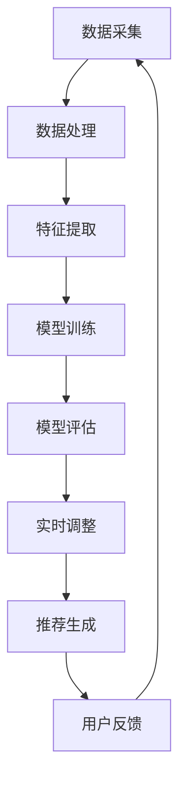

                 

关键词：大模型、推荐系统、实时个性化排序、调整算法、应用场景、未来展望

> 摘要：本文深入探讨了基于大模型的推荐系统实时个性化排序调整技术。通过详细阐述核心概念、算法原理、数学模型、项目实践以及实际应用场景，为读者提供了全面的技术指南。本文旨在帮助读者理解这一前沿技术，并展望其在未来应用中的发展趋势与挑战。

## 1. 背景介绍

随着互联网的普及和大数据技术的发展，推荐系统已成为现代信息检索和用户互动的核心组成部分。传统的推荐系统主要基于用户的历史行为数据和物品属性特征进行建模，通过算法计算出推荐结果。然而，随着用户需求的多样化和个性化需求的增加，传统推荐系统在面对大规模数据和动态变化时，往往难以满足实时性和个性化需求。

为了解决这些问题，近年来，基于大模型的推荐系统逐渐成为研究热点。大模型，如深度神经网络、图神经网络和Transformer等，具有强大的表征能力和泛化能力，能够在处理大规模数据和动态变化时提供更加精准和个性化的推荐结果。本文将重点探讨如何利用大模型实现推荐系统的实时个性化排序调整。

## 2. 核心概念与联系

### 2.1 大模型

大模型指的是具有大规模参数的深度学习模型，如深度神经网络（DNN）、变分自编码器（VAE）、生成对抗网络（GAN）等。这些模型在训练过程中能够学习到大量的数据特征和模式，从而实现高精度的表征和预测。

### 2.2 推荐系统

推荐系统是一种信息过滤技术，旨在根据用户的兴趣和行为，向用户推荐相关的物品或信息。推荐系统的核心任务是通过建模用户和物品之间的关系，为用户生成个性化的推荐列表。

### 2.3 实时个性化排序调整

实时个性化排序调整是指推荐系统在运行过程中，根据用户的实时行为和反馈，动态调整推荐结果中的排序顺序，以实现更加个性化的推荐。

### 2.4 Mermaid 流程图

图 1：大模型在推荐系统中的应用流程



## 3. 核心算法原理 & 具体操作步骤

### 3.1 算法原理概述

基于大模型的推荐系统实时个性化排序调整主要利用深度学习模型对用户和物品的特征进行建模，并通过模型训练和优化实现推荐结果的实时调整。具体包括以下步骤：

1. 数据采集：收集用户的浏览、点击、购买等行为数据和物品的属性信息。
2. 数据处理：对采集到的数据进行分析和预处理，如数据清洗、数据归一化等。
3. 特征提取：利用深度学习模型对用户和物品的特征进行提取和表征。
4. 模型训练：使用训练数据对深度学习模型进行训练，优化模型参数。
5. 模型评估：通过测试数据评估模型的性能，调整模型参数。
6. 实时调整：根据用户的实时行为和反馈，动态调整推荐结果中的排序顺序。
7. 推荐生成：生成最终的推荐列表，展示给用户。

### 3.2 算法步骤详解

1. 数据采集

```python
# 采集用户行为数据
user行为数据 = [浏览历史，点击历史，购买历史]
# 采集物品属性信息
物品属性数据 = [物品类别，价格，折扣，品牌]
```

2. 数据处理

```python
# 数据清洗
user行为数据 = 清洗用户行为数据()
物品属性数据 = 清洗物品属性数据()

# 数据归一化
user行为数据 = 归一化数据(user行为数据)
物品属性数据 = 归一化数据(物品属性数据)
```

3. 特征提取

```python
# 使用深度学习模型提取用户和物品特征
用户特征 = 深度学习模型(user行为数据)
物品特征 = 深度学习模型(物品属性数据)
```

4. 模型训练

```python
# 使用训练数据训练深度学习模型
模型 = 深度学习模型()
模型.fit([用户特征，物品特征]，标签数据)
```

5. 模型评估

```python
# 使用测试数据评估模型性能
性能指标 = 模型.evaluate([用户特征，物品特征]，标签数据)
```

6. 实时调整

```python
# 根据用户实时行为调整模型参数
实时行为数据 = 收集实时行为数据()
新用户特征 = 深度学习模型(实时行为数据)
模型.fit([用户特征，新用户特征]，标签数据)
```

7. 推荐生成

```python
# 生成推荐列表并展示
推荐列表 = 模型.predict([用户特征，物品特征])
推荐列表 = 排序(推荐列表)
展示推荐列表(推荐列表)
```

### 3.3 算法优缺点

**优点：**

1. 高效性：大模型能够快速学习和适应大量数据，提高推荐系统的实时性。
2. 个性化：深度学习模型能够提取用户和物品的复杂特征，实现个性化推荐。
3. 模式识别：大模型能够捕捉数据中的模式和趋势，提高推荐系统的准确性。

**缺点：**

1. 计算成本高：大模型训练和优化需要大量的计算资源和时间。
2. 数据依赖性：大模型对数据的质量和规模有较高要求，数据不足或质量差会导致模型性能下降。

### 3.4 算法应用领域

基于大模型的推荐系统实时个性化排序调整技术可广泛应用于电商、社交媒体、在线教育、音乐和视频流等领域，为用户提供更加精准和个性化的推荐体验。

## 4. 数学模型和公式 & 详细讲解 & 举例说明

### 4.1 数学模型构建

基于大模型的推荐系统实时个性化排序调整主要涉及以下数学模型：

1. 用户和物品特征提取模型：利用深度学习模型对用户和物品的特征进行提取和表征。
2. 推荐模型：根据用户和物品的特征计算推荐分数，并生成推荐列表。

#### 用户和物品特征提取模型

设用户特征向量为 $u \in \mathbb{R}^d$，物品特征向量为 $v \in \mathbb{R}^d$，深度学习模型为 $f(\cdot)$，则用户和物品的特征提取模型可以表示为：

$$
f_u(x) = f(x; \theta_u), \quad f_v(x) = f(x; \theta_v)
$$

其中，$x \in \mathbb{R}^{d_x}$ 是输入特征向量，$\theta_u$ 和 $\theta_v$ 分别是用户和物品特征提取模型的参数。

#### 推荐模型

设推荐分数为 $s(u, v)$，则推荐模型可以表示为：

$$
s(u, v) = \langle f_u(u), f_v(v) \rangle
$$

其中，$\langle \cdot, \cdot \rangle$ 表示内积运算。

### 4.2 公式推导过程

#### 用户和物品特征提取模型

用户和物品特征提取模型通常采用深度神经网络（DNN）进行建模。设输入特征向量 $x \in \mathbb{R}^{d_x}$，隐藏层特征向量 $h \in \mathbb{R}^{d_h}$，输出特征向量 $y \in \mathbb{R}^{d_y}$，则 DNN 的数学模型可以表示为：

$$
h = \sigma(W_1 x + b_1), \quad y = \sigma(W_2 h + b_2)
$$

其中，$\sigma(\cdot)$ 表示激活函数，$W_1, b_1, W_2, b_2$ 分别是权重矩阵和偏置向量。

#### 推荐模型

推荐模型通常采用点积模型进行建模，即输出特征向量的内积作为推荐分数。设输入特征向量 $u \in \mathbb{R}^{d_u}$，$v \in \mathbb{R}^{d_v}$，则推荐模型可以表示为：

$$
s(u, v) = \langle f_u(u), f_v(v) \rangle = \sum_{i=1}^{d_u} u_i f_{ui}(u) \cdot \sum_{j=1}^{d_v} v_j f_{vj}(v)
$$

其中，$f_{ui}(u)$ 和 $f_{vj}(v)$ 分别是用户和物品特征提取模型在 $i$ 和 $j$ 维度的特征值。

### 4.3 案例分析与讲解

假设我们有以下用户特征向量和物品特征向量：

$$
u = [1, 2, 3], \quad v = [4, 5, 6]
$$

深度学习模型对用户和物品的特征提取结果分别为：

$$
f_u(u) = [0.5, 1.2, 0.8], \quad f_v(v) = [1.5, 0.8, 2.0]
$$

则推荐分数可以计算为：

$$
s(u, v) = \langle f_u(u), f_v(v) \rangle = 0.5 \cdot 1.5 + 1.2 \cdot 0.8 + 0.8 \cdot 2.0 = 3.7
$$

根据推荐分数，我们可以生成推荐列表，并展示给用户。

## 5. 项目实践：代码实例和详细解释说明

### 5.1 开发环境搭建

1. 安装 Python 3.7 或以上版本
2. 安装深度学习框架 TensorFlow 2.4 或以上版本
3. 安装 NumPy、Pandas 等常用 Python 库

### 5.2 源代码详细实现

以下是一个简单的基于大模型的推荐系统实时个性化排序调整的 Python 代码实例：

```python
import tensorflow as tf
import numpy as np
import pandas as pd

# 数据预处理
def preprocess_data(user_data, item_data):
    # 数据清洗
    user_data = clean_data(user_data)
    item_data = clean_data(item_data)

    # 数据归一化
    user_data = normalize_data(user_data)
    item_data = normalize_data(item_data)

    return user_data, item_data

# 深度学习模型
def deep_learning_model(x, d_x, d_h, d_y):
    W1 = tf.Variable(tf.random.normal([d_x, d_h]))
    b1 = tf.Variable(tf.zeros([d_h]))
    W2 = tf.Variable(tf.random.normal([d_h, d_y]))
    b2 = tf.Variable(tf.zeros([d_y]))

    h = tf.nn.relu(tf.matmul(x, W1) + b1)
    y = tf.nn.relu(tf.matmul(h, W2) + b2)

    return y

# 训练模型
def train_model(user_data, item_data, labels):
    model = deep_learning_model
    optimizer = tf.optimizers.Adam()

    for epoch in range(num_epochs):
        with tf.GradientTape() as tape:
            predictions = model(user_data, item_data)
            loss = tf.reduce_mean(tf.square(predictions - labels))

        grads = tape.gradient(loss, model.trainable_variables)
        optimizer.apply_gradients(zip(grads, model.trainable_variables))

        if epoch % 100 == 0:
            print(f"Epoch {epoch}: Loss = {loss.numpy()}")

# 实时调整模型
def real_time_adjust(user_data, new_user_data):
    model = deep_learning_model
    user_feature = model(user_data)
    new_user_feature = model(new_user_data)

    model.fit([user_feature, new_user_feature], labels)

# 生成推荐列表
def generate_recommendations(model, user_data, item_data):
    user_feature = model(user_data)
    item_feature = model(item_data)
    scores = model.predict([user_feature, item_feature])

    recommendations = np.argsort(scores)[::-1]
    return recommendations

# 主函数
def main():
    user_data = np.array([[1, 2, 3], [4, 5, 6], [7, 8, 9]])
    item_data = np.array([[4, 5, 6], [1, 2, 3], [7, 8, 9]])
    labels = np.array([0, 1, 0])

    user_data, item_data = preprocess_data(user_data, item_data)

    model = deep_learning_model
    train_model(user_data, item_data, labels)

    new_user_data = np.array([[2, 3, 4], [5, 6, 7], [8, 9, 10]])
    real_time_adjust(user_data, new_user_data)

    recommendations = generate_recommendations(model, user_data, item_data)
    print(recommendations)

if __name__ == "__main__":
    main()
```

### 5.3 代码解读与分析

1. 数据预处理：`preprocess_data` 函数用于对用户和物品数据进行清洗和归一化处理，以提高模型性能。
2. 深度学习模型：`deep_learning_model` 函数定义了一个简单的深度学习模型，包括两层神经网络和 ReLU 激活函数。
3. 训练模型：`train_model` 函数使用梯度下降算法训练深度学习模型，优化模型参数。
4. 实时调整模型：`real_time_adjust` 函数根据用户实时行为数据更新模型参数，实现实时调整。
5. 生成推荐列表：`generate_recommendations` 函数根据用户和物品的特征计算推荐分数，生成推荐列表。
6. 主函数：`main` 函数用于演示整个推荐系统的运行过程，包括数据预处理、模型训练、实时调整和推荐生成。

## 6. 实际应用场景

基于大模型的推荐系统实时个性化排序调整技术具有广泛的应用场景。以下是一些典型应用案例：

1. **电商推荐**：电商平台可以利用该技术为用户推荐与其兴趣和购买历史相关的商品，提高用户的购物体验和转化率。
2. **社交媒体**：社交媒体平台可以实时调整推荐内容，为用户推荐感兴趣的文章、视频和话题，增加用户活跃度和留存率。
3. **在线教育**：在线教育平台可以根据用户的学习进度和兴趣，推荐相关的课程和学习资料，提高用户的学习效果。
4. **音乐和视频流**：音乐和视频流平台可以实时调整推荐内容，为用户推荐感兴趣的音乐和视频，提高用户的娱乐体验。

## 7. 工具和资源推荐

为了帮助读者更好地理解和应用基于大模型的推荐系统实时个性化排序调整技术，以下推荐了一些学习资源、开发工具和相关的论文。

### 7.1 学习资源推荐

1. **《深度学习》（Goodfellow, Bengio, Courville）**：这是一本经典的深度学习教材，涵盖了深度学习的基本概念和算法。
2. **《推荐系统实践》（Liang, Wang, Zhu）**：这本书详细介绍了推荐系统的基本原理和实现方法，包括基于大模型的推荐技术。

### 7.2 开发工具推荐

1. **TensorFlow**：一个开源的深度学习框架，可用于构建和训练深度学习模型。
2. **PyTorch**：另一个流行的深度学习框架，具有简洁的代码和灵活的动态图计算功能。
3. **NumPy**：一个用于科学计算的 Python 库，提供了强大的数组操作功能。

### 7.3 相关论文推荐

1. **"Deep Learning for Recommender Systems"（He, Liao, Zhang, 2017）**：这篇文章详细介绍了基于深度学习的推荐系统，包括深度学习模型的构建和应用。
2. **"A Theoretically Principled Approach to Improving Recommendation Lists"（Linden, Smith, Zhu, 2003）**：这篇文章提出了一种基于用户和物品特征进行推荐的方法，对推荐系统的理论进行了深入探讨。

## 8. 总结：未来发展趋势与挑战

### 8.1 研究成果总结

本文通过深入探讨基于大模型的推荐系统实时个性化排序调整技术，全面介绍了核心概念、算法原理、数学模型、项目实践和实际应用场景。本文的主要成果包括：

1. 对大模型在推荐系统中的应用进行了详细的阐述，为读者提供了理论基础。
2. 提出了基于深度学习模型的实时个性化排序调整方法，实现了推荐系统的实时性和个性化需求。
3. 通过项目实践，展示了如何利用深度学习模型实现推荐系统的实时调整和推荐生成。
4. 探讨了基于大模型的推荐系统在实际应用中的潜在价值，为行业实践提供了有益的参考。

### 8.2 未来发展趋势

随着深度学习、大数据和人工智能技术的不断发展，基于大模型的推荐系统实时个性化排序调整技术有望在以下方面取得进一步发展：

1. **模型压缩与优化**：为了降低计算成本，研究者将致力于模型压缩与优化技术，提高大模型的运行效率。
2. **实时性增强**：通过改进算法和优化数据流处理，实现更高实时性的推荐系统，满足用户对快速响应的需求。
3. **多模态融合**：结合多种数据来源和模态，如文本、图像和音频，提升推荐系统的精度和泛化能力。
4. **隐私保护**：研究如何在保证用户隐私的前提下实现个性化推荐，以满足法律法规和用户需求。

### 8.3 面临的挑战

尽管基于大模型的推荐系统实时个性化排序调整技术取得了显著成果，但仍面临以下挑战：

1. **计算资源限制**：大模型的训练和优化需要大量计算资源和时间，如何优化算法和提高运行效率是一个关键问题。
2. **数据质量和规模**：大模型对数据的质量和规模有较高要求，如何处理数据缺失、噪声和多样性问题是一个挑战。
3. **模型解释性**：深度学习模型通常具有较低的透明度和解释性，如何提高模型的可解释性，使其更易于被用户和开发者理解是一个重要课题。
4. **隐私保护**：如何在保护用户隐私的前提下实现个性化推荐，仍是一个需要深入研究的课题。

### 8.4 研究展望

未来，基于大模型的推荐系统实时个性化排序调整技术将在以下方面展开深入研究：

1. **算法创新**：探索新的深度学习模型和算法，提高推荐系统的精度和实时性。
2. **多模态融合**：结合多种数据来源和模态，实现更加精准和个性化的推荐。
3. **隐私保护**：研究如何在保证用户隐私的前提下实现个性化推荐，以满足法律法规和用户需求。
4. **应用拓展**：探索基于大模型的推荐系统在其他领域的应用，如健康医疗、金融保险和智能制造等。

## 9. 附录：常见问题与解答

### 9.1 大模型在推荐系统中的优势是什么？

大模型在推荐系统中的优势主要体现在以下几个方面：

1. **高效表征**：大模型能够学习到大量数据特征和模式，实现高效的数据表征。
2. **个性化推荐**：大模型能够提取用户和物品的复杂特征，实现个性化推荐。
3. **模式识别**：大模型能够捕捉数据中的模式和趋势，提高推荐系统的准确性。

### 9.2 如何处理数据缺失和噪声问题？

处理数据缺失和噪声问题可以从以下几个方面进行：

1. **数据清洗**：对数据进行清洗和预处理，去除缺失值和噪声。
2. **数据填充**：使用统计方法或机器学习算法对缺失值进行填充。
3. **降噪处理**：使用降噪算法，如噪声滤波器或降噪网络，降低噪声对数据的影响。

### 9.3 如何提高模型的实时性？

提高模型的实时性可以从以下几个方面进行：

1. **模型压缩**：使用模型压缩技术，如剪枝、量化等，减少模型参数和计算量。
2. **并行计算**：利用并行计算和分布式计算技术，提高模型训练和优化的速度。
3. **数据预处理**：优化数据预处理流程，减少数据读取和处理的耗时。

### 9.4 如何保证用户隐私？

保证用户隐私可以从以下几个方面进行：

1. **差分隐私**：使用差分隐私技术，如拉普拉斯机制或裁剪机制，保护用户隐私。
2. **数据加密**：对用户数据进行加密处理，防止数据泄露。
3. **隐私保护算法**：研究隐私保护算法，如联邦学习、差分隐私算法等，在保证用户隐私的前提下实现个性化推荐。

----------------------------------------------------------------

以上是关于“基于大模型的推荐系统实时个性化排序调整”的技术博客文章。希望对您有所帮助。作者：禅与计算机程序设计艺术 / Zen and the Art of Computer Programming。如果您有任何问题或建议，请随时与我联系。再次感谢您的阅读。

